# Imagens Pendentes — Conferência Visual

> Atualizado em 20/02/2026.
>
> **Parte 1 — Slides/Aulas:** Todas as 42 referências (37 únicas) possuem imagens no repositório. ✅
>
> **Parte 2 — Ebooks:** 122 imagens sugeridas para 4 livros (branding-agro, ciencia-paisagem, geotecnologias-sig, pi). ⬜ Pendentes.
>
> ✅ = Wikimedia Commons (CC) — rodada 1 | ✅🟢 = Wikimedia/Pexels — rodada 2 | ⬜ = Pendente
>
> Abra o **Preview do Markdown** (Ctrl+Shift+V) para conferir cada imagem inline.

---

## 1. Modelagem 3D de Raízes (Bioengenharia)

**Pasta:** `aulas/bioengenharia_de_solos/aulas/modelagem_3d_raizes/img/raizes_vetiver/`

### #1 — vetiver_perfil_raiz.jpg
Perfil lateral do sistema radicular de vetiver — Wikimedia: Vetiveria_zizanoides (CC-BY-SA 2.0/3.0, David Monniaux)

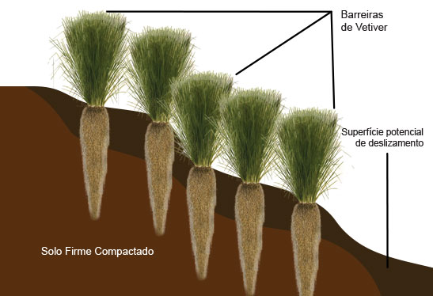

### #2 — vetiver_escala.png
Foto de campo: raízes de vetiver — mesma fonte de #1 (CC-BY-SA 2.0/3.0)

### #3 — vetiver_nuvem_pontos.png
Nuvem de pontos LiDAR — Wikimedia: Ouster OS1-64 (CC-BY 4.0, Daniel L. Lu)

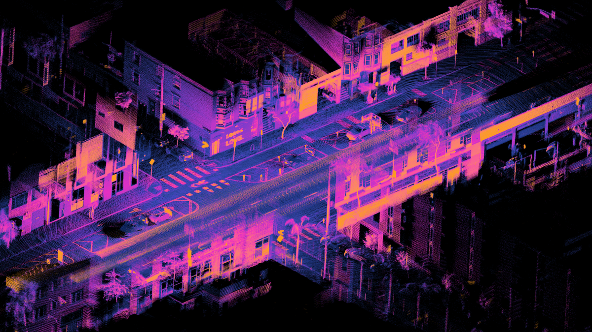

### #4 — vetiver_malha_3d.png
Malha 3D — Wikimedia: Suzanne/Blender monkey mesh (CC)

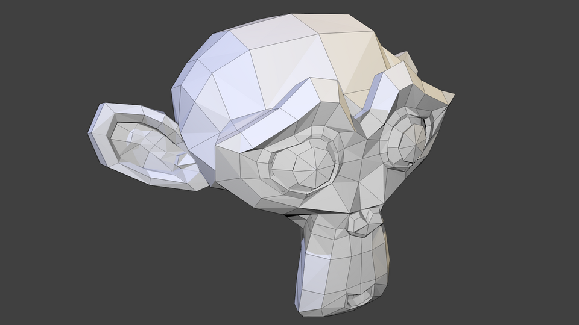

### #5 — vetiver_corte_rar.jpg
Corte transversal de raiz — Wikimedia: Ruscus hypophyllum (CC-BY-SA 4.0, TCdeOLiveira)

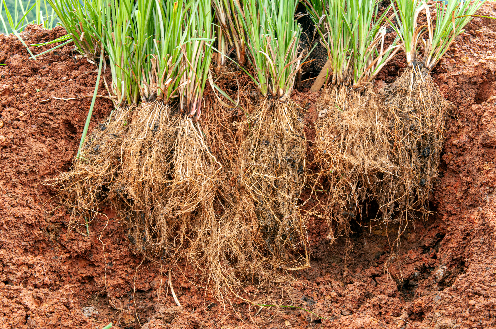

---

## 2. Extensão Rural

### 2a. ATER Pública e Privada

**Pasta:** `aulas/extensao_rural/aulas/ater_publica_privada/img/`

### #6 — emater_logo.png
Logotipo da EMATER-MG (CC-BY-SA 4.0, EMATER-MG/Wikimedia)

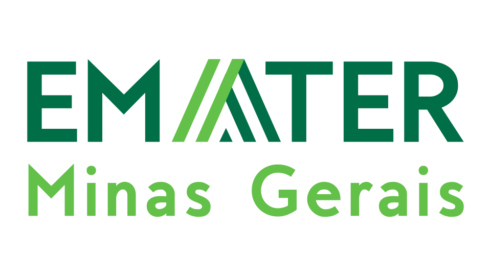

### 2b. Casos Práticos de Extensão

**Pasta:** `aulas/extensao_rural/aulas/casos_praticos_extensao/img/`

### #7 — cisterna_asa_semiarido.webp
Placa do programa de cisternas ASA no semiárido (CC-BY-SA 3.0 BR)

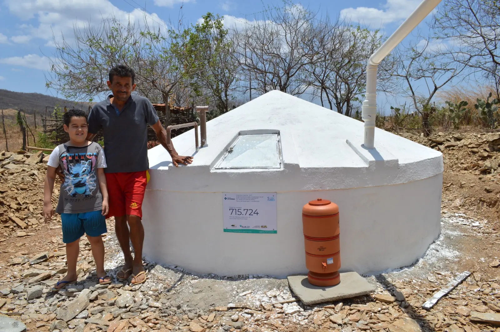

### #8 — cisterna_placa_serrinha_ba.jpg
Cisterna de placa em Serrinha/BA (CC-BY-SA 2.0, MDS/Wikimedia)

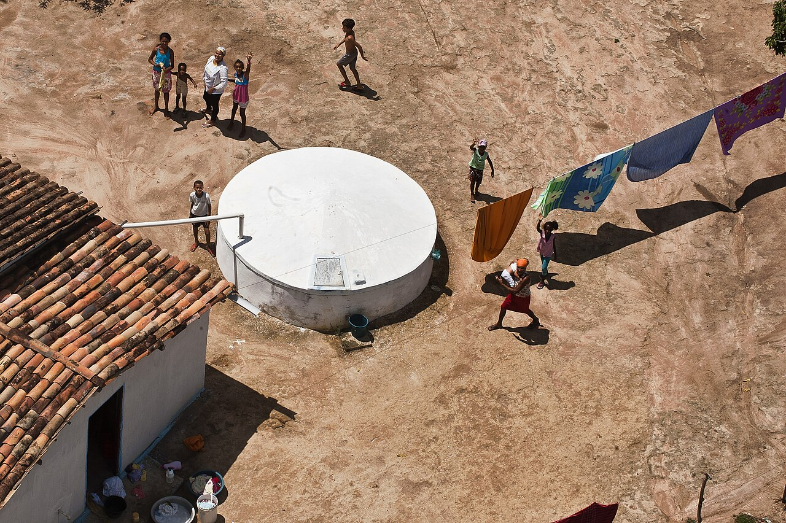

### #9 — ilpf_integracao_lavoura.jpg
Integração Lavoura-Pecuária-Floresta, Cachoeira Dourada/GO (CC-BY-SA 4.0)

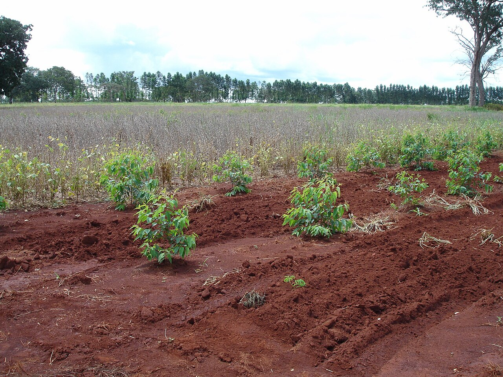

### 2c. Comunicação e Metodologias Participativas

**Pasta:** `aulas/extensao_rural/aulas/comunicacao_metodologias_participativas/img/`

### #10 — paulo_freire_1977.jpg
Paulo Freire, 1977 (Slobodan Dimitro, CC-BY-SA 3.0)

### #11 — metodo_paulo_freire.jpg
Ilustração do Método Paulo Freire — educação dialógica (André Koehne, CC-BY-SA 3.0)

---

## 3. Vida Útil de Biotêxteis (Geotexteis)

**Pasta:** `aulas/geotexteis/aulas/vida_util_biotexteis/img/`

### #12 — tear_fibras.jpg
Tear artesanal — Wikimedia: Handloom (CC-BY-SA 4.0, Rishikachauhan1)

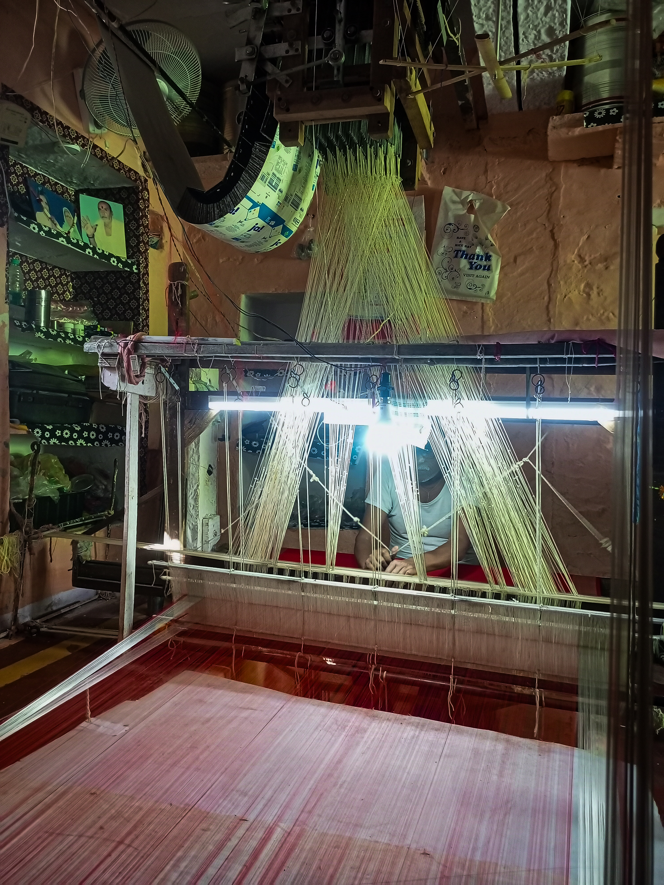

### #13 — talude_biotextil.jpeg
Talude/paisagem — Pexels #1534057 (Pexels License)

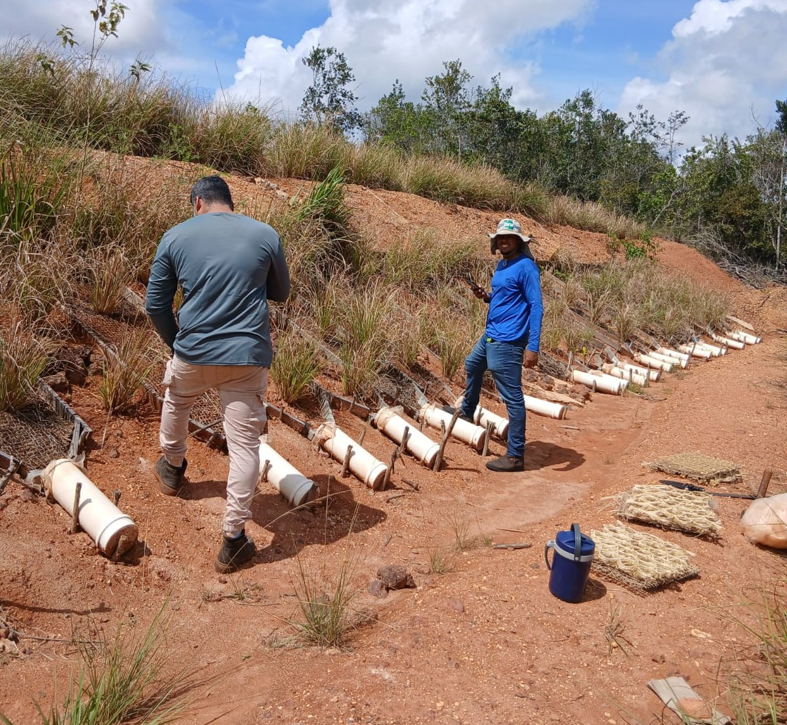

### #14 — camara_degradacao.png
Câmara UV — Wikimedia: UV_degradation_test_chamber (CC-BY-SA 3.0, Cjp24)

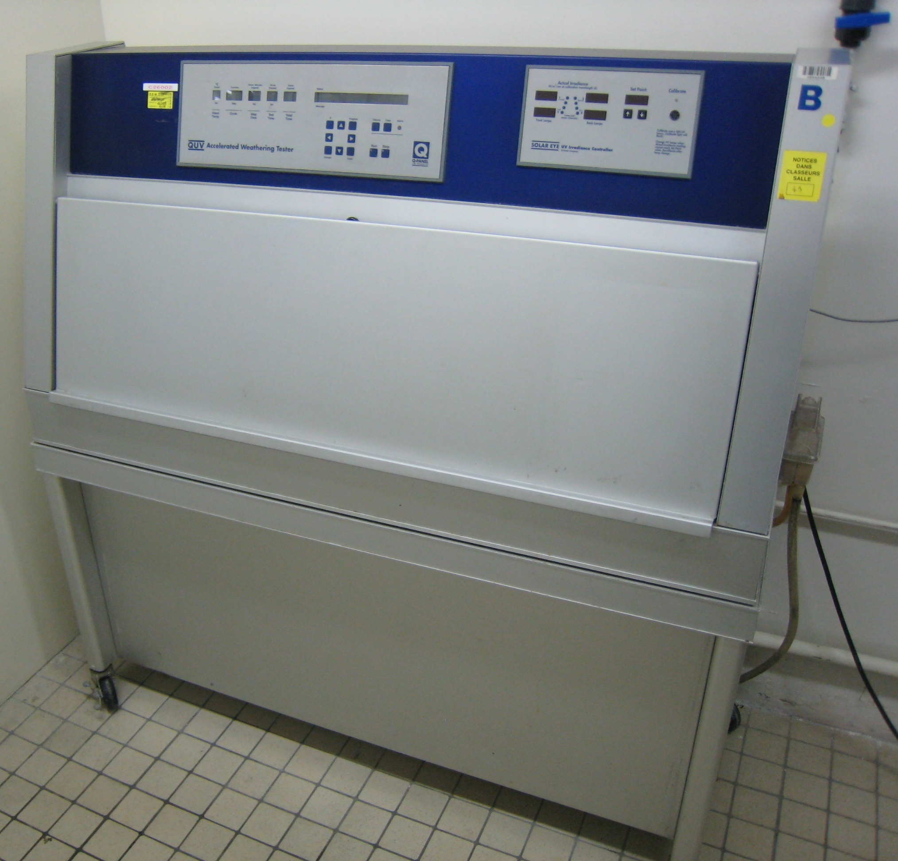

### #15 — coleta_campo.jpeg
Coleta de solo em campo — Wikimedia: Soil_sampling_in_field (CC-BY-SA 2.0, Gary Rogers)

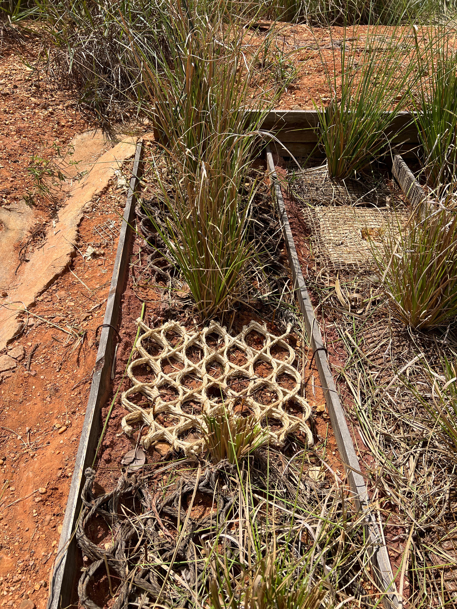

### #16 — maquina_universal.png
Ensaio de tração — Wikimedia: Tensile_testing_on_a_coir_composite (CC0, Kerina yin)

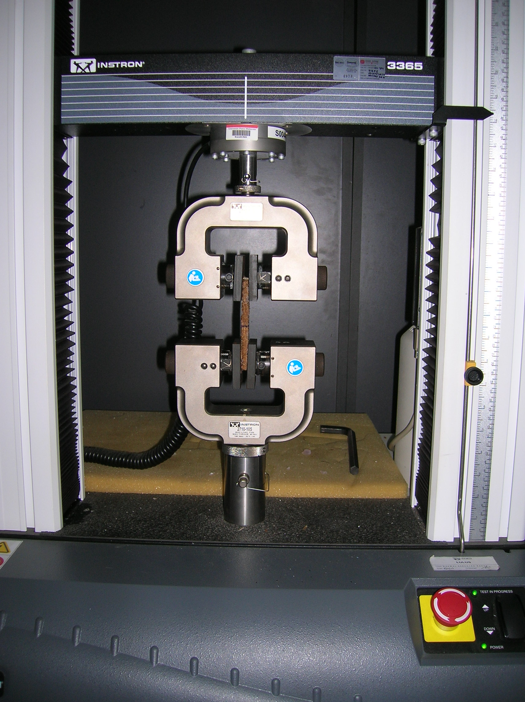

---

## 4. Ciência PI — Tema 01 (Gestão da Inovação Tecnológica)

**Pasta:** `aulas/ciencia_pi/SLIDES_QUARTO/Tema 01 - Gestao da Inovacao Tecnologica/tema01_apresentacao/Figuras/`

### #17 — intro.jpg
Lâmpada/inovação — Pexels #355948 (Pexels License)

### #18 — iso56002.jpg
Checklist/norma — Pexels #416322 (Pexels License)

### #19 — processo.jpg
Fluxograma no quadro — Pexels #1181311 (Pexels License)

### #20 — avaliacao.jpg
Análise de gráficos — Pexels #590041 (Pexels License)

### #21 — conclusao.jpg
Equipe colaborando — Pexels #3184299 (Pexels License)

---

## 5. Ciência PI — Tema 05 (Gestão de Projetos de Inovação)

**Pasta:** `aulas/ciencia_pi/SLIDES_QUARTO/Tema 05 - Gestao de Projetos inovacao/tema05_apresentacao/Figuras/`

### #22 — iso56005.jpg
Notas de negócio no quadro — Pexels #6913206 (Pexels License)

### #23 — gestao_pi_56005.png
Post-its brainstorming — Pexels #7793704 (Pexels License)

### #24 — oslo.png
Profissional revisando documento — Pexels #5439449 (Pexels License)

### #25 — trl_nasa.png
TRL NASA — Wikimedia (CC-BY-SA 4.0)

### #26 — technology_readiness_levels.png
NASA TRL Meter detalhado — Wikimedia (CC-BY-SA 4.0)

### #27 — stage_gate_process.png
Processo Stage-Gate — Wikimedia (CC-BY-SA 4.0)

### #28 — innovation_project_management.png
Parede de ideias — Pexels #212286 (Pexels License)

### #29 — capacidade_absortiva.png
Gráficos/análise — Pexels #7876381 (Pexels License)

### #30 — dynamic_capabilities.png
Robô xadrez/estratégia — Pexels #8438921 (Pexels License)

### #31 — patent_development_flow.png
Proceso 5 fases Stage-Gate — Wikimedia (CC-BY-SA 4.0)

### #32 — gestao_inovacao_modelos.png
Quadro branco fluxograma — Pexels #7369 (Pexels License)

---

## 6. Ciência PI — Tema 06 (Valoração de Ativos)

**Pasta:** `aulas/ciencia_pi/SLIDES_QUARTO/Tema 06 - Valoracao de ativos/tema06_apresentacao/Figuras/`

### #33 — intro.jpg
Escritório tech — Pexels #1714208 (Pexels License)

### #34 — metodos.jpg
Gráficos na área de transferência — Pexels #9304917 (Pexels License)

### #35 — comercializacao.jpg
Equipe no escritório — Pexels #7075 (Pexels License)

### #36 — nits.jpg
Cientistas em laboratório — Pexels #8439008 (Pexels License)

### #37 — conclusao.jpg
Apresentação para colegas — Pexels #3153198 (Pexels License)

---

## 7. Introdução à Estatística (arquivo-exemplo)

**Pasta:** `aulas/introducao_estatistica/Arquivos exemplo/Figuras/`

> Cópias idênticas das imagens #17–#21 (Tema 01).

### #38 — intro.jpg (= #17)

### #39 — iso56002.jpg (= #18)

### #40 — processo.jpg (= #19)

### #41 — avaliacao.jpg (= #20)

### #42 — conclusao.jpg (= #21)

---

## Resumo

| Grupo | Quantidade | Baixadas |
|-------|-----------|----------|
| Modelagem 3D raízes | 5 | ✅🟢 5 |
| Extensão Rural | 6 | ✅ 6 |
| Vida útil biotêxteis | 5 | ✅🟢 5 |
| Ciência PI — Tema 01 | 5 | ✅🟢 5 |
| Ciência PI — Tema 05 | 11 | ✅ 2 + ✅🟢 9 = 11 |
| Ciência PI — Tema 06 | 5 | ✅🟢 5 |
| Intro Estatística (cópia Tema 01) | 5 | ✅🟢 5 |
| **Total de imagens únicas** | **37** | **✅ 37** |
| **Total considerando cópias** | **42 referências** | **✅ 42** |

---

## Fontes e Licenças

### Wikimedia Commons (CC)
| # | Arquivo original Wikimedia | Licença | Autor |
|---|---------------------------|---------|-------|
| 1, 2 | Vetiveria_zizanoides_dsc07810.jpg | CC-BY-SA 2.0/3.0 | David Monniaux |
| 3 | Ouster_OS1-64_lidar_point_cloud | CC-BY 4.0 | Daniel L. Lu |
| 4 | Suzanne.png (Blender) | CC | Blender Foundation |
| 5 | Ruscus_hypophyllum_root_cross_section_detail.jpg | CC-BY-SA 4.0 | TCdeOLiveira |
| 6 | Emater_Logo.svg | CC-BY-SA 4.0 | EMATER-MG |
| 7 | Cisterna_da_ASA_(In_Piauí).JPG | CC-BY-SA 3.0 BR | — |
| 8 | Cisternas_na_área_rural_da_Bahia | CC-BY-SA 2.0 | MDS |
| 9 | Integração_Lavoura_Pecuária_Floresta_(ILPF).jpg | CC-BY-SA 4.0 | — |
| 10 | Paulo_Freire_1977.jpg | CC-BY-SA 3.0 | Slobodan Dimitro |
| 11 | Method_Paulo_Freire.jpg | CC-BY-SA 3.0 | André Koehne |
| 12 | Handloom.jpg | CC-BY-SA 4.0 | Rishikachauhan1 |
| 14 | UV_degradation_test_chamber.jpg | CC-BY-SA 3.0 | Cjp24 |
| 15 | Soil_sampling_in_field…geograph…5739011.jpg | CC-BY-SA 2.0 | Gary Rogers |
| 16 | Tensile_testing_on_a_coir_composite.jpg | CC0 | Kerina yin |
| 25 | NASA_TRL_Meter.svg | CC-BY-SA 4.0 | — |
| 26 | NASA_TRL_Meter_corrected_from_Hari_Seldon.svg | CC-BY-SA 4.0 | — |
| 27 | Stage-Gate_process.png | CC-BY-SA 4.0 | — |
| 31 | Proceso_5_fases.svg | CC-BY-SA 4.0 | Andres Eduardo Salazar |

### Pexels (Pexels License — livre para uso)
| # | Pexels ID | Descrição | Fotógrafo |
|---|-----------|-----------|-----------|
| 13 | 1534057 | Paisagem/talude | — |
| 17, 38 | 355948 | Lâmpada no quadro | Pixabay |
| 18, 39 | 416322 | Checklist | Pixabay |
| 19, 40 | 1181311 | Fluxograma whiteboard | divinetechygirl |
| 20, 41 | 590041 | Análise de gráficos | Goumbik |
| 21, 42 | 3184299 | Equipe brainstorming | fauxels |
| 22 | 6913206 | Notas no quadro | Tima Miroshnichenko |
| 23 | 7793704 | Post-its | Yan Krukau |
| 24 | 5439449 | Profissional revisando | Tima Miroshnichenko |
| 28 | 212286 | Parede de ideias | Startup Stock Photos |
| 29 | 7876381 | Gráficos | Karola Gr. |
| 30 | 8438921 | Robô xadrez | Pavel Danilyuk |
| 32 | 7369 | Quadro branco | Startup Stock Photos |
| 33 | 1714208 | Escritório tech | Josh Sorenson |
| 34 | 9304917 | Gráficos clipboard | Mikhail Nilov |
| 35 | 7075 | Equipe escritório | Startup Stock Photos |
| 36 | 8439008 | Cientistas laboratório | Pavel Danilyuk |
| 37 | 3153198 | Apresentação | Canvas Studio |
---
---

# PARTE 2 — Imagens Pendentes para Ebooks

> 4 livros com apenas imagem de capa. Total de **122 imagens** sugeridas para enriquecer os capítulos.
>
> **Legenda de fonte:**
> - 📷 = Foto disponível em Unsplash / Pexels / Wikimedia (licença livre)
> - 🗺️ = Imagem de satélite / mapa (NASA, ESA, MapBiomas, CPRM — domínio público ou CC)
> - 🎨 = Diagrama customizado (criar com Mermaid, draw.io, Canva, Python/R, QGIS)
> - 📸 = Screenshot de software (QGIS, GEE, FRAGSTATS, InVEST etc.)

---

## Ebook A — Gestão de Branding no Agro

**Pasta destino:** `books/branding-agro/img/`
**Capítulos:** 14 + index + prefácio = **32 imagens**

### A-01 ⬜ `agro_brasileiro_vista_aerea`
Vista aérea de grande fazenda brasileira (soja/cana) — escala do agronegócio
- **Posição:** Index, após "mais de um quarto do PIB nacional"
- **Fonte:** 📷 Unsplash/Pexels
- **Buscar:** `brazil farm aerial view`, `agribusiness plantation drone`, `cerrado agriculture aerial`

### A-02 ⬜ `produtor_rural_produto_marca`
Produtor rural segurando produto embalado com marca própria (café, queijo, mel)
- **Posição:** Index, após "Para quem é este livro"
- **Fonte:** 📷 Pexels/Unsplash
- **Buscar:** `farmer holding branded product`, `small farmer packaging`, `rural entrepreneur product`

### A-03 ⬜ `feira_produtor_rural_brasil`
Feira livre com bancas de produtores rurais — produtos sem identidade de marca
- **Posição:** Prefácio, após "O queijo artesanal maturado por meses"
- **Fonte:** 📷 Pexels/Wikimedia
- **Buscar:** `feira livre brasil`, `brazilian farmers market`, `mercado rural produtor`

### A-04 ⬜ `cafe_especial_graos_colheita`
Close de grãos de café maduros no pé, em mãos de trabalhador rural
- **Posição:** Prefácio, após "O problema era a invisibilidade da marca"
- **Fonte:** 📷 Unsplash/Pexels
- **Buscar:** `coffee cherry harvest hands`, `arabica coffee ripe beans`, `colheita café brasil`

### A-05 ⬜ `mecanizacao_agricultura_moderna`
Colheitadeira ou trator moderno em lavoura brasileira — democratização da tecnologia
- **Posição:** Cap. 1, após "Democratização do acesso à tecnologia"
- **Fonte:** 📷 Unsplash/Pexels
- **Buscar:** `modern agriculture machinery brazil`, `soybean harvest combine`, `precision agriculture tractor`

### A-06 ⬜ `consumidor_rastreabilidade_qrcode`
Consumidor escaneando QR code em embalagem de alimento no supermercado
- **Posição:** Cap. 1, após "Digitalização e transparência"
- **Fonte:** 📷 Pexels/Unsplash
- **Buscar:** `consumer scanning QR code food`, `food traceability label`, `smartphone grocery shopping origin`

### A-07 ⬜ `cafe_cerrado_mineiro_embalagem`
Embalagem premium de café de origem (design de identidade visual forte)
- **Posição:** Cap. 2, após "Café do Cerrado Mineiro"
- **Fonte:** 📷 Pexels / 🎨 Diagrama customizado
- **Buscar:** `specialty coffee packaging brazil`, `cerrado mineiro coffee brand`, `premium coffee bag design`

### A-08 ⬜ `exportacao_graos_porto_navio`
Porto brasileiro com navios cargueiros de commodities — exportação sem marca
- **Posição:** Cap. 2, após "produto chega ao mercado como commodity sem identidade"
- **Fonte:** 📷 Wikimedia/Unsplash
- **Buscar:** `brazil port grain export`, `commodity ship loading`, `porto Santos soja exportação`

### A-09 ⬜ `sacas_cafe_marca_vs_commodity`
Comparação: sacas genéricas (juta) vs. sacas com marca própria bem rotuladas
- **Posição:** Cap. 3, após exemplo "Produtor A vs. Produtor B"
- **Fonte:** 🎨 Diagrama customizado (fotomontagem)
- **Buscar:** `coffee burlap sack generic`, `branded coffee bag premium`

### A-10 ⬜ `feira_agropecuaria_stand_marca`
Stand profissional de marca agro em feira (Agrishow, Expozebu)
- **Posição:** Cap. 3, após "Pontos de contato: onde a marca acontece"
- **Fonte:** 📷 Pexels/Wikimedia
- **Buscar:** `agribusiness fair booth`, `agricultural exhibition stand`, `feira agropecuária stand`

### A-11 ⬜ `agricultura_familiar_produtor`
Agricultor(a) familiar em pequena propriedade com produção visível
- **Posição:** Cap. 4, após "A realidade dos pequenos e médios no agro"
- **Fonte:** 📷 Pexels/Unsplash
- **Buscar:** `family farmer brazil`, `small scale agriculture`, `agricultor familiar produção`

### A-12 ⬜ `rotulo_artesanal_produto_rural`
Close de rótulo artesanal bem feito em produto rural (mel, geleia, queijo)
- **Posição:** Cap. 4, após "Comece pelo nome"
- **Fonte:** 📷 Pexels/Unsplash
- **Buscar:** `artisan food label handmade`, `honey jar label`, `rural product branding label`

### A-13 ⬜ `prateleira_produtos_agro_competicao`
Prateleira de supermercado com múltiplas marcas concorrentes do mesmo produto agro
- **Posição:** Cap. 5, após "O problema central: por que diferenciar?"
- **Fonte:** 📷 Pexels/Unsplash
- **Buscar:** `supermarket shelf competing brands`, `grocery products comparison`, `coffee brands shelf`

### A-14 ⬜ `diagrama_tres_filtros_diferenciacao`
Infográfico dos 3 filtros (valor, imitação, raridade) como funil/checklist
- **Posição:** Cap. 5, após "Critérios para avaliar um diferencial"
- **Fonte:** 🎨 Diagrama customizado (Mermaid/Canva)

### A-15 ⬜ `indicacao_geografica_mapa_brasil`
Mapa do Brasil com IGs agropecuárias marcadas (Cerrado Mineiro, Canastra, Vale dos Vinhedos)
- **Posição:** Cap. 6, após "Origem e terroir"
- **Fonte:** 🎨 Diagrama customizado (mapa temático)
- **Buscar:** `indicação geográfica agro brasil`, `brazil geographical indication map`

### A-16 ⬜ `queijo_artesanal_maturacao_caverna`
Queijos artesanais maturando em adega/caverna sobre prateleiras de madeira
- **Posição:** Cap. 6, após "Método de fabricação ou produção"
- **Fonte:** 📷 Wikimedia/Pexels
- **Buscar:** `artisan cheese aging cave`, `cheese cellar maturation`, `queijo artesanal maturação`

### A-17 ⬜ `certificacoes_selos_agro`
Composição de selos de certificação (orgânico, Rainforest Alliance, Fair Trade, GlobalGAP)
- **Posição:** Cap. 7, após "Pontos de prova"
- **Fonte:** 🎨 Diagrama customizado (compilação de logos)
- **Buscar:** `organic certification seal`, `fair trade logo`, `selo orgânico brasil`

### A-18 ⬜ `agroturismo_experiencia_fazenda`
Visitantes em tour de agroturismo (degustação, colheita participativa)
- **Posição:** Cap. 7, após "Experiencifique ambos"
- **Fonte:** 📷 Pexels/Unsplash
- **Buscar:** `agritourism farm tour`, `coffee farm visit tourists`, `turismo rural fazenda`

### A-19 ⬜ `degustacao_cafe_especial_sensorial`
Cupping/degustação profissional de café especial — benefícios experienciais
- **Posição:** Cap. 8, após "Camada 2 — Benefícios experienciais"
- **Fonte:** 📷 Unsplash/Pexels
- **Buscar:** `coffee cupping tasting`, `specialty coffee sensory evaluation`

### A-20 ⬜ `cesta_organica_assinatura_entrega`
Cesta de orgânicos para entrega direta (CSA/assinatura) com identidade visual
- **Posição:** Cap. 8, após "Camada 4 — Benefícios de expressão"
- **Fonte:** 📷 Pexels/Unsplash
- **Buscar:** `organic food box subscription`, `CSA community agriculture basket`, `farm fresh delivery`

### A-21 ⬜ `portfolio_produtos_agro_variedade`
Mesa com portfólio de produtos da mesma marca (vários tipos de mel, blends de café)
- **Posição:** Cap. 9, após "Papéis dos produtos no portfólio"
- **Fonte:** 📷 Pexels/Unsplash
- **Buscar:** `product line food variety`, `artisan food range`, `honey variety collection jars`

### A-22 ⬜ `lote_especial_edicao_limitada_cafe`
Embalagem de edição limitada de produto agro premium — "produto de imagem"
- **Posição:** Cap. 9, após "Produto de imagem"
- **Fonte:** 📷 Unsplash/Pexels
- **Buscar:** `limited edition coffee packaging`, `micro lot coffee exclusive`

### A-23 ⬜ `chef_restaurante_ingredientes_locais`
Chef selecionando ingredientes de produtores locais — persona B2B
- **Posição:** Cap. 10, após persona "Chef Ricardo, 42 anos"
- **Fonte:** 📷 Pexels/Unsplash
- **Buscar:** `chef selecting local ingredients`, `restaurant chef farmers market`

### A-24 ⬜ `consumidora_feira_organica_familia`
Mulher com filhos comprando em feira orgânica — persona B2C
- **Posição:** Cap. 10, após persona "Marina, 34 anos"
- **Fonte:** 📷 Pexels/Unsplash
- **Buscar:** `mother children farmers market organic`, `family organic food shopping`

### A-25 ⬜ `negociacao_comercial_agro_b2b`
Reunião de negociação produtor/cooperativa com comprador — pontos de contato B2B
- **Posição:** Cap. 11, após "Pontos de contato comerciais"
- **Fonte:** 📷 Pexels/Unsplash
- **Buscar:** `business meeting agriculture`, `agribusiness B2B negotiation`, `farmer buyer handshake`

### A-26 ⬜ `cooperativa_agroindustria_fachada`
Fachada de cooperativa/agroindústria com identidade visual (letreiro, logo)
- **Posição:** Cap. 11, após "Marca corporativa no agro"
- **Fonte:** 📷 Wikimedia/Pexels
- **Buscar:** `agricultural cooperative building`, `cooperativa agrícola fachada brasil`

### A-27 ⬜ `mapa_posicionamento_perceptual`
Exemplo de mapa perceptual (commodity↔especial, convencional↔sustentável)
- **Posição:** Cap. 12, após "Mapa de posicionamento perceptual"
- **Fonte:** 🎨 Diagrama customizado (infográfico didático)

### A-28 ⬜ `vinhedos_vale_brasil_terroir`
Vinhedos no Vale dos Vinhedos (RS) — posicionamento por terroir/origem
- **Posição:** Cap. 12, após "Pilar 3 — Afinidade"
- **Fonte:** 📷 Wikimedia/Unsplash
- **Buscar:** `Vale dos Vinhedos vineyard brazil`, `vinícola serra gaúcha`

### A-29 ⬜ `identidade_visual_marca_agro`
Mockup de branding completo (logo, cartão, embalagem, rótulo, papelaria)
- **Posição:** Cap. 13, após "identidade visual é uma consequência da plataforma"
- **Fonte:** 🎨 Diagrama customizado (mockup)
- **Buscar:** `brand identity mockup agriculture`, `food brand design packaging mockup`

### A-30 ⬜ `experiencia_sensorial_agro_degustacao`
Degustação de azeite/queijo/cachaça em cenário rural — multissensorialidade
- **Posição:** Cap. 13, após "Multissensorialidade da marca"
- **Fonte:** 📷 Pexels/Unsplash
- **Buscar:** `olive oil tasting rural`, `cheese wine tasting farm`, `sensory experience artisan food`

### A-31 ⬜ `apiario_semiarido_nordeste`
Apiário no semiárido nordestino com Caatinga ao fundo — Case 2 (mel)
- **Posição:** Cap. 14, Case 2 (cooperativa de mel), após "O contexto"
- **Fonte:** 📷 Wikimedia/Pexels
- **Buscar:** `beekeeping semiarid brazil`, `apiary caatinga nordeste`, `apiário semiárido`

### A-32 ⬜ `pecuaria_regenerativa_ilpf`
Sistema ILPF (gado + árvores + pastagem verde) — Case 3 (pecuária regenerativa)
- **Posição:** Cap. 14, Case 3, após "O contexto"
- **Fonte:** 📷 Wikimedia/Unsplash
- **Buscar:** `integrated crop livestock forestry brazil`, `regenerative grazing silvopasture cattle`

---

## Ebook B — Ciência da Paisagem

**Pasta destino:** `books/ciencia-paisagem/img/`
**Capítulos:** 21 = **42 imagens**

### B-01 ⬜ `mosaico_mata_atlantica_fragmentos`
Foto aérea/satélite de fragmentos de Mata Atlântica em matriz agrícola — fragmentação extrema
- **Posição:** Cap. 1, após "Relevância para regiões tropicais"
- **Fonte:** 🗺️ Wikimedia/Sentinel Hub
- **Buscar:** `Atlantic Forest fragmentation aerial`, `Mata Atlântica fragmentos satélite`

### B-02 ⬜ `paisagem_heterogenea_bacia`
Panorâmica de mosaico tropical (floresta, pastagem, cultivos, curso d'água)
- **Posição:** Cap. 1, após "O que é Análise da Paisagem?"
- **Fonte:** 📷 Unsplash/Pexels
- **Buscar:** `Brazil rural landscape aerial drone`, `tropical landscape mosaic`

### B-03 ⬜ `dominios_morfoclimaticos_absaber`
Mapa dos domínios morfoclimáticos do Brasil (Ab'Sáber) — 6 grandes unidades
- **Posição:** Cap. 2, seção "Abordagem geográfica"
- **Fonte:** 🗺️ Wikimedia / 🎨 Diagrama customizado
- **Buscar:** `domínios morfoclimáticos Brasil Ab'Sáber mapa`

### B-04 ⬜ `paisagem_semiarido_nordeste`
Paisagem do semiárido (Caatinga) — vegetação rala, solo exposto, degradação
- **Posição:** Cap. 2, após parágrafo sobre derivações antropogênicas
- **Fonte:** 📷 Wikimedia/Unsplash
- **Buscar:** `Caatinga degraded landscape`, `Semiárido nordeste brasileiro`

### B-05 ⬜ `fragmento_florestal_corredor_mata_ciliar`
Imagem aérea de fragmentos conectados por mata ciliar ao longo de rio em pastagem
- **Posição:** Cap. 3, após @fig-mcm-modelo (mancha-corredor-matriz)
- **Fonte:** 🗺️ Sentinel Hub/Wikimedia
- **Buscar:** `riparian corridor forest fragments aerial`, `mata ciliar corredor ecológico`

### B-06 ⬜ `cerrado_veredas_matas_galeria`
Foto aérea do Cerrado com veredas e matas de galeria como corredores naturais
- **Posição:** Cap. 3, após "Estrutura em paisagens tropicais brasileiras"
- **Fonte:** 📷 Wikimedia/Unsplash
- **Buscar:** `veredas Cerrado Brazil aerial`, `gallery forest Cerrado`

### B-07 ⬜ `comparacao_resolucao_satelites`
Composição da mesma área em MODIS (250m), Landsat (30m), Sentinel-2 (10m), Planet (3m)
- **Posição:** Cap. 4, após "O problema da escala"
- **Fonte:** 🎨 Diagrama customizado (Sentinel Hub/USGS)
- **Buscar:** `satellite image resolution comparison MODIS Landsat Sentinel`

### B-08 ⬜ `mapbiomas_serie_temporal`
Mesma paisagem em 3 datas (1990, 2005, 2020) via MapBiomas — mudanças temporais
- **Posição:** Cap. 4, após "Escalas das paisagens brasileiras"
- **Fonte:** 📸 Screenshot MapBiomas
- **Buscar:** `MapBiomas land cover change time series`

### B-09 ⬜ `drone_levantamento_paisagem`
VANT/drone em operação sobre paisagem rural ou ortomosaico de alta resolução
- **Posição:** Cap. 5, junto à @fig-fontes-dados
- **Fonte:** 📷 Pexels/Unsplash
- **Buscar:** `drone UAV landscape mapping agriculture`, `VANT mapeamento paisagem`

### B-10 ⬜ `comparacao_raster_vetor`
Mesma área em raster (pixels coloridos) vs. vetorial (polígonos com contornos)
- **Posição:** Cap. 5, junto à @tbl-raster-vetor
- **Fonte:** 🎨 Diagrama customizado
- **Buscar:** `raster vs vector GIS comparison landscape`

### B-11 ⬜ `sentinel2_composicao_falsa_cor`
Sentinel-2 em falsa-cor (NIR-R-G) — contraste vegetação/solo/água
- **Posição:** Cap. 6, após @fig-assinatura-espectral
- **Fonte:** 🗺️ Sentinel Hub (Copernicus)
- **Buscar:** `Sentinel-2 false color composite Brazil vegetation`

### B-12 ⬜ `perfil_ndvi_temporal_cerrado`
Gráfico de NDVI ao longo de 1 ano para diferentes classes (floresta, cerrado, pastagem, cultivo)
- **Posição:** Cap. 6, após "Séries temporais e fenologia"
- **Fonte:** 🎨 Diagrama customizado (gráfico de linhas)
- **Buscar:** `NDVI time series Cerrado phenology`

### B-13 ⬜ `interface_qgis_analise_paisagem`
Screenshot do QGIS com mapa de uso/cobertura, drenagem, fragmentos florestais
- **Posição:** Cap. 7, após "O papel do SIG na análise da paisagem"
- **Fonte:** 📸 Screenshot QGIS
- **Buscar:** `QGIS landscape analysis screenshot`, `QGIS land use cover map`

### B-14 ⬜ `mapa_custo_distancia_conectividade`
Mapa least-cost path entre fragmentos — superfície de resistência colorida
- **Posição:** Cap. 7, após "Análise de distância e custo"
- **Fonte:** 🎨 Diagrama customizado / 📸 Screenshot
- **Buscar:** `least cost path landscape connectivity GIS`

### B-15 ⬜ `mapa_uso_cobertura_mapbiomas`
Mapa temático MapBiomas — classes (floresta, pastagem, soja, urbano) com legenda
- **Posição:** Cap. 8, após "Métodos de classificação"
- **Fonte:** 📸 Screenshot MapBiomas
- **Buscar:** `MapBiomas land use land cover map Brazil`

### B-16 ⬜ `classificacao_obia_vs_pixel`
Lado a lado: classificação pixel (ruído salt-and-pepper) vs. OBIA (segmentos limpos)
- **Posição:** Cap. 8, após "Classificação orientada a objetos"
- **Fonte:** 🎨 Diagrama customizado
- **Buscar:** `OBIA vs pixel classification comparison`

### B-17 ⬜ `fragstats_interface_metricas`
Screenshot do FRAGSTATS ou `landscapemetrics` em R com tabela de resultados
- **Posição:** Cap. 9, após "Software para cálculo de métricas"
- **Fonte:** 📸 Screenshot
- **Buscar:** `FRAGSTATS output screenshot`, `landscapemetrics R package`

### B-18 ⬜ `area_nuclear_vs_total_fragmento`
Dois fragmentos de mesma área mas formas diferentes — circular vs. alongado com borda e core area
- **Posição:** Cap. 9, após "Métricas de área nuclear"
- **Fonte:** 🎨 Diagrama customizado
- **Buscar:** `core area edge effect fragment shape diagram`

### B-19 ⬜ `circuitscape_mapa_conectividade`
Saída do Circuitscape: fluxo de corrente entre fragmentos (cores quentes = gargalos)
- **Posição:** Cap. 10, junto à @fig-modelos-conectividade
- **Fonte:** 🎨 Diagrama customizado / 📸 Screenshot
- **Buscar:** `Circuitscape output map connectivity landscape`

### B-20 ⬜ `desmatamento_espinha_peixe_amazonia`
Imagem de satélite do padrão "espinha de peixe" na Amazônia (estradas + desmatamento)
- **Posição:** Cap. 10, após "Fragmentação em paisagens brasileiras" (Amazônia)
- **Fonte:** 🗺️ Wikimedia/NASA Earth Observatory
- **Buscar:** `fishbone deforestation Amazon satellite`, `Amazon deforestation pattern Landsat`

### B-21 ⬜ `mapa_transicao_uso_solo`
Mapa de transições (vermelho=desmatamento, verde=regeneração, amarelo=conversão agrícola)
- **Posição:** Cap. 11, junto à @tbl-transicao
- **Fonte:** 🎨 Diagrama customizado / 📸 MapBiomas
- **Buscar:** `land use change transition map Brazil`

### B-22 ⬜ `serie_temporal_landtrendr`
Perfil NDVI com ruptura abrupta (desmatamento) + recuperação gradual (regeneração)
- **Posição:** Cap. 11, após "Trajetórias de mudança"
- **Fonte:** 🎨 Diagrama customizado (gráfico de séries temporais)
- **Buscar:** `LandTrendr temporal trajectory NDVI disturbance recovery`

### B-23 ⬜ `expansao_agricola_matopiba`
Par antes/depois (2000 vs. 2020) da região MATOPIBA — cerrado → pivôs de soja
- **Posição:** Cap. 12, após "O ciclo de fronteira agrícola"
- **Fonte:** 🗺️ Wikimedia/NASA/Sentinel Hub
- **Buscar:** `MATOPIBA soybean expansion satellite before after`, `Cerrado deforestation agriculture`

### B-24 ⬜ `sistema_ilpf_paisagem`
Foto aérea de ILPF — linhas de árvores intercaladas com pastagem e cultivo
- **Posição:** Cap. 12, após "Intensificação vs. expansão"
- **Fonte:** 📷 Wikimedia (Embrapa)/Unsplash
- **Buscar:** `ILPF integração lavoura pecuária floresta`, `silvopastoral system Brazil`

### B-25 ⬜ `bacia_cobertura_florestal_qualidade_agua`
Imagem aérea com contraste sub-bacias florestadas (rios límpidos) vs. desmatadas (turvos)
- **Posição:** Cap. 13, após "Efeitos da paisagem sobre a qualidade da água"
- **Fonte:** 📷 Wikimedia/Unsplash
- **Buscar:** `watershed forest cover water quality comparison`, `sediment laden river deforestation`

### B-26 ⬜ `mata_ciliar_funcao_filtro`
Faixa de vegetação ripária entre área cultivada e córrego
- **Posição:** Cap. 13, seção sobre zona ripária
- **Fonte:** 📷 Wikimedia/Pexels
- **Buscar:** `riparian buffer strip agriculture stream`, `mata ciliar proteção rio`

### B-27 ⬜ `polinizadores_paisagem_agricola`
Abelha silvestre polinizando flor de café com fragmento florestal ao fundo
- **Posição:** Cap. 14, seção "Trade-offs e sinergias"
- **Fonte:** 📷 Pexels/Unsplash/Wikimedia
- **Buscar:** `wild bee pollinator coffee flower`, `pollination ecosystem service agriculture`

### B-28 ⬜ `invest_mapa_carbono`
Saída do InVEST (modelo carbono/sedimentos) — distribuição espacial por cobertura
- **Posição:** Cap. 14, após "Mapeamento e valoração" (InVEST)
- **Fonte:** 🎨 Diagrama customizado / 📸 Screenshot InVEST
- **Buscar:** `InVEST carbon model output map`, `ecosystem services mapping`

### B-29 ⬜ `fauna_fragmento_florestal_tropical`
Espécie emblemática de interior florestal (muriqui, tangará) em Mata Atlântica
- **Posição:** Cap. 15, após "A paisagem vista pelos organismos"
- **Fonte:** 📷 Wikimedia
- **Buscar:** `muriqui Atlantic Forest`, `fauna Mata Atlântica fragmento`

### B-30 ⬜ `mosaico_agroecologico_diversificado`
Foto aérea de paisagem diversificada (floresta, cabruca, silvipastoril, cultivos)
- **Posição:** Cap. 15, após "A hipótese da heterogeneidade"
- **Fonte:** 📷 Wikimedia/Unsplash
- **Buscar:** `cacao cabruca agroforestry Bahia aerial`, `diversified agricultural landscape`

### B-31 ⬜ `queimada_floresta_amazonica`
Satélite/aérea de incêndio na borda de floresta amazônica — emissões de carbono
- **Posição:** Cap. 16, após "Mudanças de uso do solo e emissões de carbono"
- **Fonte:** 🗺️ Wikimedia/NASA
- **Buscar:** `Amazon forest fire satellite image`, `queimada Amazônia satélite`

### B-32 ⬜ `ilha_calor_urbana_infravermelho`
Mapa térmico de cidade brasileira — ilha de calor (cores quentes) vs. parques (frias)
- **Posição:** Cap. 16, após "Ilhas de calor e paisagem urbana"
- **Fonte:** 🗺️ Wikimedia / 🎨 Diagrama customizado (Landsat termal)
- **Buscar:** `urban heat island thermal map`, `ilha de calor urbana mapa`

### B-33 ⬜ `zoneamento_ambiental_bacia`
Mapa de zoneamento (conservação, uso sustentável, produção, restauração) por cores
- **Posição:** Cap. 17, junto à @tbl-fluxo-planejamento
- **Fonte:** 🎨 Diagrama customizado / 📸 ZEE
- **Buscar:** `ecological economic zoning map Brazil watershed`

### B-34 ⬜ `car_cadastro_ambiental_rural`
Visualização do CAR com APP, Reserva Legal, uso consolidado delimitados
- **Posição:** Cap. 17, após "Instrumentos de planejamento no Brasil"
- **Fonte:** 📸 Screenshot SICAR / 🎨 Diagrama customizado
- **Buscar:** `CAR Cadastro Ambiental Rural mapa`, `SICAR app reserva legal`

### B-35 ⬜ `restauracao_plantio_mudas_nativas`
Área em restauração — mudas recém-plantadas com tutores, fragmento de referência ao fundo
- **Posição:** Cap. 18, junto à @tbl-metodos-restauracao
- **Fonte:** 📷 Wikimedia/Pexels
- **Buscar:** `native tree planting restoration Brazil`, `restauração plantio mudas nativas`

### B-36 ⬜ `regeneracao_natural_floresta`
Estágios de regeneração: pastagem → capoeira → floresta secundária — sucessão ecológica
- **Posição:** Cap. 18, após seção sobre regeneração natural assistida
- **Fonte:** 📷 Wikimedia
- **Buscar:** `forest regeneration stages succession tropical`, `regeneração natural floresta`

### B-37 ⬜ `corredor_central_mata_atlantica`
Mapa/satélite do CCMA (Sul da Bahia / Norte do ES) — rede de fragmentos e UCs
- **Posição:** Cap. 19, após "Experiências brasileiras de corredores"
- **Fonte:** 🗺️ Wikimedia/MapBiomas / 🎨 Diagrama customizado
- **Buscar:** `Central Atlantic Forest Corridor map`, `Corredor Central Mata Atlântica`

### B-38 ⬜ `onca_pintada_especie_focal`
Onça-pintada (Panthera onca) em ambiente florestal/cerrado — espécie focal
- **Posição:** Cap. 19, após "Espécies focais e desenho de redes"
- **Fonte:** 📷 Wikimedia
- **Buscar:** `jaguar Panthera onca forest Brazil`, `onça-pintada habitat`

### B-39 ⬜ `dinamica_ego_interface`
Screenshot/diagrama do Dinamica EGO (functores conectados) ou mapa simulado
- **Posição:** Cap. 20, após explicação do Dinamica EGO
- **Fonte:** 📸 Screenshot / 🎨 Diagrama customizado
- **Buscar:** `Dinamica EGO interface scenario simulation`

### B-40 ⬜ `cenarios_tendencial_vs_conservacao`
Par de mapas: cenário tendencial (mais desmatamento) vs. cenário de conservação (2040)
- **Posição:** Cap. 20, junto à @tbl-cenarios-exemplo
- **Fonte:** 🎨 Diagrama customizado
- **Buscar:** `land use scenario comparison map business as usual conservation`

### B-41 ⬜ `fluxo_trabalho_projeto_paisagem`
Infográfico do fluxo completo: satélite → mapa → métricas → conectividade → cenários
- **Posição:** Cap. 21, após "Unindo todas as peças"
- **Fonte:** 🎨 Diagrama customizado (infográfico)

### B-42 ⬜ `exemplo_bacia_estudo_paisagem`
Composição: imagem de satélite + uso do solo + métricas + conectividade numa bacia
- **Posição:** Cap. 21, junto à @tbl-relatorio
- **Fonte:** 🎨 Diagrama customizado com dados MapBiomas

---

## Ebook C — Geotecnologias e SIG

**Pasta destino:** `books/geotecnologias-sig/img/`
**Capítulos:** 12 = **24 imagens**

### C-01 ⬜ `comparacao_vetor_raster`
Mesma feição geográfica em vetorial (polígono suave) vs. raster (pixels escada)
- **Posição:** Cap. 1, após @tbl-ontologias
- **Fonte:** 🎨 Diagrama customizado
- **Buscar:** `vector vs raster GIS comparison`

### C-02 ⬜ `indicatriz_tissot_projecoes`
Mapa-múndi com indicatrizes de Tissot em diferentes projeções (Mercator, Albers, Policônica)
- **Posição:** Cap. 1, após @tbl-projecoes
- **Fonte:** 🗺️ Wikimedia Commons (CC-BY-SA)
- **Buscar:** `Tissot indicatrix map projections`

### C-03 ⬜ `mapa_lisa_clusters`
Mapa LISA (High-High, Low-Low, High-Low em cores padrão) — hotspots espaciais
- **Posição:** Cap. 2, após "LISA (indicadores locais)"
- **Fonte:** 🎨 Diagrama customizado (GeoDa/QGIS)
- **Buscar:** `LISA cluster map spatial autocorrelation`

### C-04 ⬜ `semivariograma_parametros`
Semivariograma com nugget, sill, range identificados — curva esférica ajustada
- **Posição:** Cap. 2, após equação do semivariograma
- **Fonte:** 🎨 Diagrama customizado (matplotlib/R)
- **Buscar:** `semivariogram nugget sill range diagram`

### C-05 ⬜ `assinatura_espectral_alvos`
Gráfico reflectância × comprimento de onda para vegetação, solo, água, urbano (400–2500nm)
- **Posição:** Cap. 3, após "Interação radiação-matéria"
- **Fonte:** 🎨 Diagrama customizado (dados USGS/JPL)
- **Buscar:** `spectral signature vegetation soil water remote sensing`

### C-06 ⬜ `desmatamento_amazonia_sentinel`
Sentinel-2/Landsat com padrão espinha de peixe na Amazônia — PRODES/DETER
- **Posição:** Cap. 3, após "PRODES, DETER e MapBiomas"
- **Fonte:** 🗺️ NASA/ESA/Wikimedia (domínio público)
- **Buscar:** `Amazon deforestation satellite fishbone`, `PRODES deforestation Rondonia`

### C-07 ⬜ `matriz_confusao_colorida`
Heatmap de matriz de confusão com 5 classes (Floresta, Agricultura, Pastagem, Água, Urbano)
- **Posição:** Cap. 4, após "Matriz de confusão"
- **Fonte:** 🎨 Diagrama customizado (matplotlib/seaborn)
- **Buscar:** `confusion matrix land use classification colored`

### C-08 ⬜ `mapa_probabilidade_classificacao`
Mapa classificado + mapa de probabilidade máxima (confiança do classificador)
- **Posição:** Cap. 4, após "Mapas de probabilidade"
- **Fonte:** 🎨 Diagrama customizado / 📸 Screenshot GEE
- **Buscar:** `classification probability map random forest`

### C-09 ⬜ `perfil_solo_horizontes`
Perfil de solo em trincheira — horizontes A, E, Bt, C com régua e etiquetas
- **Posição:** Cap. 5, após "Pedogênese e horizonação"
- **Fonte:** 📷 Wikimedia/USDA/Embrapa
- **Buscar:** `soil profile horizons tropical`, `perfil de solo Latossolo Brazil`

### C-10 ⬜ `erosao_vocoroca_cerrado`
Voçoroca em estágio avançado no Cerrado — canal profundo com paredes expostas
- **Posição:** Cap. 5, após "Dinâmica erosiva e RUSLE"
- **Fonte:** 📷 Wikimedia/Embrapa
- **Buscar:** `gully erosion Brazil Cerrado`, `voçoroca erosão solo`

### C-11 ⬜ `desertificacao_nucleo_gilbues`
Satélite/aérea de Gilbués-PI ou Irauçuba-CE — solo exposto, ravinas, sem vegetação
- **Posição:** Cap. 6, após os 4 núcleos de desertificação
- **Fonte:** 🗺️ NASA/ESA/Wikimedia
- **Buscar:** `desertification Gilbues Piaui satellite`, `desertificação semiárido`

### C-12 ⬜ `solo_salinizado_irrigacao`
Solo com crostas brancas salinas em área de irrigação no semiárido
- **Posição:** Cap. 6, após "Salinização e colapso da estrutura do solo"
- **Fonte:** 📷 Wikimedia/FAO
- **Buscar:** `soil salinization irrigation arid`, `salt affected soil crust`

### C-13 ⬜ `bacia_hidrografica_mde_strahler`
Bacia delimitada por MDE com drenagem hierarquizada por ordens de Strahler
- **Posição:** Cap. 7, após @tbl-morfometria
- **Fonte:** 🎨 Diagrama customizado / 📸 Screenshot QGIS
- **Buscar:** `watershed delineation DEM Strahler stream order`

### C-14 ⬜ `rio_intermitente_semiarido`
Foto comparativa do mesmo rio: estação chuvosa (com água) vs. seca (leito seco)
- **Posição:** Cap. 7, após callout sobre bacias intermitentes
- **Fonte:** 📷 Wikimedia
- **Buscar:** `intermittent river dry wet season`, `rio intermitente Caatinga`

### C-15 ⬜ `estacao_fluviometrica_ana`
Estação fluviométrica da ANA — régua linimétrica, cabine, técnico medindo
- **Posição:** Cap. 8, após "Monitoramento convencional"
- **Fonte:** 📷 Wikimedia/ANA
- **Buscar:** `gauging station river level measurement`, `estação fluviométrica ANA`

### C-16 ⬜ `mapa_precipitacao_gpm_imerg`
Precipitação acumulada sobre o Brasil por GPM/IMERG ou CHIRPS — escala de cores
- **Posição:** Cap. 8, após "Precipitação e umidade do solo por satélite"
- **Fonte:** 🗺️ NASA GPM / 📸 Screenshot GEE
- **Buscar:** `GPM IMERG precipitation map Brazil`, `CHIRPS rainfall satellite`

### C-17 ⬜ `reservatorio_seca_antes_depois`
Par de satélite: mesmo reservatório cheio vs. durante seca severa (margens expostas)
- **Posição:** Cap. 9, após "Monitoramento de reservatórios e aquíferos"
- **Fonte:** 🗺️ NASA/ESA/Google Earth Timelapse
- **Buscar:** `reservoir drought before after satellite Brazil`, `Sobradinho Cantareira drought`

### C-18 ⬜ `mapa_indice_seca_vci_nordeste`
VCI ou SPI do Nordeste durante seca 2012–2016 — vermelho (seca) a verde (normal)
- **Posição:** Cap. 9, após @tbl-indices-seca
- **Fonte:** 🎨 Diagrama customizado / 📸 Monitor de Secas (ANA)
- **Buscar:** `VCI drought map northeast Brazil`, `Monitor de Secas ANA`

### C-19 ⬜ `mina_ceu_aberto_vista_aerea`
Satélite/aérea de mina grande (Carajás/MG) — cava, pilhas, barragem, vegetação
- **Posição:** Cap. 10, após "Monitoramento contínuo como paradigma"
- **Fonte:** 🗺️ NASA/Wikimedia
- **Buscar:** `open pit mine aerial satellite`, `Carajas mine satellite image`

### C-20 ⬜ `interferograma_insar_barragem`
Interferograma InSAR com franjas de deformação sobre barragem de rejeito
- **Posição:** Cap. 10, após @tbl-insar-barragens
- **Fonte:** 🗺️ ESA/Copernicus / 🎨 Diagrama customizado (SNAP)
- **Buscar:** `InSAR interferogram mine tailings dam`, `Sentinel-1 interferometry subsidence`

### C-21 ⬜ `mapa_gamaespectrometria_ternario`
Mapa ternário RGB (K, eTh, eU) discriminando unidades litológicas
- **Posição:** Cap. 11, após "Gamaespectrometria"
- **Fonte:** 🗺️ CPRM/GeoSGB / 🎨 QGIS
- **Buscar:** `ternary radiometric map K Th U gamma spectrometry`

### C-22 ⬜ `mapa_favorabilidade_mineral`
Favorabilidade mineral (azul=baixa → vermelho=alta) com ocorrências sobrepostas
- **Posição:** Cap. 11, após @tbl-comparacao-metodos-prospeccao
- **Fonte:** 🎨 Diagrama customizado / 📸 Screenshot QGIS
- **Buscar:** `mineral prospectivity map GIS weights of evidence`

### C-23 ⬜ `shap_summary_plot_ambiental`
SHAP beeswarm plot para modelo ambiental (NDVI, declividade, precipitação, solo)
- **Posição:** Cap. 12, após explicação de SHAP
- **Fonte:** 🎨 Diagrama customizado (Python SHAP library)
- **Buscar:** `SHAP summary plot environmental model`

### C-24 ⬜ `validacao_espacial_vs_aleatoria`
Diagrama k-fold aleatória (pontos intercalados) vs. spatial blocking (blocos geográficos)
- **Posição:** Cap. 12, após @tbl-validacao-espacial
- **Fonte:** 🎨 Diagrama customizado
- **Buscar:** `spatial cross validation blocking diagram`

---

## Ebook D — Propriedade Intelectual e Inovação no Agronegócio

**Pasta destino:** `books/pi/img/`
**Capítulos:** 11 + index + prefácio = **24 imagens**

### D-01 ⬜ `agronegocio_inovacao_panorama`
Lavoura tecnificada com drone ou pivô ao pôr-do-sol — agronegócio moderno
- **Posição:** Index, após primeiro parágrafo
- **Fonte:** 📷 Unsplash/Pexels
- **Buscar:** `precision agriculture drone sunset`, `smart farming technology aerial`

### D-02 ⬜ `laboratorio_campo_pesquisador`
Pesquisador/agrônomo em campo com tablet ou equipamento de monitoramento
- **Posição:** Prefácio, após trecho sobre convergência formação-experiência
- **Fonte:** 📷 Unsplash/Pexels
- **Buscar:** `agronomist field tablet`, `agricultural researcher field work`

### D-03 ⬜ `helice_triplice_agro`
Hélice Tríplice (Universidade-Indústria-Governo) com iconografia agrícola
- **Posição:** Cap. 1, após "Sistemas de Inovação Agrícola"
- **Fonte:** 🎨 Diagrama customizado
- **Buscar:** `Triple helix model innovation diagram`

### D-04 ⬜ `curva_adocao_inovacao`
Curva S de Rogers com 5 categorias + exemplos agro (plantio direto, drones, blockchain)
- **Posição:** Cap. 1, após "Difusão e adoção de inovações"
- **Fonte:** 🎨 Diagrama customizado (adaptar Wikimedia)
- **Buscar:** `Diffusion of innovations Rogers curve`, `Technology adoption lifecycle`

### D-05 ⬜ `mapa_indicacoes_geograficas_brasil`
Mapa do Brasil com IGs agrícolas (Cerrado Mineiro, Ilhéus, etc.) por tipo (IP vs. DO)
- **Posição:** Cap. 2, após "Indicações Geográficas (IGs)"
- **Fonte:** 🎨 Diagrama customizado (mapa base Wikimedia)
- **Buscar:** `indicações geográficas Brasil mapa`

### D-06 ⬜ `composicao_ativos_intangiveis`
Gráfico: intangíveis vs. tangíveis no S&P 500 (1975: 17% → 2020: 90%)
- **Posição:** Cap. 2, após "PI como ativo intangível no balanço"
- **Fonte:** 🎨 Diagrama customizado (dados Ocean Tomo)
- **Buscar:** `intangible assets S&P 500 Ocean Tomo`

### D-07 ⬜ `vale_da_morte_trl`
Vale da morte com TRL (1–9), zona de risco TRL 4–7, instrumentos por fase (FINEP, VC)
- **Posição:** Cap. 3, após "Do laboratório ao mercado"
- **Fonte:** 🎨 Diagrama customizado
- **Buscar:** `Valley of death technology readiness level`, `TRL funding gap`

### D-08 ⬜ `ecossistema_agtech_startup`
Coworking/aceleradora com dados agrícolas nas telas, ou AgTech demonstrando em campo
- **Posição:** Cap. 3, após "Ecossistema AgTech brasileiro"
- **Fonte:** 📷 Unsplash/Pexels
- **Buscar:** `agtech startup team`, `agricultural technology startup`

### D-09 ⬜ `linha_tempo_marcos_legais`
Timeline: Lei de Inovação (2004) → Lei do Bem → Marco CT&I → Marco Startups (2021)
- **Posição:** Cap. 4, após "Marco institucional da inovação"
- **Fonte:** 🎨 Diagrama customizado (infográfico)

### D-10 ⬜ `conhecimento_tradicional_biodiversidade`
Comunidade tradicional (quilombola, indígena) em atividade agrícola/extrativista
- **Posição:** Cap. 4, após "Proteção do conhecimento tradicional"
- **Fonte:** 📷 Wikimedia
- **Buscar:** `quilombola agriculture`, `traditional knowledge biodiversity`

### D-11 ⬜ `design_thinking_agro`
5 fases do Design Thinking com ícones agrícolas (produtor, sensor, campo)
- **Posição:** Cap. 5, após "Design Thinking"
- **Fonte:** 🎨 Diagrama customizado
- **Buscar:** `Design thinking process diagram`

### D-12 ⬜ `caderno_campo_laboratorio`
Caderno de campo aberto com anotações, ao lado de amostras de solo/plantas
- **Posição:** Cap. 5, após "Caderno de laboratório e de campo"
- **Fonte:** 📷 Unsplash/Pexels
- **Buscar:** `laboratory notebook research`, `field notes agriculture`

### D-13 ⬜ `fluxograma_abordagens_valoracao`
Fluxograma decisório: 3 abordagens (Custo, Mercado, Renda) com critérios e exemplos agro
- **Posição:** Cap. 6, após "Abordagens de valoração"
- **Fonte:** 🎨 Diagrama customizado

### D-14 ⬜ `cafe_cerrado_ig_producao`
Café especial no Cerrado Mineiro — grãos secando em terreiro ou colheita mecanizada
- **Posição:** Cap. 6, callout sobre Café do Cerrado Mineiro
- **Fonte:** 📷 Unsplash/Pexels
- **Buscar:** `coffee cerrado Brazil`, `specialty coffee drying patio`

### D-15 ⬜ `fluxo_transferencia_tecnologia`
Fluxo: P&D → NIT → PI → Licenciamento → Empresa → Extensão → Produtor (setas bidirecionais)
- **Posição:** Cap. 7, após "Conceito e importância"
- **Fonte:** 🎨 Diagrama customizado

### D-16 ⬜ `dia_campo_extensao_rural`
Dia de campo Embrapa/universidade — produtores observando demonstração de tecnologia
- **Posição:** Cap. 7, após "Extensão rural como TT"
- **Fonte:** 📷 Wikimedia/Pexels
- **Buscar:** `agricultural extension field day`, `Embrapa dia de campo`

### D-17 ⬜ `agroindustria_familiar_produtos`
Pequena agroindústria familiar com produtos artesanais em prateleiras com rótulos
- **Posição:** Cap. 8, após "PI nas pequenas e médias do agronegócio"
- **Fonte:** 📷 Unsplash/Pexels
- **Buscar:** `artisan food production small farm`, `family agroindustry products`

### D-18 ⬜ `ciclo_vida_estrategia_pi`
Curva do ciclo de vida do produto com estratégias de PI sobrepostas por fase
- **Posição:** Cap. 8, após "Estratégia de PI no ciclo de vida"
- **Fonte:** 🎨 Diagrama customizado

### D-19 ⬜ `jornada_spinoff_academica`
Roadmap: Pesquisa → Patente → NIT → Incubação → MVP → Investimento → Escala
- **Posição:** Cap. 9, após "Processo de criação de uma spin-off"
- **Fonte:** 🎨 Diagrama customizado

### D-20 ⬜ `incubadora_startup_agro`
Laboratório de biotecnologia com pesquisadores jovens — transição lab→mercado
- **Posição:** Cap. 9, após "Ecossistema de spin-offs agrícolas"
- **Fonte:** 📷 Unsplash/Pexels
- **Buscar:** `biotech laboratory startup`, `university incubator research`

### D-21 ⬜ `agricultura_digital_iot_drone`
Campo agrícola com drone sobrevoando e/ou sensores IoT — Agricultura 4.0
- **Posição:** Cap. 10, após "A transformação digital do agronegócio"
- **Fonte:** 📷 Unsplash/Pexels
- **Buscar:** `precision agriculture drone field`, `smart farming IoT sensors`

### D-22 ⬜ `ecossistema_pi_agricultura_digital`
Mapa mental: centro "Agricultura Digital" com ramificações para Software, IoT, Dados, IA, Blockchain
- **Posição:** Cap. 10, após "Ativos de PI na agricultura digital"
- **Fonte:** 🎨 Diagrama customizado

### D-23 ⬜ `fluxograma_projeto_integrador`
7 etapas do projeto integrador com ícones (cadeia, rede, lupa, checklist, escudo, cifrão, seta)
- **Posição:** Cap. 11, após "Roteiro do projeto"
- **Fonte:** 🎨 Diagrama customizado

### D-24 ⬜ `cadeias_produtivas_diversidade`
Mosaico de fotos: café, cacau, mel, bioinsumos, sensor IoT — cadeias sugeridas
- **Posição:** Cap. 11, após "Sugestões de cadeias para o projeto"
- **Fonte:** 📷 Unsplash/Pexels (composição de fotos livres)
- **Buscar:** `coffee beans drying`, `cacao fermentation`, `beekeeper`, `IoT sensor agriculture`

---

## Resumo Geral — Ebooks Pendentes

| Ebook | Capítulos | Imagens | 📷 Livres | 🎨 Customizadas | 🗺️ Satélite/Mapa |
|-------|-----------|---------|-----------|-----------------|-------------------|
| **A — Branding Agro** | 14+2 | 32 | 22 | 8 | 2 |
| **B — Ciência da Paisagem** | 21 | 42 | 12 | 19 | 11 |
| **C — Geotecnologias e SIG** | 12 | 24 | 6 | 14 | 4 |
| **D — PI e Inovação** | 11+2 | 24 | 11 | 13 | 0 |
| **TOTAL** | **62** | **122** | **51** | **54** | **17** |

### Prioridade de busca por tipo:

1. **📷 Fotos livres (51)** — Pexels, Unsplash, Wikimedia Commons. Podem ser baixadas imediatamente.
2. **🗺️ Satélite/Mapas (17)** — NASA Earth Observatory, ESA Copernicus Gallery, MapBiomas, CPRM. Domínio público ou CC.
3. **🎨 Diagramas customizados (54)** — Criar com Mermaid (inline no Quarto), draw.io, Canva, Python/R, QGIS. Requerem produção.

### Fontes recomendadas:

| Fonte | Licença | Tipo de imagem | URL |
|-------|---------|----------------|-----|
| Pexels | Pexels License (livre) | Fotos genéricas e temáticas | pexels.com |
| Unsplash | Unsplash License (livre) | Fotos alta qualidade | unsplash.com |
| Wikimedia Commons | CC-BY-SA / CC0 | Fotos, mapas, diagramas | commons.wikimedia.org |
| NASA Earth Observatory | Domínio público | Satélite, mudanças climáticas | earthobservatory.nasa.gov |
| ESA Copernicus Gallery | CC-BY-SA 3.0 IGO | Sentinel-1/2, radar | copernicus.eu |
| MapBiomas | CC-BY-SA | Uso/cobertura do solo, transições | mapbiomas.org |
| CPRM/GeoSGB | Dados públicos | Geologia, geofísica, hidrologia | geosgb.cprm.gov.br |
| Monitor de Secas (ANA) | Dados públicos | Índices de seca | monitordesecas.ana.gov.br |