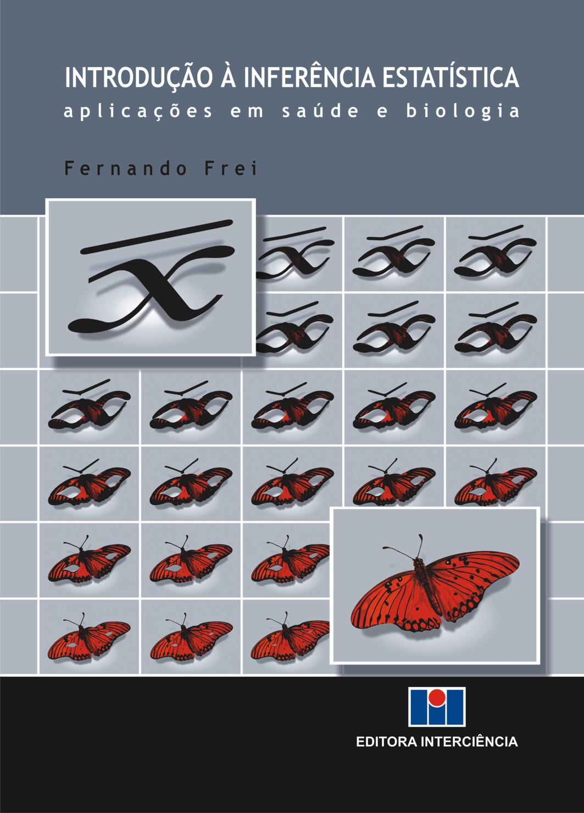
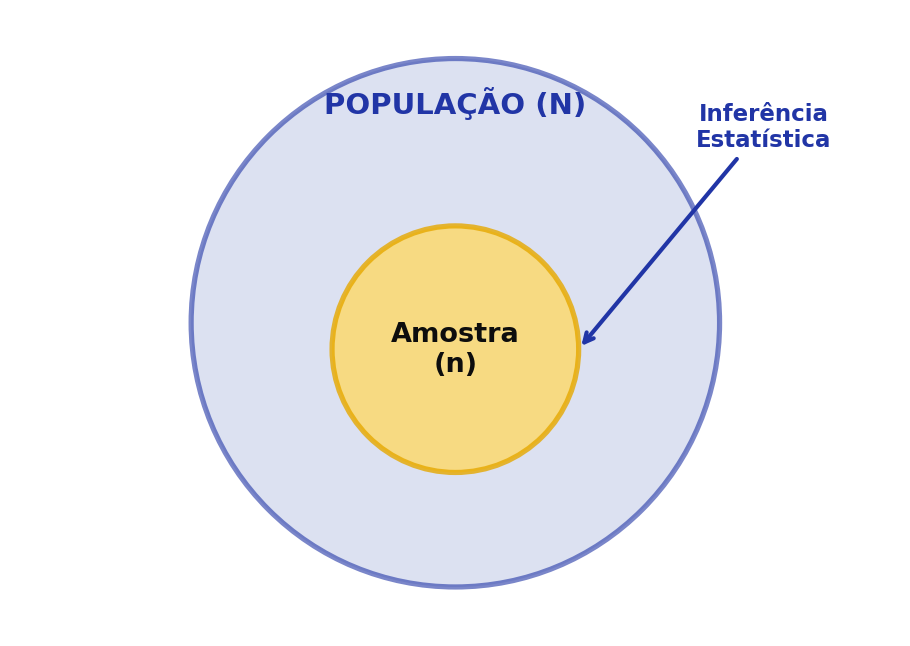
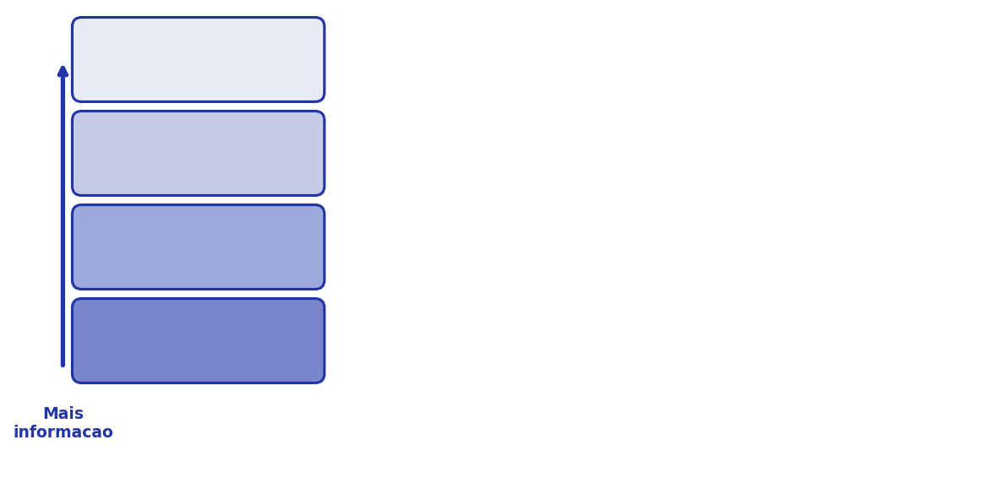
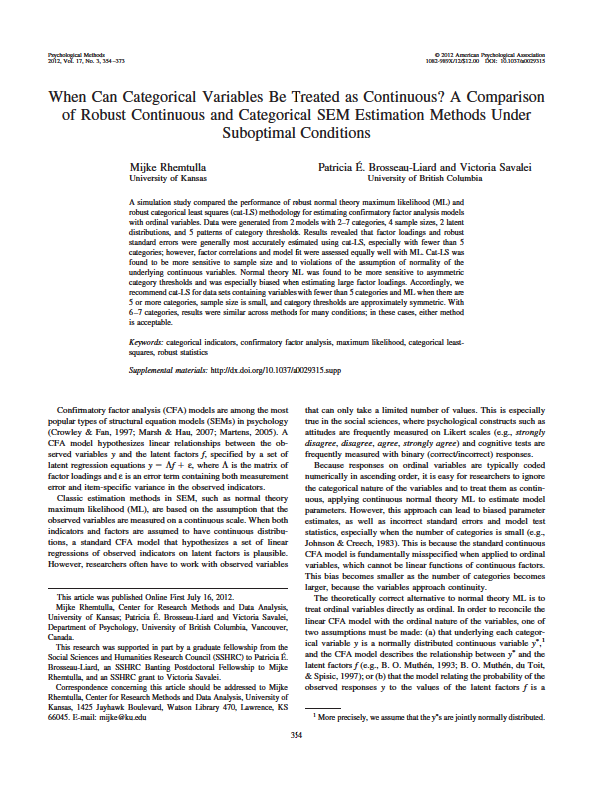
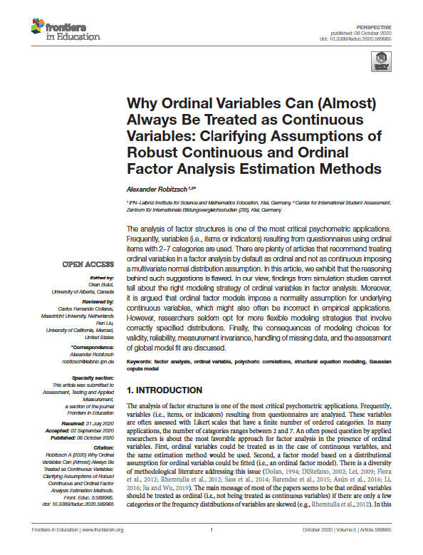
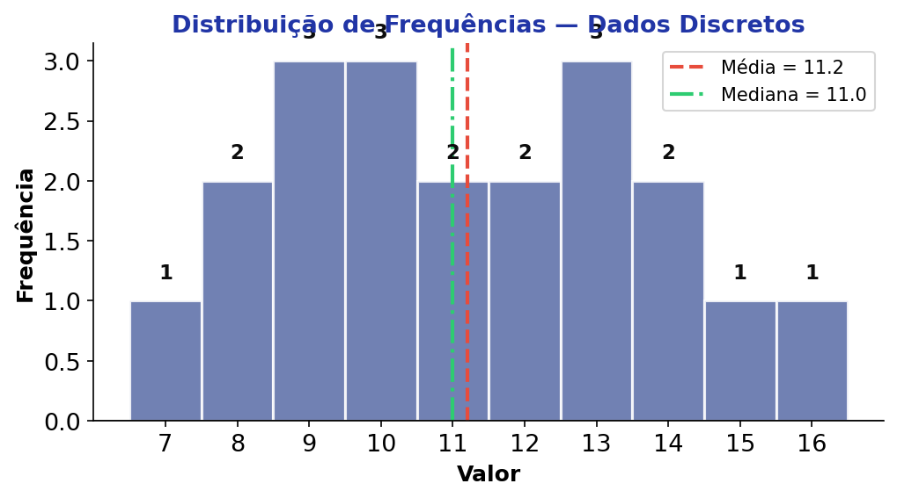

## Roteiro da Aula {.smaller-text}

::: {.columns}
:::: {.column width="60%"}

- [1]{.circle} Etimologia e Inferência Estatística
- [2]{.circle} Conjunto de Dados, População e Amostra
- [3]{.circle} Tipos de Variáveis (Stevens, 1946)
- [4]{.circle} Classificação das Variáveis
- [5]{.circle} Escala Likert como Variável Contínua
- [6]{.circle} Distribuição de Frequências

::::
:::: {.column width="40%"}

::: {.info-box}
**Objetivo:** Apresentar os conceitos fundamentais de estatística que sustentam toda a análise de dados ambientais.
:::

::::
:::


# [1 — ETIMOLOGIA]{.section-header}

## Etimologia Estatística {.smaller-text}

::: {.columns}
:::: {.column width="55%"}

::: {.info-box}
**Definição**

Inferência estatística refere-se aos resultados derivados da **análise estatística** dos dados coletados.

Ou seja, a inferência estatística advém de uma relação entre a **teoria estatística** e os **dados reais**.
:::

::::
:::: {.column width="45%"}

{fig-align="center" width="100%"}

::::
:::


# [2 — DADOS, POPULAÇÃO E AMOSTRA]{.section-header}

## Conjunto de Dados, População e Amostra {.smaller-text}

::: {.box}
**Conjunto de dados**
Coleção de observações onde cada coluna representa uma **variável** e cada linha uma **unidade de análise**. Cada valor é um item de dado.
:::

. . .

::: {.box}
**População**
Conjunto completo de elementos que compartilham uma característica; representa o **universo** do estudo.
:::

. . .

::: {.box}
**Amostra**
Subconjunto da população selecionado para representar o todo, utilizado quando o acesso à população é **impraticável**.
:::

---

## Relação População – Amostra {.smaller-text}

{fig-align="center" width="65%"}

::: {.highlight-box}
A **amostra** é um subconjunto da **população**. A inferência estatística permite generalizar os resultados da amostra para a população.
:::


# [3 — TIPOS DE VARIÁVEIS]{.section-header}

## Classificação de Stevens (1946) {.smaller-text}

De acordo com **Stevens (1946)**, as variáveis podem ser classificadas como:

::: {.columns}
:::: {.column width="50%"}

::: {.highlight-box}
[1]{.circle} **Nominal**
:::

::: {.highlight-box}
[2]{.circle} **Ordinal**
:::

::::
:::: {.column width="50%"}

::: {.highlight-box}
[3]{.circle} **Escalar** (Intervalar)
:::

::: {.highlight-box}
[4]{.circle} **Razão**
:::

::::
:::

. . .

::: {.info-box}
O **tipo de variável** determina qual análise estatística deve ser utilizada.
:::


## Variáveis Nominais {.smaller-text}

::: {.columns}
:::: {.column width="55%"}

::: {.info-box}
**Uma variável totalmente qualitativa**

- Não significa que não possam ser feitas análises quantitativas
- Os valores apenas **diferenciam categorias** qualitativas, mas **não há relação** entre elas
- Os números atribuídos **não têm significado matemático**
:::

::::
:::: {.column width="45%"}

. . .

::: {.box}
**Exemplos:**

- Nacionalidade
- Religião
- Estado civil

| Categoria  | Código |
|------------|:------:|
| Brasileiro |   1    |
| Argentino  |   2    |
| Chinês     |   3    |
:::

::::
:::


## Variáveis Ordinais {.smaller-text}

::: {.info-box}
**Há uma ordenação entre as categorias**

- Estabelece uma **ordem ou hierarquia** entre as categorias
- No entanto, o **intervalo entre as categorias não é regular**
:::

. . .

::: {.highlight-box}
**Exemplo:** A ordem de chegada dos corredores na linha de chegada é uma medida ordinal — você sabe quem chegou primeiro, mas o dado por si só **não informa** se a diferença foi de um segundo ou uma hora.
:::

. . .

::: {.box}
**Escolaridade**

[1]{.circle} Ensino fundamental → [2]{.circle} Ensino médio → [3]{.circle} Ensino superior
:::


## Variáveis Ordinais — Escalas Likert {.smaller-text}

::: {.info-box}
**Escalas Likert** são um tipo especial de variável ordinal amplamente utilizado em pesquisas.
:::

. . .

| Discordo totalmente | Discordo | Nem concordo nem discordo | Concordo | Concordo totalmente |
|:--------------------:|:--------:|:-------------------------:|:--------:|:--------------------:|
| 1                    | 2        | 3                         | 4        | 5                    |

. . .

::: {.highlight-box}
Cada ponto representa um **grau de concordância**, mas a distância entre os pontos não é necessariamente a mesma.
:::


## Variáveis Escalares (Intervalares) {.smaller-text}

::: {.info-box}
O **intervalo entre os valores é sempre constante.**

O que diferencia a variável escalar da de razão é o **significado do valor 0**.
:::

. . .

::: {.columns}
:::: {.column width="50%"}

::: {.box}
**Zero arbitrário (Escalar)**

- 0 °C não significa ausência de temperatura
- Nota zero num teste não significa ausência de conhecimento
:::

::::
:::: {.column width="50%"}

::: {.box}
**Zero absoluto (Razão)**

- 0 segundos = ausência de tempo
- R$ 0 = ausência de salário
- 0 km = ausência de distância
:::

::::
:::

. . .

::: {.highlight-box}
A maioria das análises nas ciências humanas, sociais e da saúde utiliza dados **ordinais** ou **escalares**.
:::


## Propriedades por Nível de Medida {.smaller-text}

::: {.info-box}
**Procedimentos de análise** — Cada nível acumula as propriedades dos anteriores.
:::

| Nível de medida  | Distinção | Ordem | Distância |
|:-----------------|:---------:|:-----:|:---------:|
| Nominal          | ✔         |       |           |
| Ordinal          | ✔         | ✔     |           |
| Escalar / Razão  | ✔         | ✔     | ✔         |

. . .

::: {.highlight-box}
Quanto **maior** o nível de medida, **mais poderosos** são os testes estatísticos disponíveis.
:::

---

## Escalas de Medida — Síntese Visual {.smaller-text}

{fig-align="center" width="80%"}


# [4 — CLASSIFICAÇÃO DAS VARIÁVEIS]{.section-header}

## Classificação Problemática {.smaller-text}

::: {.highlight-box}
A taxonomia tradicional que separa variáveis em "qualitativas × quantitativas" pode gerar ambiguidades.
:::

```{mermaid}
%%| fig-width: 8
graph TD
    A([<b style="color:#fff">Natureza</b>]) --> B[Qualitativa]
    A --> C[Quantitativa]
    B --> D[Ordinal]
    B --> E[Nominal]
    C --> F[Escalar]
    C --> G[Razão]

    style A fill:#2135A6,color:#fff,stroke:#27368C,stroke-width:2px,font-weight:bold
    style B fill:#C5CEE8,color:#0D0D0D,stroke:#2135A6,stroke-width:2px
    style C fill:#C5CEE8,color:#0D0D0D,stroke:#2135A6,stroke-width:2px
    style D fill:#F2F2F2,color:#0D0D0D,stroke:#586BA6
    style E fill:#F2F2F2,color:#0D0D0D,stroke:#586BA6
    style F fill:#F2F2F2,color:#0D0D0D,stroke:#586BA6
    style G fill:#F2F2F2,color:#0D0D0D,stroke:#586BA6
```

::: {.info-box}
**Problema:** Onde entra a variável ordinal? Qualitativa ou quantitativa?
:::


## Classificação Adequada {.smaller-text}

::: {.info-box}
A classificação mais precisa separa variáveis em **Categórica × Contínua**.
:::

```{mermaid}
%%| fig-width: 8
graph TD
    A([<b style="color:#fff">Natureza</b>]) --> B[Categórica]
    A --> C[Contínua]
    B --> D[Nominal]
    C --> E[Escalar]
    C --> F[Razão]
    C --> G[Ordinal*]

    style A fill:#2135A6,color:#fff,stroke:#27368C,stroke-width:2px,font-weight:bold
    style B fill:#C5CEE8,color:#0D0D0D,stroke:#2135A6,stroke-width:2px
    style C fill:#C5CEE8,color:#0D0D0D,stroke:#2135A6,stroke-width:2px
    style D fill:#F2F2F2,color:#0D0D0D,stroke:#586BA6
    style E fill:#F2F2F2,color:#0D0D0D,stroke:#586BA6
    style F fill:#F2F2F2,color:#0D0D0D,stroke:#586BA6
    style G fill:#F2F2F2,color:#0D0D0D,stroke:#586BA6
```

::: {.highlight-box}
\* **Ordinal** aparece como contínua quando se trata de **escalas Likert**, pois a soma dos itens gera um escore tratável como variável contínua.
:::


# [5 — ESCALA LIKERT COMO CONTÍNUA]{.section-header}

## Por que tratamos a escala Likert como variável contínua? {.smaller-text}

::: {.info-box}
Quando somamos os itens de uma escala Likert, o escore total pode variar de um **mínimo** a um **máximo** com muitos valores possíveis — comportando-se como uma variável contínua.
:::

. . .

| Item   | Discordo totalmente | Discordo | Neutro | Concordo | Concordo totalmente |
|:------:|:-------------------:|:--------:|:------:|:--------:|:-------------------:|
| Item 1 | 1                   | 2        | 3      | 4        | 5                   |
| Item 2 | 1                   | 2        | 3      | 4        | 5                   |
| Item 3 | 1                   | 2        | 3      | 4        | 5                   |
| Item 4 | 1                   | 2        | 3      | 4        | 5                   |

. . .

::: {.highlight-box}
**Mínimo:** 4 (todos = 1) → **Máximo:** 20 (todos = 5) — São **17 valores possíveis**, suficientes para aproximar uma distribuição contínua.
:::


## Exemplo de Distribuição {.smaller-text}

::: {layout-ncol=2}
{fig-align="center"}

{fig-align="center"}
:::

::: {.info-box}
As distribuições dos escores somados tendem a se aproximar de uma **curva normal**, justificando o uso de técnicas paramétricas.
:::


# [6 — DISTRIBUIÇÃO DE FREQUÊNCIAS]{.section-header}

## Distribuição de Frequências {.smaller-text}

::: {.columns}
:::: {.column width="55%"}

::: {.info-box}
**Conceito**

Uma distribuição de frequências organiza os dados em **categorias ou intervalos** e mostra quantas observações pertencem a cada classe.
:::

. . .

::: {.highlight-box}
Configura um caso particular das séries estatísticas — os fatores época, local e fenômeno permanecem fixos, e o fenômeno apresenta-se através de **"gradações"**.
:::

::::
:::: {.column width="45%"}

::: {.box}
**Utilidade**

Resumir toda a informação obtida de modo a **facilitar a análise** e a identificação de padrões nos dados.
:::

::::
:::


## Tabela de Frequências — Dados Discretos {.smaller-text}

::: {.columns}
:::: {.column width="55%"}

| Valor | *f* | *f* acumulada | *f* (%) |
|:-----:|:---:|:------------:|:-------:|
| 7     | 1   | 1            | 5,0%    |
| 8     | 2   | 3            | 10,0%   |
| 9     | 3   | 6            | 15,0%   |
| 10    | 3   | 9            | 15,0%   |
| 11    | 2   | 11           | 10,0%   |
| 12    | 2   | 13           | 10,0%   |
| 13    | 3   | 16           | 15,0%   |
| 14    | 2   | 18           | 10,0%   |
| 15    | 1   | 19           | 5,0%    |
| 16    | 1   | 20           | 5,0%    |

::::
:::: {.column width="45%"}

::: {.box}
**Resumo**

- **n** = 20 observações
- **Valores distintos:** 10
- **Média:** 11,20
- **Mediana:** 11,00
- **Moda:** 9, 10, 13 (trimodal)
:::

. . .

::: {.highlight-box}
A distribuição é aproximadamente **simétrica**, com concentração nos valores centrais e caudas leves.
:::

::::
:::

---

## Visualização — Histograma de Frequências {.smaller-text}

{fig-align="center" width="75%"}

::: {.info-box}
O histograma permite visualizar a **forma da distribuição**, a **simetria** e a **concentração** dos dados em torno da média e da mediana.
:::


## {.center background-color="#2135A6"}

::: {style="text-align: center;"}
[Obrigado!]{.obrigado-fit-text style="color: white;"}

::: {style="color: white; font-size: 0.7em;"}
Luiz Diego Vidal Santos

Universidade Estadual de Feira de Santana (UEFS)
:::
:::
