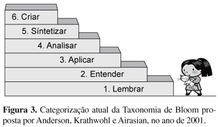
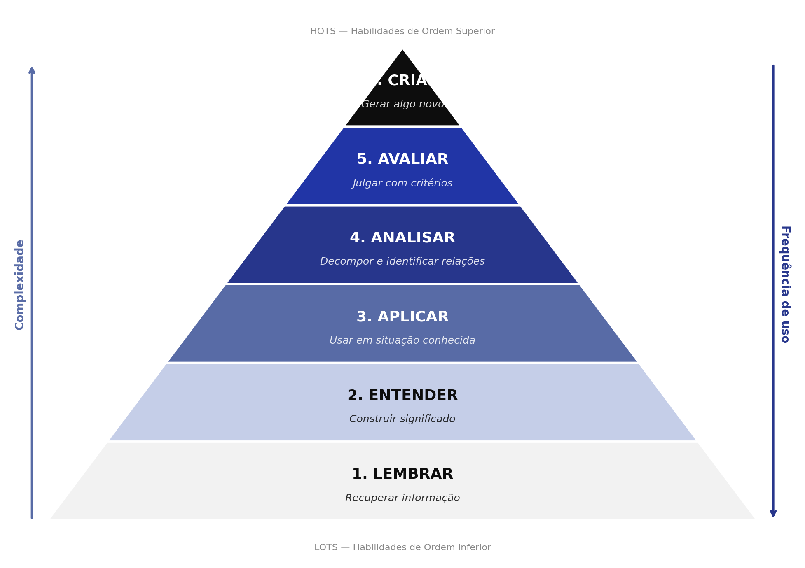
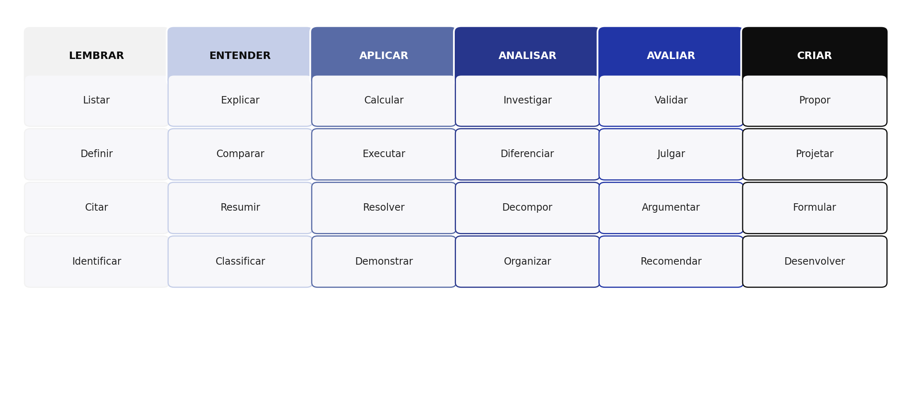
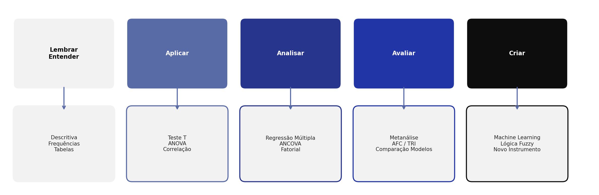

# [ROTEIRO DA AULA]{.section-header}

## Roteiro {.smaller-text}

[1]{.circle} Origem e propósito da Taxonomia

[2]{.circle} Os 6 Níveis Cognitivos (Original e Revisada)

[3]{.circle} Verbos operacionais por nível

[4]{.circle} Formulação de objetivos de pesquisa

[5]{.circle} Conexão: nível cognitivo → análise estatística

[6]{.circle} Aplicação em projetos ambientais


# [ORIGEM E PROPÓSITO]{.section-header}

## Benjamin Bloom (1956) {.smaller-text}

::: {.columns}

::: {.column width="60%"}
- **Benjamin S. Bloom** (1913–1999) — Universidade de Chicago
- Publicou *Taxonomy of Educational Objectives* (1956)
- Objetivo: criar uma **linguagem comum** para classificar objetivos de aprendizagem

::: {.info-box}
A taxonomia organiza processos cognitivos do **mais simples** (lembrar) ao **mais complexo** (criar), formando uma **hierarquia cumulativa**.
:::
:::

::: {.column width="40%"}
**Revisão de Anderson & Krathwohl (2001):**

- Converteu substantivos em **verbos** (ação)
- Inverteu os dois últimos níveis
- Adicionou dimensão do **conhecimento** (factual, conceitual, procedimental, metacognitivo)
:::

:::


## Por que estudar Bloom em Estatística? {.smaller-text}

::: {.highlight-box}
**Problema comum em pós-graduação:** Alunos formulam objetivos vagos como *"estudar a erosão"* ou *"analisar dados ambientais"* — sem especificar o **nível cognitivo** esperado.
:::

A Taxonomia de Bloom permite:

1. **Formular** objetivos específicos e mensuráveis
2. **Alinhar** pergunta → hipótese → método → análise
3. **Escalar** a complexidade da pesquisa
4. **Avaliar** se as conclusões correspondem ao nível proposto


# [OS 6 NÍVEIS COGNITIVOS]{.section-header}

## Taxonomia Original vs Revisada {.smaller-text}

| Nível | Bloom (1956) | Anderson & Krathwohl (2001) |
|:---:|:---|:---|
| 1 | Conhecimento | **Lembrar** |
| 2 | Compreensão | **Entender** |
| 3 | Aplicação | **Aplicar** |
| 4 | Análise | **Analisar** |
| 5 | Síntese | **Avaliar** |
| 6 | Avaliação | **Criar** |

::: {.info-box}
Na versão revisada, **Criar** (antigo Síntese) é o nível mais alto — acima de Avaliar. Isso enfatiza a **geração de conhecimento novo** como objetivo máximo.
:::


## Pirâmide Cognitiva {.smaller-text}

```{mermaid}
%%| fig-width: 10
flowchart BT
  L1["1. LEMBRAR<br>Recuperar informação da memória"] --> L2["2. ENTENDER<br>Construir significado"]
  L2 --> L3["3. APLICAR<br>Usar procedimento em situação conhecida"]
  L3 --> L4["4. ANALISAR<br>Decompor e identificar relações"]
  L4 --> L5["5. AVALIAR<br>Julgar com critérios"]
  L5 --> L6["6. CRIAR<br>Gerar algo novo e original"]
  style L1 fill:#F2F2F2,color:#0D0D0D
  style L2 fill:#C5CEE8,color:#0D0D0D
  style L3 fill:#586BA6,color:#fff
  style L4 fill:#27368C,color:#fff
  style L5 fill:#2135A6,color:#fff
  style L6 fill:#0D0D0D,color:#fff
```


## Escada de Categorização {.smaller-text}

{fig-align="center" width="75%"}

::: {.info-box}
A escada ilustra a **progressão cumulativa** dos níveis cognitivos: cada degrau exige o domínio dos anteriores.
:::


## Níveis 1 a 3: Habilidades de Ordem Inferior (LOTS) {.smaller-text}

::: {.columns}
:::: {.column width="55%"}

| Nível | Definição | Verbos-chave | Exemplo Ambiental |
|:---:|:---|:---|:---|
| **1. Lembrar** | Recuperar informação da memória | Listar, definir, citar, identificar | "Liste os tipos de erosão hídrica" |
| **2. Entender** | Construir significado, interpretar | Explicar, comparar, resumir, classificar | "Compare os tipos de manejo do solo" |
| **3. Aplicar** | Usar procedimento em situação conhecida | Calcular, executar, resolver, demonstrar | "Aplique o teste T para comparar tratamentos" |

::::
:::: {.column width="45%"}

::: {.info-box}
**Na pós-graduação:**

- Nível 1 é insuficiente para dissertações/teses
- Nível 2 serve para revisão de literatura
- Nível 3 é o **mínimo esperado** para dissertações
:::

::::
:::


## Níveis 4 a 6: Habilidades de Ordem Superior (HOTS) {.smaller-text}

::: {.columns}
:::: {.column width="55%"}

| Nível | Definição | Verbos-chave | Exemplo Ambiental |
|:---:|:---|:---|:---|
| **4. Analisar** | Decompor, identificar relações | Investigar, diferenciar, decompor, organizar | "Analise os fatores determinantes da erosão" |
| **5. Avaliar** | Julgar com critérios e padrões | Validar, julgar, argumentar, recomendar | "Avalie a eficácia de barreiras vegetais" |
| **6. Criar** | Gerar algo novo e original | Propor, projetar, formular, desenvolver | "Proponha um índice fuzzy de sustentabilidade" |

::::
:::: {.column width="45%"}

::: {.highlight-box}
**Padrão por nível acadêmico:**

- **Nível 4** → Dissertações de mestrado
- **Nível 5** → Mestrado avançado / Doutorado
- **Nível 6** → Teses de doutorado (contribuição original)
:::

::::
:::


## Pirâmide de Bloom e Verbos Operacionais {.smaller-text}

::: {.columns}
:::: {.column width="50%"}

{fig-align="center" width="100%"}

::::
:::: {.column width="50%"}

{fig-align="center" width="100%"}

::::
:::


# [VERBOS OPERACIONAIS]{.section-header}

## Guia Rápido de Verbos por Nível {.smaller-text}

| Nível | Verbos Recomendados | Evitar |
|:---|:---|:---|
| Lembrar | Listar, definir, citar, reproduzir | "Estudar" (vago) |
| Entender | Explicar, comparar, classificar, resumir | "Entender" (não mensurável) |
| Aplicar | Calcular, aplicar, executar, resolver | "Utilizar" sozinho |
| Analisar | Analisar, diferenciar, investigar, decompor | "Verificar" (ambíguo) |
| Avaliar | Avaliar, validar, julgar, argumentar, recomendar | "Observar" (nível 1) |
| Criar | Propor, desenvolver, elaborar, projetar, formular | "Fazer" (impreciso) |

::: {.highlight-box}
**Dica prática:** O verbo do objetivo geral deve indicar o **nível cognitivo máximo** esperado. Os específicos podem estar em níveis inferiores (hierarquia cumulativa).
:::


# [BLOOM E ANÁLISE ESTATÍSTICA]{.section-header}

## Mapeamento: Nível Cognitivo → Análise {.smaller-text}

{fig-align="center" width="95%"}


## Exemplo Prático: Erosão {.smaller-text}

| Nível | Objetivo | Análise | Complexidade |
|:---:|:---|:---|:---:|
| 1 | "Descrever as taxas de erosão na bacia" | Descritiva, histograma | Baixa |
| 2 | "Comparar erosão entre microbacias" | ANOVA | Média |
| 3 | "Aplicar modelo USLE para estimar perdas" | Regressão | Média |
| 4 | "Analisar interação solo×uso×declividade" | ANOVA Fatorial | Alta |
| 5 | "Avaliar eficácia de paliçadas vs gabião" | Metanálise | Alta |
| 6 | "Propor índice integrado de vulnerabilidade" | Fuzzy + AHP | Muito alta |

::: {.highlight-box}
Note como cada nível exige **mais variáveis**, **mais técnicas** e **raciocínio mais complexo**.
:::


# [APLICAÇÃO EM PROJETOS]{.section-header}

## Como formular objetivos {.smaller-text}

::: {.info-box}
**Fórmula para objetivo de pesquisa:**

**Verbo operacional** + **objeto de estudo** + **contexto/condição** + **critério de mensuração**
:::

**Mau exemplo:**
> "*Estudar a erosão na região semiárida*"

- "Estudar" não é mensurável. Qual nível cognitivo?

**Bom exemplo (Nível 4 — Analisar):**
> "*Analisar a influência do tipo de cobertura vegetal (caatinga) sobre a taxa de perda de solo na microbacia do Rio Jacuípe, utilizando ANOVA fatorial e regressão múltipla*"


## Alinhamento Objetivo–Método–Análise {.smaller-text}

| Componente | Nível 3 (Aplicar) | Nível 5 (Avaliar) |
|:---|:---|:---|
| **Objetivo** | Aplicar o RUSLE para estimar perda de solo | Avaliar a confiabilidade de instrumentos de percepção ambiental |
| **Método** | Coleta em parcelas + cálculo RUSLE | Aplicação de escala Likert + Análise psicométrica |
| **Análise** | Regressão linear | AFE + consistência interna (α Cronbach) |
| **Produto** | Mapa de estimativa | Instrumento validado |


## Erros Comuns e Correções {.smaller-text}

| Erro | Problema | Correção |
|:---|:---|:---|
| "Verificar se há erosão" | Nível 1 (descritivo) | "Analisar os determinantes da erosão" (Nível 4) |
| "Entender a relação solo–planta" | Não mensurável | "Investigar a correlação entre MOS e biomassa" (Nível 4) |
| "Fazer análise estatística" | Sem especificação | "Aplicar ANOVA fatorial para comparar tratamentos" (Nível 3) |
| Objetivo ≠ Análise | Desalinhamento | Usar mapeamento Bloom → Técnica |

::: {.highlight-box}
**Regra de ouro:** Se o avaliador não consegue determinar **qual análise** será feita a partir do objetivo, o objetivo precisa ser reescrito.
:::


## Resumo: Dimensão do Conhecimento {.smaller-text}

Anderson & Krathwohl (2001) adicionaram uma segunda dimensão:

| Tipo | Definição | Exemplo Ambiental |
|:---|:---|:---|
| **Factual** | Terminologia, fatos | Definições de erosão, tipos de solo |
| **Conceitual** | Princípios, modelos, teorias | Modelo USLE, Lei de Darcy |
| **Procedimental** | Técnicas, métodos, algoritmos | Passo a passo do Teste T, protocolo de coleta |
| **Metacognitivo** | Autoconhecimento sobre aprendizagem | Saber quando usar bootstrap vs paramétrico |

::: {.info-box}
A **tabela bidimensional** (processo cognitivo × tipo de conhecimento) permite classificar qualquer objetivo educacional em uma célula específica.
:::


## Referências {.smaller-text}

::: {.box}
- Bloom, B. S. et al. (1956). *Taxonomy of Educational Objectives: The Classification of Educational Goals*. Handbook I: Cognitive Domain. David McKay.
- Anderson, L. W., & Krathwohl, D. R. (2001). *A Taxonomy for Learning, Teaching, and Assessing: A Revision of Bloom's Taxonomy*. Longman.
- Ferraz, A. P. C. M., & Belhot, R. V. (2010). Taxonomia de Bloom: revisão teórica e apresentação das adequações do instrumento para definição de objetivos instrucionais. *Gestão & Produção*, 17(2), 421–431.
:::


## {.center background-color="#2135A6"}

::: {style="text-align: center;"}
[Obrigado!]{.obrigado-fit-text style="color: white;"}

::: {style="color: white; font-size: 0.7em;"}
Luiz Diego Vidal Santos

Universidade Estadual de Feira de Santana (UEFS)
:::
:::
