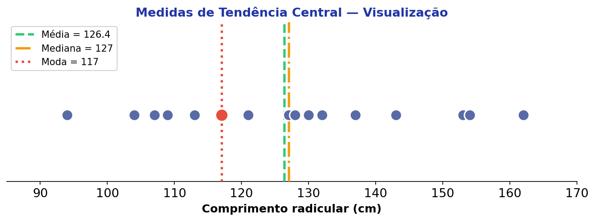
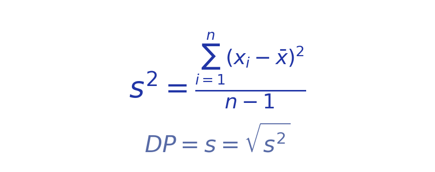
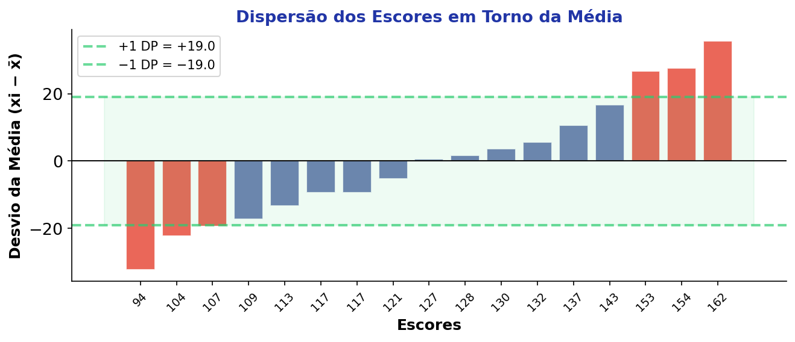
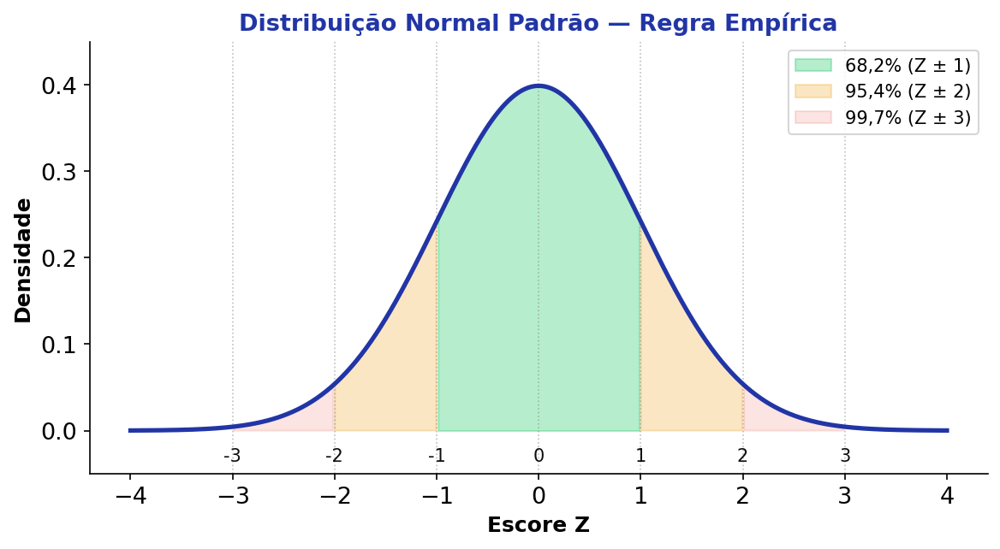
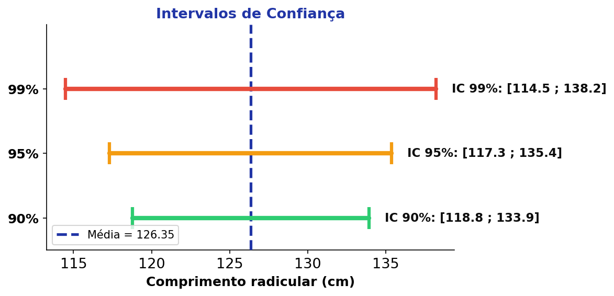

## Roteiro da Aula {.smaller-text}

::: {.columns}
:::: {.column width="60%"}

- [1]{.circle} Medidas de Tendência Central
- [2]{.circle} Média, Moda e Mediana
- [3]{.circle} Medidas de Dispersão
- [4]{.circle} Variância e Desvio-Padrão
- [5]{.circle} Erro-Padrão
- [6]{.circle} Escore Z
- [7]{.circle} Intervalo de Confiança

::::
:::: {.column width="40%"}

::: {.info-box}
**Objetivo:** Compreender e calcular as principais medidas descritivas que resumem e caracterizam conjuntos de dados ambientais.
:::

::::
:::

# [1 — ESTATÍSTICA DESCRITIVA]{.section-header}

## O que é Estatística Descritiva? {.smaller-text}

::: {.columns}
:::: {.column width="55%"}

::: {.info-box}
**Definição**

A estatística descritiva é um ramo da estatística que aplica técnicas para **descrever e sumarizar** um conjunto de dados.
:::

. . .

::: {.highlight-box}
Diferencia-se da **estatística inferencial**, que busca obter afirmações sobre uma **população** com base em uma **amostra**.
:::

::::
:::: {.column width="45%"}

::: {.box}
**O que aprenderemos:**

- Tendência central (M, Mo, Md)
- Variância e desvio-padrão
- Erro-padrão
- Escore Z
- Intervalo de confiança
:::

::::
:::

# [2 — TENDÊNCIA CENTRAL]{.section-header}

## Medidas de Tendência Central {.smaller-text}

::: {.info-box}
**Objetivo:** Encontrar um valor que **resuma a variabilidade** de um conjunto de dados.
:::

. . .

::: {.columns}
:::: {.column width="55%"}

::: {.box}
**Pesquisa-exemplo**

Investigar os níveis de **crescimento radicular** frente ao uso de fungos micorrízicos arbusculares (N = 17).

- Instrumento de 34 itens
- Comprimento em cm
- Escores variam de 34 cm a 170 cm
:::

::::
:::: {.column width="45%"}

::: {.highlight-box}
**Escores das 17 repetições:**

94, 104, 107, 109, 113, 117, 117, 121, 127, 128, 130, 132, 137, 143, 153, 154, 162
:::

::::
:::

## Média Aritmética {.smaller-text}

::: {.info-box}
**Média** — Soma de todos os valores dividida pelo número de observações.
:::

. . .

$$\bar{X} = \frac{\sum_{i=1}^{N} x_i}{N} = \frac{2148}{17} = 126{,}35$$

. . .

::: {.columns}
:::: {.column width="55%"}

| Escores ordenados | | | | | | | | |
|:---:|:---:|:---:|:---:|:---:|:---:|:---:|:---:|:---:|
| 94 | 104 | 107 | 109 | 113 | 117 | 117 | 121 | 127 |
| 128 | 130 | 132 | 137 | 143 | 153 | 154 | 162 | |

::::
:::: {.column width="45%"}

::: {.highlight-box}
$\sum = 2148$

$N = 17$

$\bar{X} = 126{,}35$
:::

::::
:::

## Moda {.smaller-text}

::: {.info-box}
**Moda** — O valor que aparece com **maior frequência** na amostra.
:::

. . .

::: {.columns}
:::: {.column width="55%"}

| Escores ordenados | | | | | | | | |
|:---:|:---:|:---:|:---:|:---:|:---:|:---:|:---:|:---:|
| 94 | 104 | 107 | 109 | 113 | **117** | **117** | 121 | 127 |
| 128 | 130 | 132 | 137 | 143 | 153 | 154 | 162 | |

::::
:::: {.column width="45%"}

::: {.box}
**Moda = 117** (aparece 2 vezes)

Distribuição **unimodal**.
:::

::::
:::

## Mediana {.smaller-text}

::: {.info-box}
**Mediana** — O valor que divide a amostra em **duas metades iguais** quando os dados estão ordenados.
:::

. . .

::: {.columns}
:::: {.column width="55%"}

| Escores ordenados | | | | | | | | |
|:---:|:---:|:---:|:---:|:---:|:---:|:---:|:---:|:---:|
| 94 | 104 | 107 | 109 | 113 | 117 | 117 | 121 | **127** |
| 128 | 130 | 132 | 137 | 143 | 153 | 154 | 162 | |

::::
:::: {.column width="45%"}

::: {.box}
**Mediana = 127**

Posição: $\frac{N+1}{2} = \frac{18}{2} = 9°$ valor
:::

::::
:::

## Sumário — Tendência Central {.smaller-text}

::: {.columns}
:::: {.column width="50%"}

::: {.info-box}
**Resumo das medidas:**

| Medida   | Valor  |
|:---------|:------:|
| Média    | 126,35 |
| Moda     | 117    |
| Mediana  | 127    |
:::

::::
:::: {.column width="50%"}

{fig-align="center" width="100%"}

::::
:::

. . .

::: {.highlight-box}
As três medidas estão **próximas**, sugerindo uma distribuição relativamente **simétrica**.
:::

# [3 — MEDIDAS DE DISPERSÃO]{.section-header}

## Por que medir a dispersão? {.smaller-text}

::: {.info-box}
**Objetivo:** Ter noção da **variabilidade** dos escores em torno da média.
:::

. . .

::: {.highlight-box}
As medidas de dispersão auxiliam na interpretação sobre o quanto os casos são **semelhantes ou diferentes** entre si, frente à variável de interesse.
:::

. . .

::: {.box}
**Medidas que veremos:**

- [1]{.circle} Variância ($s^2$)
- [2]{.circle} Desvio-padrão ($DP$)
- [3]{.circle} Erro-padrão ($EP$)
:::

# [4 — VARIÂNCIA E DESVIO-PADRÃO]{.section-header}

## Variância — Conceito {.smaller-text}

::: {.columns}
:::: {.column width="50%"}

::: {.info-box}
A **variância** mede o quanto cada escore se afasta da média, ao quadrado, dividido por $n - 1$.
:::

. . .

{fig-align="center" width="90%"}

::::
:::: {.column width="50%"}

::: {.box}
**Passo a passo:**

[1]{.circle} Calcular a média ($\bar{X} = 126{,}35$)

[2]{.circle} Subtrair cada escore da média

[3]{.circle} Elevar cada diferença ao quadrado

[4]{.circle} Somar os quadrados

[5]{.circle} Dividir por $n - 1$
:::

::::
:::

## Variância — Cálculo com os dados {.smaller-text}

::: {.columns}
:::: {.column width="55%"}

| Escore $x_i$  | $x_i - \bar{X}$ | $(x_i - \bar{X})^2$ |
|:---:|:------:|:--------:|
| 94  | −32,35 | 1046,5   |
| 104 | −22,35 | 499,5    |
| 107 | −19,35 | 374,4    |
| 109 | −17,35 | 301,0    |
| 113 | −13,35 | 178,2    |
| 117 | −9,35  | 87,4     |
| 117 | −9,35  | 87,4     |
| 121 | −5,35  | 28,6     |
| 127 | 0,65   | 0,4      |

::::
:::: {.column width="45%"}

| Escore $x_i$  | $x_i - \bar{X}$ | $(x_i - \bar{X})^2$ |
|:---:|:------:|:--------:|
| 128 | 1,65   | 2,7      |
| 130 | 3,65   | 13,3     |
| 132 | 5,65   | 31,9     |
| 137 | 10,65  | 113,4    |
| 143 | 16,65  | 277,2    |
| 153 | 26,65  | 710,2    |
| 154 | 27,65  | 764,5    |
| 162 | 35,65  | 1270,9   |

::::
:::

## Variância e Desvio-Padrão — Resultado {.smaller-text}

::: {.columns}
:::: {.column width="50%"}

::: {.info-box}
$$s^2 = \frac{5787{,}9}{16} = 361{,}74$$

$$DP = \sqrt{361{,}74} = 19{,}02$$
:::

::::
:::: {.column width="50%"}

::: {.highlight-box}
**Interpretação:**

Em média, cada escore se afasta **19,02 cm** da média de 126,35 cm.
:::

::::
:::

. . .

{fig-align="center" width="70%"}

# [5 — ERRO-PADRÃO]{.section-header}

## Erro-Padrão da Média {.smaller-text}

::: {.columns}
:::: {.column width="50%"}

::: {.info-box}
**Erro-Padrão (EP)** — Desvio-padrão entre as **médias das amostras** (Field, 2005).

Estima a **precisão da média amostral** como estimativa da média populacional.
:::

. . .

$$EP = \frac{DP}{\sqrt{N}} = \frac{19{,}02}{\sqrt{17}} = 4{,}613$$

::::
:::: {.column width="50%"}

::: {.box}
**Resumo das medidas:**

| Medida          | Valor    |
|:----------------|:--------:|
| Média ($\bar{X}$) | 126,35 |
| Variância ($s^2$) | 361,74 |
| Desvio-padrão ($DP$) | 19,02 |
| Erro-padrão ($EP$) | 4,613  |
:::

::::
:::

. . .

::: {.highlight-box}
Quanto **maior** o N, **menor** o EP → a estimativa da média é mais **precisa**.
:::

# [6 — ESCORE Z]{.section-header}

## Escore Z — Conceito {.smaller-text}

::: {.columns}
:::: {.column width="50%"}

::: {.info-box}
O **escore Z** é uma transformação dos escores brutos baseada no desvio-padrão.
:::

. . .

$$Z = \frac{X - \bar{X}}{s}$$

- $X$ = escore da amostra
- $\bar{X}$ = média amostral
- $s$ = desvio-padrão amostral

::::
:::: {.column width="50%"}

::: {.box}
**Exemplo:** $\bar{X} = 20$; $DP = 2$

Se $X = 22$:

$$Z = \frac{22 - 20}{2} = 1$$

A repetição está **1 DP acima** da média.
:::

. . .

::: {.highlight-box}
**1 ponto** no escore Z = **1 desvio-padrão** de distância da média.
:::

::::
:::

## Escore Z — Exemplos Práticos {.smaller-text}

::: {.info-box}
Considere $\bar{X} = 20$ e $DP = 2$:
:::

. . .

::: {.columns}
:::: {.column width="50%"}

::: {.box}
**Repetição com escore 18:**

$$Z = \frac{18 - 20}{2} = -1$$

Está **1 DP abaixo** da média.
:::

::::
:::: {.column width="50%"}

::: {.box}
**Repetição com escore 28:**

$$Z = \frac{28 - 20}{2} = 4$$

Está **4 DP acima** da média.
:::

::::
:::

. . .

::: {.highlight-box}
O escore Z é útil para estimar o **quão longe** um sujeito está da média.
:::

## Distribuição Normal e o Escore Z {.smaller-text}

::: {.columns}
:::: {.column width="50%"}

{fig-align="center" width="100%"}

::::
:::: {.column width="50%"}

::: {.info-box}
Se a distribuição é **normal**, do total da amostra:

- **68,2%** terão $Z$ entre $\pm 1$
- **95,4%** terão $Z$ entre $\pm 2$
- **99,7%** terão $Z$ entre $\pm 3$
:::

. . .

::: {.highlight-box}
Quando a distribuição **não é normal**, essa estimativa de % não é precisa e o escore Z perde parte da sua utilidade.
:::

::::
:::

# [7 — INTERVALO DE CONFIANÇA]{.section-header}

## Intervalo de Confiança — Conceito {.smaller-text}

::: {.columns}
:::: {.column width="55%"}

::: {.info-box}
**Intervalo de Confiança (IC)**

É uma outra forma de determinar a **precisão** da média amostral como estimativa da média populacional.

Ao calcular o IC, você obtém uma **amplitude** onde se estipula que a verdadeira média da população estará.
:::

::::
:::: {.column width="45%"}

::: {.box}
**Fórmula:**

$$IC = \bar{X} \pm Z_{\alpha/2} \times EP$$
:::

. . .

::: {.highlight-box}
Pode ser calculado em diferentes probabilidades usando o **escore Z**:

- 90% → $Z = 1{,}645$
- 95% → $Z = 1{,}960$
- 99% → $Z = 2{,}575$
:::

::::
:::

## Intervalo de Confiança — Cálculo {.smaller-text}

::: {.info-box}
$\bar{X} = 126{,}35$; $EP = 4{,}61$
:::

. . .

::: {.columns}
:::: {.column width="33%"}

::: {.box}
**IC 90%**

$Z = 1{,}645$

LI = $126{,}35 - 1{,}645 \times 4{,}61$

**LI = 118,76**

LS = $126{,}35 + 1{,}645 \times 4{,}61$

**LS = 133,92**
:::

::::
:::: {.column width="33%"}

::: {.box}
**IC 95%**

$Z = 1{,}960$

LI = $126{,}35 - 1{,}96 \times 4{,}61$

**LI = 117,30**

LS = $126{,}35 + 1{,}96 \times 4{,}61$

**LS = 135,39**
:::

::::
:::: {.column width="34%"}

::: {.box}
**IC 99%**

$Z = 2{,}575$

LI = $126{,}35 - 2{,}575 \times 4{,}61$

**LI = 114,48**

LS = $126{,}35 + 2{,}575 \times 4{,}61$

**LS = 138,22**
:::

::::
:::

## Intervalo de Confiança — Visualização {.smaller-text}

{fig-align="center" width="75%"}

. . .

::: {.info-box}
Quanto **maior** o nível de confiança, **mais amplo** é o intervalo — há um *trade-off* entre precisão e confiança.
:::

. . .

::: {.highlight-box}
**Recurso didático:** [Visualização interativa de IC](https://rpsychologist.com/d3/ci/){target="_blank"}
:::

## {.center background-color="#2135A6"}

::: {style="text-align: center;"}
[Obrigado!]{.obrigado-fit-text style="color: white;"}

::: {style="color: white; font-size: 0.7em;"}
Luiz Diego Vidal Santos

Universidade Estadual de Feira de Santana (UEFS)
:::
:::
