## Roteiro da Aula {.smaller-text}

::: {.columns}
:::: {.column width="60%"}

- [1]{.circle} Estatística Inferencial
- [2]{.circle} Testes de Hipóteses
- [3]{.circle} Inferência Frequentista (valor-*p*)
- [4]{.circle} Erros Tipo I e Tipo II
- [5]{.circle} Tamanho da Amostra e Poder
- [6]{.circle} Distribuição Normal
- [7]{.circle} Desvios de Normalidade
- [8]{.circle} Testes de Normalidade

::::
:::: {.column width="40%"}

::: {.info-box}
**Objetivo:** Compreender os fundamentos da inferência estatística, os riscos de erros nas decisões e as propriedades da distribuição normal.
:::

::::
:::

# [1. ESTATÍSTICA INFERENCIAL]{.section-header}

## O que é Estatística Inferencial? {.smaller-text}

::: {.columns}
:::: {.column width="55%"}

::: {.info-box}
**Definição**

Inferência estatística refere-se aos resultados derivados da **análise estatística** dos dados coletados.

A inferência advém da relação entre a **teoria estatística** e os **dados reais**.
:::

::::
:::: {.column width="45%"}

{fig-align="center" width="90%"}

::::
:::

## Métodos de Inferência {.smaller-text}

::: {.columns}
:::: {.column width="55%"}

::: {.box}
**Métodos de inferência para testes de hipóteses:**

[1]{.circle} Inferências frequentistas (TSHN; *p*-value; *p* < 0,05)

[2]{.circle} Estimação Bayesiana

[3]{.circle} Estimação por *Bootstrapping* (IC das diferenças/magnitudes)
:::

::::
:::: {.column width="45%"}

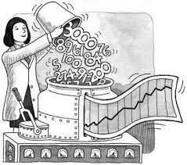{fig-align="center" width="90%"}

::::
:::

# [2. TESTES DE HIPÓTESES]{.section-header}

## Hipóteses Científicas {.smaller-text}

::: {.info-box}
**Hipótese:** Uma expectativa sobre as características morfológicas de uma nova cultivar.
:::
::: {.highlight-box}
**Exemplo:** A cultivar Abacaxi BRS Ajubá apresenta maior nível de controle da fusariose que a cultivar BRS Vitória.
:::
::: {.box}
**Teste de hipótese:** Avaliação, por meio de métodos científicos, da hipótese estabelecida.
:::

## Passo a Passo {.smaller-text}

::: {.info-box}
**Etapas para teste de hipóteses:**
:::
::: {.columns}
:::: {.column width="50%"}

::: {.box}
[1]{.circle} Crie uma ou mais **hipóteses**

[2]{.circle} Colete dados **úteis** para testá-las
:::

::::
:::: {.column width="50%"}

::: {.box}
[3]{.circle} Analise os dados com **testes estatísticos** adequados

[4]{.circle} Avalie os resultados para ver se **suportam** as hipóteses
:::

::::
:::

## Ho e Ha {.smaller-text}

::: {.info-box}
Ao coletar dados, você se depara com **duas possibilidades**:
:::
::: {.columns}
:::: {.column width="50%"}

::: {.box}
**Hipótese Nula (Ho)**

O efeito **não existe**.

É a hipótese que se busca **rejeitar**.
:::

::::
:::: {.column width="50%"}

::: {.highlight-box}
**Hipótese Alternativa (Ha)**

O efeito **existe**.

É a hipótese do **pesquisador**.
:::

::::
:::

# [3. INFERÊNCIA FREQUENTISTA]{.section-header}

## Valor-*p* de Fisher {.smaller-text}

::: {.columns}
:::: {.column width="55%"}

::: {.info-box}
**Ronald Fisher (1935)**

- Critério probabilístico objetivo: $p < 0{,}05$
- Teste de Significância da Hipótese Nula (TSHN)
:::
::: {.highlight-box}
O critério do valor-*p* assume, **arbitrariamente**, uma probabilidade de **5% de chance de erro** na inferência.
:::

::::
:::: {.column width="45%"}

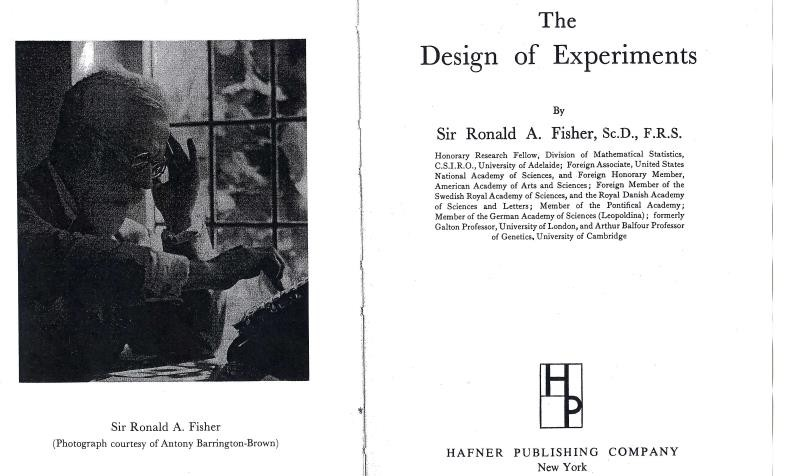{fig-align="center" width="80%"}

::::
:::

## Valor-*p*: Exemplo Prático {.smaller-text}

::: {.info-box}
A cultivar Abacaxi BRS Ajubá apresenta maior nível ($M = 6{,}32$; $DP = 1{,}33$) de controle da fusariose quando comparada à cultivar BRS Vitória ($M = 8{,}79$; $DP = 1{,}19$; $p < 0{,}05$).
:::
::: {.box}
**Exemplos de inferência com valor-*p*:**

- Vetiver com sistema radicular maior que Paspalum ($p < 0{,}05$)
- Depressão se associou com baixa motivação no laboratório ($p < 0{,}01$)
- Não houve associação entre consumo de maconha e perda de libido ($p = 0{,}18$)
- Associação entre consumo de maconha e diminuição na memória foi marginalmente significativa ($p = 0{,}06$)
:::

## Cuidados com o Valor-*p* {.smaller-text}

::: {.highlight-box}
O valor de *p* é **fortemente influenciado** pelo tamanho amostral!
:::
::: {.columns}
:::: {.column width="50%"}

::: {.box}
**Mesmo efeito (r = 0,245), diferentes N:**

| N    | Valor de *p* | Significativo? |
|:----:|:----------:|:--------------:|
| 10   | 0,495      | Não            |
| 20   | 0,298      | Não            |
| 50   | 0,086      | Não            |
| 70   | 0,041      | **Sim**        |
| 150  | 0,003      | **Sim**        |
:::

::::
:::: {.column width="50%"}

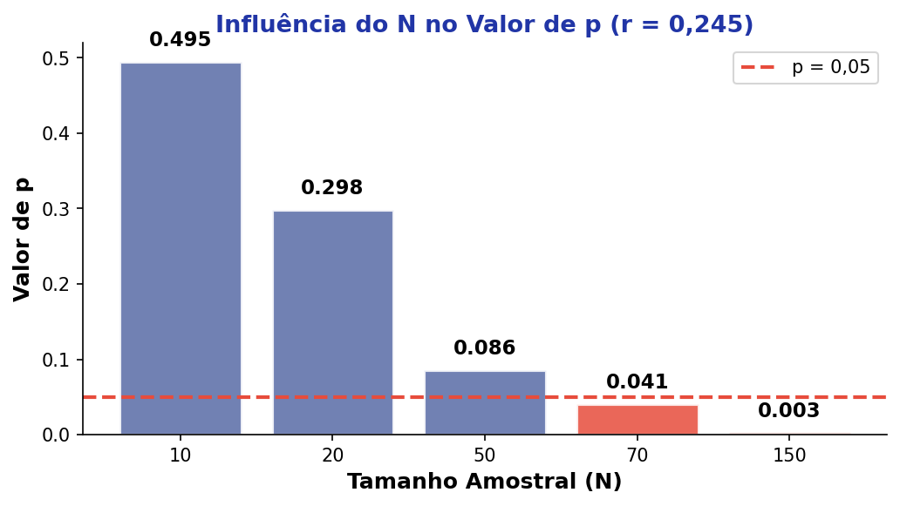{fig-align="center" width="100%"}

::::
:::
::: {.info-box}
O valor de *p* **não reflete**, por si só, a **magnitude** do efeito.
:::

# [4. ERROS TIPO I E TIPO II]{.section-header}

## Matriz de Decisão {.smaller-text}

::: {.info-box}
Ao tomar decisões sobre Ho, há **duas formas de errar**:
:::
::: {.columns}
:::: {.column width="50%"}

::: {.box}
**Erro Tipo I** ($\alpha$)

Rejeitar Ho quando Ho é **verdadeira**.

→ "Afirmo que há efeito, quando **não há**."
:::
::: {.highlight-box}
**Erro Tipo II** ($\beta$)

Aceitar Ho quando Ho é **falsa**.

→ "Afirmo que não há efeito, quando **há**."
:::

::::
:::: {.column width="50%"}

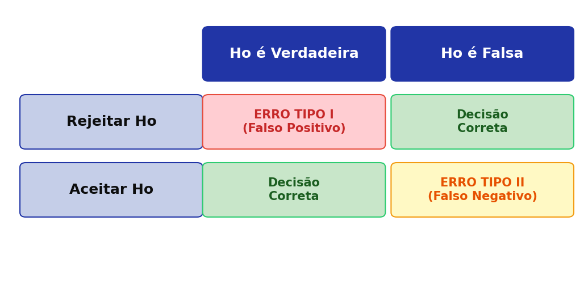{fig-align="center" width="100%"}

::::
:::

## Erros Estatísticos: Resumo Visual {.smaller-text}

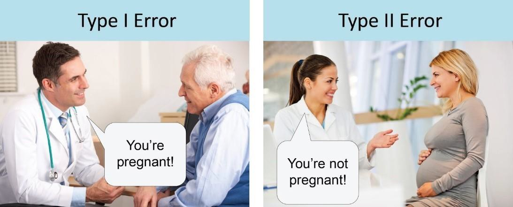{fig-align="center" width="75%"}

::: {.highlight-box}
O **equilíbrio** entre Erro Tipo I ($\alpha$) e Erro Tipo II ($\beta$) é fundamental: reduzir um aumenta o outro. O tamanho amostral e o nível de significância são as ferramentas de controle.
:::

## Outras Causas de Erro {.smaller-text}

::: {.info-box}
Situações que nos levam a cometer Erro Tipo I e Erro Tipo II:
:::
::: {.columns}
:::: {.column width="33%"}

::: {.box}
**Pressupostos**

Testes estatísticos cujos pressupostos **não foram acatados**.
:::

::::
:::: {.column width="33%"}

::: {.box}
**Amostras**

Amostras problemáticas com **vieses de seleção**.
:::

::::
:::: {.column width="34%"}

::: {.box}
**Instrumento**

Instrumento de pesquisa **ruim** ou não validado.
:::

::::
:::

# [5. TAMANHO DA AMOSTRA E PODER]{.section-header}

## Poder Amostral {.smaller-text}

::: {.info-box}
**Poder amostral:** Probabilidade de detectar um efeito do tratamento, **se estiver presente**.

$$\text{Poder} = 1 - \beta = 1 - 0{,}20 = 0{,}80$$

(Cohen, 1988, 1992)
:::
::: {.columns}
:::: {.column width="50%"}

::: {.highlight-box}
**Valores aceitos na literatura:**

- $\alpha = 0{,}05$ (significância)
- Poder $= 0{,}80$ (80%)
:::

::::
:::: {.column width="50%"}

::: {.box}
**Interpretação prática:**

Se o poder é 0,80, há **80% de chance** de detectar um efeito real e **20% de chance** de cometer Erro Tipo II ($\beta$).
:::

::::
:::

## Tamanho do Efeito {.smaller-text}

::: {.info-box}
**Tamanho do efeito:** Medida padronizada da **magnitude** da diferença ou associação encontrada, independente do tamanho amostral (Cohen, 1988).
:::
::: {.columns}
:::: {.column width="50%"}

::: {.box}
| Classificação | Valor | Interpretação |
|:---:|:---:|:---|
| Pequeno | 0,20 | Diferença sutil, difícil de perceber |
| Médio | 0,50 | Diferença moderada, perceptível |
| Grande | 0,80 | Diferença evidente, fácil de detectar |
:::

::::
:::: {.column width="50%"}

::: {.highlight-box}
Quanto **maior** o efeito, menos amostras são necessárias para detectá-lo.

O tamanho do efeito **complementa** o valor-*p*, informando a **relevância prática** do resultado.
:::

::::
:::

## Medidas de Tamanho do Efeito {.smaller-text}

::: {.info-box}
Existem diferentes medidas conforme o **tipo de análise** e o **delineamento experimental**:
:::
::: {.columns}
:::: {.column width="50%"}

::: {.box}
**$d$ de Cohen**

$$d = \frac{\bar{X}_1 - \bar{X}_2}{DP_{\text{pool}}}$$

Usa o **desvio-padrão combinado** dos dois grupos.

Indicado quando as **variâncias são semelhantes** (grupos independentes).
:::

::::
:::: {.column width="50%"}

::: {.box}
**$\Delta$ de Glass**

$$\Delta = \frac{\bar{X}_1 - \bar{X}_2}{DP_{\text{controle}}}$$

Usa o DP apenas do **grupo controle** como referência.

Indicado quando as **variâncias são desiguais** ou há grupo controle definido.
:::

::::
:::

## Outras Medidas Comuns {.smaller-text}

::: {.columns}
:::: {.column width="50%"}

::: {.box}
**$d_z$ (Cohen para medidas repetidas)**

$$d_z = \frac{\bar{D}}{DP_D}$$

Usa a **média e DP das diferenças** intra-sujeito.

Indicado para delineamentos **pareados / antes-depois**.
:::
::: {.highlight-box}
**$r$ (correlação como efeito)**

| $r$ | Classificação |
|:---:|:---|
| 0,10 | Pequeno |
| 0,30 | Médio |
| 0,50 | Grande |

Usado em **correlações** e **regressões**.
:::

::::
:::: {.column width="50%"}

::: {.box}
**$f$ de Cohen (ANOVA)**

$$f = \sqrt{\frac{\eta^2}{1 - \eta^2}}$$

| $f$ | Classificação |
|:---:|:---|
| 0,10 | Pequeno |
| 0,25 | Médio |
| 0,40 | Grande |

Usado no **G\*Power** para calcular N em ANOVA.
:::
::: {.info-box}
**Quando usar cada medida?**

| Análise | Medida recomendada |
|:---|:---|
| Teste *t* independente | $d$ de Cohen |
| Teste *t* pareado | $d_z$ |
| Variâncias desiguais | $\Delta$ de Glass |
| Correlação / Regressão | $r$ ou $R^2$ |
:::

::::
:::

## Tamanho do Efeito na ANOVA {.smaller-text}

::: {.info-box}
Na ANOVA, o tamanho do efeito indica a **proporção da variância** explicada pelo fator estudado.
:::
::: {.columns}
:::: {.column width="33%"}

::: {.box}
**$\eta^2$ (Eta-quadrado)**

$$\eta^2 = \frac{SQ_{\text{efeito}}}{SQ_{\text{total}}}$$

Proporção da variância **total** explicada.

Tende a **superestimar** o efeito.
:::

::::
:::: {.column width="33%"}

::: {.box}
**$\eta^2_p$ (Parcial)**

$$\eta^2_p = \frac{SQ_{\text{efeito}}}{SQ_{\text{efeito}} + SQ_{\text{erro}}}$$

Variância explicada **descontando outros fatores**.

Mais usado em ANOVA **fatorial**.
:::

::::
:::: {.column width="34%"}

::: {.box}
**$\omega^2$ (Ômega-quadrado)**

$$\omega^2 = \frac{SQ_{\text{efeito}} - df \cdot QM_{\text{erro}}}{SQ_{\text{total}} + QM_{\text{erro}}}$$

Estimativa **menos enviesada** que $\eta^2$.

Recomendado para **amostras pequenas**.
:::

::::
:::
::: {.highlight-box}
| $\eta^2$ / $\omega^2$ | Classificação |
|:---:|:---|
| 0,01 | Pequeno |
| 0,06 | Médio |
| 0,14 | Grande |

(Cohen, 1988)
:::

## G*Power: Interface {.smaller-text}

{fig-align="center" width="70%"}

::: {.info-box}
O **G*Power** permite calcular o tamanho amostral necessário para diferentes testes estatísticos, considerando nível de significância, poder e tamanho do efeito esperado.
:::

## Relação N × Efeito × Decisão {.smaller-text}

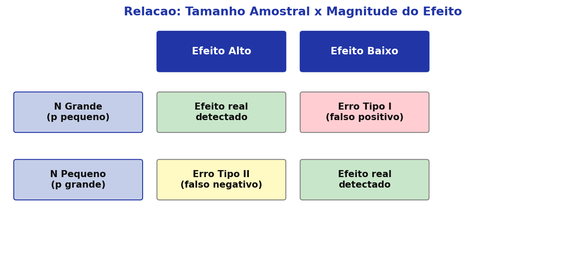{fig-align="center" width="75%"}
::: {.highlight-box}
Com **N grande** e efeito baixo → risco de **Erro Tipo I** (falso positivo).

Com **N pequeno** e efeito alto → risco de **Erro Tipo II** (falso negativo).
:::

# [6. DISTRIBUIÇÃO NORMAL]{.section-header}

## O que é a Distribuição Normal? {.smaller-text}

::: {.columns}
:::: {.column width="55%"}

::: {.info-box}
**Definição**

A Distribuição Normal é uma das distribuições de probabilidade mais utilizadas para modelar **fenômenos naturais**.

Um grande número de fenômenos naturais apresenta esse tipo de distribuição.
:::
::: {.highlight-box}
A curva normal representa a forma como diferentes valores se **agrupam em torno** de um determinado ponto.
:::

::::
:::: {.column width="45%"}

{fig-align="center" width="100%"}

::::
:::

## Propriedades da Curva Normal {.smaller-text}

::: {.columns}
:::: {.column width="50%"}

::: {.box}
**Definida por dois parâmetros:**

- **Média** ($\bar{X}$): centro da distribuição
- **Desvio-padrão** ($DP$): largura/dispersão
:::

::::
:::: {.column width="50%"}

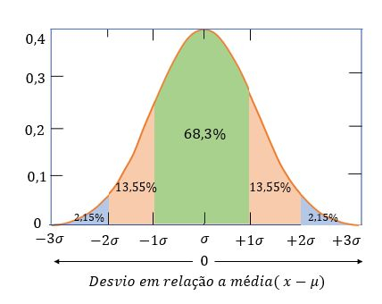{fig-align="center" width="100%"}

::::
:::

## Exemplo: Capim Vetiver {.smaller-text}

::: {.columns}
:::: {.column width="45%"}

::: {.info-box}
**Dados:** Tamanho radicular do Capim Vetiver

| Medição | cm |
|:-------:|:---:|
| 1 | 55 |
| 2 | 64 |
| 3 | 70 |
| 4 | 72 |
| 5 | 74 |
| 6 | 80 |
| 7 | 98 |
| 8 | 100 |
:::

::::
:::: {.column width="55%"}

::: {.box}
**Média:**

$$\bar{X} = \frac{613}{8} = 76{,}62 \text{ cm}$$

**Desvio-Padrão:**

$$DP = \sqrt{\frac{245}{7}} = 15{,}66 \text{ cm}$$
:::

::::
:::

## Regra Empírica (68–95–99) {.smaller-text}

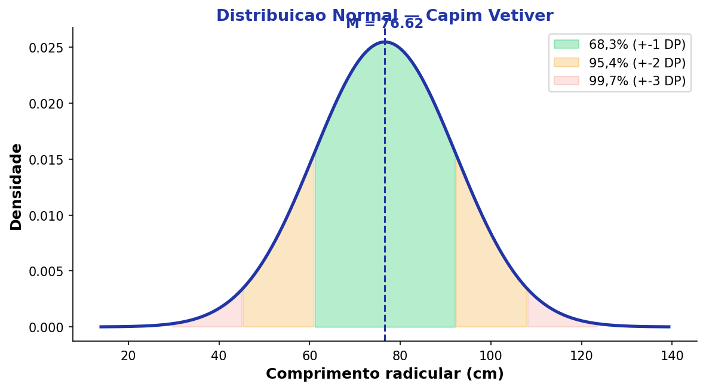{fig-align="center" width="70%"}

::: {.columns}
:::: {.column width="33%"}

::: {.box}
**±1 DP (68,3%)**

$[60{,}96 - 92{,}28]$
:::

::::
:::: {.column width="33%"}

::: {.box}
**±2 DP (95,4%)**

$[45{,}30 - 107{,}94]$
:::

::::
:::: {.column width="34%"}

::: {.box}
**±3 DP (99,7%)**

$[29{,}64 - 123{,}60]$
:::

::::
:::

# [7. DESVIOS DE NORMALIDADE]{.section-header}

## Assimetria {.smaller-text}

::: {.info-box}
**Assimetria (Skewness):** Mede o grau de **desvio da simetria** da distribuição.
:::
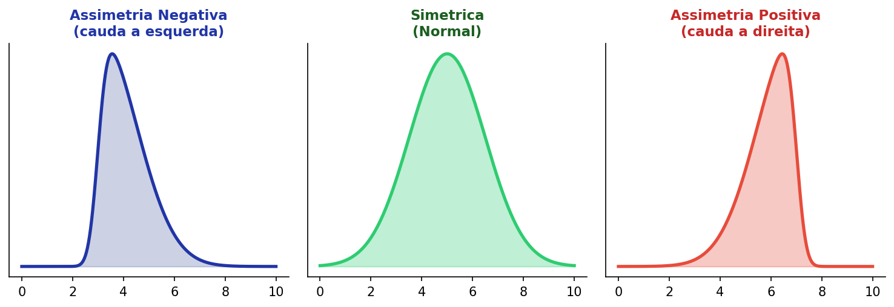{fig-align="center" width="80%"}
::: {.highlight-box}
**Exemplo real:** A distribuição de renda no Brasil é **assimétrica positiva**, com muitas pessoas com renda baixa e poucas com renda alta.
:::

## Curtose {.smaller-text}

::: {.info-box}
**Curtose (Kurtosis):** Mede o grau de **achatamento** da distribuição.
:::
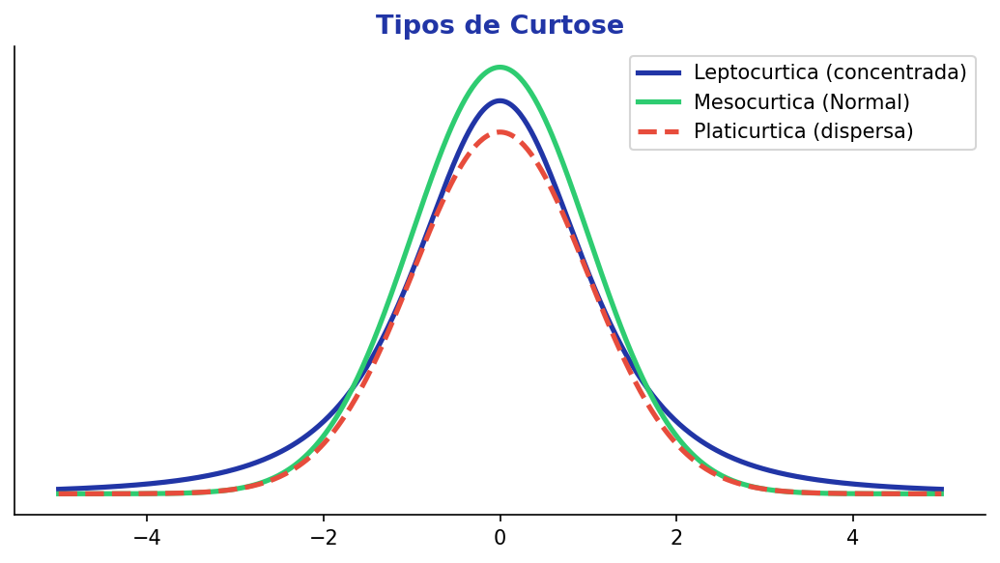{fig-align="center" width="65%"}
::: {.columns}
:::: {.column width="33%"}

::: {.box}
**Leptocúrtica**

Dados muito **concentrados** junto à média.
:::

::::
:::: {.column width="33%"}

::: {.box}
**Mesocúrtica**

Distribuição **normal** (referência).
:::

::::
:::: {.column width="34%"}

::: {.box}
**Platicúrtica**

Dados muito **dispersos**; muitos valores afastados da média.
:::

::::
:::

# [8. TESTES DE NORMALIDADE]{.section-header}

## Critérios Descritivos {.smaller-text}

::: {.info-box}
**Critérios descritivos** (Tabachnick & Fidell, 2019)
:::
::: {.box}
**Procedimento:** Transformar o escore de Assimetria e Curtose em **escore Z**:

$$Z = \frac{\text{Assimetria (ou Curtose)}}{\text{Erro-padrão}}$$
:::
::: {.columns}
:::: {.column width="33%"}

::: {.highlight-box}
$|Z| > 1{,}96$

$p < 0{,}05$
:::

::::
:::: {.column width="33%"}

::: {.highlight-box}
$|Z| > 2{,}58$

$p < 0{,}01$
:::

::::
:::: {.column width="34%"}

::: {.highlight-box}
$|Z| > 3{,}29$

$p < 0{,}001$
:::

::::
:::

## Critérios Descritivos: Exemplo Visual {.smaller-text}

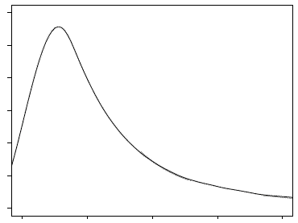{fig-align="center" width="75%"}

## Critérios Estatísticos {.smaller-text}

::: {.info-box}
**Testes de significância** para normalidade:

- **Kolmogorov-Smirnov** e **Shapiro-Wilk**
- Hipótese nula: dados **não são** normalmente distribuídos
:::
::: {.highlight-box}
Espera-se **rejeitar** a Ho → dados **são** normalmente distribuídos.

Nos testes K-S e S-W, espera-se $p > 0{,}05$ para **acatar** a normalidade.
:::
## Testes K-S e Shapiro-Wilk: Referências Visuais {.smaller-text}

::: {.columns}
:::: {.column width="50%"}

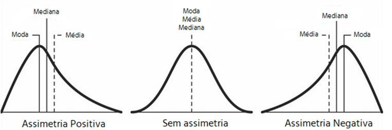{fig-align="center" width="95%"}

::::
:::: {.column width="50%"}

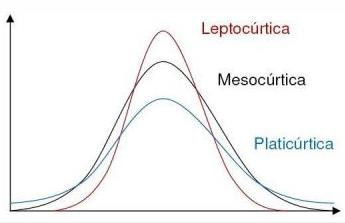{fig-align="center" width="95%"}

::::
:::

## Hierarquia de Poder dos Testes {.smaller-text}

::: {.columns}
:::: {.column width="55%"}

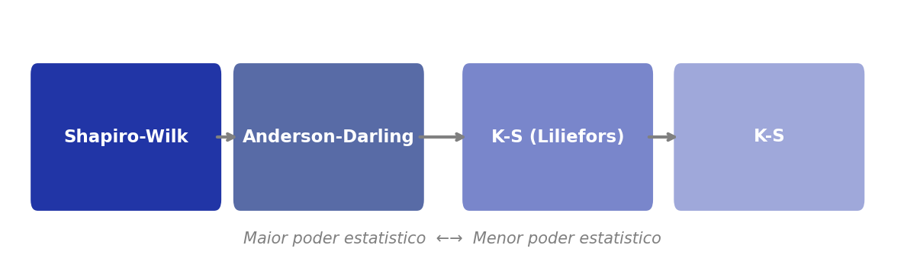{fig-align="center" width="100%"}

::::
:::: {.column width="45%"}

{fig-align="center" width="100%"}

::::
:::
::: {.info-box}
**Recomendação:** Prefira o **Shapiro-Wilk** quando possível, pois é o teste com maior poder estatístico para detectar desvios de normalidade.
:::

## Resumo: Normalidade na Prática {.smaller-text}

::: {.columns}
:::: {.column width="50%"}

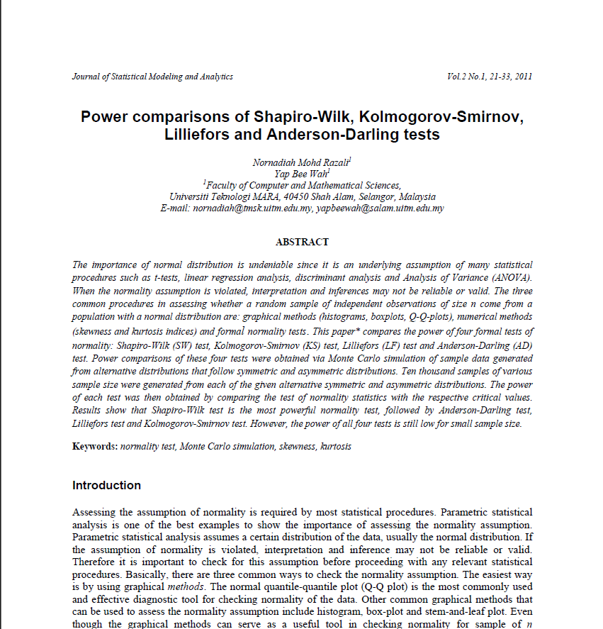{fig-align="center" width="95%"}

::::
:::: {.column width="50%"}

{fig-align="center" width="95%"}

::::
:::

## {.center background-color="#2135A6"}

::: {style="text-align: center;"}
[Obrigado!]{.obrigado-fit-text style="color: white;"}

::: {style="color: white; font-size: 0.7em;"}
Luiz Diego Vidal Santos

Universidade Estadual de Feira de Santana (UEFS)
:::
:::
