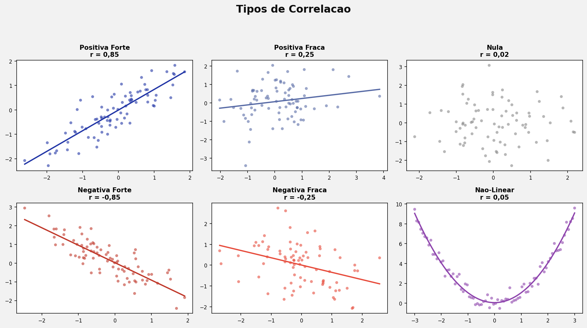
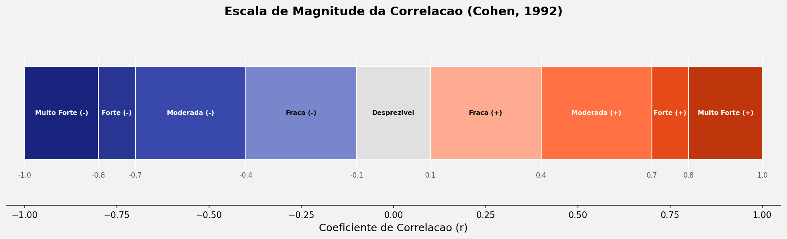
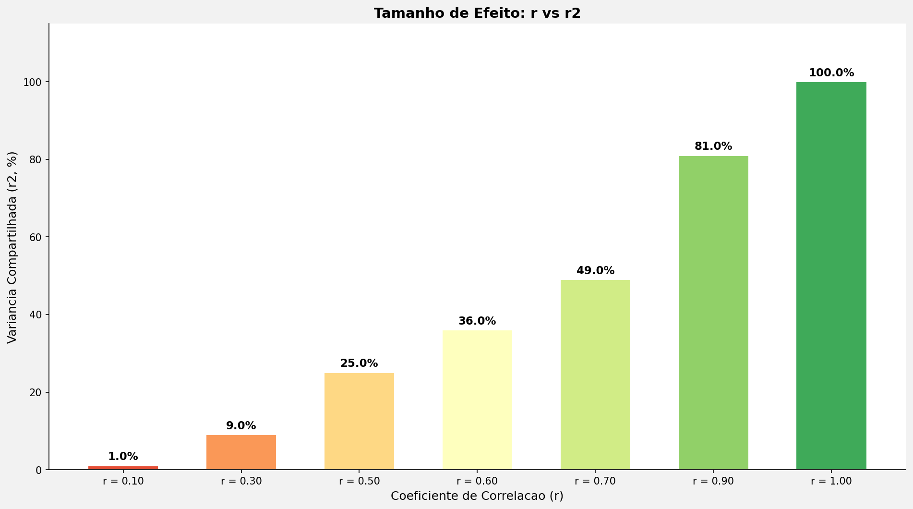
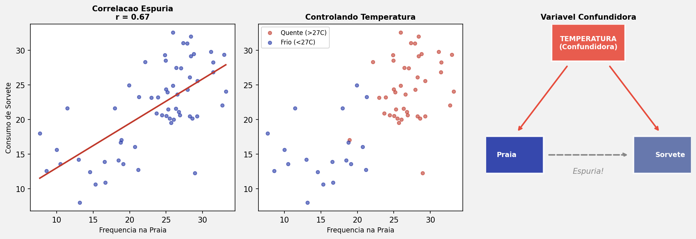

## Roteiro da Aula {.smaller-text}

::: {.columns}
:::: {.column width="60%"}

- [1]{.circle} O que é Correlação?
- [2]{.circle} Direção da Correlação
- [3]{.circle} Coeficiente de Correlação
- [4]{.circle} Tamanho do Efeito ($r^2$)
- [5]{.circle} Pearson vs. Spearman vs. Kendall
- [6]{.circle} Exemplo Prático
- [7]{.circle} Tópicos Especiais
- [8]{.circle} Correlação Parcial

::::
:::: {.column width="40%"}

::: {.info-box}
**Objetivo:** Compreender os fundamentos da análise de correlação, os tipos de coeficientes e suas aplicações em dados ambientais.
:::

::::
:::

# [1. O QUE É CORRELAÇÃO?]{.section-header}

## Definição {.smaller-text}

::: {.columns}
:::: {.column width="55%"}

::: {.info-box}
**Correlação** é uma técnica que avalia a **associação entre duas ou mais variáveis**.

- As variáveis devem ser **métricas** ou **ordinais** (peso, altura, glicemia, nível de felicidade)
- Existem casos especiais para dados categóricos (correlação ponto-bisserial)
:::

::::
:::: {.column width="45%"}

::: {.highlight-box}
**Exemplo:** Qual a relação entre o estresse no trabalho e o número de cigarros fumados?

Três características a avaliar:

[1]{.circle} **Significância** ($p < 0{,}05$)

[2]{.circle} **Direção** (positiva ou negativa)

[3]{.circle} **Força** (fraca, moderada, forte)
:::

::::
:::

# [2. DIREÇÃO DA CORRELAÇÃO]{.section-header}

## Positiva, Negativa e Nula {.smaller-text}

::: {.columns}
:::: {.column width="55%"}

::: {.box}
**Positiva:** Valores altos em $x$ associam-se a valores altos em $y$.

Ex.: Idade da criança e capacidade de montar Lego.
:::

::: {.box}
**Negativa:** Valores altos em $x$ associam-se a valores baixos em $y$.

Ex.: Depressão e motivação para trabalhar.
:::

::: {.box}
**Nula:** Não existe associação linear.

Ex.: Altura e número de relacionamentos amorosos.
:::

::::
:::: {.column width="45%"}

{fig-align="center" width="100%"}

::::
:::

## Perfeita, Imperfeita e Não-Linear {.smaller-text}

::: {.columns}
:::: {.column width="50%"}

::: {.info-box}
**Correlação perfeita** ($r = \pm 1$)

Sua idade e a idade de sua irmã (diferença constante).
:::

::: {.info-box}
**Correlação imperfeita** ($0 < |r| < 1$)

Inteligência lógico-matemática e nota na prova de matemática.
:::

::::
:::: {.column width="50%"}

::: {.highlight-box}
**Correlação não-linear**

Pode não haver correlação *linear*, mas existir relação *curvilínea*.

Ex.: Idade vs. Força física (cresce, estabiliza, decresce).

Nesse caso, é necessário um método de correlação não-linear.
:::

::::
:::

# [3. COEFICIENTE DE CORRELAÇÃO]{.section-header}

## Escala do Coeficiente {.smaller-text}

::: {.columns}
:::: {.column width="45%"}

{fig-align="center" width="100%"}

::::
:::: {.column width="55%"}

::: {.box}
**Cohen (1988, 1992)**

| Magnitude | $|r|$ |
|:---:|:---:|
| Nula | $0{,}00$ |
| Fraca | $0{,}10 - 0{,}30$ |
| Moderada | $0{,}30 - 0{,}50$ |
| Forte | $> 0{,}50$ |
:::

::: {.highlight-box}
**Classificação detalhada**

| Magnitude | $|r|$ |
|:---:|:---:|
| Fraca | $0{,}10 - 0{,}39$ |
| Moderada | $0{,}40 - 0{,}69$ |
| Forte | $0{,}70 - 0{,}80$ |
| Muito forte | $0{,}80 - 0{,}99$ |
| Perfeita | $1{,}00$ |
:::

::::
:::

# [4. TAMANHO DO EFEITO ($r^2$)]{.section-header}

## Coeficiente de Determinação {.smaller-text}

::: {.columns}
:::: {.column width="50%"}

::: {.info-box}
**O que é?**

O tamanho de efeito da correlação indica a **proporção de variância compartilhada** entre duas variáveis.

$$r^2 = (0{,}60)^2 = 0{,}36 = 36\%$$

Ou seja, 36% da variação em $y$ é explicada por $x$.
:::

::::
:::: {.column width="50%"}

::: {.box}
| $r$ | $r^2$ | Variância |
|:---:|:---:|:---:|
| 0,10 | 0,01 | 1% |
| 0,30 | 0,09 | 9% |
| 0,50 | 0,25 | 25% |
| 0,70 | 0,49 | 49% |
| 0,90 | 0,81 | 81% |
| 1,00 | 1,00 | 100% |
:::

::::
:::

{fig-align="center" width="55%"}

# [5. PEARSON vs. SPEARMAN vs. KENDALL]{.section-header}

## Quando usar cada coeficiente? {.smaller-text}

::: {.columns}
:::: {.column width="50%"}

::: {.info-box}
**Correlação de Pearson**

- **Paramétrica**
- Dados com distribuição **normal**
- Medida **escalar/intervalar**
- N amostral **alto**
:::

::::
:::: {.column width="50%"}

::: {.highlight-box}
**Spearman / Kendall ($\tau_b$)**

- **Não-paramétricas**
- Dados **sem** distribuição normal
- Medida **ordinal**
- Útil com N amostral **baixo**
:::

::::
:::

# [6. EXEMPLO PRÁTICO]{.section-header}

## Hipótese e Dados {.smaller-text}

::: {.columns}
:::: {.column width="45%"}

{fig-align="center" width="90%"}

::::
:::: {.column width="55%"}

::: {.info-box}
**Hipótese:**

Os valores de resistência à tração e do módulo de Young apresentam associação significativa em fibras de geotêxteis produzidos com fibras naturais de Taboa quando expostos a degradação natural.
:::

::::
:::

## Matriz de Correlação {.smaller-text}

::: {.box}
| Variável | Deformação | Rigidez Sec. | Módulo Young | Máx. Carga | Resist. Tração |
|:---|:---:|:---:|:---:|:---:|:---:|
| Deformação | — | | | | |
| Rigidez Sec. | 0,194 | — | | | |
| Módulo Young | −0,275\* | 0,415\*\*\* | — | | |
| Máx. Carga | 0,410\*\*\* | 0,809\*\*\* | 0,308\*\* | — | |
| Resist. Tração | 0,410\*\*\* | 0,809\*\*\* | 0,308\*\* | 1,000\*\*\* | — |
:::

::: {.highlight-box}
\* $p < 0{,}05$ · \*\* $p < 0{,}01$ · \*\*\* $p < 0{,}001$
:::

# [7. TÓPICOS ESPECIAIS]{.section-header}

## Comparação entre Coeficientes {.smaller-text}

::: {.info-box}
Quando há múltiplas correlações significativas, é preciso testar se os coeficientes são **estatisticamente diferentes** entre si.
:::

::: {.columns}
:::: {.column width="50%"}

::: {.box}
**Afirmação incompleta:**

"A deformação correlacionou-se mais fortemente com a resistência à tração ($r = 0{,}410$) do que com o módulo de Young ($r = −0{,}275$)."

Comparar magnitudes sem teste formal é **meia verdade**.
:::

::::
:::: {.column width="50%"}

::: {.highlight-box}
**Solução: teste *r-to-z* de Fisher**

Comparando $r_1 = 0{,}410$ vs. $r_2 = −0{,}275$:

$z = −2{,}885$; $p = 0{,}149$

A diferença entre os coeficientes **não é significativa**.
:::

::::
:::

## Correlação Ponto-Bisserial {.smaller-text}

::: {.columns}
:::: {.column width="55%"}

::: {.info-box}
**Quando usar?**

Para avaliar a relação entre uma variável **métrica** (ex.: resistência à punção) e uma variável **dicotômica** (ex.: com resina / sem resina).
:::

::::
:::: {.column width="45%"}

::: {.highlight-box}
Funciona como um **indício** de que existem diferenças entre grupos, antes de aplicar um teste $t$.
:::

::::
:::

## Correlação ≠ Causalidade {.smaller-text}

::: {.columns}
:::: {.column width="55%"}

::: {.highlight-box}
Correlação **não é** sinônimo de causalidade.

A associação entre duas variáveis pode ser causada por uma **terceira variável oculta** (variável de confusão).
:::

::: {.box}
**Exemplo clássico:**

Ir à praia e tomar sorvete estão correlacionados — mas a causa real é a **temperatura**.
:::

::::
:::: {.column width="45%"}

{fig-align="center" width="100%"}

::::
:::

# [8. CORRELAÇÃO PARCIAL]{.section-header}

## Controlando Variáveis de Confusão {.smaller-text}

::: {.info-box}
A **correlação parcial** remove o efeito de uma terceira variável para isolar a relação entre as duas variáveis de interesse.
:::

::: {.columns}
:::: {.column width="50%"}

::: {.box}
**Sem controle:**

Felicidade × Sentido de vida

$r = 0{,}518$ · $r^2 = 0{,}268$ (26,8%)
:::

::::
:::: {.column width="50%"}

::: {.highlight-box}
**Controlando por Otimismo:**

Felicidade × Sentido de vida

$r = 0{,}362$ · $r^2 = 0{,}131$ (13,1%)

A correlação **reduz** quando se controla o otimismo — parte da associação era mediada por essa variável.
:::

::::
:::

## {.center background-color="#2135A6"}

::: {style="text-align: center;"}
[Obrigado!]{.obrigado-fit-text style="color: white;"}

::: {style="color: white; font-size: 0.7em;"}
Luiz Diego Vidal Santos

Universidade Estadual de Feira de Santana (UEFS)
:::
:::
