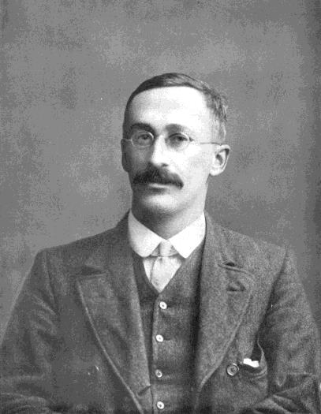
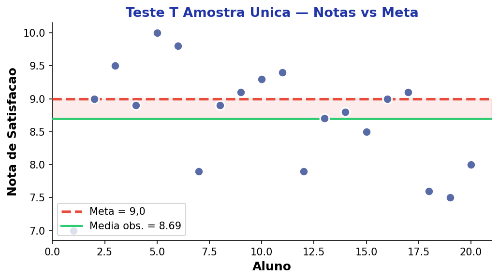
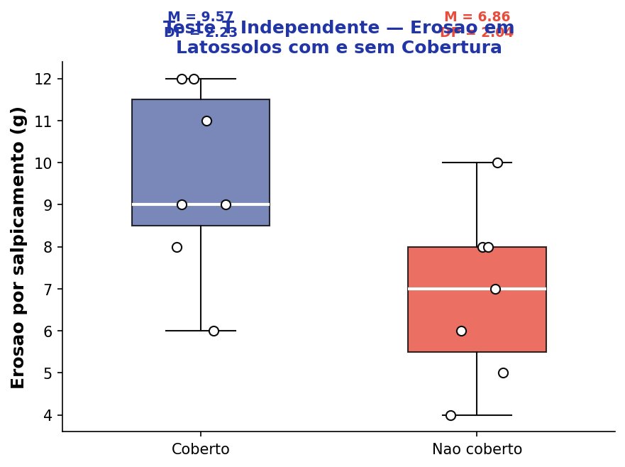
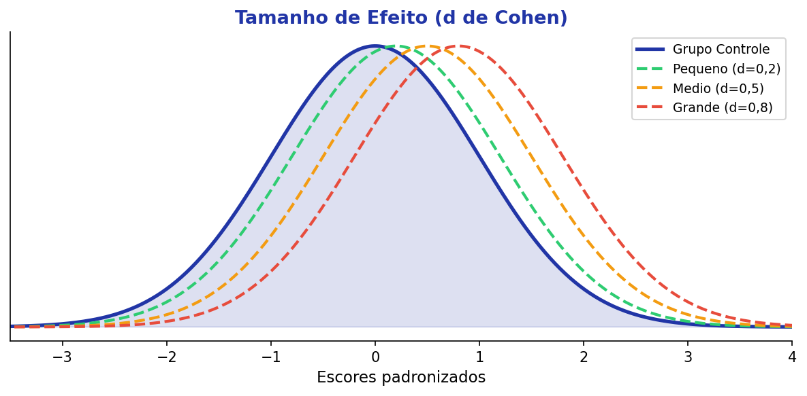

---
title: "Testes de Hipóteses (Teste T)"
subtitle: "Aula 08. Teste T para Amostras Únicas, Independentes e Pareadas<br>Análise de Dados Ambientais"
author: "Luiz Diego Vidal Santos"
format:
  revealjs:
    logo: ../../../assets/logo-uefs.webp
    footer: "UEFS | Análise de Dados Ambientais | Aula 08"
    slide-number: true
    theme: [simple, ../../../assets/uefs.scss]
    controls: true
    width: 1280
    height: 720
    css: ../../../assets/custom.css
    include-after-body: ../../../assets/image-lightbox.html
    transition: slide
    background-transition: fade
    preview-links: auto
execute:
  echo: false
---

## Roteiro da Aula {.smaller-text}

::: {.columns}
:::: {.column width="60%"}

- [1]{.circle} O que é o Teste T?
- [2]{.circle} Pressupostos do Teste T
- [3]{.circle} Teste T (Amostra Única)
- [4]{.circle} Teste T (Amostras Independentes)
- [5]{.circle} Pressupostos Específicos & Homoscedasticidade
- [6]{.circle} Teste T para Amostras Dependentes (Pareadas)
- [7]{.circle} Tamanho de Efeito

::::
:::: {.column width="40%"}

::: {.info-box}
**Objetivo:** Compreender os três tipos de Teste T e quando usar cada um para comparar médias, de forma acessível, com exemplos do campo ambiental e agrário.
:::

::::
:::


# [1. O QUE É O TESTE T?]{.section-header}

## Teste T de Student {.smaller-text}

::: {.columns}
:::: {.column width="55%"}

::: {.info-box}
**Definição**

O Teste T é um **teste estatístico paramétrico** usado para **comparar médias**.

Em outras palavras: ele responde à pergunta *"essa diferença de médias é real ou aconteceu por acaso?"*
:::

. . .

::: {.highlight-box}
**Analogia simples:** Imagine que você pesa dois sacos de feijão. Um marca 48 kg e outro 52 kg. Essa diferença de 4 kg é significativa ou é só variação natural entre sacos?

O Teste T responde exatamente isso, mas com rigor estatístico.
:::

::::
:::: {.column width="45%"}

::: {.box}
**Quem criou?**

William Sealy Gosset (1876–1937), estatístico da cervejaria Guinness, publicou sob o pseudônimo **"Student"**, pois a empresa proibia publicações com nome real.

{width="50%" fig-align="center"}
:::

::::
:::


## Três Tipos de Teste T {.smaller-text}

{width="85%" fig-align="center"}

. . .

| Tipo | Quando usar? | Exemplo ambiental |
|---|---|---|
| **Amostra Única** | 1 grupo vs. valor fixo conhecido | Temperatura média local vs. média histórica |
| **Amostras Independentes** | 2 grupos distintos | Solo coberto vs. solo exposto |
| **Amostras Dependentes** | 1 grupo em 2 momentos | Volume radicular pré e pós-adubação |


# [2. PRESSUPOSTOS DO TESTE T]{.section-header}

## Condições para Aplicar o Teste T {.smaller-text}

::: {.columns}
:::: {.column width="50%"}

::: {.info-box}
**O que são pressupostos?**

São condições que os dados precisam atender para que o resultado do teste seja confiável. Pense neles como "regras do jogo".
:::

::::
:::: {.column width="50%"}

::: {.box}
[1]{.circle} **Distribuição normal.** Os dados devem seguir (aproximadamente) a curva normal

[2]{.circle} **Nível intervalar.** A variável medida deve ser contínua (peso, temperatura, nota...)

[3]{.circle} **Independência.** Uma observação não pode influenciar a outra

[4]{.circle} **Homogeneidade de variâncias.** As dispersões dos grupos devem ser semelhantes *(apenas para amostras independentes)*
:::

::::
:::

. . .

::: {.highlight-box}
**Dica prática:** Na Aula 04 vimos como verificar a normalidade (Shapiro-Wilk, Kolmogorov-Smirnov). Para a homogeneidade de variâncias, usamos o **Teste de Levene**.
:::


# [3. TESTE T: AMOSTRA ÚNICA]{.section-header}

## Conceito (Uma Amostra vs. Valor Fixo) {.smaller-text}

::: {.columns}
:::: {.column width="55%"}

::: {.info-box}
**Quando utilizar?**

Quando queremos comparar a **média de um único grupo** com um **valor de referência já conhecido** (média populacional, meta institucional, limite normativo, etc.).
:::

. . .

::: {.highlight-box}
**Exemplos práticos:**

- A temperatura média em 2024 difere da média histórica (25,3 °C)?
- A concentração de fósforo em amostras de solo é diferente do limite de 20 mg/dm³?
- A satisfação dos alunos é menor do que a meta de 9,0?
:::

::::
:::: {.column width="45%"}

```{mermaid}
%%| fig-width: 5
flowchart TD
    A["<b style='color:#fff; font-weight:bold'>Amostra Unica</b>"] --> B["Coleta dados\n do grupo"]
    B --> C["Calcula media\n e desvio-padrao"]
    C --> D{"Media amostra\n ≠ valor fixo?"}
    D -- "Nao sig." --> E["Diferenca = acaso"]
    D -- "Sig. p<0,05" --> F["Diferenca real"]

    style A fill:#2135A6,color:#fff,font-weight:bold
    style D fill:#C5CEE8,color:#0D0D0D
    style E fill:#F2F2F2,color:#0D0D0D
    style F fill:#27368C,color:#fff
    style B fill:#C5CEE8,color:#0D0D0D
    style C fill:#C5CEE8,color:#0D0D0D
```

::::
:::


## Exemplo Prático (Satisfação Discente) {.smaller-text}

::: {.info-box}
**Situação:** Um professor desconfia que o nível de satisfação dos seus alunos é inferior à sua **meta de 9,0**. Ele entrevistou 20 alunos (manhã e tarde):
:::

::: {.columns}
:::: {.column width="55%"}

| Turno | Notas |
|---|---|
| **Manhã** | 7,0 · 9,0 · 9,5 · 8,9 · 10,0 · 9,8 · 7,9 · 8,9 · 9,1 · 9,3 |
| **Tarde** | 9,4 · 7,9 · 8,7 · 8,8 · 8,5 · 9,0 · 9,1 · 7,6 · 7,5 · 8,0 |


. . .

::: {.box}
**Hipóteses:**

- $H_0$: $\mu = 9{,}0$ (a média é igual à meta)
- $H_1$: $\mu < 9{,}0$ (a média é menor que a meta)
:::

::::
:::: {.column width="45%"}

{width="100%"}

::::
:::


## Cálculo e Decisão (Amostra Única) {.smaller-text}

::: {.columns}
:::: {.column width="50%"}

::: {.info-box}
**Fórmula do Teste T (amostra única):**

$$t = \frac{\bar{x} - \mu_0}{s / \sqrt{n}}$$

Onde:

- $\bar{x}$ = média da amostra
- $\mu_0$ = valor de referência (9,0)
- $s$ = desvio-padrão da amostra
- $n$ = tamanho da amostra (20)
:::

::::
:::: {.column width="50%"}

::: {.box}
**Valores críticos:**

- Graus de liberdade: $gl = n - 1 = 19$
- $t_{\text{tabelado}}$ (bicaudal, $\alpha$ = 0,05): **2,093**

Se $|t_{\text{calculado}}| > t_{\text{tabelado}}$ → **rejeitamos** $H_0$
:::

. . .

::: {.highlight-box}
**Interpretação simples:** Se o valor de *t* calculado ultrapassa o tabelado, a diferença observada **não é mero acaso**, ou seja, há evidência estatística de que a média difere da meta.
:::

::::
:::


# [4. TESTE T: AMOSTRAS INDEPENDENTES]{.section-header}

## Conceito (Dois Grupos Distintos) {.smaller-text}

::: {.columns}
:::: {.column width="55%"}

::: {.info-box}
**Quando utilizar?**

Quando queremos comparar as médias de **dois grupos independentes** (que não possuem relação entre si).

A ideia é simples: coletamos dados de dois grupos diferentes e verificamos se a diferença entre suas médias é estatisticamente significativa.
:::

. . .

::: {.highlight-box}
**Exemplos de pesquisas ambientais:**

- Intensificação de pastejo em bovinos de corte: sistema intermitente vs. contínuo
- Contenção da erosão: geogrid com resina vs. sem resina
- Salpicamento em solos: com cobertura vegetal vs. sem cobertura
:::

::::
:::: {.column width="45%"}

```{mermaid}
%%| fig-width: 5
flowchart TD
    A["<b style='color:#fff; font-weight:bold'>Amostras Independentes</b>"] --> B["Grupo A"]
    A --> C["Grupo B"]
    B --> D["Media A"]
    C --> E["Media B"]
    D --> F{"Media A ≠ Media B?"}
    E --> F
    F -- "Nao sig." --> G["Diferenca = acaso"]
    F -- "Sig. p<0,05" --> H["Diferenca real"]

    style A fill:#2135A6,color:#fff,font-weight:bold
    style B fill:#C5CEE8,color:#0D0D0D
    style C fill:#C5CEE8,color:#0D0D0D
    style F fill:#C5CEE8,color:#0D0D0D
    style G fill:#F2F2F2,color:#0D0D0D
    style H fill:#27368C,color:#fff
    style D fill:#C5CEE8,color:#0D0D0D
    style E fill:#C5CEE8,color:#0D0D0D
```

::::
:::


## Exemplo (Erosão em Latossolos) {.smaller-text}

::: {.info-box}
**Pergunta:** Existem diferenças nos níveis de erosão por salpicamento em latossolos com e sem cobertura do solo?
:::

::: {.columns}
:::: {.column width="45%"}

| Coberto | Não coberto |
|:---:|:---:|
| 12 | 10 |
| 9 | 8 |
| 6 | 8 |
| 11 | 4 |
| 12 | 5 |
| 9 | 7 |
| 8 | 6 |


::::
:::: {.column width="55%"}

{width="100%"}

::::
:::


## Fórmula e Interpretação (Independentes) {.smaller-text}

::: {.columns}
:::: {.column width="50%"}

::: {.info-box}
**Fórmula do Teste T (amostras independentes):**

$$t = \frac{\bar{x}_1 - \bar{x}_2}{\sqrt{\frac{s_1^2}{n_1} + \frac{s_2^2}{n_2}}}$$

Onde:

- $\bar{x}_1, \bar{x}_2$ = médias dos dois grupos
- $s_1^2, s_2^2$ = variâncias dos dois grupos
- $n_1, n_2$ = tamanhos amostrais
:::

::::
:::: {.column width="50%"}

::: {.box}
**No exemplo de erosão:**

- **Coberto:** $M = 9{,}57$ ; $DP = 2{,}22$
- **Não coberto:** $M = 6{,}86$ ; $DP = 2{,}03$
- $gl = n_1 + n_2 - 2 = 12$
:::

. . .

::: {.highlight-box}
**Hipóteses:**

- $H_0$: $\mu_1 = \mu_2$ (as médias são iguais)
- $H_1$: $\mu_1 \neq \mu_2$ (as médias diferem)

Se $p < 0{,}05$ → a cobertura **influencia significativamente** a erosão.
:::

::::
:::


# [5. PRESSUPOSTOS & HOMOSCEDASTICIDADE]{.section-header}

## Homogeneidade de Variâncias {.smaller-text}

::: {.columns}
:::: {.column width="50%"}

::: {.info-box}
**O que é homoscedasticidade?**

Significa que a **variabilidade** (dispersão) dos dados em torno da média é **semelhante** entre os grupos comparados.

Não confundir com médias iguais! Os grupos podem ter médias diferentes, mas dispersões parecidas.
:::

. . .

::: {.highlight-box}
**Analogia:** Imagine dois alvos de tiro ao alvo. As flechas podem acertar centros diferentes (médias diferentes), mas se ambos os conjuntos de flechas estão igualmente espalhados, há homoscedasticidade.
:::

::::
:::: {.column width="50%"}

{width="100%"}

::::
:::


## Correção de Welch {.smaller-text}

::: {.columns}
:::: {.column width="55%"}

::: {.info-box}
**E se as variâncias forem diferentes?**

O Teste T clássico assume variâncias iguais. Quando isso não ocorre (heterocedasticidade), usamos a **correção de Welch**, que ajusta os graus de liberdade.
:::

. . .

::: {.box}
**Na prática:**

- O software JASP/SPSS já calcula automaticamente as duas versões: com e sem correção de Welch
- Sempre verifique o **Teste de Levene**: se $p < 0{,}05$, as variâncias são diferentes → use Welch
- Se $p > 0{,}05$ → variâncias homogêneas → use Student clássico
:::

::::
:::: {.column width="45%"}

::: {.highlight-box}
**Resumo visual:**

| Levene | Variâncias | Usar |
|:---:|:---:|:---:|
| $p > 0{,}05$ | Iguais | Student |
| $p < 0{,}05$ | Diferentes | Welch |


:::

::::
:::


# [6. TESTE T: AMOSTRAS DEPENDENTES]{.section-header}

## Conceito (Pré e Pós-teste) {.smaller-text}

::: {.columns}
:::: {.column width="55%"}

::: {.info-box}
**Quando utilizar?**

Quando **um mesmo grupo** é avaliado em **dois momentos diferentes** (antes e depois de um tratamento, intervenção ou evento).

A grande vantagem é que cada sujeito/repetição serve como seu **próprio controle**.
:::

. . .

::: {.highlight-box}
**Exemplos ambientais:**

- Volume radicular **antes** e **depois** da adubação nitrogenada
- Qualidade da água **antes** e **depois** da instalação de mata ciliar
- Resistência do solo **antes** e **depois** da aplicação de bioestabilizante
:::

::::
:::: {.column width="45%"}

{width="100%"}

::::
:::


## Fórmula e Lógica (Dependentes) {.smaller-text}

::: {.columns}
:::: {.column width="50%"}

::: {.info-box}
**Fórmula do Teste T pareado:**

$$t = \frac{\bar{d}}{s_d / \sqrt{n}}$$

Onde:

- $\bar{d}$ = média das **diferenças** (pós − pré) para cada par
- $s_d$ = desvio-padrão das diferenças
- $n$ = número de pares
:::

::::
:::: {.column width="50%"}

::: {.box}
**Hipóteses:**

- $H_0$: $\mu_d = 0$ (não há diferença entre os momentos)
- $H_1$: $\mu_d \neq 0$ (há mudança significativa)
:::

. . .

::: {.highlight-box}
**Passo a passo simplificado:**

[1]{.circle} Calcule a diferença (pós − pré) para cada par

[2]{.circle} Calcule a média e o desvio-padrão dessas diferenças

[3]{.circle} Aplique a fórmula e compare com $t$ tabelado
:::

::::
:::


# [7. TAMANHO DE EFEITO]{.section-header}

## O que é o Tamanho de Efeito? {.smaller-text}

::: {.columns}
:::: {.column width="55%"}

::: {.info-box}
**Por que apenas o valor-*p* não basta?**

O valor-*p* diz **se** a diferença é estatisticamente significativa, mas **não diz o quanto** ela é grande ou relevante.

O **tamanho de efeito** quantifica a **magnitude** real da diferença.
:::

. . .

::: {.highlight-box}
**Analogia:** Um remédio pode ter efeito "significativo" estatisticamente, mas reduzir a febre em apenas 0,1 °C. Já outro remédio pode reduzir 2,5 °C. O tamanho de efeito diferencia essas situações.
:::

::::
:::: {.column width="45%"}

{width="100%"}

::::
:::


## d de Cohen (Interpretação) {.smaller-text}

::: {.columns}
:::: {.column width="50%"}

::: {.info-box}
**Fórmula (amostra única):**

$$d = \frac{\bar{x} - \mu_0}{s}$$

**Fórmula (amostras independentes):**

$$d = \frac{\bar{x}_1 - \bar{x}_2}{s_{\text{pooled}}}$$
:::

. . .

| *d* de Cohen | Classificação |
|:---:|:---:|
| < 0,20 | Irrisório |
| 0,20 – 0,49 | Pequeno |
| 0,50 – 0,79 | Médio |
| ≥ 0,80 | Grande |


::::
:::: {.column width="50%"}

::: {.box}
**Três medidas de efeito:**

[1]{.circle} ***d* de Cohen.** Para amostras de tamanho e variância semelhantes (assume homoscedasticidade)

[2]{.circle} **Delta de Glass.** Quando os desvios-padrão dos grupos são muito diferentes; usa o DP do grupo controle

[3]{.circle} ***g* de Hedges.** Para amostras de tamanhos desiguais ou variâncias heterogêneas; corrige viés de pequena amostra
:::

::::
:::


## Resumo (Qual Teste T Usar?) {.smaller-text}

::: {.info-box}
**Guia rápido de decisão**
:::

| Situação | Teste T | Exemplo |
|---|---|---|
| 1 grupo vs. valor fixo | **Amostra Única** | Notas dos alunos vs. meta de 9,0 |
| 2 grupos diferentes | **Independentes** | Erosão solo coberto vs. exposto |
| 1 grupo, 2 momentos | **Dependentes (pareado)** | Vol. radicular pré vs. pós-adubação |


. . .

::: {.highlight-box}
**Checklist antes de rodar o Teste T:**

[1]{.circle} Variável contínua? [2]{.circle} Dados normais? (Shapiro-Wilk) [3]{.circle} Variâncias homogêneas? (Levene, apenas para independentes) [4]{.circle} Observações independentes?
:::


## {.center background-color="#2135A6"}

::: {.obrigado-fit-text}

Vamos à Prática!

:::

::: {style="color: white; font-size: 0.8em; margin-top: 1em;"}
Abra o JASP e aplique o Teste T aos dados de satisfação e erosão.
:::
