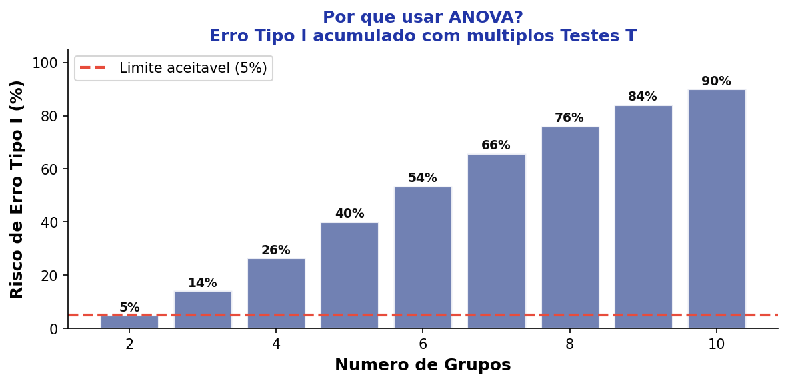
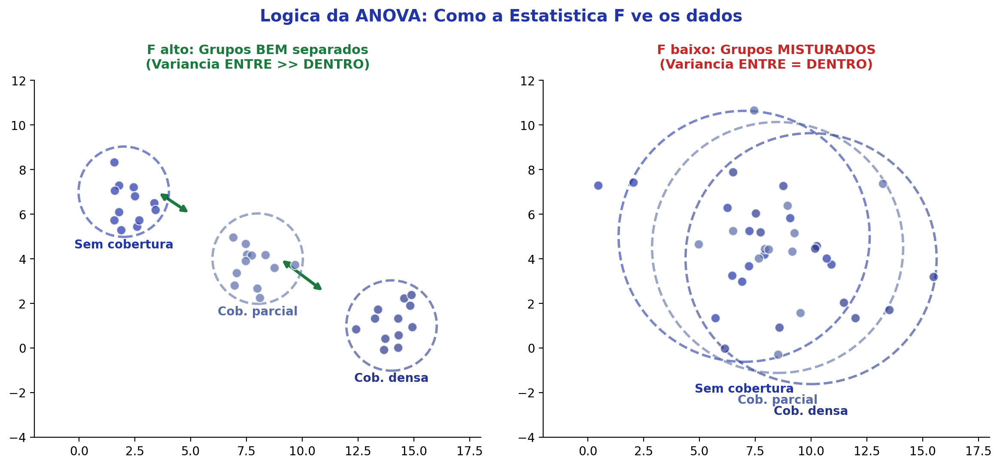
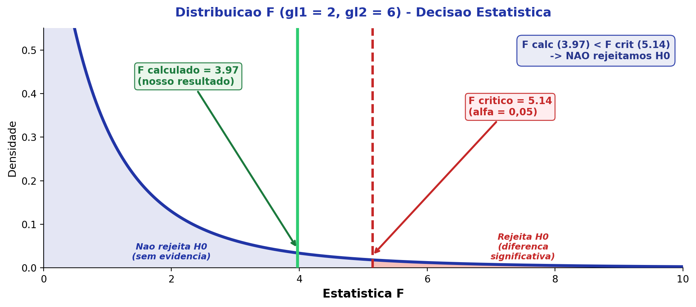
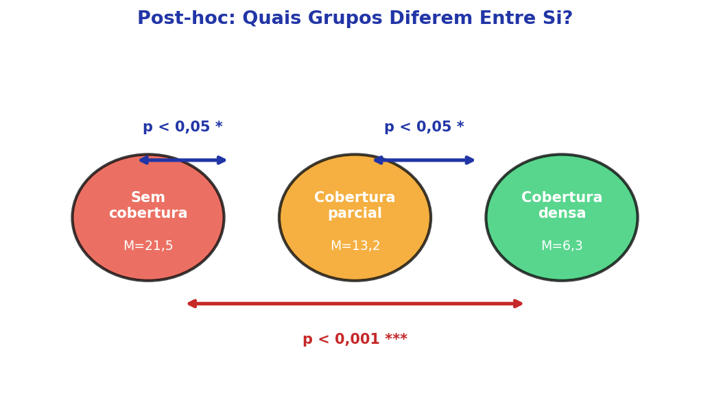
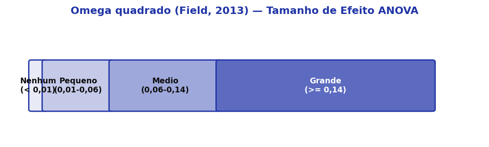

---
title: "ANOVA de Uma Via"
subtitle: "Aula 09 — Análise de Variância One-Way<br>Análise de Dados Ambientais"
author: "Luiz Diego Vidal Santos"
format:
  revealjs:
    logo: ../../../assets/logo-uefs.webp
    footer: "UEFS | Análise de Dados Ambientais | Aula 09"
    slide-number: true
    theme: [simple, ../../../assets/uefs.scss]
    controls: true
    width: 1280
    height: 720
    css: ../../../assets/custom.css
    include-after-body: ../../../assets/image-lightbox.html
    transition: slide
    background-transition: fade
    preview-links: auto
execute:
  echo: false
---

## Roteiro da Aula {.smaller-text}

::: {.columns}
:::: {.column width="60%"}

- [1]{.circle} O que é ANOVA?
- [2]{.circle} Por que não usar vários Testes T?
- [3]{.circle} Pressupostos da ANOVA
- [4]{.circle} Lógica da ANOVA — Variância entre vs. dentro
- [5]{.circle} Cálculo passo a passo
- [6]{.circle} Estatística F e decisão
- [7]{.circle} Testes Post-hoc
- [8]{.circle} Tamanho de Efeito

::::
:::: {.column width="40%"}

::: {.info-box}
**Objetivo:** Entender a lógica e o cálculo da ANOVA de Uma Via (One-Way), o teste que permite comparar **três ou mais grupos** de uma só vez, controlando o erro.
:::

::::
:::


# [1 — O QUE É ANOVA?]{.section-header}

## Análise de Variância {.smaller-text}

::: {.columns}
:::: {.column width="55%"}

::: {.info-box}
**Definição**

**ANOVA** (*Analysis of Variance*) é um teste paramétrico que avalia se as médias de **três ou mais grupos** diferem significativamente.

Na Aula 08 vimos o Teste T — que compara 2 grupos. A ANOVA é a extensão natural para mais grupos.
:::

. . .

::: {.highlight-box}
**Analogia simples:** Imagine que você quer saber se três tipos de cobertura de solo (sem cobertura, parcial e densa) produzem diferentes níveis de erosão. Não basta comparar dois a dois — a ANOVA faz isso de uma vez, com controle estatístico.
:::

::::
:::: {.column width="45%"}

::: {.box}
**Dois usos principais:**

[1]{.circle} Comparar médias de uma variável entre **3+ grupos independentes**

*Ex: Perda de solo em 3 tipos de cobertura*

[2]{.circle} Avaliar se uma variável mensurada em **3+ momentos** variou ao longo do tempo

*Ex: Resistência de geotêxtil em T0, T90 e T180 dias*
:::

::::
:::


## Família de ANOVAs {.smaller-text}

::: {.info-box}
**Panorama:** A ANOVA tem várias variações. Hoje veremos a mais básica — a **ANOVA de Uma Via** (*One-Way*).
:::

. . .

| Nome | Característica | Exemplo |
|---|---|---|
| **ANOVA One-Way** | 1 VI categórica → 1 VD métrica | Geotêxtil (3 tipos) × Erosão |
| ANOVA Fatorial | 2+ VIs → 1 VD | Geotêxtil × Cobertura → Erosão |
| ANCOVA | 1 VI + covariável(eis) → 1 VD | Geotêxtil → Erosão (controlando cobertura) |
| ANOVA-MR | 1 VD em 3+ momentos | Erosão (pré, pós e follow-up) |
| MANOVA | 1 VI → 2+ VDs | Geotêxtil → Tração + Punção + Rigidez |


# [2 — POR QUE NÃO USAR VÁRIOS TESTES T?]{.section-header}

## O Problema das Comparações Múltiplas {.smaller-text}

::: {.columns}
:::: {.column width="55%"}

::: {.info-box}
**O risco:** Cada teste estatístico carrega 5% de chance de erro (significância $\alpha$ = 0,05). Se você fizer 3, 6 ou 10 comparações separadas, o risco total dispara!
:::

. . .

::: {.highlight-box}
**Exemplo concreto com fibras:**

Comparar Taboa × Junco × Ouricuri usando Testes T:

- Taboa vs. Junco (5% de risco)
- Taboa vs. Ouricuri (5% de risco)
- Junco vs. Ouricuri (5% de risco)

**Risco acumulado ≈ 14,3%** — quase 3× o aceitável!
:::

::::
:::: {.column width="45%"}

{width="100%"}

::::
:::

. . .

::: {.box}
**Solução:** A ANOVA compara todos os grupos em uma **única análise** e controla o Erro Tipo I por meio de testes **post-hoc**.
:::


# [3 — PRESSUPOSTOS DA ANOVA]{.section-header}

## Condições Necessárias {.smaller-text}

::: {.columns}
:::: {.column width="50%"}

::: {.box}
[1]{.circle} **Normalidade dos resíduos**

Os resíduos (diferenças entre cada valor e a média do seu grupo) devem seguir distribuição normal.

- Shapiro-Wilk / Kolmogorov-Smirnov
- Avaliação de curtose e assimetria

[2]{.circle} **Homogeneidade de variâncias**

A dispersão dos dados dentro de cada grupo deve ser semelhante.

- **Teste de Levene**
:::

::::
:::: {.column width="50%"}

::: {.box}
[3]{.circle} **Independência das observações**

As respostas de uma repetição não influenciam as demais.

- Garantida pelo delineamento experimental

[4]{.circle} **Variável dependente contínua**

A variável medida deve estar em nível intervalar (peso, concentração, resistência, etc.)
:::

. . .

::: {.highlight-box}
**Tamanho de efeito:** Na ANOVA, usamos **$\omega^2$ (ômega ao quadrado)** ou **$\eta^2_p$ (eta parcial ao quadrado)** — veremos no final da aula.
:::

::::
:::


# [4 — LÓGICA DA ANOVA]{.section-header}

## Variância Entre vs. Dentro dos Grupos {.smaller-text}

::: {.columns}
:::: {.column width="50%"}

::: {.info-box}
**Ideia central:**

A ANOVA compara duas fontes de variação:

- **Variância entre grupos** (*between*): diferença entre as médias dos grupos
- **Variância dentro dos grupos** (*within*): dispersão das observações dentro de cada grupo
:::

. . .

::: {.highlight-box}
**Analogia:** Imagine três times de futebol. Se as habilidades **entre** os times são muito diferentes, mas **dentro** de cada time os jogadores são parecidos, é fácil distinguir os times → **F alto**.

Se todos os jogadores são parecidos entre si (entre e dentro), é difícil distinguir → **F baixo**.
:::

::::
:::: {.column width="50%"}

{width="100%"}

::::
:::


## Exemplo — Perda de Solo por Cobertura {.smaller-text}

::: {.info-box}
**Pergunta de pesquisa:** Existem diferenças nos níveis de perda de solo entre parcelas com diferentes tipos de cobertura vegetal?
:::

::: {.columns}
:::: {.column width="45%"}

| Cobertura | VD |
|:---:|:---:|
| Sem cobertura | Perda de solo (t/ha) |
| Cobertura parcial | Perda de solo (t/ha) |
| Cobertura densa | Perda de solo (t/ha) |


. . .

::: {.box}
**Estrutura da ANOVA:**

- **VI (Fator):** Tipo de cobertura (categórica, 3 níveis)
- **VD:** Perda de solo (contínua, t/ha)
:::

::::
:::: {.column width="55%"}

{width="100%"}

::::
:::


# [5 — CÁLCULO PASSO A PASSO]{.section-header}

## Soma dos Quadrados — Visão Geral {.smaller-text}

::: {.info-box}
**Objetivo:** Decompor a variação total dos dados em duas partes — a parte explicada pelos grupos (*between*) e a parte não explicada (*within/resíduo*).
:::

. . .

::: {.columns}
:::: {.column width="50%"}

::: {.box}
**Passo 1 — Soma dos Quadrados Total ($SQ_T$)**

$$SQ_T = \sum_{i=1}^{N} (x_i - \bar{x}_{\text{geral}})^2$$

Mede a **variação total** de todos os dados em relação à média geral.
:::

::::
:::: {.column width="50%"}

::: {.box}
**Passo 2 — Soma dos Quadrados do Modelo ($SQ_M$)**

$$SQ_M = \sum_{k=1}^{K} n_k (\bar{x}_k - \bar{x}_{\text{geral}})^2$$

Mede o quanto as **médias de cada grupo** se afastam da média geral.
:::

::::
:::

. . .

::: {.highlight-box}
**Passo 3 — Soma dos Quadrados dos Resíduos:** $SQ_R = SQ_T - SQ_M$

É a variação **não explicada** pelo modelo — o que sobra "dentro" dos grupos.
:::


## Exemplo Numérico {.smaller-text}

::: {.info-box}
**Dados fictícios** — 3 grupos, 3 observações cada (média geral = 4,78):
:::

| Sujeito | Grupo | Escore | Diferença p/ média | $(x_i - \bar{x})^2$ |
|:---:|:---:|:---:|:---:|:---:|
| 1 | 1 | 5 | +0,22 | 0,049 |
| 2 | 1 | 3 | −1,78 | 3,160 |
| 3 | 1 | 6 | +1,22 | 1,494 |
| 4 | 2 | 4 | −0,78 | 0,605 |
| 5 | 2 | 3 | −1,78 | 3,160 |
| 6 | 2 | 2 | −2,78 | 7,716 |
| 7 | 3 | 5 | +0,22 | 0,049 |
| 8 | 3 | 6 | +1,22 | 1,494 |
| 9 | 3 | 9 | +4,22 | 17,827 |
| **Soma** | — | **43** | **0** | **35,56** |


. . .

::: {.box}
$SQ_T = 35{,}56$ · $SQ_M = 20{,}26$ · $SQ_R = 15{,}30$
:::


## Soma dos Quadrados do Modelo {.smaller-text}

::: {.info-box}
**Cálculo detalhado do $SQ_M$** — quanto cada grupo contribui para a variação:
:::

::: {.columns}
:::: {.column width="55%"}

| Grupo | $n_k$ | $\bar{x}_k$ | $\bar{x}_k - \bar{x}_{\text{geral}}$ | $SQ_M$ |
|:---:|:---:|:---:|:---:|:---:|
| 1 | 3 | 4,67 | −0,10 | 0,03 |
| 2 | 3 | 3,00 | −1,77 | 9,40 |
| 3 | 3 | 6,67 | +1,90 | 10,83 |
| **Total** | | | | **20,26** |


::::
:::: {.column width="45%"}

::: {.box}
**O que sabemos:**

- Variação total: $SQ_T = 35{,}56$
- Explicada (entre grupos): $SQ_M = 20{,}26$
- Não explicada (resíduo): $SQ_R = 15{,}30$

A variação entre grupos é **maior** que a residual — bom sinal!
:::

::::
:::


# [6 — ESTATÍSTICA F E DECISÃO]{.section-header}

## Média dos Quadrados e Estatística F {.smaller-text}

::: {.columns}
:::: {.column width="50%"}

::: {.info-box}
**Média dos Quadrados do Modelo ($MSQ_M$):**

$$MSQ_M = \frac{SQ_M}{gl_{\text{grupo}}} = \frac{20{,}26}{2} = 10{,}13$$

Onde $gl_{\text{grupo}} = k - 1 = 3 - 1 = 2$
:::

. . .

::: {.info-box}
**Média dos Quadrados dos Resíduos ($MSQ_R$):**

$$MSQ_R = \frac{SQ_R}{gl_{\text{resíduo}}} = \frac{15{,}30}{6} = 2{,}55$$

Onde $gl_{\text{resíduo}} = N - k = 9 - 3 = 6$
:::

::::
:::: {.column width="50%"}

::: {.highlight-box}
**A Estatística F:**

$$F = \frac{MSQ_M}{MSQ_R} = \frac{10{,}13}{2{,}55} = 3{,}97$$
:::

. . .

::: {.box}
**Interpretação simplificada:**

$F$ = razão entre o que o modelo **explica** e o que **sobra**.

- $F \approx 1$ → grupos semelhantes (variação entre ≈ variação dentro)
- $F \gg 1$ → grupos diferentes (variação entre >> variação dentro)
:::

::::
:::


## Distribuição F e Decisão {.smaller-text}

::: {.columns}
:::: {.column width="50%"}

{width="100%"}

::::
:::: {.column width="50%"}

::: {.info-box}
**Como decidir?**

Comparamos o $F_{\text{calculado}}$ com o $F_{\text{crítico}}$ da tabela (ou usamos o *p*-valor direto do software).

- $F(2, 6) = 3{,}97$
- $F_{\text{crítico}}$ (5%) $= 5{,}14$
:::

. . .

::: {.box}
**Neste exemplo:**

$F_{\text{calc}} = 3{,}97 < F_{\text{crit}} = 5{,}14$

→ **Não rejeitamos** $H_0$

→ Não há evidência suficiente de diferença entre os grupos (com estes dados).
:::

. . .

::: {.highlight-box}
**Na prática:** O software (JASP, SPSS, R) fornece diretamente o *p*-valor. Se $p < 0{,}05$ → significativo.
:::

::::
:::


# [7 — TESTES POST-HOC]{.section-header}

## O que são e Quando Usar? {.smaller-text}

::: {.columns}
:::: {.column width="55%"}

::: {.info-box}
**O problema:**

A ANOVA é um teste **generalista** (omnibus). A estatística F diz **se** existem diferenças, mas **não diz onde** estão as diferenças.
:::

. . .

::: {.highlight-box}
**Possíveis resultados:**

- Grupo 1 difere do Grupo 2, mas não do Grupo 3
- Grupo 3 difere do Grupo 2, mas não do Grupo 1
- Todos diferem entre si
- Nenhum difere significativamente (F não significativo → sem post-hoc)
:::

. . .

::: {.box}
**Resumo:**

[1]{.circle} **Estatística F** → Os grupos diferem? (Sim/Não)

[2]{.circle} **Post-hoc** → *Quais* grupos diferem? (Só se F for significativo)
:::

::::
:::: {.column width="45%"}

{width="100%"}

::::
:::


# [8 — TAMANHO DE EFEITO]{.section-header}

## Ômega ao Quadrado ($\omega^2$) {.smaller-text}

::: {.columns}
:::: {.column width="55%"}

::: {.info-box}
**Assim como no Teste T, o *p*-valor sozinho não basta.**

O $\omega^2$ (ômega ao quadrado) quantifica a **proporção da variância total** que é explicada pelo fator (grupos).
:::

. . .

| Magnitude | $\omega^2$ (Field, 2013) | $\omega^2$ (Cohen, 1992) |
|:---:|:---:|:---:|
| Muito pequena | < 0,01 | < 0,02 |
| Pequena | 0,01 – 0,06 | 0,02 – 0,13 |
| Média | 0,06 – 0,14 | 0,13 – 0,26 |
| Grande | ≥ 0,14 | ≥ 0,26 |


::::
:::: {.column width="45%"}

{width="100%"}

. . .

::: {.highlight-box}
**Exemplo:** $\omega^2 = 0{,}12$ → o fator "cobertura" explica 12% da variação na perda de solo → efeito **médio**.
:::

::::
:::


## Tamanho de Efeito Post-hoc {.smaller-text}

::: {.info-box}
**Para comparações par a par (post-hoc)**, usamos as mesmas medidas da Aula 08 (Teste T):
:::

::: {.columns}
:::: {.column width="50%"}

::: {.box}
[1]{.circle} ***d* de Cohen** — Tamanhos e DPs semelhantes entre grupos

[2]{.circle} **Delta de Glass** — DPs muito diferentes entre grupos

[3]{.circle} ***g* de Hedges** — Tamanhos amostrais desiguais
:::

::::
:::: {.column width="50%"}

| Tamanho de Efeito | *d* de Cohen | $\Delta$ Glass | *g* de Hedges |
|:---:|:---:|:---:|:---:|
| Pequeno | 0,20 | 0,20 | 0,20 |
| Médio | 0,50 | 0,50 | 0,50 |
| Grande | 0,80 | 0,80 | 0,80 |
| Muito Grande | ≥ 1,30 | ≥ 1,30 | ≥ 1,30 |


::::
:::


## Resumo — ANOVA Uma Via {.smaller-text}

::: {.info-box}
**Guia rápido**
:::

```{mermaid}
%%| fig-width: 8
flowchart LR
    A["<b style='color:#fff; font-weight:bold'>Tenho 3+ grupos?</b>"] --> B["Verificar\npressupostos"]
    B --> C["Normalidade\n(Shapiro-Wilk)"]
    B --> D["Homogeneidade\n(Levene)"]
    C --> E["Rodar\nANOVA"]
    D --> E
    E --> F{"F significativo?\n(p < 0,05)"}
    F -- "Sim" --> G["Post-hoc\n(Tukey, Bonferroni)"]
    F -- "Nao" --> H["Nao rejeita H0"]
    G --> I["Tamanho de efeito\n(omega2, d Cohen)"]

    style A fill:#2135A6,color:#fff,font-weight:bold
    style F fill:#C5CEE8,color:#0D0D0D
    style H fill:#F2F2F2,color:#0D0D0D
    style G fill:#27368C,color:#fff
    style I fill:#27368C,color:#fff
    style B fill:#C5CEE8,color:#0D0D0D
    style C fill:#C5CEE8,color:#0D0D0D
    style D fill:#C5CEE8,color:#0D0D0D
    style E fill:#C5CEE8,color:#0D0D0D
```

. . .

::: {.highlight-box}
**Checklist:**

[1]{.circle} Variável contínua? [2]{.circle} ≥ 3 grupos? [3]{.circle} Normalidade dos resíduos? [4]{.circle} Homogeneidade (Levene)? [5]{.circle} Independência?
:::


## {.center background-color="#2135A6"}

::: {.obrigado-fit-text}

Vamos à Prática!

:::

::: {style="color: white; font-size: 0.8em; margin-top: 1em;"}
Abra o JASP e aplique a ANOVA One-Way aos dados de cobertura de solo.
:::
