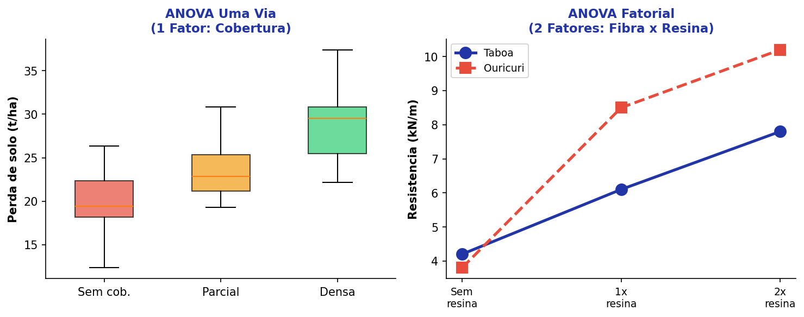
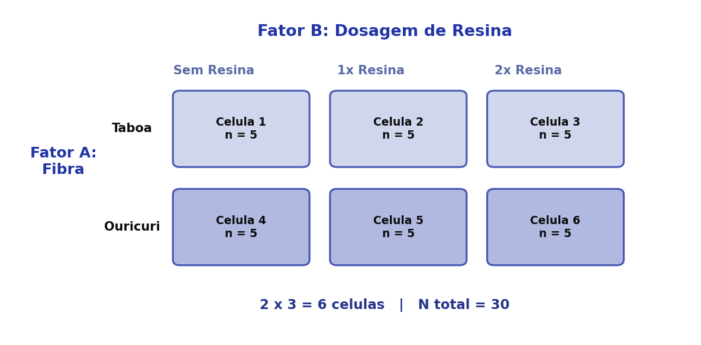
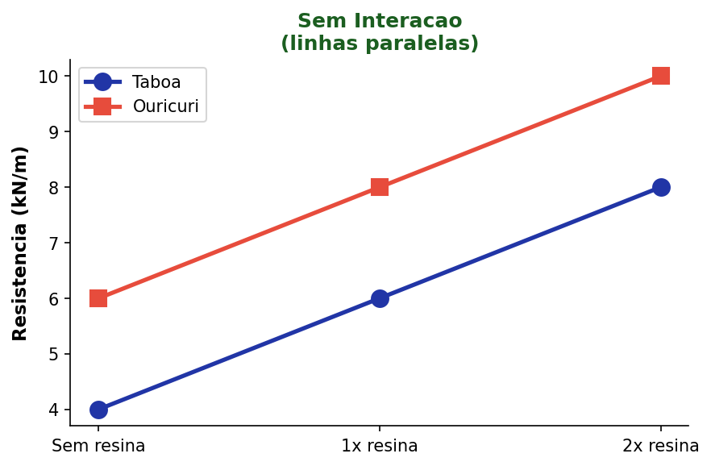
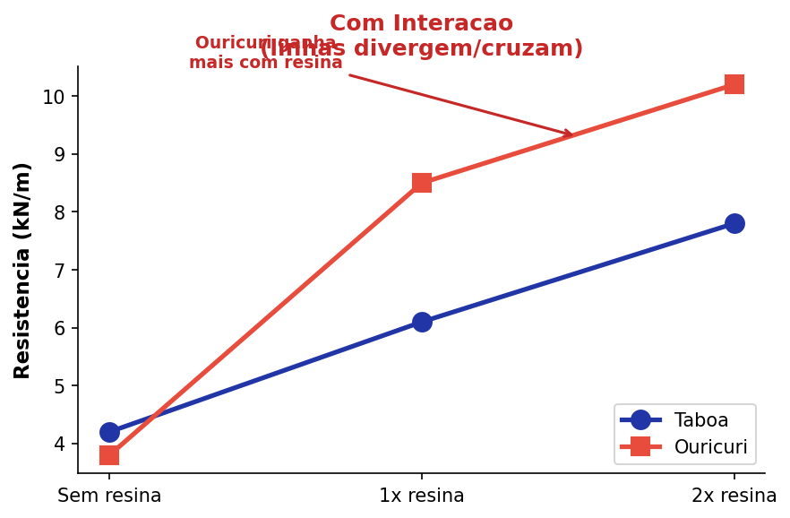
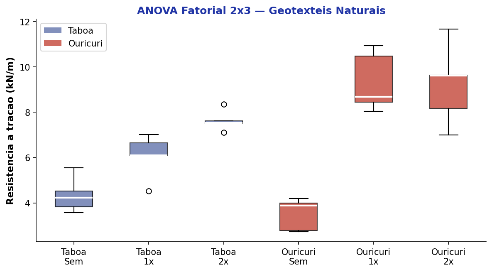
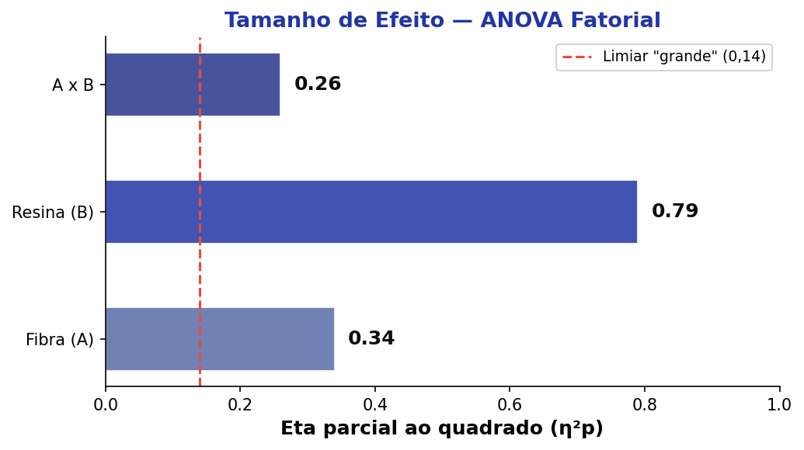

## Roteiro da Aula {.smaller-text}

::: {.columns}
:::: {.column width="60%"}

- [1]{.circle} Da ANOVA Uma Via à ANOVA Fatorial
- [2]{.circle} Estrutura fatorial: fatores, níveis e células
- [3]{.circle} Efeitos principais e interação
- [4]{.circle} Interpretando o gráfico de interação
- [5]{.circle} Pressupostos
- [6]{.circle} Exemplo prático — Bioengenharia de Solos
- [7]{.circle} Tamanho de efeito e poder

::::
:::: {.column width="40%"}

::: {.info-box}
**Objetivo:** Compreender a lógica da ANOVA Fatorial, que permite avaliar o efeito de **dois ou mais fatores simultaneamente** e verificar se existe **interação** entre eles.
:::

::::
:::


# [1 — DA ANOVA UMA VIA À FATORIAL]{.section-header}

## Por que precisamos da ANOVA Fatorial? {.smaller-text}

::: {.columns}
:::: {.column width="50%"}

::: {.box}
**ANOVA Uma Via**

- Um único fator (variável independente)
- Ex.: Tipo de cobertura (3 níveis)
- Pergunta: *As médias diferem entre os grupos?*
:::

::::
:::: {.column width="50%"}

::: {.highlight-box}
**ANOVA Fatorial**

- **Dois ou mais** fatores simultâneos
- Ex.: Tipo de fibra × Dosagem de resina
- Perguntas:
  - O Fator A influencia a VD?
  - O Fator B influencia a VD?
  - **Existe interação A × B?**
:::

::::
:::

::: {.info-box}
A ANOVA Fatorial é eficiente porque testa múltiplos fatores em um único modelo, **economizando amostras** e revelando **interações** que experimentos separados não detectariam.
:::


## Quando usar a ANOVA Fatorial? {.smaller-text}

::: {.columns}
:::: {.column width="55%"}

O delineamento fatorial é ideal quando:

- O fenômeno depende de **mais de uma variável** controlada
- Há interesse em saber se os fatores **interagem** entre si
- Queremos **economia experimental** (um experimento, múltiplas respostas)

::: {.box}
**Exemplos em Ciências Ambientais**

| Fator A | Fator B | VD |
|---------|---------|-----|
| Tipo de fibra | Dosagem de resina | Resistência à tração |
| Espécie vegetal | Tipo de solo | Biomassa radicular |
| Técnica de plantio | Nível de irrigação | Taxa de sobrevivência |
:::

::::
:::: {.column width="45%"}

{width="100%"}

::::
:::


# [2 — ESTRUTURA FATORIAL]{.section-header}

## Fatores, Níveis e Células {.smaller-text}

::: {.columns}
:::: {.column width="55%"}

::: {.info-box}
**Terminologia**

- **Fator:** cada variável independente categórica
- **Nível:** cada categoria dentro de um fator
- **Célula:** cada combinação única de níveis
:::

**Exemplo concreto:**

| | Sem Resina | 1× Resina | 2× Resina |
|---|:---:|:---:|:---:|
| **Taboa** | Célula 1 | Célula 2 | Célula 3 |
| **Ouricuri** | Célula 4 | Célula 5 | Célula 6 |

- Fator A: Tipo de fibra (2 níveis)
- Fator B: Dosagem de resina (3 níveis)
- **2 × 3 = 6 células**

::::
:::: {.column width="45%"}

{width="100%"}

::::
:::


## Notação do Delineamento Fatorial {.smaller-text}

::: {.columns}
:::: {.column width="50%"}

A notação indica o **número de níveis de cada fator**:

::: {.box}
| Notação | Fatores × Níveis | Células |
|---------|-------------------|---------|
| 2 × 2 | 2 fatores, 2 níveis cada | 4 |
| 3 × 2 | 2 fatores (3 e 2 níveis) | 6 |
| 4 × 4 | 2 fatores, 4 níveis cada | 16 |
| 4 × 4 × 2 | 3 fatores | **32** |
:::

::::
:::: {.column width="50%"}

::: {.highlight-box}
**Cuidado com a complexidade!**

Por mais tentador que seja incluir muitos fatores, lembre-se:

- As **múltiplas comparações** crescem exponencialmente
- A **interpretação** das interações de 3ª ordem é extremamente difícil
- O **tamanho amostral** necessário aumenta drasticamente

Na prática, delineamentos **2 × 2** e **3 × 2** são os mais comuns.
:::

::::
:::


# [3 — EFEITOS PRINCIPAIS E INTERAÇÃO]{.section-header}

## Três Perguntas, Um Modelo {.smaller-text}

A ANOVA Fatorial decompõe a variância total em **três fontes**:

::: {.columns}
:::: {.column width="33%"}

::: {.box}
**Efeito Principal A**

*O Fator A influencia a VD, ignorando B?*

Ex.: A resistência difere entre as fibras (taboa vs. ouricuri), independente da resina?
:::

::::
:::: {.column width="33%"}

::: {.box}
**Efeito Principal B**

*O Fator B influencia a VD, ignorando A?*

Ex.: A dosagem de resina afeta a resistência, independente do tipo de fibra?
:::

::::
:::: {.column width="34%"}

::: {.highlight-box}
**Interação A × B**

*O efeito de A depende do nível de B?*

Ex.: O ganho de resistência com resina é **diferente** para taboa e ouricuri?
:::

::::
:::

::: {.info-box}
A **interação** é o resultado mais importante da ANOVA Fatorial. Quando significativa, os efeitos principais devem ser interpretados com cautela — pois o efeito de um fator **depende** do nível do outro.
:::


## Decomposição da Variância {.smaller-text}

::: {.columns}
:::: {.column width="50%"}

```{mermaid}
%%| fig-width: 5.5
flowchart TD
    A["Variância Total\n(SQ Total)"]:::root --> B["Variância Entre\n(SQ Model)"]:::node
    A --> C["Variância Dentro\n(SQ Erro)"]:::node
    B --> D["Efeito Principal A\n(SQ_A)"]:::leaf
    B --> E["Efeito Principal B\n(SQ_B)"]:::leaf
    B --> F["Interação A × B\n(SQ_AB)"]:::result

    classDef root fill:#2135A6,color:#fff,font-weight:bold,stroke:#27368C
    classDef node fill:#C5CEE8,color:#0D0D0D,stroke:#586BA6
    classDef leaf fill:#586BA6,color:#fff,stroke:#27368C
    classDef result fill:#27368C,color:#fff,font-weight:bold,stroke:#2135A6
```

::::
:::: {.column width="50%"}

::: {.box}
**Tabela ANOVA Fatorial**

| Fonte | SQ | gl | QM | F |
|-------|----|----|-----|---|
| Fator A | SQ_A | a − 1 | QM_A | QM_A / QM_E |
| Fator B | SQ_B | b − 1 | QM_B | QM_B / QM_E |
| A × B | SQ_AB | (a−1)(b−1) | QM_AB | QM_AB / QM_E |
| Erro | SQ_E | N − ab | QM_E | — |
| **Total** | **SQ_T** | **N − 1** | — | — |

Cada fonte gera seu próprio valor **F** e **p-valor**.
:::

::::
:::


# [4 — GRÁFICO DE INTERAÇÃO]{.section-header}

## Interpretando o Gráfico de Interação {.smaller-text}

::: {.columns}
:::: {.column width="50%"}

{width="100%"}

::: {.box}
**Sem interação:** as linhas são **paralelas**. O efeito da resina é o mesmo para ambas as fibras.
:::

::::
:::: {.column width="50%"}

{width="100%"}

::: {.highlight-box}
**Com interação:** as linhas **se cruzam** (ou convergem/divergem). O efeito da resina depende do tipo de fibra.
:::

::::
:::

::: {.info-box}
Quando a interação é significativa, **não basta** olhar os efeitos principais isoladamente. É necessário analisar as **comparações simples** (simple effects) — ou seja, o efeito de um fator em cada nível do outro.
:::


## Tipos de Interação {.smaller-text}

::: {.columns}
:::: {.column width="33%"}

::: {.box}
**Ordinal**

As linhas não se cruzam, mas a distância entre elas varia. A **direção** do efeito é a mesma, mas a **magnitude** muda.
:::

::::
:::: {.column width="33%"}

::: {.box}
**Desordinal (Crossover)**

As linhas se cruzam. O efeito de um fator se **inverte** dependendo do nível do outro.
:::

::::
:::: {.column width="34%"}

::: {.highlight-box}
**Regra prática**

- Interação desordinal → efeitos principais são **enganosos**
- Interação ordinal → efeitos principais ainda são informativos, mas com ressalvas
:::

::::
:::


# [5 — PRESSUPOSTOS]{.section-header}

## Pressupostos da ANOVA Fatorial {.smaller-text}

::: {.columns}
:::: {.column width="50%"}

São os mesmos da ANOVA Uma Via, mas aplicados a **cada célula**:

::: {.box}
| Pressuposto | Teste | Decisão |
|-------------|-------|---------|
| Normalidade | Shapiro-Wilk (por célula) | p > 0,05 → OK |
| Homocedasticidade | Levene | p > 0,05 → OK |
| Independência | Delineamento | Observações independentes |
:::

::::
:::: {.column width="50%"}

::: {.info-box}
**Atenção ao tamanho amostral**

Com muitas células (ex.: 4 × 4 = 16), cada célula pode ter **poucas** observações. Isso:

- Dificulta o teste de normalidade
- Reduz o **poder** do teste
- Pode gerar **células vazias**

Regra prática: mínimo de **5 observações por célula**, ideal ≥ 10.
:::

::: {.highlight-box}
Se os pressupostos forem violados → **ANOVA robusta** (Welch) ou testes não paramétricos (Kruskal-Wallis por fatores).
:::

::::
:::


# [6 — EXEMPLO PRÁTICO]{.section-header}

## Resistência de Geotêxteis Naturais {.smaller-text}

::: {.columns}
:::: {.column width="55%"}

::: {.info-box}
**Delineamento:** 2 × 3

- **Fator A:** Tipo de fibra (Taboa, Ouricuri)
- **Fator B:** Dosagem de resina (Sem, 1×, 2×)
- **VD:** Resistência à tração (kN/m)
- **n = 5** por célula → N = 30
:::

| | Sem Resina | 1× Resina | 2× Resina |
|---|:---:|:---:|:---:|
| **Taboa** | 4,2 ± 0,8 | 6,1 ± 0,9 | 7,8 ± 1,1 |
| **Ouricuri** | 3,8 ± 0,7 | 8,5 ± 1,2 | 10,2 ± 1,4 |

::::
:::: {.column width="45%"}

{width="100%"}

::::
:::


## Resultados da ANOVA Fatorial {.smaller-text}

::: {.columns}
:::: {.column width="55%"}

::: {.box}
**Tabela ANOVA**

| Fonte | F | p-valor | η²p |
|-------|---|---------|-----|
| Fibra (A) | 12,43 | 0,002 | 0,34 |
| Resina (B) | 45,67 | < 0,001 | 0,79 |
| A × B | 4,21 | 0,026 | 0,26 |
| Erro | — | — | — |
:::

::::
:::: {.column width="45%"}

::: {.highlight-box}
**Interpretação**

- **Fibra:** p = 0,002 → as fibras diferem em resistência
- **Resina:** p < 0,001 → a resina afeta significativamente
- **Interação:** p = 0,026 → o **ganho com resina** depende do tipo de fibra
:::

::: {.info-box}
O ouricuri beneficia-se **mais** da resina do que a taboa — interação ordinal.
:::

::::
:::


# [7 — TAMANHO DE EFEITO]{.section-header}

## Eta Parcial ao Quadrado (η²p) {.smaller-text}

::: {.columns}
:::: {.column width="50%"}

::: {.info-box}
**Definição**

O **η² parcial** indica a proporção da variância explicada por cada fator, **descontando** os outros fatores:

$$\eta^2_p = \frac{SQ_{\text{efeito}}}{SQ_{\text{efeito}} + SQ_{\text{erro}}}$$
:::

::: {.box}
| η²p | Classificação |
|-----|---------------|
| 0,01 | Pequeno |
| 0,06 | Médio |
| ≥ 0,14 | Grande |

(Cohen, 1988)
:::

::::
:::: {.column width="50%"}

{width="100%"}

::: {.highlight-box}
Diferente do η², o **η² parcial** permite comparar o tamanho de efeito de cada fator **dentro do mesmo modelo**, pois remove a variância explicada pelos demais fatores.
:::

::::
:::


## Resumo — Fluxo de Decisão {.smaller-text}

```{mermaid}
%%| fig-width: 10
flowchart LR
    A["≥ 2 Fatores\ncategóricos?"]:::root --> |Sim| B["VD métrica e\nnormal por célula?"]:::node
    A --> |"Não"| A2["ANOVA Uma Via\n(1 fator)"]:::leaf
    B --> |Sim| C["Homocedasticidade?\n(Levene)"]:::node
    B --> |"Não"| B2["Transformação\nou não paramétrico"]:::leaf
    C --> |Sim| D["ANOVA\nFATORIAL"]:::result
    C --> |"Não"| C2["ANOVA Robusta\n(Welch)"]:::leaf
    D --> E{"Interação\nsignificativa?"}:::node
    E --> |Sim| F["Analisar\nefeitos simples"]:::result
    E --> |"Não"| G["Interpretar efeitos\nprincipais + post-hoc"]:::result

    classDef root fill:#2135A6,color:#fff,font-weight:bold,stroke:#27368C
    classDef node fill:#C5CEE8,color:#0D0D0D,stroke:#586BA6
    classDef leaf fill:#586BA6,color:#fff,stroke:#27368C
    classDef result fill:#27368C,color:#fff,font-weight:bold,stroke:#2135A6
```


## {.center background-color="#2135A6"}

::: {style="text-align: center;"}
[Obrigado!]{.obrigado-fit-text style="color: white;"}

::: {style="color: white; font-size: 0.7em;"}
Luiz Diego Vidal Santos

Universidade Estadual de Feira de Santana (UEFS)
:::
:::
