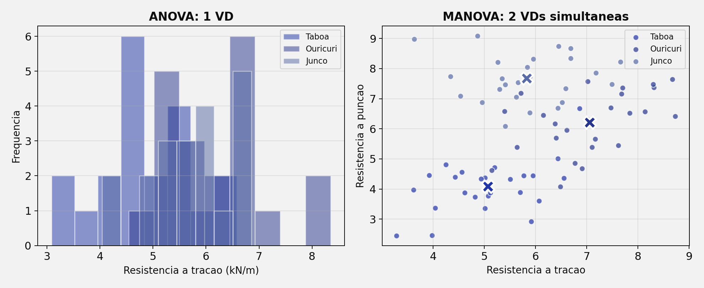

## Roteiro da Aula {.smaller-text}

::: {.columns}
:::: {.column width="60%"}

- [1]{.circle} Por que MANOVA?
- [2]{.circle} Da ANOVA à MANOVA
- [3]{.circle} Combinação linear das VDs
- [4]{.circle} Pressupostos da MANOVA
- [5]{.circle} Estatísticas de teste
- [6]{.circle} Exemplo prático — Geotêxteis
- [7]{.circle} MANOVA de Medidas Repetidas
- [8]{.circle} Dados faltantes e relato dos resultados

::::
:::: {.column width="40%"}

::: {.info-box}
**Objetivo:** Compreender a **MANOVA** como extensão multivariada da ANOVA, avaliando diferenças entre grupos quando há **múltiplas variáveis dependentes** correlacionadas.
:::

::::
:::


# [1 — POR QUE MANOVA?]{.section-header}

## O problema das várias ANOVAs {.smaller-text}

::: {.columns}
:::: {.column width="50%"}

::: {.box}
**Abordagem ingênua**

Fazer uma ANOVA separada para cada variável dependente:

- ANOVA₁: resistência à tração
- ANOVA₂: resistência à punção
- ANOVA₃: rigidez secante

Cada teste com α = 0,05.
:::

::: {.highlight-box}
**Inflação do Erro Tipo I**

Com 3 testes independentes:

$\alpha_{global} = 1 - (1 - 0{,}05)^3 = 0{,}143$

Probabilidade de **14,3%** de pelo menos um falso positivo.
:::

::::
:::: {.column width="50%"}

::: {.info-box}
**MANOVA: solução multivariada**

- Testa **todas as VDs simultaneamente**
- Mantém α = 0,05 para a família de testes
- Considera a **covariância** entre as VDs
- Pode detectar efeitos invisíveis em ANOVAs isoladas
:::

{width="100%"}

::::
:::


## Quando a MANOVA é a pergunta certa? {.smaller-text}

::: {.columns}
:::: {.column width="50%"}

::: {.box}
**Use MANOVA quando:**

- Há **uma ou mais VIs categóricas**
- Há **duas ou mais VDs contínuas**
- As VDs são conceitualmente relacionadas
- Você quer testar um efeito global do grupo sobre o **perfil multivariado**
:::

::::
:::: {.column width="50%"}

::: {.info-box}
**Exemplos ambientais**

| Fator | VDs simultâneas |
|-------|-----------------|
| Tipo de geotêxtil | Tração, punção, rigidez |
| Manejo do solo | Infiltração, densidade, C orgânico |
| Tratamento de água | pH, turbidez, condutividade |
| Restauração ecológica | Biomassa, cobertura, riqueza |
:::

::::
:::

::: {.highlight-box}
A MANOVA testa se os grupos diferem no **conjunto das variáveis dependentes**, não apenas em uma variável isolada.
:::


# [2 — DA ANOVA À MANOVA]{.section-header}

## A analogia central {.smaller-text}

::: {.columns}
:::: {.column width="50%"}

::: {.box}
**ANOVA (univariada)**

- Compara médias de **1 variável** entre grupos
- Usa a razão entre variância **entre** grupos e variância **dentro** dos grupos
- Estatística clássica: **F**
- Pergunta: as médias são iguais?
:::

::::
:::: {.column width="50%"}

::: {.box}
**MANOVA (multivariada)**

- Compara **vetores de médias** entre grupos
- Usa matrizes de **covariância** entre e dentro dos grupos
- Estatísticas: **Pillai, Wilks, Hotelling, Roy**
- Pergunta: os centroides são iguais?
:::

::::
:::

::: {.highlight-box}
**Da ANOVA para a MANOVA**

::: {.columns}
:::: {.column width="46%"}
**ANOVA**

$$
F = \frac{S^2_{\text{entre}}}{S^2_{\text{dentro}}}
$$

Variâncias escalares.
::::

:::: {.column width="8%"}
<div style="font-size: 1.5em; text-align: center; padding-top: 1.4em;">→</div>
::::

:::: {.column width="46%"}
**MANOVA**

$$
\Lambda = \frac{|\mathbf{W}|}{|\mathbf{B} + \mathbf{W}|}
$$

Determinantes de matrizes.
::::
:::
:::


## Centroides multivariados {.smaller-text}

::: {.columns}
:::: {.column width="50%"}

Na ANOVA, cada grupo tem uma **média**.

Na MANOVA, cada grupo tem um **centroide** — o vetor de médias de todas as VDs.

::: {.box}
**Centroide do grupo "Taboa"**

$$\vec{\mu}_{Taboa} = \begin{pmatrix} \bar{x}_{tração} \\ \bar{x}_{punção} \\ \bar{x}_{rigidez} \end{pmatrix}$$
:::

::::
:::: {.column width="50%"}

::: {.info-box}
**Hipótese nula da MANOVA**

$$H_0: \vec{\mu}_1 = \vec{\mu}_2 = \vec{\mu}_3$$

Os centroides de todos os grupos são iguais: o tratamento não altera nenhuma combinação linear das VDs.
:::

::: {.highlight-box}
Se a MANOVA rejeita H₀, pelo menos um centroide difere. A etapa seguinte identifica **quais VDs** e **quais grupos** explicam a diferença.
:::

::::
:::


# [3 — COMBINAÇÃO LINEAR DAS VDs]{.section-header}

## O poder da combinação linear {.smaller-text}

::: {.columns}
:::: {.column width="55%"}

::: {.info-box}
**Exemplo com geotêxteis**

| Grupo | Resist. Tração | Resist. Punção | Rigidez |
|-------|:---:|:---:|:---:|
| Taboa | Média₁ | Média₂ | Média₃ |
| Ouricuri | Média₄ | Média₅ | Média₆ |
| Junco | Média₇ | Média₈ | Média₉ |

Isoladamente, nenhuma variável pode distinguir os grupos. Mas a **combinação linear** das três pode revelar diferenças significativas.
:::

::::
:::: {.column width="45%"}

{width="100%"}

::: {.highlight-box}
A MANOVA encontra a combinação linear das VDs que **maximiza** a separação entre os grupos — raciocínio próximo ao da Análise Discriminante.
:::

::::
:::


## O que significa "efeito multivariado"? {.smaller-text}

::: {.columns}
:::: {.column width="50%"}

::: {.box}
**Efeito univariado**

Uma VD muda claramente entre os grupos.

Ex.: o geotêxtil A tem resistência à tração maior que B e C.
:::

::: {.box}
**Efeito multivariado**

Nenhuma VD isolada muda muito, mas o **perfil conjunto** das VDs muda.

Ex.: A é levemente melhor em tração, B em punção, C em rigidez — o padrão conjunto separa os grupos.
:::

::::
:::: {.column width="50%"}

::: {.info-box}
**Interpretação prática**

A MANOVA é útil quando as variáveis medem dimensões complementares de um mesmo sistema:

- propriedades mecânicas de materiais
- indicadores físico-químicos da água
- atributos físicos e biológicos do solo
- métricas de restauração ecológica
:::

::: {.highlight-box}
O ganho da MANOVA depende da **correlação entre as VDs**: se elas não se relacionam conceitual ou estatisticamente, a análise perde sentido.
:::

::::
:::


# [4 — PRESSUPOSTOS DA MANOVA]{.section-header}

## Pressupostos principais {.smaller-text}

::: {.columns}
:::: {.column width="50%"}

::: {.box}
**Herdados da ANOVA**

- Independência das observações
- VDs contínuas em escala intervalar/razão
- Tamanho amostral adequado em cada grupo
- Ausência de outliers extremos
:::

::: {.highlight-box}
**Específicos da MANOVA**

- **Normalidade multivariada**
- **Homogeneidade das matrizes de covariância**
- **Ausência de multicolinearidade excessiva** entre VDs
- Correlação entre VDs suficiente para justificar análise conjunta
:::

::::
:::: {.column width="50%"}

{width="100%"}

::: {.info-box}
O teste M de Box avalia a equivalência das matrizes de covariância. Se **p < 0,001** (critério conservador), prefira o **Traço de Pillai**, que é mais robusto.
:::

::::
:::


## Diagnóstico dos pressupostos {.smaller-text}

::: {.info-box}
| Pressuposto | Diagnóstico | Critério prático |
|-------------|-------------|------------------|
| Normalidade multivariada | Mardia, Henze-Zirkler, distâncias de Mahalanobis | Sem desvios extremos |
| Homogeneidade de covariância | Teste M de Box | p ≥ 0,001 desejável |
| Multicolinearidade entre VDs | Correlação entre VDs | Evitar $\lvert r \rvert > 0{,}90$ |
| Tamanho amostral | n por grupo | n > número de VDs em cada grupo |
| Outliers multivariados | Mahalanobis | Investigar casos extremos |
:::

::: {.highlight-box}
Quando os pressupostos são frágeis, relate a decisão: use **Pillai** como estatística principal e interprete Wilks apenas como informação complementar.
:::


# [5 — ESTATÍSTICAS DE TESTE]{.section-header}

## Quatro formas de testar a MANOVA {.smaller-text}

::: {.columns}
:::: {.column width="50%"}

::: {.box}
**Traço de Pillai (Pillai's Trace)**

- Mais **robusto** a violações de pressupostos
- Recomendado como padrão
- Varia de 0 a s (nº de raízes)
- Bom com amostras desiguais
:::

::: {.box}
**Lambda de Wilks (Wilks' Lambda)**

- Mais usado na literatura
- Varia de 0 a 1
- Valores pequenos favorecem rejeição de H₀
- Interpretação: variância multivariada **não explicada**
:::

::::
:::: {.column width="50%"}

::: {.box}
**Traço de Hotelling (Hotelling's Trace)**

- Extensão do T² de Hotelling
- Adequado quando há apenas 2 grupos
- Mais poderoso quando pressupostos são atendidos
:::

::: {.box}
**Maior Raiz de Roy (Roy's Largest Root)**

- Considera apenas a maior dimensão discriminante
- Útil quando a diferença está concentrada em uma dimensão
- Sensível a violações — usar com cautela
:::

::::
:::


## Qual estatística escolher? {.smaller-text}

```{mermaid}
%%| fig-width: 10
flowchart LR
    A["MANOVA\nsignificativa?"]:::root --> B{"Pressupostos\natendidos?"}:::node
    B --> |"Não"| C["Traço de\nPillai"]:::result
    B --> |"Sim"| D{"Quantos\ngrupos?"}:::node
    D --> |"2 grupos"| E["T² / Traço de\nHotelling"]:::result
    D --> |"≥ 3 grupos"| F{"Diferença em\n1 dimensão?"}:::node
    F --> |"Sim"| G["Raiz de\nRoy"]:::leaf
    F --> |"Não/incerto"| H["Wilks + Pillai"]:::result

    classDef root fill:#2135A6,color:#fff,font-weight:bold,stroke:#27368C
    classDef node fill:#C5CEE8,color:#0D0D0D,stroke:#586BA6
    classDef leaf fill:#586BA6,color:#fff,stroke:#27368C
    classDef result fill:#27368C,color:#fff,font-weight:bold,stroke:#2135A6
```

::: {.info-box}
**Recomendação prática:** use o **Traço de Pillai** quando não tiver segurança plena sobre os pressupostos. Relate Wilks como estatística complementar quando a área costuma exigir esse indicador.
:::


# [6 — EXEMPLO PRÁTICO]{.section-header}

## Geotêxteis: Taboa × Ouricuri × Junco {.smaller-text}

::: {.columns}
:::: {.column width="55%"}

::: {.info-box}
**Delineamento**

| Elemento | Descrição |
|----------|-----------|
| **Fator (VI)** | Tipo de fibra (Taboa, Ouricuri, Junco) |
| **VD₁** | Resistência à tração (kN/m) |
| **VD₂** | Resistência à punção (kN) |
| **VD₃** | Rigidez secante (kN/m) |
| **Teste** | MANOVA one-way |
:::

::::
:::: {.column width="45%"}

{width="100%"}

::::
:::

::: {.highlight-box}
Isoladamente, cada VD pode não diferenciar os grupos (p > 0,05 nas ANOVAs individuais). A MANOVA pode revelar diferenças significativas na **combinação linear** das três propriedades mecânicas.
:::


## Interpretação dos resultados {.smaller-text}

::: {.columns}
:::: {.column width="50%"}

::: {.box}
**Passo 1 — MANOVA global**

| Estatística | Valor | F | p |
|-------------|:---:|:---:|:---:|
| Traço de Pillai | 0,82 | 4,31 | 0,002 |
| Lambda de Wilks | 0,28 | 5,12 | < 0,001 |

Resultado: H₀ rejeitada → os centroides diferem.
:::

::::
:::: {.column width="50%"}

::: {.box}
**Passo 2 — ANOVAs de acompanhamento**

| VD | F | p | η² |
|----|:---:|:---:|:---:|
| Tração | 3,21 | 0,062 | 0,18 |
| Punção | 2,15 | 0,143 | 0,13 |
| Rigidez | 1,87 | 0,180 | 0,11 |

Nenhuma ANOVA individual significativa. A diferença está na **combinação** das VDs.
:::

::::
:::

::: {.info-box}
Este cenário ilustra o poder da MANOVA: mesmo quando ANOVAs individuais não detectam diferenças, a análise multivariada pode encontrá-las ao considerar a **estrutura de covariância** entre as VDs.
:::


## Após a MANOVA significativa {.smaller-text}

::: {.columns}
:::: {.column width="50%"}

::: {.box}
**Sequência recomendada**

[1]{.circle} Verificar qual estatística global será relatada

[2]{.circle} Rodar ANOVAs de acompanhamento para cada VD

[3]{.circle} Controlar erro múltiplo (Bonferroni, Holm ou FDR)

[4]{.circle} Explorar dimensões discriminantes quando pertinente
:::

::::
:::: {.column width="50%"}

::: {.highlight-box}
A MANOVA responde à pergunta **global**: os grupos diferem no conjunto das VDs?

As análises seguintes respondem à pergunta **local**: onde, exatamente, está a diferença?
:::

::: {.info-box}
Não pule direto para várias ANOVAs sem relatar a MANOVA global. O ganho inferencial da abordagem está justamente no teste multivariado inicial.
:::

::::
:::


# [7 — MANOVA-MR]{.section-header}

## MANOVA de Medidas Repetidas {.smaller-text}

::: {.columns}
:::: {.column width="50%"}

::: {.box}
**Quando usar a MANOVA-MR?**

Quando temos:

- ≥ 2 variáveis dependentes
- Medidas repetidas ao longo do tempo ou condições
- Fatores entre-sujeitos opcionais

Ex.: resistência à tração **e** punção de geotêxteis medidas em 60, 120 e 180 dias.
:::

::::
:::: {.column width="50%"}

::: {.highlight-box}
**Vantagens sobre ANOVAs-MR separadas**

- Controla o erro Tipo I
- Analisa as VDs simultaneamente
- Não depende do pressuposto de **esfericidade** da mesma forma que a abordagem univariada
- Ganha poder quando as VDs são correlacionadas
:::

::: {.info-box}
A MANOVA-MR combina fatores entre e intra-sujeitos com múltiplas VDs. É uma extensão poderosa, mas exige amostras mais robustas e diagnóstico cuidadoso.
:::

::::
:::


## MANOVA, MANCOVA e modelos mistos {.smaller-text}

::: {.info-box}
| Situação | Técnica |
|----------|---------|
| 1 VD contínua, grupos independentes | ANOVA |
| 1 VD contínua + covariável contínua | ANCOVA |
| ≥ 2 VDs contínuas, grupos independentes | MANOVA |
| ≥ 2 VDs contínuas + covariável contínua | MANCOVA |
| ≥ 2 VDs + medidas repetidas/longitudinais | MANOVA-MR ou modelos mistos multivariados |
:::

::: {.highlight-box}
A MANCOVA é a ponte natural quando a pergunta é multivariada **e** há uma covariável contínua relevante, como precipitação, declividade, idade inicial ou biomassa basal.
:::


# [8 — DADOS FALTANTES E RELATO]{.section-header}

## Missing data na MANOVA {.smaller-text}

::: {.columns}
:::: {.column width="50%"}

Dados faltantes são especialmente problemáticos na MANOVA porque cada sujeito precisa ter **todas as VDs** para ser incluído na análise.

::: {.box}
**Tipos de missing**

| Tipo | Sigla | Mecanismo |
|------|:---:|-----------|
| Completamente ao acaso | MCAR | Sem relação com variáveis |
| Ao acaso | MAR | Relacionado a variáveis observadas |
| Não ao acaso | MNAR | Relacionado ao próprio valor faltante |
:::

::::
:::: {.column width="50%"}

::: {.highlight-box}
**Métodos recomendados**

| Método | Quando usar |
|--------|-------------|
| Exclusão listwise | Poucos missing (< 5%) |
| EM (Expected Maximization) | Missing moderado, padrão MAR |
| Imputação múltipla | Abordagem mais robusta |
:::

::: {.info-box}
Na pesquisa com geotêxteis, dados faltantes podem ocorrer quando corpos de prova **rompem antes do prazo**. Esse padrão tende a ser MNAR: o fato de faltar está relacionado à própria resistência.
:::

::::
:::


## Como relatar os resultados {.smaller-text}

::: {.columns}
:::: {.column width="50%"}

::: {.box}
**Modelo de redação**

"Uma MANOVA one-way foi conduzida para avaliar o efeito do tipo de fibra (Taboa, Ouricuri e Junco) sobre três propriedades mecânicas: resistência à tração, resistência à punção e rigidez secante. O resultado global foi significativo pelo Traço de Pillai, V = 0,82, F(6, 52) = 4,31, p = 0,002, indicando diferença multivariada entre os grupos."
:::

::::
:::: {.column width="50%"}

::: {.info-box}
**Checklist de reporte**

- [ ] Informar VIs e todas as VDs
- [ ] Relatar a estatística multivariada principal
- [ ] Informar F, gl, p e tamanho de efeito quando disponível
- [ ] Descrever pressupostos avaliados
- [ ] Apresentar análises de acompanhamento com ajuste para múltiplos testes
:::

::: {.highlight-box}
Evite dizer apenas "houve diferença significativa". Em MANOVA, especifique que a diferença é **multivariada** e indique quais análises explicam o padrão encontrado.
:::

::::
:::


## Resumo — Escolhendo a análise certa {.smaller-text}

```{mermaid}
%%| fig-width: 10
flowchart LR
    A["Quantas VDs?"]:::root --> |"1 VD"| B{"Há\ncovariável?"}:::node
    A --> |"≥ 2 VDs"| C{"Há\ncovariável?"}:::node

    B --> |"Não"| D["ANOVA"]:::leaf
    B --> |"Sim"| E["ANCOVA"]:::result
    C --> |"Não"| F["MANOVA"]:::result
    C --> |"Sim"| G["MANCOVA"]:::result

    F --> H{"Medidas\nrepetidas?"}:::node
    H --> |"Sim"| I["MANOVA-MR"]:::result
    H --> |"Não"| J["MANOVA\none-way/fatorial"]:::leaf

    classDef root fill:#2135A6,color:#fff,font-weight:bold,stroke:#27368C
    classDef node fill:#C5CEE8,color:#0D0D0D,stroke:#586BA6
    classDef leaf fill:#586BA6,color:#fff,stroke:#27368C
    classDef result fill:#27368C,color:#fff,font-weight:bold,stroke:#2135A6
```


## {.center background-color="#2135A6"}

::: {style="text-align: center;"}
[Obrigado!]{.obrigado-fit-text style="color: white;"}

::: {style="color: white; font-size: 0.7em;"}
Luiz Diego Vidal Santos

Universidade Estadual de Feira de Santana (UEFS)
:::
:::