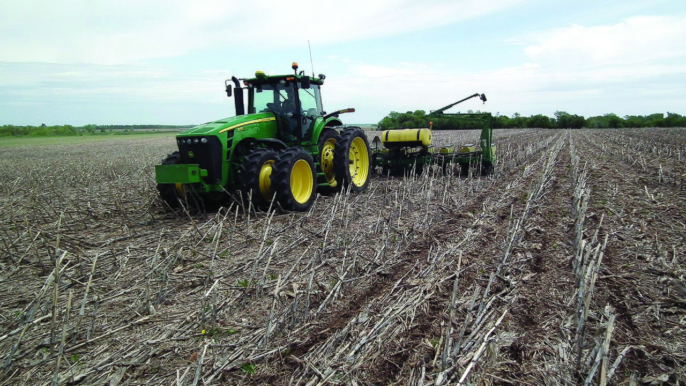
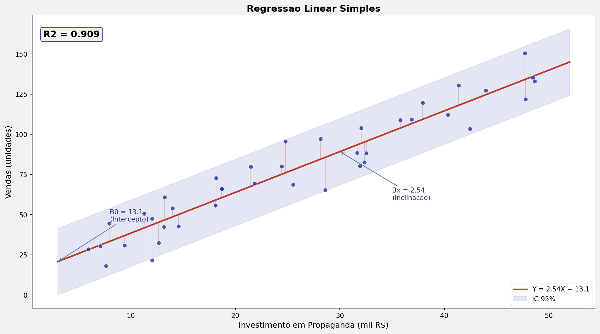
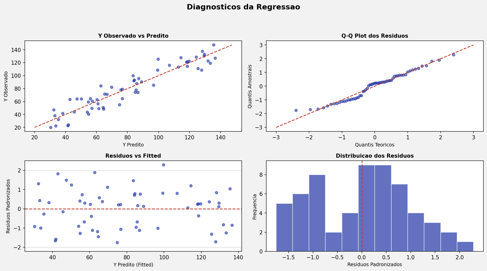
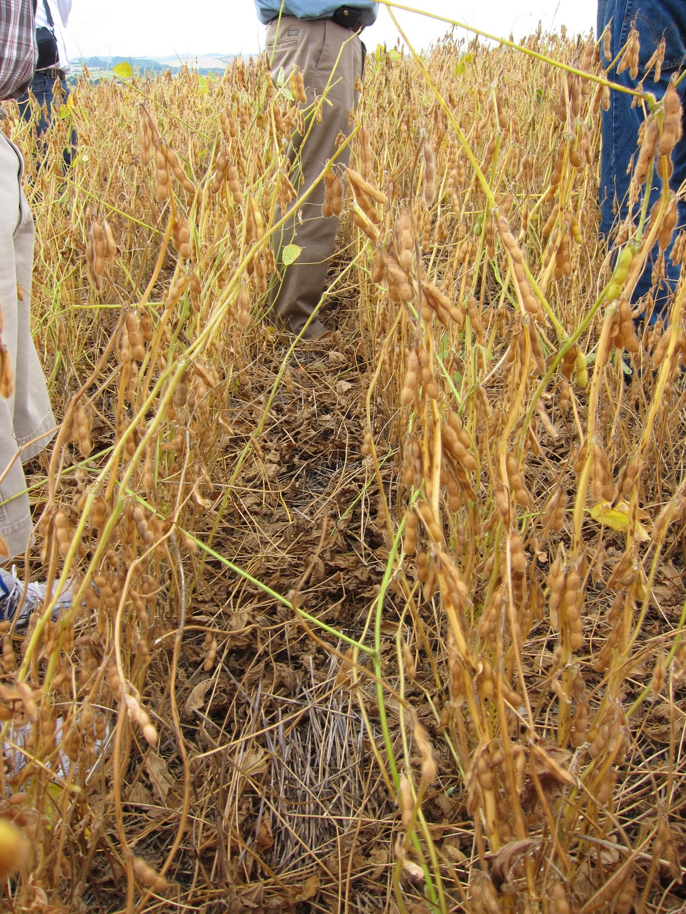
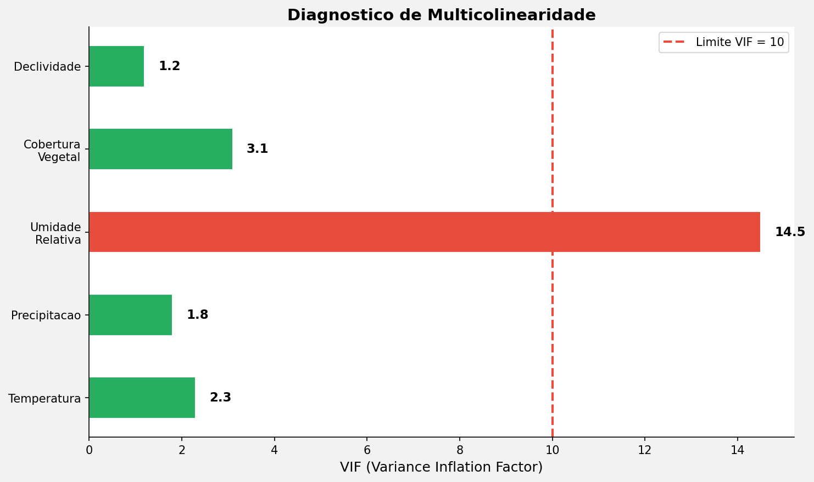
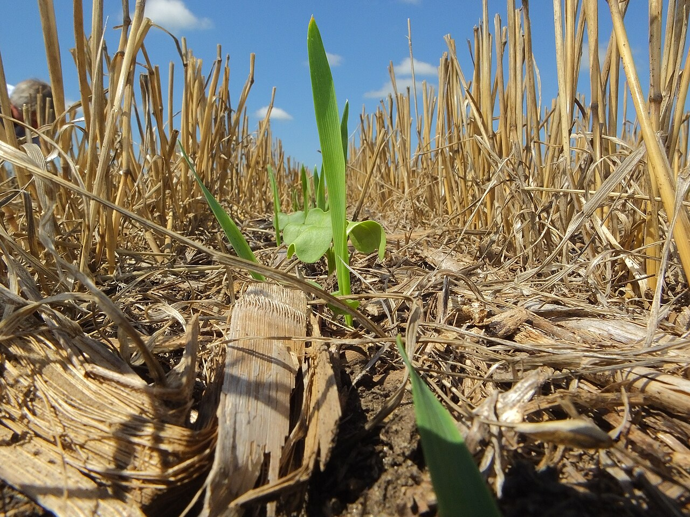
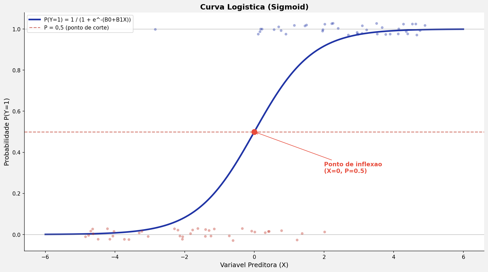
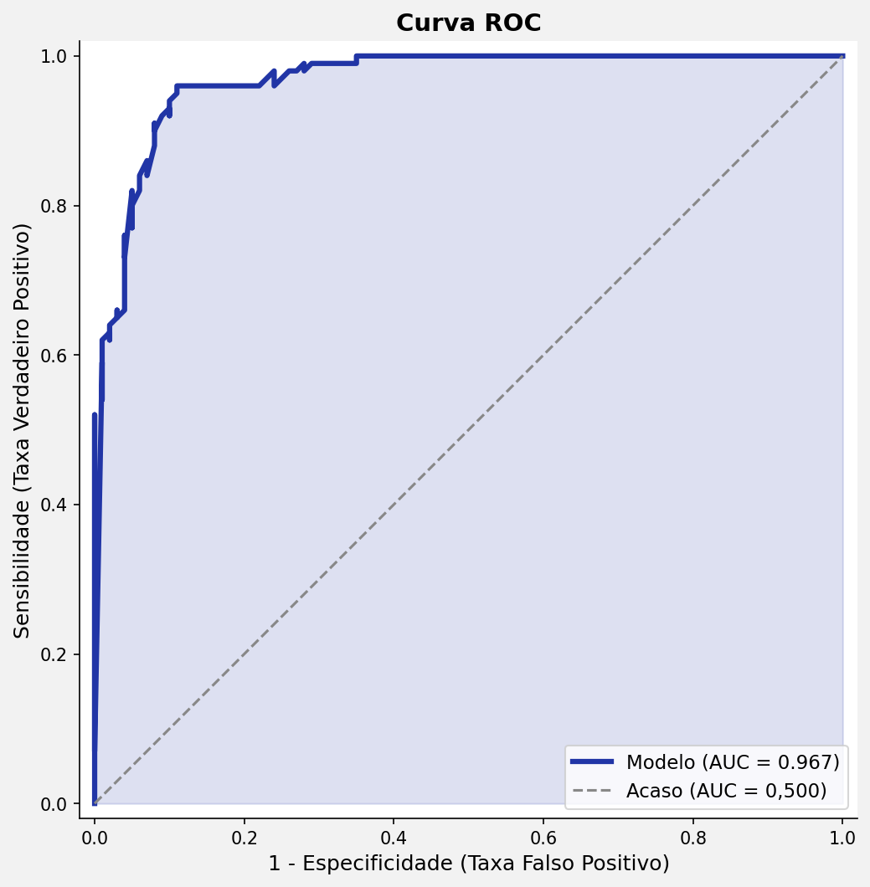

## Roteiro da Aula {.smaller-text}

::: {.columns}
:::: {.column width="60%"}

- [1]{.circle} O que é Regressão?
- [2]{.circle} Regressão Linear Simples
- [3]{.circle} Pressupostos da Regressão
- [4]{.circle} Regressão Linear Múltipla
- [5]{.circle} Diagnósticos e Problemas
- [6]{.circle} Variáveis Dummy
- [7]{.circle} Regressão Logística Binária
- [8]{.circle} Regressão Multinomial

::::
:::: {.column width="40%"}

::: {.info-box}
**Objetivo:** Compreender como modelos de regressão estimam o efeito de variáveis preditoras (VIs) sobre um desfecho (VD), aplicando-os a problemas ambientais e agronômicos.
:::

::::
:::


# [1 — O QUE É REGRESSÃO?]{.section-header}

## Definição e família de modelos {.smaller-text}

::: {.columns}
:::: {.column width="55%"}

::: {.info-box}
**Regressão** é a técnica de análise que **quantifica** o quanto uma ou mais variáveis preditoras (VIs) explicam ou estão associadas a um desfecho (VD).

Diferentemente da correlação, a regressão tem uma **direcionalidade**: assume-se que $X$ explica $Y$.
:::

::: {.highlight-box}
**As três perguntas que a regressão responde:**

[1]{.circle} **Há associação?** (significância)

[2]{.circle} **Em que direção e magnitude?** (coeficientes $\beta$)

[3]{.circle} **Quanto da variação de Y é explicado?** ($R^2$)
:::

::::
:::: {.column width="45%"}

{width="100%"}

::::
:::


## Mapa da família de regressões {.smaller-text}

```{mermaid}
%%| fig-width: 10
flowchart TD
    A["Tipo de\nvariável dependente?"]:::root --> B{"VD"}:::node
    B --> |"Contínua"| C{"Quantas VIs?"}:::node
    B --> |"Dicotômica\n(0/1)"| D["Regressão\nLogística Binária"]:::result
    B --> |"Politômica\nnominal"| E["Regressão\nMultinomial"]:::result
    B --> |"Contagem"| F["Regressão\nde Poisson"]:::leaf

    C --> |"1 VI"| G["Regressão Linear\nSimples"]:::leaf
    C --> |"≥ 2 VIs"| H["Regressão Linear\nMúltipla"]:::result

    classDef root fill:#2135A6,color:#fff,font-weight:bold,stroke:#27368C
    classDef node fill:#C5CEE8,color:#0D0D0D,stroke:#586BA6
    classDef leaf fill:#586BA6,color:#fff,stroke:#27368C
    classDef result fill:#27368C,color:#fff,font-weight:bold,stroke:#2135A6
```

::: {.info-box}
A escolha do tipo de regressão depende **da natureza da VD** (contínua, binária, politômica, contagem) e **do número de VIs** (uma ou várias).
:::


# [2 — REGRESSÃO LINEAR SIMPLES]{.section-header}

## A equação fundamental {.smaller-text}

::: {.columns}
:::: {.column width="50%"}

::: {.info-box}
**Modelo linear simples**

$$Y = \beta_0 + \beta_x X + \varepsilon$$

| Termo | Interpretação |
|-------|---------------|
| $Y$ | Variável dependente (desfecho) |
| $\beta_0$ | Intercepto (valor de Y quando X = 0) |
| $\beta_x$ | Inclinação — efeito de X sobre Y |
| $X$ | Variável independente (preditor) |
| $\varepsilon$ | Erro aleatório (variância não explicada) |
:::

::::
:::: {.column width="50%"}

{width="100%"}

::: {.highlight-box}
A regressão traça a **reta de melhor ajuste** que minimiza a soma dos quadrados dos resíduos (método dos mínimos quadrados ordinários — OLS).
:::

::::
:::


## Exemplo: investimento em propaganda × vendas {.smaller-text}

::: {.columns}
:::: {.column width="50%"}

::: {.box}
**Cenário**

Um empresário quer saber o quanto o investimento em propaganda (VI) aumentou as vendas (VD) ao longo do mês.

- $Y$ = vendas (R$)
- $\beta_0$ = vendas esperadas **sem** propaganda
- $X$ = valor investido em propaganda
- $\beta_x$ = retorno em vendas para cada R$ 1 investido
- $\varepsilon$ = variação não explicada pelo investimento
:::

::::
:::: {.column width="50%"}

::: {.info-box}
**O que a regressão revela**

- Quanto $Y$ aumenta a cada unidade de $X$
- Quanto (em %) a presença de $X$ contribui para $Y$
- O **poder explicativo** do modelo via $R^2$:
  - $R^2 = 0{,}25$ → 25% da variância de Y explicada por X
  - $R^2 = 0{,}80$ → modelo de alta capacidade explicativa
:::

::: {.highlight-box}
Nenhum modelo é livre de erro: o resíduo $\varepsilon$ representa a influência de fatores externos não incluídos no modelo.
:::

::::
:::


## Tipos de variáveis admitidos {.smaller-text}

::: {.columns}
:::: {.column width="50%"}

::: {.box}
**Variável dependente (VD)**

- Sempre **contínua** (intervalar ou de razão)
- Em casos especiais, pode ser ordinal com muitos níveis
:::

::::
:::: {.column width="50%"}

::: {.box}
**Variável independente (VI)**

- **Contínua** (intervalar/razão)
- **Ordinal**
- **Categórica dicotômica** (entra como 0/1)
- **Categórica politômica** → exige codificação **dummy** (k − 1 variáveis)
:::

::::
:::


# [3 — PRESSUPOSTOS DA REGRESSÃO]{.section-header}

## Os cinco pressupostos clássicos {.smaller-text}

::: {.columns}
:::: {.column width="50%"}

::: {.info-box}
**Pressupostos do modelo linear**

[1]{.circle} **Linearidade** — a relação entre X e Y é linear

[2]{.circle} **Variância não nula** das VIs

[3]{.circle} **Homocedasticidade** dos resíduos (variância constante)

[4]{.circle} **Independência** dos resíduos (sem autocorrelação)

[5]{.circle} **Normalidade** da distribuição dos resíduos
:::

::: {.highlight-box}
A violação desses pressupostos compromete a inferência: erros padrão enviesados, IC incorretos e p-valores não confiáveis.
:::

::::
:::: {.column width="50%"}

{width="100%"}

::: {.box}
**Como avaliar**

- **Linearidade:** dispersão Y vs. X
- **Homocedasticidade:** resíduos vs. ajustados
- **Normalidade:** Q-Q plot, Shapiro-Wilk
- **Independência:** Durbin-Watson
:::

::::
:::


# [4 — REGRESSÃO LINEAR MÚLTIPLA]{.section-header}

## Da simples à múltipla {.smaller-text}

::: {.columns}
:::: {.column width="50%"}

::: {.box}
**Simples**

$$Y = \beta_0 + \beta_x X + \varepsilon$$

Apenas **um** preditor.
:::

::: {.box}
**Múltipla**

$$Y = \beta_0 + \beta_1 X_1 + \beta_2 X_2 + \dots + \beta_n X_n + \varepsilon$$

**Vários** preditores simultâneos. Cada $\beta_i$ representa o efeito **parcial** de $X_i$ sobre $Y$, **controlando** os demais preditores.
:::

::::
:::: {.column width="50%"}

::: {.info-box}
**Exemplo aplicado — produtividade da soja**

Possíveis VIs:

- Sistema de preparo (PD / CM / CC)
- Cultura antecedente (leguminosas, gramíneas)
- Adubação verde (sim/não)
- Inoculação com *Azospirillum brasilense*
- Mecanização
- Rotação vs. monocultura
:::

{width="100%"}

::::
:::


## Métodos de entrada das variáveis {.smaller-text}

::: {.info-box}
| Método | Característica | Vantagens | Desvantagens |
|--------|----------------|-----------|--------------|
| **Enter** (Inserir) | Todas as VIs entram simultaneamente | Simplicidade | Vulnerável à multicolinearidade; não isola o $R^2$ de cada VI |
| **Stepwise** (Por etapa) | VIs entram passo a passo pela significância de F | Modelo mais parcimonioso; isola o $R^2$ de cada VI | F sofre efeito do N; risco de **efeito supressor** |
| **Forward** (Avançar) | VIs entram pela correlação parcial com a VD | Parcimonioso; isola o $R^2$ de cada VI | Influenciado por VIs já no modelo |
| **Backward** (Retroceder) | Parte do modelo cheio e exclui VIs passo a passo | Reduz erros de inserção dos métodos forward/stepwise | — |
| **Remove** (Remover) | Exclusão **manual** das VIs para comparar modelos | Permite testar hipóteses específicas | Escolhas arbitrárias podem enviesar |
:::

::: {.highlight-box}
Em pesquisa aplicada, prefira **Enter** quando há **hipóteses teóricas** sobre quais VIs incluir; reserve métodos automáticos (stepwise/forward) para análises **exploratórias**.
:::


# [5 — DIAGNÓSTICOS E PROBLEMAS]{.section-header}

## Multicolinearidade {.smaller-text}

::: {.columns}
:::: {.column width="50%"}

::: {.info-box}
**Independência entre as VIs**

Quando duas ou mais VIs são fortemente correlacionadas, os coeficientes $\beta$ ficam **instáveis** e os erros padrão **inflados**.

::: {.box}
**Diagnósticos**

- **Tolerância** = $1 - R^2_i$ (R² da VI explicada pelas demais)
  - Próxima de 1,0 → bom
- **VIF** (Variance Inflation Factor)
  - VIF > 10 → multicolinearidade séria
  - Média de VIF substancialmente > 1 → modelo tendencioso
:::
:::

::::
:::: {.column width="50%"}

{width="100%"}

::::
:::


## Independência dos resíduos {.smaller-text}

::: {.columns}
:::: {.column width="50%"}

::: {.box}
**Coeficiente de Durbin-Watson**

- Faixa aceitável: **1,5 a 2,5**
- Valores < 1,5 → autocorrelação **positiva**
- Valores > 2,5 → autocorrelação **negativa**

Especialmente crítico em **séries temporais ambientais** (ex.: monitoramento contínuo de variáveis climáticas).
:::

::::
:::: {.column width="50%"}

::: {.highlight-box}
Quando há autocorrelação, considere:

- Modelos de **séries temporais** (ARIMA)
- **GLS** (Generalized Least Squares)
- Inclusão de uma variável temporal como preditor
:::

::::
:::


## Problemas amostrais — outliers e influência {.smaller-text}

::: {.columns}
:::: {.column width="50%"}

::: {.box}
**Resíduos padronizados (Z)**

- |Z| > 3 → **outlier**
- Se >1% da amostra com |Z| > 2,5 → problema no modelo
- Se >5% da amostra com |Z| > 2,0 → problema no modelo
:::

::: {.box}
**Distância de Cook**

- Mede o efeito de um único caso sobre **todo** o modelo
- Valores > 1 merecem atenção
:::

::::
:::: {.column width="50%"}

::: {.info-box}
**Distância de Mahalanobis** (referências práticas)

| N | Nº de VIs | Limite crítico |
|:---:|:---:|:---:|
| 500 | 5 | 25 |
| 100 | 3 | 15 |
| 30 | 2 | 11 |
:::

::: {.highlight-box}
Outliers nem sempre devem ser excluídos: investigue se representam **erro de medição** ou **fenômeno real** (ex.: evento de chuva extrema).
:::

::::
:::


## Tamanho amostral {.smaller-text}

::: {.columns}
:::: {.column width="55%"}

::: {.info-box}
**Regra prática (Tabachnick & Fidell, 2019)**

$$N \geq 50 + 8k$$

onde $k$ = número de variáveis preditoras.

| k (VIs) | N mínimo |
|:---:|:---:|
| 1 | 58 |
| 3 | 74 |
| 5 | 90 |
| 10 | 130 |
:::

::::
:::: {.column width="45%"}

::: {.highlight-box}
Para um cálculo **mais confiável**, use o **G\*Power** definindo:

- Tamanho de efeito esperado ($f^2$)
- $\alpha = 0{,}05$
- Poder = 0,80
- Número de preditores
:::

::::
:::


# [6 — VARIÁVEIS DUMMY]{.section-header}

## Quando usar variáveis dummy {.smaller-text}

::: {.columns}
:::: {.column width="50%"}

::: {.info-box}
**Preditor categórico politômico**

Variáveis nominais como:

- **Estado civil:** 1 = Solteiro; 2 = Casado; 3 = Viúvo…
- **Sistema de cultivo:** 1 = CC; 2 = CM; 3 = PD

Os números **não têm sentido matemático nem ordem natural** → não podem entrar diretamente no modelo.
:::

::: {.highlight-box}
**Solução:** criar **k − 1** variáveis dummy (binárias 0/1), contrastando cada categoria contra uma **categoria de referência**.

A regra **k − 1** evita **multicolinearidade perfeita**.
:::

::::
:::: {.column width="50%"}

{width="100%"}

::::
:::


## Exemplo: cultura antecedente {.smaller-text}

::: {.columns}
:::: {.column width="40%"}

::: {.box}
**Categorias originais**

5 níveis de cultura antecedente:

- 1 = **Controle/Mata** (referência)
- 2 = Caupi
- 3 = Milheto
- 4 = Guandu
- 5 = Crotalária

Geram **4 variáveis dummy** (k − 1 = 4).
:::

::::
:::: {.column width="60%"}

::: {.info-box}
**Tabela de codificação**

| Original | Dummy_1 | Dummy_2 | Dummy_3 | Dummy_4 |
|----------|:---:|:---:|:---:|:---:|
| Controle | 0 | 0 | 0 | 0 |
| Caupi    | 1 | 0 | 0 | 0 |
| Milheto  | 0 | 1 | 0 | 0 |
| Guandu   | 0 | 0 | 1 | 0 |
| Crotalária | 0 | 0 | 0 | 1 |
:::

::: {.highlight-box}
Cada coeficiente $\beta_i$ das dummies representa a **diferença média de Y** entre aquela categoria e a categoria de referência (Controle).
:::

::::
:::


# [7 — REGRESSÃO LOGÍSTICA BINÁRIA]{.section-header}

## Quando usar regressão logística {.smaller-text}

::: {.columns}
:::: {.column width="50%"}

::: {.info-box}
**Objetivo**

Modelar a **probabilidade de ocorrência** de um desfecho **binário** (sim/não, 0/1) em função de uma ou mais VIs.

**Exemplos ambientais e agronômicos:**

- Presença de praga (sim/não) em função de umidade, rotação, temperatura
- Sobrevivência de mudas (vivas/mortas) em função do tipo de substrato
- Ocorrência de erosão (sim/não) em função de declividade e cobertura
:::

::::
:::: {.column width="50%"}

{width="100%"}

::::
:::


## Linear vs. logística {.smaller-text}

::: {.columns}
:::: {.column width="50%"}

::: {.box}
**Regressão Linear**

- VD **contínua**
- Função: reta
- Estima **valores** de Y
- Pressupõe normalidade dos resíduos
:::

::::
:::: {.column width="50%"}

::: {.box}
**Regressão Logística**

- VD **binária** (0/1)
- Função: **curva sigmoide** (logit)
- Estima **probabilidades** entre 0 e 1
- Não exige normalidade dos resíduos
:::

::::
:::

::: {.info-box}
**Equação logística**

$$P(Y=1) = \frac{1}{1 + e^{-(\beta_0 + \beta_1 X_1 + \dots + \beta_n X_n)}}$$

Os coeficientes são interpretados como **log-odds**; sua exponencial $e^{\beta}$ fornece a **odds ratio (OR)**.
:::


## A curva logística {.smaller-text}

::: {.columns}
:::: {.column width="55%"}

{width="100%"}

::::
:::: {.column width="45%"}

::: {.highlight-box}
**Leitura da curva**

- Para valores baixos de X → probabilidade próxima de 0
- Para valores altos de X → probabilidade próxima de 1
- O **ponto de inflexão** (P = 0,5) define o limiar natural de classificação
:::

::: {.info-box}
**Odds ratio (OR)**

- OR > 1 → o aumento de X **aumenta** a chance do evento
- OR < 1 → o aumento de X **diminui** a chance
- OR = 1 → sem efeito
:::

::::
:::


## Avaliação do modelo logístico — Curva ROC {.smaller-text}

::: {.columns}
:::: {.column width="55%"}

{width="100%"}

::::
:::: {.column width="45%"}

::: {.info-box}
**Área sob a curva (AUC)**

| AUC | Interpretação |
|:---:|---------------|
| 0,50 | Modelo aleatório |
| 0,60–0,70 | Discriminação fraca |
| 0,70–0,80 | Aceitável |
| 0,80–0,90 | Excelente |
| > 0,90 | Excepcional |
:::

::: {.highlight-box}
A curva ROC mostra o **trade-off** entre sensibilidade (verdadeiros positivos) e 1 − especificidade (falsos positivos) ao variar o limiar de decisão.
:::

::::
:::


# [8 — REGRESSÃO MULTINOMIAL]{.section-header}

## Estendendo a logística {.smaller-text}

::: {.columns}
:::: {.column width="50%"}

::: {.info-box}
**Quando a VD é politômica**

A **regressão multinomial** (ou polinomial) é usada quando a VD tem **≥ 3 categorias nominais** (sem ordem natural).

**Exemplos:**

- Tipo de solo dominante (Argissolo, Latossolo, Neossolo)
- Classe de uso da terra (mata, pasto, cultivo, urbano)
- Estado fitossanitário (saudável, leve, severo)
:::

::::
:::: {.column width="50%"}

::: {.box}
**Como funciona**

- Escolhe-se uma **categoria de referência**
- O modelo estima **k − 1 equações logísticas** simultâneas, cada uma contrastando uma categoria contra a referência
- Resultados em **odds ratio**, interpretados em relação à referência
:::

::: {.highlight-box}
Pressupostos análogos à logística binária + **independência das alternativas irrelevantes (IIA)**: a razão entre quaisquer duas alternativas não deve depender das demais opções disponíveis.
:::

::::
:::


## Resumo — escolhendo o modelo de regressão certo {.smaller-text}

```{mermaid}
%%| fig-width: 10
flowchart LR
    A["Natureza da VD?"]:::root --> B["Contínua"]:::node
    A --> C["Dicotômica"]:::node
    A --> D["Politômica\nnominal"]:::node
    A --> E["Contagem"]:::node

    B --> F{"Quantas VIs?"}:::node
    F --> |"1"| G["Regressão Linear\nSimples"]:::leaf
    F --> |"≥ 2"| H["Regressão Linear\nMúltipla"]:::result

    C --> I["Regressão\nLogística Binária"]:::result
    D --> J["Regressão\nMultinomial"]:::result
    E --> K["Regressão\nde Poisson"]:::leaf

    classDef root fill:#2135A6,color:#fff,font-weight:bold,stroke:#27368C
    classDef node fill:#C5CEE8,color:#0D0D0D,stroke:#586BA6
    classDef leaf fill:#586BA6,color:#fff,stroke:#27368C
    classDef result fill:#27368C,color:#fff,font-weight:bold,stroke:#2135A6
```

::: {.info-box}
**Roteiro decisório:**

[1]{.circle} Identifique a **natureza da VD** (contínua, binária, politômica, contagem)

[2]{.circle} Conte o número de **VIs** e seus tipos (contínuas, categóricas → dummy)

[3]{.circle} Escolha o **método de entrada** (Enter para hipóteses, stepwise para exploração)

[4]{.circle} **Verifique pressupostos** e **diagnósticos** (VIF, Durbin-Watson, Cook, ROC)
:::


## {.center background-color="#2135A6"}

::: {style="text-align: center;"}
[Obrigado!]{.obrigado-fit-text style="color: white;"}

::: {style="color: white; font-size: 0.7em;"}
Luiz Diego Vidal Santos

Universidade Estadual de Feira de Santana (UEFS)
:::
:::
