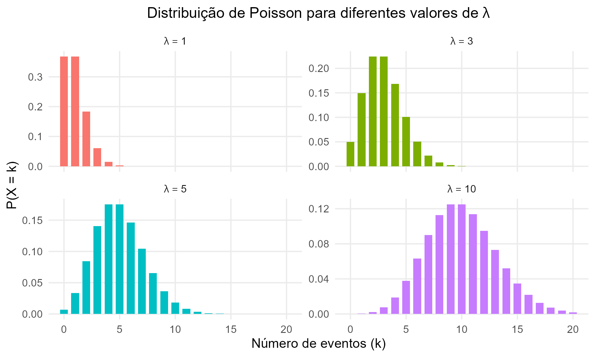
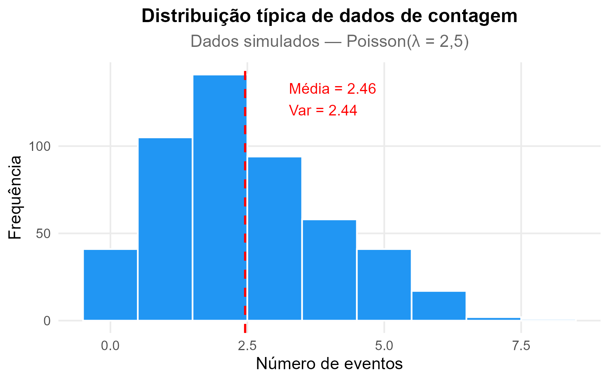
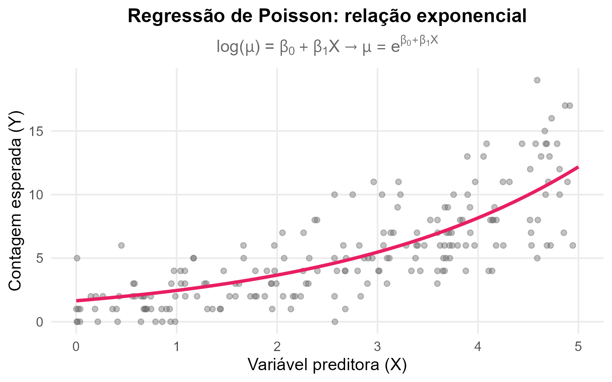

# [INTRODUÇÃO]{.section-header}

## Bem-vindos ao módulo {.smaller-text}

::: {.columns}
::: {.column width="50%"}

### Neste módulo você aprenderá a

- Compreender a lógica da **regressão de Poisson**
- Identificar quando utilizar **modelos de contagem**
- Avaliar pressupostos e adequação do modelo
- Interpretar **IRR** e **IC 95%**
- Lidar com **superdispersão**
- Aplicar **binomial negativa** e **Poisson robusta**

:::
::: {.column width="50%"}

::: {.highlight-box}
**Materiais necessários**

- Banco de dados: `lbw.csv` / `lbw.sav`
- Software: SPSS, JAMOVI ou R
- Arquivos de descrição (`.docx`)
- Referências complementares (plataforma)
:::

:::
:::

::: aside
Coxe, West & Aiken, 2009; Hutchinson & Holtman, 2005; Green, 2021
:::

---

# [REGRESSÃO DE POISSON — TEORIA]{.section-header}

## Contagem de eventos {.smaller-text}

::: {.columns}
::: {.column width="50%"}

Muitas vezes na pesquisa estamos interessados em **quantas vezes** eventos acontecem.

A regressão de Poisson pertence à família de análises cuja **variável desfecho** se refere a uma **contagem de eventos**.

### Exemplos

- Nº de internações por complicações do diabetes
- Nº de consultas pré-natal atendidas
- Nº de episódios depressivos em um período
- Nº de cáries em crianças < 10 anos
- Nº de ocorrências de erosão em estradas rurais

:::
::: {.column width="50%"}

{width="100%" fig-align="center"}

:::

:::

::: aside
Coxe, West & Aiken, 2009; Adaptado de Green, 2021
:::

---

## Modelos Lineares Generalizados (GLM) {.smaller-text}

::: {.columns}
::: {.column width="50%"}

::: {.info-box}
**Família dos GLM**

As regressões de contagem pertencem à família dos GLM:

- **Família:** Poisson
- **Link:** Log

| Software | Modelos |
|----------|---------||
| SPSS | Poisson, binomial negativa |
| JAMOVI | Poisson, binomial negativa |
| Stata | Poisson, binomial neg., zero inflada/truncada |
| R | Poisson, binomial neg., zero inflada/truncada |
:::

:::
::: {.column width="50%"}

{width="100%" fig-align="center"}

:::
:::

---

## Pressupostos {.smaller-text}

::: {.columns}
::: {.column width="50%"}

::: {.highlight-box}
**Quatro pressupostos fundamentais**

1. **Independência dos eventos**
2. **Valores inteiros não negativos** (0, 1, 2, …)
3. **Distribuição assimétrica à direita** (truncada no zero)
4. **Equidispersão:** $E(Y) = \text{Var}(Y) = \lambda$
   - Principal pressuposto da regressão de Poisson
:::

:::
::: {.column width="50%"}

### Como avaliar

| Ferramenta | O que verificar |
|-----------|----------------|
| Média e variância | Devem ser próximas |
| Assimetria | Esperada positiva |
| Histograma | Concentração perto de zero |
| Deviance/gl | ≈ 1 na regressão |
| AIC | Comparação entre modelos |

::: {.info-box}
**Dica:** calcule variância/média. Se ≈ 1 → equidispersão. Se >> 1 → superdispersão.
:::

:::
:::

::: aside
Coxe, West & Aiken, 2009; Green, 2021; Hutchinson & Holtman, 2005
:::

---

## A função de ligação logarítmica {.smaller-text}

::: {.columns}
::: {.column width="45%"}

::: {.highlight-box}
**Link log**

A regressão de Poisson modela:

$$\log(\mu) = \beta_0 + \beta_1 X$$

Ou equivalentemente:

$$\mu = e^{\beta_0 + \beta_1 X}$$

A relação entre preditores e contagem é **exponencial**, não linear.
:::

:::
::: {.column width="55%"}

{width="100%" fig-align="center"}

:::
:::

---

# [AULA PRÁTICA]{.section-header}

## Banco de dados e pressupostos {.smaller-text}

::: {.columns}
::: {.column width="50%"}

### Banco: `lbw` (Low Birth Weight)

1. Abra `lbw.sav` (ou `lbw.csv`)
2. Identifique a **variável desfecho** (contagem)
3. Identifique as **variáveis preditoras**

### Atividade

1. Calcule média, variância e assimetria da VD
2. Construa o histograma
3. Compare média ≈ variância?
4. Explore as preditoras (categóricas e numéricas)

:::
::: {.column width="50%"}

### Solicitando no SPSS

`Analisar → Modelos Lineares Generalizados → GLM`

1. **Tipo de modelo:** Poisson loglinear
2. **Resposta:** variável de contagem
3. **Preditores:** fatores + covariáveis
4. **Modelo:** efeitos principais
5. **Estatísticas:** estimativas dos parâmetros

### Solicitando no R

```r
modelo <- glm(contagem ~ pred1 + pred2,
              data = dados,
              family = poisson(link = "log"))
summary(modelo)
exp(coef(modelo))       # IRR
exp(confint(modelo))    # IC 95%
```

:::
:::

---

# [INTERPRETANDO O RESULTADO]{.section-header}

## Qualidade do modelo {.smaller-text}

::: {.columns}
::: {.column width="50%"}

### Deviance e AIC

- **Deviance/gl ≈ 1** → bom ajuste
- **Deviance/gl >> 1** → superdispersão ⚠️
- **AIC** — menores valores = melhor (comparativo)

### Teste Omnibus

Modelo é melhor que o modelo nulo?

→ Espera-se **p < 0,05**

### Teste de Wald

Significância de cada preditor individual

→ p < 0,05 → preditor contribui

:::
::: {.column width="50%"}

::: {.highlight-box}
**Coeficientes: B e Exp(B)**

- **B** — escala logarítmica
- **Exp(B) = IRR** (Incidence Rate Ratio)

| Modelo | Exp(B) |
|--------|--------|
| Logística | OR (Odds Ratio) |
| **Poisson** | **IRR** |
| Poisson robusta | RP |

O SPSS chama tudo de Exp(B), mas a **interpretação** e o **nome** dependem do modelo!
:::

:::
:::

---

## Interpretação do IRR {.smaller-text}

::: {.columns}
::: {.column width="50%"}

::: {.info-box}
**Regras gerais**

- **IRR = 1** → incidência igual entre grupos
- **IRR < 1** → menor nos expostos ("proteção")
- **IRR > 1** → maior nos expostos ("risco")
:::

::: {.highlight-box}
**Como reportar**

- **IRR < 1:** faça 1 − IRR → Ex.: 0,70 → 30% menor
- **IRR entre 1 e 2:** percentual → Ex.: 1,45 → 45% maior
- **IRR ≥ 2:** múltiplos → Ex.: 3,20 → 3,2× maior
:::

:::
::: {.column width="50%"}

### Exemplo prático

Nº de internações por complicações do diabetes × sexo:

**IRR = 1,52** (IC 95%: 1,12–2,06; p = 0,007)

> "Participantes do sexo feminino apresentaram incidência de internações **52% maior** em relação ao sexo masculino (IRR = 1,52; IC 95%: 1,12–2,06; p = 0,007)."

:::
:::

::: aside
Coxe, West & Aiken, 2009; Green, 2021
:::

---

## Descrição da Regressão de Poisson {.smaller-text}

::: {.info-box}
**Modelo de descrição para artigos/relatórios**

> "Foi utilizada a regressão de Poisson, por meio de Modelos Lineares Generalizados (GLM), para analisar o efeito das variáveis [listar preditoras] sobre [variável desfecho]. A equidispersão foi verificada por meio da razão variância/média e da estatística Deviance/gl. Os resultados foram expressos por meio da Razão de Incidência (IRR) com respectivos intervalos de confiança de 95%. O nível de significância adotado foi de 5%."
:::

### Estrutura do relatório

| Seção | O que incluir |
|-------|-------------|
| **Método** | GLM, família Poisson, link log, software utilizado |
| **Resultados** | IRR, IC 95%, p-valor, Deviance/gl, AIC |
| **Tabela** | Preditores, B, IRR (Exp B), IC 95%, p |
