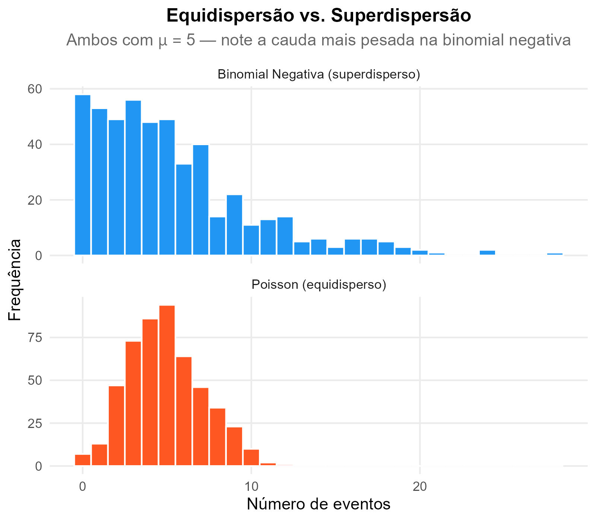
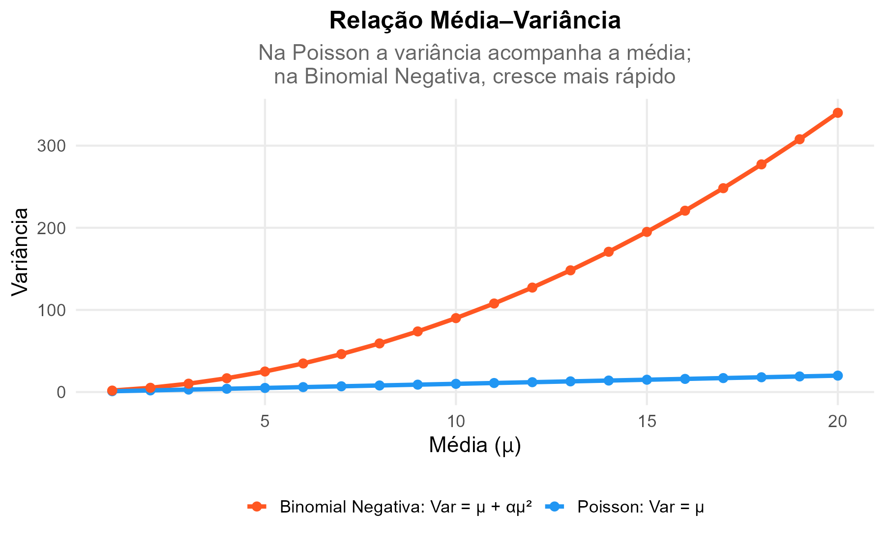

# [MODELO SUPERDISPERSO]{.section-header}

## O que é superdispersão? {.smaller-text}

::: {.columns}
::: {.column width="50%"}

Na regressão de Poisson, o pressuposto central é:

$$E(Y) = \text{Var}(Y) = \lambda$$

Quando a **variância é muito maior que a média**, temos **superdispersão** (*overdispersion*).

### Consequências

- Erros-padrão **subestimados**
- Intervalos de confiança **artificialmente estreitos**
- Testes de significância **inflados** (mais p < 0,05 falsos)

:::
::: {.column width="50%"}

::: {.highlight-box}
**Como detectar?**

1. **Razão variância/média** da VD → se >> 1, há superdispersão
2. **Deviance/gl** → se >> 1, modelo superdisperso
3. **Pearson χ²/gl** → mesmo critério

Se o valor estiver entre **0,8 e 1,2** → equidispersão aceitável
:::

::: {.info-box}
**O que fazer?**

- Utilizar a **regressão binomial negativa**
- Considerar modelos **zero-inflados** (se excesso de zeros)
- Aplicar **quasi-Poisson** (correção ad hoc)
:::

:::
:::

::: aside
Coxe, West & Aiken, 2009; Green, 2021
:::

---

## Visualizando a superdispersão {.smaller-text}

::: {.columns}
::: {.column width="50%"}

{width="100%" fig-align="center"}

:::
::: {.column width="50%"}

{width="100%" fig-align="center"}

:::
:::

---

## Comparação Poisson × Binomial Negativa {.smaller-text}

::: {.columns}
::: {.column width="50%"}

### Poisson

- $\text{Var}(Y) = \mu$
- Assume equidispersão
- Mais restritiva
- Se pressupostos atendidos → mais parcimoniosa

### Binomial Negativa

- $\text{Var}(Y) = \mu + \alpha\mu^2$
- Parâmetro extra ($\alpha$) modela a superdispersão
- Mais flexível
- Quando $\alpha → 0$, converge para a Poisson

:::
::: {.column width="50%"}

::: {.highlight-box}
**Decisão prática: qual modelo usar?**

1. Ajuste a Poisson
2. Verifique Deviance/gl
3. Se ≈ 1 → **mantenha a Poisson**
4. Se >> 1 → ajuste a **binomial negativa**
5. Compare os **AIC** dos dois modelos
6. Menor AIC → modelo melhor ajustado
:::

:::
:::

::: aside
Coxe, West & Aiken, 2009; Green, 2021
:::

---

# [REGRESSÃO BINOMIAL NEGATIVA]{.section-header}

## Solicitando a análise {.smaller-text}

::: {.columns}
::: {.column width="50%"}

### No SPSS

`Analisar → GLM → Modelos Lineares Generalizados`

1. **Tipo de modelo:** Binomial negativa com link log
2. Demais passos idênticos à Poisson
3. Pode deixar o parâmetro de dispersão estimado pelo programa

### No JAMOVI

`Analyses → Regression → GLM`

- **Model Family:** Negative Binomial
- **Link Function:** Log

:::
::: {.column width="50%"}

### No R

```r
library(MASS)

modelo_bn <- glm.nb(
  contagem ~ pred1 + pred2,
  data = dados
)

summary(modelo_bn)
exp(coef(modelo_bn))       # IRR
exp(confint(modelo_bn))    # IC 95%
```

### Comparação de modelos

```r
AIC(modelo_poisson, modelo_bn)
```

::: {.info-box}
O menor AIC indica melhor ajuste.
:::

:::
:::

---

## Interpretação dos resultados {.smaller-text}

::: {.columns}
::: {.column width="50%"}

A interpretação é **idêntica** à da regressão de Poisson:

- **Exp(B) = IRR** (Incidence Rate Ratio)
- **IRR = 1** → sem efeito
- **IRR < 1** → "proteção"
- **IRR > 1** → "risco"
- Mesmas regras de percentual e múltiplos

### O que muda?

- Erros-padrão **corrigidos** para a superdispersão
- IC 95% geralmente **mais largos** (mais honestos)
- Significâncias podem mudar (menos falsos positivos)

:::
::: {.column width="50%"}

::: {.highlight-box}
**Exemplo comparativo**

| | Poisson | Binomial Neg. |
|--|---------|--------------|
| IRR | 1,52 | 1,48 |
| IC 95% | 1,12–2,06 | 0,98–2,24 |
| p | 0,007 | 0,065 |

Note que o IC ficou mais largo e o resultado perdeu significância. Isso indica que a Poisson estava **inflando** o efeito por superdispersão.
:::

:::
:::

---

## Descrição da Regressão Binomial Negativa {.smaller-text}

::: {.info-box}
**Modelo de descrição para artigos/relatórios**

> "Inicialmente, ajustou-se uma regressão de Poisson. Devido à presença de superdispersão (Deviance/gl = X,XX), optou-se pela regressão binomial negativa, também por meio de Modelos Lineares Generalizados (GLM) com função de ligação logarítmica. Os resultados foram expressos por meio da Razão de Incidência (IRR) com intervalos de confiança de 95%. A comparação entre os modelos Poisson e binomial negativo foi realizada pelo Critério de Informação de Akaike (AIC). O nível de significância adotado foi de 5%."
:::

### Estrutura do relatório

| Seção | O que incluir |
|-------|-------------|
| **Método** | Justificativa para binomial negativa (superdispersão), AIC comparativo |
| **Resultados** | IRR, IC 95%, p, Deviance/gl, AIC de ambos os modelos |
| **Tabela** | Preditores, B, IRR, IC 95%, p — indicar qual modelo final |
