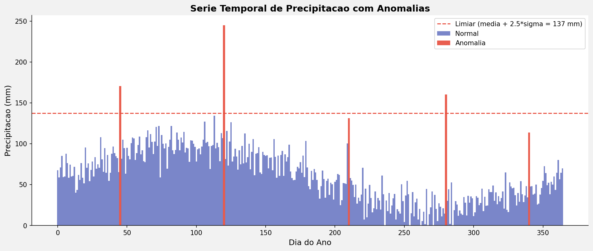
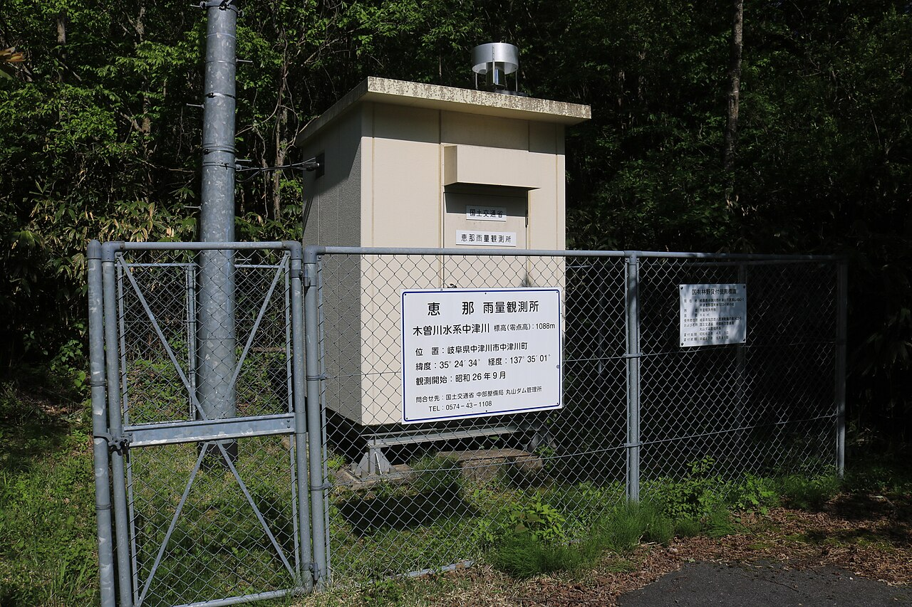
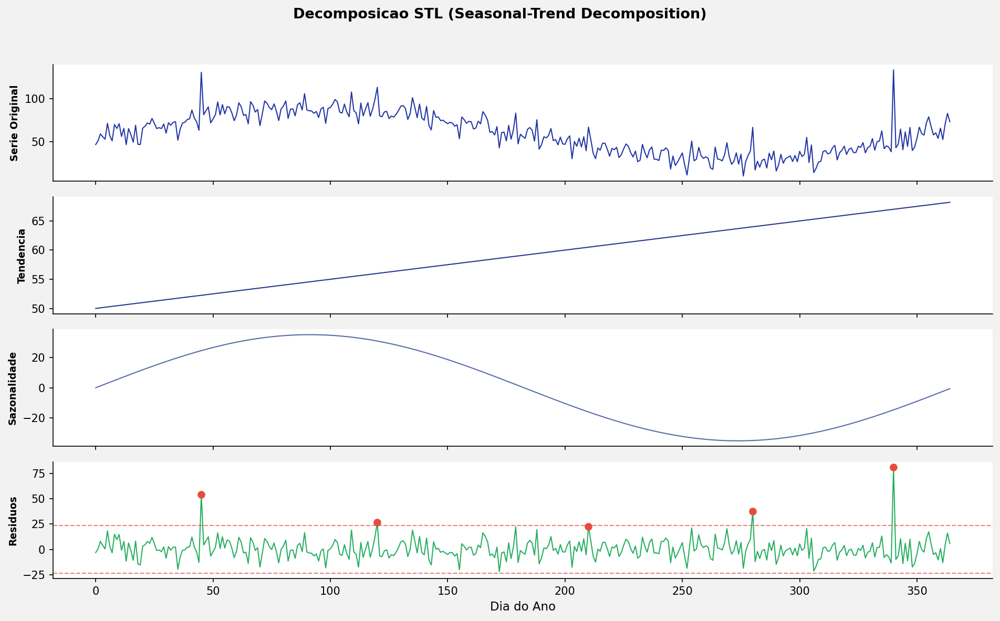
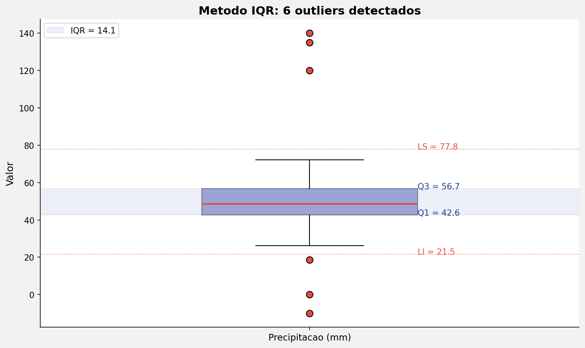
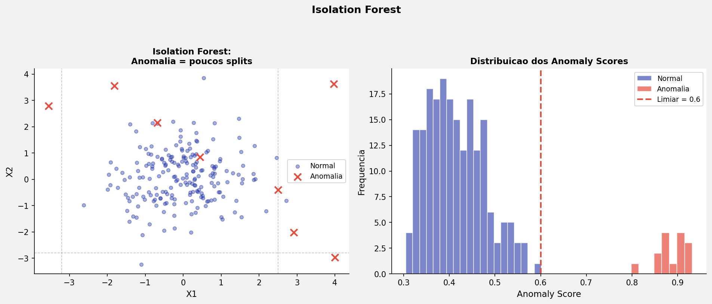
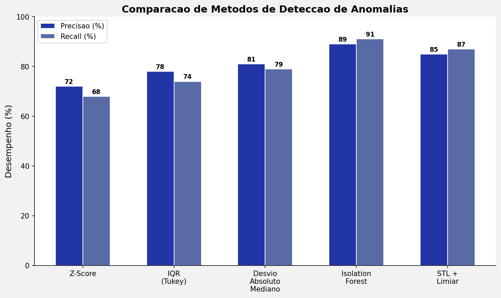

---
title: "Detecção de Anomalias em Séries Temporais"
subtitle: "Aula 20 — Isolation Forest × STL + IQR<br>Análise de Dados Ambientais"
author: "Luiz Diego Vidal Santos"
format:
  revealjs:
    logo: ../../../assets/logo-uefs.webp
    footer: "UEFS | Análise de Dados Ambientais | Aula 20"
    slide-number: true
    theme: [simple, ../../../assets/uefs.scss]
    controls: true
    width: 1280
    height: 720
    css: ../../../assets/custom.css
    include-after-body: ../../../assets/image-lightbox.html
    transition: slide
    background-transition: fade
    preview-links: auto
    code-fold: false
---

## Visão Geral {.smaller-text}

::: {.columns}
::: {.column width="50%"}
### Tópicos Principais

- [1]{.circle} O que são anomalias em dados ambientais?
- [2]{.circle} Fontes de dados: chuva e qualidade da água
- [3]{.circle} Abordagem estatística  -  STL + IQR
- [4]{.circle} Abordagem de Machine Learning  -  Isolation Forest
- [5]{.circle} Comparação prática em Python
- [6]{.circle} Interpretação e boas práticas
:::

::: {.column width="50%"}
::: {.info-box}
**Objetivo Central**

Compreender e aplicar técnicas de detecção de anomalias (outliers) em séries temporais ambientais, comparando abordagens estatísticas clássicas e de aprendizado de máquina.
:::
:::
:::

# [1  -  ANOMALIAS EM DADOS AMBIENTAIS]{.section-header}

## O que são anomalias? {.smaller-text}



::: {.columns}
::: {.column width="50%"}
### Definição

Um **outlier** ou **anomalia** é uma observação que se desvia significativamente do padrão esperado dos dados.

Em dados ambientais, anomalias podem representar:

- **Eventos reais extremos** (chuvas torrenciais, picos de poluição)
- **Erros instrumentais** (falhas de sensor, calibração)
- **Erros de registro** (digitação, transmissão de dados)
:::

::: {.column width="50%"}
::: {.highlight-box}
**Por que detectar anomalias?
**

1. **Controle de qualidade** de séries climáticas e hidrológicas
2. **Alertas precoces** de eventos extremos
3. **Limpeza de dados** antes de modelagem
4. **Identificação de mudanças** ambientais atípicas
5. **Tomada de decisão** em gestão de recursos hídricos
:::
:::
:::

---

## Tipos de anomalias em séries temporais {.smaller-text}

| Tipo | Descrição | Exemplo ambiental |
|------|-----------|-------------------|
| **Pontual** | Um único valor atípico isolado | Pico de chuva de 200 mm em um dia seco |
| **Contextual** | Valor normal em si, mas atípico no contexto temporal | 30 °C em julho no semiárido (normal), mas 30 °C em janeiro (atípico) |
| **Coletiva** | Sequência de valores que formam um padrão anômalo | Semana inteira sem chuva na estação chuvosa |


---

## Fontes de dados abertas {.smaller-text}

::: {.columns}
::: {.column width="50%"}
### Chuva diária

{width="45%"}

- **ANA / HidroWeb**  -  Séries históricas de estações pluviométricas
- **INMET**  -  Dados meteorológicos convencionais e automáticas
- **ERA5 / CPC**  -  Reanálises e dados globais

### Qualidade da água

- **ANA / SNIRH**  -  Estações de monitoramento de rios
- **CETESB**  -  Dados de qualidade de água em SP
:::

::: {.column width="50%"}
::: {.info-box}
**Nesta aula usaremos
**

Série de **precipitação diária** de uma estação da ANA no semiárido baiano (2000-2024), disponível gratuitamente no HidroWeb.

Acesso: [hidroweb.ana.gov.br](https://www.snirh.gov.br/hidroweb/)
:::
:::
:::

# [2  -  ABORDAGEM ESTATÍSTICA: STL + IQR]{.section-header}

## Decomposição STL {.smaller-text}

**STL**  -  *Seasonal and Trend decomposition using Loess*

::: {.columns}
::: {.column width="55%"}
A decomposição STL separa a série temporal em três componentes:

$$Y_t = T_t + S_t + R_t$$

Onde:

- $T_t$ = componente de **tendência**
- $S_t$ = componente **sazonal**
- $R_t$ = **resíduo** (ruído + anomalias)

A detecção de anomalias foca no **resíduo**: valores de $R_t$ fora do intervalo esperado são potenciais outliers.
:::

::: {.column width="45%"}
::: {.highlight-box}
**Vantagens do STL
**

- Robusto a outliers na estimativa
- Flexível para sazonalidade variável
- Interpretável  -  cada componente tem significado físico
- Implementação simples em Python (`statsmodels`)
:::
:::
:::



---

## Critério IQR para detecção {.smaller-text}

Sobre os resíduos $R_t$, aplicamos a **regra do intervalo interquartil (IQR)**:

$$IQR = Q_3 - Q_1$$

Um valor é classificado como **anomalia** se:

$$R_t < Q_1 - 1{,}5 \times IQR \quad \text{ou} \quad R_t > Q_3 + 1{,}5 \times IQR$$

::: {.info-box}
**Interpretação prática:** após remover tendência e sazonalidade, os resíduos "puros" que ultrapassam os limites do boxplot são candidatos a anomalia.
:::



---

## Implementação em Python  -  STL + IQR {.smaller-text}

```python
import pandas as pd
import numpy as np
from statsmodels.tsa.seasonal import STL
import matplotlib.pyplot as plt

# 1. Carregar dados de chuva diária (exemplo simulado)
np.random.seed(42)
n = 365 * 5  # 5 anos
datas = pd.date_range('2019-01-01', periods=n, freq='D')
sazonal = 10 * np.sin(2 * np.pi * np.arange(n) / 365)
tendencia = np.linspace(5, 7, n)
ruido = np.random.exponential(2, n)
chuva = np.maximum(0, tendencia + sazonal + ruido)

# Inserir anomalias artificiais
chuva[100] = 120   # Evento extremo
chuva[800] = 95    # Evento extremo
chuva[1200] = -5   # Erro de sensor (negativo)

df = pd.DataFrame({'data': datas, 'chuva_mm': chuva}).set_index('data')
```

---

## Implementação  -  Passo a passo {.smaller-text}

```python
# 2. Decomposição STL (período = 365 dias)
stl = STL(df['chuva_mm'], period=365, robust=True)
resultado = stl.fit()

# 3. Extrair resíduos e aplicar IQR
residuos = resultado.resid
Q1 = residuos.quantile(0.25)
Q3 = residuos.quantile(0.75)
IQR = Q3 - Q1

limite_inf = Q1 - 1.5 * IQR
limite_sup = Q3 + 1.5 * IQR

# 4. Classificar anomalias
anomalias_stl = df[(residuos < limite_inf) | (residuos > limite_sup)]
print(f"Anomalias detectadas (STL+IQR): {len(anomalias_stl)}")
```

# [3  -  ABORDAGEM ML: ISOLATION FOREST]{.section-header}

## Conceito do Isolation Forest {.smaller-text}

::: {.columns}
::: {.column width="55%"}
### Ideia central

O **Isolation Forest** (Liu et al., 2008) parte de um princípio simples:

> *Anomalias são poucas e diferentes  -  portanto, mais fáceis de "isolar".*

O algoritmo constrói **árvores de decisão aleatórias** que particionam o espaço dos dados. Pontos anômalos necessitam de **menos partições** para serem isolados.

### Métrica

O **score de anomalia** é baseado na profundidade média da árvore:

- Profundidade **baixa** → fácil de isolar → **anomalia**
- Profundidade **alta** → difícil de isolar → **normal**
:::

::: {.column width="45%"}
::: {.highlight-box}
**Parâmetros principais
**

| Parâmetro | Descrição |
|-----------|-----------|
| `n_estimators` | Nº de árvores (100-300) |
| `contamination` | Proporção esperada de anomalias (0.01-0.05) |
| `max_samples` | Tamanho da subamostra |


**`contamination`** é o parâmetro mais sensível para dados ambientais.
:::
:::
:::



---

## Vantagens e limitações {.smaller-text}

::: {.columns}
::: {.column width="50%"}
### ✅ Vantagens

- Não assume distribuição dos dados
- Escalável para grandes volumes
- Funciona bem com dados multivariados (temperatura + umidade + chuva)
- Não requer remoção prévia de sazonalidade
:::

::: {.column width="50%"}
### ⚠️ Limitações

- **Não é interpretável** como STL  -  funciona como "caixa-preta"
- Sensível ao parâmetro `contamination`
- Pode confundir eventos extremos reais com erros
- Não considera a **estrutura temporal** dos dados diretamente
:::
:::

---

## Implementação em Python  -  Isolation Forest {.smaller-text}

```python
from sklearn.ensemble import IsolationForest

# Engenharia de atributos para captar padrão temporal
df['dia_ano'] = df.index.dayofyear
df['chuva_media_7d'] = df['chuva_mm'].rolling(7, min_periods=1).mean()
df['chuva_desvio_7d'] = df['chuva_mm'].rolling(7, min_periods=1).std().fillna(0)

# Selecionar features
features = ['chuva_mm', 'dia_ano', 'chuva_media_7d', 'chuva_desvio_7d']
X = df[features].dropna()

# Ajustar Isolation Forest
iso_forest = IsolationForest(
    n_estimators=200,
    contamination=0.02,   # espera-se ~2% de anomalias
    random_state=42
)
df.loc[X.index, 'anomalia_if'] = iso_forest.fit_predict(X)

# Filtrar anomalias (label = -1)
anomalias_if = df[df['anomalia_if'] == -1]
print(f"Anomalias detectadas (Isolation Forest): {len(anomalias_if)}")
```

# [4  -  COMPARAÇÃO PRÁTICA]{.section-header}

## STL + IQR vs. Isolation Forest {.smaller-text}

| Critério | STL + IQR | Isolation Forest |
|----------|-----------|-----------------|
| **Tipo de abordagem** | Estatística / decomposição | Machine Learning |
| **Pré-requisito** | Série com sazonalidade definida | Dados tabulares (com engenharia de features) |
| **Interpretabilidade** | Alta  -  resíduos explicáveis | Baixa  -  score opaco |
| **Detecção contextual** | Sim (remove sazonalidade) | Parcial (depende das features) |
| **Multivariado** | Não (univariado) | Sim |
| **Parâmetro crítico** | Multiplicador IQR (1,5 ou 3) | `contamination` |
| **Custo computacional** | Baixo | Moderado |




---

## Visualização comparativa {.smaller-text}

```python
fig, axes = plt.subplots(2, 1, figsize=(14, 8), sharex=True)

# STL + IQR
axes[0].plot(df.index, df['chuva_mm'], alpha=0.5, label='Chuva (mm)')
axes[0].scatter(anomalias_stl.index, anomalias_stl['chuva_mm'],
                color='red', s=30, zorder=5, label='Anomalia STL+IQR')
axes[0].set_title('Detecção por STL + IQR')
axes[0].legend()

# Isolation Forest
axes[1].plot(df.index, df['chuva_mm'], alpha=0.5, label='Chuva (mm)')
axes[1].scatter(anomalias_if.index, anomalias_if['chuva_mm'],
                color='orange', s=30, zorder=5, label='Anomalia IF')
axes[1].set_title('Detecção por Isolation Forest')
axes[1].legend()

plt.tight_layout()
plt.show()
```

---

## Quando usar cada abordagem? {.smaller-text}

::: {.columns}
::: {.column width="50%"}
### Use **STL + IQR** quando:

- A série tem **sazonalidade clara** (chuva, temperatura)
- Precisa de **explicabilidade** para relatórios técnicos
- Trabalha com **uma variável** por vez
- O objetivo é **controle de qualidade** da série
:::

::: {.column width="50%"}
### Use **Isolation Forest** quando:

- Tem **múltiplas variáveis** correlacionadas
- A sazonalidade é **irregular** ou inexistente
- Trabalha com **grandes volumes** de dados
- O objetivo é **monitoramento automatizado**
:::
:::

::: {.info-box}
**Recomendação prática:** em projetos ambientais, aplique **ambas** as técnicas e analise a concordância. Anomalias detectadas por ambos os métodos têm maior confiabilidade.
:::

---

## Exercício proposto {.smaller-text}

::: {.columns}
::: {.column width="60%"}
### Atividade (para entregar)

1. Acesse o HidroWeb e baixe uma série de chuva diária de uma estação no seu município
2. Aplique a decomposição STL e classifique anomalias pelo critério IQR
3. Ajuste um Isolation Forest com `contamination=0.02` e `contamination=0.05`
4. Gere um gráfico comparativo como o apresentado em aula
5. Discuta: quais anomalias foram detectadas por ambos? Há eventos extremos reais?
:::

::: {.column width="40%"}
::: {.highlight-box}
**Entrega
**

- **Formato:** Jupyter Notebook (.ipynb)
- **Prazo:** 7 dias
- **Critérios:** código funcional, gráficos legíveis, discussão dos resultados
:::
:::
:::

---

## Referências {.smaller-text}

- Liu, F. T., Ting, K. M., & Zhou, Z. H. (2008). Isolation Forest. *Proc. IEEE ICDM*, 413-422.
- Cleveland, R. B., Cleveland, W. S., McRae, J. E., & Terpenning, I. (1990). STL: A Seasonal-Trend Decomposition. *J. Official Stat.*, 6(1), 3-73.
- Chandola, V., Banerjee, A., & Kumar, V. (2009). Anomaly detection: A survey. *ACM Computing Surveys*, 41(3), 1-58.
- Pedregosa, F. et al. (2011). Scikit-learn: Machine learning in Python. *JMLR*, 12, 2825-2830.

## {.center background-color="#2135A6"}

::: {style="text-align: center;"}
[Obrigado!]{.obrigado-fit-text style="color: white;"}

::: {style="color: white; font-size: 0.7em;"}
Luiz Diego Vidal Santos

Universidade Estadual de Feira de Santana (UEFS)
:::
:::
