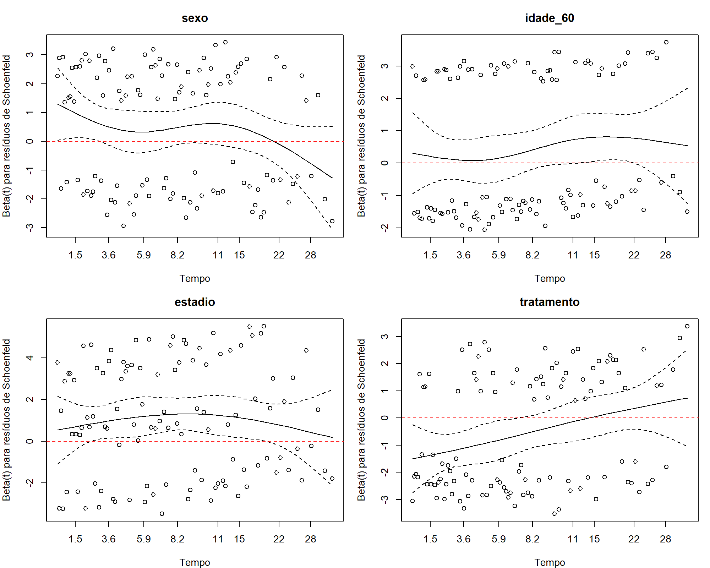
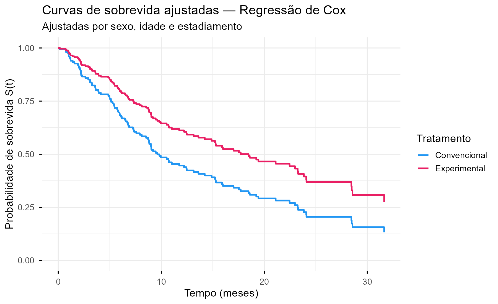
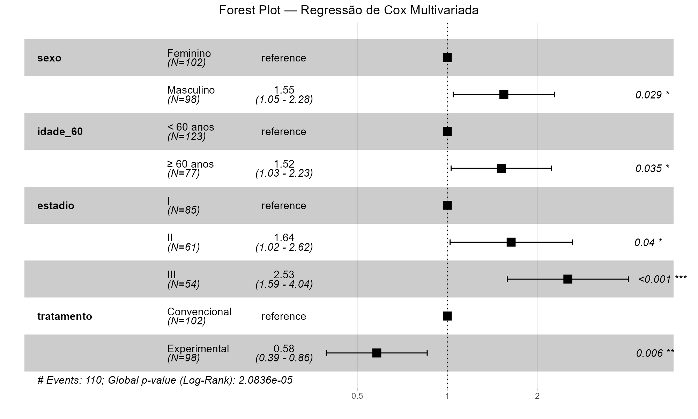

# [REGRESSÃO DE COX — INTRODUÇÃO]{.section-header}

## Modelo de riscos proporcionais de Cox {.smaller-text}

::: {.columns}
::: {.column width="50%"}

A **regressão de Cox** (1972) é o modelo mais utilizado em análise de sobrevida para avaliar o efeito de **múltiplas covariáveis** sobre o tempo até o evento.

### Por que Cox?

- O teste log-rank compara grupos, mas **não ajusta** por confundidores
- A regressão de Cox permite a análise **multivariada**
- É um modelo **semiparamétrico** — não exige especificar a distribuição de $S(t)$

### O modelo

$$h(t | X) = h_0(t) \cdot \exp(\beta_1 X_1 + \beta_2 X_2 + \ldots + \beta_p X_p)$$

:::
::: {.column width="50%"}

::: {.highlight-box}
**Componentes do modelo**

- $h(t | X)$ — risco no tempo $t$ dado as covariáveis
- $h_0(t)$ — risco basal (*baseline hazard*), não especificado
- $\beta_i$ — coeficientes das covariáveis
- $\exp(\beta_i)$ — **Hazard Ratio (HR)** — a medida de efeito!
:::

::: {.info-box}
**Pressuposto fundamental: riscos proporcionais**

A razão de riscos entre dois grupos é **constante** ao longo do tempo:

$$\frac{h(t | X=1)}{h(t | X=0)} = \exp(\beta) = \text{constante}$$
:::

:::
:::

::: aside
Cox, 1972
:::

---

## Interpretação do Hazard Ratio (HR) {.smaller-text}

::: {.columns}
::: {.column width="50%"}

### Regras de interpretação

::: {.highlight-box}
- **HR = 1** → risco **igual** entre os grupos
- **HR < 1** → risco **menor** no grupo exposto ("proteção")
- **HR > 1** → risco **maior** no grupo exposto ("risco")
:::

### Quantificação

- **HR < 1:** faça 1 − HR
  - Ex.: HR = 0,60 → 40% menor risco
- **HR entre 1 e 2:** percentual
  - Ex.: HR = 1,35 → 35% maior risco
- **HR ≥ 2:** múltiplos
  - Ex.: HR = 2,80 → 2,8× maior risco

:::
::: {.column width="50%"}

::: {.info-box}
**Atenção à nomenclatura!**

| Modelo | Exp(B) |
|--------|--------|
| Logística | OR (Odds Ratio) |
| Poisson | IRR (Incidence Rate Ratio) |
| Poisson Robusta | RP (Razão de Prevalência) |
| **Cox** | **HR (Hazard Ratio)** |

O HR expressa a **razão de riscos instantâneos** entre os grupos, não razão de chances ou de incidência.
:::

### Exemplo

**HR = 2,15** (IC 95%: 1,42–3,26; p < 0,001)

> "O risco de óbito foi **2,15 vezes maior** no grupo exposto (HR = 2,15; IC 95%: 1,42–3,26)."

:::
:::

---

# [REGRESSÃO DE COX — PRÁTICA]{.section-header}

## Análise univariada e multivariada {.smaller-text}

::: {.columns}
::: {.column width="50%"}

### Estratégia de análise

1. **Análise univariada** (bruta)
   - Testar cada covariável **individualmente**
   - Identificar candidatas com p < 0,20 (ou a priori)
2. **Análise multivariada** (ajustada)
   - Incluir covariáveis selecionadas
   - Modelo final: variáveis com p < 0,05

### No SPSS

`Analisar → Sobrevivência → Regressão de Cox`

- **Tempo:** variável de tempo
- **Status:** variável de evento (definir o valor do evento)
- **Covariáveis:** preditores

:::
::: {.column width="50%"}

### No R

```r
library(survival)

# Univariada
cox_uni <- coxph(Surv(tempo, status) ~ pred1,
                 data = dados)
summary(cox_uni)

# Multivariada
cox_multi <- coxph(
  Surv(tempo, status) ~ pred1 + pred2 + pred3,
  data = dados)
summary(cox_multi)

# HR e IC 95%
exp(coef(cox_multi))
exp(confint(cox_multi))
```

::: {.highlight-box}
**Saídas essenciais:**

- HR (Exp(B)), IC 95%, p-valor
- Teste de verossimilhança global
- Concordância (c-statistic)
:::

:::
:::

---

## Verificação dos pressupostos {.smaller-text}

::: {.columns}
::: {.column width="50%"}

### Riscos proporcionais

O pressuposto central é que o **HR é constante** ao longo do tempo.

**Como testar:**

1. **Resíduos de Schoenfeld**
   - Teste global e por variável
   - p > 0,05 → pressuposto atendido
2. **Gráfico log(-log)**
   - Curvas paralelas → riscos proporcionais

### No R

```r
# Teste de Schoenfeld
cox.zph(cox_multi)
plot(cox.zph(cox_multi))
```

:::
::: {.column width="50%"}

{width="100%" fig-align="center"}

:::
:::

---

## Diagnósticos adicionais {.smaller-text}

::: {.columns}
::: {.column width="50%"}

::: {.info-box}
**Se o pressuposto for violado:**

- Estratificar pelo fator que viola → `strata()`
- Incluir interação com o tempo
- Considerar modelos de riscos **não** proporcionais (modelos flexíveis)
:::

### Outros diagnósticos

| Diagnóstico | Finalidade |
|-------------|-----------|
| Resíduos de Martingale | Forma funcional das covariáveis |
| Resíduos de Deviance | Observações influentes |
| dfbeta | Influência de cada observação nos β |
| Concordância (c) | Capacidade preditiva (0,5–1,0) |

:::
:::

---

# [APRESENTAÇÃO GRÁFICA]{.section-header}

## Curvas ajustadas e Forest Plot {.smaller-text}

::: {.columns}
::: {.column width="50%"}

### Curvas de sobrevida ajustadas

{width="100%" fig-align="center"}

**No R:**

```r
library(survminer)
ggadjustedcurves(cox_multi,
                 variable = "grupo",
                 data = dados)
```

### Forest Plot

Representação visual dos **HR e IC 95%** de cada variável:

```r
ggforest(cox_multi, data = dados)
```

:::
::: {.column width="50%"}

{width="100%" fig-align="center"}

:::
:::

---

# [REGRESSÃO DE COX — DESCRIÇÃO]{.section-header}

## Como reportar {.smaller-text}

::: {.info-box}
**Modelo de descrição para artigos/relatórios**

> "Para identificar fatores associados ao tempo até [evento], utilizou-se o modelo de riscos proporcionais de Cox. Inicialmente, conduziu-se análise univariada para cada covariável. As variáveis com p < 0,20 na análise univariada foram incluídas no modelo multivariado. O pressuposto de riscos proporcionais foi verificado pelo teste de resíduos de Schoenfeld (p > 0,05 para todas as variáveis). Os resultados foram expressos por meio do Hazard Ratio (HR) com intervalos de confiança de 95%. O nível de significância adotado foi de 5%."
:::

### Estrutura do relatório

| Seção | O que incluir |
|-------|-------------|
| **Método** | Cox, estratégia de seleção, verificação de pressupostos, software |
| **Resultados** | Tabela com HR bruto e ajustado, IC 95%, p-valor |
| **Figuras** | Kaplan-Meier + Forest Plot |
| **Tabela** | Variável, HR bruto (IC; p), HR ajustado (IC; p) |
