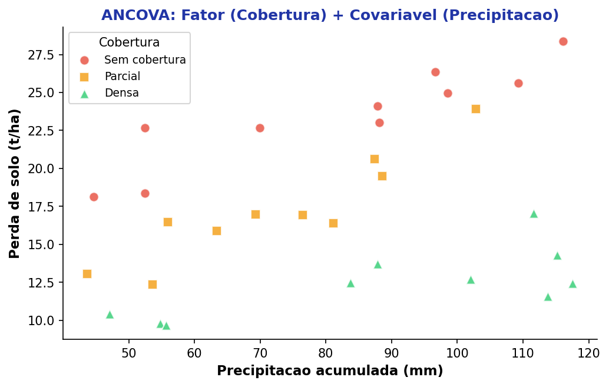
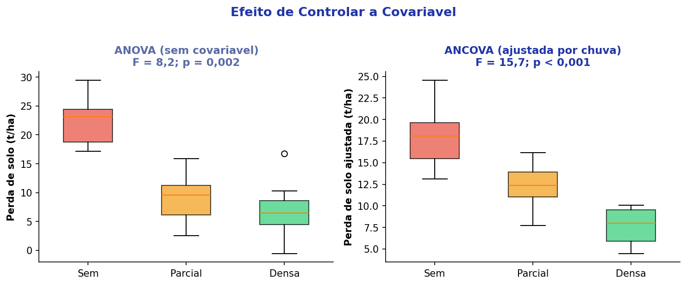
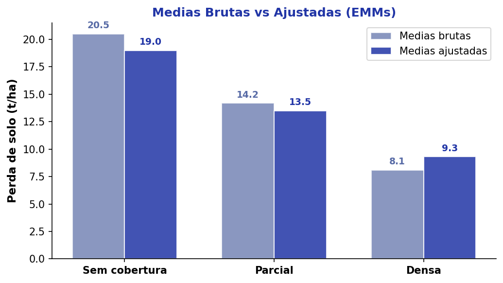
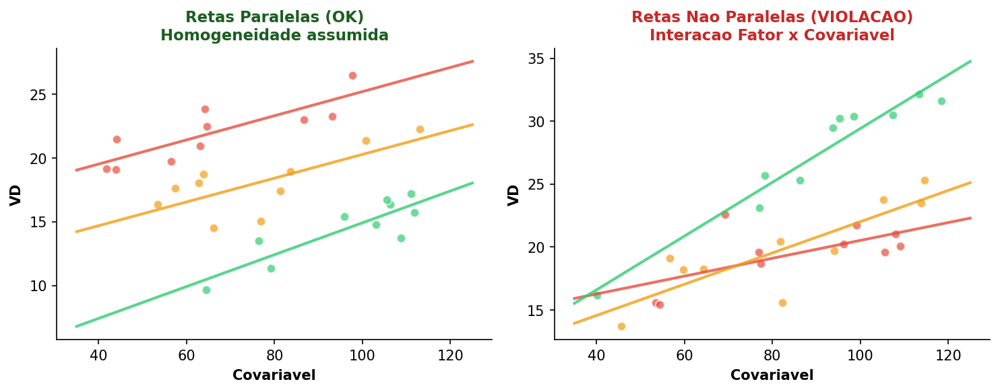
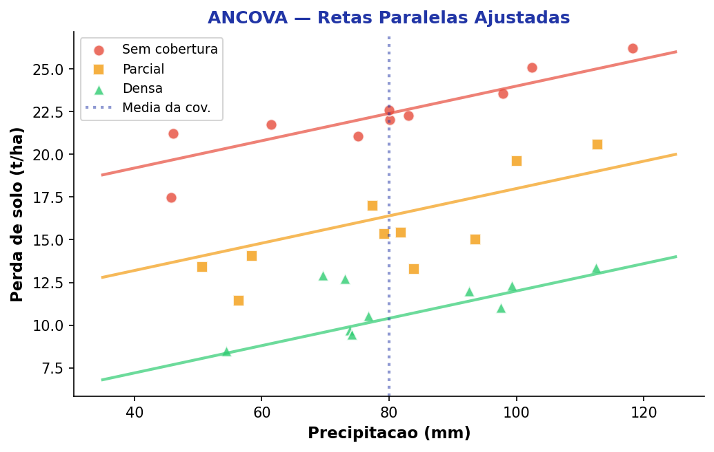

## Roteiro da Aula {.smaller-text}

::: {.columns}
:::: {.column width="60%"}

- [1]{.circle} O que é ANCOVA?
- [2]{.circle} Quando usar a ANCOVA?
- [3]{.circle} Lógica — Removendo o ruído da covariável
- [4]{.circle} Pressupostos específicos
- [5]{.circle} Exemplo 1 — Erosão e Cobertura Vegetal
- [6]{.circle} Exemplo 2 — Habilidades Matemáticas e IME
- [7]{.circle} Solicitando a ANCOVA
- [8]{.circle} Descrevendo os Resultados
- [9]{.circle} ANCOVA vs. ANOVA: quando preferir cada uma?

::::
:::: {.column width="40%"}

::: {.info-box}
**Objetivo:** Compreender a ANCOVA como extensão da ANOVA que **controla estatisticamente** o efeito de variáveis contínuas intervenientes (covariáveis), aumentando a precisão da comparação entre grupos. Aprender a solicitar e descrever os resultados.
:::

::::
:::


# [1 — O QUE É ANCOVA?]{.section-header}

## Análise de Covariância {.smaller-text}

::: {.columns}
:::: {.column width="55%"}

::: {.info-box}
**Definição**

A **ANCOVA** (*Analysis of Covariance*) combina ANOVA e regressão linear. Ela compara médias de grupos enquanto **controla** o efeito de uma ou mais variáveis contínuas — as **covariáveis**.
:::

::: {.box}
**Estrutura mínima — pelo menos três variáveis**

| Componente | Tipo | Exemplo |
|------------|------|---------|
| VI (Fator/Grupo) | Categórica | Tipo de manejo (3 níveis) |
| VD (Desfecho) | Contínua | Perda de solo (t/ha) |
| **Covariável** | **Contínua** | Precipitação (mm) |
:::

::::
:::: {.column width="45%"}

{width="100%"}

::::
:::

::: {.highlight-box}
A covariável na ANCOVA é **sempre contínua** (ou, em algumas extensões, ordinal). Se a variável de controle for categórica, ela deve ser incluída como **segundo fator** (ANOVA Fatorial), não como covariável.
:::


## Erosão > Precipitação — Mas o que mais influencia? {.smaller-text}

::: {.columns}
:::: {.column width="50%"}

::: {.info-box}
Quando analisamos a erosão do solo, a precipitação é a variável mais óbvia. Mas **quais outras variáveis influenciam o processo?**
:::

- Níveis de cobertura natural
- Características do solo (textura, estrutura, porosidade)
- Topografia (declividade, comprimento de encosta)
- Uso e manejo do solo

::: {.highlight-box}
Na ANCOVA, você busca **controlar estatisticamente** o efeito dessas variáveis intervenientes na relação entre a VI e a VD.
:::

::::
:::: {.column width="50%"}

::: {.box}
**Exemplo ambiental**

Queremos comparar 3 tipos de cobertura vegetal → Erosão

Mas a precipitação variou entre parcelas. Sem controle, o efeito das coberturas se confunde com o da chuva.

**Covariável:** Precipitação (mm)

A ANCOVA remove o efeito da chuva antes de comparar os grupos.
:::

::::
:::


## Outro exemplo — Habilidades Matemáticas {.smaller-text}

::: {.columns}
:::: {.column width="50%"}

::: {.info-box}
**Fora das ciências ambientais:** a lógica ANCOVA se aplica a qualquer área.
:::

::: {.box}
**Delineamento**

| Componente | Variável |
|------------|----------|
| **VI (Grupo)** | Habilidades Matemáticas (alta / baixa) |
| **VD (Desfecho)** | Aprovação no IME (passou / não passou) |
| **Covariável** | Compreensão de Texto (escore) |

A covariável "compreensão de texto" influencia o desempenho, mas **não é o foco**. A ANCOVA isola o efeito puro das habilidades matemáticas.
:::

::::
:::: {.column width="50%"}

::: {.highlight-box}
**Cuidado:** neste exemplo a VD é binária (passou/não), o que exigiria extensões (regressão logística com covariável). Para ANCOVA clássica, a VD deve ser **contínua** (ex.: nota final).
:::

::: {.box}
**Versão corrigida para ANCOVA clássica:**

| Componente | Variável |
|------------|----------|
| **VI** | Método de ensino (3 turmas) |
| **VD** | Nota na prova de Matemática |
| **Covariável** | Escore de Compreensão de Texto |
:::

::::
:::


## Por que controlar covariáveis? {.smaller-text}

::: {.columns}
:::: {.column width="50%"}

Imagine que você quer comparar a erosão entre 3 tipos de cobertura vegetal, **mas** a precipitação variou entre as parcelas:

::: {.highlight-box}
**Sem ANCOVA:** a diferença entre os grupos pode ser devida à cobertura *ou* à precipitação — impossível separar.

**Com ANCOVA:** o efeito da precipitação é **removido estatisticamente**, e a comparação entre coberturas é feita como se todas as parcelas tivessem recebido a mesma chuva.
:::

::::
:::: {.column width="50%"}

{width="100%"}

::: {.info-box}
A ANCOVA **reduz a variância do erro** (SQ_Erro), aumentando o poder do teste F — ou seja, mais chance de detectar diferenças reais entre os grupos.
:::

::::
:::


# [2 — QUANDO USAR A ANCOVA?]{.section-header}

## Situações ideais para ANCOVA {.smaller-text}

::: {.columns}
:::: {.column width="50%"}

::: {.box}
**Use ANCOVA quando:**

- Há uma variável contínua que **influencia** a VD mas **não é o foco** da pesquisa
- Os grupos diferem em uma variável de confusão que não pôde ser controlada experimentalmente
- Deseja-se **aumentar o poder** reduzindo a variância residual
:::

::::
:::: {.column width="50%"}

::: {.box}
**Exemplos em Ciências Ambientais**

| VI (Fator) | VD | Covariável |
|------------|-----|------------|
| Tipo de manejo | Perda de solo | Precipitação |
| Espécie de gramínea | Biomassa | Declividade |
| Técnica de revegetação | Cobertura (%) | Umidade inicial do solo |
| Tipo de geotêxtil | Retenção de sedimento | Vazão de escoamento |
:::

::::
:::

::: {.highlight-box}
A ANCOVA é especialmente útil em **estudos de campo** (ciências ambientais, agronomia), onde variáveis como precipitação, declividade e tipo de solo variam entre parcelas e não podem ser completamente igualadas pelo delineamento.
:::


# [3 — A LÓGICA DA ANCOVA]{.section-header}

## Removendo o ruído da covariável {.smaller-text}

::: {.columns}
:::: {.column width="50%"}

```{mermaid}
%%| fig-width: 5.5
flowchart TD
    A["Variância Total\n(SQ Total)"]:::root --> B["Variância Explicada\npela Covariável"]:::node
    A --> C["Variância Restante"]:::node
    C --> D["Efeito do Fator\n(SQ Ajustada)"]:::result
    C --> E["Erro Residual\n(SQ Erro)"]:::leaf

    classDef root fill:#2135A6,color:#fff,font-weight:bold,stroke:#27368C
    classDef node fill:#C5CEE8,color:#0D0D0D,stroke:#586BA6
    classDef leaf fill:#586BA6,color:#fff,stroke:#27368C
    classDef result fill:#27368C,color:#fff,font-weight:bold,stroke:#2135A6
```

::::
:::: {.column width="50%"}

::: {.info-box}
**Passo a passo conceitual:**

1. A covariável "absorve" parte da variância total
2. A variância restante é então decomposta em efeito do fator e erro
3. O SQ_Erro é **menor** que na ANOVA convencional → F maior → mais poder
:::

::: {.box}
**Tabela ANCOVA**

| Fonte | SQ | gl | QM | F |
|-------|----|----|-----|---|
| Covariável | SQ_Cov | 1 | QM_Cov | QM_Cov / QM_E |
| Fator | SQ_Fator(adj) | k − 1 | QM_F | QM_F / QM_E |
| Erro | SQ_E | N − k − 1 | QM_E | — |
:::

::::
:::


## Médias Ajustadas {.smaller-text}

::: {.columns}
:::: {.column width="50%"}

{width="100%"}

::::
:::: {.column width="50%"}

::: {.highlight-box}
**Médias marginais estimadas** (EMMs)

A ANCOVA produz **médias ajustadas** — o valor esperado da VD para cada grupo quando a covariável é fixada em sua **média geral**.

São essas médias ajustadas que devem ser comparadas nos testes post-hoc, não as médias brutas.
:::

::: {.info-box}
As médias ajustadas podem ser **muito diferentes** das médias brutas, especialmente quando os grupos diferem na covariável. Essa diferença é a "correção" da ANCOVA.
:::

::::
:::


# [4 — PRESSUPOSTOS]{.section-header}

## Pressupostos Específicos da ANCOVA {.smaller-text}

::: {.columns}
:::: {.column width="50%"}

Além dos pressupostos da ANOVA (normalidade, homocedasticidade, independência):

::: {.box}
| Pressuposto | Teste | O que verificar |
|-------------|-------|-----------------|
| **Linearidade** | Dispersão VD × Cov | Relação linear em cada grupo |
| **Homogeneidade de inclinações** | Interação Fator × Cov | As retas devem ser **paralelas** |
| **Covariável independente do fator** | ANOVA da covariável | Covariável não deve diferir entre grupos |
:::

::::
:::: {.column width="50%"}

{width="100%"}

::: {.highlight-box}
O pressuposto mais crítico é a **homogeneidade das inclinações de regressão** — se as retas não forem paralelas (interação significativa), a ANCOVA não é válida.
:::

::::
:::


# [5 — EXEMPLO 1: EROSÃO E COBERTURA]{.section-header}

## Erosão e Cobertura Vegetal com Covariável {.smaller-text}

::: {.columns}
:::: {.column width="55%"}

::: {.info-box}
**Delineamento**

- **Fator:** Tipo de cobertura (Sem, Parcial, Densa)
- **VD:** Perda de solo (t/ha)
- **Covariável:** Precipitação acumulada (mm)
- **n = 10** por grupo → N = 30
:::

::: {.box}
**Resultados**

| Fonte | F | p-valor |
|-------|---|---------|
| Precipitação (Cov) | 28,4 | < 0,001 |
| Cobertura (adj) | 15,7 | < 0,001 |
| Erro | — | — |

Sem a covariável (ANOVA simples): F = 8,2; p = 0,002

Com a covariável (ANCOVA): **F = 15,7; p < 0,001** → poder aumentou!
:::

::::
:::: {.column width="45%"}

{width="100%"}

::::
:::


# [6 — EXEMPLO 2: HABILIDADES E IME]{.section-header}

## Método de Ensino e Desempenho Matemático {.smaller-text}

::: {.columns}
:::: {.column width="50%"}

::: {.info-box}
**Delineamento**

- **Fator:** Método de ensino (Tradicional, Ativo, Híbrido)
- **VD:** Nota final em Matemática (0–100)
- **Covariável:** Compreensão de Texto (escore padronizado)
- **n = 15** por grupo → N = 45
:::

::: {.box}
**Resultados**

| Fonte | F | p-valor | $\eta^2_p$ |
|-------|---|---------|-----------|
| Compreensão (Cov) | 18,9 | < 0,001 | 0,31 |
| Método (adj) | 7,3 | 0,002 | 0,26 |
| Erro | — | — | — |

Sem covariável: F = 3,1; p = 0,055 (n.s.)

Com covariável: **F = 7,3; p = 0,002** — a diferença era **mascarada** pela variação em compreensão!
:::

::::
:::: {.column width="50%"}

::: {.highlight-box}
**Por que a ANCOVA revelou o efeito?**

A compreensão de texto variava entre turmas. O grupo "Tradicional" tinha alunos com melhor leitura, inflando suas notas. Ao controlar pela covariável, o efeito real do método apareceu.
:::

::: {.box}
**Médias ajustadas (EMMs)**

| Método | Média bruta | Média ajustada |
|--------|------------|----------------|
| Tradicional | 72,4 | 68,1 |
| Ativo | 67,3 | 70,5 |
| Híbrido | 70,1 | 71,2 |

Post-hoc (Bonferroni): Tradicional < Ativo (p = 0,04); Tradicional < Híbrido (p = 0,02)
:::

::::
:::


# [7 — SOLICITANDO A ANCOVA]{.section-header}

## Como Solicitar a Análise {.smaller-text}

::: {.columns}
:::: {.column width="50%"}

::: {.box}
**No JASP (passo a passo)**

[1]{.circle} Abrir os dados → **ANOVA** → **ANCOVA**

[2]{.circle} Mover a VD para "Dependent Variable"

[3]{.circle} Mover o Fator para "Fixed Factors"

[4]{.circle} Mover a covariável para **"Covariates"**

[5]{.circle} Em "Display": marcar "Descriptive statistics"

[6]{.circle} Em "Assumption Checks": marcar "Homogeneity tests" e "Q-Q plot of residuals"
:::

::::
:::: {.column width="50%"}

::: {.box}
**Verificações obrigatórias**

[1]{.circle} **Testar homogeneidade de inclinações:** Incluir o termo de interação Fator × Covariável. Se p > 0,05 → as retas são paralelas → prosseguir.

[2]{.circle} **Remover a interação** e rodar o modelo final (ANCOVA pura).

[3]{.circle} Solicitar **Estimated Marginal Means** (médias ajustadas) para o fator.

[4]{.circle} Solicitar **Post-hoc** (Bonferroni ou Sidak) sobre as médias ajustadas.
:::

::: {.highlight-box}
**Atenção:** nunca use as médias brutas para comparar os grupos na ANCOVA — use sempre as **médias marginais estimadas (EMMs)**.
:::

::::
:::


## No R — Código Básico {.smaller-text}

::: {.columns}
:::: {.column width="50%"}

::: {.box}
**1 — Testar homogeneidade de inclinações**
```r
# Modelo com interação
mod_inter <- aov(erosao ~ cobertura * precipitacao,
                 data = dados)
summary(mod_inter)
# Se cobertura:precipitacao for n.s. → OK
```
:::

::: {.box}
**2 — ANCOVA (modelo final)**
```r
mod_ancova <- aov(erosao ~ precipitacao + cobertura,
                  data = dados)
summary(mod_ancova)
```
:::

::::
:::: {.column width="50%"}

::: {.box}
**3 — Médias ajustadas e post-hoc**
```r
library(emmeans)

# Médias marginais estimadas
emm <- emmeans(mod_ancova, ~ cobertura)
emm

# Comparações pareadas
pairs(emm, adjust = "bonferroni")
```
:::

::: {.info-box}
O pacote `emmeans` calcula automaticamente as EMMs fixando a covariável na média geral. É o padrão para ANCOVA em R.
:::

::::
:::


# [8 — DESCREVENDO OS RESULTADOS]{.section-header}

## Como Reportar a ANCOVA {.smaller-text}

::: {.columns}
:::: {.column width="50%"}

::: {.info-box}
**Modelo de redação (APA)**

"Uma ANCOVA foi conduzida para comparar a perda de solo entre três tipos de cobertura vegetal (sem, parcial e densa), controlando o efeito da precipitação acumulada. O pressuposto de homogeneidade das inclinações de regressão foi atendido, F(2, 24) = 0,87, p = 0,432. Após o ajuste pela covariável, houve efeito significativo do tipo de cobertura, F(2, 26) = 15,7, p < 0,001, $\eta^2_p$ = 0,55. Comparações post-hoc (Bonferroni) indicaram que a perda de solo foi significativamente menor na cobertura densa (M_adj = 9,3 t/ha) em relação à parcial (M_adj = 13,5 t/ha, p = 0,008) e à ausência de cobertura (M_adj = 19,0 t/ha, p < 0,001)."
:::

::::
:::: {.column width="50%"}

::: {.box}
**Checklist de reporte**

- [ ] Informar que foi ANCOVA (não apenas "ANOVA")
- [ ] Relatar a verificação de homogeneidade de inclinações
- [ ] Relatar F, gl, p e tamanho de efeito ($\eta^2_p$) para o fator
- [ ] Relatar F e p para a covariável
- [ ] Usar **médias ajustadas** (EMMs), não brutas
- [ ] Reportar post-hoc sobre as EMMs
:::

::: {.highlight-box}
**Erro comum:** reportar médias brutas em vez das ajustadas. Na ANCOVA, as médias brutas podem ser enganosas — a "correção" pela covariável pode alterar consideravelmente a ordem ou a distância entre os grupos.
:::

::::
:::


# [9 — ANCOVA vs. ANOVA]{.section-header}

## Quando escolher cada técnica? {.smaller-text}

::: {.columns}
:::: {.column width="50%"}

::: {.box}
**Use ANOVA quando:**

- O delineamento controlou bem as variáveis de confusão
- Não há covariáveis contínuas relevantes
- Os grupos são balanceados e homogêneos
:::

::::
:::: {.column width="50%"}

::: {.highlight-box}
**Use ANCOVA quando:**

- Há variáveis contínuas que influenciam a VD
- Estudos de campo com variação ambiental
- Deseja aumentar o poder sem aumentar N
- Grupos diferem em uma variável de confusão
:::

::::
:::


## Resumo — Fluxo de Decisão {.smaller-text}

```{mermaid}
%%| fig-width: 10
flowchart LR
    A["Comparar médias\nentre grupos"]:::root --> B{"Há covariável\ncontínua?"}:::node
    B --> |"Não"| C["ANOVA"]:::leaf
    B --> |Sim| D{"Retas paralelas?\n(homogeneidade\nde inclinações)"}:::node
    D --> |Sim| E["ANCOVA"]:::result
    D --> |"Não"| F["Regressão com\ninteração\n(Johnson-Neyman)"]:::leaf
    E --> G["Comparar médias\najustadas\n(EMMs + post-hoc)"]:::result

    classDef root fill:#2135A6,color:#fff,font-weight:bold,stroke:#27368C
    classDef node fill:#C5CEE8,color:#0D0D0D,stroke:#586BA6
    classDef leaf fill:#586BA6,color:#fff,stroke:#27368C
    classDef result fill:#27368C,color:#fff,font-weight:bold,stroke:#2135A6
```


## {.center background-color="#2135A6"}

::: {style="text-align: center;"}
[Obrigado!]{.obrigado-fit-text style="color: white;"}

::: {style="color: white; font-size: 0.7em;"}
Luiz Diego Vidal Santos

Universidade Estadual de Feira de Santana (UEFS)
:::
:::
