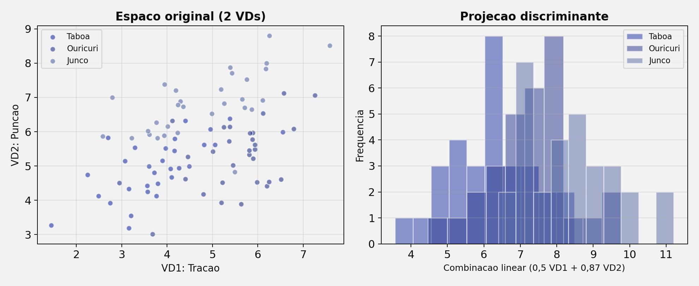
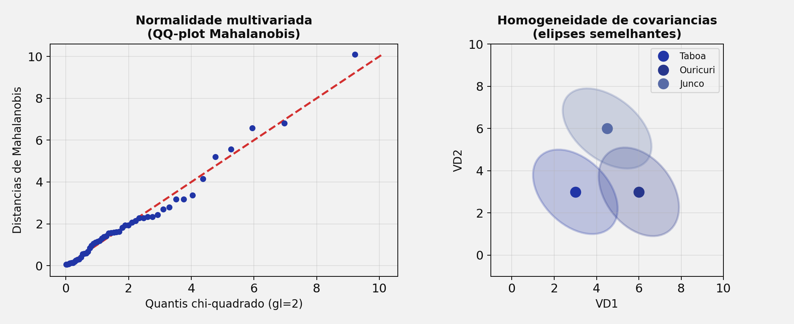
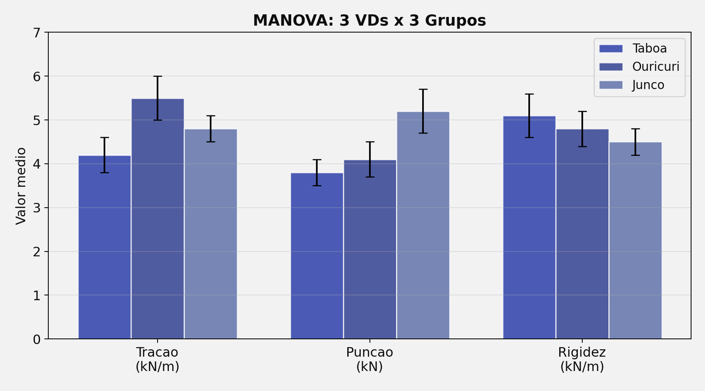

## Roteiro da Aula {.smaller-text}

::: {.columns}
:::: {.column width="60%"}

- [1]{.circle} Mapa da família ANOVA
- [2]{.circle} Da ANOVA à MANOVA
- [3]{.circle} Combinação linear das VDs
- [4]{.circle} Pressupostos da MANOVA
- [5]{.circle} Estatísticas de teste (Pillai, Wilks, Hotelling, Roy)
- [6]{.circle} Exemplo prático — Geotêxteis
- [7]{.circle} MANOVA de Medidas Repetidas
- [8]{.circle} Dados faltantes — revisão

::::
:::: {.column width="40%"}

::: {.info-box}
**Objetivo:** Apresentar a **MANOVA** como extensão multivariada da ANOVA e situar cada variante dentro da família de testes de comparação de médias.
:::

::::
:::


# [1 — MAPA DA FAMÍLIA ANOVA]{.section-header}

## Das comparações simples às multivariadas {.smaller-text}

```{mermaid}
%%| fig-width: 10
flowchart TD
    A["Comparar médias\nentre grupos"]:::root --> B{"Quantas VDs?"}:::node
    B --> |"1 VD"| C{"Quantos grupos/\nfatores?"}:::node
    B --> |"≥ 2 VDs"| M["MANOVA"]:::result

    C --> |"2 grupos"| D["Teste t"]:::leaf
    C --> |"≥ 3 grupos\n1 fator"| E["ANOVA\nUma Via"]:::leaf
    C --> |"≥ 2 fatores"| F["ANOVA\nFatorial"]:::leaf

    E --> G{"Medidas repetidas?"}:::node
    G --> |"Sim"| H["ANOVA-MR"]:::result
    G --> |"Não"| I["ANOVA\nentre-sujeitos"]:::leaf

    F --> J{"Covariável?"}:::node
    J --> |"Sim"| K["ANCOVA"]:::result
    J --> |"Não"| L["ANOVA\nFatorial pura"]:::leaf

    classDef root fill:#2135A6,color:#fff,font-weight:bold,stroke:#27368C
    classDef node fill:#C5CEE8,color:#0D0D0D,stroke:#586BA6
    classDef leaf fill:#586BA6,color:#fff,stroke:#27368C
    classDef result fill:#27368C,color:#fff,font-weight:bold,stroke:#2135A6
```


## Resumo das variantes {.smaller-text}

::: {.info-box}
| Teste | VI (Fator) | VD | Covariável | Medidas Repetidas |
|-------|:---:|:---:|:---:|:---:|
| **Teste t** | 1 (2 grupos) | 1 | — | — |
| **ANOVA Uma Via** | 1 (≥ 3 grupos) | 1 | — | — |
| **ANOVA Fatorial** | ≥ 2 | 1 | — | — |
| **ANCOVA** | ≥ 1 | 1 | ≥ 1 | — |
| **ANOVA-MR** | 1 (intra) | 1 | — | Sim |
| **MANOVA** | ≥ 1 | **≥ 2** | — | — |
| **MANOVA-MR** | ≥ 1 (entre + intra) | **≥ 2** | — | Sim |
:::

::: {.highlight-box}
A **MANOVA** é a generalização natural quando estudamos o efeito de um tratamento sobre **múltiplas variáveis dependentes** simultaneamente — ex.: resistência à tração, à punção e rigidez secante de um geotêxtil.
:::


# [2 — DA ANOVA À MANOVA]{.section-header}

## Por que não fazer várias ANOVAs? {.smaller-text}

::: {.columns}
:::: {.column width="50%"}

::: {.box}
**Abordagem ingênua**

Fazer uma ANOVA separada para cada VD:

- ANOVA₁: Resistência à tração
- ANOVA₂: Resistência à punção
- ANOVA₃: Rigidez secante

Cada teste com α = 0,05.
:::

::: {.highlight-box}
**Problema: inflação do Erro Tipo I**

Com 3 testes independentes:

$\alpha_{global} = 1 - (1 - 0{,}05)^3 = 0{,}143$

Probabilidade de 14,3% de um falso positivo!
:::

::::
:::: {.column width="50%"}

::: {.info-box}
**MANOVA: solução elegante**

- Testa **todas as VDs simultaneamente** em um único teste
- Mantém α = 0,05 para a família inteira
- Considera a **covariância** entre as VDs
- Pode detectar efeitos que nenhuma ANOVA isolada encontra
:::

{width="100%"}

::::
:::


## A analogia ANOVA → MANOVA {.smaller-text}

::: {.columns}
:::: {.column width="50%"}

::: {.box}
**ANOVA (univariada)**

- Compara médias de **1 variável** entre grupos
- Utiliza a razão entre variância **entre** grupos e variância **dentro** dos grupos
- Estatística: **F**
- Análoga ao teste t para ≥ 3 grupos
:::

::::
:::: {.column width="50%"}

::: {.box}
**MANOVA (multivariada)**

- Compara **vetores de médias** (centroides) entre grupos
- Utiliza a razão entre matrizes de **covariância** entre e dentro dos grupos
- Estatísticas: **Pillai, Wilks, Hotelling, Roy**
- Análoga à ANOVA, mas para ≥ 2 VDs
:::

::::
:::

::: {.highlight-box}
ANOVA: $F = \frac{S^2_{entre}}{S^2_{dentro}}$ (escalares) → MANOVA: $\Lambda = \frac{|\mathbf{W}|}{|\mathbf{B} + \mathbf{W}|}$ (determinantes de matrizes)
:::


# [3 — COMBINAÇÃO LINEAR DAS VDs]{.section-header}

## O poder da combinação linear {.smaller-text}

::: {.columns}
:::: {.column width="55%"}

::: {.info-box}
**Exemplo com geotêxteis**

| Grupo | Resist. Tração | Resist. Punção | Rigidez |
|-------|:---:|:---:|:---:|
| Taboa | Média₁ | Média₂ | Média₃ |
| Ouricuri | Média₄ | Média₅ | Média₆ |
| Junco | Média₇ | Média₈ | Média₉ |

Isoladamente, nenhuma variável pode distinguir os grupos. Mas a **combinação linear** das três pode revelar diferenças significativas.
:::

::::
:::: {.column width="45%"}

{width="100%"}

::: {.highlight-box}
A MANOVA encontra a combinação linear das VDs que **maximiza** a separação entre os grupos — similar ao que a Análise Discriminante faz.
:::

::::
:::


## Centróides multivariados {.smaller-text}

::: {.columns}
:::: {.column width="50%"}

Na ANOVA, cada grupo tem uma **média**.

Na MANOVA, cada grupo tem um **centróide** — o vetor de médias de todas as VDs.

::: {.box}
**Centróide do Grupo "Taboa"**

$$\vec{\mu}_{Taboa} = \begin{pmatrix} \bar{x}_{tração} \\ \bar{x}_{punção} \\ \bar{x}_{rigidez} \end{pmatrix}$$
:::

::::
:::: {.column width="50%"}

::: {.info-box}
**H₀ da MANOVA**

$$H_0: \vec{\mu}_1 = \vec{\mu}_2 = \vec{\mu}_3$$

Os centróides de todos os grupos são iguais — ou seja, os tratamentos não afetam **nenhuma** combinação linear das VDs.
:::

::: {.highlight-box}
Se a MANOVA rejeita H₀, pelo menos um centróide difere → análises post-hoc (ANOVAs ou discriminante) identificam quais VDs e quais grupos diferem.
:::

::::
:::


# [4 — PRESSUPOSTOS DA MANOVA]{.section-header}

## Pressupostos {.smaller-text}

::: {.columns}
:::: {.column width="50%"}

::: {.box}
**Pressupostos herdados da ANOVA**

- Independência das observações
- Escala intervalar/razão para as VDs
- Tamanho amostral adequado (n > p em cada grupo)
:::

::: {.highlight-box}
**Novos pressupostos**

- **Normalidade multivariada** — teste de Mardia, Henze-Zirkler ou Shapiro-Wilk multivariado
- **Homogeneidade de matrizes de covariância** — teste M de Box
- **Ausência de multicolinearidade excessiva** — correlações entre VDs moderadas (|r| < 0,90)
:::

::::
:::: {.column width="50%"}

{width="100%"}

::: {.info-box}
O teste M de Box avalia se as matrizes de covariância dos grupos são equivalentes. Se **p < 0,001** (critério conservador), os pressupostos não são atendidos — prefira o **Traço de Pillai**, que é mais robusto.
:::

::::
:::


# [5 — ESTATÍSTICAS DE TESTE]{.section-header}

## Quatro formas de testar a MANOVA {.smaller-text}

::: {.columns}
:::: {.column width="50%"}

::: {.box}
**Traço de Pillai (Pillai's Trace)**

- Mais **robusto** a violações de pressupostos
- Recomendado como padrão
- Varia de 0 a s (nº de raízes)
- Olson (1974): mais robusto com amostras desiguais e pressupostos violados
:::

::: {.box}
**Lambda de Wilks (Wilk's Lambda)**

- Mais utilizado na literatura
- Varia de 0 a 1
- Valores pequenos → rejeição de H₀
- Interpretação direta: proporção de variância **não** explicada pelo fator
:::

::::
:::: {.column width="50%"}

::: {.box}
**T² de Hotelling (Hotelling's Trace)**

- Extensão direta do T² de Hotelling para 2 grupos
- Adequado quando há apenas 2 grupos
- Mais poderoso que Pillai com pressupostos atendidos
:::

::: {.box}
**Maior Raiz de Roy (Roy's Largest Root)**

- Considera apenas a **maior** raiz característica
- Mais poderoso quando as diferenças entre grupos estão concentradas em uma dimensão
- Mais sensível a violações — usar com cautela
:::

::::
:::


## Qual estatística escolher? {.smaller-text}

```{mermaid}
%%| fig-width: 10
flowchart LR
    A["MANOVA\nsignificativa?"]:::root --> B{"Pressupostos\natendidos?"}:::node
    B --> |"Sim"| C{"Quantos\ngrupos?"}:::node
    B --> |"Não"| D["Traço de\nPillai"]:::result

    C --> |"2 grupos"| E["T² de\nHotelling"]:::result
    C --> |"≥ 3 grupos"| F{"Diferenças em\n1 dimensão?"}:::node

    F --> |"Sim"| G["Maior Raiz\nde Roy"]:::leaf
    F --> |"Não/incerto"| H["Lambda de\nWilks"]:::result

    classDef root fill:#2135A6,color:#fff,font-weight:bold,stroke:#27368C
    classDef node fill:#C5CEE8,color:#0D0D0D,stroke:#586BA6
    classDef leaf fill:#586BA6,color:#fff,stroke:#27368C
    classDef result fill:#27368C,color:#fff,font-weight:bold,stroke:#2135A6
```

::: {.info-box}
**Recomendação prática (Olson, 1974; Tabachnick & Fidell, 2019):** Use o **Traço de Pillai** quando não tiver certeza sobre os pressupostos. Relate Lambda de Wilks como estatística complementar, pois é a mais citada na literatura.
:::


# [6 — EXEMPLO PRÁTICO]{.section-header}

## Geotêxteis: Taboa × Ouricuri × Junco {.smaller-text}

::: {.columns}
:::: {.column width="55%"}

::: {.info-box}
**Delineamento**

| Elemento | Descrição |
|----------|-----------|
| **Fator (VI)** | Tipo de fibra (Taboa, Ouricuri, Junco) |
| **VD₁** | Resistência à tração (kN/m) |
| **VD₂** | Resistência à punção (kN) |
| **VD₃** | Rigidez secante (kN/m) |
| **Teste** | MANOVA one-way |
:::

::::
:::: {.column width="45%"}

{width="100%"}

::::
:::

::: {.highlight-box}
Isoladamente, cada VD pode não diferenciar os grupos (p > 0,05 nas ANOVAs individuais). A MANOVA pode revelar diferenças significativas na **combinação linear** das três propriedades mecânicas.
:::


## Interpretação dos resultados {.smaller-text}

::: {.columns}
:::: {.column width="50%"}

::: {.box}
**Passo 1 — MANOVA global**

| Estatística | Valor | F | p |
|-------------|:---:|:---:|:---:|
| Traço de Pillai | 0,82 | 4,31 | 0,002 |
| Lambda de Wilks | 0,28 | 5,12 | < 0,001 |

Resultado: H₀ rejeitada → os centróides diferem.
:::

::::
:::: {.column width="50%"}

::: {.box}
**Passo 2 — ANOVAs de acompanhamento**

| VD | F | p | η² |
|----|:---:|:---:|:---:|
| Tração | 3,21 | 0,062 | 0,18 |
| Punção | 2,15 | 0,143 | 0,13 |
| Rigidez | 1,87 | 0,180 | 0,11 |

Nenhuma ANOVA individual significativa! A diferença está na **combinação** das VDs.
:::

::::
:::

::: {.info-box}
Este cenário ilustra o poder da MANOVA: mesmo quando ADNOVAs individuais não detectam diferenças, a análise multivariada pode encontrá-las ao considerar a **estrutura de covariância** entre as VDs.
:::


# [7 — MANOVA-MR]{.section-header}

## MANOVA de Medidas Repetidas {.smaller-text}

::: {.columns}
:::: {.column width="50%"}

::: {.box}
**Quando usar a MANOVA-MR?**

Quando temos:

- ≥ 2 variáveis dependentes
- Medidas repetidas ao longo do tempo ou condições
- Fatores entre-sujeitos (opcional)

Ex.: Resistência à tração **e** punção de geotêxteis medidas em 60, 120 e 180 dias, comparando Taboa vs. Ouricuri.
:::

::::
:::: {.column width="50%"}

::: {.highlight-box}
**Vantagem sobre ANOVAs-MR separadas**

- Controla o erro Tipo I ao analisar todas as VDs simultaneamente
- Não requer o pressuposto de **esfericidade** (a MANOVA-MR é naturalmente multivariada)
- Mais poder quando as VDs são correlacionadas
:::

::: {.info-box}
A MANOVA-MR é a análise mais completa da família ANOVA — combina fatores entre e intra-sujeitos com múltiplas VDs.
:::

::::
:::


# [8 — DADOS FALTANTES]{.section-header}

## Missing Data na MANOVA {.smaller-text}

::: {.columns}
:::: {.column width="50%"}

Dados faltantes são especialmente problemáticos na MANOVA porque cada sujeito precisa ter **todas as VDs** para ser incluído na análise.

::: {.box}
**Tipos de Missing**

| Tipo | Sigla | Mecanismo |
|------|:---:|-----------|
| Completamente ao acaso | MCAR | Sem relação com variáveis |
| Ao acaso | MAR | Relacionado a variáveis observadas |
| Não ao acaso | MNAR | Relacionado ao próprio valor faltante |
:::

::::
:::: {.column width="50%"}

::: {.highlight-box}
**Métodos recomendados**

| Método | Quando usar |
|--------|-------------|
| Exclusão listwise | Poucos missing (< 5%) |
| EM (Expected Maximization) | Missing moderado, padrão MAR |
| Imputação Múltipla | Abordagem mais robusta |
:::

::: {.info-box}
Na pesquisa com geotêxteis, dados faltantes são comuns quando corpos de prova **rompem antes do prazo**. Este é um padrão MNAR — o fato de faltar está relacionado à própria resistência.
:::

::::
:::


## Resumo Geral — Escolhendo a ANOVA certa {.smaller-text}

```{mermaid}
%%| fig-width: 10
flowchart LR
    A["Quantas VDs?"]:::root --> |"1 VD"| B{"Fatores?"}:::node
    A --> |"≥ 2 VDs"| C["MANOVA\n(ou MANOVA-MR)"]:::result

    B --> |"1 fator, 2 grupos"| D["Teste t"]:::leaf
    B --> |"1 fator, ≥ 3 grupos"| E{"Medidas\nrepetidas?"}:::node
    B --> |"≥ 2 fatores"| F{"Covariável?"}:::node

    E --> |"Sim"| G["ANOVA-MR"]:::result
    E --> |"Não"| H["ANOVA\nUma Via"]:::leaf

    F --> |"Sim"| I["ANCOVA"]:::result
    F --> |"Não"| J["ANOVA\nFatorial"]:::leaf

    classDef root fill:#2135A6,color:#fff,font-weight:bold,stroke:#27368C
    classDef node fill:#C5CEE8,color:#0D0D0D,stroke:#586BA6
    classDef leaf fill:#586BA6,color:#fff,stroke:#27368C
    classDef result fill:#27368C,color:#fff,font-weight:bold,stroke:#2135A6
```


## {.center background-color="#2135A6"}

::: {style="text-align: center;"}
[Obrigado!]{.obrigado-fit-text style="color: white;"}

::: {style="color: white; font-size: 0.7em;"}
Luiz Diego Vidal Santos

Universidade Estadual de Feira de Santana (UEFS)
:::
:::
