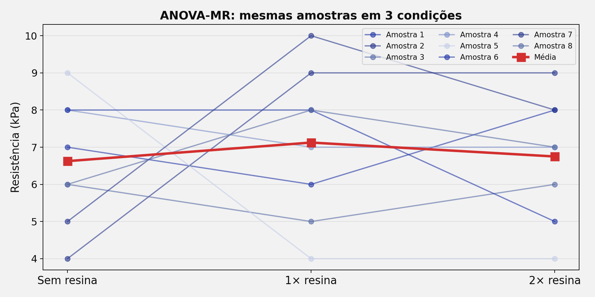
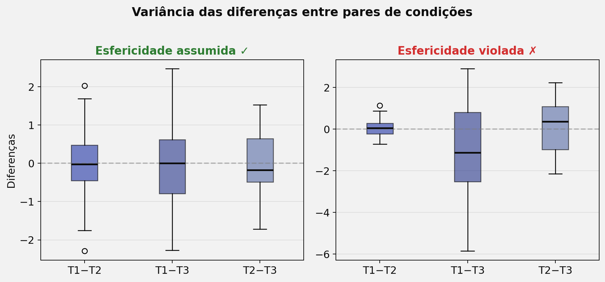
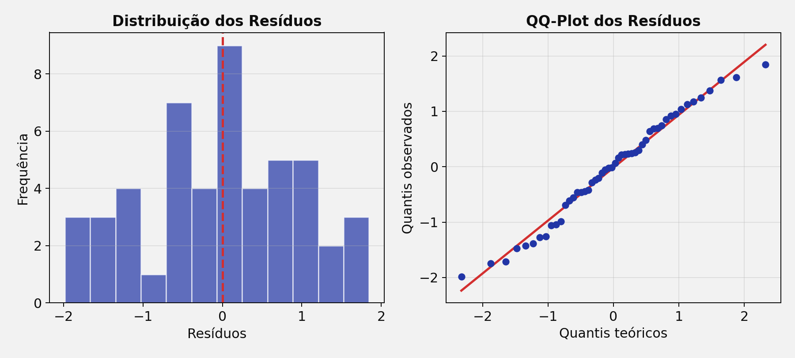
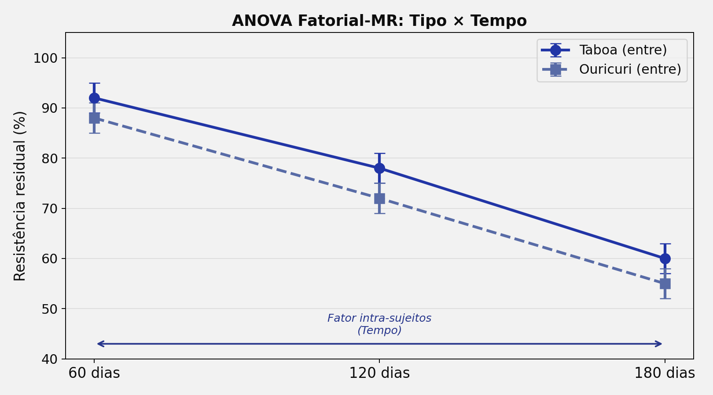

## Roteiro da Aula {.smaller-text}

::: {.columns}
:::: {.column width="60%"}

- [1]{.circle} O que é ANOVA de Medidas Repetidas?
- [2]{.circle} Quando usar — condições vs. momentos
- [3]{.circle} Estrutura dos dados e delineamento
- [4]{.circle} Pressupostos — Esfericidade
- [5]{.circle} Correções (Greenhouse-Geisser / Huynh-Feldt)
- [6]{.circle} ANOVA Fatorial de Medidas Repetidas
- [7]{.circle} Dados faltantes (Missing)

::::
:::: {.column width="40%"}

::: {.info-box}
**Objetivo:** Compreender a ANOVA-MR como teste para comparar **≥ 3 medidas** realizadas no **mesmo sujeito/amostra**, seja em condições diferentes ou ao longo do tempo.
:::

::::
:::


# [1 — O QUE É ANOVA-MR?]{.section-header}

## Da ANOVA entre-sujeitos à ANOVA intra-sujeitos {.smaller-text}

::: {.columns}
:::: {.column width="50%"}

::: {.box}
**ANOVA Uma Via (entre-sujeitos)**

- Grupos **diferentes** são comparados
- Cada observação pertence a **um único** grupo
- Ex.: 3 tipos de cobertura → 3 grupos de parcelas
:::

::::
:::: {.column width="50%"}

::: {.highlight-box}
**ANOVA-MR (intra-sujeitos)**

- As **mesmas amostras** são medidas em ≥ 3 condições ou tempos
- Cada sujeito serve como seu **próprio controle**
- Ex.: Resistência de uma fibra medida em 3 dosagens de resina
:::

::::
:::

::: {.info-box}
A ANOVA-MR é mais **poderosa** que a ANOVA entre-sujeitos porque a variabilidade individual é removida da variância de erro. Cada sujeito é seu próprio controle → menos "ruído".
:::


## Vantagens e Limitações {.smaller-text}

::: {.columns}
:::: {.column width="50%"}

::: {.box}
**Vantagens**

- **Maior poder estatístico** (menor erro)
- **Menor número de amostras** necessárias
- Controla diferenças individuais
- Ideal para estudos longitudinais
:::

::::
:::: {.column width="50%"}

::: {.highlight-box}
**Limitações**

- Efeito de **aprendizagem** ou **fadiga** entre medidas
- As medidas **não são independentes** entre si
- Pressuposto adicional: **esfericidade**
- Dados faltantes são mais problemáticos
:::

::::
:::


# [2 — QUANDO USAR]{.section-header}

## Condições diferentes ou Momentos diferentes {.smaller-text}

::: {.columns}
:::: {.column width="50%"}

::: {.box}
**Mesma amostra, condições diferentes**

Ex.: Resistência de amostras de taboa testadas com 3 dosagens de resina (sem, 1×, 2×)

| Amostra | Sem resina | 1× resina | 2× resina |
|---------|:---:|:---:|:---:|
| 1 | 7 | 6 | 8 |
| 2 | 4 | 9 | 9 |
| 3 | 6 | 5 | 6 |
| 4 | 8 | 7 | 7 |
| 5 | 9 | 4 | 4 |
| 6 | 8 | 8 | 5 |
| 7 | 5 | 10 | 8 |
| 8 | 6 | 8 | 7 |
:::

::::
:::: {.column width="50%"}

::: {.box}
**Mesma amostra, momentos diferentes**

Ex.: Degradação de geotêxtil medida a cada 60 dias

| Amostra | 60 dias | 120 dias | 180 dias |
|---------|:---:|:---:|:---:|
| 1 | 95% | 82% | 68% |
| 2 | 91% | 79% | 62% |
| 3 | 93% | 85% | 71% |
:::

::::
:::

{width="70%" fig-align="center"}


# [3 — ESTRUTURA DOS DADOS]{.section-header}

## Formato wide vs. long {.smaller-text}

::: {.columns}
:::: {.column width="50%"}

::: {.box}
**Formato wide (planilha)**

Cada linha = um sujeito; cada coluna = uma medida

| ID | T1 | T2 | T3 |
|---|:---:|:---:|:---:|
| A1 | 7 | 6 | 8 |
| A2 | 4 | 9 | 9 |
| A3 | 6 | 5 | 6 |

Este é o formato mais intuitivo para coleta de dados.
:::

::::
:::: {.column width="50%"}

::: {.highlight-box}
**Formato long (análise)**

Cada linha = uma observação

| ID | Tempo | Valor |
|---|:---:|:---:|
| A1 | T1 | 7 |
| A1 | T2 | 6 |
| A1 | T3 | 8 |
| A2 | T1 | 4 |
| A2 | T2 | 9 |
| ... | ... | ... |

Necessário para a maioria dos softwares estatísticos.
:::

::::
:::


## Decomposição da Variância {.smaller-text}

::: {.columns}
:::: {.column width="50%"}

```{mermaid}
%%| fig-width: 5.5
flowchart TD
    A["Variância Total"]:::root --> B["Variância Entre\nSujeitos"]:::node
    A --> C["Variância Dentro\ndos Sujeitos"]:::node
    C --> D["Efeito do Fator\n(Condição/Tempo)"]:::result
    C --> E["Erro\n(Sujeito × Fator)"]:::leaf

    classDef root fill:#2135A6,color:#fff,font-weight:bold,stroke:#27368C
    classDef node fill:#C5CEE8,color:#0D0D0D,stroke:#586BA6
    classDef leaf fill:#586BA6,color:#fff,stroke:#27368C
    classDef result fill:#27368C,color:#fff,font-weight:bold,stroke:#2135A6
```

::::
:::: {.column width="50%"}

::: {.info-box}
**Diferença fundamental**

Na ANOVA-MR, a variância entre sujeitos é **separada** e removida do erro. O erro é apenas a **interação Sujeito × Condição** — ou seja, a inconsistência de cada sujeito entre as condições.
:::

::: {.box}
**Tabela ANOVA-MR**

| Fonte | gl |
|-------|-----|
| Fator (condição) | k − 1 |
| Erro (S × Fator) | (k−1)(n−1) |
| Sujeitos | n − 1 |
:::

::::
:::


# [4 — ESFERICIDADE]{.section-header}

## O novo pressuposto: Esfericidade {.smaller-text}

::: {.columns}
:::: {.column width="55%"}

::: {.info-box}
**O que é?**

A esfericidade exige que as **variâncias das diferenças** entre todos os pares de condições sejam iguais.

É análoga à homocedasticidade, mas aplicada às diferenças pareadas.
:::

::: {.box}
**Teste de Mauchly**

| Resultado | Interpretação |
|-----------|---------------|
| p > 0,05 | Esfericidade assumida ✓ |
| p < 0,05 | Esfericidade **violada** ✗ |
:::

::::
:::: {.column width="45%"}

{width="100%"}

::: {.highlight-box}
A esfericidade é mais provável de ser violada com **muitas condições** (≥ 4) e quando os intervalos entre as medidas são desiguais.
:::

::::
:::


## Por que a esfericidade importa? {.smaller-text}

::: {.columns}
:::: {.column width="50%"}

Na ANOVA entre-sujeitos, as observações são independentes. Na MR, as medidas do **mesmo sujeito são correlacionadas** — e essa correlação pode diferir entre pares de condições.

::: {.box}
**Quando violada:**

- O teste F fica **inflado** (liberal demais)
- Aumenta a taxa de **Erro Tipo I**
- Os p-valores são **subestimados** (parecem mais significativos do que são)
:::

::::
:::: {.column width="50%"}

::: {.highlight-box}
**Solução: Correções dos graus de liberdade**

Multiplicam os gl do Fator e do Erro por um fator de correção **ε** (épsilon), que varia de:

- ε = 1 → esfericidade perfeita
- ε = 1/(k−1) → violação máxima

Quanto menor ε, mais conservadora a correção.
:::

::::
:::


# [5 — CORREÇÕES]{.section-header}

## Greenhouse-Geisser e Huynh-Feldt {.smaller-text}

::: {.columns}
:::: {.column width="50%"}

::: {.box}
**Greenhouse-Geisser (GG)**

- Mais **conservadora**
- Recomendada quando ε < 0,75
- Sempre disponível nos softwares
- Fórmula: gl_corrigido = ε × gl_original
:::

::::
:::: {.column width="50%"}

::: {.box}
**Huynh-Feldt (HF)**

- Menos conservadora
- Recomendada quando ε ≥ 0,75
- Pode superestimar ε ligeiramente
:::

::::
:::

::: {.info-box}
**Regra prática (Field, 2013):**

1. Teste de Mauchly significativo (p < 0,05)?
   - **Sim** → verifique ε do Greenhouse-Geisser
     - ε < 0,75 → use **Greenhouse-Geisser**
     - ε ≥ 0,75 → use **Huynh-Feldt**
   - **Não** → use a ANOVA-MR sem correção (esfericidade assumida)
:::


## Normalidade dos Resíduos {.smaller-text}

::: {.columns}
:::: {.column width="50%"}

::: {.highlight-box}
**Atenção!**

Na ANOVA-MR, o pressuposto de normalidade se refere à normalidade dos **resíduos** (variância não explicada pelo modelo), e não à distribuição bruta da variável.

- Teste de Shapiro-Wilk nos resíduos
- QQ-plot dos resíduos
:::

::::
:::: {.column width="50%"}

{width="100%"}

::: {.info-box}
Com amostras grandes (n > 30 por condição), a ANOVA-MR é **robusta** a violações moderadas da normalidade (Teorema Central do Limite).
:::

::::
:::


# [6 — ANOVA FATORIAL-MR]{.section-header}

## Combinando fatores entre e intra-sujeitos {.smaller-text}

::: {.columns}
:::: {.column width="55%"}

::: {.info-box}
**ANOVA Fatorial de Medidas Repetidas**

| Nome | Descrição | Exemplo |
|------|-----------|---------|
| ANOVA-MR simples | 1 fator intra | Adubação: base, plantio, cobertura |
| ANOVA Fatorial-MR | ≥ 1 fator entre + ≥ 1 fator intra | Adubação × Tipo de fertilizante (orgânico, mineral) |
:::

::::
:::: {.column width="45%"}

{width="100%"}

::::
:::

::: {.highlight-box}
A ANOVA Fatorial-MR é muito utilizada em estudos de **degradação de materiais** ao longo do tempo (fator intra-sujeitos), comparando diferentes **tipos ou tratamentos** (fator entre-sujeitos).
:::


# [7 — DADOS FALTANTES]{.section-header}

## Missing Data em Medidas Repetidas {.smaller-text}

::: {.columns}
:::: {.column width="50%"}

Dados faltantes são comuns em estudos longitudinais e de degradação (ex.: corpo de prova rompeu antes do prazo).

::: {.box}
**Tipos de Missing**

| Tipo | Definição |
|------|-----------|
| MCAR | Faltante completamente ao acaso |
| MAR | Faltante relacionado a outras variáveis observadas |
| MNAR | Faltante relacionado ao próprio valor não observado |
:::

::::
:::: {.column width="50%"}

::: {.highlight-box}
**Métodos de tratamento**

| Método | Qualidade |
|--------|-----------|
| **Exclusão listwise** | ⚠️ Perde poder |
| **Substituição pela média** | ❌ Ignora o padrão individual |
| **Expected Maximization (EM)** | ✅ Usa padrão de covariância |
| **Imputação Múltipla** | ✅✅ Gera ICs, mais robusto |
:::

::::
:::


## Imputação: da Média ao Múltiplo {.smaller-text}

::: {.columns}
:::: {.column width="50%"}

::: {.box}
**Expected Maximization (EM)**

1. Calcula média e covariância das variáveis completas
2. Estima o valor faltante com base no padrão de covariância
3. Gera um novo banco completo
4. Repete até convergir (sem mudanças significativas)
:::

::::
:::: {.column width="50%"}

::: {.box}
**Imputação Múltipla (MI)**

- Avanço sobre o EM
- Gera **múltiplos bancos** imputados (ex.: 5 a 20)
- Cada banco é analisado separadamente
- Os resultados são combinados com erros-padrão ajustados
- Produz **intervalos de confiança** mais honestos
:::

::::
:::

::: {.info-box}
A substituição pela média **não é recomendada** — ela preserva a média, mas reduz artificialmente a variância e ignora o padrão individual do sujeito. Prefira EM ou Imputação Múltipla.
:::


## Resumo — Fluxo de Decisão {.smaller-text}

```{mermaid}
%%| fig-width: 10
flowchart LR
    A["≥ 3 medidas no\nmesmo sujeito?"]:::root --> |Sim| B["Normalidade\ndos resíduos?"]:::node
    A --> |"Não"| A2["ANOVA\nentre-sujeitos"]:::leaf
    B --> |Sim| C["Esfericidade?\n(Mauchly)"]:::node
    B --> |"Não"| B2["Friedman\n(não paramétrico)"]:::leaf
    C --> |"p > 0,05"| D["ANOVA-MR\n(sem correção)"]:::result
    C --> |"p < 0,05"| E{"ε < 0,75?"}:::node
    E --> |Sim| F["Greenhouse-\nGeisser"]:::result
    E --> |"Não"| G["Huynh-\nFeldt"]:::result

    classDef root fill:#2135A6,color:#fff,font-weight:bold,stroke:#27368C
    classDef node fill:#C5CEE8,color:#0D0D0D,stroke:#586BA6
    classDef leaf fill:#586BA6,color:#fff,stroke:#27368C
    classDef result fill:#27368C,color:#fff,font-weight:bold,stroke:#2135A6
```


## {.center background-color="#2135A6"}

::: {style="text-align: center;"}
[Obrigado!]{.obrigado-fit-text style="color: white;"}

::: {style="color: white; font-size: 0.7em;"}
Luiz Diego Vidal Santos

Universidade Estadual de Feira de Santana (UEFS)
:::
:::
