---
title: "Análise da Paisagem"
subtitle: "Evolução do Conceito de Paisagem <br> e Distinções Operacionais<br>Curso de Geografia"
author: "Luiz Diego Vidal Santos"
format:
  revealjs:
    logo: ../../../assets/logo-uefs.webp
    footer: "UEFS | Análise da Paisagem | Evolução do Conceito e Distinções"
    slide-number: true
    theme: [simple, ../../../assets/uefs.scss]
    controls: true
    width: 1280
    height: 720
    css: ../../../assets/custom.css
    include-after-body:
      - ../../../assets/image-lightbox.html
      - ../../../assets/progress-bar.html
    transition: slide
    background-transition: fade
    preview-links: auto
execute:
  echo: false
---

## Visão Geral da Aula {.smaller-text}

::: {.columns}
::: {.column width="50%"}
### Tópicos

- [1]{.circle} Retomada e discussão da leitura (Bertrand, 1971)
- [2]{.circle} Da *Landschaft* ao geossistema
- [3]{.circle} A paisagem em diferentes tradições do séc. XX
- [4]{.circle} A contribuição brasileira: Ab'Sáber e Monteiro
- [5]{.circle} Paisagem em Milton Santos
- [6]{.circle} Distinções operacionais para a disciplina
- [7]{.circle} Paisagem como síntese: definição de trabalho
:::

::: {.column width="50%"}
::: {.info-box}
**Objetivo da Aula**

Compreender a evolução histórica do conceito de paisagem na Geografia, desde a *Landschaft* alemã até as formulações contemporâneas, estabelecendo **distinções operacionais** que orientarão o trabalho ao longo da disciplina.
:::
:::
:::

## Retomada: Aula 1.2  -  Percepção e Valoração {.smaller-text}

::: {.columns}
::: {.column width="50%"}
### O que discutimos?

A paisagem não é apenas um mosaico mensurável  -  é também [experiência vivida]{.underline}. Na aula 1.2, vimos que:

- **Tuan (1974)**  -  **Topofilia** e **Topofobia**: o elo afetivo (ou de rejeição) entre pessoa e lugar
- **Berque (1984)**  -  **Paisagem-marca** (registro da ação humana) e **Paisagem-matriz** (condicionante da ação futura)
- **Cosgrove (1984)**  -  a paisagem como [forma de ver]{.underline} (*way of seeing*) historicamente construída; mapas como instrumentos de poder

> A análise da paisagem que ignora a [percepção]{.underline} perde metade do fenômeno.
:::

::: {.column width="50%"}
::: {.highlight-box}
**Conceitos-chave para levar adiante**

| Conceito | Ideia central |
|:---------|:-------------|
| **Topofilia / Topofobia** | Vínculo afetivo positivo ou negativo com o lugar |
| **Paisagem-marca** | A paisagem como [produto]{.underline} da sociedade |
| **Paisagem-matriz** | A paisagem como [molde]{.underline} que condiciona a sociedade |
| **Paisagem cultural** | IPHAN, UNESCO e Convenção Europeia reconhecem a dimensão cultural da paisagem |

: {.striped .hover}
:::
:::
:::

---

## Retomada: da percepção à análise integrada {.smaller-text}

::: {.columns}
::: {.column width="50%"}
### Duas leituras complementares

```{mermaid}
%%| fig-cap: "A análise integrada articula as duas leituras."
flowchart TB
    P["PAISAGEM"] --> O["Leitura Objetiva<br>Métricas, mapas, índices"]
    P --> S["Leitura Subjetiva<br>Percepção, valores, afeto"]
    O --> I["Análise Integrada<br>Diagnóstico + Valoração"]
    S --> I
    style P fill:#2E7D32,color:#fff,stroke:#1B5E20,stroke-width:2px
    style O fill:#BBDEFB,stroke:#1565C0
    style S fill:#FFE0B2,stroke:#E65100
    style I fill:#C8E6C9,stroke:#2E7D32
```

A leitura [objetiva]{.underline} (estrutura, métricas, SIG) e a leitura [subjetiva]{.underline} (percepção, topofilia, poder) não se excluem  -  se [complementam]{.underline} no diagnóstico territorial.
:::

::: {.column width="50%"}
::: {.info-box}
**Conexão com a aula de hoje**

Na aula 1.2, exploramos **quem percebe** e **como percebe** a paisagem. Agora avançamos para:

- [Como o conceito evoluiu]{.underline} na ciência geográfica (de Humboldt ao geossistema)
- [Quais tradições]{.underline} moldaram a análise da paisagem no séc. XX
- [Que distinções operacionais]{.underline} adotaremos na disciplina

A dimensão perceptiva não desaparece  -  ela será retomada no trabalho de campo e no diagnóstico integrado.
:::
:::
:::

# [1  -  DISCUSSÃO DA LEITURA]{.section-header}

## Atividade: Jigsaw, Metzger (2001) {.smaller-text}

::: {.columns}
::: {.column width="55%"}
### Método Jigsaw

**Texto:** METZGER, J. P. (2001). *O que é ecologia de paisagens?*

**Fase 1, Grupos de especialistas**

A turma dividida em **4 grupos**. Cada grupo lê e domina **uma parte** do artigo:

| Grupo | Trecho | Foco |
|:-----:|:-------|:-----|
| **A** | Introdução e definições | O que é ecologia da paisagem? |
| **B** | Abordagem geográfica *vs.* ecológica | Diferenças de tradição |
| **C** | Estrutura, função e dinâmica | Conceitos operacionais |
| **D** | Aplicações e perspectivas | Usos no diagnóstico e planejamento |

:::

::: {.column width="45%"}
**Fase 2, Reagrupamento**

Novos grupos com **um membro de cada letra** (A + B + C + D). Cada especialista explica sua parte até que todos dominem o artigo completo.

::: {.highlight-box}
**Por que Jigsaw?**

- Cada aluno será [responsável]{.underline} por uma parte - sem leitura passiva
:::
:::
:::

---

## Bertrand (1971): pontos-chave {.smaller-text}

::: {.columns}
::: {.column width="50%"}
### Fichamento coletivo

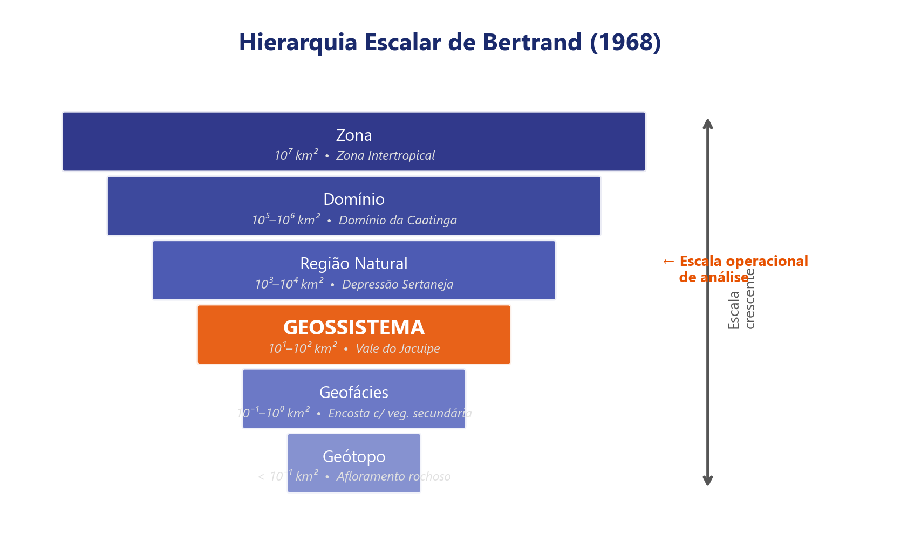{width="100%" fig-align="center"}

> *"A paisagem não é a simples adição de elementos geográficos disparatados  -  é, em uma determinada porção do espaço, o resultado da combinação dinâmica, portanto instável, de elementos físicos, biológicos e antrópicos."*  -  Bertrand, 1971

**Contribuição central:**

- Paisagem como [combinação dinâmica]{.underline}
- Três componentes: [potencial ecológico]{.underline} + [exploração biológica]{.underline} + **ação antrópica**
- Hierarquia escalar: zona → domínio → região natural → **geossistema** → geofácies → geótopo
:::

::: {.column width="50%"}
::: {.highlight-box}
**Questões para discussão
**

1. Bertrand afirma que a paisagem é "instável". O que isso significa em termos práticos para a análise?

2. Qual a diferença entre a paisagem de Bertrand e a paisagem "cenário" do senso comum?

3. A classificação hierárquica (geossistema-geofácies-geótopo) é uma proposta **universal** ou **contextual**? Ela funciona para a caatinga baiana?

4. Bertrand escreveu em 1968/1971. O que mudou desde então no modo de estudar paisagem?
:::
:::
:::

# [2  -  DA *LANDSCHAFT* AO GEOSSISTEMA]{.section-header}

## Retomada: Humboldt e a *Landschaft* {.smaller-text}

::: {.info-box}
**Da Aula 1.2  -  o que já sabemos sobre Humboldt:**

- *Landschaft* = [fisionomia regional]{.underline}, totalidade perceptível
- Método do **"Empirismo Raciocinado"**: observação + intuição + síntese
- A paisagem como resultado da [interação]{.underline} entre clima, relevo, vegetação e cultura
- O *Naturgemälde* como primeiro modelo de representação integrada

**Agora avançamos:** o que aconteceu *depois* de Humboldt? Como o conceito evoluiu de uma visão de totalidade para modelos sistêmicos e quantitativos?
:::

---

## Carl Troll e a Ecologia da Paisagem {.smaller-text}

::: {.columns}
::: {.column width="50%"}
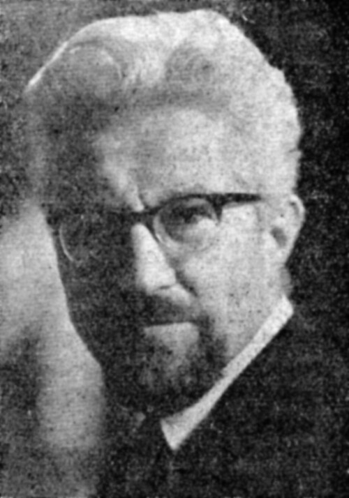{width="45%" fig-align="center"}

### O nascimento de uma disciplina (1939)

Carl Troll cunhou o termo **Landschaftsökologie** (Ecologia da Paisagem) ao combinar:

- **Fotografia aérea** (visão sinóptica do território)
- **Ecologia** (relações entre organismos e ambiente)

### Proposta

A paisagem é um [mosaico de ecótopos]{.underline} onde:

- Cada ecótopo tem composição e funcionalidade próprias
- As relações **entre** ecótopos definem a dinâmica da paisagem
- A escala de observação condiciona o que se percebe
:::

::: {.column width="50%"}
::: {.info-box}
**Inovações de Troll
**

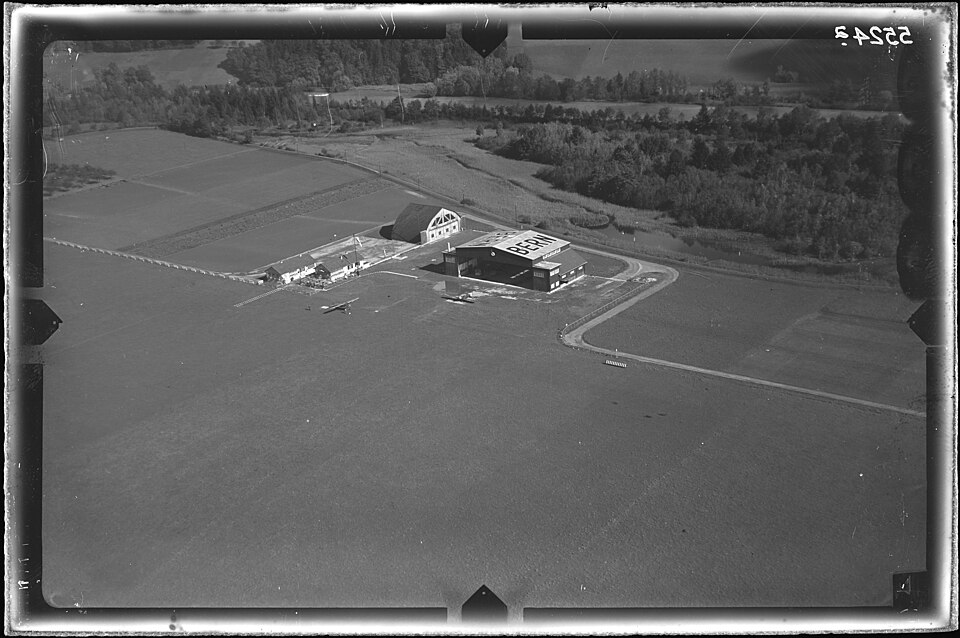{width="100%" fig-align="center"}

1. **Visão aérea** como ferramenta analítica  -  antecipa o sensoriamento remoto
2. **Ecótopo** como unidade elementar da paisagem
3. Relações [horizontais]{.underline} (entre unidades) são tão importantes quanto as [verticais]{.underline} (dentro de uma unidade)
4. A paisagem é [funcional]{.underline}  -  não apenas descritiva

> *"A ecologia da paisagem estuda a estrutura, a função e as mudanças do mosaico de ecossistemas em escala paisagística."*  -  Troll (1939, adaptado)
:::
:::
:::

---

## O geossistema: Sochava e Bertrand {.smaller-text}

{width="75%" fig-align="center"}

::: {.columns}
::: {.column width="50%"}
### Sochava (1963)  -  abordagem soviética

- Paisagem como **sistema aberto**: entradas e saídas de energia e matéria
- **Geossistema** = unidade de estudo que integra geomorfologia, clima, hidrologia, vegetação, solos
- Enfoque nos [fluxos]{.underline} e nas [transformações]{.underline} (dinâmica)

### Bertrand (1968)  -  abordagem francesa

- Adota o geossistema, mas propõe **classificação hierárquica**
- Geossistema = unidade de análise prática (escala entre região e geótopo)
- Três componentes integrados: **potencial ecológico** + **exploração biológica** + **ação antrópica**
:::

::: {.column width="50%"}
::: {.highlight-box}
**A hierarquia de Bertrand
**

| Nível | Escala aprox. | Exemplo |
|-------|:---:|---------|
| Zona | 10⁷ km² | Zona intertropical |
| Domínio | 10⁵–10⁶ km² | Domínio da Caatinga |
| Região natural | 10³–10⁴ km² | Depressão Sertaneja |
| **Geossistema** | 10¹–10² km² | Vale do Jacuípe |
| Geofácies | 10⁻¹–10⁰ km² | Encosta com vegetação secundária |
| Geótopo | < 10⁻¹ km² | Afloramento rochoso pontual |

: {.striped .hover}

O **geossistema** é a escala operacional para diagnóstico territorial.
:::
:::
:::

# [3  -  A PAISAGEM NO SÉCULO XX: TRADIÇÕES]{.section-header}

## Visão geral das tradições {.smaller-text}

As tradições geográficas iluminam **diferentes dimensões** da paisagem:

::: {.columns}
::: {.column width="50%"}
- **Alemã** → forma, mapeamento, estrutura
- **Francesa** → sociedade-natureza, GTP
- **Anglo-saxônica** → padrão, processo, métricas
- **Humanista/Cultural** → percepção, significado, poder
:::
::: {.column width="50%"}
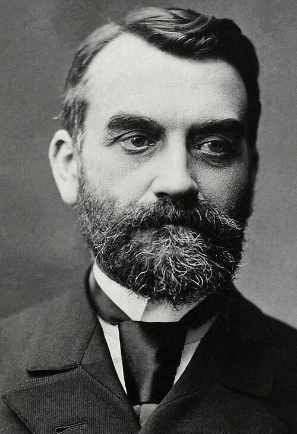{width="60%" fig-align="center"}
:::
:::

---

## Tradição alemã: da morfologia à funcionalidade {.smaller-text}

::: {.columns}
::: {.column width="50%"}
### Características

- Ênfase na [forma]{.underline} da paisagem (*Gestalt*)
- Paisagem como [unidade fisiográfica]{.underline} regional
- Classificação e mapeamento de tipos de paisagem
- Forte vínculo com [geomorfologia]{.underline} e [climatologia]{.underline}

### Representantes

- **Siegfried Passarge**  -  tipologias paisagísticas
- **Carl Troll**  -  ecologia da paisagem
- **Ernst Neef**  -  cartografia de paisagens
- **Josef Schmithüsen**  -  biogeografia e paisagem
:::

::: {.column width="50%"}
::: {.info-box}
**Contribuição
**

A tradição alemã ofereceu:

1. O **vocabulário** fundador (Landschaft, Landschaftsökologie)
2. A ideia de que paisagens podem ser **classificadas** e **mapeadas**
3. O princípio de que a paisagem tem uma **estrutura reconhecível**
4. A preocupação com a **integração** entre componentes

**Limitação:** tendência a priorizar componentes naturais em detrimento da ação humana.
:::
:::
:::

---

## Tradição francesa: paisagem e sociedade {.smaller-text}

::: {.columns}
::: {.column width="50%"}
### Características

- Paisagem como [expressão material]{.underline} das relações sociedade-natureza
- Forte influência de [Vidal de la Blache]{.underline} (gêneros de vida)
- A paisagem reflete modos de [produção]{.underline}, [ocupação]{.underline} e [cultura]{.underline}
- Evolução para o [geossistema]{.underline} (Bertrand) e a trilogia [GTP]{.underline} (Geossistema-Território-Paisagem)

### Representantes

- **Paul Vidal de la Blache**  -  gêneros de vida, paisagem regional
- **Georges Bertrand**  -  geossistema, GTP
- **Jean Tricart**  -  ecodinâmica, fragilidade ambiental
- **Augustin Berque**  -  paisagem e cultura, *médiance*
:::

::: {.column width="50%"}
::: {.highlight-box}
**A trilogia GTP (Bertrand, 2000s)
**

Bertrand, em revisão posterior, propôs três entradas complementares para a análise:

| Entrada | Foco |
|---------|------|
| **Geossistema** | Funcionamento biofísico (fonte → recurso) |
| **Território** | Gestão e uso (recurso → política) |
| **Paisagem** | Percepção e representação (identidade → valor) |

: {.striped .hover}

Nenhuma entrada sozinha é suficiente. A análise completa articula as três.

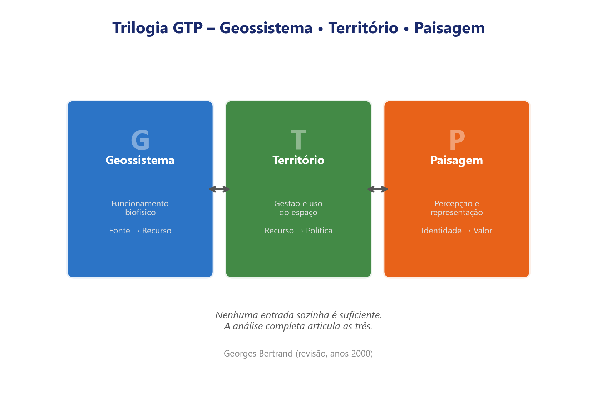{width="100%" fig-align="center"}

> A paisagem, para Bertrand, deixou de ser **apenas** a estrutura biofísica  -  incorporou a **percepção social**.
:::
:::
:::

---

## Tradição anglo-saxônica: padrão e processo {.smaller-text}

::: {.columns}
::: {.column width="50%"}
### Características

- Ênfase na **quantificação** e na **modelagem**
- Paisagem como **mosaico espacial** analisável por métricas
- Forte vínculo com **ecologia de populações** e **biogeografia de ilhas**
- Avanço computacional: SIG, sensoriamento remoto, FRAGSTATS

### Representantes

- **Richard Forman & Michel Godron** (1986)  -  *Landscape Ecology*
- **Monica Turner**  -  dinâmica de paisagens, perturbação
- **Kevin McGarigal**  -  métricas de paisagem (FRAGSTATS)
- **Zev Naveh**  -  paisagem total, complexidade
:::

::: {.column width="50%"}
::: {.info-box}
**Modelo matriz-mancha-corredor
**

Forman & Godron (1986) propuseram que **toda paisagem** pode ser decomposta em:

- **Matriz**  -  elemento dominante (ex.: pastagem)
- **Manchas**  -  unidades discretas (ex.: fragmentos florestais)
- **Corredores**  -  conexões lineares (ex.: matas ciliares)

Esse modelo é **simples**, **visual** e **operacional**  -  por isso dominou a ecologia da paisagem aplicada nas últimas décadas.

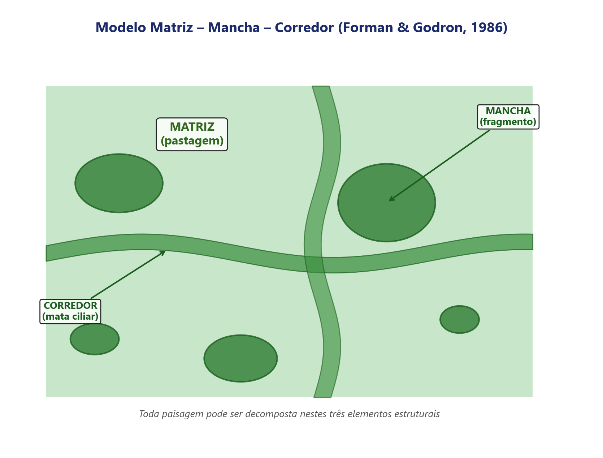{width="100%" fig-align="center"}

:::
:::
:::

---

## Tradição humanista/cultural {.smaller-text}

::: {.columns}
::: {.column width="50%"}
### Características

- Paisagem como **construção cultural** e **percepção**
- Não apenas o que se vê, mas **como** e **por que** se vê
- A paisagem é [vivida]{.underline}, [significada]{.underline} e **disputada**
- Rejeição a abordagens exclusivamente quantitativas

### Representantes

- **Carl Sauer** (1925)  -  *morfologia da paisagem cultural*
- **Denis Cosgrove**  -  paisagem como **forma simbólica** de poder
- **Yi-Fu Tuan**  -  *topofilia* e experiência do lugar
- **Augustin Berque**  -  *médiance*, paisagem como relação
:::

::: {.column width="50%"}
::: {.highlight-box}
**O que essa tradição acrescenta?
**

1. A paisagem nunca é "neutra"  -  reflete [valores]{.underline}, **conflitos** e **desigualdades**
2. A mesma paisagem pode ser percebida de formas **radicalmente diferentes**
3. A análise técnica não substitui a **experiência vivida**
4. Paisagem como **patrimônio**  -  Convenção Europeia da Paisagem (2000)

> *"A paisagem é a porção da Terra que é compreendida pelo olhar."*  -  Berque (1984, adaptado)

**Nesta disciplina**, a dimensão cultural/perceptiva será mobilizada quando pertinente, mas o foco será nas dimensões **estrutural, funcional e dinâmica**.
:::
:::
:::

---

## Linha do tempo conceitual, síntese {.smaller-text}

::: {=html}
<table class="table table-striped table-hover" style="width:100%; font-size:0.88em;">
<thead>
<tr><th style="text-align:center; width:13%">Período</th><th style="width:28%">Autor/Escola</th><th>Conceito-chave</th></tr>
</thead>
<tbody>
<tr><td style="text-align:center">1807–1859</td><td><strong>Humboldt</strong></td><td><em>Landschaft</em> = fisionomia regional; totalidade perceptível</td></tr>
<tr><td style="text-align:center">1913</td><td><strong>Passarge</strong></td><td><em>Landschaftskunde</em> = ciência da paisagem; tipologias regionais</td></tr>
<tr><td style="text-align:center">1939</td><td><strong>Carl Troll</strong></td><td><strong>Ecologia da paisagem</strong>, fotointerpretação aérea + ecologia</td></tr>
<tr><td style="text-align:center">1960s</td><td><strong>Sochava</strong> (URSS)</td><td><strong>Geossistema</strong>, sistema aberto com fluxos de energia/matéria</td></tr>
<tr><td style="text-align:center">1968</td><td><strong>Bertrand</strong> (França)</td><td>Geossistema como unidade de análise; classificação hierárquica</td></tr>
<tr><td style="text-align:center">1986</td><td><strong>Forman &amp; Godron</strong></td><td><em>Landscape Ecology</em>, padrão, processo, escala</td></tr>
<tr><td style="text-align:center">1990s</td><td><strong>Naveh &amp; Lieberman</strong></td><td>Paisagem total (<em>Total Human Ecosystem</em>)</td></tr>
<tr><td style="text-align:center">2000s–hoje</td><td>Abordagens integradoras</td><td>Serviços ecossistêmicos, métricas, modelagem, SIG</td></tr>
</tbody>
</table>
:::

::: {.info-box}
A trajetória completa: de [descrição visual]{.underline} → [classificação regional]{.underline} → [análise sistêmica]{.underline} → [quantificação e modelagem]{.underline}.
:::

# [4  -  A CONTRIBUIÇÃO BRASILEIRA]{.section-header}

## Ab'Sáber: domínios morfoclimáticos {.smaller-text}

::: {.columns}
::: {.column width="50%"}
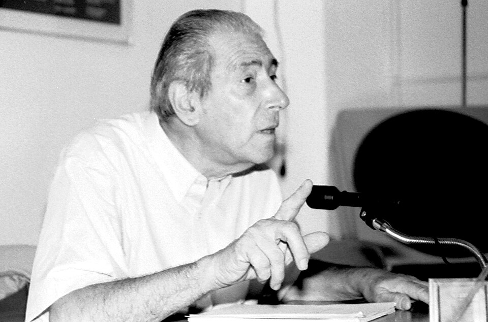{width="45%" fig-align="center"}

### Aziz Ab'Sáber (1924-2012)

- Um dos maiores geógrafos brasileiros
- Propôs os **domínios morfoclimáticos** do Brasil (1967/2003)
- A paisagem como resultado da interação entre **relevo**, **clima**, **vegetação** e **solos** em escala regional

### Os seis domínios

1. Amazônico (terras baixas, equatorial úmido)
2. Cerrado (chapadões, tropical sazonal)
3. Mares de morros (Mata Atlântica, relevo mamelonado)
4. Caatingas (depressões interplanálticas, semiárido)
5. Araucárias (planalto meridional, subtropical)
6. Pradarias (campanha gaúcha, campos)
:::

::: {.column width="50%"}
::: {.info-box}
**Legado para análise da paisagem
**

1. **Paisagem como totalidade regional**  -  integra clima, relevo, vegetação, solos
2. **Faixas de transição**  -  os domínios não são "caixas fechadas"; entre eles há **zonas de transição** (ecótonos) com mosaicos complexos
3. **Abordagem processual**  -  a paisagem atual é herança de processos geomorfológicos e climáticos passados
4. **Diagnóstico**  -  Ab'Sáber usou a compreensão da paisagem para propor **zoneamentos** e identificar **fragilidades**

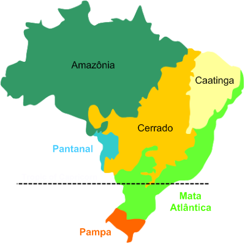{width="80%" fig-align="center"}

> Feira de Santana situa-se na transição entre o **Domínio da Caatinga** e o **Domínio da Mata Atlântica**  -  um mosaico particularmente complexo.
:::
:::
:::

---

## Carlos Augusto de F. Monteiro: a análise integrada {.smaller-text}

::: {.columns}
::: {.column width="50%"}
### Monteiro (1927-2015)

- **Geossistema** adaptado ao contexto brasileiro
- Proposta de análise **integrada** da paisagem por meio de:
  - Estrutura (componentes e arranjo)
  - Processos (dinâmica, fluxos)
  - Ação humana (uso, transformação)

### Método

- Cartografia de síntese: mapas que integram múltiplas variáveis
- "A paisagem é a melhor expressão de síntese que o geógrafo pode oferecer"
- Enfoque na **qualidade ambiental** como critério diagnóstico
:::

::: {.column width="50%"}
::: {.highlight-box}
**Contribuição principal
**

Monteiro sistematizou a ideia de que a análise da paisagem brasileira exige:

1. Considerar a **diversidade de escalas** (continental → local)
2. Articular componentes **naturais** e **antrópicos** sem hierarquizá-los a priori
3. Produzir **sínteses cartográficas** que permitam diagnóstico e intervenção
4. Reconhecer a **dinâmica**  -  paisagens brasileiras estão em rápida transformação

> *"Fazer a análise da paisagem é, ao mesmo tempo, um exercício de síntese."*  -  Monteiro (2000, adaptado)
:::
:::
:::

---

## Milton Santos: paisagem e espaço geográfico {.smaller-text}

::: {.columns}
::: {.column width="40%"}
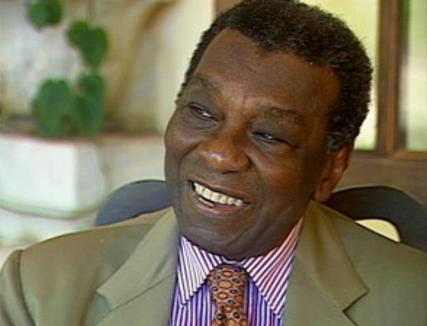{width="60%" fig-align="center"}

Para Milton Santos, paisagem e espaço não são sinônimos:

> *"A paisagem é o conjunto de formas que, num dado momento, exprimem as heranças que representam as sucessivas relações localizadas entre homem e natureza."*  -  Santos, 1996
:::

::: {.column width="60%"}
### Distinções fundamentais

- **Paisagem** = Forma (Estático, passado materializado visível, heranças físicas também chamadas de *rugosidades*).
- **Espaço geográfico** = Forma + Conteúdo (Dinâmico, vivo, relações sociais e dinâmicas políticas/econômicas atuando no presente).
- A paisagem é [transtemporal]{.underline}  -  acumula tempos diferentes.
- O espaço é **atual**  -  é o presente vivido.

::: {.info-box}
**Implicações para a análise**

1. A paisagem é **acumulação de tempos**  -  camadas históricas sobrepostas.
2. Analisar a paisagem é [ler as heranças]{.underline} inscritas no espaço.
3. A paisagem [não explica tudo]{.underline}  -  é preciso ir além da forma para compreender os processos.
4. A relação entre forma e função muda conforme o **período técnico**.
:::
:::
:::

---

## Exemplo 1: O Casarão Antigo {.smaller-text}

::: {.columns}
::: {.column width="45%"}
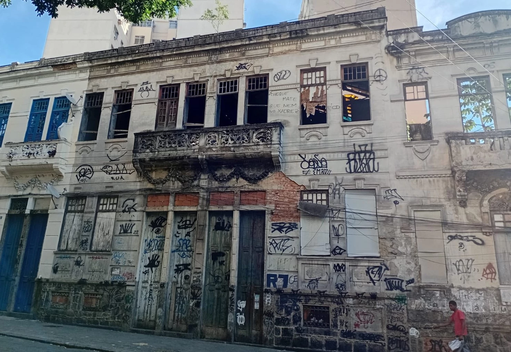{width="100%" fig-align="center"}
:::
::: {.column width="55%"}
::: {.highlight-box}
A **Paisagem** é o casarão abandonado no centro da cidade (arquitetura velha, "trabalho morto", *rugosidade*).

O **Espaço** é o que acontece ali no presente: a ocupação por movimentos de moradia ou a retenção por capital imobiliário (especulação). A forma física herdada sofre ação e **pulsa** junto da dinâmica social atual.

> **Paisagem** = Forma estática herdada  
> **Espaço** = Forma + Conteúdo vivo (relações sociais, políticas e econômicas de hoje)
:::
:::
:::

---

## Exemplo 2: O Profeta Diário (Harry Potter) {.smaller-text}

::: {.columns}
::: {.column width="55%"}
::: {.highlight-box}
O **papel impresso e recortado** (a estrutura material estática) é a **Paisagem**.

Porém, as **fotografias se movem e os personagens interagem** no papel. Essa ação contínua acontecendo *dentro* e *através* daquela materialidade prévia é o **Espaço**.

> **Paisagem** = o jornal físico (tinta, papel, diagramação)  
> **Espaço** = o jornal vivo (Forma + Conteúdo em movimento)
:::
:::
::: {.column width="45%"}
{width="100%" fig-align="center"}
:::
:::

---

## Milton Santos: bibliografia comentada {.smaller-text}

::: {.columns}
::: {.column width="50%"}
::: {.info-box}
**A Natureza do Espaço**

SANTOS, M. **A Natureza do Espaço.** 4ª ed. São Paulo: EDUSP, 2006. Cap. 5: *Paisagem e Espaço* (p. 103-114).

- p. 103: *"A paisagem é o conjunto de formas que, num dado momento, exprimem as heranças..."*
- p. 104: *"A paisagem é transtemporal, juntando objetos passados e presentes, uma construção transversal."*
- p. 106: *"A paisagem é história congelada, mas participa da história viva."*
:::
:::
::: {.column width="50%"}
::: {.info-box}
**Metamorfoses do espaço habitado**

SANTOS, M. **Metamorfoses do espaço habitado.** São Paulo: Hucitec, 1988. Cap. 2: *Paisagem e espaço* (p. 21-26).

- p. 22: *"A paisagem é um conjunto de formas heterogêneas, de idades diferentes, pedaços de tempos históricos representativos das diversas maneiras de produzir as coisas, de construir o espaço."*
:::
:::
:::

# [5  -  DISTINÇÕES OPERACIONAIS]{.section-header}

## Paisagem: o que é e o que não é (para esta disciplina) {.smaller-text}

::: {.columns}
::: {.column width="50%"}
### Paisagem É

- ✅ **Mosaico heterogêneo** de coberturas e usos
- ✅ [Resultado da interação]{.underline} entre componentes físicos, bióticos e antrópicos
- ✅ [Multiescalar]{.underline}  -  existe em várias escalas de análise
- ✅ **Dinâmica**  -  muda no tempo
- ✅ [Analisável]{.underline}  -  com métodos qualitativos e quantitativos
- ✅ **Material**  -  tem expressão espacial concreta
:::

::: {.column width="50%"}
::: {.highlight-box}
**Paisagem NÃO É (operacionalmente)
**

- ❌ Apenas cenário visual ou "vista bonita"
- ❌ Sinônimo de "meio ambiente" ou "natureza"
- ❌ Reduzível a um único componente (só relevo, só vegetação)
- ❌ Estática ou imutável
- ❌ Exclusivamente natural ou exclusivamente cultural
- ❌ Sinônimo de "espaço geográfico" ou "território"
:::
:::
:::

::: {.callout-note}
## Nota operacional
Essas distinções são **operacionais**, servem para orientar nossa análise. Não negam outras formas válidas de pensar a paisagem.
:::

---

## Recapitulando as categorias {.smaller-text}

::: {.columns}
::: {.column width="100%"}

| Pergunta | Paisagem | Espaço | Território | Ambiente |
|----------|:---:|:---:|:---:|:---:|
| O que se vê? | ✅ Forma e arranjo |  -  |  -  |  -  |
| O que se analisa? | Estrutura + função + dinâmica | Produção social | Poder e controle | Interação sociedade-natureza |
| Com que métodos? | Cartografia, SR, métricas, campo | Teoria social | Análise política | Avaliação de impacto |
| Para que serve? | Diagnóstico territorial integrado | Compreensão da totalidade | Gestão e governança | Sustentabilidade |

: {.striped .hover}

:::
:::

::: {.callout-note}
## Foco da disciplina
Na **Análise da Paisagem**, privilegiamos a **materialidade espacial** (o que se vê e se mede), articulada com processos e dinâmicas. As outras categorias entrarão como apoio quando necessário.
:::

# [6  -  DEFINIÇÃO DE TRABALHO]{.section-header}

## Nossa definição operacional {.smaller-text}

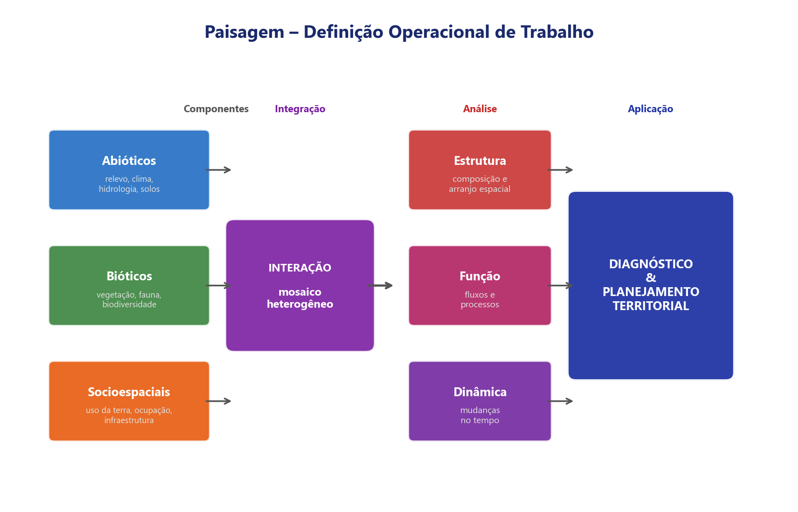{width="90%" fig-align="center"}

::: {.columns}
::: {.column width="100%"}

::: {.highlight-box}

**Paisagem  -  definição de trabalho para a disciplina
**

> **Paisagem** é a expressão espacial observável e analisável da interação entre componentes **abióticos** (relevo, clima, hidrografia, solos), **bióticos** (vegetação, fauna) e **socioespaciais** (uso da terra, ocupação, infraestrutura, atividades econômicas) em um determinado **recorte espaço-temporal**, configurando um **mosaico heterogêneo** cuja **estrutura**, **funcionamento** e **dinâmica** podem ser descritos, cartografados, mensurados e interpretados para fins de **diagnóstico, planejamento e gestão territorial**.

:::

### Elementos-chave

| Elemento | Significado |
|----------|-------------|
| **Expressão espacial** | Tem materialidade  -  pode ser mapeada e medida |
| **Interação** | Não é soma de partes, mas resultado de relações |
| **Recorte espaço-temporal** | Depende da escala e do momento |
| **Mosaico heterogêneo** | É composto por unidades diferentes articuladas |
| **Estrutura-função-dinâmica** | Três dimensões articuladas de análise |
| **Diagnóstico e planejamento** | Finalidade aplicada |

: {.striped .hover}

:::
:::

# [7  -  ATIVIDADE PRÁTICA]{.section-header}

## Exercício: leitura comparativa de paisagens {.smaller-text}

::: {.columns}
::: {.column width="60%"}
### Proposta (em duplas, 20 min)

Serão projetadas 3 imagens de paisagens brasileiras (Google Earth / MapBiomas):

1. **Paisagem A**  -  Planície amazônica (densa, contínua, fluvial)
2. **Paisagem B**  -  Cerrado fragmentado (mosaico agro-cerrado)
3. **Paisagem C**  -  Perímetro urbano de cidade média (Feira de Santana)

Para cada paisagem, identifique:

- Componentes visíveis (abióticos, bióticos, antrópicos)
- Tipo de mosaico (contínuo, fragmentado, misto)
- Uma **pergunta analítica** que você faria como geógrafo(a)
- Qual tradição teórica (das vistas hoje) melhor se aplicaria

### Socialização (15 min)

Cada dupla apresenta uma paisagem (3 min).
:::

::: {.column width="40%"}
::: {.info-box}
**Objetivo
**

- Exercitar a **leitura dirigida** da paisagem
- Conectar os conceitos teóricos da aula com **situações reais**
- Praticar a formulação de **perguntas analíticas**
- Perceber que a **tradição teórica** condiciona o que se observa e se pergunta

> *"Não vemos a paisagem  -  vemos através das lentes que aprendemos a usar."*
:::
:::
:::

---

## Para onde vamos: o arco da disciplina {.smaller-text}

::: {=html}
<div style="margin: 0.4em 0 0.8em 0;">
<table style="width:100%; border-collapse:separate; border-spacing:4px; font-size:0.82em;">
<tr>
  <td style="background:#C8E6C9; border:2px solid #2E7D32; border-radius:6px; padding:8px 10px; width:20%; vertical-align:top;">
    <div style="font-weight:bold; color:#1B5E20; margin-bottom:4px;">① Conceitual</div>
    <div style="font-size:0.88em; color:#2E7D32;">Aulas 1.1 · 1.2 · 2.1 · 2.2</div>
    <div style="font-size:0.82em; margin-top:4px;">Percepção · Evolução do conceito · Tradições · Milton Santos · Ab'Sáber · Domínios de natureza</div>
    <div style="margin-top:6px; font-size:0.78em; background:#A5D6A7; border-radius:4px; padding:3px 6px; display:inline-block;">← <strong>penúltima aula deste bloco</strong></div>
  </td>
  <td style="background:#FFF9C4; border:2px solid #F9A825; border-radius:6px; padding:8px 10px; width:20%; vertical-align:top;">
    <div style="font-weight:bold; color:#E65100; margin-bottom:4px;">② Sistêmica</div>
    <div style="font-size:0.88em; color:#E65100;">Aula 2.3</div>
    <div style="font-size:0.82em; margin-top:4px;">Geossistema como modelo · Leitura integrada · Operacionalização</div>
  </td>
  <td style="background:#E3F2FD; border:2px solid #1565C0; border-radius:6px; padding:8px 10px; width:20%; vertical-align:top;">
    <div style="font-weight:bold; color:#1565C0; margin-bottom:4px;">③ Estrutural</div>
    <div style="font-size:0.88em; color:#1565C0;">Aulas 3.1 · 3.2 · 4.1 · 4.3</div>
    <div style="font-size:0.82em; margin-top:4px;">Ecologia da paisagem · Escala · Padrão-Processo · Fluxos · Métricas · Fragmentação</div>
  </td>
  <td style="background:#E8EAF6; border:2px solid #283593; border-radius:6px; padding:8px 10px; width:20%; vertical-align:top;">
    <div style="font-weight:bold; color:#283593; margin-bottom:4px;">④ Técnica</div>
    <div style="font-size:0.88em; color:#283593;">Aulas 5.1 · 5.2 · 6.1 · 7.1 · 7.3 · 8.1 · 8.2</div>
    <div style="font-size:0.82em; margin-top:4px;">Cartografia · Sensoriamento Remoto · Índices · Mudanças · Unidades de paisagem</div>
  </td>
  <td style="background:#FCE4EC; border:2px solid #880E4F; border-radius:6px; padding:8px 10px; width:20%; vertical-align:top;">
    <div style="font-weight:bold; color:#880E4F; margin-bottom:4px;">⑤ Síntese</div>
    <div style="font-size:0.88em; color:#880E4F;">Aulas 9.1–9.4 · 10.1–10.4 · 11.1–11.2</div>
    <div style="font-size:0.82em; margin-top:4px;">Diagnóstico · Planejamento · Zoneamento · Campo · Relatório técnico</div>
  </td>
</tr>
</table>
</div>
:::

---

::: {.columns}
::: {.column width="50%"}
### Leitura obrigatória para a próxima aula

- METZGER, J. P. (2001). **O que é ecologia de paisagens?** *Biota Neotropica*, v. 1, n. 1-2.

### Fichamento (avaliação contínua)

Fichamento do artigo de Metzger (2001), destacando:

- Definição de ecologia da paisagem
- Diferença entre abordagem geográfica e ecológica
- Conceitos de estrutura, função e dinâmica
:::

::: {.column width="50%"}
::: {.highlight-box}
**Na próxima aula (2.2), ainda Fase ①**

Em seguida, na **Aula 2.3, Fase ②:**

Primeiro passo para a abordagem **operacional**:

- **Geossistema** como modelo de análise integrada
- Integração físico-biótica e socioespacial
- Como traduzir o conceito em ferramenta de diagnóstico

> A partir daqui, a pergunta muda: deixamos de perguntar *"o que é paisagem?"* e passamos a perguntar *"como analisá-la sistematicamente?"*

**Traga o fichamento de Metzger**  -  será base para a discussão.
:::
:::
:::

---

# [BIBLIOGRAFIA]{.section-header}

## Leituras Essenciais {.smaller-text}

::: {.columns}
::: {.column width="50%"}
### Base Teórica, Aula 2.1

::: {.info-box}
**Leitura obrigatória para a próxima aula**

**METZGER, J. P.** (2001). O que é ecologia de paisagens?  
*Biota Neotropica*, 1(1-2), 1-9.  
[📄 PDF](https://www.scielo.br/j/bn/a/JCwqC8W3rBMMqRjfqPGYr4x/?format=pdf&lang=pt)
:::

**BERTRAND, G.** (1971). Paisagem e geografia física global: esboço metodológico.  
*RA'E GA*, 8, 141-152.  
[📄 PDF](https://revistas.ufpr.br/raega/article/view/3389/2718)

**TROLL, C.** (2003 [1950]). A paisagem geográfica e sua investigação.  
*Espaço e Cultura*, Rio de Janeiro, n. 16.  
[📄 PDF](https://www.e-publicacoes.uerj.br/espacoecultura/article/view/3571/2488)

**TRICART, J.** (1977). *Ecodinâmica*. Rio de Janeiro: IBGE-SUPREN.  
[📄 PDF](https://biblioteca.ibge.gov.br/visualizacao/livros/liv66103.pdf)
:::

::: {.column width="50%"}
### Contribuição Brasileira

**AB'SÁBER, A. N.** (2003). *Os domínios de natureza no Brasil: potencialidades paisagísticas*. São Paulo: Ateliê Editorial.  
[📄 PDF completo](https://avauea.uea.edu.br/pluginfile.php/275784/mod_resource/content/3/ABS%C3%81BER%2C%20Aziz%20Os%20Dom%C3%ADnios%20de%20Natureza%20no%20Brasil_2.pdf)

**AB'SÁBER, A. N.** (1970). Províncias geológicas e domínios morfoclimáticos no Brasil.  
*Geomorfologia*, USP-IG, n. 20.  
[📄 PDF](https://biblio.fflch.usp.br/pedidos/2895)

**MONTEIRO, C. A. F.** (2000). Geossistemas: a história de uma procura. São Paulo: Contexto.  
[📖 Livraria](https://www.editoracontexto.com.br/produtos/geossistemas.html)

**MONTEIRO, C. A. F.** (2001). Geossistema, geografia e meio ambiente. In: MENDONÇA, F.; KOZEL, S. (org.). *Elementos de epistemologia da geografia contemporânea*. Curitiba: Ed. UFPR, p. 227-242.

**SANTOS, M.** (2006). *A Natureza do Espaço: técnica e tempo, razão e emoção*. 4ª ed. São Paulo: EDUSP.  
[📄 Cap. 5](http://files.leadt-ufal.webnode.com.br/200000026-4d5f34e59a/A%20Natureza%20do%20Espaco.pdf)

**SANTOS, M.** (1988). *Metamorfoses do espaço habitado*. São Paulo: Hucitec.  
[📖 Reed. 2020 - EDUSP](https://www.livrariadafisica.com.br/detalhe.aspx?id=169897)
:::
:::

---

## Síntese da Aula 2.1 {.smaller-text}

::: {.info-box}
**O que vimos hoje
**

1. **Bertrand (1971)**  -  paisagem como combinação dinâmica; geossistema e hierarquia escalar
2. **Linha do tempo**  -  de Humboldt (1807) à ecologia da paisagem contemporânea
3. **Carl Troll**  -  ecologia da paisagem, fotointerpretação, ecótopos
4. **Geossistema** (Sochava/Bertrand)  -  sistema aberto, fluxos, classificação hierárquica
5. **Tradições geográficas**  -  alemã (forma), francesa (sociedade-natureza), anglo-saxônica (padrão-processo), humanista (percepção)
6. **Contribuição brasileira**  -  Ab'Sáber (domínios), Monteiro (síntese integrada), Santos (paisagem como forma + herança)
7. **Distinções operacionais**  -  paisagem ≠ espaço ≠ território ≠ ambiente
8. **Definição de trabalho**  -  paisagem como mosaico heterogêneo analisável para diagnóstico e planejamento
:::

## {.center background-color="#2135A6"}

::: {style="text-align: center;"}
[Obrigado!]{.obrigado-fit-text style="color: white;"}

::: {style="color: white; font-size: 0.7em;"}
Luiz Diego Vidal Santos

Universidade Estadual de Feira de Santana (UEFS)

Análise da Paisagem  -  Aula 2.1
:::
:::