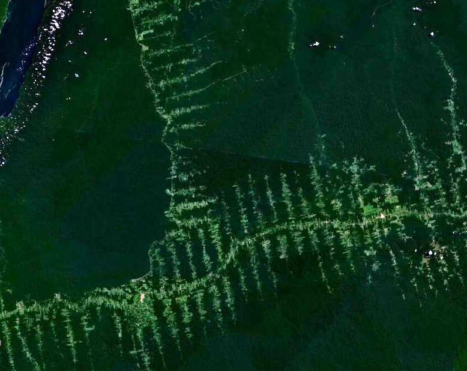
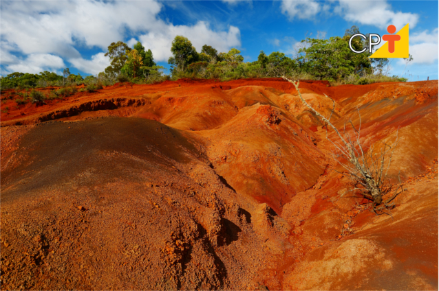
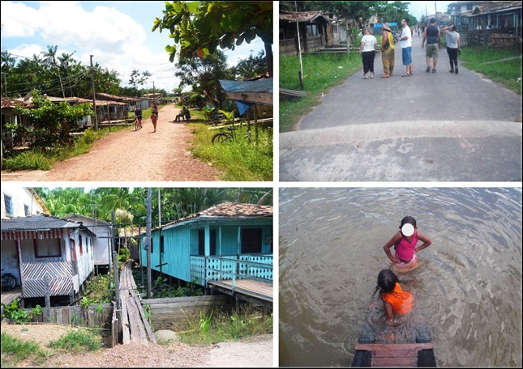
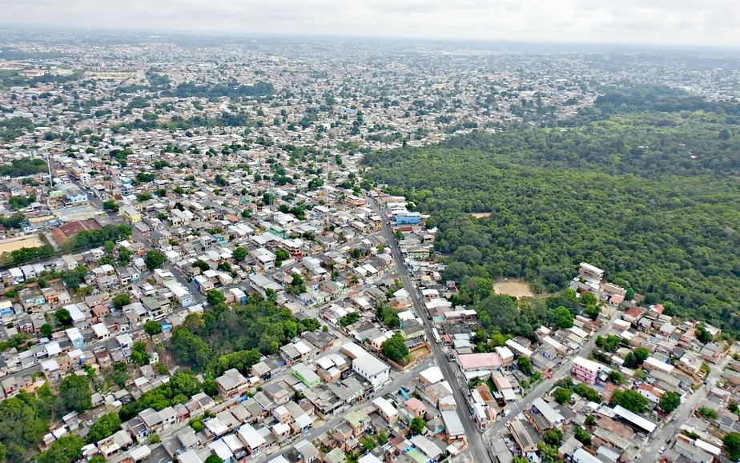
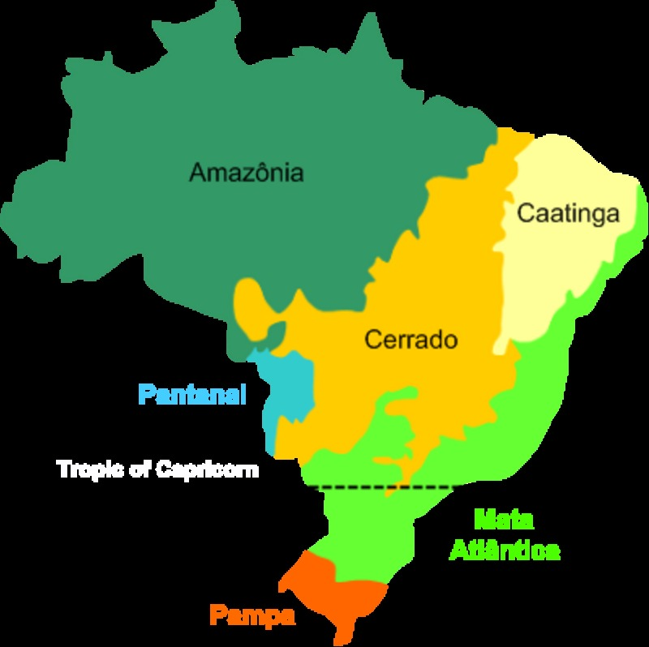
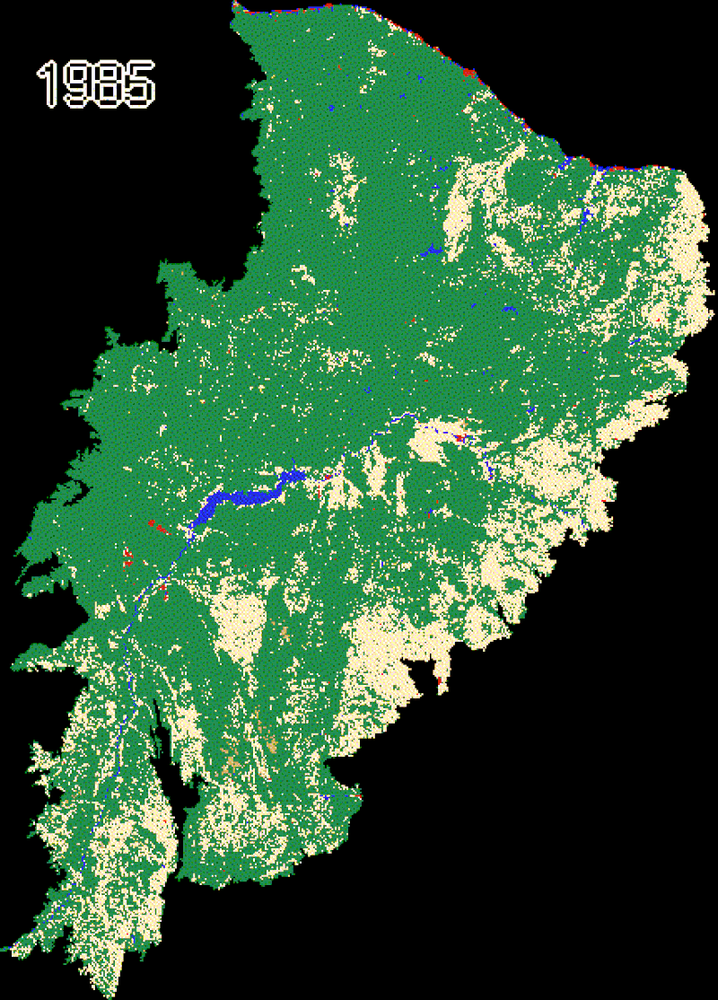
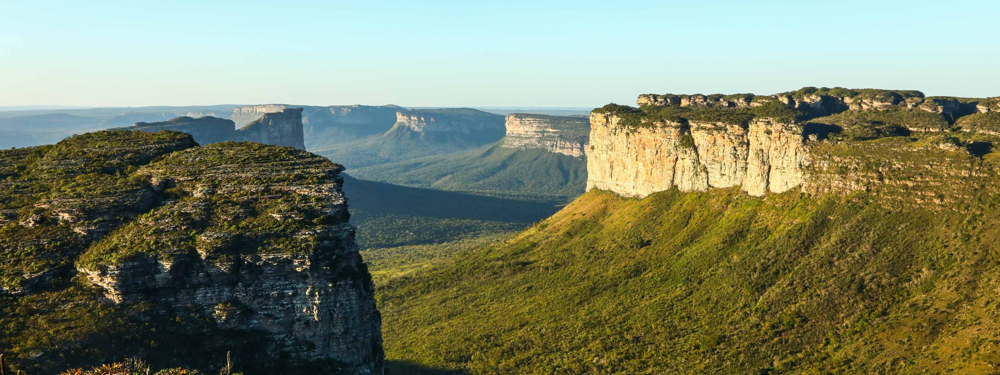
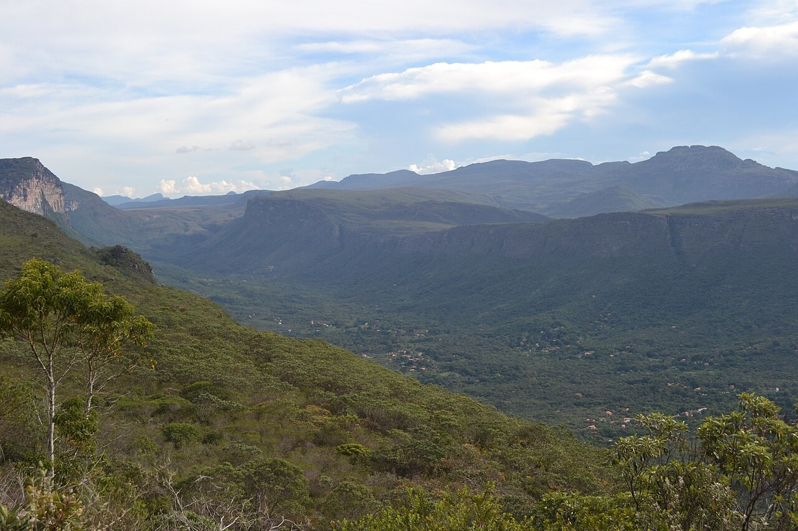

---
title: "Análise da Paisagem"
subtitle: "Domínios de Natureza e Paisagens Tropicais<br>Curso de Geografia"
author: "Luiz Diego Vidal Santos"
format:
  revealjs:
    logo: ../../../assets/logo-uefs.webp
    footer: "UEFS | Análise da Paisagem | Domínios e Paisagens Tropicais"
    slide-number: true
    theme: [simple, ../../../assets/uefs.scss]
    controls: true
    width: 1280
    height: 720
    css: ../../../assets/custom.css
    include-after-body:
      - ../../../assets/image-lightbox.html
      - ../../../assets/progress-bar.html
    transition: slide
    background-transition: fade
    preview-links: auto
execute:
  echo: false
---

## Visão Geral da Aula {.smaller-text}

::: {.columns}
::: {.column width="50%"}
### Tópicos

- [1]{.circle} O conceito de Geossistema na tradição franco-brasileira
- [2]{.circle} Bertrand (1971): taxonomia da paisagem
- [3]{.circle} Monteiro (1976/2000): geossistemas no Brasil
- [4]{.circle} Ab'Sáber (2003): domínios de natureza
- [5]{.circle} Aplicação: paisagens do semiárido baiano
- [6]{.circle} Exercício: identificação de domínios morfoclimáticos
:::

::: {.column width="50%"}
::: {.info-box}
**Objetivo da Aula**

Compreender as bases conceituais dos **geossistemas** e dos **domínios de natureza** como modelos de classificação e análise da paisagem brasileira, com ênfase na escola geográfica franco-brasileira.
:::
:::
:::

# [1  -  O GEOSSISTEMA: ORIGEM E EVOLUÇÃO]{.section-header}

## De Sochava a Bertrand {.smaller-text}

::: {.columns}
::: {.column width="60%"}
O conceito de **geossistema** surgiu na escola soviética com Viktor Sochava (1963), que propôs tratar a paisagem como um sistema natural total, integrando litosfera, atmosfera, hidrosfera e biosfera.

Georges **Bertrand** (1971) reformulou o conceito para a tradição francesa, acrescentando a **ação antrópica** como componente estruturante do geossistema e propondo uma **taxonomia hierárquica** das unidades de paisagem.

> *"A paisagem não é a simples adição de elementos geográficos disparatados, é, em uma determinada porção do espaço, o resultado da combinação dinâmica, portanto instável, de elementos físicos, biológicos e antrópicos."*
>
> (Bertrand, 1971)
:::

::: {.column width="40%"}
::: {.callout-tip}
## Referência Fundamental
**BERTRAND, G.** (1971). Paysage et géographie physique globale: esquisse méthodologique. *Rev. Géogr. Pyrénées SO*, **39**(3), 249–272.

Tradução brasileira em *RA'E GA*, v. 8, 2004.
:::
:::
:::

## Taxonomia das Unidades de Paisagem {.smaller-text}

Bertrand propôs seis níveis taxonômicos hierárquicos para classificar as unidades de paisagem:

| Nível | Unidade | Escala | Exemplo |
|:-----:|:--------|:------:|:--------|
| I | Zona | 10⁷–10⁸ ha | Zona tropical, zona temperada |
| II | Domínio | 10⁶–10⁷ ha | Domínio das caatingas |
| III | Região natural | 10⁵–10⁶ ha | Depressão sertaneja |
| IV | **Geossistema** | 10³–10⁵ ha | Pediplano cristalino com caatinga arbórea |
| V | Geofácies | 10¹–10³ ha | Vertente com solo raso e vegetação aberta |
| VI | Geótopo | < 10¹ ha | Afloramento rochoso com liquens |

: Taxonomia hierárquica de Bertrand (1971). {.striped .hover}

::: {.callout-note}
O **geossistema** é a unidade central de análise (escala compatível com bacias de 3ª–5ª ordem), onde a interação entre componentes é mais perceptível pela ação humana.
:::

## Tripé do Geossistema {.smaller-text .scrollable}

Bertrand concebeu o geossistema como a interação de três componentes:

```{=html}
<figure style="text-align:center;">
<svg xmlns="http://www.w3.org/2000/svg" viewBox="0 0 620 380" width="600" style="max-width:100%; font-family:Helvetica,Arial,sans-serif;">
  <defs>
    <marker id="arr" markerWidth="8" markerHeight="6" refX="8" refY="3" orient="auto">
      <path d="M0,0 L8,3 L0,6 Z" fill="#555"/>
    </marker>
    <marker id="arrRed" markerWidth="8" markerHeight="6" refX="8" refY="3" orient="auto">
      <path d="M0,0 L8,3 L0,6 Z" fill="#C62828"/>
    </marker>
  </defs>

  <!-- GEOSSISTEMA (topo) -->
  <rect x="210" y="10" width="200" height="44" rx="8" fill="#2E7D32" stroke="#1B5E20" stroke-width="2"/>
  <text x="310" y="38" text-anchor="middle" fill="#fff" font-weight="bold" font-size="15">GEOSSISTEMA</text>

  <!-- Setas sólidas: Geossistema → 3 caixas -->
  <line x1="260" y1="54" x2="110" y2="100" stroke="#555" stroke-width="1.5" marker-end="url(#arr)"/>
  <line x1="310" y1="54" x2="310" y2="100" stroke="#555" stroke-width="1.5" marker-end="url(#arr)"/>
  <line x1="360" y1="54" x2="510" y2="100" stroke="#555" stroke-width="1.5" marker-end="url(#arr)"/>

  <!-- Potencial Ecológico -->
  <rect x="20" y="105" width="180" height="56" rx="6" fill="#BBDEFB" stroke="#1565C0" stroke-width="1.5"/>
  <text x="110" y="127" text-anchor="middle" font-weight="bold" font-size="12">Potencial Ecológico</text>
  <text x="110" y="147" text-anchor="middle" font-size="10" fill="#333">Relevo · Clima · Hidrologia</text>

  <!-- Exploração Biológica -->
  <rect x="220" y="105" width="180" height="56" rx="6" fill="#C8E6C9" stroke="#2E7D32" stroke-width="1.5"/>
  <text x="310" y="127" text-anchor="middle" font-weight="bold" font-size="12">Exploração Biológica</text>
  <text x="310" y="147" text-anchor="middle" font-size="10" fill="#333">Vegetação · Solo · Fauna</text>

  <!-- Ação Antrópica -->
  <rect x="420" y="105" width="180" height="56" rx="6" fill="#FFE0B2" stroke="#E65100" stroke-width="1.5"/>
  <text x="510" y="127" text-anchor="middle" font-weight="bold" font-size="12">Ação Antrópica</text>
  <text x="510" y="147" text-anchor="middle" font-size="10" fill="#333">Uso da terra · Manejo</text>

  <!-- Seta tracejada: PE → EB (suporte) -->
  <line x1="200" y1="133" x2="218" y2="133" stroke="#555" stroke-width="1.2" stroke-dasharray="5,3" marker-end="url(#arr)"/>
  <text x="209" y="122" text-anchor="middle" font-size="9" fill="#555" font-style="italic">suporte</text>

  <!-- Seta tracejada: EB → AA (transformação) -->
  <line x1="400" y1="133" x2="418" y2="133" stroke="#555" stroke-width="1.2" stroke-dasharray="5,3" marker-end="url(#arr)"/>
  <text x="409" y="122" text-anchor="middle" font-size="9" fill="#555" font-style="italic">transformação</text>

  <!-- Seta tracejada curva: AA → PE (impacto) -->
  <path d="M510,161 C510,280 110,280 110,161" fill="none" stroke="#C62828" stroke-width="1.5" stroke-dasharray="6,3" marker-end="url(#arrRed)"/>
  <text x="310" y="270" text-anchor="middle" font-size="10" fill="#C62828" font-style="italic">impacto</text>

  <!-- Legenda -->
  <line x1="140" y1="320" x2="175" y2="320" stroke="#555" stroke-width="1.5"/>
  <text x="180" y="324" font-size="9" fill="#555">Fluxo direto</text>
  <line x1="270" y1="320" x2="305" y2="320" stroke="#555" stroke-width="1.2" stroke-dasharray="5,3"/>
  <text x="310" y="324" font-size="9" fill="#555">Retroalimentação</text>
  <line x1="420" y1="320" x2="455" y2="320" stroke="#C62828" stroke-width="1.5" stroke-dasharray="6,3"/>
  <text x="460" y="324" font-size="9" fill="#C62828">Impacto antrópico</text>

  <text x="310" y="360" text-anchor="middle" font-size="10" fill="#666">Modelo do Geossistema segundo Bertrand (1971): tripé funcional.</text>
</svg>
</figure>
```

A retroalimentação entre ação antrópica e potencial ecológico é o que diferencia o geossistema de um simples ecossistema (a **sociedade** é vista como componente interno, não externo).

::: {.callout-note}
## Ciclo de retroalimentação
**Potencial Ecológico** dá suporte à **Exploração Biológica**, que sofre **transformação** pela **Ação Antrópica**, cujo **impacto** recai sobre o Potencial Ecológico.
:::

# [2  -  MONTEIRO: GEOSSISTEMAS NO BRASIL]{.section-header}

## Carlos Augusto de Figueiredo Monteiro {.smaller-text}

::: {.columns}
::: {.column width="60%"}
Monteiro (1976, 2000) adaptou o conceito de geossistema à realidade brasileira, enfatizando:

- A **dinâmica climática** como motor de diferenciação paisagística no Brasil
- A necessidade de integrar dados **quantitativos** (climatológicos, hidrológicos) com análise **qualitativa** (uso da terra, percepção)
- O conceito de **derivações antropogênicas**: transformações impostas pela sociedade sobre o sistema natural

Monteiro introduziu o termo **geossistema urbano** para cidades brasileiras, ampliando o conceito para além das paisagens rurais/naturais.
:::

::: {.column width="40%"}
::: {.callout-tip}
## Referência
**MONTEIRO, C.A.F.** (2000). *Geossistemas: a história de uma procura*. São Paulo: Contexto.
:::
:::
:::

## Derivações Antropogênicas {.smaller-text}

Monteiro classificou as derivações antropogênicas em três tipos:

| Tipo de derivação | Descrição | Exemplo no Semiárido |
|:------------------|:----------|:---------------------|
| **Supressão** | Remoção de componentes do sistema | Desmatamento da caatinga para pecuária |
| **Inserção** | Introdução de componentes exógenos | Irrigação em áreas de sequeiro; espécies exóticas |
| **Alteração funcional** | Mudança nos fluxos e nos ritmos | Barramento de rios; urbanização de várzeas |

: Tipos de derivações antropogênicas (Monteiro, 2000). {.striped .hover}

Essas derivações **acumulam-se no tempo**, criando trajetórias de degradação ou de recuperação que só são compreensíveis na perspectiva do geossistema.

## Exemplos de Derivações Antropogênicas {.smaller-text .scrollable}

### Supressão

::: {.columns}
::: {.column width="33%"}
{width="100%"}
:::
::: {.column width="33%"}
{width="100%"}
:::
::: {.column width="33%"}
{width="100%"}
:::
:::

### Inserção

::: {.columns}
::: {.column width="50%"}
{width="100%"}
:::
::: {.column width="50%"}
{width="100%"}
:::
:::

### Alteração funcional

::: {.columns}
::: {.column width="50%"}
{width="100%"}
:::
::: {.column width="50%"}
{width="100%"}
:::
:::

::: {.callout-note}
## Acúmulo de derivações
Na prática, as três formas de derivação frequentemente coocorrem em uma mesma paisagem. O desmatamento (supressão) precede a introdução de pastagens exóticas (inserção), que por sua vez modifica o balanço hídrico e os regimes de escoamento (alteração funcional), configurando trajetórias de degradação cumulativa.
:::

# [3  -  AB'SÁBER: DOMÍNIOS DE NATUREZA]{.section-header}

## Os Domínios Morfoclimáticos {.smaller-text .scrollable}

{width="60%" fig-align="center"}

::: {.columns}
::: {.column width="55%"}
Aziz **Ab'Sáber** (2003) sintetizou décadas de pesquisa geomorfológica em uma classificação das grandes paisagens brasileiras em **seis domínios morfoclimáticos**:

1. **Amazônico** (terras baixas florestadas)
2. **Cerrado** (chapadões tropicais com cerrados e florestas-galeria)
3. **Mares de Morros** (relevo mamelonizado com Mata Atlântica)
4. **Caatingas** (depressões interplanálticas semiáridas)
5. **Araucárias** (planalto meridional com floresta mista)
6. **Pradarias** (campos do sul com coxilhas)

Entre os domínios situam-se as **faixas de transição** (*ecótonos macro-regionais*), onde as características se interpenetram.
:::

::: {.column width="45%"}
::: {.callout-tip}
## Referência Fundamental
**AB'SÁBER, A.N.** (2003). *Os domínios de natureza no Brasil: potencialidades paisagísticas*. São Paulo: Ateliê Editorial.
:::
:::
:::

## Três Níveis de Compreensão {.smaller-text}

Ab'Sáber propôs três **níveis taxonômicos** de leitura do meio ambiente:

| Nível | Acesso | O que revela |
|:-----:|:-------|:-------------|
| 1º | **Compartimentação topográfica** | Formas de relevo regional (planaltos, depressões, planícies) |
| 2º | **Estrutura superficial da paisagem** | Solos, formações superficiais, mantos de intemperismo |
| 3º | **Fisiologia da paisagem** | Dinâmica climática, hidrológica e ecológica atual |

: Três níveis de compreensão do meio ambiente (Ab'Sáber, 2003). {.striped .hover}

::: {.callout-importante}
O 3º nível (**fisiologia da paisagem**) corresponde à dinâmica dos processos atuais e é o mais suscetível às derivações antropogênicas de Monteiro.
:::

## Domínio das Caatingas e o Semiárido Baiano {.smaller-text .scrollable}

::: {.columns}
::: {.column width="45%"}
{width="100%"}
:::

::: {.column width="55%"}

| Atributo | Caracterização |
|:---------|:---------------|
| **Relevo** | Depressões interplanálticas, 200–500 m |
| **Clima** | BSh (Köppen), P < 800 mm/ano, chuvas em 3–5 meses |
| **Solos** | Rasos (Neossolos Litólicos, Luvissolos) |
| **Vegetação** | Caducifólia, arbustiva a arbórea |
| **Paleoclimas** | Evidências de períodos mais úmidos (enclaves de mata) |

: Síntese do domínio das Caatingas (Ab'Sáber, 2003). {.striped .hover}

:::
:::

::: {.callout-note}
## Expressões regionais na Bahia
A **Bacia do Paraguaçu** marca a transição Caatinga–Mata Atlântica. A **Chapada Diamantina** funciona como refúgio de altitude, abrigando campos rupestres. No extremo oposto, o **Raso da Catarina** representa a caatinga hiperxerófila em sua expressão mais restritiva.
:::

## Chapada Diamantina: Refúgio de Altitude {.smaller-text .scrollable}

::: {.columns}
::: {.column width="45%"}
{width="100%"}
:::

::: {.column width="55%"}
No modelo de Ab'Sáber, a **Chapada Diamantina** é classificada como um **enclave** e **refúgio de altitude** dentro do Domínio das Caatingas.

Enquanto o domínio circundante se caracteriza por depressões interplanálticas (200–500 m), clima BSh e vegetação caducifólia, a Chapada rompe essa homogeneidade com:

- **Topografia elevada** (até 1.109 m)
- **Campos rupestres**: formação vegetal distinta da caatinga
- **Dinâmica climática própria**: maior precipitação orográfica e temperaturas mais amenas
- **Endemismos**: flora e fauna exclusivas de ambientes de altitude

A existência desse refúgio é evidência dos **paleoclimas** mais úmidos que modelaram a paisagem brasileira.
:::
:::

## Chapada Diamantina nos Três Níveis de Ab'Sáber {.smaller-text .scrollable}

::: {.columns}
::: {.column width="45%"}
{width="100%"}
:::

::: {.column width="55%"}
| Nível de Ab'Sáber | Aplicação à Chapada Diamantina |
|:-------------------|:-------------------------------|
| **1º – Compartimentação topográfica** | Planalto elevado (> 800 m) que se destaca das depressões interplanálticas circundantes (200–500 m) |
| **2º – Estrutura superficial** | Solos quartzíticos com campos rupestres, diferindo dos Neossolos Litólicos e Luvissolos típicos do núcleo das Caatingas |
| **3º – Fisiologia da paisagem** | Dinâmica climática e ecológica própria: maior umidade, refúgio hídrico e biológico para a região |

: Três níveis de compreensão aplicados à Chapada Diamantina. {.striped .hover}

:::
:::

::: {.callout-tip}
## Implicação prática
A Chapada Diamantina funciona como **"pulmão" hídrico** do semiárido baiano. A Bacia do Paraguaçu, que nasce na Chapada, é a principal fonte de abastecimento de Salvador e Recôncavo.
:::

## Chapada Diamantina na Taxonomia de Bertrand {.smaller-text .scrollable}

Aplicando a hierarquia de Bertrand (1971) à Chapada Diamantina:

| Nível de Bertrand | Unidade | Enquadramento da Chapada |
|:------------------:|:--------|:-------------------------|
| **II – Domínio** | Domínio das Caatingas | Inserida no contexto macro do semiárido nordestino |
| **III – Região Natural** | Chapada Diamantina | Região natural específica, distinta da Depressão Sertaneja, pela fisiografia de planalto com campos rupestres |
| **IV – Geossistema** | Subunidades internas | Vales (Pati, Capão), setores de planalto, áreas de uso turístico e agrícola, onde a interação potencial ecológico × ação antrópica é perceptível |

: Enquadramento da Chapada Diamantina na taxonomia de Bertrand. {.striped .hover}

::: {.callout-note}
## Convergência dos modelos
A Chapada Diamantina ilustra a **complementaridade** entre Ab'Sáber e Bertrand: o enquadramento macro (domínio) é dado por Ab'Sáber, mas a análise operacional das unidades internas (geossistemas, geofácies) requer a taxonomia de Bertrand. As **derivações antropogênicas** de Monteiro (turismo, garimpo histórico, agricultura de altitude) explicam as trajetórias de transformação da paisagem.
:::

# [4  -  SÍNTESE E CONEXÕES]{.section-header}

## Bertrand × Monteiro × Ab'Sáber {.smaller-text}

| Aspecto | Bertrand (1971) | Monteiro (2000) | Ab'Sáber (2003) |
|:--------|:----------------|:----------------|:----------------|
| **Unidade central** | Geossistema | Geossistema urbano/rural | Domínio morfoclimático |
| **Escala** | 10³–10⁵ ha | 10⁴–10⁶ ha | 10⁶–10⁷ ha |
| **Ênfase** | Taxonomia + ação antrópica | Derivações + clima | Geomorfologia + paleoclima |
| **Força** | Modelo integrador operacional | Aplicação brasileira | Visão continental |
| **Limitação** | Pouco quantitativo | Dados difíceis de escalar | Baixa resolução local |

: Comparação entre as três abordagens. {.striped .hover}

As três abordagens são **complementares**: Ab'Sáber define o enquadramento macro, Bertrand fornece a taxonomia operacional e Monteiro insere a dinâmica temporal e antrópica.

## Uma Metáfora para Lembrar {.smaller-text .scrollable}

Pense na paisagem como uma **peça de teatro**:

| Autor | Papel na metáfora | O que fornece |
|:------|:-------------------|:--------------|
| **Ab'Sáber** | O **palco** | Define o cenário continental: relevo, clima, domínios morfoclimáticos. É a estrutura fixa sobre a qual tudo acontece. |
| **Bertrand** | O **roteiro local** | Organiza a cena em atos e escalas (zona → domínio → geossistema → geótopo). Descreve como os componentes interagem em cada nível. |
| **Monteiro** | As **ações do ator principal** (a humanidade) | Mostra o que o protagonista faz com o palco: suprime, insere, altera. São as derivações antropogênicas que transformam a paisagem ao longo do tempo. |

: A metáfora teatral dos três autores. {.striped .hover}

::: {.callout-tip}
## Síntese
Sem o **palco** (Ab'Sáber) não há onde atuar. Sem o **roteiro** (Bertrand) não se sabe a escala da cena. Sem reconhecer as **ações do ator** (Monteiro), não se compreende por que a paisagem muda.
:::

## Conexão com a Disciplina {.smaller-text}

::: {.columns}
::: {.column width="50%"}
### Para cima (escalas maiores)
- Os domínios de Ab'Sáber contextualizam a **paisagem regional**
- Determinam o **potencial ecológico** de base

### Para baixo (escalas menores)
- Geossistema → geofácies → geótopo de Bertrand
- Conecta-se às **métricas FRAGSTATS** aplicadas em nível de mancha
:::

::: {.column width="50%"}
### Para a prática
- **Diagnóstico integrado** (Aula 20) utiliza os 3 níveis de Ab'Sáber
- **Zoneamento geoambiental** (Aula 22) aplica a taxonomia de Bertrand
- **Trabalho de campo** (Aula 25) coleta dados para validar a fisiologia da paisagem
:::
:::

## Leituras Recomendadas

- **BERTRAND, G.** (1971). Paysage et géographie physique globale. *Rev. Géogr. Pyrénées SO*, 39(3), 249–272.
- **MONTEIRO, C.A.F.** (2000). *Geossistemas: a história de uma procura*. São Paulo: Contexto.
- **AB'SÁBER, A.N.** (2003). *Os domínios de natureza no Brasil*. São Paulo: Ateliê Editorial.
- **METZGER, J.P.** (2001). O que é ecologia de paisagens? *Biota Neotropica*, 1(1), 1–9.

# [5  -  EXERCÍCIO]{.section-header}

## Exercício Orientado, Três Níveis de Ab'Sáber {.smaller-text .scrollable}

Aplique os três níveis de compreensão de Ab'Sáber à sua área de estudo, utilizando **Google Earth Engine** ou **QGIS**:

| Etapa | Nível de Ab'Sáber | Procedimento |
|:-----:|:-------------------|:-------------|
| 1 | **Compartimentação topográfica** (1º) | Delimitar planaltos, depressões e planícies a partir de MDE (SRTM/ALOS) |
| 2 | **Estrutura superficial** (2º) | Sobrepor mapas de solo e cobertura vegetal (MapBiomas / IBGE) |
| 3 | **Fisiologia da paisagem** (3º) | Analisar séries NDVI (12 meses) para capturar a dinâmica fenológica |
| 4 | **Enquadramento** | Identificar qual domínio ou faixa de transição a área representa |

: Roteiro de aplicação dos três níveis de Ab'Sáber. {.striped .hover}

::: {.callout-tip}
## Dica
Compare os padrões de NDVI entre estação seca e chuvosa. No domínio das Caatingas, a amplitude é tipicamente > 0,3, refletindo a deciduidade da vegetação.
:::