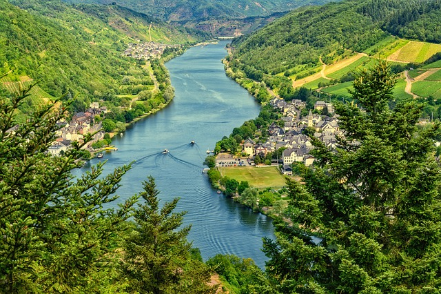
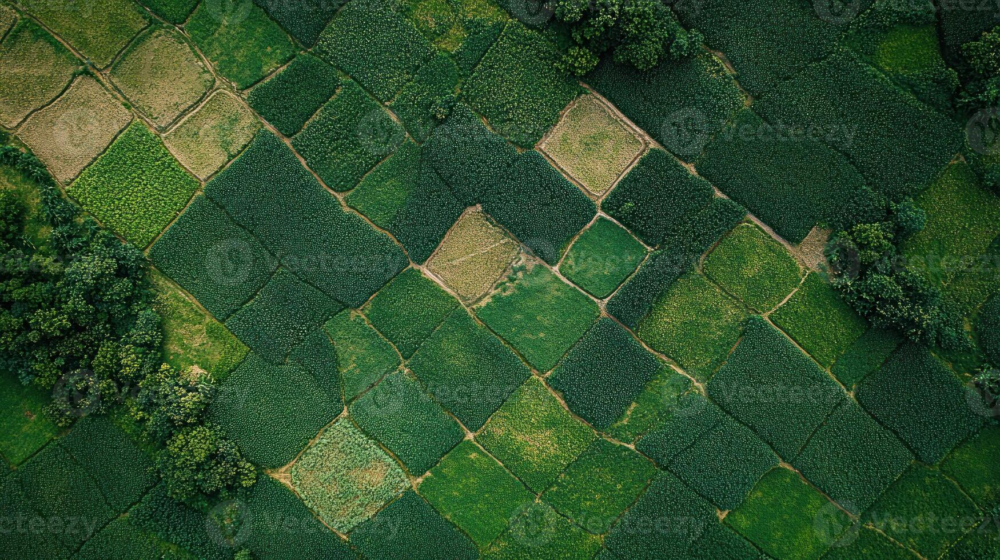
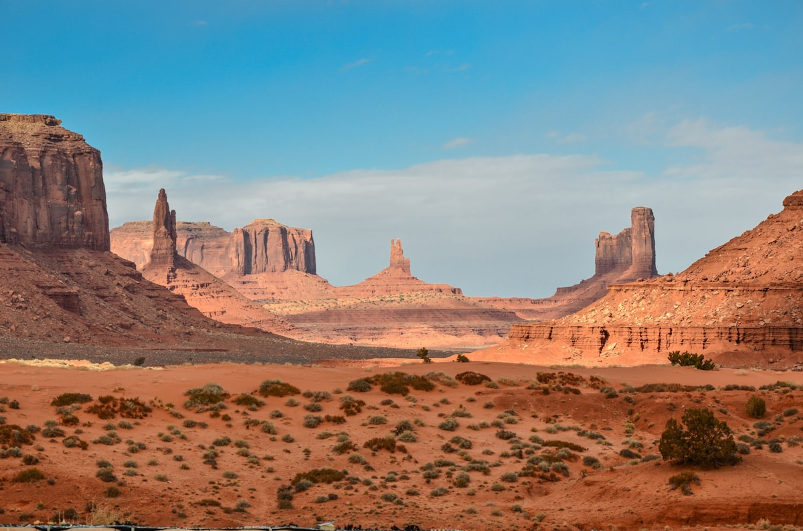
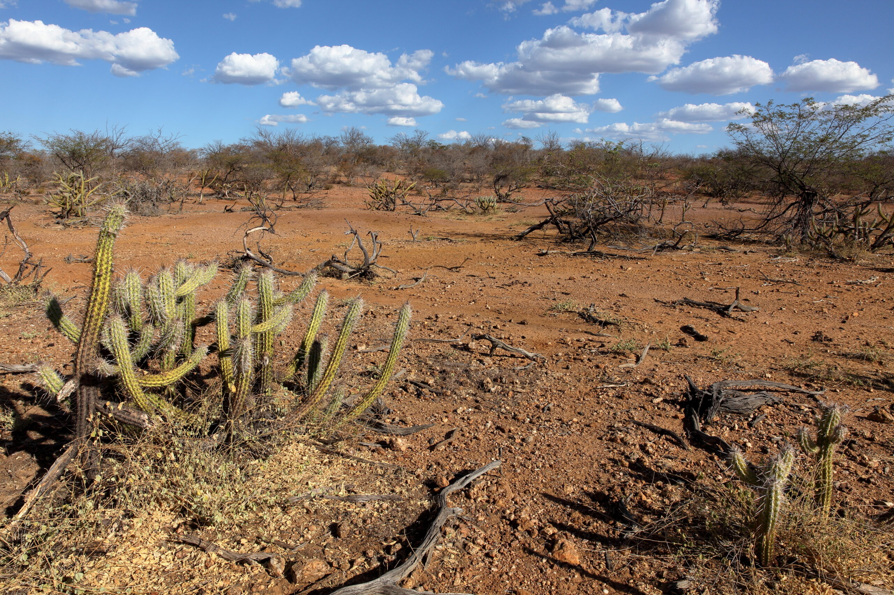
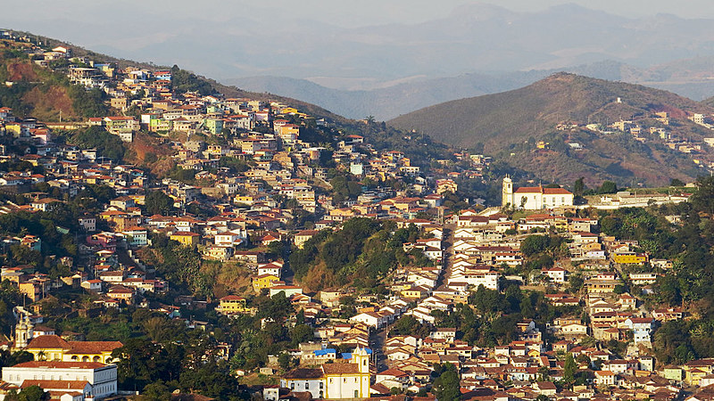
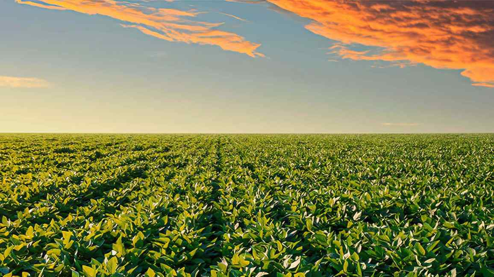
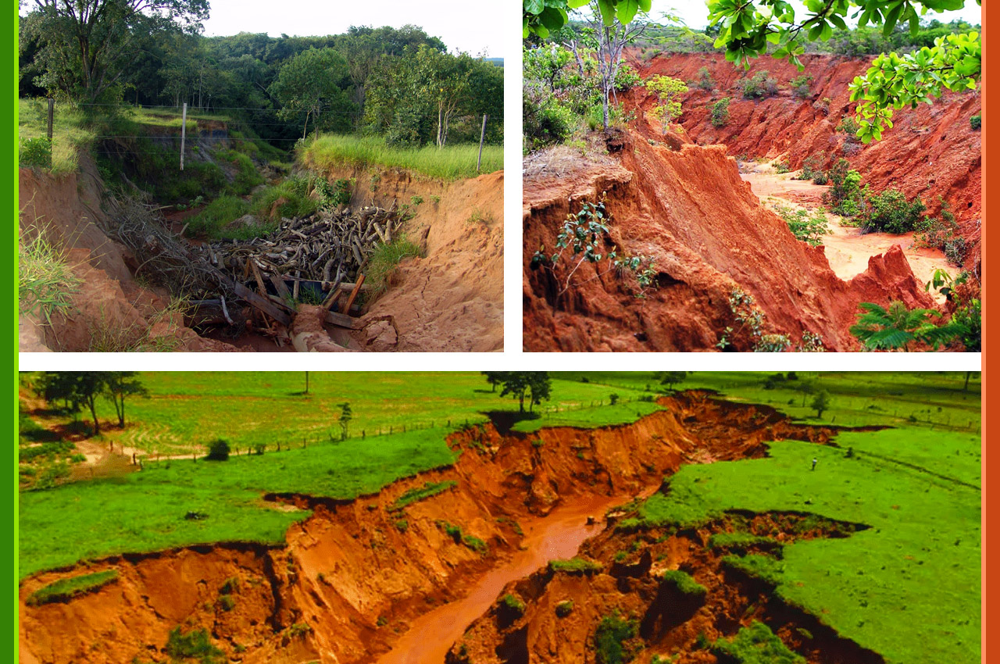
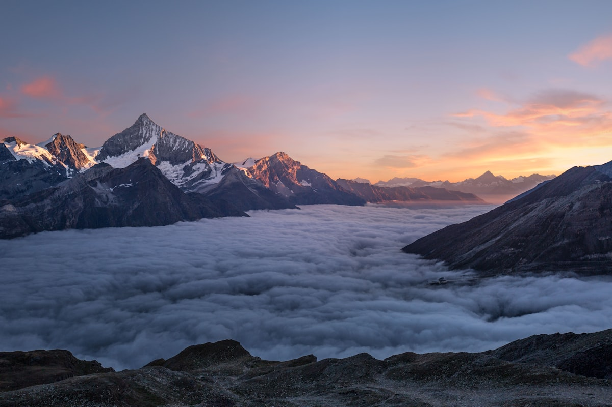
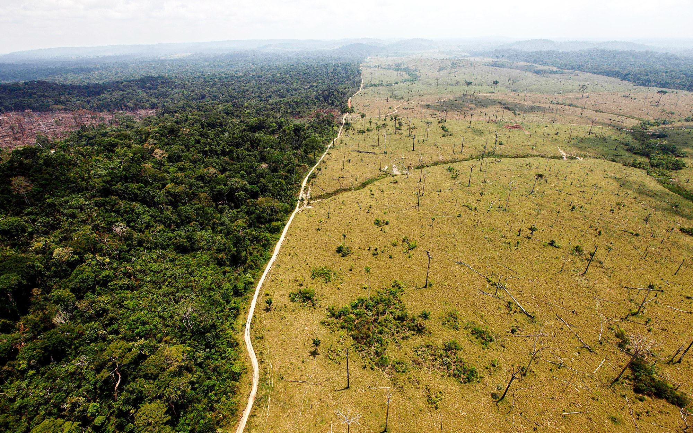
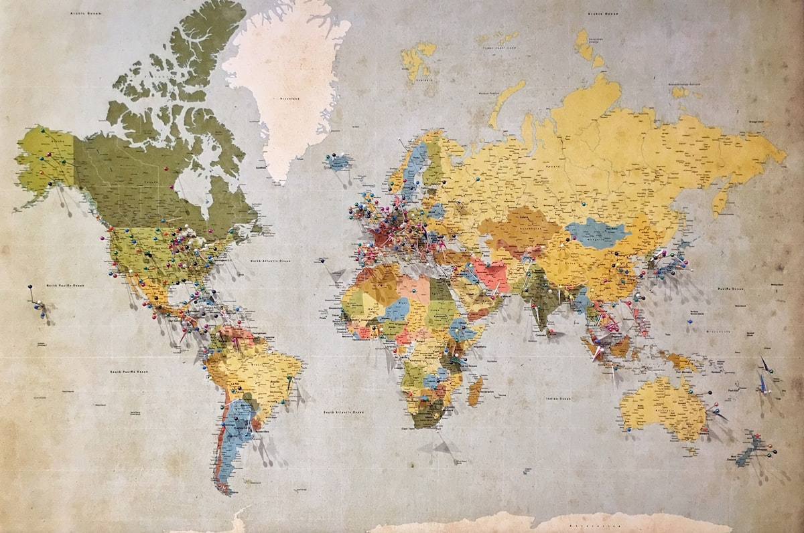

---
title: "Análise da Paisagem"
subtitle: "Aula 06  -  Abordagens Integradoras: Geossistema e Leitura Sistêmica Curso de Geografia"
author: "Luiz Diego Vidal Santos"
format:
  revealjs:
    logo: ../../../assets/logo-uefs.webp
    footer: "UEFS | Análise da Paisagem | Aula 06"
    slide-number: true
    theme: [simple, ../../../assets/uefs.scss]
    controls: true
    width: 1280
    height: 720
    css: ../../../assets/custom.css
    include-after-body:
      - ../../../assets/image-lightbox.html
      - ../../../assets/progress-bar.html
    transition: slide
    background-transition: fade
    preview-links: auto
execute:
  echo: false
---

## Visão Geral da Aula {.smaller-text transition="fade"}

::: {.columns}
::: {.column width="50%"}
### Tópicos

- [1]{.circle} Pensamento sistêmico na Geografia
- [2]{.circle} O conceito de geossistema (Sochava / Bertrand)
- [3]{.circle} Componentes do geossistema: potencial ecológico, exploração biológica e ação antrópica
- [4]{.circle} Integração físico-biótica e socioespacial
- [5]{.circle} Pressões antrópicas e transformação da paisagem
- [6]{.circle} Operacionalização: como aplicar a leitura sistêmica
:::

::: {.column width="50%"}
::: {.info-box}
**Objetivo da Aula**

Compreender o conceito de **geossistema** como modelo de análise integrada da paisagem, articulando componentes físicos, bióticos e socioespaciais em uma perspectiva sistêmica voltada ao diagnóstico territorial.
:::
:::
:::

# [1  -  PENSAMENTO SISTÊMICO NA GEOGRAFIA]{.section-header} {transition="zoom"}

## O que é um sistema? {.smaller-text transition="convex"}

::: {.columns}
::: {.column width="50%"}
### Definição

Um **sistema** é um conjunto de elementos interconectados que funcionam como uma totalidade, com propriedades emergentes.

### Propriedades sistêmicas

- **Estrutura** — arranjo dos componentes
- **Função** — fluxos e processos
- **Entradas / Saídas** — energia, matéria, informação
- **Retroalimentação** — positiva ou negativa
- **Equilíbrio dinâmico** — estacionário, não estático
:::

::: {.column width="50%"}
::: {.highlight-box}
**Tipos de sistemas
**

| Tipo | Características | Exemplo |
|------|----------------|---------|
| Isolado | Sem troca de matéria nem energia | Nenhum na natureza real |
| Fechado | Troca energia, não matéria | Ciclo hidrológico global (aprox.) |
| Aberto | Troca energia e matéria | Bacia hidrográfica, geossistema |

: {.striped .hover}

A paisagem é um sistema aberto: recebe energia solar, precipitação, sedimentos, ações humanas e exporta água, nutrientes, calor, produtos.

{width="100%" fig-align="center"}
:::
:::
:::

---

## Por que pensar a paisagem como sistema? {.smaller-text transition="concave"}

::: {.columns}
::: {.column width="50%"}
### Vantagens da abordagem sistêmica

1. **Integra** componentes estudados separadamente
2. Identifica **fluxos e conexões** entre componentes
3. Oferece linguagem para **mudanças** (perturbação, resiliência, limiar)
4. Conecta **diagnóstico** com **gestão**
5. Supera a dicotomia natureza × sociedade
:::

::: {.column width="50%"}
::: {.info-box}
**Da análise setorial à integrada
**

| Análise setorial | Análise sistêmica |
|-----------------|-------------------|
| Estuda um componente por vez | Estuda as relações entre componentes |
| Geomorfologia *ou* climatologia *ou* biogeografia | Geomorfologia + climatologia + biogeografia + ação humana |
| Mapa temático isolado | Mapa de síntese / carta geoambiental |
| Diagnóstico parcial | Diagnóstico integrado |

: {.striped .hover}

> A análise da paisagem é, por definição, uma análise integrada e sistêmica.

{width="100%" fig-align="center"}
:::
:::
:::

# [2  -  O CONCEITO DE GEOSSISTEMA]{.section-header} {transition="zoom"}

## Sochava e o geossistema soviético {.smaller-text transition="convex"}

::: {.columns}
::: {.column width="50%"}
### Viktor Sochava (1905-1978)

- Geógrafo soviético, propôs o conceito em **1963**
- **Geossistema** = sistema geográfico natural, com troca de energia e matéria entre seus componentes
- Influência da Teoria Geral dos Sistemas (Bertalanffy, 1950)

### Definição

> **Geossistema** é uma unidade territorial dinâmica onde componentes naturais (relevo, clima, água, solos, vegetação) interagem como um sistema aberto.

- Ênfase nos fluxos e nas transformações
- O homem é agente externo que perturba o sistema
:::

::: {.column width="50%"}
::: {.highlight-box}
**Contribuições de Sochava**

1. Trouxe o pensamento sistêmico para a análise da paisagem
2. A paisagem deixa de ser descritiva e passa a ser **funcional**
3. Introduziu a ideia de **limiar**: ultrapassar certos limites leva o sistema a um novo estado (por vezes irreversível)
:::
:::
:::

---

## Sochava: estados e limitações {.smaller-text transition="fade"}

::: {.columns}
::: {.column width="50%"}
### Estados do geossistema

Sochava propôs que o geossistema pode estar em diferentes estados:

| Estado | Descrição |
|--------|-----------|
| Equilíbrio dinâmico | Estável, componentes em balanço |
| Transição | Mudando para novo estado |
| Degradado | Perdeu funcionalidade |

: {.striped .hover}

> A passagem entre estados ocorre quando **limiares** são ultrapassados  -  mudanças que podem ser irreversíveis.
:::

::: {.column width="50%"}
::: {.info-box}
**Limitação do modelo de Sochava**

Na formulação original, a ação humana era tratada como **perturbação externa**  -  não como parte integrante do sistema.

Isso gerava um problema conceitual: como analisar paisagens profundamente transformadas pela sociedade?

> A superação dessa limitação será o ponto central da contribuição de **Bertrand**.

{width="100%" fig-align="center"}
:::
:::
:::

---

## {background-image="img/paisagem_semiarida.jpg" background-size="cover" background-opacity="0.3" transition="fade"}

::: {style="text-align: center; padding: 2em;"}
### Paisagens como sistemas dinâmicos

A transição do modelo de Sochava para Bertrand marca a inclusão do ser humano como componente do geossistema  -  não como agente externo.
:::

---

## Bertrand e o geossistema francês {.smaller-text transition="convex"}

::: {.columns}
::: {.column width="50%"}
### Georges Bertrand (1968/1971)

Adaptou o geossistema para a tradição francesa:

- O geossistema é uma unidade de análise em escala intermediária (dezenas a centenas de km²)
- Três componentes integrados:
  1. **Potencial ecológico**  -  geomorfologia, clima, hidrologia
  2. **Exploração biológica**  -  vegetação, fauna, solos biológicos
  3. **Ação antrópica**  -  uso da terra, ocupação, atividades econômicas

### Diferença frente a Sochava

A ação antrópica é parte do sistema, não perturbação externa. O geossistema inclui o componente humano.
:::

::: {.column width="50%"}
::: {.info-box}
**Os três componentes integrados
**

| Componente | Elementos | Papel |
|-----------|-----------|-------|
| **Potencial ecológico** | Relevo, clima, hidrologia | Base física |
| ↕ | *interação* | *fluxos* |
| **Exploração biológica** | Vegetação, solo, fauna | Componente vivo |
| ↕ | *interação* | *fluxos* |
| **Ação antrópica** | Uso da terra, ocupação, gestão | Componente humano |

: {.striped .hover}

> Os três componentes interagem continuamente — nenhum funciona isolado.

{width="100%" fig-align="center"}
:::
:::
:::

---

## Hierarquia escalar de Bertrand {.smaller-text transition="concave"}

::: {.columns}
::: {.column width="50%"}

| Nível | Escala aprox. | Exemplo (Bahia) |
|-------|:---:|:--------|
| Zona | > 1 000 000 km² | Zona tropical |
| Domínio | ~100 000 km² | Domínio da Caatinga |
| Região natural | 1 000–10 000 km² | Depressão Sertaneja |
| **Geossistema** | **10–100 km²** | **Bacia do rio Jacuípe** |
| Geofácies | 0,1–1 km² | Encosta degradada com capoeira |
| Geótopo | < 0,1 km² | Afloramento rochoso com liquens |

: {.striped .hover}

O geossistema é a escala operacional preferencial  -  grande o suficiente para captar a heterogeneidade, pequeno o suficiente para detalhar.
:::

::: {.column width="50%"}
::: {.highlight-box}
**Observações importantes
**

1. Limites são **gradientes**, não linhas rígidas
2. Classificação **aninhada**: geossistema → geofácies → geótopo
3. Escala depende do **objetivo**:
   - Planejamento regional → geossistema
   - Diagnóstico local → geofácies / geótopo
4. Hierarquia é referência **flexível**, não universal

{width="100%" fig-align="center"}
:::
:::
:::

---

## {background-image="img/relevo_montanha.jpg" background-size="cover" background-opacity="0.25" transition="fade"}

::: {style="text-align: center; padding: 2em;"}
### Do conceito à aplicação

Agora que compreendemos a hierarquia escalar e os fundamentos teóricos, vamos detalhar os **três componentes do geossistema** de Bertrand.
:::

# [3  -  COMPONENTES DO GEOSSISTEMA]{.section-header} {transition="zoom"}

## Potencial ecológico {.smaller-text transition="convex"}

::: {.columns}
::: {.column width="50%"}
### O que compõe o potencial ecológico?

O **potencial ecológico** é a base física sobre a qual a paisagem se organiza:

| Componente | O que condiciona |
|-----------|-----------------|
| Geologia | Litologia, estrutura, resistência |
| Geomorfologia | Relevo, declividade, formas de terreno |
| Clima | Precipitação, temperatura, regime hídrico |
| Hidrologia | Drenagem, disponibilidade hídrica |
| Solos (componente abiótico) | Textura, profundidade, fertilidade |

: {.striped .hover}

Esses componentes definem os limites e as potencialidades do sistema.
:::

::: {.column width="50%"}
::: {.info-box}
**Exemplo: semiárido baiano
**

- Geologia  -  Embasamento cristalino (rochas duras) + bacias sedimentares
- Geomorfologia  -  Pediplanos, inselbergs, depressões interplanálticas
- Clima  -  Semiárido (BSh): chuvas concentradas, déficit hídrico acentuado
- Hidrologia  -  Rios intermitentes, alta evapotranspiração
- Solos  -  Rasos (Neossolos) em áreas cristalinas; mais profundos em sedimentares

> O potencial ecológico do semiárido baiano impõe limites severos ao uso e à ocupação. Ignorá-los é produzir degradação.

{width="100%" fig-align="center"}
:::
:::
:::

---

## Exploração biológica {.smaller-text transition="concave"}

::: {.columns}
::: {.column width="50%"}
### O que compõe a exploração biológica?

A **exploração biológica** é o componente vivo da paisagem:

| Componente | Papel no sistema |
|-----------|-----------------|
| Vegetação | Cobertura, ciclagem de nutrientes, interceptação de chuva |
| Fauna | Polinização, dispersão, predação, decomposição |
| Microrganismos | Decomposição, fixação de N₂, ciclagem |
| Solo biológico | Matéria orgânica, raízes, macrofauna edáfica |

: {.striped .hover}

A exploração biológica medeia a relação entre potencial ecológico e ação antrópica.
:::

::: {.column width="50%"}
::: {.highlight-box}
**Funções ecossistêmicas
**

Funções críticas da vegetação e fauna:

1. **Proteção do solo** — interceptação de chuva, serrapilheira
2. **Regulação hídrica** — infiltração, redução de escoamento
3. **Ciclagem de nutrientes** — decomposição, liberação de minerais
4. **Regulação climática** — evapotranspiração
5. **Habitat e conectividade** — refúgio, corredores ecológicos

> Sem a exploração biológica, o potencial ecológico fica exposto e a degradação se instala.

{width="100%" fig-align="center"}
:::
:::
:::

---

## Ação antrópica {.smaller-text transition="convex"}

::: {.columns}
::: {.column width="50%"}
### O componente humano do geossistema

A **ação antrópica** não é perturbação externa  -  é parte constitutiva:

| Dimensão | Exemplos |
|----------|---------|
| Uso da terra | Agricultura, pecuária, silvicultura |
| Ocupação | Urbanização, infraestrutura, mineração |
| Manejo | Irrigação, adubação, terraceamento |
| Gestão | Áreas protegidas, zoneamento, regulação |
| Cultura | Sistemas tradicionais, identidade, percepção |

: {.striped .hover}
:::

::: {.column width="50%"}
::: {.info-box}
**Tipos de ação antrópica na paisagem
**

1. Transformação direta  -  desmatamento, urbanização, mineração
2. Transformação indireta  -  poluição, mudança climática, espécies invasoras
3. Conservação  -  áreas protegidas, restauração, manejo sustentável
4. Regulação  -  leis, planos diretores, zoneamentos

### Pergunta-chave

> *A ação antrópica na paisagem é sempre degradante?*

Não. Existem sistemas tradicionais (agrofloresta, roça no toco, extrativismo sustentável) que mantêm ou até aumentam a diversidade paisagística. O tipo e a intensidade da ação importam mais que sua mera existência.

{width="100%" fig-align="center"}
:::
:::
:::

---

## Contrastes da ação antrópica {background-color="#1a1a2e" transition="fade"}

::: {.columns}
::: {.column width="50%"}
{width="100%" fig-align="center"}
:::
::: {.column width="50%"}
{width="100%" fig-align="center"}
:::
:::

# [4  -  INTEGRAÇÃO FÍSICO-BIÓTICA E SOCIOESPACIAL]{.section-header} {transition="zoom"}

## O princípio da integração {.smaller-text transition="convex"}

::: {.columns}
::: {.column width="50%"}
### Por que integrar?

Nenhum componente explica a paisagem sozinho:

- Relevo → drenagem → solos → vegetação → uso — **cadeia de condicionamento**
- Relações **bidirecionais** e multiescalares
- Análise setorial = diagnóstico incompleto

### O geossistema como "integrador"

1. Identifica componentes e suas **relações**
2. Mapeia **fluxos e processos**
3. Diagnostica **estados e tendências**
:::

::: {.column width="50%"}
::: {.highlight-box}
**Exemplo de integração: erosão em encosta
**

| Componente | Contribuição |
|-----------|-------------|
| Relevo | Declividade acentuada → potencial erosivo alto |
| Clima | Chuvas concentradas → alta erosividade |
| Solo | Textura arenosa → baixa coesão |
| Vegetação | Removida (desmatamento) → solo exposto |
| Uso | Pastagem sem manejo → compactação → redução de infiltração |

: {.striped .hover}

Resultado: erosão laminar → sulcos → ravinas → voçorocas

Nenhum fator isolado explica o processo. É a combinação (geossistema) que gera a erosão.

> *"A erosão não é um problema de solo  -  é um problema de paisagem."*

{width="100%" fig-align="center"}
:::
:::
:::

---

## Fluxos no geossistema {.smaller-text transition="concave"}

::: {.columns}
::: {.column width="50%"}
### Fluxos de matéria

- **Água** — precipitação → infiltração → drenagem
- **Sedimentos** — erosão → transporte → deposição
- **Nutrientes** — ciclagem biogeoquímica (C, N, P, K)

### Fluxos de energia

- Radiação solar → fotossíntese, evapotranspiração
- Energia cinética da chuva → erosão
- Energia gravitacional → movimentos de massa
:::

::: {.column width="50%"}
::: {.info-box}
**Fluxos de organismos e informação
**

**Organismos:**

- Dispersão de sementes, migração, polinização
- Movimento entre manchas de habitat

**Informação (dimensão socioespacial):**

- Percepção e valores da paisagem
- Conhecimento tradicional, regulação (leis), mercado

> **Fragmentar a paisagem é modificar os fluxos** — e vice-versa.

{width="100%" fig-align="center"}
:::
:::
:::

# [5  -  PRESSÕES ANTRÓPICAS E TRANSFORMAÇÃO]{.section-header} {transition="zoom"}

## Tipos de pressão sobre a paisagem {.smaller-text transition="convex"}

::: {.columns}
::: {.column width="50%"}
### Modelo DPSIR

A Agência Europeia de Meio Ambiente propõe o modelo:

| Componente | Significado |
|-----------|-------------|
| **D**  -  Driving forces | Forças motrizes (crescimento populacional, economia) |
| **P**  -  Pressures | Pressões sobre o ambiente (desmatamento, emissões) |
| **S**  -  State | Estado da paisagem (fragmentação, biodiversidade) |
| **I**  -  Impact | Impactos (perda de serviços ecossistêmicos, degradação) |
| **R**  -  Response | Respostas da sociedade (leis, restauração, gestão) |

: {.striped .hover}
:::

::: {.column width="50%"}
::: {.highlight-box}
**Exemplo: expansão agropecuária no Cerrado
**

- **D**  -  Demanda global por soja e carne
- **P**  -  Desmatamento, uso de agrotóxicos, irrigação
- **S**  -  Paisagem fragmentada; 50% do bioma convertido
- **I**  -  Perda de biodiversidade, assoreamento, redução de vazão
- **R**  -  Código Florestal, Plano ABC, restauração obrigatória (CAR)

O modelo DPSIR ajuda a organizar o diagnóstico da paisagem e a propor respostas adequadas.

{width="100%" fig-align="center"}
:::
:::
:::

---

## Transformação da paisagem: trajetórias {.smaller-text transition="concave"}

::: {.columns}
::: {.column width="50%"}
### Cenários possíveis

Uma paisagem pode seguir diferentes trajetórias:

1. **Estabilidade** — equilíbrio dinâmico
2. **Degradação** — erosão, fragmentação, desertificação
3. **Conversão** — desmatamento → pastagem → agricultura mecanizada
4. **Recuperação** — restauração, regeneração natural
5. **Intensificação** — mais inputs técnicos, mesma cobertura
:::

::: {.column width="50%"}
::: {.info-box}
**Limiares e irreversibilidade
**

> **Limiar** (*threshold*): ponto a partir do qual uma pequena mudança provoca transformação abrupta e potencialmente irreversível.

Exemplos:

- Desmatamento → colapso da polinização
- Perda de matéria orgânica → desertificação
- Fragmentação → extinção local

> Identificar proximidade de limiares é tarefa crítica do diagnóstico.

{width="100%" fig-align="center"}
:::
:::
:::

# [6  -  OPERACIONALIZAÇÃO: ROTEIRO DE ANÁLISE]{.section-header} {transition="zoom"}

## Como aplicar a leitura geossistêmica {.smaller-text transition="convex"}

::: {.columns}
::: {.column width="50%"}
### Roteiro prático (6 etapas)

1. Delimitar a área de estudo (bacia, município, unidade territorial)
2. Caracterizar o potencial ecológico (relevo, clima, hidrologia, solos)
3. Caracterizar a exploração biológica (vegetação, fauna, cobertura)
4. Caracterizar a ação antrópica (uso da terra, ocupação, manejo)
5. Identificar as interações  -  quais fluxos conectam os componentes? Onde há tensão?
6. Produzir síntese  -  diagnóstico integrado (estado, pressões, tendências, diretrizes)
:::

::: {.column width="50%"}
::: {.highlight-box}
**Produtos da análise geossistêmica
**

| Produto | Descrição |
|---------|-----------|
| Mapa de síntese | Integra relevo + uso + cobertura + pressões em uma carta geoambiental |
| Quadro diagnóstico | Síntese textual: potencialidades, fragilidades, conflitos |
| Perfil geoambiental | Corte transversal que mostra relações entre componentes |
| Matriz de interações | Tabela cruzada: componente × pressão × impacto |
| Diretrizes | Recomendações para gestão, conservação, recuperação |

: {.striped .hover}

> Ao longo do semestre, vocês produzirão esses produtos no dossiê de análise da paisagem.

{width="100%" fig-align="center"}
:::
:::
:::

---

## Exercício prático: leitura geossistêmica de Feira de Santana {.smaller-text transition="fade"}

::: {.columns}
::: {.column width="60%"}
### Proposta (grupos de 3-4, 30 min)

Para a paisagem de Feira de Santana, registre:

| Componente | Descreva |
|-----------|----------------|
| Potencial ecológico | Relevo, clima, hidrologia, solos |
| Exploração biológica | Vegetação, conservação |
| Ação antrópica | Usos, ocupação, pressões |

: {.striped .hover}

Responda: (1) Quais fluxos entre os componentes? (2) Principal conflito de uso? (3) Trajetória: estabilidade, degradação, conversão ou recuperação?

### Socialização (15 min)
:::

::: {.column width="40%"}
::: {.info-box}
**Dicas
**

- Use seu conhecimento prévio
- Considere: expansão urbana, pecuária, resquícios de caatinga
- Clima semiárido → déficit hídrico → limitações ao uso

> Exercício retomado em aulas futuras com dados reais.

{width="100%" fig-align="center"}
:::
:::
:::

---

## Para a próxima aula {.smaller-text transition="convex"}

::: {.columns}
::: {.column width="50%"}
### Leitura obrigatória

- METZGER, J. P. (2001). **O que é ecologia de paisagens?** *Biota Neotropica*, v. 1, n. 1-2. *(continuação  -  caso não tenha terminado)*

### Leitura complementar

- FORMAN, R. T. T.; GODRON, M. (1986). **Landscape Ecology**, Cap. 2 (*Patches*).

### Tarefa

Revisar o fichamento de Metzger (2001)  -  será discutido na Aula 07.
:::

::: {.column width="50%"}
::: {.highlight-box}
**Na próxima aula (Aula 07)
**

Entraremos na **Ecologia da Paisagem**:

- O modelo **matriz-mancha-corredor** (Forman & Godron)
- Tipos de manchas: de perturbação, remanescentes, introduzidas
- Conectividade estrutural e funcional
- Implicações para diagnóstico territorial

> A ecologia da paisagem é a base metodológica para grande parte das análises que faremos ao longo do semestre.
:::
:::
:::

---

## Síntese da Aula 06 {.smaller-text transition="fade"}

::: {.info-box}
**O que vimos hoje
**

1. **Pensamento sistêmico** — paisagem como sistema aberto
2. **Sochava** — geossistema, limiares e estados
3. **Bertrand** — potencial ecológico + exploração biológica + ação antrópica
4. **Hierarquia escalar** — do geótopo à zona
5. **Componentes** — base física, componente vivo, uso e gestão
6. **Fluxos** — matéria, energia, organismos, informação
7. **Pressões e trajetórias** — modelo DPSIR, limiares
8. **Roteiro** — 6 etapas da leitura geossistêmica
:::

## {.center background-color="#2135A6" transition="zoom"}

::: {style="text-align: center;"}
[Obrigado!]{.obrigado-fit-text style="color: white;"}

::: {style="color: white; font-size: 0.7em;"}
Luiz Diego Vidal Santos

Universidade Estadual de Feira de Santana (UEFS)

Análise da Paisagem  -  Aula 06
:::
:::