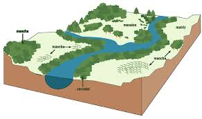
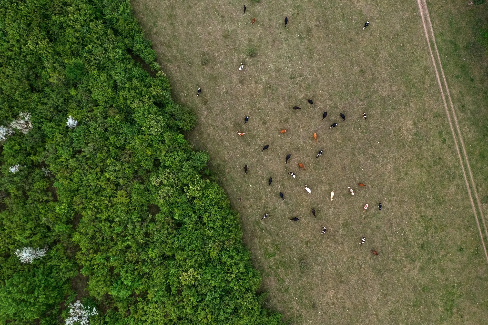
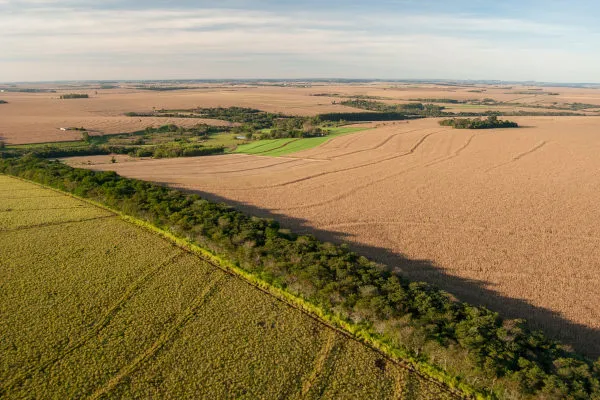

---
title: "Análise da Paisagem"
subtitle: "Ecologia da Paisagem: Matriz, Mancha e Corredor<br>Curso de Geografia"
author: "Luiz Diego Vidal Santos"
format:
  revealjs:
    logo: ../../../assets/logo-uefs.webp
    footer: "UEFS | Análise da Paisagem | Ecologia da Paisagem"
    slide-number: true
    theme: [simple, ../../../assets/uefs.scss]
    controls: true
    width: 1280
    height: 720
    css: ../../../assets/custom.css
    include-after-body:
      - ../../../assets/image-lightbox.html
      - ../../../assets/progress-bar.html
    transition: slide
    background-transition: fade
    preview-links: auto
execute:
  echo: false
---

## Visão Geral da Aula {.smaller-text}

::: {.columns}
::: {.column width="50%"}
### Tópicos

- [1]{.circle} Ecologia da paisagem: duas abordagens, hierarquia e crise da biodiversidade
- [2]{.circle} A paisagem como objeto de estudo: definição, heterogeneidade e formas de representação
- [3]{.circle} O modelo matriz-mancha-corredor
- [4]{.circle} Tipos e atributos de manchas
- [5]{.circle} Corredores: tipos e funções
- [6]{.circle} Conectividade e implicações para diagnóstico
- [7]{.circle} Discussão das leituras (Metzger, 2001; Casimiro, 2009) — *após a leitura*
- [8]{.circle} Atividade avaliativa: resenhas dos artigos
:::

::: {.column width="50%"}
::: {.info-box}
**Objetivo da Aula**

Compreender os fundamentos da **Ecologia da Paisagem**, particularmente o modelo **matriz-mancha-corredor**, e suas implicações para o diagnóstico territorial e o planejamento da conservação.
:::
:::
:::

# [1  -  ECOLOGIA DA PAISAGEM: DUAS ABORDAGENS]{.section-header}

## Abordagem geográfica vs. ecológica {.smaller-text .scrollable}

::: {.columns}
::: {.column width="50%"}
### Abordagem geográfica

- **Origem:** Europa, anos 1930–40 (Carl **Troll**, 1939, Alemanha; depois Naveh, Amat)
- **Contexto histórico:** difusão da fotografia aérea no período pré-2ª Guerra
- **Foco:** relação sociedade-natureza, **paisagens culturais** — o lugar do ser humano
- **Escala:** regional a local; visão **antropocêntrica**
- **Métodos:** cartografia de síntese, trabalho de campo, integração de componentes
- **Aplicação:** zoneamento, planejamento territorial, gestão ambiental

### Herança

Troll, Bertrand, Ab'Sáber, Monteiro → **geossistema** → análise integrada
:::

::: {.column width="50%"}
::: {.info-box}
**Abordagem ecológica**

- **Origem:** EUA, anos 1970–80 (Forman, Turner, McGarigal)
- **Contexto histórico:** resposta à **crise da biodiversidade** (perda de hábitat, fragmentação)
- **Base teórica:** **biogeografia de ilhas** (MacArthur & Wilson, 1967) aplicada a fragmentos terrestres
- **Foco:** efeitos do padrão espacial sobre processos ecológicos
- **Escala:** paisagem (km² a centenas de km²)
- **Métodos:** métricas de paisagem, SIG, modelagem, sensoriamento remoto
- **Aplicação:** conservação, conectividade, planejamento da biodiversidade
:::
:::
:::

::: {.info-box}
**Nesta disciplina**, a abordagem é **integradora**: usamos o referencial geossistêmico (geográfico) para a leitura integrada, e o ferramental da ecologia da paisagem (ecológico) para a análise quantitativa de padrões e processos.
:::

---

## A paisagem como nível de organização da biodiversidade {.smaller-text .scrollable}

::: {.columns}
::: {.column width="55%"}
### Hierarquia da biodiversidade

A paisagem é um dos **níveis hierárquicos** de organização da vida:

**genes → indivíduo → população → espécie → comunidade → ecossistema → paisagem**

A cada nível surgem **processos emergentes** que não existem no nível inferior:

- **Comunidade:** interações entre espécies (polinização, dispersão, predação, parasitismo)
- **Ecossistema:** ciclagem de nutrientes, fluxos de energia
- **Paisagem:** **serviços ecossistêmicos**, conectividade, fluxos entre ecossistemas
:::

::: {.column width="45%"}
::: {.highlight-box}
**Definição operacional (Forman & Godron, 1986)**

> Estudo da **estrutura**, da **função** e da **mudança** em uma área espacialmente heterogênea composta por ecossistemas que interagem.

O **ecólogo de paisagens** se dedica a estudar essa interação de ecossistemas em um espaço **espacialmente explícito** — naturais ou inseridos pela ação humana.
:::

*Por isso falamos em "Ecologia **de** paisagens" — paralela a Ecologia de populações, comunidades, ecossistemas.*
:::
:::

---

## Por que importa: crise da biodiversidade {.smaller-text .scrollable}

::: {.columns}
::: {.column width="50%"}
### O contexto contemporâneo

A Ecologia de paisagens consolidou-se como resposta científica à **crise da biodiversidade** — percepção de que a interferência humana atingiu escala equivalente a uma força geológica (**Antropoceno**).

### Indicadores (WWF — Living Planet Report)

Desde **1970** (linha de base):

- **≈70 %** de declínio nas populações de **vertebrados** monitorados (mamíferos, aves, anfíbios, peixes, répteis)
- **≈85 %** de declínio em populações associadas a **recursos hídricos** (biota aquática)
- **Cerrado:** taxa de conversão **superior à da Amazônia** — "primo pobre" da agenda de conservação
:::

::: {.column width="50%"}
::: {.info-box}
**Aplicações contemporâneas**

- **Serviços ecossistêmicos** (tema mais publicado em 2022–23)
- **Ecologia do movimento** — como organismos enfrentam barreiras na paisagem
- **Doenças emergentes:** hantavirose, febre amarela, malária, **COVID-19** — surgem da degradação e do contato humano-natureza
- **Planejamento territorial** e mudanças climáticas
- **Sensoriamento remoto** e modelagem espacial
:::

::: {.highlight-box}
**Campo multidisciplinar:** ecólogos, geógrafos, geólogos, sociólogos, climatologistas, engenheiros florestais, especialistas em SR. *Não é exclusividade de nenhuma área.*
:::
:::
:::

# [2  -  A PAISAGEM COMO OBJETO DE ESTUDO]{.section-header}

## O que é paisagem? {.smaller-text .scrollable}

::: {.columns}
::: {.column width="50%"}
### Três níveis de definição

**1. Senso comum (dicionário):**

> *"Porção do território que a vista alcança no lance."*

Definição **antropocêntrica**, baseada na percepção humana.

**2. Forman & Godron (1986) — extensão fixa:**

> Área com **alguns quilômetros de extensão**, composta por um grupo de ecossistemas que interagem e se repetem de maneira similar no espaço.

**3. Modelo de mosaico — independente da escala:**

> Área **espacialmente heterogênea** composta por manchas de ecossistemas, definida pela **percepção do organismo de interesse**.
:::

::: {.column width="50%"}
::: {.highlight-box}
**A paisagem depende do organismo**

- Uma **ave de rapina** percebe dezenas de km² de mosaico
- Uma **ave pequena** percebe um fragmento de algumas centenas de m²
- Um **besouro** percebe poucos metros

→ ≈ **2 milhões de espécies** = ≈ 2 milhões de paisagens potenciais.

O modelo de mosaico nos permite trabalhar em **qualquer escala** — formigas, cupins, onças — desde que o organismo e o atributo de interesse estejam definidos.
:::

::: {.info-box}
**Cuidado:** ao olhar com olhos de ecólogo de paisagem, *"a paisagem perde a poesia"* — passamos a ver matriz, mancha, corredor. Vale lembrar que existem outras leituras (estética, cultural, simbólica).
:::
:::
:::

---

## Heterogeneidade: característica fundamental {.smaller-text .scrollable}

::: {.columns}
::: {.column width="50%"}
### Gradiente de heterogeneidade

Paisagens variam de **muito heterogêneas** (mosaico fino de muitas classes) a **muito homogêneas** (uma classe dominante).

*Mas atenção:* a homogeneidade observada **depende do instrumento de medição**. A mesma paisagem pode ser homogênea em uma imagem óptica e heterogênea em LiDAR ou em um mosaico temporal.

### Pergunta-chave do curso

> **Heterogeneidade é boa ou ruim para a biodiversidade?**

Veremos respostas que dependem do organismo, da escala e do tipo de heterogeneidade.
:::

::: {.column width="50%"}
::: {.info-box}
**Fontes naturais de heterogeneidade**

- Enchentes, deslizamentos, fogo natural
- Surtos populacionais (ex.: lagartas desfolhadoras)
- Variação de solos e relevo
- Ações de organismos engenheiros
:::

::: {.highlight-box}
**Fontes antropogênicas**

- Desmatamento; alta frequência de fogo
- Poluição (química, sonora, luminosa)
- Espécies invasoras (acidentais ou intencionais)
- Barramento de rios; alteração de drenagem
- Conversão para agropecuária; fertilização excessiva
:::
:::
:::

---

## Formas de representar a paisagem {.smaller-text .scrollable}

A representação **depende do objetivo, do organismo e do ferramental disponível**:

::: {.columns}
::: {.column width="50%"}
**1. Mosaico de uso da terra** *(mais comum)*

Classes temáticas (ex.: MapBiomas) — áreas naturais, urbanas, agrícolas, água.

**2. Teoria dos grafos / redes**

Manchas como **nós**, conexões como **arestas** — análogo a redes sociais. Identifica clusters, manchas centralizadoras e isoladas.

**3. Gradiente ambiental**

Não há limite binário: hábitats ótimos, subótimos e marginais coexistem ao longo de um gradiente.
:::

::: {.column width="50%"}
**4. Ocorrência do organismo**

Mapa de pontos: padrão **agrupado**, **aleatório** ou **regular** — leitura direta da paisagem pela espécie.

**5. Atributo temático**

- Lagarta → **biomassa** (NDVI)
- Planta → **tipos de solo**
- Polinizador → **floração**

A paisagem é representada pelo **atributo relevante para o organismo de estudo**.
:::
:::

---

## Paisagens modernas: além da estrutura {.smaller-text .scrollable}

Nos últimos ≈ 10 anos, a Ecologia de paisagens ampliou-se para representar **dimensões sensoriais** — não apenas a estrutura física.

::: {.columns}
::: {.column width="50%"}
### Paisagens acústicas (*soundscapes*)

A paisagem é representada pelo **espectro sonoro** dos organismos (aves, morcegos, insetos, anfíbios).

**Hipóteses associadas:**

- **Adaptação acústica** — cada espécie comunica-se de forma ótima no ambiente em que evoluiu; mudar o ambiente prejudica a comunicação
- **Nicho acústico** — cada espécie vocaliza em frequência/horário próprios para evitar sobreposição (análogo à exclusão competitiva)
:::

::: {.column width="50%"}
### Paisagens luminosas (*lightscapes*)

Iluminação artificial 12–24 h/dia altera:

- comportamento de espécies noturnas
- disponibilidade e tipo de presa
- fotoperíodo de plantas e polinizadores

**Poluição luminosa** é tema **negligenciado** no Brasil, especialmente em **áreas protegidas próximas a cidades**.
:::
:::

::: {.info-box}
**Mensagem:** representar uma paisagem é uma **escolha analítica**. Som, luz, biomassa, solos ou classes de uso — cada representação responde a uma pergunta diferente sobre o mesmo espaço.
:::

# [3  -  O MODELO MATRIZ-MANCHA-CORREDOR]{.section-header}

## A paisagem como mosaico {.smaller-text}

::: {.columns}
::: {.column width="50%"}
### O modelo de Forman & Godron (1986)

Toda paisagem pode ser decomposta em **três elementos estruturais**:

1. **Matriz**  -  cobertura **dominante** que controla a dinâmica
2. **Manchas** (*patches*)  -  unidades **discretas** que diferem da matriz
3. **Corredores** (*corridors*)  -  faixas **lineares** que conectam manchas

### Princípio fundamental

> O **arranjo espacial** desses elementos determina os fluxos de energia, matéria e organismos na paisagem.

A mesma quantidade de habitat, arranjada de formas diferentes, produz paisagens com funcionalidades radicalmente distintas.
:::

::: {.column width="50%"}
{width="100%" fig-align="center"}
:::
:::

---

## A matriz {.smaller-text}

::: {.columns}
::: {.column width="50%"}
### O que define a matriz?

A **matriz** é o elemento que:

- Ocupa a **maior extensão** na paisagem
- Exerce o **maior controle** sobre a dinâmica
- Determina o **grau de permeabilidade** ao movimento de organismos
- Define o **contexto** em que manchas e corredores existem

### Critérios de identificação

1. **Área relativa**  -  cobre mais de 50% da paisagem?
2. **Continuidade**  -  é o elemento mais conectado?
3. **Controle**  -  domina os fluxos de matéria e energia?
:::

::: {.column width="50%"}
::: {.info-box}
**Exemplos de matriz
**

| Paisagem | Matriz provável |
|----------|----------------|
| Cerrado fragmentado | Pastagem / soja |
| Amazônia conservada | Floresta ombrófila |
| Zona periurbana de FSA | Pastagem / área urbana |
| Caatinga preservada | Vegetação de caatinga |
| Área irrigada do São Francisco | Agricultura irrigada |

: {.striped .hover}

### Matriz e qualidade

A **qualidade da matriz** (permeabilidade, hostilidade, recurso) influencia diretamente:

- Sobrevivência de organismos fora das manchas
- Probabilidade de dispersão entre manchas
- Serviços ecossistêmicos da paisagem como um todo
:::
:::
:::

---

## Manchas: tipos e origens {.smaller-text .scrollable}

::: {.columns}
::: {.column width="50%"}
### Tipos de manchas (Forman, 1995)

| Tipo | Origem | Exemplo |
|------|--------|---------|
| **Remanescente** | Sobra da cobertura original | Fragmento florestal em área de pastagem |
| **De perturbação** | Causada por distúrbio | Área queimada, clareira de tempestade |
| **De recurso** | Determinada por condições locais | Mata ciliar, vegetação sobre rocha |
| **Introduzida** | Criada pelo ser humano | Plantação, parque urbano, reflorestamento |
| **Efêmera** | Temporária, transitória | Alagamento sazonal, floração temporária |

: {.striped .hover}
:::

::: {.column width="50%"}
::: {.highlight-box}
**Atributos das manchas
**

Para analisar uma mancha, avaliamos:

- **Área** (a)  -  manchas maiores sustentam mais espécies
- **Perímetro** (p)  -  define a extensão da borda
- **Relação área/perímetro**  -  manchas compactas (circulares) têm relação mais favorável
- **Formato** (*shape*)  -  regular vs. irregular; índice de forma
- **Distância ao vizinho**  -  isolamento; distância euclidiana ou de custo
- **Qualidade do habitat**  -  estado de conservação interno

> **Biogeografia de ilhas** (MacArthur & Wilson, 1967): manchas maiores e menos isoladas sustentam mais espécies  -  princípio fundador da ecologia da paisagem.
:::
:::
:::

---

## Efeito de borda {.smaller-text .scrollable}

::: {.columns}
::: {.column width="40%"}
{.fig-compact fig-align="center"}

### O que é efeito de borda?

Zona de transição entre mancha e matriz, onde condições ambientais são **alteradas** (luz, vento, temperatura, umidade), espécies generalistas **penetram** e processos de degradação **se propagam**.

Manchas **pequenas** e **alongadas** têm mais borda relativa; o efeito pode penetrar de **30 m a > 300 m**.
:::

::: {.column width="60%"}
::: {.info-box}
**Exemplo numérico
**

Dois fragmentos florestais com a mesma área (100 ha):

| Atributo | Fragmento circular | Fragmento alongado |
|----------|:---:|:---:|
| Área | 100 ha | 100 ha |
| Perímetro | ~3,5 km | ~6,0 km |
| Borda (100 m penetração) | ~30 ha afetados | ~55 ha afetados |
| **Área-núcleo** | **~70 ha** | **~45 ha** |

: {.striped .hover}

O fragmento alongado perde **mais da metade** de sua área funcional por efeito de borda.

> **Implicação:** ao proteger fragmentos, prefira formas **compactas** com menor relação perímetro/área.
:::
:::
:::

# [4  -  CORREDORES]{.section-header}

## Corredores: tipos e funções {.smaller-text .scrollable}

::: {.columns}
::: {.column width="40%"}
{.fig-compact fig-align="center"}

### O que é um corredor?

Faixa **linear** de cobertura que difere da matriz e pode conectar manchas.

- **Estreitos** (< 50 m) → conduzem, mas não sustentam fauna de interior
- **Largos** (> 200 m) → funcionam como habitat e via de deslocamento
:::

::: {.column width="60%"}
### Tipos

| Tipo | Exemplo |
|------|---------|
| **Ripário** (fluvial) | Mata ciliar ao longo de rios |
| **De linha** | Cercas vivas, renques de árvores |
| **De faixa** | Faixa larga de vegetação entre fragmentos |
| **De estrada** | Vegetação ao longo de rodovias |
| **Funcional** | Sem estrutura contínua, mas com uso comprovado |

: {.striped .hover}

::: {.highlight-box}
**Funções:** conduto, habitat, filtro, barreira, sumidouro (armadilha ecológica).

O **Código Florestal** (Lei 12.651/2012) define APPs ao longo de cursos d'água — **corredores ripários obrigatórios**.
:::
:::
:::

# [5  -  CONECTIVIDADE]{.section-header}

## Conectividade da paisagem {.smaller-text}

::: {.columns}
::: {.column width="50%"}
### Definição

> **Conectividade** é o grau em que a paisagem facilita ou impede o movimento de organismos entre manchas de habitat.  -  Taylor et al. (1993, adaptado)

### Dois tipos

| Tipo | O que mede | Dados |
|------|-----------|-------|
| **Estrutural** | Arranjo físico (distância, adjacência) | Mapa de cobertura |
| **Funcional** | Capacidade real de movimento | Mapa + dados da espécie |

: {.striped .hover}

A conectividade **estrutural** é necessária, mas não suficiente  -  dois fragmentos podem estar próximos, mas separados por uma rodovia intransponível para anfíbios.
:::

::: {.column width="50%"}
::: {.info-box}
**Fatores que influenciam a conectividade
**

1. **Distância entre manchas**  -  mais perto = mais conectado
2. **Qualidade da matriz**  -  permeável ou hostil?
3. **Presença de corredores**  -  facilitam dispersão
4. **Presença de barreiras**  -  rodovias, rios largos, áreas urbanas
5. **Capacidade de dispersão da espécie**  -  aves voam mais que anfíbios
6. **Stepping stones**  -  manchas pequenas que servem como "trampolins"

### Implicação para diagnóstico

Uma paisagem **fragmentada** com alta conectividade pode manter populações viáveis. Uma paisagem **com muitos fragmentos** mas baixa conectividade leva à extinção local.

> **Conectividade** pode ser mais importante que **área total** de habitat em muitos cenários.
:::
:::
:::

---

## Fragmentação: o problema central {.smaller-text .scrollable}

::: {.columns}
::: {.column width="40%"}
{.fig-compact fig-align="center"}

### O que é fragmentação?

Processo pelo qual uma área contínua de habitat é dividida em manchas menores, isoladas por uma matriz de uso diferente.

**Consequências:** perda de habitat, aumento de borda, isolamento, efeito de área, perda de espécies de interior, invasão por generalistas.
:::

::: {.column width="60%"}
::: {.highlight-box}
**Fragmentação no Brasil**

| Bioma | Remanescente (%) | Fragmentação |
|-------|:---:|:---:|
| Mata Atlântica | ~12,4% | Muito alta |
| Cerrado | ~50% | Alta e crescente |
| Caatinga | ~50% | Alta (pouco monitorada) |
| Amazônia | ~80% | Em expansão (arco do desmatamento) |
| Pampa | ~36% | Alta (conversão agrícola) |
| Pantanal | ~83% | Moderada (mas fogo crescente) |

: {.striped .hover}

> A **Mata Atlântica** é o caso mais extremo: poucos fragmentos grandes, milhares de fragmentos pequenos e isolados. A Caatinga caminha para cenário semelhante.
:::
:::
:::

# [6  -  IMPLICAÇÕES PARA DIAGNÓSTICO]{.section-header}

## Da ecologia da paisagem ao planejamento {.smaller-text}

::: {.columns}
::: {.column width="50%"}
### Princípios para o diagnóstico territorial

A ecologia da paisagem fornece princípios operacionais:

1. **Manchas grandes** são insubstituíveis  -  preservar
2. **Conectividade** é essencial  -  manter ou restaurar corredores
3. **Stepping stones** compensam parcialmente a falta de corredores contínuos
4. **Qualidade da matriz** pode ser melhorada  -  agrofloresta, cercas vivas
5. **Efeito de borda** deve ser minimizado  -  formas compactas, zonas-tampão
6. **Heterogeneidade** paisagística sustenta maior biodiversidade que homogeneidade
:::

::: {.column width="50%"}
::: {.info-box}
**Aplicação no dossiê
**

Ao elaborar o dossiê da paisagem, vocês deverão:

- **Identificar** a matriz, as manchas e os corredores da área de estudo
- **Avaliar** tamanho, forma e isolamento das manchas
- **Diagnosticar** conectividade (estrutural, ao menos)
- **Identificar** barreiras e gargalos
- **Propor** diretrizes baseadas nos princípios da ecologia da paisagem

Essas análises serão aprofundadas nas aulas de **métricas** (Aulas 17-18) e **planejamento** (Aulas 21-22).
:::
:::
:::

# [7  -  DISCUSSÃO DA LEITURA]{.section-header}

## Metzger (2001): pontos-chave {.smaller-text}

::: {.columns}
::: {.column width="50%"}
### O que Metzger propõe?

> A ecologia da paisagem é *"o estudo da estrutura, função e dinâmica de áreas heterogêneas compostas por ecossistemas interativos"*  -  adaptado de Forman & Godron (1986)

**Duas abordagens:**

| Abordagem | Ênfase | Origem |
|-----------|--------|--------|
| **Geográfica** | Relação sociedade-natureza; planejamento | Europa (Troll, Naveh) |
| **Ecológica** | Padrão espacial e processos ecológicos | América do Norte (Forman, Turner) |

: {.striped .hover}

Metzger argumenta que **ambas** são necessárias e complementares.
:::

::: {.column width="50%"}
::: {.highlight-box}
**Tríade analítica da paisagem**

```{=html}
<svg viewBox="0 0 620 330" width="100%" role="img" aria-label="Fluxograma cíclico entre estrutura, função e mudança da paisagem">
  <defs>
    <marker id="arrow-flow" markerWidth="12" markerHeight="12" refX="10" refY="6" orient="auto" markerUnits="strokeWidth">
      <path d="M2,2 L10,6 L2,10 Z" fill="#2135A6"></path>
    </marker>
    <filter id="soft-shadow" x="-20%" y="-20%" width="140%" height="140%">
      <feDropShadow dx="0" dy="4" stdDeviation="4" flood-color="#000000" flood-opacity="0.18"></feDropShadow>
    </filter>
  </defs>

  <path d="M160 112 H270" stroke="#2135A6" stroke-width="8" fill="none" marker-end="url(#arrow-flow)"></path>
  <path d="M350 112 H460" stroke="#2135A6" stroke-width="8" fill="none" marker-end="url(#arrow-flow)"></path>
  <path d="M510 188 C510 282 110 282 110 188" stroke="#2135A6" stroke-width="8" fill="none" marker-end="url(#arrow-flow)"></path>

  <g filter="url(#soft-shadow)">
    <rect x="18" y="52" width="150" height="120" rx="16" fill="#E9F0FF" stroke="#2135A6" stroke-width="3"></rect>
    <rect x="235" y="52" width="150" height="120" rx="16" fill="#EAF7EF" stroke="#2E7D32" stroke-width="3"></rect>
    <rect x="452" y="52" width="150" height="120" rx="16" fill="#FFF4E0" stroke="#B26A00" stroke-width="3"></rect>
  </g>

  <text x="93" y="98" text-anchor="middle" font-size="29" font-weight="700" fill="#2135A6">Estrutura</text>
  <text x="93" y="132" text-anchor="middle" font-size="18" fill="#333333">padrão espacial</text>
  <text x="93" y="154" text-anchor="middle" font-size="18" fill="#333333">do mosaico</text>

  <text x="310" y="98" text-anchor="middle" font-size="29" font-weight="700" fill="#2E7D32">Função</text>
  <text x="310" y="132" text-anchor="middle" font-size="18" fill="#333333">fluxos e</text>
  <text x="310" y="154" text-anchor="middle" font-size="18" fill="#333333">processos</text>

  <text x="527" y="98" text-anchor="middle" font-size="29" font-weight="700" fill="#B26A00">Mudança</text>
  <text x="527" y="132" text-anchor="middle" font-size="18" fill="#333333">dinâmica</text>
  <text x="527" y="154" text-anchor="middle" font-size="18" fill="#333333">temporal</text>

  <text x="310" y="262" text-anchor="middle" font-size="21" font-weight="700" fill="#2135A6">retroalimentação</text>
  <text x="310" y="292" text-anchor="middle" font-size="17" fill="#333333">mudanças reorganizam a estrutura da paisagem</text>
</svg>
```
:::
:::
:::

# [8  -  ATIVIDADE AVALIATIVA]{.section-header}

## Resenhas: Metzger + Casimiro {.smaller-text .scrollable}

::: {.columns}
::: {.column width="60%"}
### Proposta

Leia os dois artigos disponibilizados na pasta da aula:

- [Metzger (2001) — *O que é ecologia de paisagens?*](Jbchd6rjY35PGkY5BHPz63S.pdf)
- [Casimiro (2009) — *Estrutura, composição e configuração da paisagem*](pedro_casimiro.pdf)

**Tarefa:** enviar os resumos/resenhas em PDF no formulário da atividade e responder 3 questões.

Antes das questões, envie **dois arquivos PDF**:

1. resumo/resenha de **Metzger (2001)**
2. resumo/resenha de **Casimiro (2009)**

Depois do envio, responda às **3 questões** sobre observador/escala, composição/configuração e aplicação ao modelo matriz-mancha-corredor.

```{=html}
<a href="https://docs.google.com/forms/d/1SL0g-hBGbrWQQw2EgVMFoaYiTp7Y5-QvZRIk57-GsHc/viewform" target="_blank" style="display:inline-flex; align-items:center; gap:0.45rem; margin-top:0.5rem; padding:0.6rem 1.2rem; background:#2135A6; color:#fff; border-radius:0.4rem; text-decoration:none; font-size:0.9rem; font-weight:700; width:fit-content;"><i class="fa-solid fa-arrow-up-right-from-square"></i> Abrir formulário da atividade</a>
```
:::

::: {.column width="40%"}
::: {.info-box}
**Critérios de avaliação**

| Critério | Peso |
|----------|:---:|
| Resumo/resenha de Metzger em PDF | 30% |
| Resumo/resenha de Casimiro em PDF | 30% |
| Respostas às 3 questões | 25% |
| Clareza e autoria | 15% |

: {.striped .hover}

> Os arquivos e respostas devem ser autorais: use os autores como base, mas evite copiar trechos longos dos PDFs.
:::
:::
:::

---

## Exercício em sala: identificação no mosaico {.smaller-text .scrollable}

::: {.columns}
::: {.column width="60%"}
### Prática rápida (em duplas, 20 min)

Será projetada uma imagem de satélite (Google Earth ou MapBiomas) de uma **paisagem fragmentada**.

**Tarefa:**

1. **Identifique a matriz** — qual cobertura domina?
2. **Delimite ≥ 5 manchas** — origem provável (remanescente, perturbação, introduzida, recurso)
3. **Identifique ≥ 2 corredores** (ou a ausência deles)
4. **Avalie qualitativamente:** tamanho, forma, isolamento e conectividade aparente
5. **Proponha** uma intervenção para aumentar a conectividade
:::

::: {.column width="40%"}
::: {.info-box}
**Objetivo**

Transformar os conceitos da resenha em leitura espacial: primeiro reconhecer o mosaico, depois justificar tecnicamente a matriz, as manchas, os corredores e os gargalos de conectividade.
:::
:::
:::

---

## Para a próxima aula {.smaller-text}

::: {.columns}
::: {.column width="50%"}
### Leitura recomendada

- TURNER, M. G.; GARDNER, R. H. (2015). **Landscape Ecology in Theory and Practice**, Cap. 2 (*Causes of landscape pattern*).

### Atividade preparatória

- Finalizar as **duas resenhas** no formulário da Aula 3.1.
- Observar (mentalmente ou com registros) a paisagem no trajeto casa-universidade:

- Que **escalas** de padrão você percebe?
- O que muda quando você "dá zoom" (de longe para perto)?
:::

::: {.column width="50%"}
::: {.highlight-box}
**Na próxima aula (Aula 08)
**

Entraremos em **Escalas espaço-temporais**:

- Escala geográfica vs. escala ecológica
- Hierarquias e níveis de organização
- Padrão e processo: o que vemos depende da escala
- Multiescalaridade na análise da paisagem

E na **Aula 09**:

- Fluxos, permeabilidade e conectividade em detalhe
- Fragmentação, bordas e resiliência
- Vulnerabilidade socioambiental
:::
:::
:::

---

## Síntese da Aula 07 {.smaller-text}

::: {.info-box}
**O que vimos hoje
**

1. **Metzger (2001)**  -  ecologia da paisagem geográfica vs. ecológica; ambas complementares
2. **Modelo matriz-mancha-corredor** (Forman & Godron)  -  base operacional para leitura do mosaico
3. **Matriz**  -  elemento dominante; sua qualidade determina permeabilidade
4. **Manchas**  -  tipos (remanescente, perturbação, recurso, introduzida); atributos (área, forma, isolamento)
5. **Efeito de borda**  -  degradação proporcional ao perímetro; manchas compactas preservam mais área-núcleo
6. **Corredores**  -  tipos e funções (conduto, habitat, filtro, barreira); importância legal (APPs)
7. **Conectividade**  -  estrutural vs. funcional; stepping stones; barreiras
8. **Fragmentação**  -  processo central; consequências ecológicas; situação dos biomas brasileiros
9. **Princípios para diagnóstico**  -  manchas grandes, conectividade, heterogeneidade
:::

## {.center background-color="#2135A6"}

::: {style="text-align: center;"}
[Obrigado!]{.obrigado-fit-text style="color: white;"}

::: {style="color: white; font-size: 0.7em;"}
Luiz Diego Vidal Santos

Universidade Estadual de Feira de Santana (UEFS)

Análise da Paisagem  -  Aula 07
:::
:::