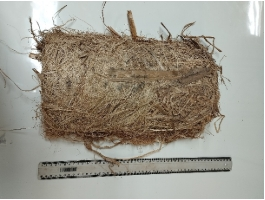
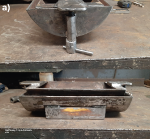
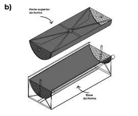
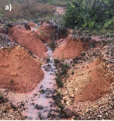

1

**Aplicação de drenos verdes com feixes vivos para estabilização de aterro sanitário desativado**

**Application of Green Drains with Live Bundles for the Stabilization of a Decommissioned Landfill**

**RESUMO** Este estudo tem como objetivo avaliar a aplicação de drenos verdes preenchidos com feixes vivos para a estabilização de encostas em um aterro sanitário desativado. O sistema proposto será composto por fibras naturais de *Thypha dominguensis* (taboa) e *Musa paradisiaca* (bananeira), associadas a feixes vegetativos vivos, organizados em um arranjo do tipo "escama de peixe". Os drenos verdes serão formados por um núcleo drenante composto por fibras de folhas de taboa e bananeira, na proporção de 1/3 de cada, mantidos por um período de 120 dias. Este sistema visa conduzir o excesso de água, promover a infiltração e criar condições favoráveis ao enraizamento dos feixes vivos. O delineamento experimental será inteiramente casualizado, com três tratamentos: controle (CO) e dreno verde (DV), cada um com oito repetições. No primeiro bioensaio, serão analisados: início da germinação das sementes (IGS), porcentagem de germinação (G%), índice de velocidade de germinação (IVG), número de folhas na bandeja (NFB), massa seca da parte aérea na bandeja (MSPAB), comprimento radicular na bandeja (CRB), massa seca radicular na bandeja (MSRB), volume radicular na bandeja (VRB), diâmetro radicular na bandeja (DRB) e densidade radicular na bandeja (DRB). No segundo bioensaio, serão avaliados: altura em vaso (AV), número de folhas em vaso (NFV), comprimento radicular em vaso (CRV), massa seca da parte aérea em vaso (MSPAV), volume radicular no vaso (VRV), diâmetro radicular no vaso (DRV), densidade radicular no vaso (DRV) e dependência de estimulante natural (DEN). Esses parâmetros permitirão avaliar a eficiência dos drenos verdes na promoção da germinação, crescimento e enraizamento dos feixes vivos, bem como sua eficácia na estabilização de encostas e no controle da erosão em áreas degradadas.

**Palavras-chave:** Feixes vivos; Bioengenharia dos solos; Solução baseada na natureza; Revegetação.

**ABSTRACT** This study aims to evaluate the application of green drains filled with live bundles for slope stabilization in a decommissioned landfill site. The proposed system will consist of natural fibers from *Thypha dominguensis* (cattail) and *Musa paradisiaca* (banana plant), combined with live vegetative bundles, arranged in a "fishbone" pattern. The green drains will be composed of a drainage core made from cattail and banana leaf fibers, in a proportion of one-third each, maintained for a period of 120 days. This system is intended to channel excess water, promote infiltration, and create favorable conditions for the rooting of live bundles. The experimental design will be completely randomized, with three treatments: control (CO) and green drain (GD), each with eight replications. In the first bioassay, the following parameters will be evaluated: seed germination onset (SGO), germination percentage (G%), germination speed index (GSI), number of leaves in trays (NLT), shoot dry mass in trays (SDMT), root length in trays (RLT), root dry mass in trays (RDMT), root volume in trays (RVT), root diameter in trays (RDT), and root density in trays (RDenT). In the second bioassay, the assessed parameters will include: plant height in pots (PHP), number of leaves in pots (NLP), root length in pots (RLP), shoot dry mass in pots (SDMP), root volume in pots (RVP), root diameter in pots (RDP), root density in pots (RDenP), and dependence on natural biostimulant (DNB). These parameters will enable the evaluation of the effectiveness of the green drains in promoting seed germination, growth, and rooting of the live bundles, as well as their efficacy in slope stabilization and erosion control in degraded areas.

**Keywords**: Live bundles; Soil bioengineering; Nature-based solutions; Revegetation.

1. **INTRODUÇÃO**

   O controle da erosão dos solos pode ser realizado por meio de diversas técnicas, dentre as quais se destaca o enrocamento (Morokong & Blignaut, 2019). Embora esta seja uma solução altamente eficaz, seus elevados custos tornam inviável sua aplicação em larga escala por exemplo, ao longo das margens de rios (Pietro et al., 2021). Na tentativa de oferecer alternativas e soluções baseadas na natureza, a bioengenharia dos solos tem implementadas diversas soluções, dentre elas a utilização de materiais vivos (Tardio et al., 2018). 

   O uso de materiais vivos na construção de estruturas para o controle de erosão do solo é uma prática antiga. Essa técnica foi amplamente utilizada na Europa Ocidental nos séculos XVIII e XIX, mas caiu em desuso em meados do século XX (Evette et al., 2009) , porém nas últimas décadas, as áreas de geotecnia de solos tem se beneficiado destas técnicas como ferramenta de práticas sustentáveis, impulsionadas por uma maior conscientização ambiental e pela busca por alternativas mais ecológicas às soluções tradicionais de construção cinza (Alqaisi et al., 2020). 

   Tal ressurgimento reflete uma mudança na abordagem da gestão de áreas sujeitas à erosão, privilegiando o uso de técnicas baseadas em materiais vivos, que combinam a proteção contra a erosão com a restauração ecológica das áreas degradadas e uso de biomateriais (Santos et al., 2020). Dentre essas práticas, destacam-se os sistemas que utilizam estacas vivas, que têm se mostrado uma solução eficaz e de baixo impacto ambiental para o reforço de encostas e a estabilização de margens fluviais (Rey et al., 2019).

   ` `Os sistemas de bioengenharia de solo com estacas vivas consistem em unidades formadas por galhos vivos de material vegetal com propagação por estaquia. Com o passar do tempo, as estacas vivas se mostram eficazes no controle da erosão oferecendo um reforço a encostas a partir de seu enraizamento (Rey et al., 2019). A expectativa é que os feixes vivos enraízem e apresentem crescimento aéreo, onde as raízes promovem um reforço adicional do solo, e a cobertura vegetal atue como proteção contra escoamento e fluxos de água. No entanto, a eficácia desse sistema pode ser comprometida por dificuldades na germinação e enraizamento dos feixes.

   O limitado volume para o crescimento das raízes em sistema de plantio por estaquia, torna-se necessário o uso de substratos que sejam capazes de proporcionar fornecimento adequado de água, oxigênio e nutrientes para as plantas, garantindo condições estáveis para a manutenção e durabilidade (Guerra et al., 2020; Kinigopoulou et al., 2023; Soares et al., 2020), uma das formas de induzir o aumento do volume radicular é a utilização de reguladores de crescimento. 

   Para garantir a efetiva implementação das técnicas de controle vegetativo, torna-se fundamental o uso de substratos adequados que ofereçam condições ideais para o desenvolvimento das raízes, como boa retenção de umidade, aeração e oferta controlada de nutrientes. Neste sentido ao utilizar substratos, a escolha do material desempenha papel crucial nesse contexto, pois influencia diretamente a taxa de enraizamento e o vigor das plantas. 

   Porém, muitos produtos industriais produzidos atualmente, são desenvolvidos utilizando matérias primárias de custos altos (Silva Fernandes et al., 2018) tornando o uso destes produtos custoso. Atualmente pesquisas têm se esforçado na busca pela substituição deste material por compostos mais econômicos e que impactem menos o meio ambiente (Araújo Filho et al., 2019). Os compostos desenvolvidos com compostos orgânicos podem atender plenamente esta demanda, principalmente o plantio ambientalmente sustentável, para os que, o uso de fertilizantes sintéticos de elevada solubilidade é proibido (MAPA, 1999).

   Entre os materiais orgânicos mais promissores nesse contexto, destacam-se as fibras naturais (NFs), constituídas predominantemente por microfibrilas de celulose embutidas em uma matriz amorfa composta por lignina e hemicelulose. A estrutura da parede celular dessas fibras pode ser entendida como um compósito natural altamente organizado, no qual diferentes constituintes químicos formam uma arquitetura helicoidal (Satyanarayana et al., 1990). A proporção desses componentes — incluindo celulose, hemicelulose, lignina, ceras, cinzas, pectinas e umidade — varia de acordo com a espécie vegetal, as condições ambientais do cultivo, a taxa de crescimento e o tipo de tecido da planta. Entre esses constituintes, o teor de celulose é particularmente relevante, pois influencia diretamente as propriedades mecânicas das fibras, como resistência e rigidez (Akil et al., 2011).

   A morfologia das fibras vegetais pode ser descrita por meio de um lúmen central, responsável pelo transporte de água e nutrientes, cercado por uma parede celular multicamada. Esta parede é composta pela lamela média, a parede primária e a parede secundária, sendo esta última subdividida em três camadas concêntricas: secundária externa, intermediária e interna (Ray & Sain, 2017). Enquanto a parede primária regula o crescimento celular, as interações entre células e proporciona suporte inicial, a parede secundária, rica em microfibrilas de celulose orientadas, é a principal responsável pela conferência de resistência mecânica à fibra (Chokshi et al., 2022).

   As fibras naturais oferecem vantagens como substratos em sistemas de estaquia, não apenas por sua capacidade de retenção e drenagem equilibrada de água, mas também por promoverem uma aeração adequada às raízes em desenvolvimento (Das et al., 2021). Sua estrutura porosa facilita o crescimento radicular, enquanto sua biodegradabilidade contribui para a integração gradual ao solo, enriquecendo-o com matéria orgânica (Akil et al., 2011; Sen et al., 2016). Além disso, essas fibras funcionam como elementos drenantes eficientes, prevenindo o acúmulo excessivo de umidade e reduzindo riscos de patógenos radiculares, características essenciais para o sucesso na propagação vegetativa e na estabilidade inicial do plantio (Suwinarti et al., 2023).

   Diante da necessidade de adotar soluções que minimizem os impactos ambientais e favoreçam o desenvolvimento vegetal em áreas degradadas, este trabalho tem como objetivo avaliar a eficácia de drenos verdes preenchidos com fibras naturais de taboa e bananeira na indução da germinação, no aprimoramento da dinâmica de enraizamento e no desenvolvimento de feixes vivos para o controle de erosão em encostas de aterro sanitário desativado.

   **Hipóteses**

- O sistema de drenos verdes tipo “espinha de peixe”, com a associação de drenos verdes e feixes vivos, é eficaz no controle da erosão do solo em encostas. 
- Drenos verdes tipo “espinha de peixe” com drenos verdes e feixes vivos são eficientes na drenagem superficial do solo.
- O sistema de drenos verdes tipo “espinha de peixe” com drenos verdes compostos por fibras naturais de taboa e bananeira favorece o desenvolvimento dos feixes vivos e contribuindo para a recuperação ecológica das áreas degradadas.
- O sistema de drenos verdes tipo “espinha de peixe” com drenos verdes compostos por fibras naturais de taboa e bananeira atua como um meio eficiente de retenção de umidade e acumulação de matéria orgânica.

**Objetivo**

Desenvolver e avaliar um dispositivo vivo de drenagem, composto por fibras naturais de *Thypha dominguensis* (taboa) e *Musa paradisiaca* (bananeira) associadas a feixes vegetativos vivos, com a finalidade de estabilizar encostas e controlar processos erosivos em áreas ambientalmente degradadas.

**Objetivos específicos**

- Desenvolver a composição e estrutura dos drenos verdes naturais, utilizando fibras de Taboa e Bananeira, para garantir a estabilização de encostas e promover a regeneração ecológica das áreas degradadas.
- Identificar espécies vegetais mais adequadas para o uso em feixes vivos e drenos verdes naturais, considerando sua adaptação às condições locais e seu desempenho na estabilização de encostas e no controle da erosão.
- Testar a eficiência dos drenos verdes com drenos verdes e feixes vivos na drenagem superficial do solo, analisando sua capacidade de melhorar o escoamento da água em áreas suscetíveis à erosão.

1. **MATERIAL E MÉTODOS**

O experimento será conduzido em uma área de antiga disposição irregular de resíduos sólidos, atualmente integrada ao campus rural da Universidade Federal de Sergipe (UFS). A área, anteriormente utilizada como depósito irregular de lixo (Figura 1a), foi incorporada às atividades acadêmicas com o objetivo de recuperação ambiental e será utilizada como ambiente experimental.  Para a preparação do local, foi realizada a remoção superficial dos resíduos mais recentes e de maior volume (Figura 1b), seguida pela redistribuição controlada dos excedentes e compactação leve do solo(Figura 1c). Este procedimento visou uniformizar o terreno, criar condições adequadas para a instalação dos drenos verdes e dos feixes vegetativos vivos, e minimizar possíveis riscos de instabilidade superficial durante o experimento.

**Figura 1.** a) Lixão irregular desativado, b) limpeza da área e c) redistribuição controlada da área

|||
| :- | :- |
|||

Os feixes vivos serão obtidos a partir de estacas de *Schinus terebinthifolius Raddi* (aroeira), *Spondias lutea* L. (cajá), *Inga marginata Wild* (ingá), *Tapirira guianensis* Aubl (pau-pombo), *Lonchocarpus sericeus* (Poir.) D.C. (falso-ingá), *Mimosa caesalpiniaefolia Benth* (sabiá) e *Genipa americana* L. (genipapo). 

Para a coleta do material vegetativo, foram selecionadas três árvores vigorosas de cada espécie, com base em seu vigor e condição fitossanitária. As amostras foram retiradas da porção basal das plantas, sendo preparadas estacas basais desfolhadas, com comprimento entre 15 e 20 cm e diâmetro variando entre 0,5 e 1,5 cm. Após a coleta, as estacas foram acondicionadas em recipientes com água para evitar a perda de umidade até o momento do plantio em substrato. Posteriormente, todas as estacas foram cortadas de maneira reta no ápice e em ângulo na base.

O dreno verde será confeccionado utilizando fibras vegetais de Taboa (Typha dominguensis) e fibras de como material principal, por suas propriedades de drenagem e resistência. Para manter a sustentabilidade do material, será utilizado um aglutinante natural à base de resina bi-componente derivada de poliol vegetal de mamona, que promoverá a coesão entre as fibras. Além disso, o solvente de origem natural D'limoneno será empregado em 95% da formulação.

Para a produção dos drenos verdes, serão testadas três formulações diferentes, baseadas em combinações das duas espécies.

Para a confecção dos drenos verdes naturais utilizando fibras de Taboa (*Typha dominguensis*), serão avaliadas três frações distintas de composição. A primeira fração (G1) será formada exclusivamente pelo limbo das folhas de Taboa, com a seguinte formulação: 24% de limbo, 44% de fibras das folhas, 20% de resina, 6% de solvente natural e 30% de espessante. A segunda fração (G2) consistirá em 50% de limbo das folhas e 50% de fibras provenientes da bainha foliar de Taboa, sendo composta por 24% de limbo, 20% de fibras da bainha, 20% de resina, 6% de solvente natural e 30% de espessante. Já a terceira fração (G3) terá uma formulação semelhante à fração G2, porém com a substituição do solvente natural D'limoneno por água. As proporções utilizadas serão mantidas: 24% de limbo, 20% de fibras da bainha, 20% de resina, 6% de água e 30% de espessante.

Para a confecção dos drenos verdes naturais com base na bananeira, serão testadas três frações distintas, utilizando diferentes partes da planta. A primeira fração (G1) será composta exclusivamente pelo limbo das folhas de bananeira, sendo a formulação composta por 24% de limbo, 44% de fibras das folhas, 20% de resina natural, 6% de solvente de origem natural e 30% de espessante. Na segunda fração (G2), a composição incluirá 50% de limbo das folhas e 50% de fibras extraídas do pseudocaule da bananeira, com as proporções de 24% de limbo, 20% de fibras do pseudocaule, 20% de resina, 6% de solvente natural e 30% de espessante. Por fim, a terceira fração (G3) terá uma composição semelhante à fração G2, mas com a substituição do solvente natural D'limoneno por água, mantendo as proporções de 24% de limbo das folhas, 20% de fibras do pseudocaule, 20% de resina, 6% de água e 30% de espessante.

**Processamento e Confecção dos drenos verdes**

Como ilustrado na Figura 2, o dreno verde é um dispositivo de drenagem composto por dois subsistemas principais: o tubo de drenagem e os feixes vivos. O tubo é formado a partir de fibras naturais, como folhas de taboa ou bananeira, com uma parede de espessura de 5 mm e um diâmetro total de 20 cm. A estrutura do dreno verde inclui furos distribuídos ao longo das paredes para facilitar a infiltração e drenagem da água superficial, permitindo que o excesso de água seja desviado de maneira eficiente para o dreno polo principal, no sistema tipo "espinha de peixe", assim como mantenha a umidade interna em condições ideais.

**Figura 2.** Dreno verde confeccionado a partir de fibras naturais

|||
| :- | :- |

Além de sua função principal de drenagem e condução da água para o sistema de derivação, o dreno verde também atua como um meio de retenção de umidade, essencial para o desenvolvimento dos feixes vivos. O tubo acumula umidade em seu interior, proporcionando condições favoráveis para o enraizamento e crescimento das plantas, o que reforça a estabilidade do solo. Dessa forma, o dreno verde serve tanto para a drenagem quanto para a criação de um microambiente propício ao desenvolvimento dos feixes vivos, auxiliando no controle da erosão e na recuperação ecológica das encostas.

Para a confecção do dreno verde, o material natural será inicialmente tratado com a resina natural e espessante, até que atinja um teor de umidade de aproximadamente 12%. A mistura dos componentes será realizada por meio de uma encoladeira por cinco minutos, garantindo a uniformidade da distribuição da resina nas fibras. Após a homogeneização, o material será moldado em formas de drenos verdes, seguindo as dimensões pré-determinadas para garantir a integridade estrutural.

O material moldado será submetido a um processo de prensagem a frio em uma forma tipo “U” (Figura 3), utilizando uma prensa hidráulica por 24 horas, o que permitirá a cura da resina sem a aplicação de calor, assegurando a estabilização do dreno verde. 

**Figura 3.** a)** Forma para prensagem hidráulica do dreno verde confeccionados a partir de fibras naturais e b) equema de montagem para prensagem 

|||
| :- | :- |

Após a cura, os drenos verdes apresentarão uma espessura de 5 mm, similar às especificações de materiais geotécnicos como a lã de rocha e a lã de vidro, com densidade aproximada de 0,062 g/cm³.

**Avaliação do Desempenho dos Drenos verdes no sistema tipo espinha de peixe**

Serão realizados testes para avaliar a eficiência dos drenos verdes na promoção de drenagem, estabilização de encostas e sua capacidade de integrar feixes vivos. A germinação e o crescimento das espécies vegetais inseridas serão monitorados para verificar o sucesso do enraizamento e a capacidade de reforço adicional proporcionada pelos feixes vivos.

O sistema de drenagem verde será implementado utilizando feixes vivos de material vegetal, conhecidos como feixes ou ramos, dispostos ao longo de caminhos de drenagem naturais, em áreas suscetíveis à erosão. O sistema será composto por drenos principais, chamados de drenos de polo, que serão instalados ao longo da ravina por onde o fluxo de água naturalmente ocorre Figura 3a. Esses drenos de polo consistem em feixes maiores de ramos vivos que têm a função de coletar e redirecionar o fluxo de água. Fascinas menores, formadas por feixes menores de ramos, serão conectadas de forma oblíqua aos drenos principais, criando um padrão de "espinha de peixe" Figura 3b. 

**Figura 3.** (a) Ravina e sulcos que serão implementados os drenos verdes e (b) esquema de disposição dos drenos naturais no formato espinha de peixe

|||
| :- | :- |

Esse arranjo permite que a água seja desviada de maneira eficiente, reduzindo a velocidade do fluxo superficial, o que favorece a infiltração da água no solo. Além disso, o enraizamento dos feixes vivos ao longo do sistema promove a estabilização do solo, melhorando a coesão do terreno e reduzindo a erosão.

**Avaliação do crescimento da sob influência do estimulante natural – (1º bioensaio)**

Neste bioensaio (1º bioensaio), as mudas selecionadas ao acaso, serão avaliados os seguintes parâmetros: Início da Germinação das Sementes (IGS), porcentagem de germinação (G%), Índice de Velocidade de Germinação (IVG), Altura na Bandeja (AB), Número de Folhas na Bandeja (NFB), Comprimento Radicular na Bandeja (CRB), Massa Seca da Parte Aérea (MSPAB), Massa Seca Radicular na Bandeja (MSRB), Volume Radicular na Bandeja (VRB), Diâmetro Radicular na Bandeja (DRB), Densidade Radicular na Bandeja (DRB).

Para alcançar estes objetivos será realizada a semeadura de duas sementes de BRS Seriema, por célula totalizando 60 sementes para cada tratamento em pó de coco e húmus de equino na porção de 50/50 mantidas por 40 dias, delineadas inteiramente ao acaso conduzidas em três tratamentos, controle (CO), estimulante natural de feijão (ENF), estimulante natural de tiririca (ENT) com 8 repetições para cada tratamento. A seleção das plântulas será realizada após 8 dias, conduzindo-se apenas 1 planta por repetição totalizando 30 plântulas. 

A partir da emergência, das mudas conduzidas com o estimulante natural serão realizadas semanalmente, até o 40º dia após a semeadura, aplicações do extrato aquoso. Para o tratamento controle será utilizado o mesmo substrato, porém não serão realizadas as aplicações do estimulante natural. 

Buscando analisar o Início da Germinação das Sementes (IGS) e a Porcentagem de Germinação (G%), serão realizadas análises diariamente o número de sementes que germinaram, por tratamento (Controle x Estimulante Natural EN) durante 15 dias após a semeadura, o Índice de Velocidade de Germinação (IVG) será calculado de acordo com Maguire [(1962)](https://www.zotero.org/google-docs/?QG2d9W) seguindo a fórmula 1: 

|IVG=N1Q1+N2D2…NnDn|(1)|
| :- | -: |

Onde: 

IVG = índice de velocidade de emergência; 

N = números de brotações verificadas no dia da contagem; 

D = números de dias após a semeadura em que será realizada a contagem. 

Considerou-se brotação as folhas e caule que apresentaram com suas folhas primárias.

Para Altura na Bandeja (AB) e o Número de Folhas na Bandeja (NFB), serão medidas com uma régua milimétrica com auxílio de um paquímetro e contabilizadas semanalmente. A medição será realizada a partir do colo da planta até sua bifurcação principal. O número de folhas será obtido pela contagem direta, considerando inclusive os folíolos que surgiram até 40º dia após a semeadura.

Para a análise do Comprimento Radicular em Bandeja (CRB) serão utilizadas as cinco mudas conduzidas por 40 dias, as quais serão retiradas da bandeja e lavadas em água corrente até a retirada total do substrato. A determinação do comprimento radicular será realizada com auxílio de régua milimétrica.

A avaliação da Massa Seca da Parte Aérea em Bandeja (MSPAB) e Massa Seca Radicular em Bandeja (ASRB) será obtida através da separação das partes por meio de um corte realizado na altura do colo de cinco plantas. Objetivando a preservação da integridade do sistema radicular, as raízes serão colocadas em sacos de papel individuais e posteriormente lavadas em água corrente até total remoção do substrato, a água residual do recipiente passou por uma peneira para retenção das raízes, para posterior secagem.

Os materiais separados serão acondicionados em novos sacos de papel e transferidos para estufa de secagem com circulação forçada de ar, com temperatura média de 60 ° C, por três dias e posteriormente pesados com auxílio de balança semi-analítica.

Para a determinação do Volume Radicular na Bandeja (VRB), Diâmetro Radicular na Bandeja e Densidade Radicular na Bandeja (DRB) as raízes das mudas serão digitalizadas em placa digitalizadora, processadas pelo software SAFIRA, que forneceu dados de volume em milímetros (cm³) e diâmetro ponderado (mm).

O Sistema de Análise de Fibras e Raízes (SAFIRA) é o sucessor do Software SIARCS® (Sistema Integrado para Análise de Raízes e Cobertura do Solo), pois este apresenta limitações de análises, tais como ferramentas morfológicas [(Jorge & Rodrigues, 2008)](https://www.zotero.org/google-docs/?U24uF4). Já a densidade radicular será obtida pela utilizando a equação 1:

|Densidade radicular gcm³=massa radicular gvolume radicular cm³ 	|(1)|
| :- | -: |

Para a adubação de cobertura desta fase, será realizada a partir do 15º dia de incubação duas aplicações via foliar 1 mL de solução nutritiva, formulada com 04% de nitrogênio total – 02% de fósforo e 04% de potasio – K2O, apresentando 125 a 140 PPM, em 1L de água para todas os tratamentos.

As bandejas contendo as mudas de (*Capsicum chinense*) nos respectivos tratamentos serão mantidas por até 40 dias após a semeadura, desta forma serão conduzidas 4 repetições para análise dos dados durante o primeiro ensaio e as 4 demais repetições restantes de cada continuarão para segundo bioensaio. 

**Avaliação da precocidade e da produção conduzidos no substrato (2o bioensaio)**

Neste segundo bioensaio serão analisados os resultados de Altura em vaso (AV), número de folhas em vaso (NFV), comprimento radicular em vaso (CRV), massa seca da parte aérea em vaso (MSPAV), volume radicular no vaso (VRV), diâmetro radicular em vaso (DRV), densidade radicular em vaso (DRV), precocidade da floração (PFr), número de flores (NFl), e dependência de estimulante natural (DEN).

Para isso, após os 40 dias de emergência, serão selecionadas e distribuídas ao acaso cinco repetições dos três tratamentos oriundas das mudas do primeiro bioensaio, estas serão transplantadas para os substratos e conduzidas em uma estufa agrícola. Para o transplantio será utilizado um substrato composto por Turfa, Perlita e húmus na porção de (1/3). As mudas transplantadas serão mantidas em sacos plásticos, com capacidade aproximada de 2 kg.

A determinação da altura em vaso (AV), número de folhas em vaso (NFV), comprimento radicular em vaso (CRV), massa seca da parte aérea em vaso (MSPAV), volume radicular no vaso (VRV), diâmetro radicular em vaso (DRV) e densidade radicular em vaso (DRV), serão realizadas seguindo a mesmas técnicas realizadas no primeiro bioensaio utilizando as mudas que serão conduzidas no segundo bioensaio.

A precocidade da floração (PFr), serão contabilizados, a cada cinco dias, a partir da inflorescência até a colheita. 

**Aplicação dos drenos verdes com Feixes Vivos**

Os drenos verdes serão preenchidos com feixes vivos de espécies vegetais adaptadas a região tropical dos tabuleiros costeiros. Espécies que sejam capazes de enraizar rapidamente e contribuir para a estabilização do solo. A combinação do material natural com os feixes vegetais permitirá não só o reforço físico das encostas e margens fluviais, mas também a restauração ecológica da área, promovendo a regeneração da vegetação nativa e o controle da erosão.

**Análise estatística** 

Os resultados referentes à porcentagem de germinação (G%), massa seca da parte aérea (MSPA), massa seca da parte radicular (MSPR) e comprimento radicular (CR), tanto para o primeiro quanto para o segundo bioensaio, além da dependência de estimulante natural (DEN), serão analisados por meio de análise de variância (ANOVA), com delineamento experimental inteiramente casualizado e 8 repetições. A normalidade dos dados será verificada pelos testes de Kolmogorov-Smirnov (Berger e Zhou, 2014) e Shapiro-Wilk (Shapiro e Wilk, 1965), e a homogeneidade das variâncias será avaliada pelo teste de Levene (Schultz, 1985). 

Nos casos em que a homogeneidade e a normalidade dos dados não forem atendidas, será aplicado o procedimento de bootstrapping (1000 reamostragens; 95% IC BCa) para corrigir desvios e fornecer intervalos de confiança robustos para as médias (Haukoos e Lewis, 2005). As comparações entre grupos serão realizadas pelo teste de Bonferroni, garantindo a significância para p < 0,05. Além disso, os dados referentes à altura (A) e número de folhas (NF) para o primeiro e segundo bioensaio serão analisados por meio de regressão linear múltipla (método forward), com o objetivo de explorar as relações entre as variáveis. Todas as análises serão realizadas utilizando o software IBM® SPSS® (SPSS Corp, 2017).

**Referências**

Akil, H. M., Omar, M. F., Mazuki, A. A. M., Safiee, S., Ishak, Z. A. M., & Abu Bakar, A. (2011). Kenaf fiber reinforced composites: A review. *Materials & Design*, *32*(8–9), 4107–4121. https://doi.org/10.1016/j.matdes.2011.04.008

Alqaisi, R., Le, T. M., & Khabbaz, H. (2020). *Applications of Recycled Sustainable Materials and By-Products in Soil Stabilization* (pp. 91–117). https://doi.org/10.1007/978-3-030-34199-2\_7

Araújo Filho, R. N., Primo, D. C., Dias, J. L. A., Marinho Junior, J. L., Piscoya, V. C., Cunha Filho, M., Pimentel, R. M. de M., Fernandes, M. M., Pedrotti, A., Holanda, F. S. R., & Gomes Filho, R. R. (2019). Effect of indolebutyric acid on rooting and budding of cuttings of Glyicidium sepium. *Journal of Environmental Analysis and Progress*, 297–303. https://doi.org/10.24221/jeap.4.4.2019.2633.297-303

Chokshi, S., Parmar, V., Gohil, P., & Chaudhary, V. (2022). Chemical Composition and Mechanical Properties of Natural Fibers. *Journal of Natural Fibers*, *19*(10), 3942–3953. https://doi.org/10.1080/15440478.2020.1848738;WEBSITE:WEBSITE:TFOPB;PAGEGROUP:STRING:PUBLICATION

Das, P. P., Acharya, A., & Chaudhary, V. (2021). Influence of Moisture Uptake on the Mechanical Properties of Natural Fiber-Reinforced Polymer Composites. In *Composite Materials* (pp. 213–222). CRC Press. https://doi.org/10.1201/9781003080633-12

Evette, A., Labonne, S., Rey, F., Liebault, F., Jancke, O., & Girel, J. (2009). History of Bioengineering Techniques for Erosion Control in Rivers in Western Europe. *Environmental Management*, *43*(6), 972–984. https://doi.org/10.1007/s00267-009-9275-y

Guerra, A. M. N. de M., Silva, M. G. M., & Evangelista, R. S. (2020). Ambientes de cultivo e volume do vaso influenciam a produção de biomassa e óleo essencial de manjericão. *Revista Caatinga*, *33*(01), 135–141.

Kinigopoulou, V., Hatzigiannakis, E., Stefanou, S., Guitonas, A., & Oikonomou, E. K. (2023). Utilization of Vermicompost Sludge Instead of Peat in Olive Tree Nurseries in the Frame of Circular Economy and Sustainable Development. *AgriEngineering*, *5*(3), 1630–1643. https://doi.org/10.3390/agriengineering5030101

MAPA, M. do M. A. P. e do A. (1999). <i>Instrução Normativa No 7, DE 17 de maio de 1999: Estabelece as normas de produção, tipificação, processamento, envase, distribuição, identificação e de certificação da qualidade para os produtos orgânicos de origem vegetal e animal.</i> http://agroecologia.gov.br/sites/default/files/publicacoes/IN 007.pdf

Morokong, T., & Blignaut, J. N. (2019). Benefits and costs analysis of soil erosion control using rock pack structures: The case of Mutale Local Municipality, Limpopo Province, South Africa. *Land Use Policy*, *83*, 512–522. https://doi.org/10.1016/j.landusepol.2019.02.010

Pietro, P. D., Lelli, M., Rahman, A., & Serkandi. (2021). Hydraulic Tests and Interpretation of Test Data for Reno Mattresses in Open Channel Flow. *IOP Conference Series: Earth and Environmental Science*, *930*(1), 012025. https://doi.org/10.1088/1755-1315/930/1/012025

Ray, D., & Sain, S. (2017). Plant fibre reinforcements. In *Biocomposites for High-Performance Applications* (pp. 1–21). Elsevier. https://doi.org/10.1016/B978-0-08-100793-8.00001-6

Rey, F., Bifulco, C., Bischetti, G. B., Bourrier, F., De Cesare, G., Florineth, F., Graf, F., Marden, M., Mickovski, S. B., & Phillips, C. (2019). Soil and water bioengineering: Practice and research needs for reconciling natural hazard control and ecological restoration. *Science of the Total Environment*, *648*, 1210–1218. https://doi.org/10.1016/j.scitotenv.2018.08.217

Santos, L. D. V., Holanda, F. S. R., Pedrotti, A., Andrade, C. E. C. de, & Bandeira, A. A. (2020). Prospecção tecnológica sobre PD&I em Recursos Hídricos. *Revista Ibero-Ameriana de Ciências Ambientais*, 25.

Satyanarayana, K. G., Sukumaran, K., Mukherjee, P. S., Pavithran, C., & Pillai, S. G. K. (1990). Natural fibre-polymer composites. *Cement and Concrete Composites*, *12*(2), 117–136. https://doi.org/10.1016/0958-9465(90)90049-4

Sen, T., Rai, R. N., & Paul, A. (2016). Damage and Degradability Study of Pretreated Natural Fiber-Reinforced Polymers Composites and Its Comparative Analysis with Artificial Fiber-Reinforced Polymers Composites. In *Reference Module in Materials Science and Materials Engineering*. Elsevier. https://doi.org/10.1016/B978-0-12-803581-8.04106-0

Silva Fernandes, F. C., Gomes Dias, G., & Paula Ribeiro, S. (2018). Análise dos custos logísticos de importação do fertilizante classificado com NCM 3105.10. 00: estudo de casos de empresas sediadas em Três Lagoas-MS. *Observatorio de La Economía Latinoamericana*, *agosto*.

Soares, F. C., Russi, J. L., Dubal, Í. T. P., & Bortolás, F. A. (2020). Avaliação do efeito do estresse hídrico no desenvolvimento radicular e produção de pimenta ornamental/Evaluation of the effect of water stress on radicular development and ornamental pepper production. *Brazilian Journal of Development*, *6*(4), 21037–21045.

Suwinarti, W., Yuliansyah, Wulandari, N. T., & Haqiqi, M. T. (2023). Potential of natural fiber based on plant characteristics. *IOP Conference Series: Earth and Environmental Science*, *1282*(1), 012036. https://doi.org/10.1088/1755-1315/1282/1/012036

Tardio, G., Mickovski, S. B., Rauch, H. P., Fernandes, J. P., & Acharya, M. S. (2018). The Use of Bamboo for Erosion Control and Slope Stabilization: Soil Bioengineering Works. In *Bamboo - Current and Future Prospects*. InTech. https://doi.org/10.5772/intechopen.75626

