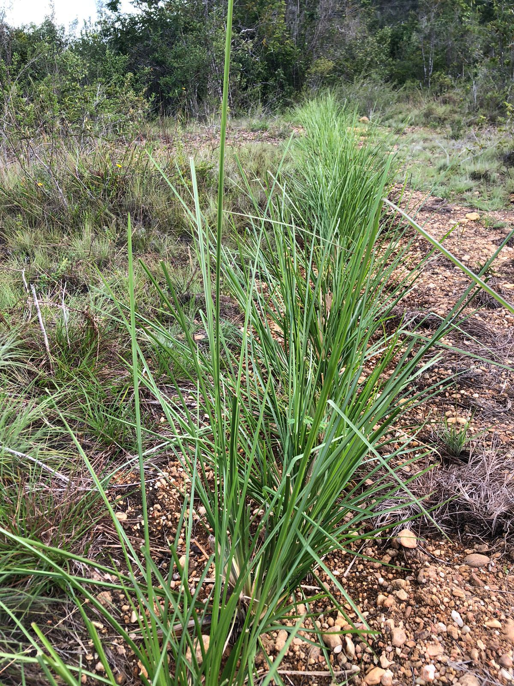
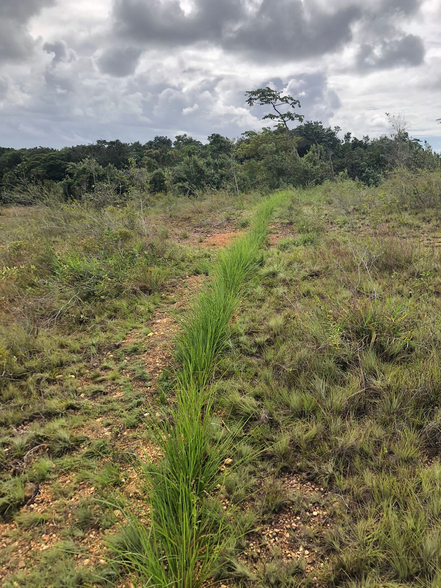

## Visão Geral da Aula {.smaller-text}

::: {.columns}
::: {.column width="50%"}
### Tópicos

- [1]{.circle} O que são cordões vegetativos?
- [2]{.circle} Fascinas mortas × fascinas vivas
- [3]{.circle} Mecanismo de dissipação de energia
- [4]{.circle} Dimensionamento e espaçamento
- [5]{.circle} Materiais e confecção
- [6]{.circle} Implantação em campo
- [7]{.circle} Monitoramento e eficiência
- [8]{.circle} Síntese e atividade
:::

::: {.column width="50%"}
::: {.info-box}
**Objetivo da Aula**

Compreender os princípios dos **cordões vegetativos** (*wattle fences / contour fascines*) e das **fascinas de contenção** como técnicas de bioengenharia para **controlar o escoamento superficial**, **reter sedimentos** e promover a **estabilização progressiva de encostas** por meio do enraizamento das fascinas vivas.
:::
:::
:::

# [1. O QUE SÃO CORDÕES VEGETATIVOS?]{.section-header}

## Definição e conceito {.smaller-text}

::: {.columns}
::: {.column width="55%"}

### Conceito

**Cordões vegetativos** (*cordonas*, *wattle fences* ou *contour fascines*) são pequenos degraus ou barreiras construídos com **feixes de ramos** ou **solo ensacado**, dispostos em **curvas de nível** ao longo de um talude para:

- **Reduzir** a velocidade do escoamento superficial
- **Reter** sedimentos transportados pela água
- **Criar** patamares de deposição que favorecem a revegetação
- **Enraizar** (quando feitos com ramos vivos) e estabilizar o solo

::: {.highlight-box}
💡 Os cordões funcionam como uma série de **micro-barragens em nível**: cada cordão intercepta o fluxo, reduz a energia e deposita sedimentos, formando gradualmente **terraços naturais**.
:::
:::

::: {.column width="45%"}

### Princípio de funcionamento

```{mermaid}
%%| fig-width: 4.5
graph TD
    A["Chuva"] --> B["Escoamento<br>superficial"]
    B --> C["Cordão 1<br>(topo)"]
    C -->|"Velocidade<br>reduzida"| D["Cordão 2<br>(meio)"]
    D -->|"Sedimentos<br>retidos"| E["Cordão 3<br>(base)"]
    C -->|"Infiltração<br>aumentada"| F["Solo"]
    E --> G["Fluxo controlado<br>na base"]
    style A fill:#4FC3F7,color:#000
    style C fill:#2E7D32,color:#fff
    style D fill:#2E7D32,color:#fff
    style E fill:#2E7D32,color:#fff
    style F fill:#8B4513,color:#fff
```

> Cada cordão pode reter até **0,5-2,0 m³ de sedimento** por metro linear, dependendo da altura e do espaçamento (Florineth, 2004).
:::
:::

## Galeria: Cordões e entrançados em campo {.smaller-text}

::: {.columns}
::: {.column width="33%"}

{width="100%"}

:::

::: {.column width="33%"}

{width="100%"}

:::

::: {.column width="33%"}

{width="100%"}

:::
:::

:::{.smaller-text}
Fontes: Wikimedia Commons - licenças CC BY-SA
:::

---

## Cordões de contorno em campo {.smaller-text}

::: {.columns}
::: {.column width="50%"}

{fig-align="center" width="100%"}
:::

::: {.column width="50%"}

{fig-align="center" width="100%"}
:::
:::

::: {.highlight-box}
📷 **Registro de campo:** os cordões de contorno documentados acima ilustram a aplicação prática da técnica em encostas do Semiárido, evidenciando a interceptação do escoamento e o início da formação de micro-terraços naturais.
:::

## Tipos e variações {.smaller-text}

::: {.columns}
::: {.column width="50%"}

### Classificação

| Tipo | Material | Mecanismo |
|------|----------|-----------|
| Cordão de ramos mortos | Galhos secos | Barreira física |
| Cordão de ramos vivos | Estacas vivas | Barreira + enraizamento |
| Cordão de sacos | Sacos de terra/areia | Barreira por peso |
| Entrançado vivo | Ramos vivos trançados em estacas | Barreira + cobertura |

### Quando usar cada tipo

- **Ramos mortos**: áreas sem acesso a espécies com propagação vegetativa
- **Ramos vivos**: encostas com possibilidade de enraizamento (preferível!)
- **Sacos de terra**: emergências / solos muito íngremes
- **Entrançado vivo**: taludes com insolação e umidade adequadas

:::

::: {.column width="50%"}

### Comparação com técnicas anteriores

```{mermaid}
%%| fig-width: 5
graph LR
    A["🪵 Paliçadas<br>Barreiras verticais<br>em ravinas"] -->|"Função<br>similar"| D["Controle de<br>escoamento"]
    B["🌿 Cordões<br>Degraus em nível<br>em encostas"] -->|"Complementa"| D
    C["🕳️ Barraginhas<br>Captação pontual<br>em estradas"] -->|"Diferente<br>escala"| D
    style A fill:#586BA6,color:#000
    style B fill:#2E7D32,color:#fff
    style C fill:#2135A6,color:#fff
```

::: {.highlight-box}
🔄 **Paliçadas** são barreiras em ravinas (erosão concentrada); **cordões** são distribuídos em toda a encosta (erosão laminar/sulcos). São **complementares**: paliçadas na ravina + cordões na encosta adjacente.
:::
:::
:::

# [2. FASCINAS MORTAS × FASCINAS VIVAS]{.section-header}

## Comparação detalhada {.smaller-text}

::: {.columns}
::: {.column width="50%"}

### Fascinas mortas (*dead fascines*)

- Feixes de ramos **secos** ou tratados
- Função: apenas **barreira mecânica**
- Durabilidade: 2-5 anos (depende da espécie e clima)
- Sem capacidade de enraizamento
- Necessitam **substituição** periódica
- Uso: barreiras temporárias, estruturas de sacrifício

### Fascinas vivas (*live fascines*)

- Feixes de ramos **vivos** com capacidade vegetativa
- Função: **barreira + enraizamento + revegetação**
- Durabilidade: **crescente** (plantas se desenvolvem)
- Enraizamento progressivo estabiliza o solo
- **Autorreparação** e expansão vegetativa
- Uso: solução definitiva de bioengenharia

:::

::: {.column width="50%"}

### Evolução temporal comparativa

| Período | Fascina morta | Fascina viva |
|---------|--------------|--------------|
| Dia 0 | 100% funcional | 100% funcional |
| Ano 1 | 90% funcional | 100% + brotação |
| Ano 2 | 70% funcional | 120% (raízes) |
| Ano 3 | 50% funcional | 150% (cobertura) |
| Ano 5 | **Substituir** | **Ecossistema** |

### Vantagem da fascina viva

```{mermaid}
%%| fig-width: 4.5
graph TD
    A["Fascina viva<br>instalada"] --> B["Brotação<br>(2-4 semanas)"]
    B --> C["Enraizamento<br>(2-6 meses)"]
    C --> D["Cobertura vegetal<br>(6-12 meses)"]
    D --> E["Cordão vivo<br>permanente"]
    E --> F["Micro-terraço<br>estabilizado"]
    style A fill:#8B4513,color:#fff
    style B fill:#586BA6,color:#000
    style D fill:#2E7D32,color:#fff
    style F fill:#2E7D32,color:#fff
```

::: {.highlight-box}
🌿 **Sempre que possível**, use fascinas vivas. O custo adicional de obtenção de ramos vivos é compensado pela **eliminação de manutenção** a longo prazo.
:::
:::
:::

# [3. MECANISMO DE DISSIPAÇÃO DE ENERGIA]{.section-header}

## Hidráulica do escoamento em encostas {.smaller-text}

::: {.columns}
::: {.column width="55%"}

### Sem cordões (escoamento livre)

A velocidade do escoamento em um talude sem proteção aumenta progressivamente:

$$v = C \sqrt{R \cdot S}$$

Onde (fórmula de Chézy):

- $v$ = velocidade do escoamento (m s⁻¹)
- $C$ = coeficiente de Chézy (rugosidade)
- $R$ = raio hidráulico (m)
- $S$ = declividade do talude (m m⁻¹)

### Com cordões (escoamento interceptado)

Os cordões **aumentam a rugosidade** ($C$ diminui) e **reduzem o comprimento de rampa** ($L$ se torna o espaçamento entre cordões):

$$v_{max} = v_0 \times \left(\frac{L_{cordão}}{L_{total}}\right)^{0.5}$$

::: {.highlight-box}
📉 Cada cordão **reinicia** o acúmulo de velocidade, mantendo $v$ abaixo da velocidade crítica de erosão do solo.
:::
:::

::: {.column width="45%"}

### Velocidades críticas de erosão

| Tipo de solo | $v_{crit}$ (m s⁻¹) |
|-------------|---------------------|
| Areia fina | 0,3 - 0,5 |
| Areia grossa | 0,5 - 0,8 |
| Silte | 0,6 - 1,0 |
| Argila mole | 0,8 - 1,2 |
| Argila compactada | 1,2 - 1,8 |

### Efeito dos cordões no tempo

```{mermaid}
%%| fig-width: 4.5
graph TD
    A["Escoamento<br>inicia no topo"] --> B["Velocidade<br>cresce com L"]
    B --> C["Cordão 1<br>intercepta"]
    C --> D["Velocidade<br>resetada ≈ 0"]
    D --> E["Cresce novamente<br>(novo trecho)"]
    E --> F["Cordão 2<br>intercepta"]
    F --> G["Velocidade<br>sempre < v_crit"]
    style C fill:#2E7D32,color:#fff
    style F fill:#2E7D32,color:#fff
    style G fill:#2135A6,color:#fff
```
:::
:::

# [4. DIMENSIONAMENTO E ESPAÇAMENTO]{.section-header}

## Cálculo do espaçamento entre cordões {.smaller-text}

::: {.columns}
::: {.column width="55%"}

### Espaçamento vertical ($E_v$)

O espaçamento vertical (desnível entre cordões) depende da declividade e do tipo de solo:

| Declividade (°) | $E_v$ solo resistente | $E_v$ solo frágil |
|-----------------|----------------------|-------------------|
| 15-20° | 1,5-2,0 m | 1,0-1,5 m |
| 20-30° | 1,0-1,5 m | 0,8-1,0 m |
| 30-40° | 0,8-1,0 m | 0,5-0,8 m |
| 40-50° | 0,5-0,8 m | 0,3-0,5 m |

### Espaçamento horizontal ($E_h$)

$$E_h = \frac{E_v}{\tan(\alpha)}$$

Onde $\alpha$ = ângulo de declividade do talude.

### Dimensões do cordão

| Parâmetro | Valor |
|-----------|-------|
| Diâmetro do feixe | 20-40 cm |
| Altura exposta acima do solo | 15-30 cm |
| Profundidade de enterramento | 10-20 cm |
| Comprimento dos ramos | 100-200 cm |

:::

::: {.column width="45%"}

### Esquema de disposição

```{mermaid}
%%| fig-width: 4.5
graph TD
    A["Topo da encosta"] --> B["Cordão 1<br>Ev = variável"]
    B --> C["Cordão 2"]
    C --> D["Cordão 3"]
    D --> E["Cordão 4"]
    E --> F["Base da encosta"]
    B -.->|"Espaçamento<br>vertical Ev"| C
    style A fill:#2135A6,color:#fff
    style B fill:#2E7D32,color:#fff
    style C fill:#2E7D32,color:#fff
    style D fill:#2E7D32,color:#fff
    style E fill:#2E7D32,color:#fff
    style F fill:#8B4513,color:#fff
```

### Exemplo de cálculo

**Dados:** Talude com 30° e solo argiloso frágil.

- $E_v$ = 0,8 m (tabela)
- $E_h = 0,8 / \tan(30°) = 0,8 / 0,577 = 1,39$ m

Para talude de 10 m de altura:

$$N_{cordões} = \frac{10}{0,8} = 12,5 \approx 13 \text{ cordões}$$

::: {.highlight-box}
📐 Em encostas com perfil irregular, ajuste o espaçamento seguindo as **curvas de nível reais**, não linhas retas.
:::
:::
:::

# [5. MATERIAIS E CONFECÇÃO]{.section-header}

## Preparo dos cordões {.smaller-text}

::: {.columns}
::: {.column width="55%"}

### Confecção de fascinas vivas

```{mermaid}
%%| fig-width: 5
graph TD
    A["1. Coleta de ramos vivos<br>Diâmetro 1-4 cm, comprimento 1-2 m"] --> B["2. Amarração em feixes<br>Ø 20-40 cm com arame/sisal"]
    B --> C["3. Alternância de pontas<br>e bases para uniformidade"]
    C --> D["4. Inserção de estacas<br>maiores como 'espinhas'"]
    D --> E["5. Amarração final a cada<br>30-50 cm de intervalo"]
    E --> F["Fascina pronta<br>para instalação"]
    style A fill:#2E7D32,color:#fff
    style B fill:#586BA6,color:#000
    style D fill:#2135A6,color:#fff
    style F fill:#8B4513,color:#fff
```

### Espécies recomendadas (Nordeste)

| Espécie | Propagação | Crescimento |
|---------|-----------|-------------|
| *Gliricidia sepium* | Estaca | Rápido |
| *Moringa oleifera* | Estaca | Muito rápido |
| *Erythrina velutina* | Estaca | Rápido |
| *Spondias tuberosa* | Estaca | Moderado |
| *Jatropha curcas* | Estaca | Rápido |

:::

::: {.column width="45%"}

### Confecção de cordões de sacos

**Materiais:**

- Sacos de ráfia ou juta (60 × 40 cm)
- Terra local compactada
- Estacas de fixação (madeira ou aço)

**Procedimento:**

1. Encher sacos com 2/3 de terra
2. Costurar ou dobrar a abertura
3. Dispor em linha na curva de nível
4. Escorar com estacas no lado de jusante
5. Sobrepor em duas camadas (se necessário)

### Lista de materiais por metro linear

| Material | Quantidade |
|----------|-----------|
| Ramos vivos (Ø 1-4 cm) | 15-25 unidades |
| Arame galvanizado nº 12 | 2 m |
| Estacas guia (Ø 5-8 cm) | 2 unidades m⁻¹ |
| OU sacos de terra | 5-8 por metro |

:::
:::

# [6. IMPLANTAÇÃO EM CAMPO]{.section-header}

## Procedimento de instalação {.smaller-text}

::: {.columns}
::: {.column width="55%"}

### Passo a passo

1. **Levantamento topográfico**
   - Marcar curvas de nível com nível óptico ou de mangueira
   - Definir espaçamentos conforme projeto

2. **Escavação das trincheiras**
   - Profundidade: 10-20 cm
   - Largura: igual ao diâmetro do cordão
   - Inclinação: 0% (em nível) ou leve (1-2%) para drenagem lateral

3. **Cravação das estacas-guia**
   - Espaçamento: 1-1,5 m
   - Cravar ⅔ no solo
   - Lado de jusante do cordão

4. **Posicionamento do cordão**
   - Encaixar na trincheira
   - Amarrar nas estacas-guia
   - Compactar terra ao redor

5. **Reaterro e mulch**
   - Cobrir a base com terra
   - Aplicar mulch nas áreas entre cordões

:::

::: {.column width="45%"}

### Seção transversal de instalação

```{mermaid}
%%| fig-width: 4.5
graph TD
    subgraph Instalacao["Seção Transversal"]
        A["Estaca-guia<br>(⅔ enterrada)"]
        B["Fascina viva<br>(Ø 20-40 cm)"]
        C["Trincheira<br>(10-20 cm prof.)"]
        D["Reaterro<br>compactado"]
    end
    style A fill:#8B4513,color:#fff
    style B fill:#2E7D32,color:#fff
    style C fill:#586BA6,color:#000
    style D fill:#2135A6,color:#fff
```

### Erros comuns

| Erro | Consequência |
|------|-------------|
| Cordão fora de nível | Concentração de fluxo |
| Trincheira rasa | Cordão se desloca |
| Sem estacas-guia | Cordão rola encosta abaixo |
| Ramos secos | Sem enraizamento |
| Espaçamento excessivo | Erosão entre cordões |

::: {.highlight-box}
⚠️ O erro mais grave é instalar cordões **fora de nível**: isso concentra o fluxo em um ponto e pode causar erosão maior que a original.
:::
:::
:::

# [7. MONITORAMENTO E EFICIÊNCIA]{.section-header}

## Avaliação de desempenho {.smaller-text}

::: {.columns}
::: {.column width="50%"}

### Indicadores quantitativos

| Indicador | Método | Meta |
|-----------|--------|------|
| Retenção de sedimento | Medição a montante/jusante | > 70% |
| Velocidade do fluxo | Flutuador ou ADV | Redução > 50% |
| Taxa de erosão | Pinos de erosão | < 5 t ha⁻¹ ano⁻¹ |
| Brotação das fascinas | Contagem visual | > 60% em 30 dias |
| Cobertura vegetal | Quadrante 1 m² | > 50% em 6 meses |

### Cronograma

| Período | Atividade |
|---------|-----------|
| 15 dias | Verificar integridade dos cordões |
| 30 dias | Avaliar brotação e enraizamento |
| 60 dias | Medir sedimento retido |
| 6 meses | Avaliar cobertura vegetal |
| 1 ano | Verificar formação de terraço |
| 2 anos | Avaliar autossustentabilidade |

:::

::: {.column width="50%"}

### Formação de micro-terraços

```{mermaid}
%%| fig-width: 5
graph TD
    A["Ano 0<br>Cordão instalado<br>em trincheira"] --> B["Ano 1<br>Sedimento acumula<br>a montante"]
    B --> C["Ano 2<br>Terraço se forma<br>cordão enraíza"]
    C --> D["Ano 3+<br>Terraço consolidado<br>vegetação densa"]
    style A fill:#8B4513,color:#fff
    style B fill:#586BA6,color:#000
    style C fill:#2E7D32,color:#fff
    style D fill:#2E7D32,color:#fff
```

::: {.highlight-box}
🏔️ Os cordões vegetativos promovem a formação de **micro-terraços naturais**: o acúmulo de sedimento a montante do cordão cria uma superfície mais suave e estável, favorecendo a colonização vegetal espontânea.
:::

### Eficiência documentada

> Em estudos na Europa Central, cordões de salgueiro reduziram a **perda de solo em 75-90%** e a **velocidade do escoamento em 60-80%** em taludes de 25-35° (Florineth, 2004; Schiechtl & Stern, 1996).
:::
:::

# [8. SÍNTESE E ATIVIDADE]{.section-header}

## Resumo dos conceitos-chave {.smaller-text}

::: {.columns}
::: {.column width="50%"}

### Pontos fundamentais

::: {.info-box}
1. **Cordões vegetativos** são barreiras em curvas de nível que interceptam o escoamento superficial
2. **Fascinas vivas** são preferíveis às mortas: enraízam e se autossustentam
3. O **mecanismo** é reduzir a velocidade e reter sedimentos, formando micro-terraços
4. O **espaçamento** depende da declividade e do tipo de solo
5. A **instalação em nível** é o critério mais importante
6. Com o tempo, os cordões formam **terraços naturais** vegetados
:::

:::

::: {.column width="50%"}

### Fluxo conceitual

```{mermaid}
%%| fig-width: 5
graph TD
    A["Ramos vivos<br>Espécies regionais"] --> B["Fascinas<br>Ø 20-40 cm"]
    B --> C["Instalação em<br>curvas de nível"]
    C --> D["Interceptação<br>do escoamento"]
    D --> E["Retenção de<br>sedimentos"]
    D --> F["Infiltração<br>aumentada"]
    E --> G["Formação de<br>micro-terraços"]
    F --> G
    B --> H["Enraizamento<br>progressivo"]
    H --> G
    G --> I["Encosta<br>estabilizada"]
    style A fill:#2E7D32,color:#fff
    style B fill:#8B4513,color:#fff
    style C fill:#2135A6,color:#fff
    style G fill:#586BA6,color:#000
    style I fill:#2E7D32,color:#fff
```
:::
:::

## Atividade prática - Projeto de cordões vegetativos {.smaller-text}

::: {.columns}
::: {.column width="55%"}

### Exercício em grupo

**Cenário:** Uma encosta de pastagem degradada com 150 m de comprimento, declividade média de 25° e solo siltoso apresenta erosão laminar severa e formação de sulcos incipientes. A precipitação anual é de 700 mm (concentrada em 4 meses).

**Projetem o sistema de cordões vegetativos:**

1. Calcule o **espaçamento** vertical e horizontal entre cordões
2. Quantos **cordões** serão necessários?
3. Escolha o **tipo de cordão** (fascina viva, morta ou sacos) e justifique
4. Selecione **3 espécies** para as fascinas vivas
5. Quantos **metros lineares** de fascina e estacas-guia serão necessários?
6. Descreva o **procedimento de instalação** passo a passo
7. Elabore o **cronograma de monitoramento** para 2 anos

:::

::: {.column width="45%"}

### Critérios de avaliação

| Critério | Peso |
|----------|------|
| Dimensionamento (espaçamento) | 25% |
| Seleção de materiais/espécies | 20% |
| Procedimento de instalação | 20% |
| Quantitativo de materiais | 15% |
| Cronograma de monitoramento | 20% |

::: {.highlight-box}
⏱️ **Tempo**: 30 minutos para projeto + 10 minutos para apresentação por grupo.
:::

:::
:::

## Referências {.smaller-text}

::: {.smaller-text}

- Florineth, F. (2004). *Pflanzen statt Beton - Handbuch zur Ingenieurbiologie und Vegetationstechnik*. Patzer Verlag.
- Gray, D. H. & Sotir, R. B. (1996). *Biotechnical and Soil Bioengineering Slope Stabilization*. John Wiley & Sons.
- Norris, J. E. et al. (2008). *Slope Stability and Erosion Control: Ecotechnological Solutions*. Springer.
- Petrone, A. & Preti, F. (2010). Soil bioengineering for risk mitigation and environmental restoration in a humid tropical area. *Hydrology Earth System Sciences*, 14(2), 239-250.
- Schiechtl, H. M. & Stern, R. (1996). *Ground Bioengineering Techniques for Slope Protection and Erosion Control*. Blackwell Science.
- Stokes, A. et al. (2014). Ecological mitigation of hillslope instability: ten key issues facing researchers. *Plant Soil*, 377, 1-23.
- Zeh, H. (2007). *Soil Bioengineering Construction Type Manual*. European Federation for Soil Bioengineering (EFIB). vdf Hochschulverlag.

:::

## {.obrigado-fit-text .center}

::: {.columns}
::: {.column width="100%" style="text-align: center;"}

[Obrigado!]{.obrigado-fit-text}

**Prof. Luiz Diego Vidal Santos**

📧 luiz.diego@uefs.br

🌐 [ldvsantos.github.io/cv](https://ldvsantos.github.io/cv)

:::
:::
