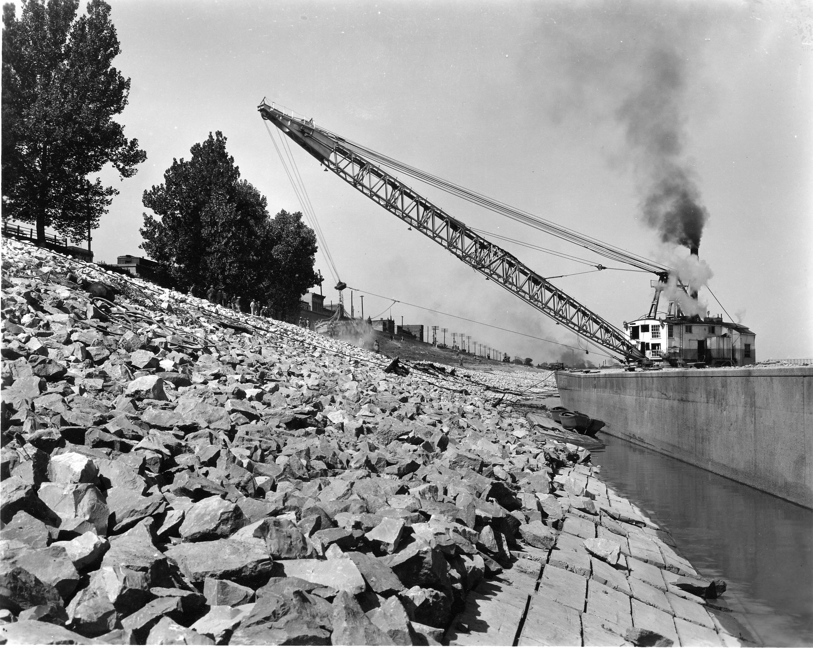

## Visão Geral da Aula {.smaller-text}

::: {.columns}
::: {.column width="50%"}
### Tópicos

- [1]{.circle} O que é enrocamento vegetado?
- [2]{.circle} Enrocamento convencional × vegetado
- [3]{.circle} Gradologia de pedras e filtros
- [4]{.circle} Espécies para estacas vivas
- [5]{.circle} Projeto e dimensionamento
- [6]{.circle} Construção e implantação
- [7]{.circle} Monitoramento e sucessão ecológica
- [8]{.circle} Síntese e atividade
:::

::: {.column width="50%"}
::: {.info-box}
**Objetivo da Aula**

Compreender os princípios do **enrocamento vegetado** (*vegetated riprap*) como técnica de **bioengenharia** que combina a estabilidade estrutural das **pedras** com a capacidade de enraizamento de **estacas vivas**, aprend er a **dimensionar**, **construir** e **monitorar** o sistema para proteção de margens fluviais e bases de taludes.
:::
:::
:::

# [1. O QUE É ENROCAMENTO VEGETADO?]{.section-header}

## Definição e contexto {.smaller-text}

::: {.columns}
::: {.column width="55%"}

### Conceito

O **enrocamento vegetado** (*vegetated riprap* ou *live riprap*) é uma técnica de bioengenharia que combina:

- **Pedras** (enrocamento convencional) para resistência mecânica imediata
- **Solo** nos interstícios para suporte de vida
- **Estacas vivas** (*live stakes*) de espécies com propagação vegetativa
- **Raízes** que substituem progressivamente a função estrutural das pedras

::: {.highlight-box}
💡 O enrocamento vegetado transforma uma **estrutura inerte** em um **ecossistema vivo**: com o tempo, as raízes entrelaçam as pedras, criando um sistema de proteção que **se autorreforça**.
:::
:::

::: {.column width="45%"}

### Evolução temporal

```{mermaid}
%%| fig-width: 4.5
graph TD
    A["Ano 0<br>Pedras + Estacas"] --> B["Ano 1<br>Enraizamento<br>inicial"]
    B --> C["Ano 2-3<br>Raízes entrelaçam<br>pedras"]
    C --> D["Ano 5+<br>Sistema vivo<br>autossustentável"]
    A -->|"Resistência<br>mecânica"| E["100% pedras"]
    D -->|"Resistência<br>mecânica"| F["50% pedras<br>50% raízes"]
    style A fill:#8B4513,color:#fff
    style B fill:#FDB913,color:#000
    style C fill:#2E7D32,color:#fff
    style D fill:#2E7D32,color:#fff
```

> Com o amadurecimento, o sistema atinge **resiliência ecológica**: capacidade de se recuperar de perturbações (cheias, secas) sem intervenção humana.
:::
:::

## Galeria: Enrocamento e riprap em campo {.smaller-text}

::: {.columns}
::: {.column width="50%"}

{width="100%"}

:::{.smaller-text}
Fonte: USACE Memphis District - Public Domain
:::
:::

::: {.column width="50%"}

{width="100%"}

:::{.smaller-text}
Fonte: Wikimedia Commons - CC BY-SA 4.0
:::
:::
:::

## Aplicações principais {.smaller-text}

::: {.columns}
::: {.column width="50%"}

### Onde usar enrocamento vegetado

| Local | Função principal |
|-------|------------------|
| Margens de rios | Proteção contra erosão fluvial |
| Base de taludes | Estabilização do pé (toe protection) |
| Saídas de bueiros | Dissipação de energia |
| Canais de drenagem | Revestimento permeável |
| Reservatórios | Proteção contra ondas |
| Trechos costeiros | Proteção litorânea |

### Vantagens sobre enrocamento simples

- ✅ **Autorreparação**: raízes crescem e preenchem falhas
- ✅ **Habitat**: abrigo para fauna aquática e terrestre
- ✅ **Filtragem**: raízes retêm sedimentos e poluentes
- ✅ **Estética**: paisagem naturalizada
- ✅ **Durabilidade crescente**: raízes reforçam ao longo do tempo

:::

::: {.column width="50%"}

### Comparativo

```{mermaid}
%%| fig-width: 5
graph LR
    subgraph Convencional["Enrocamento Convencional"]
        A1["Pedras"] --> A2["Inerte"]
        A2 --> A3["Manutenção<br>periódica"]
    end
    subgraph Vegetado["Enrocamento Vegetado"]
        B1["Pedras + Estacas"] --> B2["Vivo"]
        B2 --> B3["Autorreparação<br>crescente"]
    end
    style A1 fill:#8B4513,color:#fff
    style A2 fill:#ED1C24,color:#fff
    style B1 fill:#2E7D32,color:#fff
    style B2 fill:#2E7D32,color:#fff
    style B3 fill:#034EA2,color:#fff
```

::: {.highlight-box}
🌿 O enrocamento vegetado é especialmente indicado em **Áreas de Preservação Permanente (APP)**, onde a legislação exige a restauração da vegetação ciliar (Lei 12.651/2012 - Código Florestal).
:::
:::
:::

# [2. ENROCAMENTO CONVENCIONAL × VEGETADO]{.section-header}

## Comparação técnica {.smaller-text}

::: {.columns}
::: {.column width="50%"}

### Enrocamento convencional

- Pedras dispostas em camada única ou múltipla
- Juntas preenchidas com brita ou argamassa
- Função: **resistência mecânica** ao fluxo
- Sem componente biológico
- Durabilidade: 30-50+ anos (se bem dimensionado)
- Custo elevado de transporte e instalação

### Enrocamento vegetado (live riprap)

- Pedras dispostas com **interstícios abertos**
- Vãos preenchidos com **solo fértil**
- **Estacas vivas** inseridas nos interstícios
- Função: **resistência mecânica + ecológica**
- Durabilidade: **crescente** (raízes reforçam)
- Custo 20-40% menor que convencional

:::

::: {.column width="50%"}

### Critérios de decisão

| Critério | Convencional | Vegetado |
|----------|-------------|----------|
| Velocidade de fluxo > 4 m/s | ★★★★★ | ★★★☆☆ |
| APP (exigência legal) | ★★☆☆☆ | ★★★★★ |
| Habitat para fauna | ★☆☆☆☆ | ★★★★★ |
| Custo inicial | ★★☆☆☆ | ★★★★☆ |
| Manutenção a longo prazo | ★★★☆☆ | ★★★★★ |
| Integração paisagística | ★☆☆☆☆ | ★★★★★ |
| Resistência imediata | ★★★★★ | ★★★★☆ |

::: {.highlight-box}
⚠️ Em fluxos com **velocidade > 4 m s⁻¹** ou **alturas de onda > 1 m**, o enrocamento convencional é preferível até que as raízes se estabeleçam. Uma solução mista (convencional na base + vegetado acima) pode ser a melhor opção.
:::
:::
:::

# [3. GRADOLOGIA DE PEDRAS E FILTROS]{.section-header}

## Dimensionamento das pedras {.smaller-text}

::: {.columns}
::: {.column width="55%"}

### Fórmula de Isbash (velocidade crítica)

O diâmetro mínimo das pedras ($D_{50}$) é calculado pela velocidade do fluxo:

$$D_{50} = \frac{V^2}{2g \cdot C^2 \cdot (\gamma_s / \gamma_w - 1)}$$

Onde:

- $V$ = velocidade do fluxo (m s⁻¹)
- $g$ = aceleração gravitacional (9,81 m s⁻²)
- $C$ = coeficiente de Isbash (0,86 para fundo; 1,20 para talude)
- $\gamma_s$ = peso específico da pedra (≈ 2.650 kg m⁻³)
- $\gamma_w$ = peso específico da água (1.000 kg m⁻³)

### Classes de pedra (gradologia)

| Classe | $D_{50}$ (cm) | Massa média (kg) | Velocidade máxima |
|--------|---------------|-------------------|-------------------|
| Rachão leve | 10-15 | 2-5 | 1,0-1,5 m/s |
| Rachão médio | 15-25 | 5-20 | 1,5-2,5 m/s |
| Rachão pesado | 25-40 | 20-80 | 2,5-3,5 m/s |
| Pedra de mão | 40-60 | 80-300 | 3,5-5,0 m/s |

:::

::: {.column width="45%"}

### Camada filtrante

```{mermaid}
%%| fig-width: 4.5
graph TD
    A["Pedras grandes<br>(camada externa)"] --> B["Pedras médias<br>(transição)"]
    B --> C["Brita / seixo<br>(filtro granular)"]
    C --> D["Geotêxtil<br>(filtro sintético)"]
    D --> E["Solo natural<br>da margem"]
    style A fill:#8B4513,color:#fff
    style B fill:#FDB913,color:#000
    style C fill:#034EA2,color:#fff
    style D fill:#ED1C24,color:#fff
    style E fill:#2E7D32,color:#fff
```

### Regra de filtro (Terzaghi)

$$\frac{D_{15(filtro)}}{D_{85(solo)}} < 5$$

$$\frac{D_{15(filtro)}}{D_{15(solo)}} > 4$$

::: {.highlight-box}
🪨 No enrocamento vegetado, os interstícios **não são preenchidos com argamassa**, mas sim com **solo fértil** que serve de substrato para as estacas vivas.
:::
:::
:::

# [4. ESPÉCIES PARA ESTACAS VIVAS]{.section-header}

## Seleção de espécies {.smaller-text}

::: {.columns}
::: {.column width="50%"}

### Critérios de seleção

As espécies devem apresentar:

- **Propagação vegetativa**: capacidade de enraizar por estaquia
- **Tolerância à submersão**: resistir a cheias periódicas
- **Crescimento rápido**: cobertura em 1-2 estações
- **Sistema radicular** profundo e denso
- **Adaptação regional**: nativas ou naturalizadas

### Espécies recomendadas (Brasil)

| Espécie | Nome popular | Habitat |
|---------|-------------|---------|
| *Salix humboldtiana* | Salgueiro | Margens fluviais |
| *Sebastiania commersoniana* | Branquilho | Mata ciliar |
| *Calliandra brevipes* | Esponjinha | Cerrado úmido |
| *Inga marginata* | Ingá-feijão | Mata atlântica |
| *Schinus terebinthifolia* | Aroeira-pimenteira | Generalista |
| *Erythrina crista-galli* | Corticeira | Banhados |
| *Phyllanthus sellowianus* | Sarandi | Margens |

:::

::: {.column width="50%"}

### Preparação das estacas

**Especificações:**

- **Diâmetro**: 2-8 cm
- **Comprimento**: 50-100 cm
- **Corte basal**: diagonal (↗) para facilitar cravação
- **Corte apical**: reto para evitar acúmulo de água
- **Coleta**: ramos saudáveis da estação de crescimento
- **Armazenamento**: máx. 48 h em local úmido e sombreado

### Taxa de enraizamento esperada

```{mermaid}
%%| fig-width: 4.5
graph LR
    A["Mês 1<br>10-30%"] --> B["Mês 3<br>40-60%"]
    B --> C["Mês 6<br>70-85%"]
    C --> D["Ano 1<br>80-95%"]
    style A fill:#ED1C24,color:#fff
    style B fill:#FDB913,color:#000
    style C fill:#2E7D32,color:#fff
    style D fill:#2E7D32,color:#fff
```

::: {.highlight-box}
🌱 A taxa de enraizamento depende da **época de coleta** (inverno/dormência é ideal), do **diâmetro** (3-5 cm é o ótimo) e da **umidade do solo** nos interstícios.
:::
:::
:::

# [5. PROJETO E DIMENSIONAMENTO]{.section-header}

## Parâmetros de projeto {.smaller-text}

::: {.columns}
::: {.column width="55%"}

### Geometria do enrocamento

| Parâmetro | Valor recomendado |
|-----------|-------------------|
| Espessura mínima | 1,5 × $D_{50}$ ou 30 cm (o maior) |
| Inclinação do talude | 1V:1,5H a 1V:3H |
| Fundação (toe) | Enterrar ≥ 60 cm abaixo do leito |
| Coroamento | Acima do nível de cheia (TR = 10 anos) |
| Extensão lateral | ≥ 1 m além do nível de cheia |

### Densidade de estacas

$$d_{estacas} = \frac{N}{A_{enroc}}$$

Recomendação: **2-4 estacas m⁻²** distribuídas uniformemente nos interstícios.

### Volume de pedras

$$V_{pedras} = A_{face} \times e_{camada} \times (1 - n)$$

Onde $n$ = porosidade do enrocamento (0,35 - 0,45)

:::

::: {.column width="45%"}

### Seção transversal típica

```{mermaid}
%%| fig-width: 4.5
graph TD
    subgraph Seção["Seção Transversal"]
        A["Coroamento<br>acima N.A. cheia"]
        B["Corpo do enrocamento<br>Pedras + Solo + Estacas"]
        C["Filtro granular<br>ou geotêxtil"]
        D["Fundação (toe)<br>enterrada ≥ 60 cm"]
    end
    A --> B
    B --> C
    C --> D
    style A fill:#034EA2,color:#fff
    style B fill:#8B4513,color:#fff
    style C fill:#FDB913,color:#000
    style D fill:#ED1C24,color:#fff
```

::: {.highlight-box}
📐 A fundação (*toe*) é o ponto mais crítico: se as pedras da base forem carreadas, todo o enrocamento pode colapsar. Enterrar profundamente e usar pedras maiores na base.
:::
:::
:::

# [6. CONSTRUÇÃO E IMPLANTAÇÃO]{.section-header}

## Procedimento construtivo {.smaller-text}

::: {.columns}
::: {.column width="55%"}

### Etapas de construção

```{mermaid}
%%| fig-width: 5
graph TD
    A["1. Preparo do leito<br>Escavação toe + perfilamento"] --> B["2. Instalação do filtro<br>Geotêxtil ou granular"]
    B --> C["3. Colocação das pedras<br>Da base para o topo"]
    C --> D["4. Preenchimento<br>Solo fértil nos interstícios"]
    D --> E["5. Cravação das estacas<br>2-4 estacas/m²"]
    E --> F["6. Cobertura com mulch<br>Proteção dos interstícios"]
    F --> G["7. Irrigação inicial<br>Se necessário"]
    style A fill:#034EA2,color:#fff
    style C fill:#8B4513,color:#fff
    style E fill:#2E7D32,color:#fff
    style G fill:#4FC3F7,color:#000
```

### Cuidados na construção

- Colocar pedras **da base para o topo**, sem lançar de altura
- Garantir **travamento** entre pedras (sem instabilidade)
- Solo nos interstícios deve ser **fértil** (adicionar composto se necessário)
- Estacas cravadas **⅔ no solo, ⅓ exposta**
- Plantio preferencialmente na **estação chuvosa**

:::

::: {.column width="45%"}

### Detalhe da inserção de estacas

| Passo | Descrição |
|-------|-----------|
| 1 | Preencher interstício com solo úmido |
| 2 | Abrir furo-guia com haste metálica |
| 3 | Inserir estaca com corte diagonal para baixo |
| 4 | Compactar solo ao redor da estaca |
| 5 | Aplicar mulch superficial |

### Época de plantio

| Região | Melhor época |
|--------|-------------|
| Nordeste semiárido | Início das chuvas (mar-abr) |
| Sudeste | Outubro-dezembro |
| Sul | Setembro-novembro |
| Amazônia | Transição seca→chuvosa |

::: {.highlight-box}
🗓️ A coleta de estacas deve ser feita no **período de dormência** (inverno) para maximizar as reservas de carboidratos, mas o plantio deve coincidir com a **estação úmida**.
:::
:::
:::

# [7. MONITORAMENTO E SUCESSÃO ECOLÓGICA]{.section-header}

## Acompanhamento do sistema {.smaller-text}

::: {.columns}
::: {.column width="50%"}

### Cronograma de monitoramento

| Período | Indicador | Meta |
|---------|-----------|------|
| 15 dias | Brotação das estacas | > 50% |
| 30 dias | Irrigação (se seco) | Solo úmido |
| 60 dias | Enraizamento inicial | Raízes visíveis |
| 6 meses | Cobertura vegetal | > 40% |
| 1 ano | Sistema estabelecido | > 70% cobertura |
| 2 anos | Entrelaçamento raiz-pedra | Consolidação |
| 5 anos | Ecossistema autônomo | Autossustentável |

### Indicadores de sucesso

- ✅ > 80% das estacas com brotação
- ✅ Raízes penetrando > 30 cm no solo
- ✅ Sem deslocamento de pedras em cheias
- ✅ Colonização por espécies espontâneas
- ✅ Presença de fauna associada (aves, insetos)

:::

::: {.column width="50%"}

### Fases da sucessão ecológica

```{mermaid}
%%| fig-width: 5
graph TD
    A["Fase 1: Pioneira<br>(0-2 anos)<br>Estacas + gramíneas"] --> B["Fase 2: Herbácea<br>(2-5 anos)<br>Arbustos + herbáceas"]
    B --> C["Fase 3: Arbustiva<br>(5-10 anos)<br>Arbustos + árvores jovens"]
    C --> D["Fase 4: Arbórea<br>(10+ anos)<br>Mata ciliar<br>em regeneração"]
    style A fill:#FDB913,color:#000
    style B fill:#2E7D32,color:#fff
    style C fill:#034EA2,color:#fff
    style D fill:#2E7D32,color:#fff
```

::: {.highlight-box}
🌳 O objetivo final do enrocamento vegetado é iniciar a **sucessão ecológica**: as estacas vivas são espécies **pioneiras** que preparam o terreno para a colonização por espécies **climácicas** da mata ciliar.
:::
:::
:::

# [8. SÍNTESE E ATIVIDADE]{.section-header}

## Resumo dos conceitos-chave {.smaller-text}

::: {.columns}
::: {.column width="50%"}

### Pontos fundamentais

::: {.info-box}
1. **Enrocamento vegetado** combina pedras (resistência mecânica) com estacas vivas (componente biológico)
2. Os **interstícios** são preenchidos com solo fértil, não com argamassa
3. O **dimensionamento** das pedras segue a fórmula de Isbash (velocidade do fluxo)
4. **Espécies com propagação vegetativa** e tolerância à submersão são essenciais
5. A **época de plantio** deve coincidir com a estação chuvosa
6. O sistema **ganha resiliência** ao longo do tempo com a sucessão ecológica
:::

:::

::: {.column width="50%"}

### Fluxo conceitual

```{mermaid}
%%| fig-width: 5
graph TD
    A["Pedras<br>dimensionadas"] --> E["Enrocamento<br>vegetado"]
    B["Filtro<br>granular/geotêxtil"] --> E
    C["Solo fértil<br>nos interstícios"] --> E
    D["Estacas vivas<br>espécies pioneiras"] --> E
    E --> F["Proteção<br>mecânica imediata"]
    E --> G["Enraizamento<br>progressivo"]
    G --> H["Sucessão<br>ecológica"]
    H --> I["Ecossistema<br>autossustentável"]
    style A fill:#8B4513,color:#fff
    style D fill:#2E7D32,color:#fff
    style E fill:#034EA2,color:#fff
    style I fill:#2E7D32,color:#fff
```
:::
:::

## Atividade prática - Projeto de enrocamento vegetado {.smaller-text}

::: {.columns}
::: {.column width="55%"}

### Exercício em grupo

**Cenário:** Uma margem do Rio Jacuípe (BA) com 80 m de extensão e 3 m de altura apresenta erosão severa. A velocidade do fluxo na cheia (TR = 10 anos) é de 2,8 m s⁻¹. O solo da margem é areno-argiloso. A área está em APP.

**Projetem o enrocamento vegetado:**

1. Calcule o **$D_{50}$** das pedras pela fórmula de Isbash
2. Qual a **classe de pedra** recomendada?
3. Defina a **espessura** e a **geometria da seção transversal**
4. Escolha **3 espécies** para estacas vivas e justifique
5. Calcule a **quantidade de estacas** (estacas m⁻²)
6. Qual a **época ideal** de instalação?
7. Elabore um **cronograma de monitoramento** para 2 anos

:::

::: {.column width="45%"}

### Critérios de avaliação

| Critério | Peso |
|----------|------|
| Dimensionamento das pedras | 25% |
| Geometria da seção | 15% |
| Seleção de espécies | 20% |
| Procedimento construtivo | 20% |
| Cronograma de monitoramento | 20% |

::: {.highlight-box}
⏱️ **Tempo**: 30 minutos para projeto + 10 minutos para apresentação por grupo.
:::

:::
:::

## Referências {.smaller-text}

::: {.smaller-text}

- ABNT (2016). NBR 9842:2016 - Enrocamento - Projeto e execução.
- DNER (1996). Manual de Proteção e Retaludamento de Encostas. Departamento Nacional de Estradas de Rodagem.
- Fischenich, C. (2001). Stability thresholds for stream restoration materials. *EMRRP Technical Notes, ERDC TN-EMRRP-SR-29*.
- Gray, D. H. & Sotir, R. B. (1996). *Biotechnical and Soil Bioengineering Slope Stabilization*. John Wiley & Sons.
- Isbash, S. V. (1936). Construction of dams by depositing rock in running water. *2nd Congress on Large Dams, Washington*, 5, 123-136.
- Li, M. H. & Eddleman, K. E. (2002). Biotechnical engineering as an alternative to traditional engineering methods. *Landscape Urban Planning*, 60(4), 225-242.
- Schiechtl, H. M. & Stern, R. (1996). *Ground Bioengineering Techniques for Slope Protection and Erosion Control*. Blackwell Science.

:::

## {.obrigado-fit-text .center}

::: {.columns}
::: {.column width="100%" style="text-align: center;"}

[Obrigado!]{.obrigado-fit-text}

**Prof. Luiz Diego Vidal Santos**

📧 luiz.diego@uefs.br

🌐 [ldvsantos.github.io/cv](https://ldvsantos.github.io/cv)

:::
:::
