## Visão Geral da Aula {.smaller-text}

::: {.columns}
::: {.column width="50%"}
### Tópicos

- [1]{.circle} Premissas da bioengenharia vegetativa
- [2]{.circle} Técnicas de estabilização com vegetação
- [3]{.circle} Drenos verdes: conceito e confecção
- [4]{.circle} Sistema espinha de peixe
- [5]{.circle} Espécies vegetais para estacas vivas
- [6]{.circle} Monitoramento e bioensaios
- [7]{.circle} Estudo de caso: Campus Rural (UFS-SE)
- [8]{.circle} Síntese e atividade
:::

::: {.column width="50%"}
::: {.info-box}
**Objetivo da Aula**

Compreender as **técnicas de bioengenharia vegetativa** para estabilização de margens e encostas, incluindo estacas vivas, feixes vivos (*live fascines*), empacotamento de ramos, geogrelhas vegetadas, muros de suporte vivo e esteiras de ramagem, além de dominar o conceito e a confecção dos **drenos verdes** como sistema integrado de drenagem e revegetação.
:::
:::
:::

# [1. PREMISSAS DA BIOENGENHARIA VEGETATIVA]{.section-header}

## Contexto e motivação {.smaller-text}

::: {.columns}
::: {.column width="55%"}

### O problema da erosão marginal

As margens dos rios podem ser consideradas estáveis se não houver mudanças perceptíveis na sua localização ao longo de 20 a 50 anos (Lyn & Newton, 2015). A erosão marginal advém do processo de adaptação do rio ao vale em que se situa ou às novas condições de escoamento impostas por atividades antrópicas.

### Métodos convencionais e suas limitações

Os métodos tradicionais de contenção (riprap, gabião, concreto, retificação) frequentemente transferem problemas erosivos para outras áreas e afetam a integridade ecológica dos cursos d'água (Li & Eddleman, 2002).

::: {.highlight-box}
🔄 As técnicas de **bioengenharia** surgiram como alternativas **ambientalmente sensíveis** às abordagens convencionais, enfatizando o uso de elementos vegetativos para estabilização de margens (Lyn & Newton, 2015).
:::
:::

::: {.column width="45%"}

### Comparação de abordagens

| Abordagem | Custo | Impacto ambiental | Habitat |
|-----------|-------|--------------------|---------|
| Enrocamento | Alto | Elevado | Não |
| Concreto | Muito alto | Elevado | Não |
| Retificação | Alto | Severo | Destrói |
| **Bioengenharia** | **Baixo** | **Mínimo** | **Cria** |

> O enrocamento e a retificação destroem o equilíbrio físico dos cursos d'água, causando impactos ecológicos (Li & Eddleman, 2002; Biedenharn et al., 1997).

:::
:::

## Premissas e zonas ribeirinhas {.smaller-text}

::: {.columns}
::: {.column width="55%"}

### Fatores de sucesso (USDA, 2007)

O sucesso das técnicas depende do **estabelecimento inicial** e do **desenvolvimento a longo prazo** da vegetação ripária, condicionados por:

- Espécies selecionadas e métodos de aquisição
- Técnicas de instalação e época do ano
- Tipo de solo, compactação e nutrientes
- Hidrologia, clima e localização no curso d'água
- Carga de sedimentos e acessibilidade à água

### Abordagem zonal

A vegetação deve ser posicionada considerando a **elevação** e as relações com o nível d'água. Na **zona submersa**, a bioengenharia requer combinação com elementos estruturais.

:::

::: {.column width="45%"}

### Zonas de plantação ribeirinha

```{mermaid}
%%| fig-width: 5
graph TB
    A["Zona de Terras Altas<br>Árvores de grande porte"] --> B["Zona Ribeirinha<br>Arbustos e árvores médias"]
    B --> C["Zona de Banco<br>Gramíneas e arbustos"]
    C --> D["Zona de Nível de Cheia<br>Gramíneas tolerantes"]
    D --> E["Zona Submersa<br>Bioengenharia + Estrutural"]
    style A fill:#2E7D32,color:#fff
    style B fill:#4CAF50,color:#fff
    style C fill:#8BC34A,color:#000
    style D fill:#4FC3F7,color:#000
    style E fill:#034EA2,color:#fff
```

::: {.highlight-box}
📍 A abordagem zonal determina **onde** cada espécie deve ser plantada em relação à linha d'água durante diferentes períodos de vazão (USDA, 2007).
:::

:::
:::

# [2. TÉCNICAS DE ESTABILIZAÇÃO COM VEGETAÇÃO]{.section-header}

## 2.1 Estacas vivas (*live stakes*) {.smaller-text}

::: {.columns}
::: {.column width="55%"}

### Conceito

Inserção e compactação de **estacas vegetativas** no solo, que irão se enraizar e crescer, criando uma camada de raízes que estabiliza o solo (USDA, 1996; FISRWG, 1998).

### Mecanismo de ação

- O sistema radicular **reforça** e **liga** as partículas do solo
- As raízes **extraem o excesso de umidade**, reduzindo a poropressão
- A parte aérea **intercepta** precipitação e reduz impacto de gotas

### Indicações

- Reparo de **pequenos deslizamentos** frequentemente molhados
- **Fixação** de tecidos de controle de erosão
- **Conexão** entre outras técnicas de bioengenharia
- Tempo de construção **limitado** e baixo orçamento

:::

::: {.column width="45%"}

{width="90%"}

### Especificações

| Parâmetro | Valor |
|-----------|-------|
| Comprimento | 60-90 cm |
| Diâmetro | 2-5 cm |
| Profundidade de inserção | 2/3 do comprimento |
| Espaçamento | 0,6-1,2 m |
| Corte basal | Em ângulo |
| Corte apical | Reto |

:::
:::

## 2.2 Feixes vivos (*live fascines*) {.smaller-text}

::: {.columns}
::: {.column width="55%"}

### Conceito

Longos feixes de recortes de ramos, amarrados em **estruturas cilíndricas** com diâmetro de 15 a 20 cm, colocados em **trincheiras de contorno** nas margens para reduzir a erosão e o deslizamento superficial (USDA, 1996).

### Mecanismo de ação

- Criam pequenas **barragens de contorno**, reduzindo o comprimento do declive em uma série de declives menores
- **Aprisionam e retêm** o solo na margem
- Quando instalados em trincheiras inclinadas, **facilitam a drenagem** em taludes úmidos
- Melhoram as condições de **colonização da vegetação nativa**, criando um microclima propício ao crescimento

### Especificações

| Parâmetro | Valor |
|-----------|-------|
| Diâmetro do feixe | 15-20 cm |
| Comprimento dos ramos | 1,6-3,2 m |
| Estacas de fixação | 75 cm |

:::

::: {.column width="45%"}

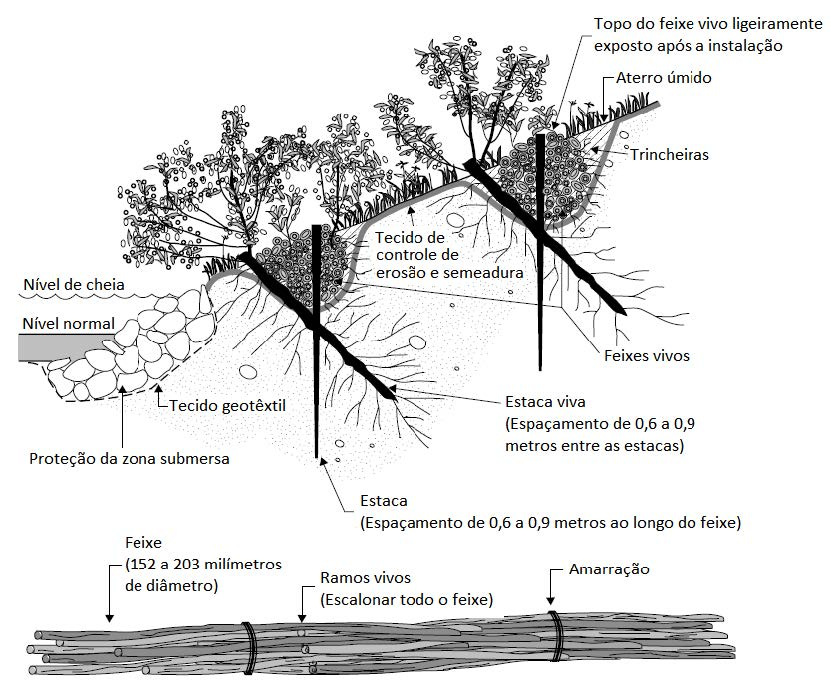{width="90%"}

{width="90%"}

:::
:::

## 2.3 Empacotamento de ramos (*branch packing*) {.smaller-text}

::: {.columns}
::: {.column width="55%"}

### Conceito

Camadas alternadas de **ramos vivos** e de **solo compactado**, dispostas entre estacas verticais e perpendiculares à face da inclinação (Gray & Sotir, 1996).

### Mecanismo de ação

- Produz uma **barreira de filtro** onde os sedimentos ficam presos
- As raízes se espalham pelo aterro, formando uma **massa unificada**
- Previne a erosão das margens por preenchimento gradual das depressões

### Procedimento

1. Camada inicial de ramos vivos na parte inferior, em **configuração cruzada**
2. Pontas de crescimento orientadas para a **face da inclinação**
3. Extremidades basais tocando o **solo não perturbado**
4. Camadas alternadas de solo compactado entre os ramos

::: {.highlight-box}
💰 Método **eficaz e econômico**, indicado para reparar pequenos deslizamentos e cavidades localizadas nas margens (USDA, 1996).
:::

:::

::: {.column width="45%"}

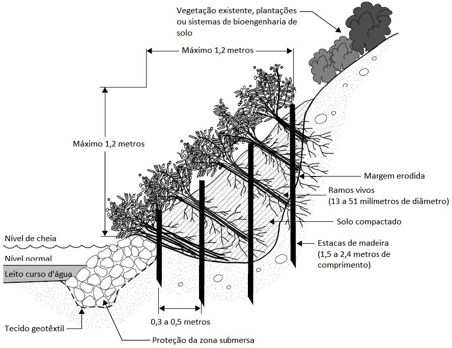{width="90%"}

:::
:::

## 2.4 Geogrelha vegetada {.smaller-text}

::: {.columns}
::: {.column width="55%"}

### Conceito

Técnica semelhante ao empacotamento de ramos, porém com **materiais geotêxteis** (naturais ou sintéticos) envolvidos em torno de cada elevação de solo entre as camadas de ramos vivos (Gray & Sotir, 1996).

### Diferencial

- O geotêxtil confere **estabilidade imediata** enquanto a vegetação se estabelece
- Combina a **resistência mecânica** do geossintético com o **reforço biológico** das raízes
- Permite construção em **taludes mais íngremes**

### Aplicações

| Condição | Viabilidade |
|----------|------------|
| Taludes íngremes (> 45°) | Excelente |
| Solos de baixa coesão | Excelente |
| Áreas com espaço restrito | Boa |
| Margens fluviais profundas | Boa com suporte estrutural |

:::

::: {.column width="45%"}

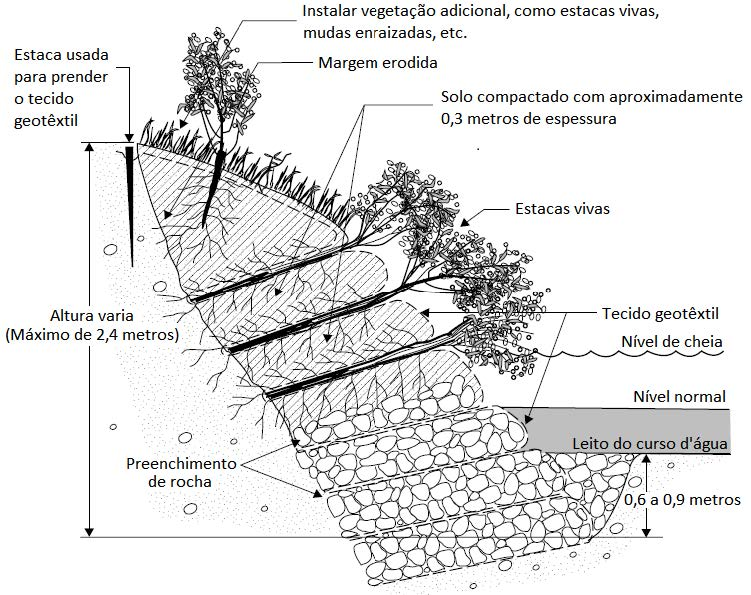{width="90%"}

:::
:::

## 2.5 Muro de suporte vivo (*live crib wall*) {.smaller-text}

::: {.columns}
::: {.column width="55%"}

### Conceito

Arranjo de encaixe, em **forma de caixa**, de troncos de madeira, preenchido com material de aterro e camadas de ramos vivos que penetram no interior e se estendem até a encosta (FISRWG, 1998).

### Mecanismo de ação

- Uma vez que as estacas vivas enraízam, a **vegetação assume gradualmente** as funções estruturais dos troncos
- A estrutura de madeira fornece **suporte imediato** enquanto a vegetação se desenvolve
- Mantém a aparência de **margem natural** e fornece excelente habitat

### Indicações

- **Curvas externas** de cursos d'água com correntes fortes
- Base da margem onde uma **parede baixa** é necessária
- Espaço **limitado** requerendo estrutura mais vertical
- Pode ser instalada **acima e abaixo** do nível da água

:::

::: {.column width="45%"}

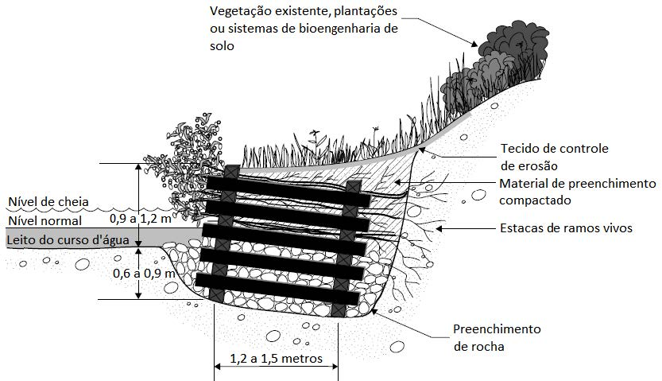{width="90%"}

:::
:::

## 2.6 Esteira de ramagem (*brushmattress*) {.smaller-text}

::: {.columns}
::: {.column width="55%"}

### Conceito

Combinação de **estacas vivas, feixes vivos e recortes de ramos** instalados para cobrir e estabilizar margens inteiras, do nível de cheia até o topo da inclinação (FISRWG, 1998; USDA, 1996).

### Mecanismo de ação

- Forma uma **cobertura protetora imediata** sobre a margem
- **Captura sedimentos** durante condições de inundação
- Repõe rapidamente a **vegetação e o habitat ribeirinho**
- Melhora as condições de **colonização nativa**

### Procedimento

1. Escavação de trincheira no contorno da base (nível de cheia)
2. Instalação de estacas vivas e feixe na trincheira
3. Ramos de **1,8-2,7 m** e **~2,5 cm** de diâmetro, flexíveis
4. Disposição em camada de 1-2 ramos verticalmente na inclinação
5. Fixação com **arame esticado diagonalmente** entre estacas

:::

::: {.column width="45%"}

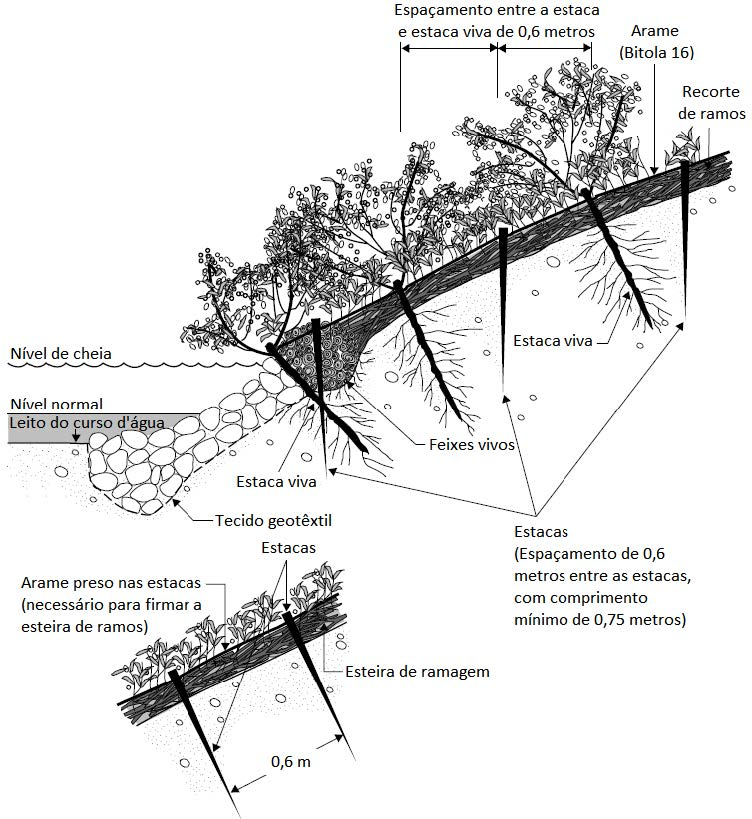{width="90%"}

:::
:::

## Resumo comparativo das técnicas {.smaller-text}

::: {.columns}
::: {.column width="55%"}

### Quando usar cada técnica

| Técnica | Melhor aplicação | Complexidade |
|---------|------------------|-------------|
| Estacas vivas | Pequenos deslizamentos, conexão entre técnicas | Baixa |
| Feixes vivos | Trincheiras de contorno, taludes úmidos | Média |
| Empacotamento | Cavidades e deslizamentos localizados | Média |
| Geogrelha vegetada | Taludes íngremes, solos fracos | Alta |
| Muro de suporte | Curvas externas, correntes fortes | Alta |
| Esteira de ramagem | Cobertura total de margens | Média-Alta |

:::

::: {.column width="45%"}

### Integração com técnicas anteriores

```{mermaid}
%%| fig-width: 5
graph LR
    A["🪵 Paliçadas<br>Barreiras em ravinas"] -->|"Reduz<br>velocidade"| D["Controle<br>integrado"]
    B["🕳️ Barraginhas<br>Captação/infiltração"] -->|"Retém<br>água"| D
    C["🌱 Feixes vivos<br>Drenagem + raízes"] -->|"Drena +<br>enraíza"| D
    E["🏗️ Muro suporte<br>Contenção estrutural"] -->|"Estabiliza<br>base"| D
    style A fill:#FDB913,color:#000
    style B fill:#034EA2,color:#fff
    style C fill:#2E7D32,color:#fff
    style E fill:#8B4513,color:#fff
    style D fill:#ED1C24,color:#fff
```

::: {.highlight-box}
🌿 A combinação de técnicas é a regra: cada uma atua em uma **zona específica** da margem ou encosta, e a vegetação progressivamente **assume funções estruturais**.
:::

:::
:::

# [3. DRENOS VERDES: CONCEITO E CONFECÇÃO]{.section-header}

## Definição de drenos verdes {.smaller-text}

::: {.columns}
::: {.column width="55%"}

### Conceito

**Drenos verdes** (*green drains*) são dispositivos tubulares fabricados com **fibras naturais** (taboa, bananeira) que funcionam simultaneamente como sistema de **drenagem** superficial e substrato de **retenção de umidade** para os feixes vivos.

::: {.highlight-box}
💡 A **combinação** de drenos verdes + feixes vivos cria um sistema duplo: **drenagem** + **revegetação**, integrando engenharia geotécnica e restauração ecológica.
:::

### Fibras utilizadas

**Taboa (*Typha dominguensis*):** macrófita aquática abundante no Nordeste, alta retenção hídrica, estrutura porosa e biodegradável.

**Bananeira (*Musa paradisiaca*):** pseudocaule rico em fibras longas, boa drenagem, excelente custo-benefício.

:::

::: {.column width="45%"}
{width="90%"}

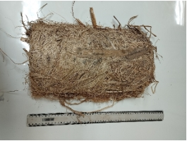{width="90%"}
:::
:::

## Formulações e propriedades {.smaller-text}

::: {.columns}
::: {.column width="50%"}

### Formulações dos drenos verdes

Foram desenvolvidas **três frações** para cada espécie:

**Taboa (*Typha dominguensis*):**

| Fração | Composição |
|--------|------------|
| G1 | 24% limbo + 44% fibras folha + 20% resina + 6% solvente + 30% espessante |
| G2 | 24% limbo + 20% fibras bainha + 20% resina + 6% solvente + 30% espessante |
| G3 | G2 com água em vez de D'limoneno |

**Bananeira (*Musa paradisiaca*):**

| Fração | Composição |
|--------|------------|
| G1 | 24% limbo + 44% fibras folha + 20% resina + 6% solvente + 30% espessante |
| G2 | 24% limbo + 20% fibras pseudocaule + 20% resina + 6% solvente + 30% espessante |
| G3 | G2 com água em vez de D'limoneno |

:::

::: {.column width="50%"}

### Componentes e especificações

- **Resina natural**: bi-componente derivada de poliol vegetal de **mamona** - promove coesão entre fibras
- **Solvente**: D'limoneno (95%) - origem natural
- **Espessante**: confere consistência estrutural

| Parâmetro | Valor |
|-----------|-------|
| Espessura da parede | 5 mm |
| Diâmetro total | 20 cm |
| Densidade aproximada | 0,062 g/cm³ |

> Similar a materiais geotécnicos como lã de rocha e lã de vidro.

:::
:::

## Etapas de fabricação {.smaller-text}

::: {.columns}
::: {.column width="55%"}

### Passo a passo

```{mermaid}
%%| fig-width: 5
graph TD
    A["1. Coleta e secagem<br>das fibras naturais"] --> B["2. Tratamento com<br>resina + espessante"]
    B --> C["3. Mistura na encoladeira<br>(5 minutos)"]
    C --> D["4. Moldagem em<br>formas de dreno"]
    D --> E["5. Prensagem a frio<br>forma tipo U (24h)"]
    E --> F["6. Cura da resina<br>sem aplicação de calor"]
    F --> G["7. Dreno verde<br>pronto"]
    style A fill:#FDB913,color:#000
    style D fill:#034EA2,color:#fff
    style E fill:#ED1C24,color:#fff
    style G fill:#2E7D32,color:#fff
```

**Detalhes importantes:**

1. Material seco até ~12% de umidade
2. Mistura homogênea na encoladeira por 5 min
3. Prensagem hidráulica a frio - **sem calor**
4. Cura de 24 horas na forma tipo "U"

:::

::: {.column width="45%"}
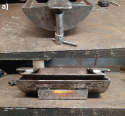{width="90%"}

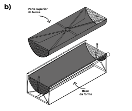{width="90%"}
:::
:::

## Estrutura e funções do dreno verde {.smaller-text}

::: {.columns}
::: {.column width="50%"}

### Seção transversal

```{mermaid}
%%| fig-width: 5
graph LR
    subgraph Dreno["Dreno Verde - Seção Transversal"]
        direction TB
        A["Parede externa<br>Fibras naturais<br>ε = 5 mm"]
        B["Furos de infiltração<br>Distribuídos<br>ao longo da parede"]
        C["Núcleo interno<br>Feixes vivos +<br>substrato úmido"]
        D["Ø total = 20 cm"]
    end
    style A fill:#8B4513,color:#fff
    style B fill:#4FC3F7,color:#000
    style C fill:#2E7D32,color:#fff
    style D fill:#FDB913,color:#000
```

:::

::: {.column width="50%"}

### Dupla função

```{mermaid}
%%| fig-width: 5
graph TD
    A["Água superficial<br>excedente"] -->|"Infiltra pelos<br>furos"| B["Interior do<br>dreno verde"]
    B -->|"Conduz para"| C["Dreno polo<br>principal"]
    B -->|"Retém umidade<br>para"| D["Feixes vivos"]
    D -->|"Enraízam e"| E["Estabilizam<br>o solo"]
    C -->|"Evacuação<br>controlada"| F["Base da<br>encosta"]
    style A fill:#4FC3F7,color:#000
    style B fill:#8B4513,color:#fff
    style D fill:#2E7D32,color:#fff
    style E fill:#FDB913,color:#000
```

:::
:::

# [4. SISTEMA ESPINHA DE PEIXE]{.section-header}

## Disposição em espinha de peixe {.smaller-text}

::: {.columns}
::: {.column width="55%"}

### Arranjo de campo

O sistema de drenagem verde é instalado em um padrão de **"espinha de peixe"** (*fishbone pattern*):

1. **Drenos de polo** (principais)
   - Instalados ao longo da **ravina**
   - Feixes maiores de ramos vivos
   - Coletam e redirecionam o fluxo de água

2. **Fascinas laterais** (secundárias)
   - Conectadas **obliquamente** aos drenos de polo
   - Feixes menores de ramos
   - Desviam água para o dreno principal

### Benefícios do arranjo

- Redução da **velocidade do fluxo superficial**
- Favorecimento da **infiltração** no solo
- Enraizamento dos feixes ao longo de todo o sistema
- Melhoria da **coesão do terreno**

:::

::: {.column width="45%"}
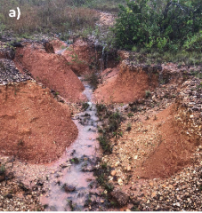{width="90%"}

{width="90%"}
:::
:::

## Esquema funcional e dimensionamento {.smaller-text}

::: {.columns}
::: {.column width="55%"}

### Fluxo hídrico no sistema

```{mermaid}
%%| fig-width: 5.5
graph TD
    A["Precipitação"] --> B["Escoamento<br>superficial"]
    B --> C["Fascinas laterais<br>(oblíquas)"]
    C -->|"Desvia para"| D["Dreno de polo<br>(principal)"]
    D --> E["Base da<br>encosta"]
    C -->|"Infiltra no"| F["Solo"]
    B -->|"Interceptado por"| G["Feixes vivos"]
    G -->|"Raízes<br>estabilizam"| H["Solo reforçado"]
    F --> H
    style A fill:#4FC3F7,color:#000
    style C fill:#2E7D32,color:#fff
    style D fill:#034EA2,color:#fff
    style G fill:#FDB913,color:#000
    style H fill:#8B4513,color:#fff
```

:::

::: {.column width="45%"}

### Dimensionamento

As fascinas laterais devem ser inseridas em **ângulo de 30°-45°** em relação ao dreno de polo:

| Declividade | Espaçamento recomendado |
|-------------|------------------------|
| 15°-25° | 2,0 - 3,0 m |
| 25°-35° | 1,5 - 2,0 m |
| 35°-45° | 1,0 - 1,5 m |

::: {.highlight-box}
🐟 O padrão **espinha de peixe** é inspirado na anatomia natural: as "costelas" (fascinas) drenam para a "coluna vertebral" (dreno polo), distribuindo a captação ao longo de toda a encosta.
:::

:::
:::

# [5. ESPÉCIES VEGETAIS PARA ESTACAS VIVAS]{.section-header}

## Seleção de espécies {.smaller-text}

::: {.columns}
::: {.column width="55%"}

### Espécies recomendadas

As espécies são selecionadas por sua capacidade de **propagação por estaquia** e adaptação aos tabuleiros costeiros:

| Espécie | Nome popular | Uso |
|---------|-------------|-----|
| *Schinus terebinthifolius* | Aroeira | Estabilização |
| *Spondias mombin* | Cajá | Cobertura |
| *Inga marginata* | Ingá | Fixação de N₂ |
| *Tapirira guianensis* | Pau-pombo | Recomposição |
| *Lonchocarpus sericeus* | Falso-ingá | Fixação de N₂ |
| *Mimosa caesalpiniaefolia* | Sabiá | Cobertura rápida |
| *Genipa americana* | Genipapo | Revegetação |

:::

::: {.column width="45%"}

### Critérios de seleção

- **Vigor**: árvores-matrizes saudáveis
- **Fitossanidade**: ausência de pragas/doenças
- **Propagação por estaquia**: capacidade comprovada
- **Adaptação local**: resistência ao clima semiárido

### Preparação das estacas

1. Seleção de **3 árvores vigorosas** por espécie
2. Retirada da **porção basal** da planta
3. Estacas de **15-20 cm** de comprimento
4. Diâmetro de **0,5-1,5 cm**
5. Corte **reto no ápice** e **em ângulo na base**
6. Acondicionamento em **água** até o plantio

:::
:::

## Galeria de espécies - Grupo 1 {.smaller-text}

::: {.columns}
::: {.column width="33%"}

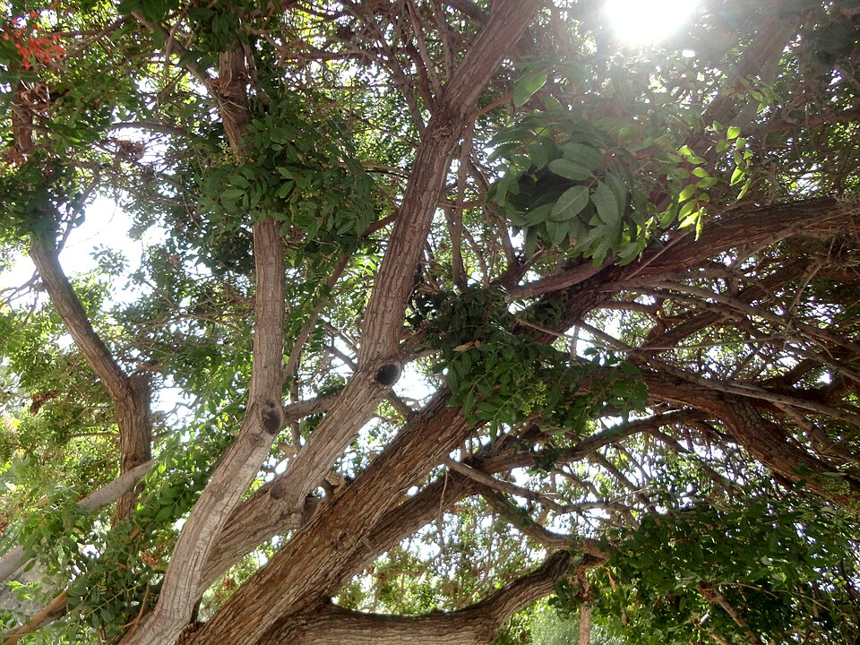{width="100%"}

:::{.smaller-text}
Foto: J.C. Fonseca Mata - CC BY-SA 4.0
:::

:::

::: {.column width="33%"}

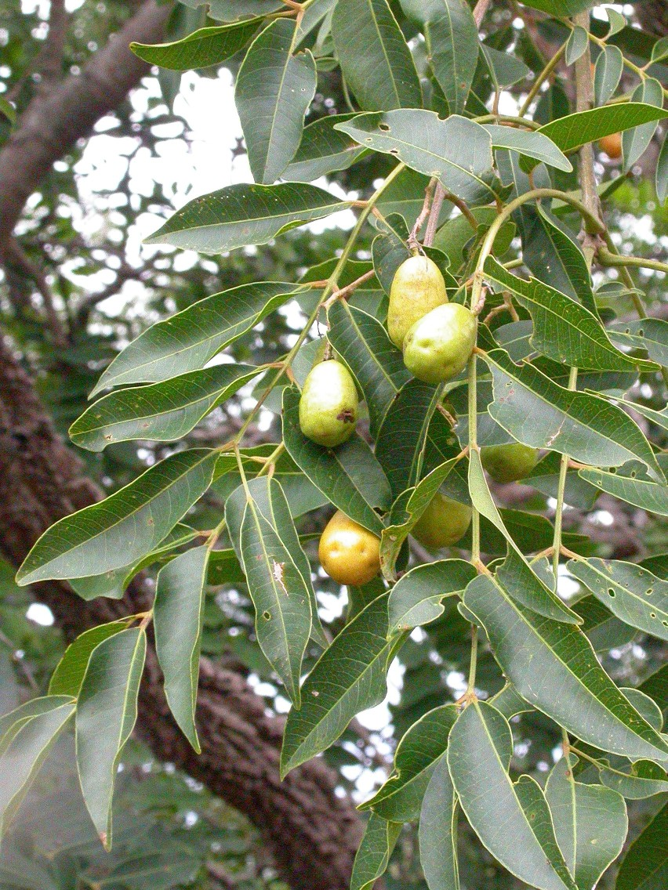{width="100%"}

:::{.smaller-text}
Foto: Marco Schmidt - CC BY-SA 2.5
:::

:::

::: {.column width="33%"}

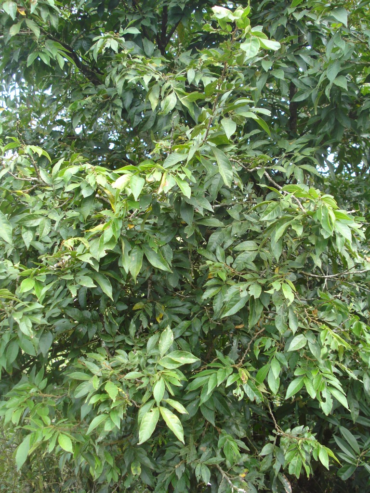{width="100%"}

:::{.smaller-text}
Foto: Paulo Schwirkowski - CC BY 3.0
:::

:::
:::

## Galeria de espécies - Grupo 2 {.smaller-text}

::: {.columns}
::: {.column width="25%"}

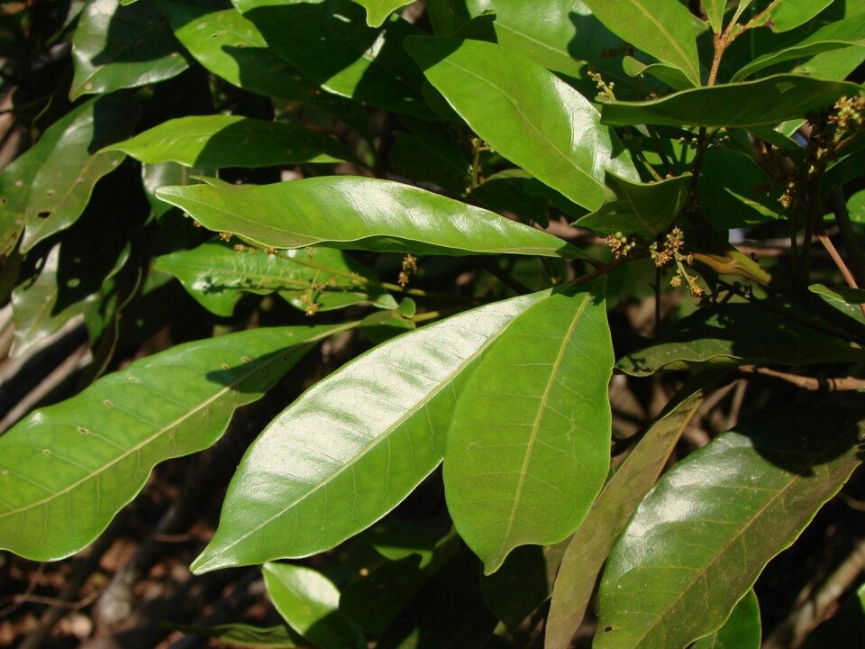{width="100%"}

:::{.smaller-text}
Foto: João Medeiros - CC BY 2.0
:::

:::

::: {.column width="25%"}

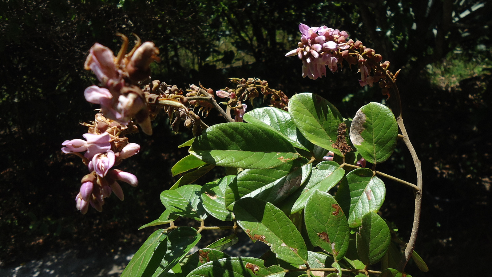{width="100%"}

:::{.smaller-text}
Foto: Alex Popovkin - CC BY 2.0
:::

:::

::: {.column width="25%"}

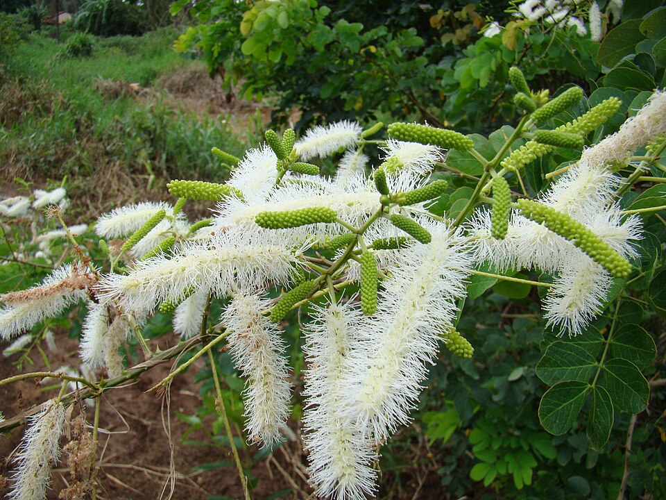{width="100%"}

:::{.smaller-text}
Foto: mauroguanandi - CC BY 2.0
:::

:::

::: {.column width="25%"}

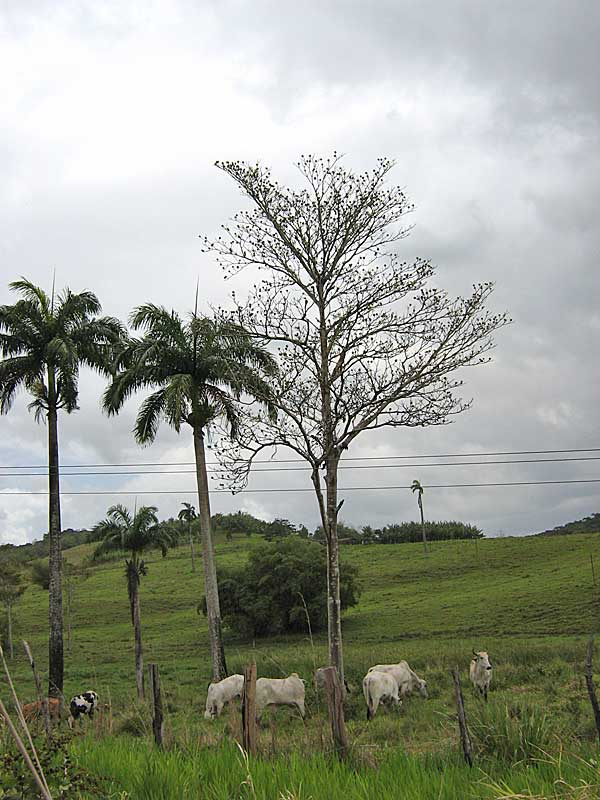{width="100%"}

:::{.smaller-text}
Foto: Alex Popovkin - CC BY 2.0
:::

:::
:::

## Preparação e plantio {.smaller-text}

::: {.columns}
::: {.column width="50%"}

### Processo de estaquia

```{mermaid}
%%| fig-width: 5
graph TD
    A["Seleção das<br>árvores-matrizes"] --> B["Coleta de<br>estacas basais"]
    B --> C["Preparo: 15-20 cm<br>Ø 0,5-1,5 cm"]
    C --> D["Corte: reto no ápice<br>ângulo na base"]
    D --> E["Acondicionamento<br>em água"]
    E --> F["Inserção nos<br>drenos verdes"]
    F --> G["Monitoramento do<br>enraizamento"]
    style A fill:#2E7D32,color:#fff
    style C fill:#FDB913,color:#000
    style F fill:#034EA2,color:#fff
    style G fill:#ED1C24,color:#fff
```

:::

::: {.column width="50%"}

### Fatores de sucesso

| Fator | Recomendação |
|-------|-------------|
| Época de coleta | Período de dormência |
| Número de gemas | Mínimo 3 por estaca |
| Hidratação | Permanente até plantio |
| Substrato | Fibras naturais no dreno |
| Estimulante | Extrato de feijão ou tiririca |

::: {.highlight-box}
🌿 O uso de **estimulantes naturais** (extrato de feijão ou tiririca) pode aumentar significativamente a taxa de enraizamento, substituindo reguladores de crescimento industriais de alto custo (Araújo Filho et al., 2019).
:::

:::
:::

# [6. MONITORAMENTO E BIOENSAIOS]{.section-header}

## Protocolo de monitoramento {.smaller-text}

::: {.columns}
::: {.column width="50%"}

### 1º Bioensaio - Germinação e crescimento (40 dias)

**Parâmetros avaliados:**

| Sigla | Parâmetro |
|-------|-----------|
| IGS | Início da germinação das sementes |
| G% | Porcentagem de germinação |
| IVG | Índice de velocidade de germinação |
| NFB | Número de folhas na bandeja |
| MSPAB | Massa seca parte aérea (bandeja) |
| CRB | Comprimento radicular (bandeja) |
| MSRB | Massa seca radicular (bandeja) |
| VRB | Volume radicular (bandeja) |
| DRB | Diâmetro radicular (bandeja) |

:::

::: {.column width="50%"}

### 2º Bioensaio - Produção em substrato

**Parâmetros avaliados:**

| Sigla | Parâmetro |
|-------|-----------|
| AV | Altura em vaso |
| NFV | Número de folhas em vaso |
| CRV | Comprimento radicular (vaso) |
| MSPAV | Massa seca parte aérea (vaso) |
| VRV | Volume radicular (vaso) |
| DRV | Diâmetro radicular (vaso) |
| PFr | Precocidade da floração |
| NFl | Número de flores |
| DEN | Dependência de estimulante natural |

:::
:::

## Índice de velocidade de germinação {.smaller-text}

::: {.columns}
::: {.column width="50%"}

### Fórmula do IVG

O **Índice de Velocidade de Germinação** (Maguire, 1962) mede a rapidez com que as sementes germinam:

$$IVG = \frac{N_1}{D_1} + \frac{N_2}{D_2} + \cdots + \frac{N_n}{D_n}$$

Onde:

- $N_i$ = número de brotações no dia $i$
- $D_i$ = dias após a semeadura

::: {.highlight-box}
📊 **IVG alto** → germinação rápida e uniforme → maior sucesso no estabelecimento dos feixes vivos.
:::

:::

::: {.column width="50%"}

### Delineamento experimental

```{mermaid}
%%| fig-width: 5
graph TD
    A["Delineamento<br>Inteiramente Casualizado"] --> B["Tratamento CO<br>Controle"]
    A --> C["Tratamento ENF<br>Estimulante de feijão"]
    A --> D["Tratamento ENT<br>Estimulante de tiririca"]
    B --> E["8 repetições"]
    C --> F["8 repetições"]
    D --> G["8 repetições"]
    E --> H["Avaliação<br>do 1º ao 40º dia"]
    F --> H
    G --> H
    style A fill:#034EA2,color:#fff
    style B fill:#FDB913,color:#000
    style C fill:#2E7D32,color:#fff
    style D fill:#ED1C24,color:#fff
```

:::
:::

## Análise radicular por imagem {.smaller-text}

::: {.columns}
::: {.column width="55%"}

### Sistema SAFIRA

O **Sistema de Análise de Fibras e Raízes** (SAFIRA) é utilizado para avaliar a morfologia radicular por processamento digital de imagens:

**Parâmetros extraídos:**

- **Volume radicular** (cm³)
- **Diâmetro ponderado** (mm)
- **Comprimento total** das raízes
- **Distribuição** de diâmetros

### Procedimento

1. Raízes lavadas e separadas
2. Digitalização em **placa digitalizadora**
3. Processamento pelo software SAFIRA
4. Cálculo da **densidade radicular**:

$$\rho_r = \frac{m_r}{V_r}$$

Onde: $m_r$ = massa radicular (g), $V_r$ = volume radicular (cm³)

:::

::: {.column width="45%"}

### Importância da análise

```{mermaid}
%%| fig-width: 4.5
graph TD
    A["Raízes<br>desenvolvidas"] --> B["Maior volume<br>radicular"]
    A --> C["Maior diâmetro<br>radicular"]
    B --> D["Maior reforço<br>do solo"]
    C --> D
    D --> E["Estabilização<br>efetiva da encosta"]
    style A fill:#2E7D32,color:#fff
    style D fill:#FDB913,color:#000
    style E fill:#034EA2,color:#fff
```

::: {.highlight-box}
🔬 O SAFIRA é o sucessor do SIARCS® - oferece ferramentas morfológicas mais completas para análise de raízes e fibras (Jorge & Rodrigues, 2008).
:::

:::
:::

# [7. ESTUDO DE CASO: CAMPUS RURAL (UFS-SE)]{.section-header}

## Área experimental {.smaller-text}

::: {.columns}
::: {.column width="55%"}

### Contexto

O experimento será conduzido no **Campus Rural da UFS** (Universidade Federal de Sergipe), em uma área de **antiga disposição irregular de resíduos sólidos** (lixão desativado).

### Preparação da área

1. **Remoção superficial** dos resíduos mais recentes e volumosos
2. **Redistribuição controlada** dos excedentes
3. **Compactação leve** do solo
4. Uniformização do terreno para instalação dos drenos

### Objetivos específicos

- Avaliar eficácia dos drenos verdes na **drenagem superficial**
- Monitorar **enraizamento** dos feixes vivos
- Quantificar a **retenção de umidade** e matéria orgânica
- Verificar **estabilidade** da encosta ao longo do tempo

:::

::: {.column width="45%"}

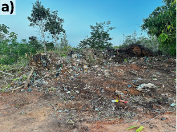{width="85%"}

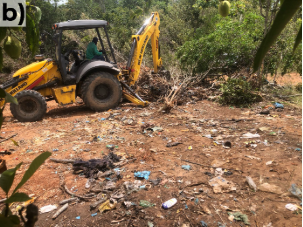{width="85%"}
:::
:::

## Preparação e instalação {.smaller-text}

::: {.columns}
::: {.column width="50%"}

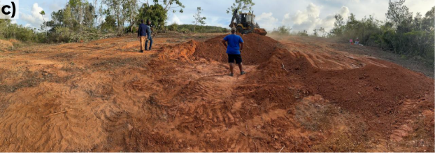{width="85%"}

### Etapas de campo

1. Limpeza e remoção de resíduos
2. Terraplenagem e compactação
3. Instalação dos drenos de polo
4. Conexão das fascinas laterais
5. Inserção dos feixes vivos
6. Monitoramento periódico

:::

::: {.column width="50%"}

### Registro fotográfico de campo

::: {layout-ncol=2}

{width="90%"}

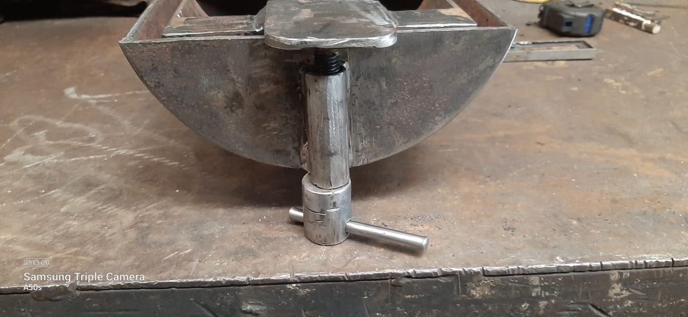{width="90%"}

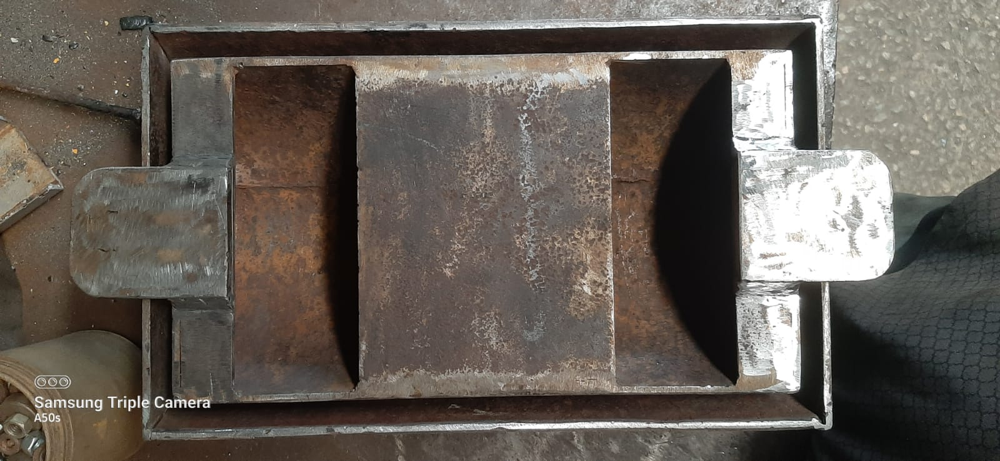{width="90%"}

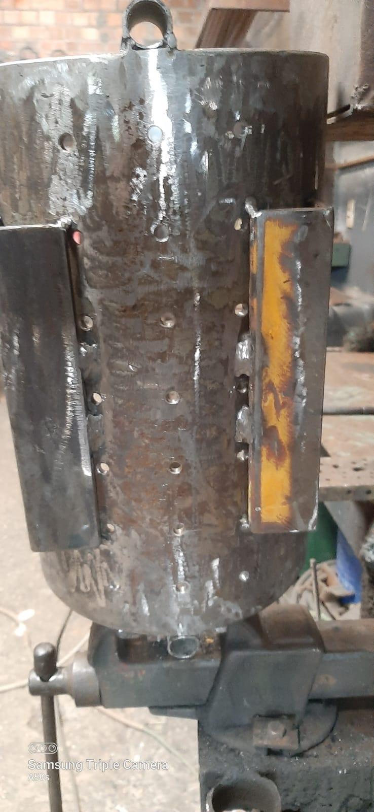{width="90%"}

:::
:::
:::

## Diagramas técnicos {.smaller-text}

::: {.columns}
::: {.column width="50%"}

### Projeto do sistema

::: {layout-ncol=2}

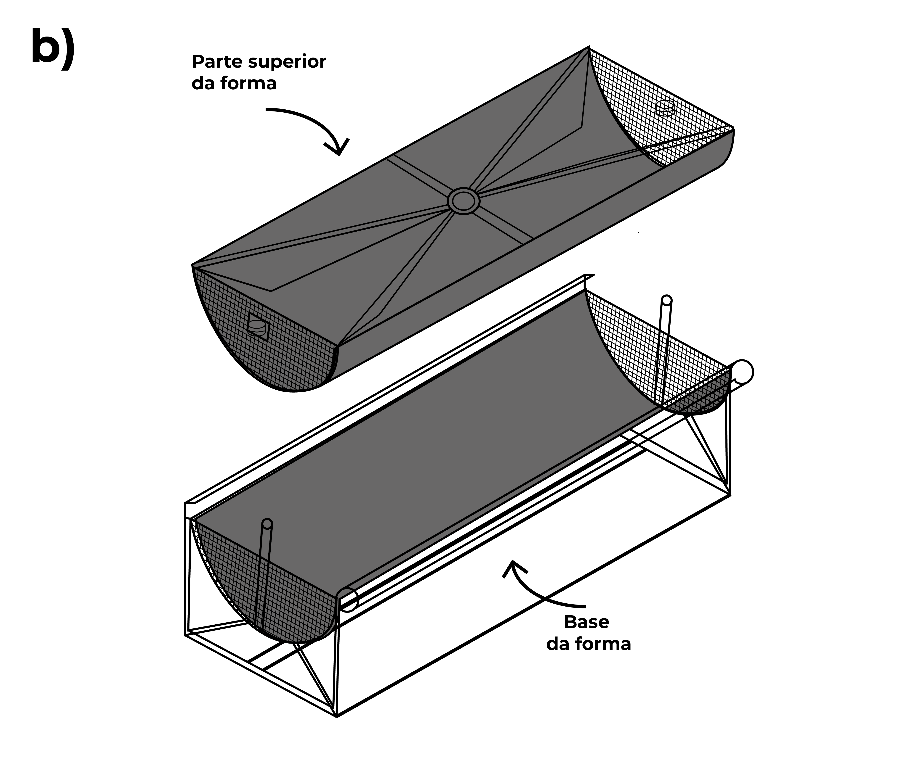{width="95%"}

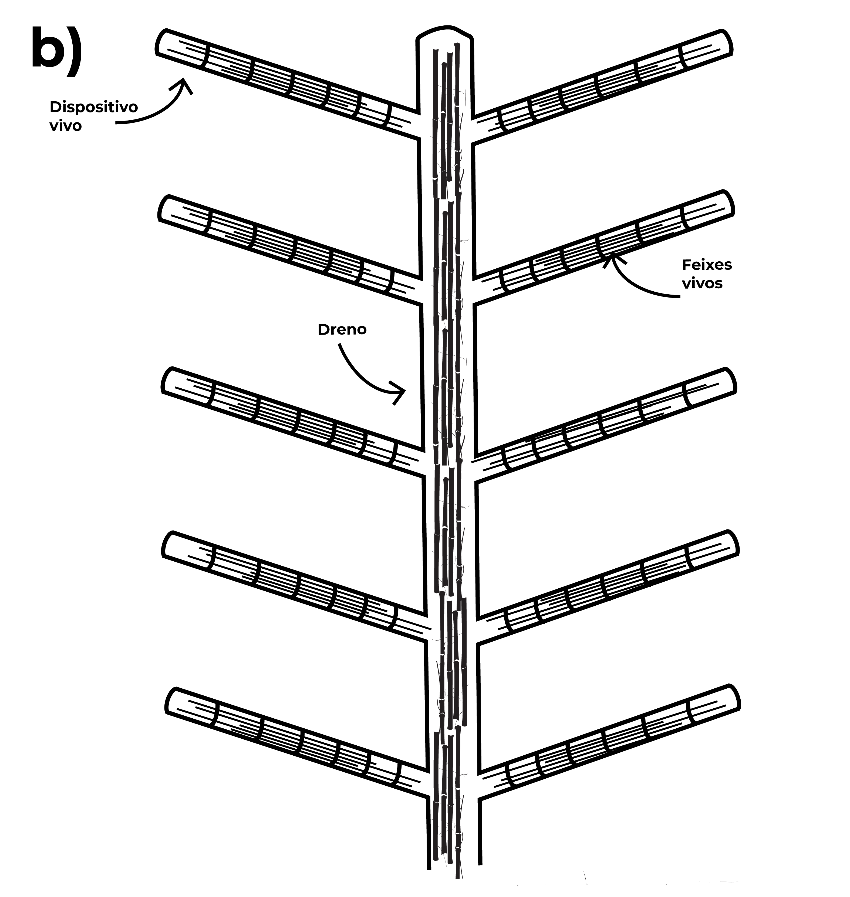{width="95%"}

:::

:::

::: {.column width="50%"}

::: {layout-ncol=2}

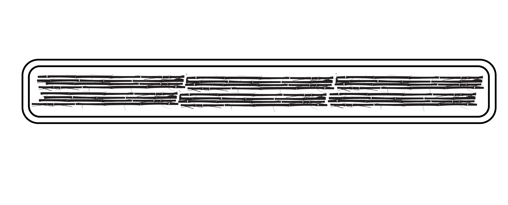{width="95%"}

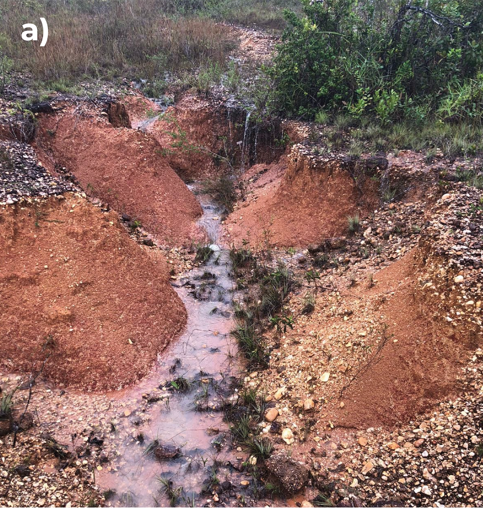{width="95%"}

:::

:::
:::

## Monitoramento de campo {.smaller-text}

::: {.columns}
::: {.column width="55%"}

### Cronograma de avaliações

| Período | Atividade |
|---------|-----------|
| Dia 0 | Instalação dos drenos e feixes |
| Dias 1-15 | Monitoramento diário de germinação |
| Dias 15-40 | Avaliação semanal (1º bioensaio) |
| Dia 40 | Transplante para vasos (2º bioensaio) |
| Dias 40-120 | Monitoramento quinzenal |
| Dia 120 | Avaliação final |

### Indicadores de sucesso

- ✅ Taxa de germinação > 70%
- ✅ Enraizamento > 80% das estacas
- ✅ Redução do escoamento superficial
- ✅ Aumento da infiltração
- ✅ Estabilidade visível da encosta

:::

::: {.column width="45%"}

### Registro de acompanhamento

::: {layout-ncol=2}

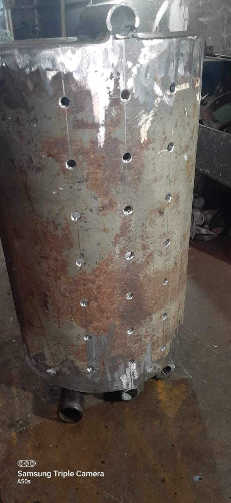{width="90%"}

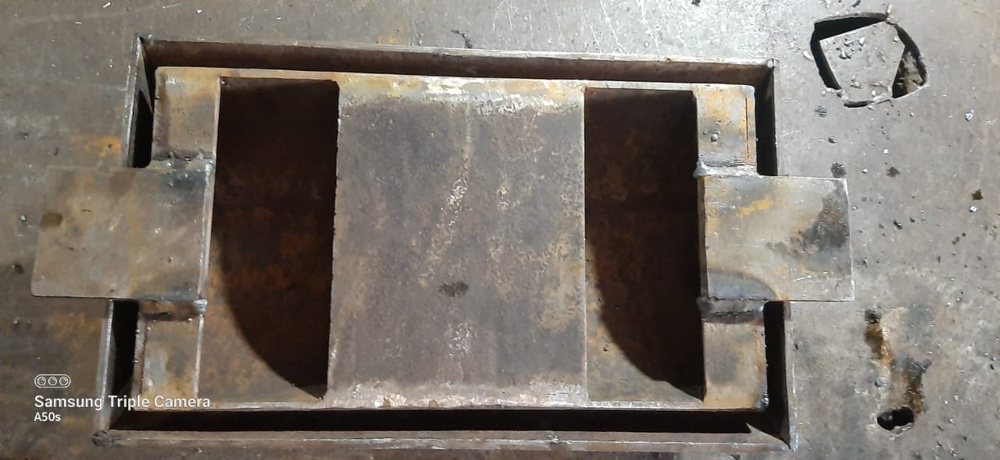{width="90%"}

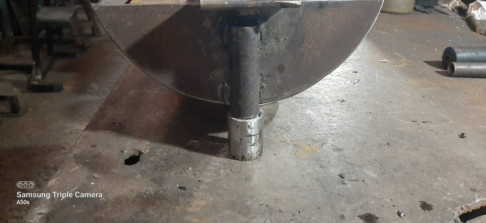{width="90%"}

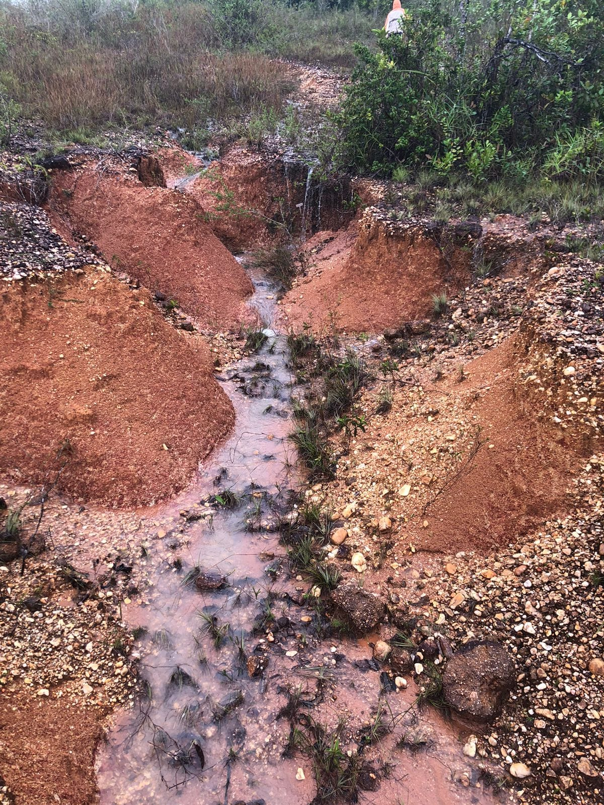{width="90%"}

:::
:::
:::

# [8. SÍNTESE E ATIVIDADE]{.section-header}

## Resumo dos conceitos-chave {.smaller-text}

::: {.columns}
::: {.column width="50%"}

### Pontos fundamentais

::: {.info-box}
1. **Seis técnicas de bioengenharia** vegetativa para estabilização de margens e encostas
2. **Drenos verdes** integram drenagem + substrato para revegetação
3. O sistema **espinha de peixe** otimiza a captação e condução da água
4. **Fibras de taboa e bananeira** oferecem substrato econômico e sustentável
5. **7 espécies** nativas com propagação por estaquia comprovada
6. **Bioensaios** permitem avaliar a eficácia do enraizamento
:::

:::

::: {.column width="50%"}

### Fluxo conceitual completo

```{mermaid}
%%| fig-width: 5
graph TD
    A["Técnicas de<br>bioengenharia"] --> B["Estacas, feixes,<br>muros, esteiras"]
    A --> C["Drenos verdes<br>Ø 20cm, ε 5mm"]
    D["Espécies nativas<br>7 espécies"] --> E["Feixes vivos<br>Estacas 15-20cm"]
    B --> F["Sistema espinha<br>de peixe"]
    C --> F
    E --> F
    F --> G["Estabilização<br>de encostas"]
    F --> H["Restauração<br>ecológica"]
    style A fill:#034EA2,color:#fff
    style B fill:#8B4513,color:#fff
    style C fill:#2E7D32,color:#fff
    style D fill:#FDB913,color:#000
    style G fill:#ED1C24,color:#fff
    style H fill:#2E7D32,color:#fff
```

:::
:::

## Atividade prática - Projeto de sistema {.smaller-text}

::: {.columns}
::: {.column width="55%"}

### Exercício em grupo

**Cenário:** Uma encosta de aterro sanitário desativado com 30 m de comprimento, declividade de 25° e solo argiloso apresenta sinais de erosão em sulcos.

**Projetem um sistema de drenos verdes com feixes vivos:**

1. Quantos **drenos de polo** serão necessários?
2. Qual o **espaçamento** entre as fascinas laterais?
3. Qual o **ângulo** de inserção das fascinas?
4. Quais **3 espécies** vocês escolheriam e por quê?
5. Qual **formulação** de dreno (G1, G2, G3) é mais adequada?
6. Elabore um **cronograma de monitoramento** para 120 dias

:::

::: {.column width="45%"}

### Critérios de avaliação

| Critério | Peso |
|----------|------|
| Coerência do dimensionamento | 25% |
| Justificativa das espécies | 20% |
| Escolha da formulação | 15% |
| Cronograma de monitoramento | 20% |
| Apresentação e clareza | 20% |

::: {.highlight-box}
⏱️ **Tempo**: 30 minutos para projeto + 10 minutos para apresentação por grupo.
:::

:::
:::

## Referências {.smaller-text}

::: {.smaller-text}

- Akil, H. M. et al. (2011). Kenaf fiber reinforced composites: A review. *Materials & Design*, 32(8-9), 4107-4121.
- Alqaisi, R., Le, T. M., & Khabbaz, H. (2020). Applications of Recycled Sustainable Materials in Soil Stabilization. Springer.
- Araújo Filho, R. N. et al. (2019). Effect of indolebutyric acid on rooting and budding of cuttings. *JEAP*, 297-303.
- Biedenharn, D.S., Elliott, C.M., & Watson, C.C. (1997). The WES Stream Investigation and Streambank Stabilization Handbook. USACE.
- Chokshi, S. et al. (2022). Chemical Composition and Mechanical Properties of Natural Fibers. *J. Natural Fibers*, 19(10), 3942-3953.
- Das, P. P. et al. (2021). Influence of Moisture Uptake on Mechanical Properties of NF-Reinforced Composites. CRC Press.
- Evette, A. et al. (2009). History of Bioengineering Techniques for Erosion Control in Rivers. *Env. Management*, 43(6), 972-984.
- FISRWG (1998). Stream Corridor Restoration: Principles, Processes, Practices. USDA-NRCS.
- Gray, D.H. & Sotir, R.B. (1996). Biotechnical and Soil Bioengineering Slope Stabilization. Wiley.
- Jorge, L. A. C. & Rodrigues, A. F. O. (2008). SAFIRA: Sistema de Análise de Fibras e Raízes. Embrapa.
- Lenz, L. et al. (2019). Bioengenharia de solos como alternativa sustentável. *XXIII SBRH*.
- Li, M.H. & Eddleman, K.E. (2002). Biotechnical Engineering as an Alternative. *Landscape Urban Plan.*, 60(4), 225-242.
- Lyn, D.A. & Newton, J.F. (2015). Approaches to the Design of Biotechnical Streambank Stabilization. Purdue Univ.
- Morokong, T. & Blignaut, J. N. (2019). Benefits and costs of soil erosion control. *Land Use Policy*, 83, 512-522.
- Rey, F. et al. (2019). Soil and water bioengineering. *Science Total Env.*, 648, 1210-1218.
- Santos, L.D.V. et al. (2020). Prospecção tecnológica sobre PD&I em Recursos Hídricos. *Rev. Ibero-Am. Ciências Ambientais*.
- USDA-NRCS (1996). Streambank and Shoreline Protection. Chapter 16, EFH Part 650.
- USDA-NRCS (2007). Streambank Soil Bioengineering. Technical Supplements, NEH Part 654.

:::

## {.obrigado-fit-text}

::: {.columns}
::: {.column width="100%" style="text-align: center;"}

[Obrigado!]{.obrigado-fit-text}

**Prof. Luiz Diego Vidal Santos**

📧 luiz.diego@uefs.br

🌐 [ldvsantos.github.io/cv](https://ldvsantos.github.io/cv)

:::
:::
