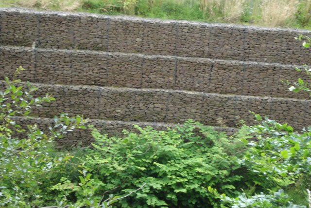
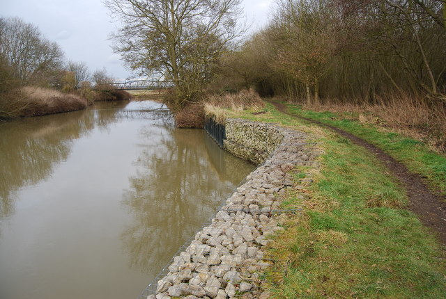

## Visão Geral da Aula {.smaller-text}

::: {.columns}
::: {.column width="50%"}
### Tópicos

- [1]{.circle} O que é o gabião vivo?
- [2]{.circle} Gabião convencional × gabião vivo
- [3]{.circle} Materiais e componentes
- [4]{.circle} Projeto estrutural (empuxo e estabilidade)
- [5]{.circle} Intercalação de camadas vegetais
- [6]{.circle} Construção e implantação
- [7]{.circle} Transição arame → raízes
- [8]{.circle} Síntese e atividade
:::

::: {.column width="50%"}
::: {.info-box}
**Objetivo da Aula**

Compreender o conceito de **gabião vivo** (*vegetated gabion* ou *green gabion*) como técnica de **estabilização estrutural** que combina a resistência imediata das **gaiolas de arame com pedra** e o reforço progressivo proporcionado por **camadas de ramos vivos** intercalados, cujas raízes **substituem a função do arame** ao longo do tempo.
:::
:::
:::

# [1. O QUE É O GABIÃO VIVO?]{.section-header}

## Definição e conceito {.smaller-text}

::: {.columns}
::: {.column width="55%"}

### Conceito

O **gabião vivo** (*vegetated gabion*) é uma estrutura de contenção composta por:

- **Gaiolas de arame** (tela de malha hexagonal ou soldada) preenchidas com **pedras**
- **Camadas horizontais de ramos vivos** intercaladas entre as fiadas de gabião
- **Solo fértil** ao redor dos ramos para facilitar o enraizamento

::: {.highlight-box}
💡 A grande inovação é o **ciclo de substituição**: o arame resiste de imediato (5-15 anos), mas inevitavelmente corrói. Nesse ínterim, as **raízes** crescem, entrelaçam as pedras e **assumem a função estrutural** que o arame deixa de cumprir.
:::

### Princípio da transição

```{mermaid}
%%| fig-width: 5
graph LR
    A["Ano 0<br>100% arame<br>0% raízes"] --> B["Ano 5<br>70% arame<br>40% raízes"]
    B --> C["Ano 10<br>30% arame<br>80% raízes"]
    C --> D["Ano 15+<br>0% arame<br>100% raízes"]
    style A fill:#2135A6,color:#fff
    style B fill:#586BA6,color:#000
    style C fill:#2E7D32,color:#fff
    style D fill:#2E7D32,color:#fff
```
:::

::: {.column width="45%"}

### Aplicações típicas

| Local | Função |
|-------|--------|
| Margens fluviais | Contenção + restauração ciliar |
| Base de taludes | Muro de arrimo ecológico |
| Saída de bueiros | Dissipação + revegetação |
| Ravinas profundas | Estabilização de fundo |
| Encostas urbanas | Muro verde paisagístico |
| Estradas rurais | Proteção de aterros |

> O gabião vivo é particularmente indicado em locais onde o gabião convencional cumpriria a função, mas a **exigência ambiental** requer restauração ecológica (APP, PRAD).
:::
:::

## Galeria: Gabiões em campo {.smaller-text}

::: {.columns}
::: {.column width="50%"}

{width="100%"}

:::{.smaller-text}
Foto: Morley Sewell - CC BY-SA 2.0
:::
:::

::: {.column width="50%"}

{width="100%"}

:::{.smaller-text}
Foto: Nigel Chadwick - CC BY-SA 2.0
:::
:::
:::

## Histórico e normas {.smaller-text}

::: {.columns}
::: {.column width="50%"}

### Evolução

- **1890s**: Gabiões de arame inventados na Itália (Maccaferri, 1894)
- **1950s**: Popularização global em obras hidráulicas
- **1980s**: Primeiras experiências de vegetação em gabiões na Áustria e Suíça
- **1990s**: Consolidação da técnica "gabião vivo" na bioengenharia europeia
- **2000s em diante**: Adoção em projetos de restauração no Brasil

### Normas aplicáveis

| Norma | Escopo |
|-------|--------|
| EN 10223-3 | Tela de arame hexagonal |
| ASTM A975 | Gabiões e colchões Reno |
| ABNT NBR 10514 | Gabiões - Requisitos |
| DNIT 082/2006-ES | Gabião em obras rodoviárias |

:::

::: {.column width="50%"}

### Vantagens do gabião vivo

| Aspecto | Gabião convencional | Gabião vivo |
|---------|-------------------|-------------|
| Estabilidade imediata | ★★★★★ | ★★★★★ |
| Durabilidade do arame | 15-30 anos | **Irrelevante** (raízes assumem) |
| Custo de manutenção | Substituição de arame | **Zero** (autossustentável) |
| Impacto ambiental | Neutro | **Positivo** |
| Habitat para fauna | Mínimo | ★★★★★ |
| Estética/paisagismo | ★★☆☆☆ | ★★★★★ |

::: {.highlight-box}
🔄 A **durabilidade limitada do arame** (principal crítica ao gabião convencional) torna-se **irrelevante** quando as raízes substituem sua função antes da corrosão total.
:::
:::
:::

# [2. GABIÃO CONVENCIONAL × GABIÃO VIVO]{.section-header}

## Comparação estrutural {.smaller-text}

::: {.columns}
::: {.column width="50%"}

### Gabião convencional

- Gaiolas: tela hexagonal dupla torção (galvanizada + PVC)
- Preenchimento: pedras britadas (D > 1,5 × malha)
- Função: **peso próprio** resiste ao empuxo do solo
- Vida útil: 30-50 anos (revestimento PVC)
- Sem componente biológico
- Flexível (adapta a recalques)

### Gabião vivo

- Mesma estrutura base do convencional
- **Camadas de ramos vivos** a cada 1-2 fiadas
- **Solo fértil** envolvendo os ramos (5-10 cm)
- Função: **peso próprio + coesão radicular**
- Vida útil: **ilimitada** (sistema vivo autorrenovável)
- Flexível + autorreparável

:::

::: {.column width="50%"}

### Seção transversal comparativa

```{mermaid}
%%| fig-width: 5
graph TD
    subgraph Convencional["Gabião Convencional"]
        A1["Fiada 3 - Pedras"]
        A2["Fiada 2 - Pedras"]
        A3["Fiada 1 - Pedras"]
    end
    subgraph Vivo["Gabião Vivo"]
        B1["Fiada 3 - Pedras"]
        B2["🌿 Camada de ramos vivos"]
        B3["Fiada 2 - Pedras"]
        B4["🌿 Camada de ramos vivos"]
        B5["Fiada 1 - Pedras"]
    end
    style A1 fill:#8B4513,color:#fff
    style A2 fill:#8B4513,color:#fff
    style A3 fill:#8B4513,color:#fff
    style B1 fill:#8B4513,color:#fff
    style B2 fill:#2E7D32,color:#fff
    style B3 fill:#8B4513,color:#fff
    style B4 fill:#2E7D32,color:#fff
    style B5 fill:#8B4513,color:#fff
```

::: {.highlight-box}
🌱 A intercalação de **camadas vegetais** é a única diferença construtiva, mas transforma uma estrutura **inerte** em um **ecossistema vivo**. Com o tempo, os ramos enraízam, germinam e entrelaçam as pedras.
:::
:::
:::

# [3. MATERIAIS E COMPONENTES]{.section-header}

## Especificações técnicas {.smaller-text}

::: {.columns}
::: {.column width="50%"}

### Componentes estruturais

**Tela de arame:**

| Parâmetro | Especificação |
|-----------|--------------|
| Tipo | Hexagonal dupla torção |
| Fio | Ø 2,7 mm (alma) + revestimento |
| Revestimento | Galfan + PVC (5 mm externo) |
| Malha | 8 × 10 cm ou 6 × 8 cm |
| Resistência | 40-50 kN m⁻¹ |

**Pedras de preenchimento:**

| Parâmetro | Especificação |
|-----------|--------------|
| Dimensão mínima | 1,5 × abertura da malha |
| Dimensão típica | 10-25 cm |
| Dureza (Mohs) | > 5 |
| Absorção de água | < 5% |
| Resistência compressão | > 50 MPa |

:::

::: {.column width="50%"}

### Componentes biológicos

**Ramos vivos:**

| Parâmetro | Especificação |
|-----------|--------------|
| Diâmetro | 1-5 cm |
| Comprimento | 80-150 cm |
| Projeção externa | 20-30 cm além da face |
| Espécies | Propagação por estaquia |
| Coleta | Período de dormência |

**Solo de envolvimento:**

| Parâmetro | Especificação |
|-----------|--------------|
| Tipo | Franco ou franco-argiloso |
| Matéria orgânica | > 3% |
| pH | 5,5 - 7,0 |
| Espessura da camada | 5-10 cm |

::: {.highlight-box}
🪨 Os ramos vivos devem **projetar-se 20-30 cm** além da face externa do gabião para garantir exposição ao sol e chuva, favorecendo a brotação e o crescimento.
:::
:::
:::

# [4. PROJETO ESTRUTURAL]{.section-header}

## Verificação de estabilidade {.smaller-text}

::: {.columns}
::: {.column width="55%"}

### Verificações obrigatórias

O gabião vivo é verificado como um **muro de gravidade**:

**1. Tombamento** (FS ≥ 2,0):

$$FS_{tomb} = \frac{\sum M_{estab}}{\sum M_{tomb}} \geq 2,0$$

**2. Deslizamento** (FS ≥ 1,5):

$$FS_{desl} = \frac{N \cdot \tan(\phi) + c \cdot B}{E_a} \geq 1,5$$

**3. Capacidade de carga** (FS ≥ 3,0):

$$\sigma_{max} = \frac{N}{B}\left(1 + \frac{6e}{B}\right) \leq \sigma_{adm}$$

Onde:

- $N$ = peso próprio do gabião (kN m⁻¹)
- $E_a$ = empuxo ativo do solo (Rankine ou Coulomb)
- $\phi$ = ângulo de atrito base-fundação
- $c$ = coesão do solo de fundação
- $B$ = largura da base
- $e$ = excentricidade da resultante

:::

::: {.column width="45%"}

### Empuxo ativo (Rankine)

$$E_a = \frac{1}{2} \gamma H^2 K_a$$

$$K_a = \tan^2\left(45° - \frac{\phi}{2}\right)$$

### Peso do gabião vivo

$$W = \gamma_{gab} \times V_{gab}$$

Onde $\gamma_{gab}$ ≈ 16-18 kN m⁻³ (pedra + vazios + solo)

### Dimensionamento típico

| Altura | Base mínima | Nº de fiadas |
|--------|-------------|-------------|
| 1,0 m | 0,5-1,0 m | 1 |
| 2,0 m | 1,0-1,5 m | 2 |
| 3,0 m | 1,5-2,5 m | 3 |
| 4,0 m | 2,0-3,0 m | 4 |

::: {.highlight-box}
📐 As camadas vegetais **não alteram significativamente o peso próprio**, mas adicionam **coesão radicular** ($c_r$) ao longo do tempo, melhorando progressivamente a estabilidade.
:::
:::
:::

# [5. INTERCALAÇÃO DE CAMADAS VEGETAIS]{.section-header}

## Disposição dos ramos vivos {.smaller-text}

::: {.columns}
::: {.column width="55%"}

### Posicionamento

```{mermaid}
%%| fig-width: 5.5
graph TD
    A["Fiada superior<br>(pedras)"] --> B["Camada de ramos<br>(solo + estacas vivas)"]
    B --> C["Fiada intermediária<br>(pedras)"]
    C --> D["Camada de ramos<br>(solo + estacas vivas)"]
    D --> E["Fiada inferior<br>(pedras - base)"]
    B -->|"Projeção 20-30 cm<br>além da face"| F["Brotação<br>e cobertura"]
    D -->|"Raízes penetram<br>no solo natural"| G["Ancoragem<br>profunda"]
    style A fill:#8B4513,color:#fff
    style B fill:#2E7D32,color:#fff
    style C fill:#8B4513,color:#fff
    style D fill:#2E7D32,color:#fff
    style E fill:#8B4513,color:#fff
    style F fill:#586BA6,color:#000
    style G fill:#2135A6,color:#fff
```

### Regras de intercalação

- Camada vegetal **a cada 0,5-1,0 m** de altura
- Ramos dispostos **perpendiculares à face** do gabião
- Pontas projetadas **20-30 cm** além da face externa
- Solo fértil **5-10 cm** ao redor dos ramos
- **10-15 ramos** por metro linear de gabião

:::

::: {.column width="45%"}

### Espécies recomendadas

| Espécie | Região | Enraizamento |
|---------|--------|-------------|
| *Salix humboldtiana* | S, SE, NE | Muito rápido |
| *Phyllanthus sellowianus* | S, SE | Rápido |
| *Calliandra brevipes* | SE, CO | Moderado |
| *Erythrina crista-galli* | S, SE | Rápido |
| *Gliricidia sepium* | NE | Muito rápido |
| *Schinus terebinthifolia* | Todo Brasil | Moderado |

### Cuidados na intercalação

::: {.highlight-box}
⚠️ **Atenção:**

- Ramos **devem tocar o solo natural** no tardoz do gabião (não ficar somente sobre pedras)
- A camada de solo **não deve bloquear** a drenagem interna do gabião
- Irrigar nos primeiros 30 dias se época seca
:::
:::
:::

# [6. CONSTRUÇÃO E IMPLANTAÇÃO]{.section-header}

## Procedimento construtivo {.smaller-text}

::: {.columns}
::: {.column width="55%"}

### Etapas de construção

```{mermaid}
%%| fig-width: 5
graph TD
    A["1. Fundação<br>Escavação + nivelamento"] --> B["2. Montagem da gaiola<br>Tela + tirantes internos"]
    B --> C["3. Preenchimento<br>1ª fiada com pedras"]
    C --> D["4. Camada vegetal<br>Solo + ramos vivos"]
    D --> E["5. Nova gaiola<br>2ª fiada sobre a 1ª"]
    E --> F["6. Preenchimento<br>2ª fiada com pedras"]
    F --> G["7. Camada vegetal<br>(repetir se necessário)"]
    G --> H["8. Fechamento<br>Tampa + amarração"]
    H --> I["9. Reaterro tardoz<br>+ drenagem"]
    style A fill:#2135A6,color:#fff
    style C fill:#8B4513,color:#fff
    style D fill:#2E7D32,color:#fff
    style F fill:#8B4513,color:#fff
    style G fill:#2E7D32,color:#fff
```

### Detalhes importantes

- Pedras colocadas **manualmente** (não despejadas)
- Tirantes internos a cada **33 cm** de altura
- Costura entre gaiolas com arame galvanizado
- Ramos inseridos **durante** a construção (não depois)

:::

::: {.column width="45%"}

### Cronograma de obra

| Etapa | Tempo estimado |
|-------|---------------|
| Fundação (10 m) | 1 dia |
| Montagem + preenchimento (1 fiada, 10 m) | 1-2 dias |
| Camada vegetal (10 m) | 0,5 dia |
| Fechamento + reaterro (10 m) | 1 dia |
| **Total para muro 2 m × 10 m** | **5-7 dias** |

### Equipe típica

| Função | Quantidade |
|--------|-----------|
| Encarregado | 1 |
| Operários (gabião) | 4-6 |
| Técnico agrícola (vegetação) | 1 |
| Operador de máquina | 1 |

::: {.highlight-box}
🗓️ O plantio das camadas vegetais deve ser feito **preferencialmente na estação chuvosa** para garantir o enraizamento dos ramos vivos antes do período seco.
:::
:::
:::

# [7. TRANSIÇÃO ARAME → RAÍZES]{.section-header}

## O ciclo de vida do gabião vivo {.smaller-text}

::: {.columns}
::: {.column width="50%"}

### Fases do sistema

| Fase | Período | Descrição |
|------|---------|-----------|
| **Estrutural** | 0-5 anos | Arame sustenta; raízes crescem |
| **Transição** | 5-15 anos | Arame corrói; raízes assumem |
| **Biológica** | 15+ anos | Raízes dominam; gabião "desaparece" |

### Mecanismos de reforço radicular

As raízes contribuem para a estabilidade de três formas:

1. **Coesão radicular** ($c_r$): raízes adicionam coesão ao solo intra e inter-pedras
2. **Ancoragem profunda**: raízes penetram solo natural além do gabião
3. **Entrelaçamento**: raízes "costuram" fiadas e conectam pedras

$$\tau_f = c + c_r + (\sigma - u) \tan \phi$$

Onde $c_r$ = reforço de coesão pelas raízes (5-25 kPa, depende da espécie/densidade).

:::

::: {.column width="50%"}

### Evolução da resistência

```{mermaid}
%%| fig-width: 5
graph TD
    A["Ano 0-2<br>Arame: 100%<br>Raízes: 5%"] --> B["Ano 5<br>Arame: 85%<br>Raízes: 40%"]
    B --> C["Ano 10<br>Arame: 50%<br>Raízes: 75%"]
    C --> D["Ano 15<br>Arame: 20%<br>Raízes: 95%"]
    D --> E["Ano 20+<br>Arame: 0%<br>Raízes: 100%"]
    style A fill:#2135A6,color:#fff
    style B fill:#586BA6,color:#000
    style C fill:#586BA6,color:#000
    style D fill:#2E7D32,color:#fff
    style E fill:#2E7D32,color:#fff
```

::: {.highlight-box}
🔄 Este é o princípio fundamental da **engenharia natural**: a estrutura construída é **temporária e biodegradável**, mas cumpre sua função até que o **componente biológico** a substitua permanentemente.
:::

> Estudos na Suíça demonstraram que gabiões vivos com *Salix* atingem **coesão radicular de 15-25 kPa** em 5 anos, suficiente para manter a estabilidade após a corrosão total do arame (Böll et al., 2009).
:::
:::

# [8. SÍNTESE E ATIVIDADE]{.section-header}

## Resumo dos conceitos-chave {.smaller-text}

::: {.columns}
::: {.column width="50%"}

### Pontos fundamentais

::: {.info-box}
1. **Gabião vivo** = gabião convencional + camadas de ramos vivos intercalados
2. O **arame** fornece resistência imediata; as **raízes** assumem a longo prazo
3. O **projeto estrutural** segue as mesmas verificações de muro de gravidade
4. Ramos vivos projetam-se **20-30 cm** além da face externa
5. A **coesão radicular** ($c_r$) substitui a função do arame corroído
6. O resultado final é um **ecossistema autossustentável** que substitui a engenharia
:::

:::

::: {.column width="50%"}

### Fluxo conceitual

```{mermaid}
%%| fig-width: 5
graph TD
    A["Gaiola de arame<br>+ pedras"] --> E["Gabião<br>vivo"]
    B["Ramos vivos<br>intercalados"] --> E
    C["Solo fértil<br>envolvimento"] --> E
    E --> F["Estabilidade<br>imediata (arame)"]
    E --> G["Enraizamento<br>progressivo"]
    G --> H["Coesão radicular<br>cr = 5-25 kPa"]
    H --> I["Corrosão do arame<br>= irrelevante"]
    I --> J["Ecossistema<br>autossustentável"]
    style A fill:#2135A6,color:#fff
    style B fill:#2E7D32,color:#fff
    style E fill:#586BA6,color:#000
    style H fill:#2E7D32,color:#fff
    style J fill:#2E7D32,color:#fff
```
:::
:::

## Atividade prática - Projeto de gabião vivo {.smaller-text}

::: {.columns}
::: {.column width="55%"}

### Exercício em grupo

**Cenário:** A margem esquerda de um córrego urbano em Feira de Santana (BA) apresenta erosão ativa com desbarrancamento de 2,5 m de altura. O solo é argiloso ($\gamma = 18$ kN m⁻³, $\phi = 25°$, $c = 10$ kPa). O local está em APP.

**Projetem o gabião vivo:**

1. Calcule o **empuxo ativo** do solo ($E_a$)
2. Dimensione a **seção transversal** (largura de base necessária)
3. Verifique **tombamento** e **deslizamento** (FS)
4. Especifique a **tela de arame** e as **pedras**
5. Defina as **camadas vegetais** (espaçamento, espécies, nº de ramos)
6. Estime o **prazo de transição** arame → raízes
7. Elabore o **cronograma de execução e monitoramento**

:::

::: {.column width="45%"}

### Critérios de avaliação

| Critério | Peso |
|----------|------|
| Cálculo de empuxo | 20% |
| Verificação de estabilidade | 25% |
| Especificação de materiais | 15% |
| Projeto das camadas vegetais | 20% |
| Cronograma de obra | 20% |

::: {.highlight-box}
⏱️ **Tempo**: 40 minutos para projeto + 10 minutos para apresentação por grupo.
:::

:::
:::

## Referências {.smaller-text}

::: {.smaller-text}

- ABNT (2018). NBR 10514:2018 - Gabiões e colchões Reno - Requisitos.
- Böll, A. et al. (2009). Root reinforcement and slope stability - A practical review. *Swiss Federal Institute for Forest, Snow and Landscape Research WSL*.
- DNIT (2006). DNIT 082/2006 - ES: Gabião. Departamento Nacional de Infraestrutura de Transportes.
- Gray, D. H. & Sotir, R. B. (1996). *Biotechnical and Soil Bioengineering Slope Stabilization*. John Wiley & Sons.
- Maccaferri (2019). *Gabiões e Muros de Solo Reforçado - Manual Técnico*. Officine Maccaferri S.p.A.
- Norris, J. E. et al. (2008). *Slope Stability and Erosion Control: Ecotechnological Solutions*. Springer.
- Palmeira, E. M. & Tatto, J. (2015). Performance of gabiões as retaining structures. *Geotech. Geol. Engineering*, 33(4), 973-985.
- Schiechtl, H. M. & Stern, R. (1996). *Ground Bioengineering Techniques*. Blackwell Science.
- Stokes, A. et al. (2009). Desirable plant root traits for protecting natural and engineered slopes. *Plant Soil*, 324, 1-30.

:::

## {.obrigado-fit-text .center}

::: {.columns}
::: {.column width="100%" style="text-align: center;"}

[Obrigado!]{.obrigado-fit-text}

**Prof. Luiz Diego Vidal Santos**

📧 luiz.diego@uefs.br

🌐 [ldvsantos.github.io/cv](https://ldvsantos.github.io/cv)

:::
:::
