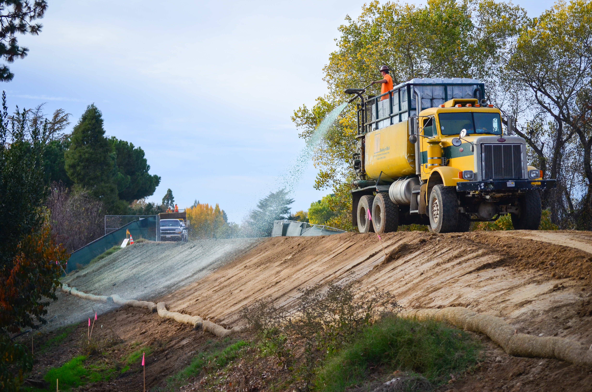

## Visão Geral da Aula {.smaller-text}

::: {.columns}
::: {.column width="50%"}
### Tópicos

- [1]{.circle} O que é hidrossemeadura?
- [2]{.circle} Composição da pasta (slurry)
- [3]{.circle} Tipos de mulch e fixadores
- [4]{.circle} Equipamentos e aplicação
- [5]{.circle} Dimensionamento e taxa de aplicação
- [6]{.circle} Hidrossemeadura em taludes rodoviários
- [7]{.circle} Monitoramento e manutenção
- [8]{.circle} Síntese e atividade
:::

::: {.column width="50%"}
::: {.info-box}
**Objetivo da Aula**

Compreender os princípios da **hidrossemeadura** (*hydroseeding*) como técnica de **revegetação rápida** de grandes áreas e taludes íngremes, dominar a **formulação da pasta** (slurry), os critérios de **dimensionamento** e os protocolos de **aplicação e monitoramento** para garantir cobertura vegetal eficiente.
:::
:::
:::

# [1. O QUE É HIDROSSEMEADURA?]{.section-header}

## Definição e contexto {.smaller-text}

::: {.columns}
::: {.column width="55%"}

### Conceito

A **hidrossemeadura** (*hydroseeding* ou *hydraulic mulch seeding*) é uma técnica de revegetação que consiste na **aplicação por jateamento** de uma mistura aquosa contendo:

- **Sementes** de gramíneas e/ou leguminosas
- **Mulch** (fibra protetora)
- **Fertilizantes** (NPK, calcário)
- **Fixadores** (aglutinantes / tackifiers)
- **Água** como veículo

::: {.highlight-box}
💡 A técnica é ideal para **cobrir grandes áreas rapidamente**, especialmente taludes íngremes onde métodos manuais de semeadura são inviáveis ou muito onerosos.
:::
:::

::: {.column width="45%"}

### Aplicações típicas

| Área de aplicação | Exemplo |
|-------------------|---------|
| Rodovias | Taludes de corte e aterro |
| Mineração | Recuperação de cavas e pilhas |
| Obras hidráulicas | Canais e barragens |
| Áreas urbanas | Encostas e lotes vagos |
| Aeroportos | Faixas de segurança |
| Ferrovias | Taludes laterais |

> A hidrossemeadura permite cobrir até **5.000 m² h⁻¹** com um único equipamento (Bento, 2009).
:::
:::

## Galeria: Hidrossemeadura em campo {.smaller-text}

::: {.columns}
::: {.column width="50%"}

{width="100%"}

:::{.smaller-text}
Fonte: USACE Sacramento District - Public Domain
:::
:::

::: {.column width="50%"}

{width="100%"}

{width="100%"}

:::{.smaller-text}
Fontes: Andaluza de Hidrosiembras (CC BY-SA 4.0) · Kulja~rowiki (CC0) - Wikimedia Commons
:::
:::
:::

## Histórico e evolução {.smaller-text}

::: {.columns}
::: {.column width="55%"}

### Linha do tempo

- **1940s-1950s**: Primeiras aplicações nos EUA para controle de erosão em rodovias (Connecticut, 1953)
- **1960s**: Difusão para mineração e grandes obras de infraestrutura
- **1970s-1980s**: Introdução de mulch de fibra de madeira e fixadores poliméricos
- **1990s**: Chegada ao Brasil, inicialmente em obras do DNER
- **2000s em diante**: Avanço com mulch biodegradáveis, sementes nativas e formulações regionalizadas

::: {.highlight-box}
🌎 No Brasil, a hidrossemeadura ganhou impulso com as **exigências do licenciamento ambiental** (CONAMA 369/2006) e programas de **recuperação de áreas degradadas** (PRAD).
:::
:::

::: {.column width="45%"}

### Vantagens sobre semeadura manual

```{mermaid}
%%| fig-width: 4.5
graph TD
    A["Semeadura manual"] -->|"Lenta<br>Desuniforme"| C["Cobertura<br>parcial"]
    B["Hidrossemeadura"] -->|"Rápida<br>Uniforme"| D["Cobertura<br>total"]
    D --> E["Menor erosão"]
    D --> F["Germinação<br>acelerada"]
    C --> G["Falhas e<br>re-trabalho"]
    style A fill:#27368C,color:#fff
    style B fill:#2E7D32,color:#fff
    style D fill:#2135A6,color:#fff
    style E fill:#586BA6,color:#000
```
:::
:::

# [2. COMPOSIÇÃO DA PASTA (SLURRY)]{.section-header}

## Componentes fundamentais {.smaller-text}

::: {.columns}
::: {.column width="50%"}

### Os cinco ingredientes

A pasta de hidrossemeadura é composta por:

| Componente | Função | Proporção típica |
|------------|--------|------------------|
| **Água** | Veículo de transporte | 3.000-5.000 L ha⁻¹ |
| **Sementes** | Germinação e cobertura | 30-80 kg ha⁻¹ |
| **Mulch** | Proteção e retenção | 2.000-4.000 kg ha⁻¹ |
| **Fertilizante** | Nutrição inicial | 500-1.500 kg ha⁻¹ |
| **Fixador** | Adesão ao solo | 50-200 kg ha⁻¹ |

::: {.highlight-box}
⚗️ A proporção varia conforme: **tipo de solo**, **declividade**, **regime pluviométrico** e **espécies selecionadas**.
:::
:::

::: {.column width="50%"}

### Seleção de sementes

**Gramíneas** (cobertura rápida):

- *Brachiaria decumbens* - rústica, agressiva
- *Brachiaria humidicola* - solos úmidos
- *Paspalum notatum* - batatais, resistente ao pisoteio
- *Cynodon dactylon* - bermuda, taludes secos

**Leguminosas** (fixação de N₂):

- *Cajanus cajan* - guandu, raízes profundas
- *Crotalaria juncea* - adubação verde rápida
- *Stylosanthes guianensis* - estilosantes, cerrado
- *Calopogonium mucunoides* - calopogônio, cobertura densa

> A mistura ideal contém **60-70% gramíneas + 30-40% leguminosas** para garantir cobertura rápida e melhoria do solo (Einloft et al., 2009).
:::
:::

## Formulação prática de slurry {.smaller-text}

::: {.columns}
::: {.column width="55%"}

### Exemplo de formulação padrão (1 ha)

| Insumo | Quantidade | Observação |
|--------|-----------|------------|
| Água | 4.000 L | Limpa, sem cloro |
| Sementes (mix) | 50 kg | 35 kg gramínea + 15 kg legum. |
| Mulch de celulose | 2.500 kg | Fibra de madeira ou papel |
| NPK 04-14-08 | 800 kg | Adubação de base |
| Calcário dolomítico | 500 kg | Correção de pH |
| Fixador (guar gum) | 100 kg | Polímero natural |

### Ordem de mistura no tanque

```{mermaid}
%%| fig-width: 5
graph LR
    A["1. Água<br>(50% volume)"] --> B["2. Mulch<br>(agitando)"]
    B --> C["3. Fertilizante<br>+ Calcário"]
    C --> D["4. Fixador<br>(tackifier)"]
    D --> E["5. Sementes<br>(por último!)"]
    E --> F["6. Água<br>restante"]
    style A fill:#4FC3F7,color:#000
    style B fill:#8B4513,color:#fff
    style C fill:#586BA6,color:#000
    style E fill:#2E7D32,color:#fff
```

::: {.highlight-box}
⚠️ As **sementes são adicionadas por último** para evitar dano mecânico pelo agitador e tempo excessivo em contato com fertilizantes.
:::
:::

::: {.column width="45%"}

### Verificações antes da aplicação

1. **pH da mistura**: ideal entre 6,0 e 7,0
2. **Viscosidade**: deve fluir pelo canhão sem entupir
3. **Temperatura da água**: < 35 °C (evitar dano às sementes)
4. **Homogeneidade**: agitar por no mínimo 10 min
5. **Teste de viabilidade**: amostra de sementes com > 80% germinação

### Armazenamento

- Mulch: local seco e coberto
- Sementes: câmara fria (< 15 °C, < 60% UR)
- Fixadores: protegido da umidade
- Fertilizantes: separados das sementes (reação exotérmica)

:::
:::

# [3. TIPOS DE MULCH E FIXADORES]{.section-header}

## Classificação dos mulch {.smaller-text}

::: {.columns}
::: {.column width="50%"}

### Por origem do material

**Mulch de fibra de madeira (wood fiber)**

- Obtido por desfibramento mecânico
- Boa capacidade de retenção hídrica
- Forma manta protetora ao secar
- Custo moderado

**Mulch de celulose (paper mulch)**

- Derivado de papel/papelão reciclado
- Menor custo
- Retenção hídrica inferior
- Adequado para áreas planas ou pouco inclinadas

**Mulch de fibra de coco**

- Alta durabilidade (12-24 meses)
- Excelente retenção + drenagem
- Maior custo
- Ideal para taludes íngremes

:::

::: {.column width="50%"}

### Comparativo de desempenho

| Tipo de mulch | Retenção hídrica | Durabilidade | Custo |
|---------------|------------------|--------------|-------|
| Fibra de madeira | Alta | 6-12 meses | Médio |
| Celulose/papel | Moderada | 3-6 meses | Baixo |
| Fibra de coco | Alta | 12-24 meses | Alto |
| Palha de arroz | Baixa | 2-4 meses | Baixo |
| Hidromulch BFM* | Muito alta | 12+ meses | Alto |

*BFM = Bonded Fiber Matrix

### Fixadores (tackifiers)

| Tipo | Origem | Durabilidade |
|------|--------|--------------|
| Goma guar | Vegetal (natural) | 30-60 dias |
| Psyllium | Vegetal (natural) | 30-60 dias |
| Poliacrilamida (PAM) | Sintético | 90-180 dias |
| Emulsão asfáltica | Derivado petróleo | 180+ dias |

::: {.highlight-box}
🌿 Prefira **fixadores naturais** (guar, psyllium) em projetos de restauração ecológica. Fixadores sintéticos são mais duráveis, mas podem afetar a microbiota do solo.
:::
:::
:::

# [4. EQUIPAMENTOS E APLICAÇÃO]{.section-header}

## Tipos de equipamentos {.smaller-text}

::: {.columns}
::: {.column width="55%"}

### Classificação por porte

**Pequeno porte (500-2.000 L)**

- Montados em pick-up ou reboque
- Agitador mecânico simples
- Alcance do jato: 15-30 m
- Produtividade: 1.000-2.000 m² h⁻¹

**Médio porte (2.000-5.000 L)**

- Montados em caminhão
- Agitador hidráulico
- Alcance: 30-50 m
- Produtividade: 3.000-5.000 m² h⁻¹

**Grande porte (5.000-15.000 L)**

- Caminhão dedicado
- Agitador de alta potência + canhão torre
- Alcance: 50-90 m
- Produtividade: 5.000-10.000 m² h⁻¹

:::

::: {.column width="45%"}

### Componentes do equipamento

```{mermaid}
%%| fig-width: 4.5
graph TD
    A["Tanque<br>mistura + armazenamento"] --> B["Agitador<br>mecânico/hidráulico"]
    B --> C["Bomba<br>centrífuga"]
    C --> D["Mangueira<br>flexível"]
    C --> E["Canhão torre<br>(para longas distâncias)"]
    D --> F["Aplicação<br>manual dirigida"]
    E --> G["Aplicação<br>em área ampla"]
    style A fill:#2135A6,color:#fff
    style C fill:#27368C,color:#fff
    style F fill:#2E7D32,color:#fff
    style G fill:#586BA6,color:#000
```

### Parâmetros de operação

| Parâmetro | Valor recomendado |
|-----------|-------------------|
| Pressão de bombeio | 3-7 bar |
| Vazão do canhão | 200-600 L min⁻¹ |
| Rotação do agitador | 150-300 rpm |
| Ângulo de aplicação | 30°-60° em relação ao talude |

:::
:::

## Técnicas de aplicação em campo {.smaller-text}

::: {.columns}
::: {.column width="50%"}

### Procedimento padrão

1. **Preparo da superfície**
   - Remoção de detritos
   - Escarificação (se solo compactado)
   - Sulcos horizontais em taludes > 45°

2. **Aplicação da 1ª camada** (base)
   - Jateamento de baixo para cima
   - Sobreposição de 10-15% entre faixas
   - Espessura: 5-10 mm

3. **Aplicação da 2ª camada** (cobertura - opcional)
   - Somente mulch + fixador (sem sementes)
   - Em taludes > 60° ou áreas com chuva iminente

4. **Compactação leve** (opcional)
   - Rolo liso em áreas planas
   - Não aplicar em taludes

:::

::: {.column width="50%"}

### Cuidados operacionais

::: {.highlight-box}
⚠️ **Jamais aplicar**:

- Com vento > 25 km h⁻¹ (dispersão da pasta)
- Sob chuva forte (lavagem do material)
- Em solo saturado (sem aderência)
- Com temperatura > 40 °C (dessecação rápida)
:::

### Estratégia para taludes íngremes (> 1V:1H)

```{mermaid}
%%| fig-width: 4.5
graph TD
    A["Talude > 45°"] --> B{"Declividade?"}
    B -->|"45°-60°"| C["Hidrossemeadura<br>+ Biomanta"]
    B -->|"60°-75°"| D["Hidrossemeadura<br>+ Tela metálica<br>+ Biomanta"]
    B -->|"> 75°"| E["Técnica mista:<br>Hidrossemeadura<br>+ Geogrelha<br>+ Solo grampeado"]
    style A fill:#27368C,color:#fff
    style C fill:#2E7D32,color:#fff
    style D fill:#586BA6,color:#000
    style E fill:#2135A6,color:#fff
```
:::
:::

# [5. DIMENSIONAMENTO E TAXA DE APLICAÇÃO]{.section-header}

## Cálculo da taxa de aplicação {.smaller-text}

::: {.columns}
::: {.column width="55%"}

### Parâmetros de projeto

A **taxa de aplicação** (TA) depende de:

$$TA = TA_{base} \times f_d \times f_s \times f_c$$

Onde:

- $TA_{base}$ = taxa base para terreno plano (kg ha⁻¹)
- $f_d$ = fator de declividade (1,0 - 2,5)
- $f_s$ = fator de tipo de solo (0,8 - 1,5)
- $f_c$ = fator climático (0,8 - 1,3)

### Fatores de declividade ($f_d$)

| Declividade | $f_d$ |
|-------------|-------|
| 0°-15° | 1,0 |
| 15°-30° | 1,3 |
| 30°-45° | 1,6 |
| 45°-60° | 2,0 |
| > 60° | 2,5 |

:::

::: {.column width="45%"}

### Exemplo de cálculo

**Dados:**

- Talude rodoviário: 2.000 m²
- Declividade: 35°
- Solo arenoso
- Clima semiárido

**Cálculo:**

- $TA_{base}$ = 3.000 kg ha⁻¹ (mulch celulose)
- $f_d$ = 1,6 (30°-45°)
- $f_s$ = 1,3 (arenoso)
- $f_c$ = 1,2 (semiárido)

$$TA = 3.000 \times 1,6 \times 1,3 \times 1,2 = 7.488 \text{ kg ha}^{-1}$$

Para 2.000 m² (0,2 ha):

$$Q_{mulch} = 7.488 \times 0,2 = 1.498 \text{ kg}$$

::: {.highlight-box}
📐 Sempre arredondar para cima e adicionar **10% de margem** para desperdícios e sobreposições.
:::
:::
:::

# [6. HIDROSSEMEADURA EM TALUDES RODOVIÁRIOS]{.section-header}

## Estudo de caso: taludes rodoviários {.smaller-text}

::: {.columns}
::: {.column width="50%"}

### Contexto típico no Brasil

As rodovias brasileiras geram extensas áreas de taludes expostos:

- **Cortes**: exposição de horizontes subsuperficiais (saprolito)
- **Aterros**: material compactado, pobre em matéria orgânica
- **Extensão**: km de taludes em cada trecho

### Desafios específicos

| Desafio | Impacto |
|---------|---------|
| Solo compactado | Dificulta enraizamento |
| Baixa fertilidade | Germinação deficiente |
| Declividade elevada | Erosão laminar intensa |
| Insolação direta | Dessecação das sementes |
| Tráfego adjacente | Restrição de acesso |

:::

::: {.column width="50%"}

### Protocolo rodoviário (DNIT)

```{mermaid}
%%| fig-width: 4.5
graph TD
    A["Terraplanagem<br>concluída"] --> B["Análise de solo<br>(pH, NPK, textura)"]
    B --> C["Correção calcária<br>+ adubação"]
    C --> D["Escarificação<br>superficial"]
    D --> E["Hidrossemeadura<br>1ª aplicação"]
    E --> F["Biomanta<br>(se decliv. > 45°)"]
    F --> G["Irrigação<br>(se necessário)"]
    G --> H["Monitoramento<br>30/60/90 dias"]
    H -->|"Cobertura < 80%"| I["Re-aplicação<br>localizada"]
    H -->|"Cobertura ≥ 80%"| J["Aceite final"]
    style A fill:#8B4513,color:#fff
    style E fill:#2E7D32,color:#fff
    style F fill:#586BA6,color:#000
    style J fill:#2135A6,color:#fff
```

::: {.highlight-box}
📋 A norma **DNIT 071/2006 - ES** (Revegetação de Taludes) estabelece as especificações técnicas para hidrossemeadura em rodovias federais.
:::
:::
:::

# [7. MONITORAMENTO E MANUTENÇÃO]{.section-header}

## Indicadores de sucesso {.smaller-text}

::: {.columns}
::: {.column width="50%"}

### Cronograma de avaliação

| Período | Indicador | Meta |
|---------|-----------|------|
| 7 dias | Germinação visível | > 50% da área |
| 15 dias | Cobertura inicial | > 30% |
| 30 dias | Cobertura intermediária | > 60% |
| 60 dias | Cobertura consolidada | > 80% |
| 90 dias | Cobertura final | > 90% |
| 180 dias | Enraizamento estável | Profundidade > 15 cm |

### Métodos de avaliação

- **Quadrantes fixos** (1 m²): contagem visual de cobertura
- **NDVI por drone**: índice de vegetação normalizado
- **Interceptômetro de linhas**: estimativa de % de cobertura
- **Ensaio de arrancamento**: resistência radicular (kPa)

:::

::: {.column width="50%"}

### Problemas comuns e soluções

| Problema | Causa provável | Solução |
|----------|---------------|---------|
| Germinação irregular | Sementes velhas / pH extremo | Novo lote + correção |
| Lavagem da pasta | Chuva forte pós-aplicação | Re-aplicação + biomanta |
| Crosta superficial | Excesso de fixador | Escarificar + irrigar |
| Amarelecimento | Deficiência de N | Adubação de cobertura |
| Invasão de daninhas | Falhas na cobertura | Replantio localizado |

::: {.highlight-box}
🔄 A **manutenção no 1º ano** é crítica: inclui **irrigação suplementar** em períodos secos, **adubação de cobertura** (ureia 50 kg ha⁻¹ aos 45 dias) e **replantio** nas áreas com falhas.
:::
:::
:::

# [8. SÍNTESE E ATIVIDADE]{.section-header}

## Resumo dos conceitos-chave {.smaller-text}

::: {.columns}
::: {.column width="50%"}

### Pontos fundamentais

::: {.info-box}
1. **Hidrossemeadura** é a aplicação por jateamento de mistura aquosa de sementes, mulch, fertilizantes e fixadores
2. A **composição da pasta** deve ser ajustada conforme solo, declividade e clima
3. **Mulch de fibra de madeira** oferece melhor relação custo-benefício para uso geral
4. **Fixadores naturais** (guar, psyllium) são preferíveis em projetos de restauração
5. A **taxa de aplicação** é calculada com fatores de correção para declividade, solo e clima
6. O **monitoramento** deve acompanhar a evolução da cobertura vegetal até 90% mínimo
:::

:::

::: {.column width="50%"}

### Fluxo conceitual completo

```{mermaid}
%%| fig-width: 5
graph TD
    A["Sementes<br>Gramíneas + Leguminosas"] --> E["Slurry<br>(pasta)"]
    B["Mulch<br>Fibra protetora"] --> E
    C["Fertilizante<br>NPK + Calcário"] --> E
    D["Fixador<br>Tackifier"] --> E
    E --> F["Jateamento<br>no talude"]
    F --> G["Germinação<br>7-15 dias"]
    G --> H["Cobertura vegetal<br>30-90 dias"]
    H --> I["Estabilização<br>do talude"]
    style A fill:#2E7D32,color:#fff
    style B fill:#8B4513,color:#fff
    style E fill:#2135A6,color:#fff
    style F fill:#27368C,color:#fff
    style I fill:#586BA6,color:#000
```
:::
:::

## Atividade prática - Projeto de hidrossemeadura {.smaller-text}

::: {.columns}
::: {.column width="55%"}

### Exercício em grupo

**Cenário:** Um talude rodoviário na BR-116, trecho Feira de Santana-Milagres (BA), com 500 m de extensão, 8 m de altura, declividade de 40° e solo saprolítico (areno-siltoso, pH 4,8) necessita de revegetação urgente antes do período chuvoso.

**Projetem o sistema de hidrossemeadura:**

1. Qual a **mistura de sementes** recomendada (espécies e proporções)?
2. Qual o **tipo de mulch** mais adequado e por quê?
3. Calcule a **taxa de aplicação** (TA) de mulch
4. Quantos **litros de slurry** serão necessários?
5. Qual o **equipamento** indicado (porte e alcance)?
6. É necessário **biomanta complementar**? Justifique
7. Elabore um **cronograma de monitoramento** para 180 dias

:::

::: {.column width="45%"}

### Critérios de avaliação

| Critério | Peso |
|----------|------|
| Seleção de espécies | 20% |
| Dimensionamento do slurry | 25% |
| Escolha de mulch e fixador | 15% |
| Cálculo da taxa de aplicação | 20% |
| Cronograma de monitoramento | 20% |

::: {.highlight-box}
⏱️ **Tempo**: 30 minutos para projeto + 10 minutos para apresentação por grupo.
:::

:::
:::

## Referências {.smaller-text}

::: {.smaller-text}

- Bento, M. A. B. (2009). Avaliação da qualidade de substratos e métodos para produção de mudas em hidrossemeadura. *Dissertação, UFV*.
- DNIT (2006). DNIT 071/2006 - ES: Tratamento Ambiental - Revegetação de Taludes. Departamento Nacional de Infraestrutura de Transportes.
- Einloft, R. et al. (2009). Recuperação de áreas degradadas pela mineração com hidrossemeadura. *Rev. Bras. Ciência do Solo*, 33(6), 1909-1917.
- Faucette, L. B. et al. (2007). Large-scale performance and design for construction activity erosion control best management practices. *J. Environ. Qual.*, 36(2), 525-533.
- Hälbich, F. B. (2014). Erosion control using hydromulch and biomantas. *Eng. Sanit. Ambien.*, 19(2), 155-163.
- Rickson, R. J. (2006). Controlling sediment at source: an evaluation of erosion control geotextiles. *Earth Surface Processes Landforms*, 31(5), 550-560.
- Vanini, M. et al. (2018). Hidrossemeadura para recuperação de taludes em rodovias no Rio Grande do Sul. *Ciência e Natura*, 40, e18.

:::

## {.obrigado-fit-text .center}

::: {.columns}
::: {.column width="100%" style="text-align: center;"}

[Obrigado!]{.obrigado-fit-text}

**Prof. Luiz Diego Vidal Santos**

📧 luiz.diego@uefs.br

🌐 [ldvsantos.github.io/cv](https://ldvsantos.github.io/cv)

:::
:::
