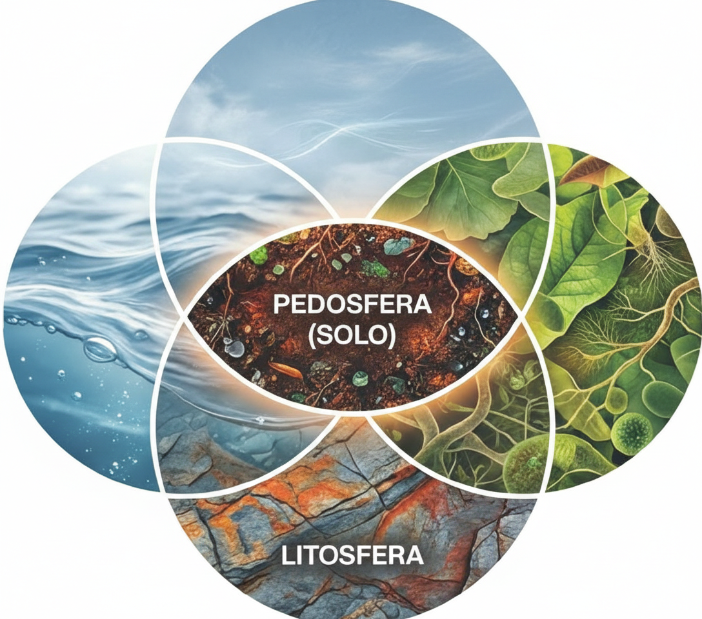
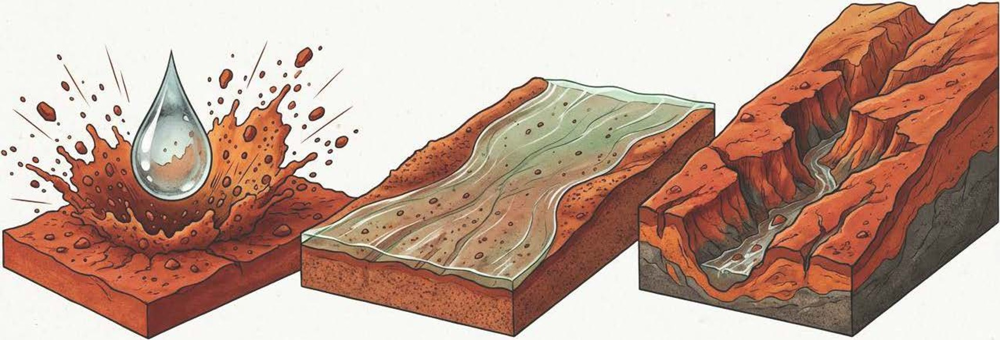
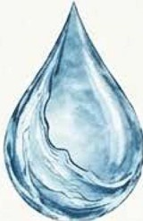
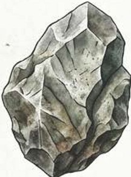
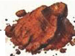
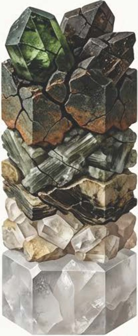
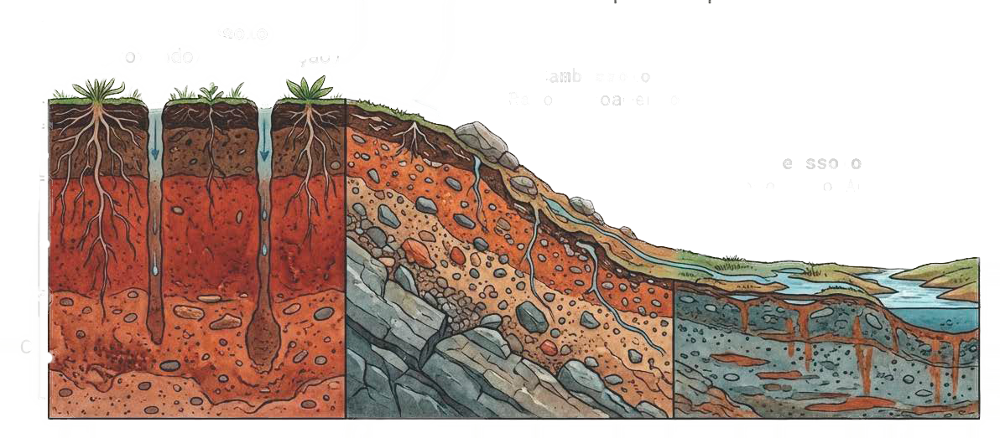

# [O Solo como Sistema]{.section-header}

## O que é o Solo? {.smaller-text}

::: {.columns}
::: {.column width="55%"}
O solo constitui um **sistema termodinâmico multifásico** cuja evolução resulta da dissipação de energia livre na interface **litosfera–atmosfera–biosfera**.

O solo é composto por:

- **Fase sólida** — minerais e matéria orgânica
- **Fase líquida** — solução do solo (água + íons)
- **Fase gasosa** — ar do solo ($CO_2$, $O_2$, $N_2$)

A arquitetura do solo governa a **partição dos fluxos** de água e energia na bacia hidrográfica.
:::

::: {.column width="45%"}
{fig-align="center" width="100%"}
:::
:::

::: {.callout-note}
O solo é um **corpo natural**, tridimensional, dinâmico, formado a partir da rocha sob ação do clima, organismos, relevo e tempo.
:::

---

# [Fatores de Formação]{.section-header}

## Equação de Jenny (1941) {.smaller-text}

::: {.columns}
::: {.column width="55%"}

A equação de fatores de estado sintetiza os **vetores de formação pedológica**:

$$S = f(cl, \, o, \, r, \, p, \, t)$$

| Fator | Descrição |
|-------|-----------|
| **cl** | Clima — temperatura e precipitação |
| **o** | Organismos — fauna, flora, microrganismos |
| **r** | Relevo — declividade, posição na paisagem |
| **p** | Material de origem — rocha-mãe |
| **t** | Tempo — duração da pedogênese |

: {.striped .hover}

:::

::: {.column width="45%"}
{fig-align="center" width="100%"}
:::
:::

::: {.callout-important}
Nos trópicos, o **clima** é o fator dominante, controlando a intensidade do intemperismo e a velocidade de formação do solo.
:::

---

## O Solo como Reator Biogeoquímico {.smaller-text}

::: {.columns}
::: {.column width="55%"}

O solo funciona como um **reator biogeoquímico** aberto, onde energia e matéria são continuamente trocadas com o ambiente.

**Entradas:**

- Radiação solar, água da chuva, $CO_2$ atmosférico
- Matéria orgânica, deposição atmosférica

**Saídas:**

- Lixiviados, gases ($CO_2$, $CH_4$, $N_2O$)
- Sedimentos por erosão

**Transformações internas:**

- Intemperismo mineral → neoformação de argilas
- Decomposição orgânica → humificação
- Oxirredução de Fe e Mn

:::

::: {.column width="45%"}
{fig-align="center" width="100%"}
:::
:::

---

## O Perfil do Solo {.smaller-text}

::: {.columns}
::: {.column width="55%"}

O perfil pedológico é a **seção vertical** do solo, do horizonte superficial até a rocha-mãe.

**Horizontes principais:**

| Horizonte | Característica |
|-----------|---------------|
| **O** | Matéria orgânica em decomposição |
| **A** | Mineral, com acúmulo de húmus |
| **E** | Zona de eluviação (perda) |
| **B** | Zona de iluviação (acúmulo) |
| **C** | Material de origem alterado |
| **R** | Rocha-mãe inalterada |

: {.striped .hover}

:::

::: {.column width="45%"}
{fig-align="center" width="100%"}
:::
:::

::: {.callout-tip}
A **espessura** e a **diferenciação** dos horizontes dependem da intensidade e do tempo de atuação do intemperismo.
:::

---

# [O Intemperismo]{.section-header}

## Conceito e Tipos {.smaller-text}

::: {.columns}
::: {.column width="55%"}

**Intemperismo** é o conjunto de processos que promovem a **desagregação** e a **decomposição** das rochas na superfície terrestre.

| Tipo | Mecanismo | Resultado |
|------|-----------|-----------|
| **Físico** | Fragmentação mecânica | Redução de tamanho, sem alterar a composição |
| **Químico** | Reações químicas | Transformação mineralógica |
| **Biológico** | Ação de organismos | Combina efeitos físicos e químicos |

: {.striped .hover}

Os três tipos atuam **simultaneamente** e de forma **sinérgica**.

:::

::: {.column width="45%"}
{fig-align="center" width="100%"}
:::
:::

::: {.callout-important}
O intemperismo é o **ponto de partida** para a formação do solo — sem ele, não existiria pedogênese.
:::

---

# [Intemperismo Físico]{.section-header}

## Mecanismos de Desagregação {.smaller-text}

::: {.columns}
::: {.column width="55%"}

O intemperismo físico promove a **fragmentação mecânica** da rocha, aumentando a **área superficial específica** sem alterar a composição química.

**Principais mecanismos:**

- **Alívio de pressão** (descompressão)
- **Termoclastia** (variação térmica)
- **Crioclastia** (congelamento da água)
- **Haloclastia** (cristalização de sais)
- **Ação biológica** (raízes, organismos)

::: {.callout-warning}
A fragmentação é fundamental porque **aumenta a área de contato** da rocha com os agentes do intemperismo químico.
:::

:::

::: {.column width="45%"}
{fig-align="center" width="100%"}
:::
:::

---

## Alívio de Pressão {.smaller-text}

::: {.columns}
::: {.column width="55%"}

Quando rochas formadas em **grandes profundidades** são expostas na superfície, a remoção da pressão confinante provoca **expansão** e **fraturamento**.

**Processo:**

1. Rocha cristaliza sob alta pressão (km de profundidade)
2. Erosão remove o material sobrejacente
3. A rocha expande-se, gerando **fraturas de alívio**
4. Fraturas paralelas à superfície → **esfoliação esferoidal**

**Rochas mais afetadas:**

- Granitos
- Gnaisses
- Rochas ígneas em geral

:::

::: {.column width="45%"}
{fig-align="center" width="100%"}
:::
:::

---

## Termoclastia {.smaller-text}

::: {.columns}
::: {.column width="55%"}

A **variação diária de temperatura** provoca ciclos de **dilatação e contração** nos minerais da rocha.

**Mecanismo:**

- Minerais diferentes possuem **coeficientes de dilatação distintos**
- Aquecimento → dilatação diferencial → tensão interna
- Resfriamento → contração diferencial → microfraturas

**Condições favoráveis:**

- Amplitude térmica diária **> 30 °C**
- Ambientes desérticos e semiáridos
- Rochas poliminerálicas (granitos)

::: {.callout-note}
No semiárido brasileiro, amplitudes térmicas de **40 °C** entre dia e noite são comuns, tornando a termoclastia um processo relevante.
:::

:::

::: {.column width="45%"}
{fig-align="center" width="100%"}
:::
:::

---

## Crioclastia {.smaller-text}

::: {.columns}
::: {.column width="55%"}

A água infiltrada nas fendas da rocha, ao **congelar**, expande-se em **≈ 9%** de volume, exercendo pressão que pode atingir **200 MPa**.

**Sequência do processo:**

1. A água preenche fraturas e poros da rocha
2. A temperatura cai abaixo de **0 °C**
3. A água congela, expandindo-se
4. A pressão rompe a rocha ao longo das fraturas
5. Ciclos repetidos fragmentam progressivamente

::: {.callout-important}
A crioclastia é o processo dominante em **regiões de clima frio** e **alta montanha**, sendo menos relevante nos trópicos.
:::

:::

::: {.column width="45%"}
{fig-align="center" width="100%"}
:::
:::

---

## Crioclastia — Expansão por Congelamento {.smaller-text}

::: {.columns}
::: {.column width="55%"}

O congelamento da água nas fraturas exerce forças que superam amplamente a **resistência à tração** da maioria das rochas.

| Parâmetro | Valor |
|-----------|-------|
| Expansão volumétrica do gelo | ≈ 9% |
| Pressão máxima teórica | ≈ 200 MPa |
| Resistência à tração do granito | 7–25 MPa |
| Resistência à tração do calcário | 2–12 MPa |

: {.striped .hover}

**Produtos da crioclastia:**

- **Talus** (depósitos de blocos ao pé de encostas)
- **Campos de matacões** (*blockfields*)
- **Solos criogênicos** (crioturbação)

:::

::: {.column width="45%"}
{fig-align="center" width="100%"}
:::
:::

---

# [Intemperismo Químico]{.section-header}

## O Papel da Água {.smaller-text}

::: {.columns}
::: {.column width="55%"}

A **água** é o principal agente do intemperismo químico. Sua molécula polar atua como **solvente universal**.

**Propriedades relevantes:**

- **Polaridade** — dissolve compostos iônicos e polares
- **Ionização** — $H_2O \leftrightarrow H^+ + OH^-$
- **Capacidade térmica** — estabiliza temperatura do solo
- **Tensão superficial** — movimenta-se por capilaridade

A água no solo está carregada de $CO_2$ dissolvido, formando **ácido carbônico**:

$$CO_2 + H_2O \leftrightarrow H_2CO_3 \leftrightarrow H^+ + HCO_3^-$$

Isso torna a solução do solo **levemente ácida** (pH 5,5–6,5), acelerando a dissolução mineral.

:::

::: {.column width="45%"}
{fig-align="center" width="100%"}
:::
:::

---

## Principais Reações Químicas {.smaller-text}

::: {.columns}
::: {.column width="55%"}

As reações dominantes do intemperismo químico são:

| Reação | Mecanismo | Exemplo |
|--------|-----------|---------|
| **Hidrólise** | Quebra por H⁺ e OH⁻ | Feldspato → Caulinita |
| **Carbonatação** | Dissolução por $H_2CO_3$ | Calcário → $Ca^{2+} + HCO_3^-$ |
| **Oxidação** | Perda de elétrons (Fe²⁺ → Fe³⁺) | Pirita → Limonita |
| **Redução** | Ganho de elétrons | Fe³⁺ → Fe²⁺ (gleização) |
| **Quelação** | Complexação orgânica | Ácidos húmicos + Fe/Al |
| **Dissolução** | Solubilização direta | Halita → Na⁺ + Cl⁻ |

: {.striped .hover}

:::

::: {.column width="45%"}
{fig-align="center" width="100%"}
:::
:::

::: {.callout-important}
Nos trópicos, a **hidrólise** é a reação mais importante, sendo responsável pela transformação dos feldspatos em argilominerais.
:::

---

## Hidrólise dos Feldspatos {.smaller-text}

::: {.columns}
::: {.column width="55%"}

A hidrólise dos **feldspatos** (minerais mais abundantes da crosta) é a principal via de formação de argilas no solo tropical.

**Exemplo — Ortoclásio → Caulinita:**

$$2 \, KAlSi_3O_8 + 2 \, H_2CO_3 + 9 \, H_2O$$
$$\rightarrow Al_2Si_2O_5(OH)_4 + 4 \, H_4SiO_4 + 2 \, K^+ + 2 \, HCO_3^-$$

**Interpretação:**

- O feldspato perde **K⁺** e **sílica** → são lixiviados
- **Alumínio** permanece → forma a caulinita
- Em clima muito úmido → perde **toda a sílica** → forma **gibbsita** ($Al(OH)_3$)

:::

::: {.column width="45%"}
{fig-align="center" width="100%"}
:::
:::

::: {.callout-tip}
A **Série de Goldich (1938)** mostra que a suscetibilidade dos silicatos à dissolução decresce de olivinas e piroxênios para feldspatos potássicos e quartzo.
:::

---

## Mineralogia Secundária — Caulinita {.smaller-text}

::: {.columns}
::: {.column width="55%"}

A **caulinita** ($Al_2Si_2O_5(OH)_4$) é o argilomineral mais comum dos solos tropicais.

**Características:**

| Propriedade | Valor |
|-------------|-------|
| Tipo | Silicato 1:1 (tetraédrica + octaédrica) |
| CTC | Baixa (3–15 cmol_c/kg) |
| Expansão | Nenhuma (camadas ligadas por H) |
| Superfície específica | 10–20 m²/g |
| Cor | Branca a creme |

: {.striped .hover}

**Implicações para a engenharia:**

- Baixa plasticidade
- Baixa capacidade de troca catiônica
- Estabilidade estrutural → menor expansão/contração
- Dominante em **Latossolos** e **Argissolos**

:::

::: {.column width="45%"}
{fig-align="center" width="100%"}
:::
:::

---

## Mineralogia Secundária — Óxidos de Ferro {.smaller-text}

::: {.columns}
::: {.column width="55%"}

A **oxidação do ferro** durante o intemperismo produz óxidos que conferem as cores diagnósticas dos solos tropicais.

| Mineral | Fórmula | Cor | Condição |
|---------|---------|-----|----------|
| **Hematita** | $\alpha$-$Fe_2O_3$ | Vermelha | Ambiente quente e seco |
| **Goethita** | $\alpha$-FeOOH | Amarela-marrom | Ambiente úmido |
| **Magnetita** | $Fe_3O_4$ | Preta | Herança do basalto |
| **Ferrihydrita** | $5Fe_2O_3 \cdot 9H_2O$ | Marrom | Recém-precipitada |

: {.striped .hover}

**Funções dos óxidos no solo:**

- **Pigmentação** — determinam a cor do solo
- **Cimentação** — estabilizam agregados
- **Adsorção** — retêm fosfato e metais pesados
- **Indicadores** — revelam condições de drenagem

:::

::: {.column width="45%"}
{fig-align="center" width="100%"}
:::
:::

---

# [Intemperismo e Erosão]{.section-header}

## Do Intemperismo à Erosão {.smaller-text}

::: {.columns}
::: {.column width="55%"}

O intemperismo gera o **manto de alteração** (regolito), que pode ser mobilizado pela **erosão**.

**Sequência:**

1. **Intemperismo** → fragmentação e decomposição da rocha
2. **Pedogênese** → formação de horizontes e estrutura
3. **Erosão** → remoção do material intemperizado

**Fatores que controlam a erosão (RUSLE):**

$$A = R \cdot K \cdot L \cdot S \cdot C \cdot P$$

| Fator | Significado |
|-------|-------------|
| **R** | Erosividade da chuva |
| **K** | Erodibilidade do solo |
| **L** | Comprimento da rampa |
| **S** | Declividade |
| **C** | Uso e manejo |
| **P** | Práticas conservacionistas |

: {.striped .hover}

:::

::: {.column width="45%"}
{fig-align="center" width="100%"}
:::
:::

---

## Quantificação Geoquímica do Intemperismo {.smaller-text}

::: {.columns}
::: {.column width="55%"}

Para quantificar o **grau de alteração** da rocha, utiliza-se o **Índice Químico de Alteração** (CIA):

$$CIA = \frac{Al_2O_3}{Al_2O_3 + CaO^* + Na_2O + K_2O} \times 100$$

| CIA | Interpretação |
|-----|--------------|
| 50 | Rocha fresca (feldspatos intactos) |
| 60–70 | Alteração moderada |
| 70–80 | Alteração avançada |
| > 80 | Laterização extrema |

: {.striped .hover}

A **análise de Brimhall-Chadwick** utiliza elementos imóveis (Ti, Zr) para calcular:

- **Fluxo de massa** ($\tau_i$) — ganho ou perda de elementos
- **Deformação** ($\varepsilon$) — expansão ou colapso do perfil

:::

::: {.column width="45%"}
{fig-align="center" width="100%"}
:::
:::

---

# [Engenharia de Conservação]{.section-header}

## Estratégias Integradas de Mitigação {.smaller-text}

::: {.columns}
::: {.column width="55%"}

A **engenharia de conservação** atua simultaneamente nos fatores da RUSLE:

| Eixo | Fator RUSLE | Estratégia |
|------|-------------|------------|
| **Cobertura** | C | Palhada > 6 t/ha, agroflorestais |
| **Solo** | K | Carbono orgânico > 3%, silicato de Ca |
| **Hidrologia** | LS, P | Terraceamento, contorno, barraginhas |

: {.striped .hover}

**No semiárido brasileiro:**

- Chuvas convectivas → $R > 7\,000$ MJ·mm·ha⁻¹·h⁻¹·ano⁻¹
- Neossolos Litólicos + crostas superficiais
- Alta conectividade hidrossedimentológica
- Assoreamento de reservatórios

::: {.callout-warning}
A variabilidade climática amplifica os extremos erosivos, exigindo planejamento integrado de manejo e conservação.
:::

:::

::: {.column width="45%"}
{fig-align="center" width="100%"}
:::
:::

---

## Síntese — Do Mineral ao Solo {.smaller-text}

::: {.columns}
::: {.column width="50%"}

**Caminho do intemperismo:**

```{mermaid}
%%| fig-width: 5
flowchart TD
    A[Rocha-mãe] -->|Intemperismo Físico| B[Fragmentos de Rocha]
    B -->|Aumento de superfície| C[Exposição Mineral]
    C -->|Intemperismo Químico| D[Argilas + Óxidos]
    D -->|Pedogênese| E[Solo]
    E -->|Erosão| F[Sedimentos]
    F -->|Diagênese| G[Rocha Sedimentar]
    G -->|Soerguimento| A
    
    style A fill:#8B4513,color:white
    style B fill:#A0522D,color:white
    style C fill:#CD853F,color:white
    style D fill:#D2691E,color:white
    style E fill:#228B22,color:white
    style F fill:#DAA520,color:white
    style G fill:#696969,color:white
```

:::

::: {.column width="50%"}

**Conceitos-chave desta aula:**

- O solo é um **sistema termodinâmico** aberto
- Os fatores de Jenny controlam a **direção** e **intensidade** da pedogênese
- O **intemperismo físico** prepara o substrato para o químico
- A **hidrólise** é a reação dominante nos trópicos
- Caulinita e óxidos de Fe são os **produtos finais** do intemperismo tropical
- O **CIA** quantifica o grau de alteração
- A **RUSLE** modela a erosão resultante

:::
:::

---

## Referências Bibliográficas {.smaller-text}

- **JENNY, H.** (1941). *Factors of Soil Formation: A System of Quantitative Pedology*. New York: McGraw-Hill.

- **GOLDICH, S. S.** (1938). A study in rock-weathering. *The Journal of Geology*, 46(1), 17–58.

- **BURINGH, P.** (1970). *Introduction to the study of soils in tropical and subtropical regions*. 2ª ed. Wageningen: Centre for Agricultural Publishing and Documentation.

- **BRADY, N. C.; WEIL, R. R.** (2013). *Elementos da Natureza e Propriedades dos Solos*. 3ª ed. Porto Alegre: Bookman.

- **LEPSCH, I. F.** (2011). *Formação e Conservação dos Solos*. 2ª ed. São Paulo: Oficina de Textos.

- **WISCHMEIER, W. H.; SMITH, D. D.** (1978). *Predicting Rainfall Erosion Losses*. USDA Agriculture Handbook No. 537.

- **NESBITT, H. W.; YOUNG, G. M.** (1982). Early Proterozoic climates and plate motions inferred from major element chemistry of lutites. *Nature*, 299, 715–717.

---

## {.center background-color="#034EA2"}

::: {style="text-align: center;"}
[Obrigado!]{.obrigado-fit-text style="color: white;"}

::: {style="color: white; font-size: 0.7em;"}
Luiz Diego Vidal Santos

Universidade Estadual de Feira de Santana (UEFS)
:::
:::
