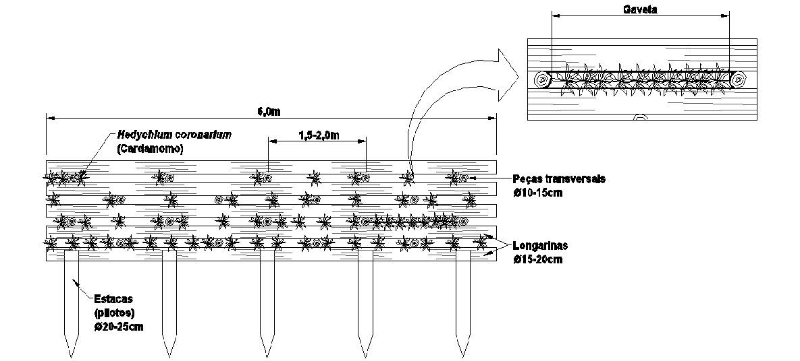
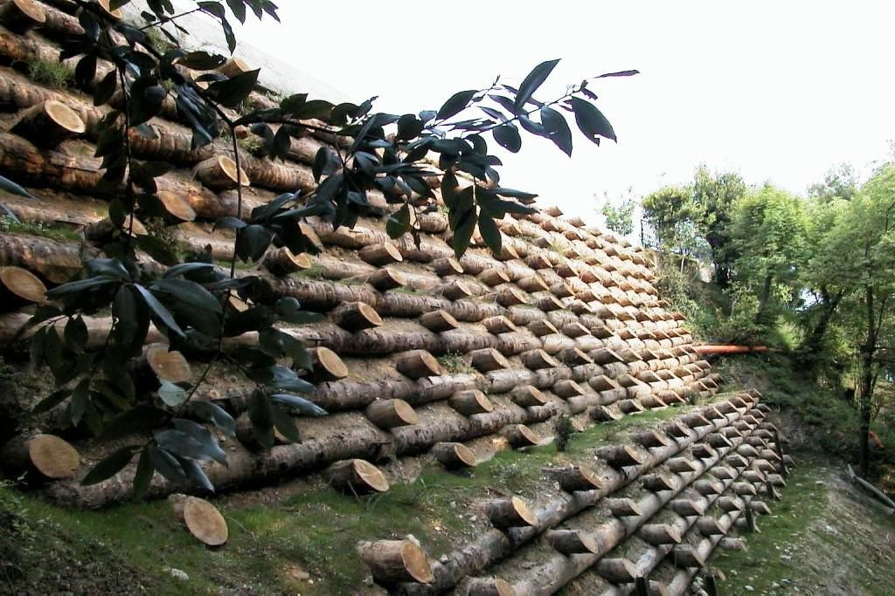
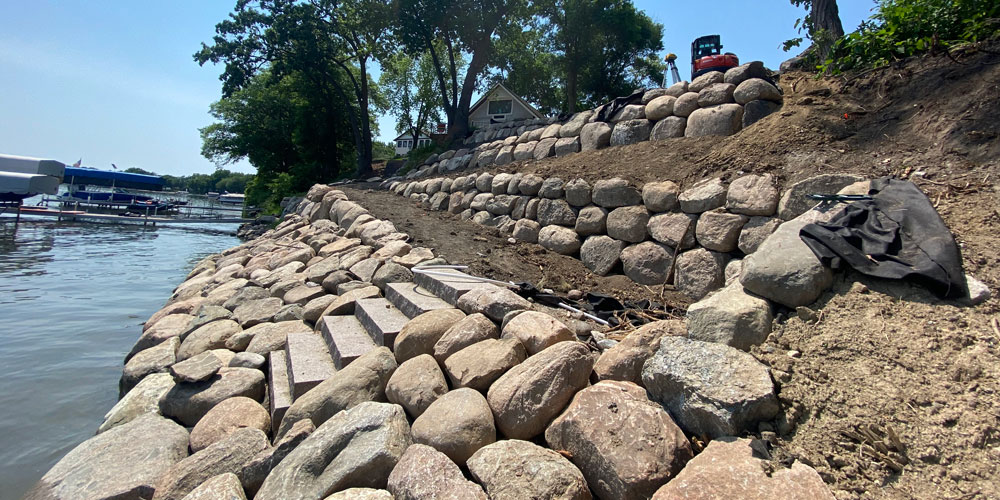
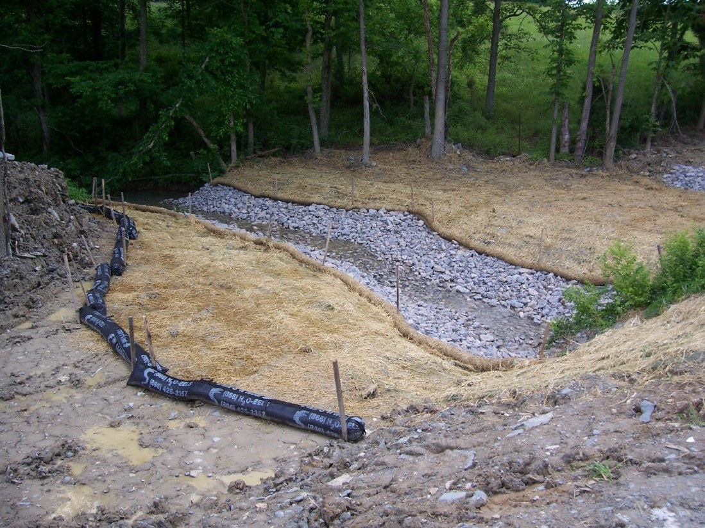
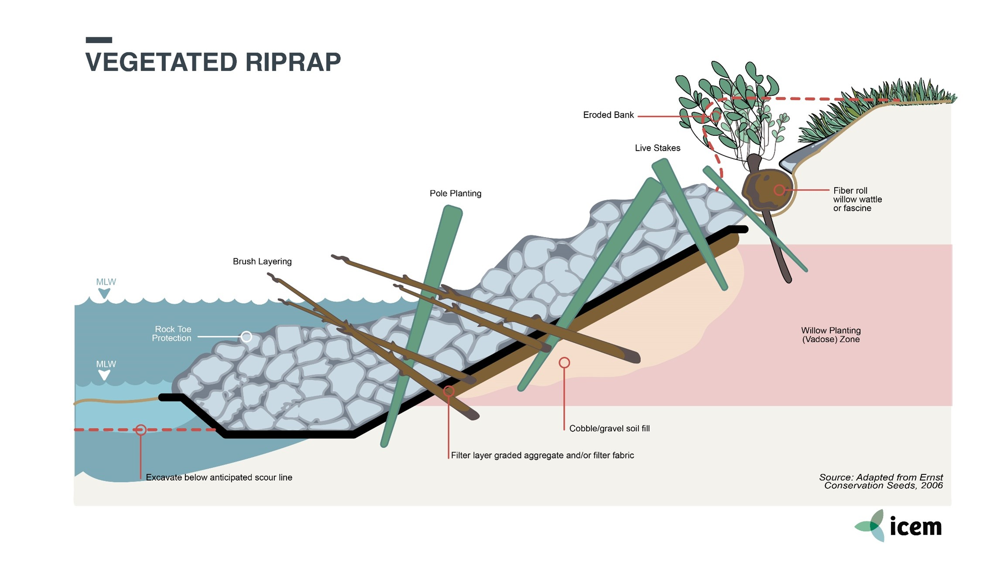

## Visão Geral da Aula {.smaller-text}

::: {.columns}
::: {.column width="50%"}
### Tópicos

- [1]{.circle} O que é a Parede Krainer?
- [2]{.circle} Histórico e aplicações
- [3]{.circle} Materiais: madeira e tratamento
- [4]{.circle} Projeto estrutural (empuxo e estabilidade)
- [5]{.circle} Geometria e detalhamento construtivo
- [6]{.circle} Integração com vegetação
- [7]{.circle} Riprap: enrocamento e proteção de margens
- [8]{.circle} Construção e monitoramento
- [9]{.circle} Síntese e atividade
:::

::: {.column width="50%"}
::: {.info-box}
**Objetivo da Aula**

Compreender o conceito da **Parede Krainer** (*log-crib wall* ou *Krainer wall*) como uma estrutura de contenção robusta feita de **troncos de madeira** em grelha, preenchida com **terra e plantas**, capaz de estabilizar **encostas muito íngremes** onde não há espaço para taludamento convencional, integrando **engenharia estrutural** e **revegetação**. Complementarmente, dominar os princípios do **riprap** (*enrocamento*) como técnica de proteção de margens, canais e taludes.
:::
:::
:::

# [1. O QUE É A PAREDE KRAINER?]{.section-header}

## Definição e conceito {.smaller-text}

::: {.columns}
::: {.column width="55%"}

### Conceito

A **Parede Krainer** (*Krainerwand*, *log-crib wall*) é uma estrutura de contenção em forma de **grelha de troncos** empilhados perpendicularmente, preenchida com solo e vegetação:

- **Troncos longitudinais** (*stringers*): paralelos à face da parede
- **Troncos transversais** (*headers*): perpendiculares, penetram no solo natural
- **Preenchimento**: terra compactada + plantas vivas
- **Estrutura**: funciona como **muro de gravidade**

::: {.highlight-box}
💡 O nome "Krainer" origina-se da região de **Krain** (atual Eslovênia/Caríntia), onde a técnica foi desenvolvida nos Alpes para estabilizar encostas montanhosas com recursos locais: **madeira abundante** e **espécies resistentes**.
:::
:::

::: {.column width="45%"}

### Vista tridimensional

{width="90%"}

> A Parede Krainer suporta alturas de **2-6 m** e é ideal para encostas com **declividade > 45°** onde outras soluções de bioengenharia não são viáveis isoladamente.
:::
:::

## Anatomia da Parede Krainer {.smaller-text}

::: {.columns}
::: {.column width="50%"}

### Corte transversal

{width="95%"}

:::{.smaller-text}
Detalhe: troncos transversais (*headers*) penetram no solo natural, enquanto os longitudinais (*stringers*) formam a face.
:::

:::

::: {.column width="50%"}

### Peças e componentes

{width="95%"}

:::{.smaller-text}
Componentes: troncos roliços, parafusos/barras roscadas, preenchimento com solo + estacas vivas.
:::

:::
:::

## Galeria: Paredes Krainer em campo {.smaller-text}

::: {.columns}
::: {.column width="50%"}

{width="95%"}

:::{.smaller-text}
Fonte: National Archives and Records Administration (NARA) - Public Domain
:::

:::

::: {.column width="50%"}

{width="95%"}

:::{.smaller-text}
Exemplo de parede Krainer em campo com vegetação integrada entre as camadas de troncos.
:::

:::
:::

## Galeria: Exemplos de aplicação {.smaller-text}

::: {.columns}
::: {.column width="50%"}

{width="95%"}

:::{.smaller-text}
A vegetação progressivamente assume a face da estrutura, naturalizando a contenção.
:::

:::

::: {.column width="50%"}

{width="95%"}

:::{.smaller-text}
Comparação: muros de contenção tradicionais vs. soluções vegetadas de bioengenharia.
:::

:::
:::

## Quando usar a Parede Krainer? {.smaller-text}

::: {.columns}
::: {.column width="50%"}

### Indicações

| Situação | Adequação |
|----------|-----------|
| Encostas > 45° sem espaço para taludar | ★★★★★ |
| Contenção de ravinas profundas | ★★★★☆ |
| Margens de rios com desbarrancamento | ★★★★☆ |
| Base de aterros rodoviários | ★★★☆☆ |
| Áreas com madeira disponível | ★★★★★ |

### Vantagens

- ✅ Usa material local (madeira)
- ✅ Construção sem equipamentos pesados
- ✅ Flexível (adapta a recalques diferenciais)
- ✅ Permeável (não acumula pressão hidrostática)
- ✅ Integra vegetação nativamente
- ✅ Estética naturalizada

:::

::: {.column width="50%"}

### Limitações

- ❌ Madeira não tratada: vida útil 10-30 anos
- ❌ Altura máxima: 5-6 m (acima disso, combinada com outros sistemas)
- ❌ Necessita grande volume de madeira
- ❌ Incêndio: risco em regiões secas
- ❌ Cupins e fungos: exigem madeira resistente ou tratada

### Comparação com outras contenções

| Técnica | Altura máx. | Material | Revegetação |
|---------|-------------|----------|-------------|
| Gabião vivo | 4-6 m | Pedra + arame | Sim |
| **Krainer** | **5-6 m** | **Madeira** | **Sim** |
| Muro de concreto | 10+ m | Concreto | Não |
| Terra armada | 10+ m | Geogrelha + solo | Superficial |

:::
:::

# [2. HISTÓRICO E APLICAÇÕES]{.section-header}

## Origem e difusão {.smaller-text}

::: {.columns}
::: {.column width="55%"}

### Linha do tempo

- **Séc. XVI-XVIII**: Uso tradicional nos Alpes (Áustria, Eslovênia, Suíça) para contenção de encostas e avalanches
- **Séc. XIX**: Documentação técnica por engenheiros florestais austríacos
- **1930s**: Formalização na engenharia alpina (*Wildbachverbauung*)
- **1970s-1980s**: Renascimento com o movimento de bioengenharia (Schiechtl, 1980)
- **1990s**: Disseminação global - América do Norte, Ásia
- **2000s em diante**: Aplicação no Brasil em obras de encosta e APP

### Contexto brasileiro

::: {.highlight-box}
🇧🇷 No Brasil, as Paredes Krainer têm sido utilizadas em:

- **Encostas urbanas** (RJ, SP, MG) - programas de redução de risco
- **Rodovias serranas** - contenção de cortes
- **APP fluviais** - restauração de margens
- **Mineração** - contenção de bancadas e pilhas
:::
:::

::: {.column width="45%"}

### Aplicações no mundo

| País/Região | Aplicação principal |
|-------------|-------------------|
| Áustria/Suíça | Controle alpino, torrentes |
| Itália | Encostas montanhosas |
| Eslovênia | Rodovias, ferrovia |
| Estados Unidos | Parques nacionais, rodovias |
| Japão | Contenção de encostas sísmicas |
| Nepal | Estradas montanhosas |
| **Brasil** | **Encostas urbanas, APP** |

> A Parede Krainer é a técnica de bioengenharia mais **robusta** do repertório: combina a capacidade de contenção de um muro de gravidade com a integração paisagística de uma **parede verde viva**.
:::
:::

# [3. MATERIAIS: MADEIRA E TRATAMENTO]{.section-header}

## Seleção e preservação da madeira {.smaller-text}

::: {.columns}
::: {.column width="50%"}

### Espécies de madeira recomendadas

**Madeiras de alta durabilidade natural (Brasil):**

| Espécie | Nome popular | Classe | Durab. (anos) |
|---------|-------------|--------|---------------|
| *Astronium lecointei* | Muiracatiara | I | 25-40 |
| *Manilkara huberi* | Maçaranduba | I | 25-40 |
| *Hymenaea courbaril* | Jatobá | II | 15-25 |
| *Eucalyptus cloeziana* | Eucalipto-cloez. | II | 15-25 |
| *Eucalyptus citriodora* | Euc. citriodora | II | 15-25 |
| *Corymbia maculata* | Euc. maculata | II | 10-20 |

**Madeiras tratadas (autoclave - CCA):**

- Eucalipto tratado em autoclave: **30+ anos**
- Pinus tratado: **20-25 anos**

:::

::: {.column width="50%"}

### Especificações dos troncos

| Parâmetro | Valor |
|-----------|-------|
| Diâmetro mínimo | 15-25 cm |
| Diâmetro recomendado | 20-30 cm |
| Comprimento longitudinal | 2,0-4,0 m |
| Comprimento transversal | 1,0-2,5 m |
| Umidade máxima | < 30% (secagem parcial) |
| Forma | Roliça (não serrada) |

### Tratamento preservativo

```{mermaid}
%%| fig-width: 4.5
graph TD
    A["Opção 1<br>Madeira de alta<br>durabilidade natural"] --> D["Parede Krainer"]
    B["Opção 2<br>Eucalipto/Pinus<br>tratado CCA/CCB"] --> D
    C["Opção 3<br>Queima superficial<br>(carbonização)"] --> D
    style A fill:#2E7D32,color:#fff
    style B fill:#586BA6,color:#000
    style C fill:#8B4513,color:#fff
```

::: {.highlight-box}
♻️ Para projetos de **restauração ecológica**, prefira madeira de **eucalipto de plantio tratado** (evitando pressão sobre matas nativas) ou madeira de demolição reutilizada.
:::
:::
:::

## Propriedades mecânicas {.smaller-text}

::: {.columns}
::: {.column width="50%"}

### Resistência da madeira

| Propriedade | Eucalipto | Jatobá |
|-------------|-----------|--------|
| Compressão paralela ($f_{c0}$) | 40-65 MPa | 65-90 MPa |
| Flexão ($f_M$) | 70-100 MPa | 90-120 MPa |
| Cisalhamento ($f_v$) | 8-12 MPa | 12-16 MPa |
| Módulo de elasticidade ($E$) | 12-18 GPa | 15-22 GPa |
| Densidade aparente ($\rho$) | 600-850 kg m⁻³ | 800-1100 kg m⁻³ |

### Norma de referência

- **ABNT NBR 7190:2022** - Projeto de Estruturas de Madeira
- **Classe de umidade 4**: madeira submersa ou enterrada

:::

::: {.column width="50%"}

### Verificações mecânicas da grelha

**Compressão no cruzamento (nó):**

$$\sigma_{c90} = \frac{P}{A_{contato}} \leq f_{c90,d}$$

Onde:

- $P$ = carga vertical por nó (kN)
- $A_{contato}$ = área de contato entre troncos (cm²)
- $f_{c90,d}$ = resistência de projeto à compressão perpendicular

**Flexão do tronco longitudinal:**

$$M_{max} = \frac{w \cdot L^2}{8}$$

$$\sigma_M = \frac{M_{max}}{W} \leq f_{M,d}$$

::: {.highlight-box}
📐 A verificação mais crítica é a **compressão perpendicular nos nós** de cruzamento, onde os troncos se apoiam uns sobre os outros.
:::
:::
:::

# [4. PROJETO ESTRUTURAL]{.section-header}

## Verificação como muro de gravidade {.smaller-text}

::: {.columns}
::: {.column width="55%"}

### Peso próprio da Parede Krainer

O peso depende da proporção madeira/solo:

$$\gamma_{Krainer} \approx 12\text{-}16 \text{ kN m}^{-3}$$

(75% solo compactado + 25% madeira)

### Verificações de estabilidade

**1. Tombamento** ($FS \geq 2,0$):

$$FS_{tomb} = \frac{W \cdot x_W}{E_a \cdot y_{Ea}} \geq 2,0$$

**2. Deslizamento** ($FS \geq 1,5$):

$$FS_{desl} = \frac{W \cdot \tan(\delta)}{E_a} \geq 1,5$$

**3. Capacidade de carga** ($FS \geq 3,0$):

$$\sigma_{max} \leq \sigma_{adm}$$

Onde $\delta$ = ângulo de atrito base-fundação.

:::

::: {.column width="45%"}

### Geometria típica

| Altura da parede | Base | Inclinação face |
|-----------------|------|-----------------|
| 2,0 m | 1,5-2,0 m | 10°-15° |
| 3,0 m | 2,0-3,0 m | 10°-15° |
| 4,0 m | 3,0-4,0 m | 10°-15° |
| 5,0 m | 4,0-5,0 m | 10°-15° |

**Regra prática:** Base ≈ 0,6 × Altura a 1,0 × Altura

### Perfil com inclinação

```{mermaid}
%%| fig-width: 4.5
graph TD
    A["Topo<br>(mais estreito)"] --> B["Corpo<br>(grelha de troncos<br>+ solo + plantas)"]
    B --> C["Base<br>(mais larga)"]
    C --> D["Fundação<br>(enterrada 30-50 cm)"]
    style A fill:#2135A6,color:#fff
    style B fill:#8B4513,color:#fff
    style C fill:#586BA6,color:#000
    style D fill:#27368C,color:#fff
```

::: {.highlight-box}
📐 A face frontal é inclinada **10°-15° para dentro** (frutamento), o que melhora a estabilidade e favorece a retenção de solo nos interstícios.
:::
:::
:::

# [5. GEOMETRIA E DETALHAMENTO CONSTRUTIVO]{.section-header}

## Detalhes da grelha {.smaller-text}

::: {.columns}
::: {.column width="55%"}

### Montagem da grelha

```{mermaid}
%%| fig-width: 5.5
graph TD
    A["Camada 1<br>Troncos transversais<br>sobre fundação"] --> B["Camada 2<br>Troncos longitudinais<br>sobre transversais"]
    B --> C["Preenchimento<br>Solo compactado +<br>estacas vivas"]
    C --> D["Camada 3<br>Troncos transversais<br>(rotação 90°)"]
    D --> E["Camada 4<br>Troncos longitudinais"]
    E --> F["Preenchimento<br>Solo + plantas"]
    F --> G["Repetir até<br>altura de projeto"]
    style A fill:#8B4513,color:#fff
    style B fill:#8B4513,color:#fff
    style C fill:#2E7D32,color:#fff
    style D fill:#8B4513,color:#fff
    style F fill:#2E7D32,color:#fff
```

### Interseções (nós)

Os troncos são conectados nos cruzamentos por:

- **Pregos/parafusos** de aço galvanizado (Ø 12-16 mm)
- **Entalhes** (meia-seção) para encaixe estável
- **Amarração** com arame (complementar)

:::

::: {.column width="45%"}

### Espaçamento entre troncos

| Parâmetro | Valor |
|-----------|-------|
| Espaçamento longitudinal | 1,0-1,5 m |
| Espaçamento transversal | 1,0-2,0 m |
| Altura por camada | 20-30 cm (diâmetro do tronco) |
| Recuo por camada (frutamento) | 5-8 cm |

### Detalhe do nó de cruzamento

| Método de fixação | Vantagem |
|-------------------|----------|
| Parafuso passante | Resistência ao cisalhamento |
| Entalhe meia-seção | Distribuição de carga |
| Prego longo (20 cm) | Rapidez, economia |
| Barra roscada | Maior resistência |

::: {.highlight-box}
🔩 O **entalhe meia-seção** é o método tradicional alpino: cada tronco é rebaixado em 50% da espessura no ponto de cruzamento, criando um encaixe que distribui a carga uniformemente.
:::
:::
:::

# [6. INTEGRAÇÃO COM VEGETAÇÃO]{.section-header}

## Componente vegetal da Parede Krainer {.smaller-text}

::: {.columns}
::: {.column width="55%"}

### Inserção de plantas

A vegetação é integrada de três formas:

**1. Estacas vivas nos interstícios:**

- Inseridas horizontalmente entre camadas
- Projetam-se 20-30 cm da face
- Espécies: propagação por estaquia

**2. Mudas de raiz nua:**

- Plantadas nos espaços entre troncos
- Espécies arbustivas e herbáceas
- Raízes nuas para melhor adaptação

**3. Semeadura / hidrossemeadura na face:**

- Mistura de gramíneas e leguminosas
- Cobertura rápida da face exposta
- Proteção contra erosão superficial

### Benefícios da vegetação

- **Raízes**: ancoragem adicional, coesão radicular
- **Copa**: sombreamento, proteção contra chuva
- **Biodiversidade**: habitat para fauna
- **Estética**: parede verde naturalizada

:::

::: {.column width="45%"}

### Espécies recomendadas

**Para estacas vivas (entre camadas):**

| Espécie | Crescimento |
|---------|-------------|
| *Salix humboldtiana* | Muito rápido |
| *Gliricidia sepium* | Rápido |
| *Erythrina velutina* | Rápido |

**Para mudas nos interstícios:**

| Espécie | Porte |
|---------|-------|
| *Lantana camara* | Arbusto |
| *Lippia alba* | Arbusto |
| *Vetiveria zizanioides* | Herbácea |

**Para semeadura na face:**

| Espécie | Tipo |
|---------|------|
| *Brachiaria decumbens* | Gramínea |
| *Crotalaria juncea* | Leguminosa |
| *Stylosanthes guianensis* | Leguminosa |

::: {.highlight-box}
🌳 O objetivo é criar uma **parede viva**: em 5-10 anos, a vegetação domina a face e os interstícios, e a madeira passa a ser um **esqueleto interno** que eventualmente se biodegrada sem comprometer a estabilidade.
:::
:::
:::

# [7. RIPRAP: ENROCAMENTO E PROTEÇÃO DE MARGENS]{.section-header}

## Definição e conceito de Riprap {.smaller-text}

::: {.columns}
::: {.column width="55%"}

### O que é Riprap?

**Riprap** (*enrocamento*, *rock armor*, *shot rock*) é uma camada permanente de **pedras angulares grandes**, matacões ou blocos rochosos utilizada para armar, estabilizar e proteger superfícies de solo contra **erosão e solapamento** em áreas de fluxo concentrado ou energia de ondas (MnDOT, 2018).

### Funções principais

- **Aumenta a rugosidade superficial** → reduz velocidade do escoamento
- **Dissipa energia** em saídas de tubulações e bueiros
- **Protege** taludes, canais, margens fluviais e linhas costeiras
- **Estabiliza** bermas de bacias de sedimentação e *check dams*

::: {.highlight-box}
💡 O riprap é uma das técnicas de controle de erosão mais **eficazes** e **simples de instalar**, especialmente em locais onde a velocidade da água impede o estabelecimento de vegetação (MPCA, 2018).
:::

:::

::: {.column width="45%"}

{width="90%"}

### Classificação MnDOT

| Tipo | Descrição |
|------|----------|
| **Random riprap** | Pedras de tamanhos variados distribuídas aleatoriamente |
| **Hand-placed** | Pedras individuais ≥ 50 lb colocadas manualmente |
| **Grouted riprap** | Espaços preenchidos com grout (argamassa) |

:::
:::

## Quando usar Riprap? {.smaller-text}

::: {.columns}
::: {.column width="50%"}

### Aplicações típicas

| Local | Aplicação |
|-------|----------|
| Saídas de tubulações | Dissipação de energia |
| Canais e valas | Revestimento de fundo e taludes |
| Margens de rios | Proteção contra solapamento |
| Taludes de rodovias | Proteção de cortes e aterros |
| *Check dams* | Bermas de alto volume/velocidade |
| Linhas costeiras | Proteção contra ondas |

### Vantagens

- ✅ **Resistência superior**: suporta ondas, chuvas intensas e gelo
- ✅ **Longevidade**: décadas com manutenção mínima (rocha é permanente)
- ✅ **Simplicidade**: instalação relativamente simples
- ✅ **Flexibilidade**: adapta-se a recalques e deformações
- ✅ **Permeabilidade**: permite drenagem natural

:::

::: {.column width="50%"}

### Limitações

- ❌ **Custo elevado**: material + equipamento + transporte
- ❌ **Impacto ambiental**: pode destruir habitats aquáticos/ripários
- ❌ **Estética**: aparência "dura" indesejável em alguns contextos
- ❌ **Acesso**: requer maquinário pesado para instalação
- ❌ **Inclinação máxima**: instável em taludes > 2H:1V (sem reforço)
- ❌ **Licenciamento**: restrições ambientais em corpos d'água

### Comparação com Parede Krainer

| Critério | Riprap | Krainer |
|----------|--------|---------|
| Material | Rocha | Madeira |
| Revegetação | Opcional | Integrada |
| Habitat | Destrói | Cria |
| Custo | Alto | Médio |
| Durabilidade | Permanente | 10-30 anos (madeira) |
| Inclinação máx. | 2H:1V | > 45° |

:::
:::

## Dimensionamento do Riprap {.smaller-text}

::: {.columns}
::: {.column width="50%"}

### Critérios de projeto

O dimensionamento do riprap depende fundamentalmente da **velocidade do fluxo**:

| Velocidade (m/s) | Classe | $D_{50}$ (cm) |
|-------------------|--------|---------------|
| < 1,0 | I | 15-20 |
| 1,0-2,0 | II | 20-30 |
| 2,0-3,0 | III | 30-45 |
| 3,0-4,0 | IV | 45-60 |
| > 4,0 | V | 60-90 |

:::{.smaller-text}
$D_{50}$ = diâmetro mediano (50% das pedras são menores). Adaptado de NY State Standards (2016) e MnDOT (2018).
:::

### Regra prática

::: {.highlight-box}
📐 **Na dúvida, use pedras maiores!** A água carrega pedras subdimensionadas. É mais econômico super-dimensionar inicialmente do que reparar falhas (MnDOT, 2006).
:::

:::

::: {.column width="50%"}

### Composição da seção

```{mermaid}
%%| fig-width: 5
graph TD
    A["Superfície do terreno<br>(preparada e compactada)"] --> B["Camada filtro<br>Geotêxtil não-tecido<br>ou Brita graduada ≥ 15 cm"]
    B --> C["Riprap<br>Pedras angulares<br>bem-graduadas"]
    C --> D["Superfície final<br>nivelada e interlocked"]
    style A fill:#8B4513,color:#fff
    style B fill:#586BA6,color:#000
    style C fill:#2135A6,color:#fff
    style D fill:#2E7D32,color:#fff
```

### Especificações do filtro

A camada filtro é **obrigatória** para evitar o *piping* (erosão do solo sob as pedras):

| Tipo de filtro | Espessura mínima | Observação |
|----------------|------------------|-----------|
| Granular (brita) | ≥ 15 cm | Classe 5 MnDOT |
| Geotêxtil não-tecido | - | Tipo 3 a 7 conforme classe |
| Overlaps | ≥ 45 cm | Sentido descendente |

::: {.highlight-box}
⚠️ **Sem filtro = falha certa!** As pedras afundam no solo e o riprap perde eficácia. A principal causa de falha em riprap é a ausência ou subdimensionamento do filtro.
:::

:::
:::

## Instalação do Riprap {.smaller-text}

::: {.columns}
::: {.column width="55%"}

### Etapas de construção

```{mermaid}
%%| fig-width: 5.5
graph TD
    A["1. Preparação do terreno<br>Limpeza, nivelamento,<br>compactação"] --> B["2. Instalação do filtro<br>Geotêxtil esticado<br>sem dobras"]
    B --> C["3. Colocação das pedras<br>De baixo para cima<br>Altura de queda ≤ 30 cm"]
    C --> D["4. Intertravamento<br>Pedras grandes + médias<br>+ pequenas nos vazios"]
    D --> E["5. Nivelamento final<br>Superfície uniforme<br>≥ 80% da espessura"]
    E --> F["6. Inspeção<br>Verificar cobertura<br>e integridade"]
    style A fill:#2135A6,color:#fff
    style B fill:#586BA6,color:#000
    style C fill:#8B4513,color:#fff
    style D fill:#27368C,color:#fff
    style F fill:#2E7D32,color:#fff
```

### Recomendações importantes

- **Pedras angulares** com pelo menos 1 face fraturada
- **Bem-graduadas** (vários tamanhos) - não uniformes
- Colocar **de baixo para cima** no talude
- Espessura mínima final: **80%** da especificação de projeto
- Não operar equipamentos sobre o geotêxtil após colocação

:::

::: {.column width="45%"}

### Inspeção e manutenção

| Atividade | Frequência |
|-----------|----------|
| Inspeção visual | Após cada evento de chuva intensa |
| Verificar pedras deslocadas | Mensal |
| Reposição de pedras | Quando necessário |
| Reparar geotêxtil | Imediatamente |
| Remover sedimentos acumulados | Semestral |
| Remover vegetação invasora | Anual |

### Causas de falha

| Causa | Consequência |
|-------|-------------|
| Ausência de filtro | Piping e afundamento |
| Subdimensionamento | Pedras carregadas pela água |
| Gradação uniforme | Vazios excessivos |
| Inclinação > 2H:1V | Instabilidade gravitacional |
| Fundação inadequada | Recalques e desmoronamento |

:::
:::

## Riprap vegetado: integrando NbS {.smaller-text}

::: {.columns}
::: {.column width="55%"}

### Conceito

O **riprap vegetado** (*vegetated riprap*) combina a proteção mecânica do enrocamento com os benefícios ecológicos da **vegetação**, criando uma solução que supera as limitações de ambos isoladamente:

- **Mulch, composto e solo vegetal** são distribuídos entre as pedras, acima da linha d'água
- **Sementes ou mudas** são plantadas nos interstícios
- Após 2-3 anos, a vegetação **naturaliza** a aparência do riprap
- As raízes **reforçam** a estabilidade das pedras

### Aplicações especiais

- **Passagens de fauna**: engenheiros de transporte em Minnesota instalam bancos com riprap vegetado sob pontes para permitir a passagem de animais silvestres entre seções de enrocamento
- **Estética paisagística**: em margens de lagos e canais urbanos, o riprap vegetado oferece aparência naturalizada
- **Combinação com gabiões**: o princípio se aplica também a gabiões vegetados (*living gabions*)

::: {.highlight-box}
🌱 O riprap vegetado é a **ponte entre a engenharia cinza e a bioengenharia**: mantém a resistência do enrocamento enquanto restaura parcialmente o habitat e a estética natural (MPCA, 2018).
:::

:::

::: {.column width="45%"}

{width="90%"}

### Quando escolher riprap vegetado?

| Critério | Riprap puro | Riprap vegetado |
|----------|-------------|----------------|
| Velocidade alta | ✅ | ✅ |
| Habitat | ❌ | ✅ |
| Estética | ❌ | ✅ |
| Passagem fauna | ❌ | ✅ |
| Custo | Menor | Ligeiramente maior |
| Manutenção | Menor | Moderada |

:::
:::

# [8. CONSTRUÇÃO E MONITORAMENTO]{.section-header}

## Procedimento construtivo {.smaller-text}

::: {.columns}
::: {.column width="55%"}

### Etapas de construção

```{mermaid}
%%| fig-width: 5
graph TD
    A["1. Escavação da fundação<br>(30-50 cm profundidade)"] --> B["2. Nivelamento + brita<br>de regularização"]
    B --> C["3. Primeira camada transversal<br>(troncos apoiados na fundação)"]
    C --> D["4. Primeira camada longitudinal<br>(sobre transversais + fixação)"]
    D --> E["5. Preenchimento com solo<br>+ compactação manual"]
    E --> F["6. Inserção de estacas vivas<br>+ plantio de mudas"]
    F --> G["7. Repetir camadas<br>com recuo (frutamento)"]
    G --> H["8. Coroamento + semeadura<br>da face"]
    style A fill:#2135A6,color:#fff
    style C fill:#8B4513,color:#fff
    style E fill:#586BA6,color:#000
    style F fill:#2E7D32,color:#fff
    style H fill:#2E7D32,color:#fff
```

### Ferramentas e equipamentos

| Ferramenta | Uso |
|-----------|------|
| Motosserra | Corte e entalhe dos troncos |
| Furadeira | Pré-furos para parafusos |
| Nível de mangueira | Nivelamento das camadas |
| Marreta | Cravação de parafusos/pregos |
| Compactador manual | Compactação do solo |

:::

::: {.column width="45%"}

### Cronograma de monitoramento

| Período | Verificação |
|---------|-------------|
| 7 dias | Estabilidade das camadas |
| 30 dias | Brotação das estacas + mudas |
| 90 dias | Integridade dos nós + drenagem |
| 6 meses | Cobertura vegetal na face |
| 1 ano | Enraizamento + recalques |
| 2 anos | Estado da madeira + vegetação |
| 5 anos | Transição madeira → raízes |

### Indicadores de sucesso

- ✅ Sem recalques diferenciais > 5 cm
- ✅ Brotação > 60% das estacas
- ✅ Face coberta > 50% em 6 meses
- ✅ Sem sinais de instabilidade
- ✅ Drenagem funcionando (sem poças)
- ✅ Madeira sem deterioração acelerada

::: {.highlight-box}
🔍 Inspecionar os **nós de cruzamento** é a prioridade: sinais de fissuração ou amolecimento da madeira indicam necessidade de reforço localizado.
:::
:::
:::

# [9. SÍNTESE E ATIVIDADE]{.section-header}

## Resumo dos conceitos-chave {.smaller-text}

::: {.columns}
::: {.column width="50%"}

### Pontos fundamentais

::: {.info-box}
1. **Parede Krainer** = grelha de troncos + solo + vegetação = muro de gravidade vivo
2. Indicada para encostas **> 45°** sem espaço para taludamento
3. A **madeira** deve ser de alta durabilidade natural ou tratada (autoclave)
4. O **projeto** segue verificações de tombamento, deslizamento e capacidade de carga
5. A **vegetação** (estacas vivas + mudas + semeadura) é integrada durante a construção
6. Em 5-10 anos, as **raízes substituem a madeira** como elemento estrutural
7. **Riprap** = enrocamento permanente para proteção de alta energia hidráulica
8. **Riprap vegetado** = ponte entre engenharia cinza e bioengenharia
:::

:::

::: {.column width="50%"}

### Fluxo conceitual

```{mermaid}
%%| fig-width: 5
graph TD
    A["Troncos de madeira<br>de plantio/tratada"] --> E["Parede<br>Krainer"]
    B["Solo fértil<br>compactado"] --> E
    C["Estacas vivas<br>+ mudas"] --> E
    D["Semeadura<br>na face"] --> E
    E --> F["Contenção<br>imediata (madeira)"]
    E --> G["Revegetação<br>progressiva"]
    G --> H["Raízes assumem<br>função estrutural"]
    H --> I["Parede verde<br>autossustentável"]
    J["Riprap<br>Enrocamento"] --> K["Proteção<br>mecânica"]
    K --> L["Riprap vegetado<br>NbS integrada"]
    L --> I
    style J fill:#2135A6,color:#fff
    style K fill:#27368C,color:#fff
    style L fill:#4CAF50,color:#fff
    style A fill:#8B4513,color:#fff
    style C fill:#2E7D32,color:#fff
    style E fill:#2135A6,color:#fff
    style H fill:#586BA6,color:#000
    style I fill:#2E7D32,color:#fff
```
:::
:::

## Atividade prática - Projeto de Parede Krainer {.smaller-text}

::: {.columns}
::: {.column width="55%"}

### Exercício em grupo

**Cenário:** Uma encosta urbana em Feira de Santana com inclinação de 55°, altura de 3,5 m e solo argiloso ($\gamma = 17$ kN m⁻³, $\phi = 22°$, $c = 12$ kPa) apresenta risco de deslizamento. Não há espaço para taludamento ou muros convencionais. Madeira de eucalipto tratado está disponível. Na base da encosta há um canal de drenagem com vazão de pico estimada em 2,5 m/s.

**Projetem a Parede Krainer + Riprap:**

1. Calcule o **empuxo ativo** e o **peso próprio** da parede
2. Dimensione a **base** e a **inclinação** da face
3. Verifique **tombamento** e **deslizamento** ($FS$)
4. Especifique **diâmetro**, **espaçamento** e **fixação** dos troncos
5. Defina o **plano de vegetação** (espécies, posição, quantidade)
6. **Dimensione o riprap** para o canal de drenagem na base (classe, $D_{50}$, filtro)
7. Justifique se o riprap deve ser **puro ou vegetado**
8. Estime o **volume de madeira** (m³) e o **custo** aproximado
9. Elabore **cronograma** de construção e monitoramento

:::

::: {.column width="45%"}

### Critérios de avaliação

| Critério | Peso |
|----------|------|
| Cálculos de estabilidade | 20% |
| Geometria e detalhamento | 15% |
| Especificação da madeira | 10% |
| Plano de vegetação | 15% |
| Dimensionamento do riprap | 20% |
| Cronograma e custos | 20% |

::: {.highlight-box}
⏱️ **Tempo**: 40 minutos para projeto + 10 minutos para apresentação por grupo.
:::

:::
:::

## Referências {.smaller-text}

::: {.smaller-text}

- ABNT (2022). NBR 7190:2022 - Projeto de Estruturas de Madeira. Associação Brasileira de Normas Técnicas.
- Florineth, F. (2004). *Pflanzen statt Beton - Handbuch zur Ingenieurbiologie und Vegetationstechnik*. Patzer Verlag.
- Gray, D. H. & Leiser, A. T. (1982). *Biotechnical Slope Protection and Erosion Control*. Van Nostrand Reinhold.
- MnDOT (2006). *Erosion Control Field Handbook II*. Minnesota Department of Transportation.
- MnDOT (2018). *Standard Specifications for Construction*. Specification 2511 - Riprap.
- Morgan, R. P. C. & Rickson, R. J. (1995). *Slope Stabilization and Erosion Control: A Bioengineering Approach*. E & FN Spon.
- MPCA (2018). Erosion prevention practices - Riprap. *Minnesota Stormwater Manual*.
- NY State (2016). *Standards and Specifications for Erosion and Sediment Control*. DEC.
- Schiechtl, H. M. (1980). *Bioengineering for Land Reclamation and Conservation*. University of Alberta Press.
- Schiechtl, H. M. & Stern, R. (1996). *Ground Bioengineering Techniques*. Blackwell Science.
- Stokes, A. et al. (2014). Ecological mitigation of hillslope instability. *Plant Soil*, 377, 1-23.
- UNDP/ERMC (2013). *Resource Manual on Flash Flood Risk Management - Module 3: Structural Measures*. ICIMOD.
- Zeh, H. (2007). *Soil Bioengineering Construction Type Manual*. EFIB/vdf Hochschulverlag.

:::

## {.obrigado-fit-text .center}

::: {.columns}
::: {.column width="100%" style="text-align: center;"}

[Obrigado!]{.obrigado-fit-text}

**Prof. Luiz Diego Vidal Santos**

📧 luiz.diego@uefs.br

🌐 [ldvsantos.github.io/cv](https://ldvsantos.github.io/cv)

:::
:::