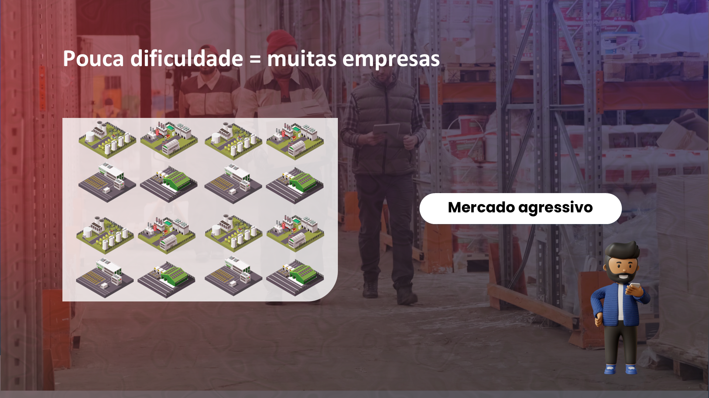

## Visão Geral {.smaller-text}

::: {.columns}
::: {.column width="50%"}
### Tópicos Principais

- [1]{.circle} O agro brasileiro em números
- [2]{.circle} De commodity a produto de valor
- [3]{.circle} Mudanças no perfil do consumidor
- [4]{.circle} Economia da atenção e diferenciação
- [5]{.circle} A marca como resposta estratégica
:::

::: {.column width="50%"}
::: {.info-box}
**Objetivo da Aula**

Compreender as transformações estruturais do mercado agropecuário brasileiro e por que a gestão de marcas se tornou uma necessidade estratégica para o setor.
:::
:::
:::

---

## O AGRO BRASILEIRO EM NÚMEROS {.smaller-text}

O agronegócio brasileiro representa uma potência produtiva global:

- **~27% do PIB** nacional (CNA, 2024)
- **3º maior exportador** de alimentos do mundo
- **Emprega ~27 milhões** de pessoas
- Responsável por alimentar mais de **1 bilhão de pessoas** globalmente

Mas essa grandeza produtiva esconde uma fragilidade: a maioria dos produtores **compete por preço**, não por **valor percebido**.

---

## QUANDO PRODUZIR BASTAVA {.smaller-text}

{width="70%" fig-align="center"}

No modelo anterior, a simples capacidade de **produzir** já era suficiente para garantir mercado. A demanda superava a oferta e não havia necessidade de diferenciação.

---

## A ARMADILHA DA COMMODITY {.smaller-text}

::::: columns
::: {.column width="50%"}
### Lógica commodity

- Produto indiferenciado
- Competição por **preço e volume**
- Margem decrescente
- Poder de barganha no **comprador**
- Produtor é "tomador de preço"
:::

::: {.column width="50%"}
### Lógica de marca

- Produto com identidade
- Competição por **valor percebido**
- Margem protegida
- Poder de barganha **compartilhado**
- Produtor define o posicionamento
:::
:::::

> A commodity é precificada pelo mercado. A marca é precificada pela **percepção**.

---

## O MERCADO FICOU AGRESSIVO {.smaller-text}

{width="70%" fig-align="center"}

---

## VOCÊ É SÓ MAIS UM? {.smaller-text}

{width="70%" fig-align="center"}

---

## MUDANÇAS NO PERFIL DO CONSUMIDOR {.smaller-text}

O consumidor de alimentos mudou radicalmente nas últimas duas décadas:

| Antes | Agora |
|:------|:------|
| Comprava por preço | Compra por **história e valores** |
| Aceitava o disponível | Pesquisa e **escolhe ativamente** |
| Não questionava origem | Exige **rastreabilidade** |
| Marca = logotipo | Marca = **experiência e confiança** |
| Passivo | Ativo nas redes sociais |

O consumidor atual é um **auditor voluntário** das marcas que consome.

---

## ECONOMIA DA ATENÇÃO {.smaller-text}

Em um mundo com excesso de oferta, o recurso mais escasso não é o produto — é a **atenção**.

- Uma pessoa é exposta a **6.000–10.000** mensagens publicitárias por dia
- O tempo de atenção médio caiu para **~8 segundos**
- Apenas marcas **relevantes e diferenciadas** conseguem furar esse filtro

::: {.callout-warning}
Se sua marca não comunica valor em poucos segundos, ela é invisível.
:::

---

## PREÇO NÃO É DIFERENCIAL {.smaller-text}

{width="70%" fig-align="center"}

---

## A MARCA COMO RESPOSTA {.smaller-text}

A marca resolve os três principais desafios do agro contemporâneo:

| Desafio | Solução via marca |
|:--------|:-----------------|
| Commoditização | Diferenciação e identidade |
| Margens apertadas | Prêmio de preço por valor percebido |
| Invisibilidade do produtor | Narrativa, origem e rastreabilidade |

A marca transforma o protagonismo produtivo em **protagonismo de mercado**.

---

## O QUE É UM DIFERENCIAL? {.smaller-text}

{width="70%" fig-align="center"}

---

## O NOVO PARADIGMA {.smaller-text}

{width="70%" fig-align="center"}

---

## EXEMPLOS DE TRANSFORMAÇÃO {.smaller-text}

::::: columns
::: {.column width="50%"}
### Café commodity → Café de terroir

- Mesmo produto, mesma região
- Sem marca: R$ 30/kg (commodity)
- Com marca: R$ 80–120/kg (especial)
- Diferença: **narrativa + rastreabilidade + posicionamento**
:::

::: {.column width="50%"}
### Mel genérico → Mel monofloral de origem

- Mesmo apiário, mesma produção
- Sem marca: R$ 15/kg (balde)
- Com marca: R$ 55/kg (fracionado, com selo)
- Diferença: **identidade + embalagem + benefícios comunicados**
:::
:::::

---

## O QUE NÃO É BRANDING {.smaller-text}

Antes de avançar, é essencial esclarecer:

- ❌ Branding **não é** fazer um logotipo bonito
- ❌ Branding **não é** criar um Instagram da fazenda
- ❌ Branding **não é** embalagem colorida
- ❌ Branding **não é** mentir sobre o produto
- ❌ Branding **não é** só para grandes empresas

✅ Branding é **gestão estratégica de marca** — definir quem você é, para quem vende, o que diferencia e como comunica de forma consistente.

---

## PARA A PRÓXIMA AULA {.smaller-text}

::: {.info-box}
### Atividade Preparatória

1. Pense em **um produto agro** que você conhece que é vendido como commodity
2. Identifique **o que falta** para esse produto ter uma marca reconhecida
3. Liste **3 atributos** que o diferenciariam dos concorrentes

Estas reflexões serão usadas na Aula 02: **Introdução ao Branding**.
:::

---

## REFERÊNCIAS {.smaller-text}

- CNA. PIB do Agronegócio Brasileiro. Panorama do Agro, 2024.
- IBGE. Censo Agropecuário Brasileiro, 2024.
- MAPA. Anuário Estatístico: Agrostat, 2024.
- KOTLER, P.; KARTAJAYA, H.; SETIAWAN, I. *Marketing 4.0*. Wiley, 2017.
- TROUT, J.; RIVKIN, S. *Diferenciar ou Morrer*. Futura, 2000.