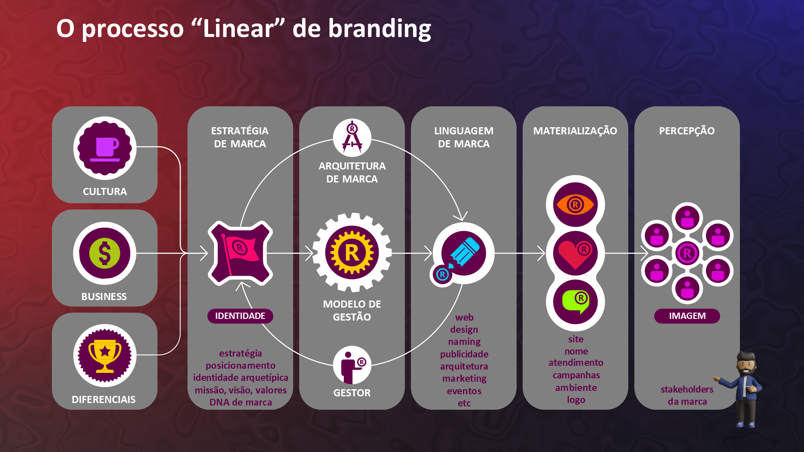
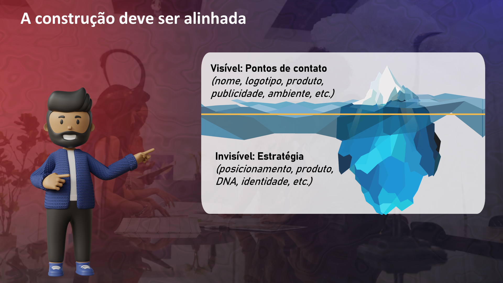

## Visão Geral {.smaller-text}

::: {.columns}
::: {.column width="50%"}
### Tópicos Principais

- [1]{.circle} O que é marca?
- [2]{.circle} O que é branding?
- [3]{.circle} Marca vs. produto
- [4]{.circle} Brand equity no agro
- [5]{.circle} Os pilares da gestão de marca
:::

::: {.column width="50%"}
::: {.info-box}
**Objetivo da Aula**

Dominar os conceitos fundamentais de marca e branding, compreendendo como se aplicam ao contexto do agronegócio brasileiro.
:::
:::
:::

---

## O QUE É MARCA? {.smaller-text}

Uma marca é muito mais do que um nome ou logotipo:

> "Marca é um conjunto de **associações mentais** que o público faz ao entrar em contato com um nome, símbolo, produto ou organização" (Aaker, 2014).

No agro, isso significa que sua marca é:

- O que o **comprador pensa** quando ouve o nome da sua fazenda
- O que o **consumidor sente** quando vê seu produto na prateleira
- O que o **parceiro espera** quando negocia com você

A marca não está na embalagem — está na **mente do público**.

---

## MARCA NÃO É LOGO {.smaller-text}

{width="70%" fig-align="center"}

---

## MARCA É REPUTAÇÃO {.smaller-text}

{width="70%" fig-align="center"}

---

## O QUE É BRANDING? {.smaller-text}

**Branding** é a gestão estratégica da marca. É o processo contínuo de:

1. **Definir** quem a marca é (identidade)
2. **Diferenciar** o que a marca oferece (estratégia)
3. **Comunicar** o valor da marca (expressão)
4. **Entregar** o que a marca promete (experiência)
5. **Medir** como a marca é percebida (reputação)

::: {.callout-important}
Branding não é um projeto com início, meio e fim. É uma **disciplina permanente** de gestão.
:::

---

## O MODELO DE GESTÃO DE MARCA {.smaller-text}

{width="70%" fig-align="center"}

---

## MARCA vs. PRODUTO {.smaller-text}

::::: columns
::: {.column width="50%"}
### Produto

- Fabricado na fazenda/indústria
- Tem atributos físicos
- Pode ser copiado
- Pode ficar obsoleto
- Compete por especificação
:::

::: {.column width="50%"}
### Marca

- Construída na **mente do público**
- Tem atributos **emocionais e simbólicos**
- É **única** (não pode ser copiada)
- Pode se **reinventar**
- Compete por **percepção de valor**
:::
:::::

> O café é um produto. O café especial rastreado do Cerrado com selo de origem é uma **marca**.

---

## ENTREGA vs. PROMESSA {.smaller-text}

{width="70%" fig-align="center"}

---

## BRAND EQUITY — O VALOR DA MARCA {.smaller-text}

Brand equity é o **valor agregado** que a marca confere ao produto. No agro, se manifesta em:

| Indicador | O que revela |
|:----------|:------------|
| **Prêmio de preço** | O público paga mais pelo produto com marca |
| **Preferência** | O comprador escolhe a marca em detrimento de opções similares |
| **Lealdade** | O cliente repete a compra e recomenda |
| **Resiliência** | A marca suporta crises sem perder mercado |
| **Atração** | A marca atraí talentos, parceiros e investidores |

---

## OS QUATRO PILARES DO BRAND EQUITY {.smaller-text}

Segundo Aaker (2014):

| Pilar | No agro significa |
|:------|:-----------------|
| **Conhecimento** | O mercado sabe que sua marca existe |
| **Qualidade percebida** | O público associa sua marca a alto padrão |
| **Associações** | O público conecta sua marca a atributos positivos (origem, sustentabilidade, tradição) |
| **Lealdade** | Compradores retornam safra após safra |

Construir brand equity é construir cada um desses pilares sistematicamente.

---

## BRANDING NÃO É SÓ MARKETING {.smaller-text}

::::: columns
::: {.column width="50%"}
### Marketing

- Foco em **vender** o produto
- Ações de curto/médio prazo
- Campanhas e promoções
- Orientado por **volume**
- Pergunta: "Como vendo mais?"
:::

::: {.column width="50%"}
### Branding

- Foco em **construir percepção**
- Ações de longo prazo
- Consistência e coerência
- Orientado por **valor**
- Pergunta: "Como sou percebido?"
:::
:::::

Marketing é o que você **diz**. Branding é o que o público **pensa** sobre o que você diz.

---

## O VISÍVEL E O INVISÍVEL DA MARCA {.smaller-text}

{width="70%" fig-align="center"}

---

## O CICLO VIRTUOSO DA MARCA NO AGRO {.smaller-text}

```
Diferenciação → Valor percebido → Prêmio de preço
     ↑                                    ↓
 Reinvestimento ← Margem maior ← Receita superior
```

A marca cria um ciclo onde a diferenciação gera valor, o valor gera receita, e a receita permite reinvestir na marca e no produto.

---

## EXERCÍCIO EM SALA {.smaller-text}

::: {.info-box}
### Atividade

Em duplas, escolham **um produto agro** e respondam:

1. Qual é o **produto**? (atributos físicos)
2. Se fosse uma **marca forte**, que associações mentais despertaria?
3. Qual seria o **prêmio de preço** possível com essas associações?
4. Em uma frase: qual é a **promessa dessa marca**?

Tempo: 15 minutos. Apresentação oral: 3 min/dupla.
:::

---

## REFERÊNCIAS {.smaller-text}

- AAKER, D. A. *Aaker on Branding: 20 Principles That Drive Success*. Morgan James, 2014.
- KELLER, K. L. *Strategic Brand Management*. 4ª ed. Pearson, 2013.
- NEUMEIER, M. *The Brand Gap*. New Riders, 2006.
- KAPFERER, J.-N. *The New Strategic Brand Management*. 4ª ed. Kogan Page, 2008.
