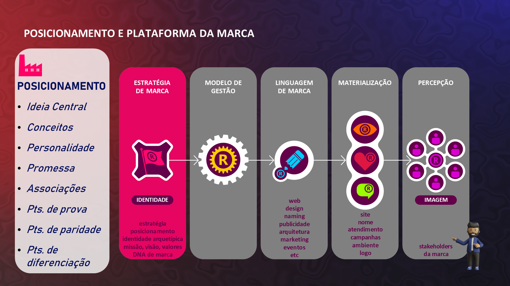
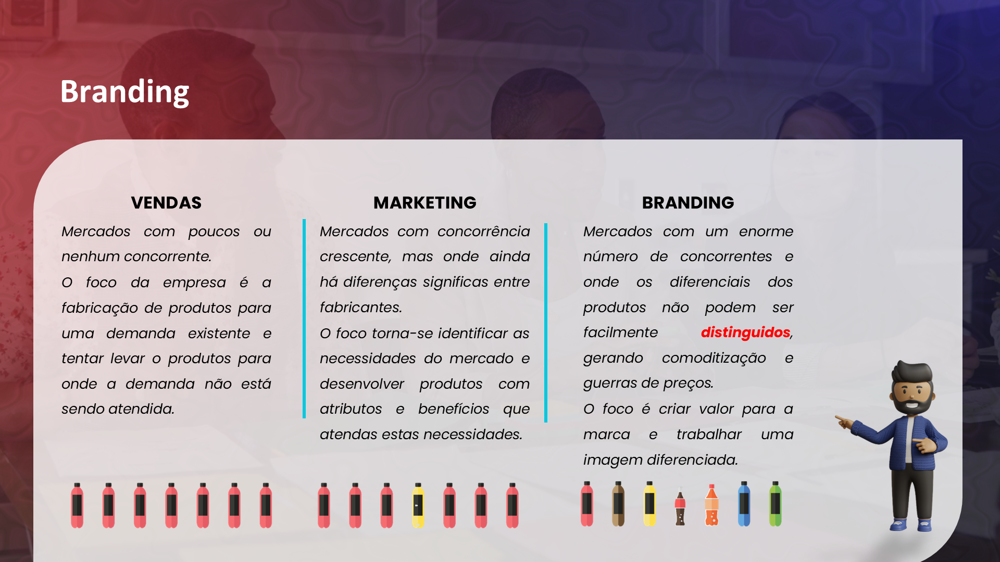

## Visão Geral {.smaller-text}

::: {.columns}
::: {.column width="50%"}
### Tópicos Principais

- [1]{.circle} Ativos tangíveis vs. intangíveis
- [2]{.circle} A marca como ativo intangível
- [3]{.circle} Valor contábil vs. valor de marca
- [4]{.circle} Indicações geográficas como marca coletiva
- [5]{.circle} O agro que vende valor, não volume
:::

::: {.column width="50%"}
::: {.info-box}
**Objetivo da Aula**

Compreender por que a marca é o ativo intangível mais valioso do agronegócio e como ela transforma a lógica de remuneração do produtor rural.
:::
:::
:::

---

## ATIVOS TANGÍVEIS vs. INTANGÍVEIS {.smaller-text}

::::: columns
::: {.column width="50%"}
### Tangíveis (visíveis)

- Terra e propriedades
- Máquinas e equipamentos
- Rebanho e lavoura
- Estoques
- Infraestrutura

*Depreciáveis e copiáveis*
:::

::: {.column width="50%"}
### Intangíveis (invisíveis mas valiosos)

- **Marca** e reputação
- Conhecimento e know-how
- Relacionamentos comerciais
- Certificações e selos
- Propriedade intelectual

*Apreciáveis e inimitáveis*
:::
:::::

> Em economias maduras, **80% do valor** das empresas são ativos intangíveis (Wheeler, 2018).

---

## A MARCA COMO ATIVO INTANGÍVEL {.smaller-text}

Considere duas fazendas vizinhas, com o mesmo solo, clima e variedade de café:

| Aspecto | Fazenda A | Fazenda B |
|:--------|:----------|:----------|
| Área | 50 ha | 50 ha |
| Produção | 200 sacas | 200 sacas |
| Qualidade | 85+ pontos SCA | 85+ pontos SCA |
| Marca | Nenhuma | Marca própria, rastreabilidade |
| Preço médio/saca | R$ 1.200 | R$ 2.000 |
| Receita bruta | R$ 240.000 | R$ 400.000 |

**Diferença de R$ 160.000/safra** — gerada exclusivamente pelo ativo "marca".

---

## INDICAÇÕES GEOGRÁFICAS {.smaller-text}

As indicações geográficas (IGs) são **marcas coletivas territoriais** reconhecidas pelo INPI:

| Tipo | Definição | Exemplo |
|:-----|:----------|:--------|
| **IP** (Indicação de Procedência) | Notoriedade da região | IP Vale dos Vinhedos |
| **DO** (Denominação de Origem) | Qualidade ligada ao terroir | DO Cerrado Mineiro |

O Brasil tem dezenas de IGs no agro. Cada uma funciona como um **selo de marca territorial** que agrega valor a todos os produtores da região.

---

## O EFEITO COMPOSTO DA MARCA {.smaller-text}

A marca gera valor em múltiplas dimensões simultaneamente:

- **Comercial** — Prêmio de preço e acesso a mercados premium
- **Financeiro** — Ativo no balanço patrimonial (valuation)
- **Social** — Reconhecimento e reputação do produtor
- **Territorial** — Valorização da região de origem
- **Geracional** — Patrimônio transmissível entre gerações

::: {.callout-tip}
Uma marca bem construída é o único ativo da fazenda que **aprecia com o tempo** em vez de depreciar.
:::

---

## O SISTEMA COMPLETO DE BRANDING {.smaller-text}

{width="70%" fig-align="center"}

---

## QUANDO A MARCA VALE MAIS QUE O PRODUTO {.smaller-text}

Exemplos reais onde o valor da marca supera o valor do produto:

- **Café Illy**: compra café brasileiro, mas o consumidor paga pela marca Illy
- **Korin**: frango é frango — mas o selo Korin justifica o prêmio
- **Vinícola Miolo**: uva é uva — mas o vinho Miolo tem brand equity medido

Em todos os casos, o produtor rural que **não tem marca** fornece a matéria-prima para que **outros construam marca** sobre seu trabalho.

---

## O CUSTO DE NÃO TER MARCA {.smaller-text}

Não investir em marca não é "economizar" — é **transferir valor** para outros elos da cadeia:

```
[Produtor sem marca]
      ↓ vende commodity
[Trader / Cooperativa]
      ↓ agrega marca
[Indústria / Varejo]
      ↓ vende com marca final
[Consumidor]
```

Quem construiu a marca fica com o prêmio de preço. Quem produziu fica com a margem mínima.

---

## BRANDING vs. MARKETING {.smaller-text}

{width="70%" fig-align="center"}

---

## AUTOAVALIAÇÃO: SUA MARCA É UM ATIVO? {.smaller-text}

::: {.info-box}
### Reflita sobre seu negócio

| Pergunta | Sim | Não |
|:---------|:---:|:---:|
| Meu produto tem identidade de marca? | | |
| Meu público sabe quem produziu? | | |
| Eu defino meu preço ou o mercado define? | | |
| Compradores retornam espontaneamente? | | |
| Minha marca seria reconhecida em outro contexto? | | |
| A marca sobreviveria se eu vendesse o negócio? | | |

Se a maioria das respostas for "Não", sua marca **ainda não é um ativo** — é apenas um nome.
:::

---

## REFERÊNCIAS {.smaller-text}

- AAKER, D. A. *Aaker on Branding*. Morgan James, 2014.
- WHEELER, A. *Designing Brand Identity*. 5ª ed. Wiley, 2018.
- KAPFERER, J.-N. *The New Strategic Brand Management*. 4ª ed. Kogan Page, 2008.
- MAPA. Anuário Estatístico: Agrostat, 2024.
- SEBRAE. Indicações Geográficas Brasileiras, 2024.