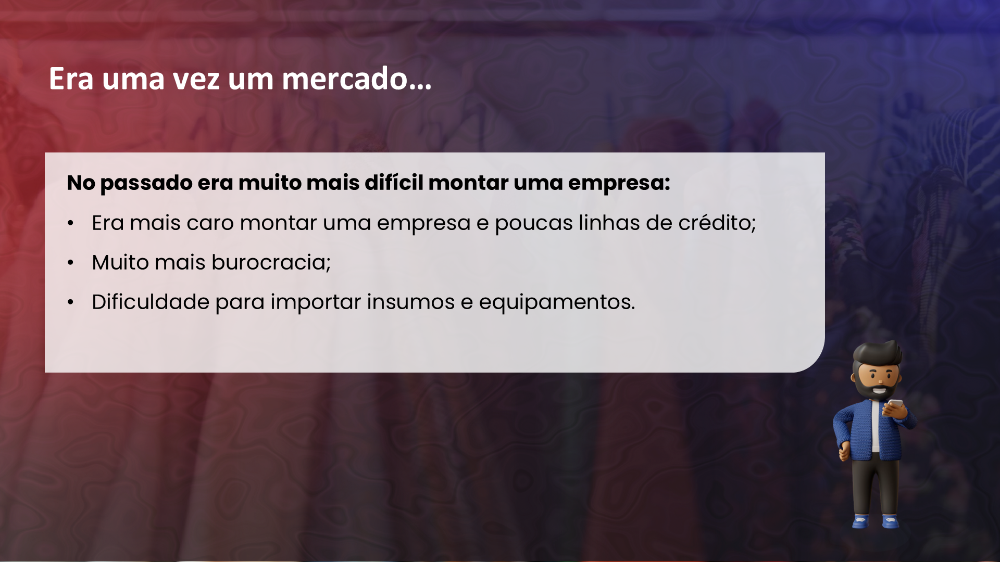
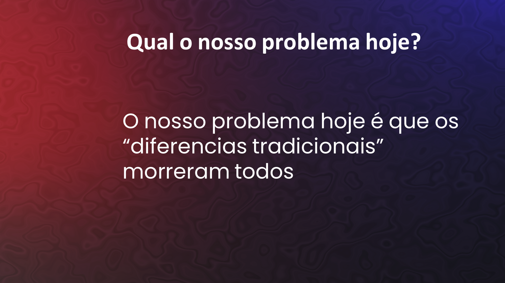
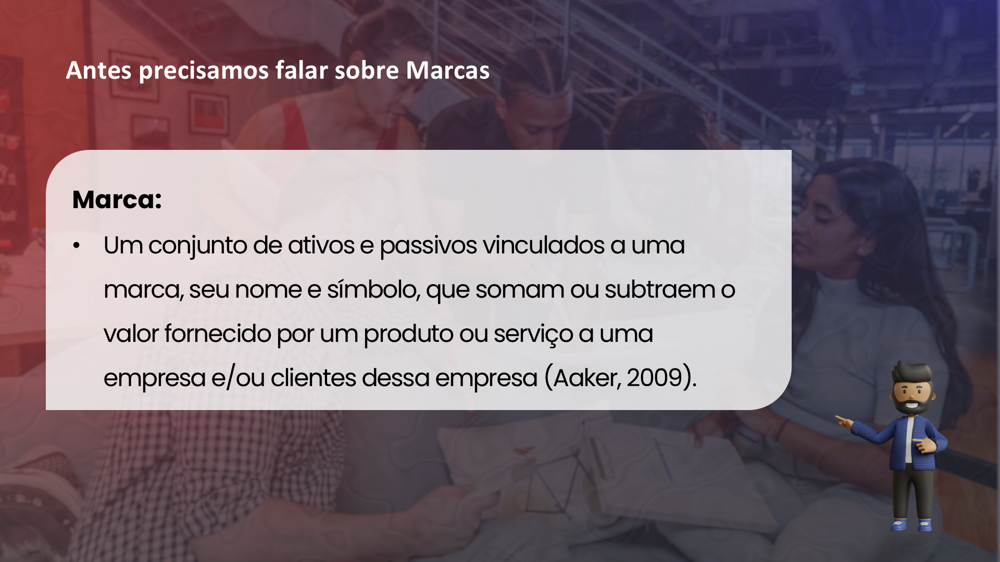

## Visão Geral {.smaller-text}

::: {.columns}
::: {.column width="50%"}
### Tópicos Principais

- [1]{.circle} Branding não é só para grandes
- [2]{.circle} Vantagens do pequeno produtor
- [3]{.circle} Limitações reais e como superá-las
- [4]{.circle} Cooperativas e marcas coletivas
- [5]{.circle} Primeiros passos práticos
:::

::: {.column width="50%"}
::: {.info-box}
**Objetivo da Aula**

Demonstrar que branding é acessível ao pequeno e médio produtor rural e apresentar caminhos práticos para começar com recursos limitados.
:::
:::
:::

---

## O MITO: "BRANDING É SÓ PARA GRANDES" {.smaller-text}

A ideia de que gestão de marca exige orçamentos milionários é um equívoco:

| O que branding exige | O que branding **não** exige |
|:--------------------|:---------------------------|
| Clareza de identidade | Agência de publicidade |
| Consistência na comunicação | Campanha na TV |
| Diferenciação genuína | Orçamento de multinacional |
| Conhecimento do público | Equipe de marketing |
| Disciplina de longo prazo | Tecnologia sofisticada |

A maioria das decisões de branding é **estratégica**, não **orçamentária**.

---

## O MERCADO MUDOU {.smaller-text}

{width="70%" fig-align="center"}

---

## OS DIFERENCIAIS TRADICIONAIS MORRERAM {.smaller-text}

{width="70%" fig-align="center"}

---

## VANTAGENS COMPETITIVAS DO PEQUENO {.smaller-text}

O pequeno produtor tem ativos de marca que grandes empresas **não conseguem replicar**:

- **Autenticidade** — Não é storytelling; é a vida real
- **Proximidade** — Contato direto com o consumidor
- **Agilidade** — Muda rápido, testa rápido
- **Rastreabilidade natural** — "Eu sei de onde veio porque eu plantei"
- **História pessoal** — O rosto do produtor é a marca
- **Terroir único** — Microclima, solo, topografia irreproduzíveis

> Grandes empresas **simulam** autenticidade. Pequenos produtores **são** autênticos.

---

## LIMITAÇÕES REAIS {.smaller-text}

Reconhecer as limitações é o primeiro passo para superá-las:

| Limitação | Estratégia |
|:----------|:-----------|
| Falta de escala de produção | Posicionar-se como **exclusivo**, não como insuficiente |
| Pouco capital para investir | Começar pela marca pessoal (custo zero) |
| Distância do mercado consumidor | Usar canais digitais e feiras especializadas |
| Falta de conhecimento em marketing | Focar no essencial: identidade + consistência |
| Informalidade | Formalizar progressivamente à medida que a marca cresce |

---

## COOPERATIVAS E MARCAS COLETIVAS {.smaller-text}

Quando o porte individual é limitado, a **cooperação** multiplica o poder de marca:

- **Marca coletiva** — Vários produtores sob uma identidade compartilhada
- **Indicação Geográfica** — Marca territorial registrada no INPI
- **Selo de qualidade** — Padrão comum que garante ao comprador

Exemplos de sucesso:
- Cooperativas de café especial (Cerrado Mineiro)
- Associações de queijo artesanal (Serro, Canastra)
- Cooperativas de mel orgânico (Caatinga)

---

## MARCA: ATIVOS E PASSIVOS {.smaller-text}

{width="70%" fig-align="center"}

---

## PRIMEIROS PASSOS — O MÍNIMO VIÁVEL {.smaller-text}

O "Branding Mínimo Viável" para o produtor rural:

**Fase 1 — Identidade (Semana 1-2)**

- Definir: Quem sou? O que faço de diferente? Para quem?
- Escolher um nome para a marca (pode ser o nome da fazenda)

**Fase 2 — Expressão (Semana 3-4)**

- Criar uma identidade visual básica (Canva, freelancer)
- Produzir embalagem/rótulo simples com identidade

**Fase 3 — Presença (Mês 2)**

- Criar perfil em rede social (Instagram ou WhatsApp Business)
- Publicar 2-3x por semana: bastidores, processo, produto

**Fase 4 — Consistência (Contínuo)**

- Manter o padrão visual e de comunicação
- Registrar depoimentos de clientes

---

## MARCA PESSOAL NO AGRO {.smaller-text}

Para o pequeno produtor, a marca pessoal é a forma mais poderosa e acessível:

- O **rosto** do produtor gera confiança
- A **história pessoal** cria conexão emocional
- A **transparência** radical é diferenciação
- O **WhatsApp** é o canal mais eficaz

::: {.callout-tip}
O consumidor de alimentos quer saber **quem plantou, como plantou e por que plantou assim**. Mostre isso.
:::

---

## FERRAMENTAS ACESSÍVEIS {.smaller-text}

| Necessidade | Ferramenta gratuita/acessível |
|:------------|:------------------------------|
| Logo simples | Canva (gratuito) |
| Rótulos | Canva + gráfica local |
| Fotos de produto | Celular + luz natural |
| Presença digital | Instagram + WhatsApp Business |
| Rastreabilidade | QR code gratuito (qr-code-generator.com) |
| Vídeos | Celular + CapCut (gratuito) |
| Cartão de visita | Canva + gráfica expressa |

Não é sobre **quanto** investir, mas sobre **ser consistente** no que investir.

---

## EXERCÍCIO EM SALA {.smaller-text}

::: {.info-box}
### Atividade: Branding Mínimo Viável

Cada aluno (ou dupla) deve definir para um produto rural:

1. **Nome da marca** (real ou fictício)
2. **Frase de identidade**: "Somos ___ que ___ para ___"
3. **3 postagens** que publicariam na primeira semana do Instagram
4. **1 diferencial** que comunicariam na embalagem

Tempo: 20 minutos. Apresentação: 3 min/grupo.
:::

---

## REFERÊNCIAS {.smaller-text}

- GERBER, M. E. *O Mito do Empreendedor*. Saraiva, 1995.
- SEBRAE. Perfil dos Pequenos Negócios do Agronegócio, 2024.
- IBGE. Censo Agropecuário Brasileiro, 2024.
- NEUMEIER, M. *The Brand Gap*. New Riders, 2006.
