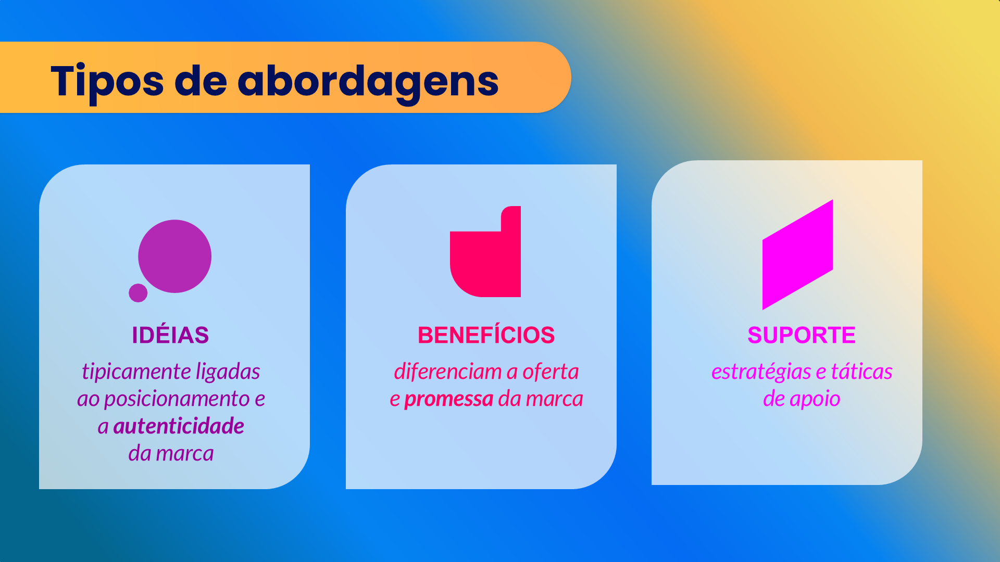
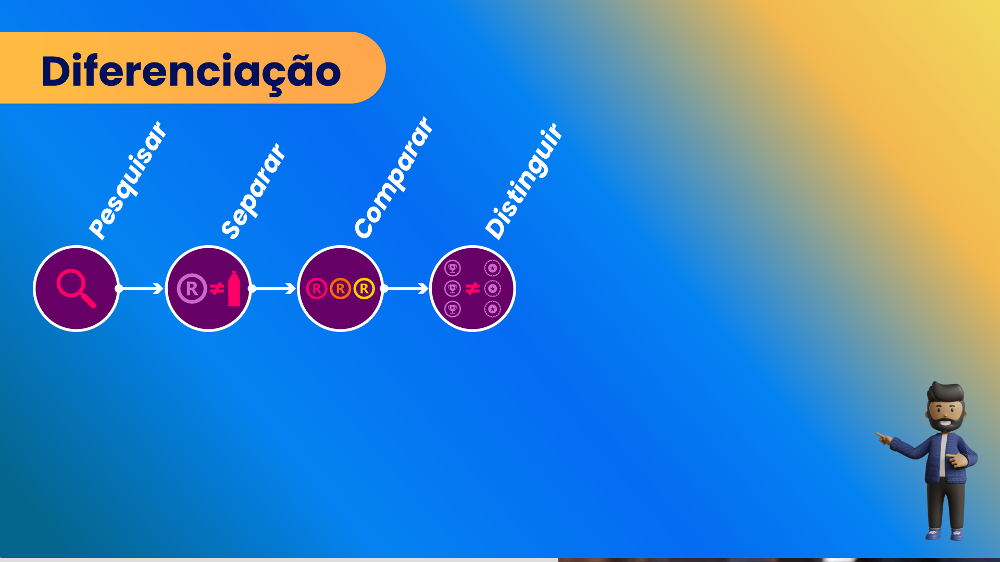

## Visão Geral {.smaller-text}

::: {.columns}
::: {.column width="50%"}
### Tópicos Principais

- [1]{.circle} O imperativo de diferenciar
- [2]{.circle} Diferenciar ou morrer
- [3]{.circle} Fontes de diferenciação no agro
- [4]{.circle} Diferenciação real vs. percebida
- [5]{.circle} O processo estratégico
:::

::: {.column width="50%"}
::: {.info-box}
**Objetivo da Aula**

Compreender por que a diferenciação é a base de toda estratégia de marca e identificar as fontes de diferenciação disponíveis no agronegócio.
:::
:::
:::

---

## O IMPERATIVO DE DIFERENCIAR {.smaller-text}

Jack Trout resumiu a questão: **"Diferenciar ou morrer"** (Trout & Rivkin, 2000).

No agronegócio, a diferenciação é ainda mais crítica porque:

- A maioria dos produtos é **percebida como commodity**
- A competição por **preço é destrutiva** para o produtor
- A **oferta global crescente** pressiona margens
- O consumidor tem **excesso de opções** e pouco tempo

Sem diferenciação, resta competir pelo fundo — o menor preço.

---

## O QUE É DIFERENCIAÇÃO? {.smaller-text}

Diferenciação é a capacidade de ser **percebido como distinto e preferível** pelo público-alvo.

::: {.callout-important}
Diferenciação **não é** ser diferente de todos. É ser **distinto e relevante** para o público que importa.
:::

| Diferenciação forte | Diferenciação fraca |
|:--------------------|:-------------------|
| Baseada em atributos reais | Baseada apenas em comunicação |
| Relevante para o público | Interessante mas irrelevante |
| Difícil de copiar | Facilmente replicável |
| Sustentável no tempo | Efêmera |

---

## FONTES DE DIFERENCIAÇÃO NO AGRO {.smaller-text}

O agronegócio tem fontes de diferenciação que muitos setores não possuem:

| Fonte | Exemplo |
|:------|:--------|
| **Origem/Terroir** | Café do Cerrado, Cacau de Ilhéus |
| **Método de produção** | Orgânico, biodinâmico, regenerativo |
| **Raça/Variedade** | Carne de Nelore CEIP, uva Moscato |
| **Processo** | Secagem em terreiro, maturação em adega |
| **Certificação** | Orgânico, Fair Trade, Rainforest |
| **História/Tradição** | Três gerações, fundação centenária |
| **Tecnologia** | Rastreabilidade blockchain, agricultura de precisão |
| **Impacto** | Carbono neutro, regeneração ambiental |

---

## HIERARQUIA DA DIFERENCIAÇÃO {.smaller-text}

Nem toda diferenciação é igualmente poderosa. Há uma hierarquia:

```
Nível 5: PROPÓSITO (mais forte)
  "Existimos para regenerar ecossistemas produzindo alimento"

Nível 4: EXPERIÊNCIA
  "Cada lote conta uma história sensorial única"

Nível 3: PROCESSO/MÉTODO
  "Cultivamos em sistema agroflorestal com zero agrotóxico"

Nível 2: ATRIBUTO/CERTIFICAÇÃO
  "Certificado orgânico, selo Rainforest Alliance"

Nível 1: PRODUTO (mais fraco)
  "Nosso café tem 88 pontos SCA"
```

Quanto mais alto o nível, mais **sustentável e difícil de copiar** é a diferenciação.

---

## DIFERENCIAÇÃO REAL vs. PERCEBIDA {.smaller-text}

::::: columns
::: {.column width="50%"}
### Diferenciação real

- Existe de fato no produto/processo
- Verificável e demonstrável
- **Base do branding ético**
- Exemplo: solo vulcânico que gera perfil mineral único
:::

::: {.column width="50%"}
### Diferenciação percebida

- Existe na mente do consumidor
- Construída por comunicação e marca
- **Complementa** a diferenciação real
- Exemplo: associar a marca a "aventura" ou "tradição familiar"
:::
:::::

> A diferenciação **ideal** é real **e** percebida. Nunca apenas percebida — isso é fraude.

---

## QUALIDADE NÃO BASTA {.smaller-text}

{width="70%" fig-align="center"}

---

## O PROCESSO DE DIFERENCIAÇÃO {.smaller-text}

:::::: {.incremental}
1. **Mapear** — Quais são os diferenciais que já possuo?
2. **Validar** — Eles são reais, relevantes e difíceis de copiar?
3. **Selecionar** — Qual(is) diferencial(is) sustentar?
4. **Suportar** — Como provar a diferenciação?
5. **Comunicar** — Como tornar a diferenciação visível?
6. **Monitorar** — A diferenciação ainda é percebida pelo público?
::::::

---

## O PROCESSO VISUALIZADO {.smaller-text}

{width="70%" fig-align="center"}

---

## ERROS COMUNS {.smaller-text}

- ❌ **Diferenciar sem relevância** — "Somos a única fazenda da rua" (e daí?)
- ❌ **Copiar diferenciais** — Dizer-se sustentável porque o concorrente diz
- ❌ **Diferenciação genérica** — "Qualidade e tradição" (todos dizem)
- ❌ **Diferenciar sem suportar** — Alegar sem provar
- ❌ **Mudar de diferencial** a cada safra

---

## EXERCÍCIO EM SALA {.smaller-text}

::: {.info-box}
### Canvas de Diferenciação Rápida

Para um produto agro de sua escolha, preencha:

| Pergunta | Resposta |
|:---------|:---------|
| O que produzimos? | |
| O que fazemos de diferente de todos? | |
| Por que isso importa para o comprador? | |
| Como provamos? | |
| Alguém mais pode dizer o mesmo? | |

Se a resposta da última pergunta for "sim", o diferencial é fraco.
:::

---

## REFERÊNCIAS {.smaller-text}

- TROUT, J.; RIVKIN, S. *Diferenciar ou Morrer*. Futura, 2000.
- PORTER, M. E. *Competitive Advantage*. Free Press, 1985.
- KIM, W. C.; MAUBORGNE, R. *A Estratégia do Oceano Azul*. Campus, 2005.
- AAKER, D. A. *Aaker on Branding*. Morgan James, 2014.