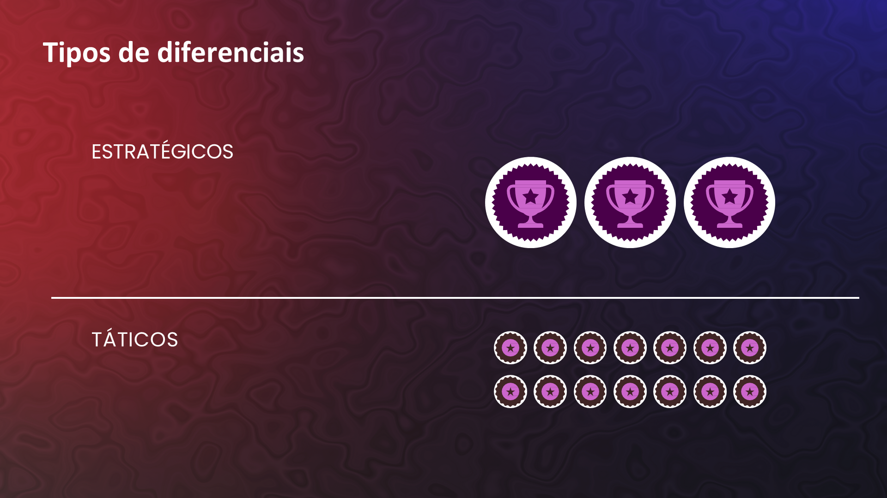
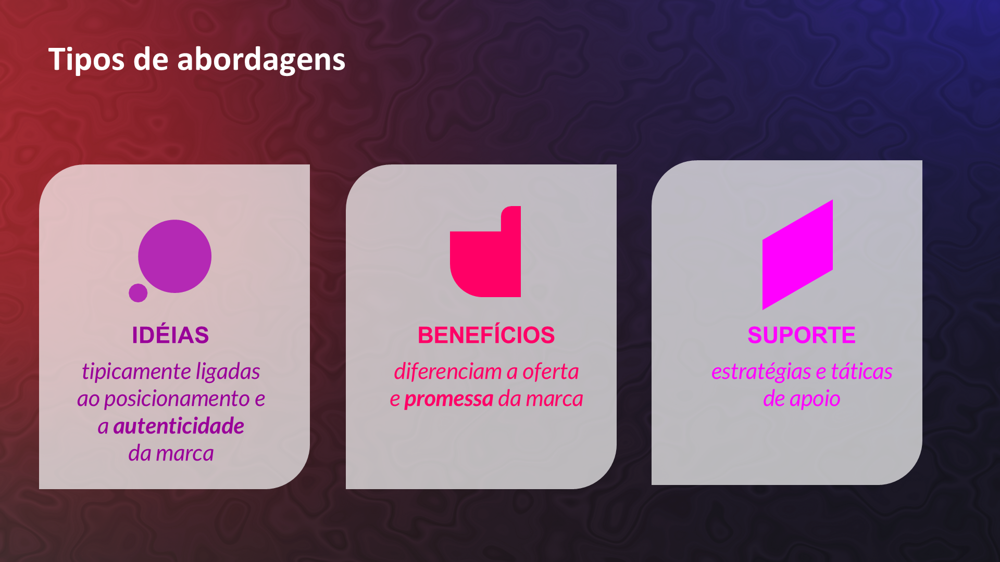
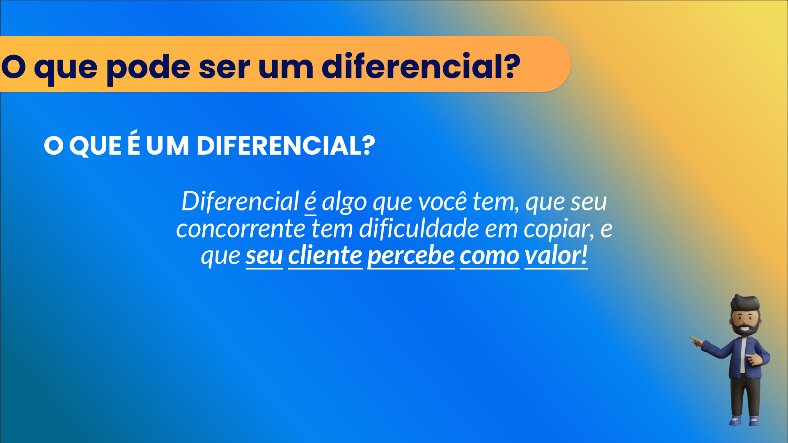

## Visão Geral {.smaller-text}

::: {.columns}
::: {.column width="50%"}
### Tópicos Principais

- [1]{.circle} Por que diferenciais precisam de suporte
- [2]{.circle} Tipos de pontos de prova
- [3]{.circle} Certificações e selos no agro
- [4]{.circle} Construindo credibilidade progressiva
- [5]{.circle} Matriz de suporte à diferenciação
:::

::: {.column width="50%"}
::: {.info-box}
**Objetivo da Aula**

Aprender a sustentar cada diferencial com evidências concretas que geram credibilidade e confiança no público.
:::
:::
:::

---

## DIFERENCIAÇÃO SEM PROVA É PROMESSA VAZIA {.smaller-text}

O mercado está saturado de promessas. A diferença entre uma marca forte e uma marca vazia está na **capacidade de provar** o que afirma.

::::: columns
::: {.column width="50%"}
### Sem suporte ❌

"Nosso café é sustentável"

- Quem disse?
- Como mede?
- Onde posso verificar?
:::

::: {.column width="50%"}
### Com suporte ✅

"Nosso café é produzido em sistema agroflorestal certificado IBD, com relatório anual de carbono e biodiversidade publicado em nosso site"

- Certificação reconhecida
- Dado mensurável
- Transparência verificável
:::
:::::

---

## DIFERENCIAIS ESTRATÉGICOS vs. TÁTICOS {.smaller-text}

{width="70%" fig-align="center"}

---

## TIPOS DE PONTOS DE PROVA {.smaller-text}

| Tipo | Exemplos | Força |
|:-----|:---------|:-----:|
| **Certificação** | Orgânico, Fair Trade, Rainforest Alliance | ★★★★★ |
| **Prêmio/Concurso** | Cup of Excellence, concurso de queijos | ★★★★ |
| **Laudo técnico** | Análise sensorial, laudo microbiológico | ★★★★ |
| **Dados próprios** | Relatório de carbono, análise de solo | ★★★ |
| **Depoimento** | Clientes, chefs, compradores | ★★★ |
| **Imprensa** | Matéria em veículo reconhecido | ★★★ |
| **Rastreabilidade** | QR code, blockchain, registro visual | ★★★ |
| **Demonstração** | Visita guiada, dia de campo, degustação | ★★ |
| **Comparação** | Teste cego, benchmarking documentado | ★★ |

---

## A PIRÂMIDE DE DIFERENCIAÇÃO {.smaller-text}

{width="70%" fig-align="center"}

---

## CERTIFICAÇÕES E SELOS NO AGRO BRASILEIRO {.smaller-text}

| Certificação | O que atesta | Reconhecimento |
|:-------------|:-------------|:--------------:|
| **IBD Orgânico** | Produção orgânica | Nacional/Internacional |
| **SISORG** | Orgânico via MAPA | Nacional |
| **Rainforest Alliance** | Sustentabilidade integrada | Internacional |
| **UTZ** (agora RA) | Boas práticas agrícolas | Internacional |
| **Fair Trade** | Comércio justo | Internacional |
| **BSCI** | Cadeia de suprimento ética | Internacional |
| **Indicação Geográfica** (INPI) | Origem/terroir | Nacional |
| **Selo Arte** | Produto artesanal | Nacional |

---

## CONSTRUINDO CREDIBILIDADE PROGRESSIVA {.smaller-text}

Não é preciso ter tudo de uma vez. A credibilidade é construída em camadas:

**Nível 1 — Transparência (Custo zero)**

- Mostrar o processo produtivo nas redes sociais
- Publicar fotos reais do campo, da colheita, da embalagem
- Compartilhar bastidores sem filtro

**Nível 2 — Documentação (Baixo custo)**

- Registrar depoimentos de clientes
- Fotografar sistematicamente cada etapa
- Criar ficha técnica do produto

**Nível 3 — Validação externa (Investimento)**

- Obter certificações relevantes
- Participar de concursos e premiações
- Buscar cobertura de imprensa

---

## RASTREABILIDADE COMO SUPORTE {.smaller-text}

A rastreabilidade transforma o suporte de "discurso" em "verificação":

```
[QR Code na embalagem/rótulo]
     ↓ consumidor escanneia
[Página com informações]
     • Nome do produtor
     • Localização (mapa)
     • Data de colheita/abate
     • Método de produção
     • Laudo de qualidade
     • Fotos/vídeo do processo
```

Hoje, criar um sistema básico de rastreabilidade por QR code é **gratuito e rápido**.

---

## MATRIZ DE SUPORTE À DIFERENCIAÇÃO {.smaller-text}

Para cada diferencial selecionado na Aula 06, identifique os pontos de prova:

| Diferencial | Ponto de prova 1 | Ponto de prova 2 | Ponto de prova 3 |
|:------------|:-----------------|:-----------------|:-----------------|
| Ex: Café de altitude | Altitude registrada (1.100m) | Certificação SCA | Laudo sensorial |
| | | | |
| | | | |
| | | | |

> **Regra:** Cada diferencial precisa de **no mínimo 2 pontos de prova**. Se não consegue provar, não é diferencial — é desejo.

---

## ETAPAS DO PROCESSO {.smaller-text}

{width="70%" fig-align="center"}

---

## EXERCÍCIO EM SALA {.smaller-text}

::: {.info-box}
### Atividade: Matriz de Suporte

Usando os 3 diferenciais selecionados na Aula 06:

1. Para cada diferencial, liste **todos os pontos de prova** que já existem
2. Identifique **lacunas** — diferenciais sem prova suficiente
3. Proponha **ações concretas** para construir os pontos de prova faltantes
4. Defina **prioridade** e **prazo** para cada ação

Tempo: 20 minutos.
:::

---

## REFERÊNCIAS {.smaller-text}

- KELLER, K. L. *Strategic Brand Management*. 4ª ed. Pearson, 2013.
- AAKER, D. A. *Aaker on Branding*. Morgan James, 2014.
- MAPA. Sistema de Certificação Orgânica, 2024.
- SEBRAE. Indicações Geográficas Brasileiras, 2024.
