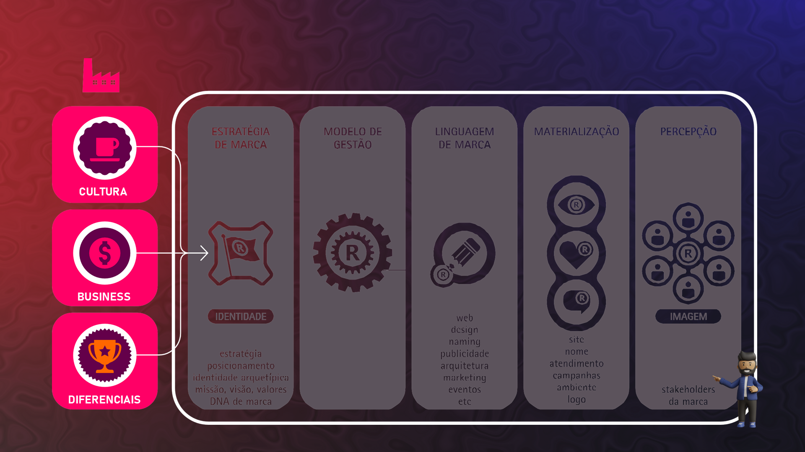
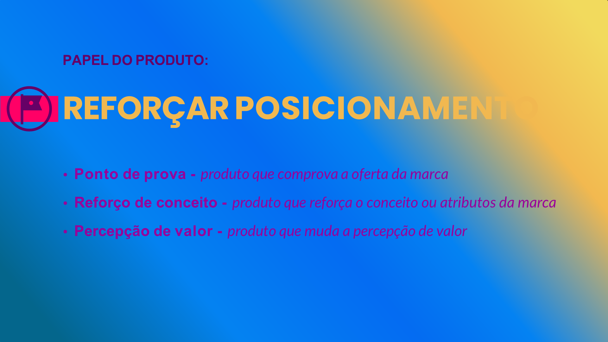

## Visão Geral {.smaller-text}

::: {.columns}
::: {.column width="50%"}
### Tópicos Principais

- [1]{.circle} Atributo vs. benefício
- [2]{.circle} Os 5 níveis de benefícios
- [3]{.circle} Pirâmide de benefícios de marca
- [4]{.circle} Benefícios no agro — exemplos
- [5]{.circle} Mapeamento de benefícios
:::

::: {.column width="50%"}
::: {.info-box}
**Objetivo da Aula**

Distinguir atributos de benefícios e aprender a mapear os benefícios que a marca entrega em cada nível, transformando características técnicas em valor percebido.
:::
:::
:::

---

## ATRIBUTO vs. BENEFÍCIO {.smaller-text}

::::: columns
::: {.column width="50%"}
### Atributo (o que é)

- Característica **objetiva** do produto
- Descritivo, técnico
- "Café arábica, altitude 1.100m, torra média"
- Fala do **produto**
:::

::: {.column width="50%"}
### Benefício (o que gera)

- Valor **percebido** pelo público
- Emocional, funcional ou social
- "Experiência sensorial complexa, com notas de frutas vermelhas"
- Fala do **cliente**
:::
:::::

> O comprador não compra atributos. Compra os **benefícios** que os atributos geram.

---

## CULTURA, BUSINESS E DIFERENCIAIS {.smaller-text}

{width="70%" fig-align="center"}

---

## OS 5 NÍVEIS DE BENEFÍCIOS {.smaller-text}

Da base ao topo, cada nível gera um tipo diferente de valor:

| Nível | Tipo | O que entrega | Pergunta |
|:-----:|:-----|:-------------|:---------|
| 1 | **Funcional** | Soluciona um problema prático | "O que resolve?" |
| 2 | **Experiencial** | Proporciona uma experiência positiva | "O que faz sentir?" |
| 3 | **Social** | Gera pertencimento ou status | "O que comunica sobre mim?" |
| 4 | **Autoexpressão** | Expressa identidade e valores pessoais | "O que diz sobre quem sou?" |
| 5 | **Propósito** | Conecta a algo maior que o consumo | "De que causa participo?" |

---

## PIRÂMIDE DE BENEFÍCIOS {.smaller-text}

```
         /\
        /  \         PROPÓSITO
       / 5  \        "Regenerar ecossistemas"
      /------\
     /   4    \      AUTOEXPRESSÃO
    / "Sou quem \    "Consumidor consciente"
   /  escolhe   \
  /-----+--------\
 /   3  |  Social  \  "Compartilho com orgulho"
/-------+----------\
|  2  Experiencial  |  "Experiência memorável"
|-------------------| 
|   1  Funcional    |  "Produto de qualidade"
 -------------------

 MAIS DIFERENCIADOR ↑
 MAIS BÁSICO ↓
```

Marcas fortes comunicam benefícios nos **níveis superiores**, não apenas no funcional.

---

## BENEFÍCIOS NO AGRO — CASO CAFÉ {.smaller-text}

Transformando atributos em benefícios:

| Atributo | Benefício funcional | Benefício emocional/social |
|:---------|:-------------------|:--------------------------|
| Altitude 1.100m | Acidez equilibrada, corpo aveludado | "O café das montanhas" |
| Colheita seletiva manual | Sem defeitos, grãos uniformes | "Cada grão foi escolhido a mão" |
| Sistema agroflorestal | Sem agrotóxico, solo saudável | "Café que nasce na floresta" |
| Rastreabilidade QR | Garantia de procedência | "Sei exatamente de onde veio" |
| Família produtora 3ª geração | Qualidade consistente | "Tradição de 50 anos" |

---

## BENEFÍCIOS NO AGRO — CASO MEL {.smaller-text}

| Atributo | Benefício funcional | Benefício de autoexpressão |
|:---------|:-------------------|:--------------------------|
| Mel monofloral de aroeira | Sabor amadeirado único | "Aprecio sabores raros" |
| Certificação orgânica | Sem contaminantes | "Escolho o que é puro" |
| Fracionado por apiário | Rastreabilidade | "Conheço a origem" |
| 80 famílias produtoras | Produção confiável | "Fortaleço a agricultura familiar" |
| Região semiárido | Mel de baixa umidade | "Valorizo o produto do sertão" |

---

## ERRO CLÁSSICO: VENDER ATRIBUTOS {.smaller-text}

A maioria dos produtores rurais comunica **atributos** quando deveria comunicar **benefícios**:

| Comunicação errada (atributo) | Comunicação certa (benefício) |
|:-----------------------------|:------------------------------|
| "Café 85+ pontos SCA" | "Uma experiência sensorial que surpreende a cada gole" |
| "Carne de Nelore CEIP certificado" | "Maciez e sabor garantidos em cada corte" |
| "Queijo maturado 22 dias" | "O tempo transforma leite em uma obra de sabor" |
| "Orgânico com selo IBD" | "Alimento puro, do jeito que a natureza faz" |

---

## REFORÇO DE POSICIONAMENTO {.smaller-text}

{width="70%" fig-align="center"}

---

## MAPEAMENTO DE BENEFÍCIOS {.smaller-text}

::: {.info-box}
### Ferramenta: Canvas de Benefícios

Para cada produto da marca, mapeie:

| Nível | Benefícios que entregamos |
|:------|:-------------------------|
| **Funcional** | O que resolve/entrega concretamente? |
| **Experiencial** | Que experiência proporciona? |
| **Social** | Que pertencimento ou status gera? |
| **Autoexpressão** | Que identidade expressa? |
| **Propósito** | A que causa conecta? |

**Regra:** Se só tem benefícios no nível 1, a marca é frágil. Se alcança nível 4 ou 5, é forte.
:::

---

## EXERCÍCIO EM SALA {.smaller-text}

::: {.info-box}
### Atividade: Da Funcionalidade ao Propósito

1. Selecione 5 atributos do seu produto
2. Para cada um, derive o **benefício funcional** (nível 1)
3. Depois, escale para **experiencial** (nível 2)
4. Depois, para **social** ou **autoexpressão** (nível 3 ou 4)
5. Tente chegar ao **propósito** (nível 5)

**Exemplo de escala:**
- Atributo: "Secagem em terreiro suspenso"
- Funcional: "Grãos sem defeitos"
- Experiencial: "Sabor limpo e complexo"
- Social: "Café artesanal de quem entende"
- Propósito: "Valorizar o trabalho manual que respeita o tempo"

Tempo: 20 minutos.
:::

---

## REFERÊNCIAS {.smaller-text}

- AAKER, D. A. *Aaker on Branding*. Morgan James, 2014.
- KELLER, K. L. *Strategic Brand Management*. 4ª ed. Pearson, 2013.
- MARK, M.; PEARSON, C. S. *O Herói e o Fora da Lei*. Cultrix, 2001.
