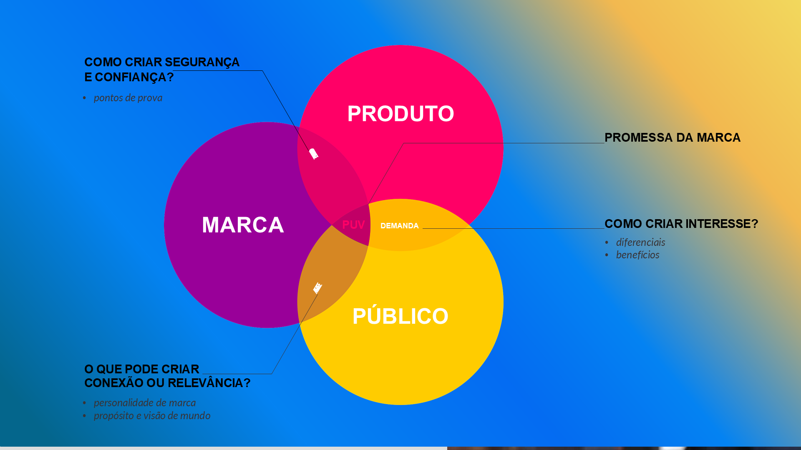
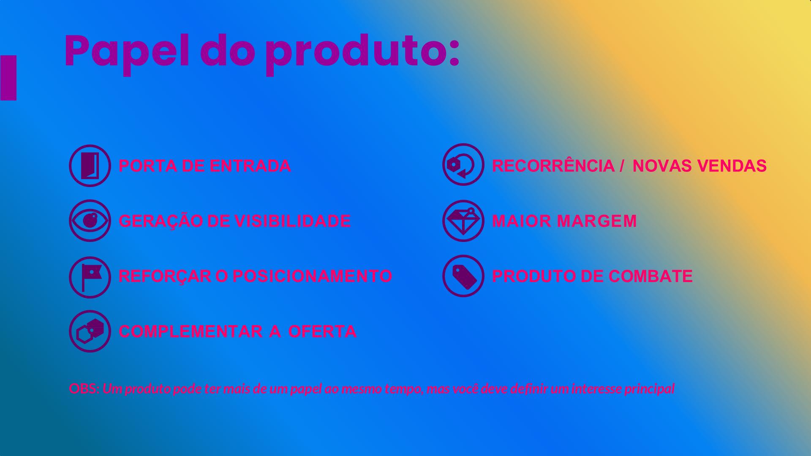
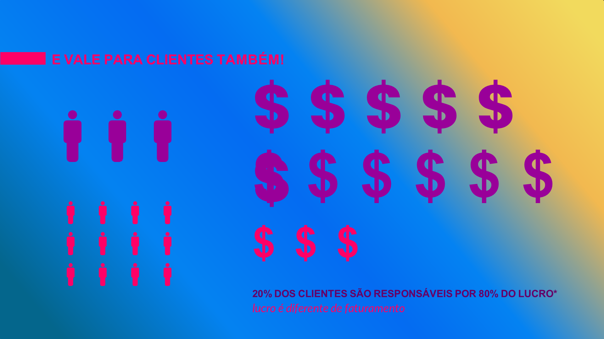
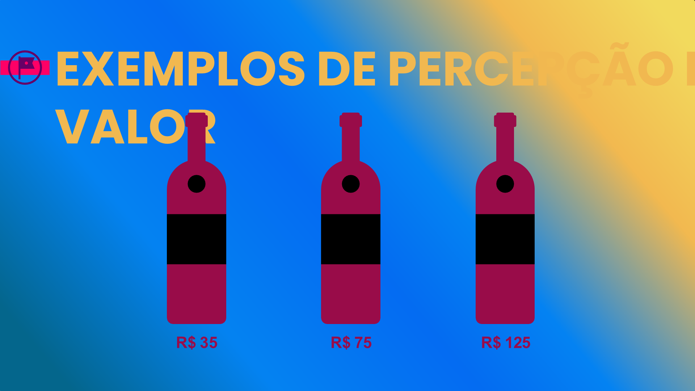

## Visão Geral {.smaller-text}

::: {.columns}
::: {.column width="50%"}
### Tópicos Principais

- [1]{.circle} Portfólio e arquitetura de marca
- [2]{.circle} Papéis dos produtos
- [3]{.circle} Análise 80/20 do portfólio
- [4]{.circle} Extensão e redução de linha
- [5]{.circle} Precificação por valor
:::

::: {.column width="50%"}
::: {.info-box}
**Objetivo da Aula**

Aprender a gerir o portfólio de produtos como extensão da marca, definindo o papel estratégico de cada produto e alinhando preço ao valor percebido.
:::
:::
:::

---

## PORTFÓLIO E MARCA {.smaller-text}

Cada produto da marca cumpre um **papel estratégico**. O portfólio não é uma lista — é um sistema:

| Papel do produto | Função na marca |
|:----------------|:----------------|
| **Produto-herói** | Representa a essência da marca; é o mais conhecido |
| **Produto-entrada** | Introduz novos clientes ao mundo da marca (preço acessível) |
| **Produto-premium** | Ancora a percepção de valor e eleva toda a marca |
| **Produto-volume** | Gera receita para financiar a marca |
| **Produto-inovação** | Mostra que a marca evolui e experimenta |

---

## PRODUTO COMO BASE DO POSICIONAMENTO {.smaller-text}

{width="70%" fig-align="center"}

---

## PAPÉIS DOS PRODUTOS NO PORTFÓLIO {.smaller-text}

{width="70%" fig-align="center"}

---

## ARQUITETURA DE MARCA NO AGRO {.smaller-text}

Como organizar múltiplos produtos sob uma estratégia de marca:

::::: columns
::: {.column width="50%"}
### Marca única (monolítica)

Todos os produtos sob uma marca:

- Fazenda Nascentes: Café, mel, turismo
- **Vantagem:** Força concentrada
- **Risco:** Problema em um afeta todos
:::

::: {.column width="50%"}
### Multimarca / Sub-marcas

Produtos com identidades próprias:

- Grupo Nascentes
  - "Nascentes Café" (café especial)
  - "Mel da Serra" (mel monofloral)
  - "Vivência Nascentes" (turismo)
- **Vantagem:** Flexibilidade
- **Risco:** Fragmentação
:::
:::::

Para a maioria dos produtores rurais, a **marca única** é a melhor escolha — concentra o investimento.

---

## O DILEMA DO PORTFÓLIO {.smaller-text}

{width="70%" fig-align="center"}

---

## ANÁLISE 80/20 DO PORTFÓLIO {.smaller-text}

O Princípio de Pareto aplicado ao portfólio:

- **20% dos produtos** geram **80% da receita**
- **20% dos clientes** geram **80% do lucro**

::: {.info-box}
### Exercício rápido

1. Liste todos os seus produtos/serviços
2. Ordene por **receita** (do maior ao menor)
3. Marque os que, somados, representam 80% da receita
4. Pergunte: os demais **reforçam** ou **distraem** a marca?
:::

---

## A LEI DE PARETO NO PORTFÓLIO {.smaller-text}

{width="70%" fig-align="center"}

---

## 20% DOS CLIENTES = 80% DO LUCRO {.smaller-text}

{width="70%" fig-align="center"}

---

## EXTENSÃO vs. REDUÇÃO DE LINHA {.smaller-text}

| Decisão | Quando faz sentido | Risco |
|:--------|:-------------------|:------|
| **Extensão** (adicionar produto) | Novo produto reforça a marca e atende o público ideal | Diluição de foco e identidade |
| **Redução** (eliminar produto) | Produto não contribui para a marca ou tem margem baixa | Perda de receita no curto prazo |

**Teste para extensão:** Se o novo produto não reforça a identidade da marca, ele não deveria existir — mesmo que venda bem.

---

## PRECIFICAÇÃO POR VALOR {.smaller-text}

No branding, o preço é uma **ferramenta de posicionamento**, não apenas uma equação de custos:

::::: columns
::: {.column width="50%"}
### Precificação por custo ❌

```
Custo + Margem = Preço
```

- Ignora o valor percebido
- Limita a margem
- Mentalidade commodity
:::

::: {.column width="50%"}
### Precificação por valor ✅

```
Valor Percebido → Preço → Margem
```

- Baseia-se na percepção do público
- Captura valor real da marca
- Mentalidade de marca
:::
:::::

> Preço baixo demais é tão prejudicial quanto preço alto demais — ele comunica **baixo valor**.

---

## PERCEPÇÃO DE VALOR {.smaller-text}

{width="70%" fig-align="center"}

---

## MAPEAMENTO DO MIX {.smaller-text}

| Produto | Papel | % Receita | Margem | Alinhado à marca? | Ação |
|:--------|:------|:---------:|:------:|:-----------------:|:-----|
| Ex: Café microlote | Herói | 45% | Alta | ✅ | Manter e reforçar |
| Ex: Café convencional | Volume | 35% | Média | ◐ | Avaliar |
| Ex: Mel silvestre | Complementar | 10% | Alta | ✅ | Desenvolver |
| Ex: Milho granel | Volume | 10% | Baixa | ❌ | Descontinuar? |

---

## EXERCÍCIO EM SALA {.smaller-text}

::: {.info-box}
### Atividade: Auditoria de Portfólio

1. Liste todos os produtos/serviços do negócio agro em estudo
2. Classifique o **papel** de cada um (herói, entrada, premium, volume, inovação)
3. Faça a análise **80/20** de receita
4. Avalie o **alinhamento** de cada produto com a marca
5. Proponha uma **ação** para cada produto (manter, desenvolver, reposicionar, descontinuar)

Tempo: 25 minutos.
:::

---

## REFERÊNCIAS {.smaller-text}

- AAKER, D. A. *Aaker on Branding*. Morgan James, 2014.
- KELLER, K. L. *Strategic Brand Management*. 4ª ed. Pearson, 2013.
- OSTERWALDER, A.; PIGNEUR, Y. *Business Model Generation*. Alta Books, 2010.
- PORTER, M. E. *Competitive Advantage*. Free Press, 1985.
