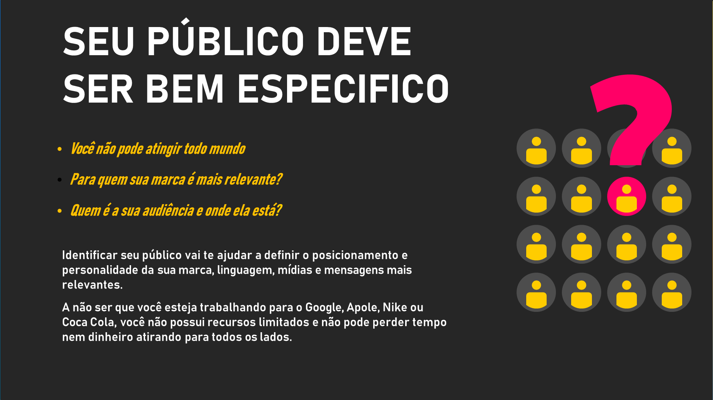
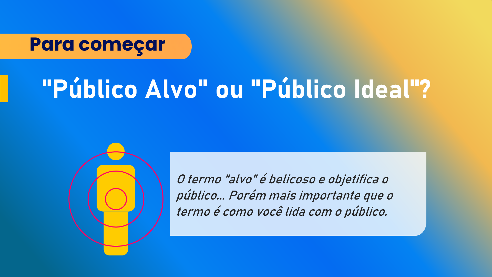
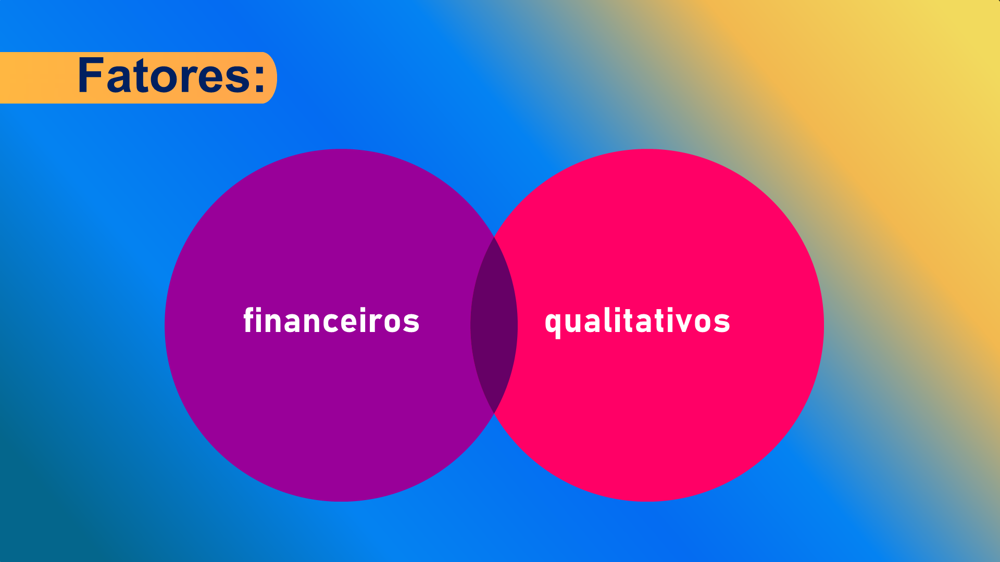
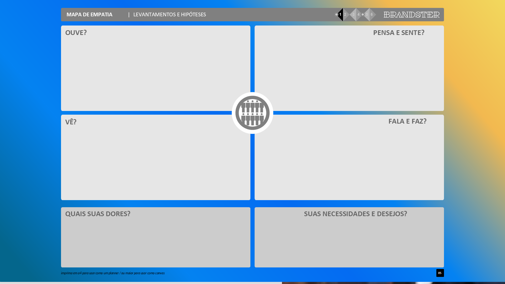
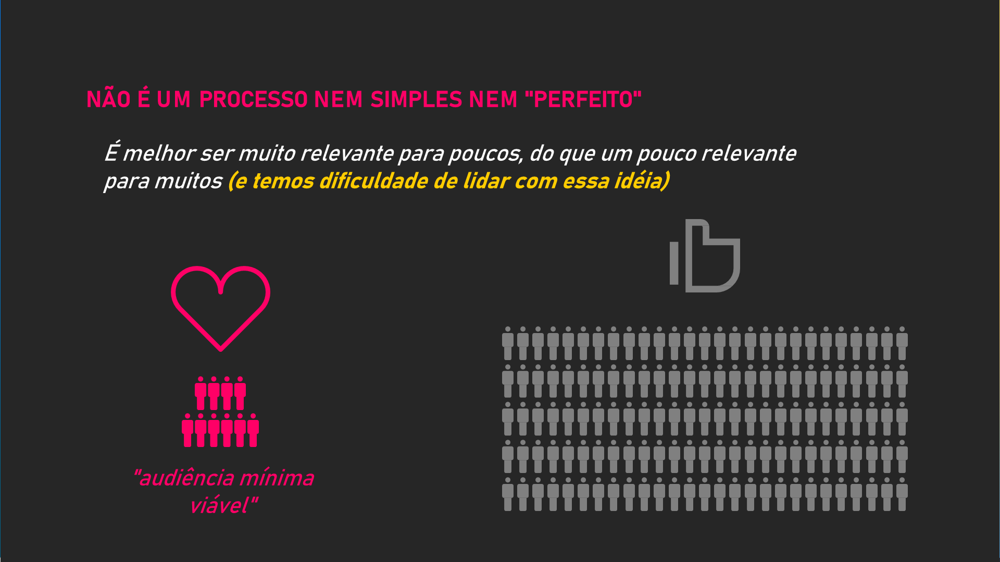

## Visão Geral {.smaller-text}

::: {.columns}
::: {.column width="50%"}
### Tópicos Principais

- [1]{.circle} Público atual vs. público ideal
- [2]{.circle} Segmentação no agro
- [3]{.circle} Mapa de empatia do comprador
- [4]{.circle} Análise 80/20 de clientes
- [5]{.circle} Construção da persona
:::

::: {.column width="50%"}
::: {.info-box}
**Objetivo da Aula**

Definir o público ideal da marca no agro, compreendendo motivações, dores e aspirações para alinhar toda a estratégia de marca a quem realmente importa.
:::
:::
:::

---

## PÚBLICO ATUAL vs. PÚBLICO IDEAL {.smaller-text}

::::: columns
::: {.column width="50%"}
### Público atual

Quem compra **hoje**:

- Pode não ser o mais rentável
- Pode não valorizar os diferenciais
- Pode limitar o crescimento da marca
:::

::: {.column width="50%"}
### Público ideal

Quem **deveria** comprar:

- Valoriza os diferenciais
- Paga prêmio por valor percebido
- Cria relacionamento duradouro
- Fortalece a marca ao recomendá-la
:::
:::::

> A marca não escolhe o produto — escolhe o **público**. O público ideal é aquele para quem seu diferencial é **mais relevante**.

---

## POR QUE DEFINIR O PÚBLICO? {.smaller-text}

{width="70%" fig-align="center"}

---

## PÚBLICO-ALVO vs. PÚBLICO IDEAL {.smaller-text}

{width="70%" fig-align="center"}

---

## SEGMENTAÇÃO NO AGRO {.smaller-text}

Critérios de segmentação relevantes para marcas agro:

| Critério | B2C (consumidor) | B2B (comprador empresarial) |
|:---------|:-----------------|:----------------------------|
| **Geográfico** | Região, clima, urbano/rural | Mercado nacional/internacional |
| **Demográfico** | Renda, escolaridade, idade | Porte, faturamento, nº funcionários |
| **Comportamental** | Frequência de compra, canal | Volume, sazonalidade, termos |
| **Psicográfico** | Valores, estilo de vida | Cultura organizacional, propósito |
| **Por benefício** | O que mais valoriza | O que resolve o problema do negócio |

---

## ANÁLISE 80/20 DE CLIENTES {.smaller-text}

Antes de definir o público ideal, analise o público **atual**:

| Pergunta | Insight |
|:---------|:--------|
| 20% dos clientes que geram 80% da **receita** — quem são? | Seus **clientes-ouro** |
| 20% dos clientes que geram 80% do **lucro** — quem são? | Seus **clientes ideais** |
| 20% dos clientes que geram 80% dos **problemas** — quem são? | Clientes que **não deveriam** ser seu público |
| 20% dos clientes que **mais recomendam** — quem são? | Seus **embaixadores de marca** |

---

## FATORES DE ANÁLISE DO PÚBLICO {.smaller-text}

{width="70%" fig-align="center"}

---

## MAPA DE EMPATIA {.smaller-text}

Ferramenta para entender o público ideal em profundidade:

| Dimensão | Perguntas |
|:---------|:----------|
| **Pensa e sente** | Quais preocupações com alimentação? O que valoriza num produtor? |
| **Vê** | Que marcas de alimento consome? Que conteúdo acompanha? |
| **Ouve** | Que influenciadores segue? O que amigos dizem sobre origem de alimentos? |
| **Fala e faz** | Onde compra? Como escolhe? O que conta sobre o que consome? |
| **Dores** | Desconfiança da origem? Dificuldade de encontrar? Preço alto? |
| **Ganhos** | Segurança alimentar? Orgulho do consumo? Experiência sensorial? |

---

## FERRAMENTA: MAPA DE EMPATIA {.smaller-text}

{width="70%" fig-align="center"}

---

## PERSONA DO COMPRADOR {.smaller-text}

A persona é a representação fictícia do público ideal:

::: {.info-box}
**Persona exemplo — B2C:**

**Marina, 38 anos, São Paulo.**
Chef de um restaurante de cozinha brasileira contemporânea. Busca ingredientes de origem controlada para criar pratos com história. Compra direto de produtores via Instagram e feiras gastronômicas. Valoriza rastreabilidade, sabor autêntico e sustentabilidade. Paga prêmio sem hesitar se o produto tem narrativa forte.

**Frase-chave:** "Não serve qualquer ingrediente — preciso saber quem plantou e como plantou."
:::

---

## PERSONA B2B {.smaller-text}

::: {.info-box}
**Persona exemplo — B2B:**

**Roberto, 52 anos, Gerente de Compras.**
Atua em rede de supermercados premium com 12 lojas em capitais do Sudeste. Busca fornecedores com certificação, regularidade de entrega e marca própria que ele possa comunicar em gôndola. Volume mínimo: 500 unidades/mês. Valoriza embalagem pronta para venda, ficha técnica e rastreabilidade.

**Frase-chave:** "Preciso de fornecedor confiável, com marca, que me dê segurança de reposição."
:::

---

## DEFININDO O PÚBLICO IDEAL {.smaller-text}

| Componente | Defina para sua marca |
|:-----------|:---------------------|
| **Quem é?** | Perfil demográfico/empresarial |
| **O que valoriza?** | Benefícios que mais importam |
| **Onde está?** | Canais de compra e informação |
| **Quando compra?** | Frequência e sazonalidade |
| **Por que compraria de mim?** | Diferencial mais relevante para ele |
| **Quanto pagaria?** | Faixa de preço aceitável |
| **Como decide?** | Critérios de decisão de compra |

---

## MELHOR SER RELEVANTE PARA POUCOS {.smaller-text}

{width="70%" fig-align="center"}

---

## EXERCÍCIO EM SALA {.smaller-text}

::: {.info-box}
### Atividade: Construção de Persona

1. Faça a análise 80/20 dos clientes (atuais ou hipotéticos)
2. Construa o **Mapa de Empatia** do público ideal
3. Escreva a **persona** completa (nome, idade, perfil, frase-chave)
4. Responda: "O que meu diferencial resolve para essa pessoa?"

Tempo: 25 minutos. Apresentação: 3 min/grupo.
:::

---

## REFERÊNCIAS {.smaller-text}

- KELLER, K. L. *Strategic Brand Management*. 4ª ed. Pearson, 2013.
- KOTLER, P.; KARTAJAYA, H.; SETIAWAN, I. *Marketing 4.0*. Wiley, 2017.
- OSTERWALDER, A.; PIGNEUR, Y. *Business Model Generation*. Alta Books, 2010.
