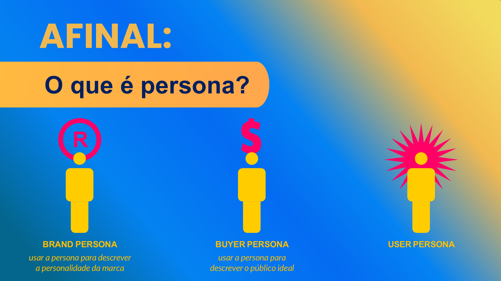
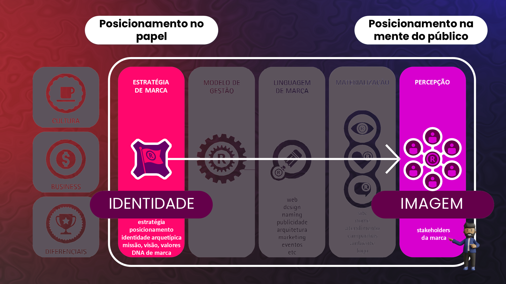
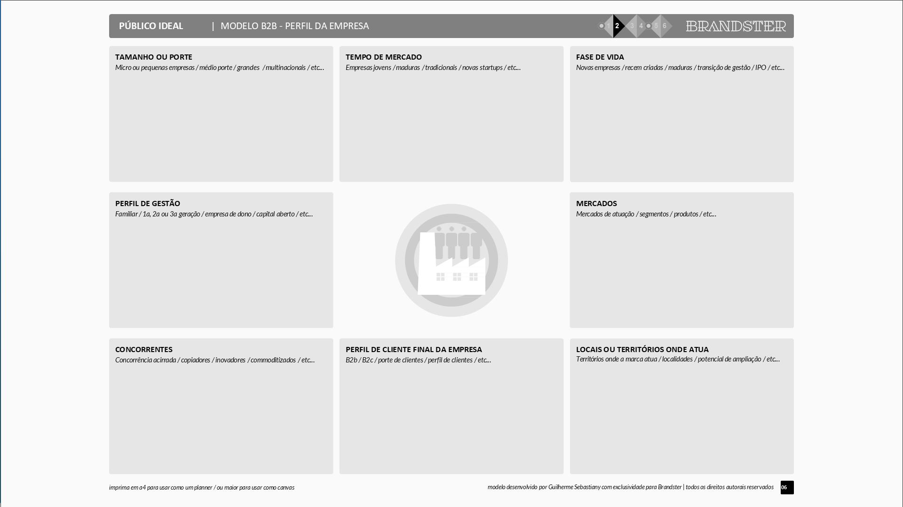

## Visão Geral {.smaller-text}

::: {.columns}
::: {.column width="50%"}
### Tópicos Principais

- [1]{.circle} O agro é fundamentalmente B2B
- [2]{.circle} Diferenças entre marca B2B e B2C
- [3]{.circle} O comprador B2B não é racional
- [4]{.circle} Ferramentas de marca B2B
- [5]{.circle} Ingrediente branding
:::

::: {.column width="50%"}
::: {.info-box}
**Objetivo da Aula**

Compreender as particularidades do branding B2B no agronegócio e aprender a construir marcas que geram valor entre empresas ao longo da cadeia.
:::
:::
:::

---

## O AGRO É B2B {.smaller-text}

A cadeia do agro é predominantemente B2B:

```
Produtor →(B2B)→ Cooperativa →(B2B)→ Indústria →(B2B)→ Varejo →(B2C)→ Consumidor
```

Na maioria dos elos, **não há marca do produtor**. O valor é capturado pelos últimos elos, que constroem marca sobre o produto genérico dos elos anteriores.

::: {.callout-important}
Se sua marca existe apenas no último elo (B2C), todo o valor gerado no campo fica com outros.
:::

---

## TIPOS DE PERSONA {.smaller-text}

{width="70%" fig-align="center"}

---

## B2B vs. B2C NO AGRO {.smaller-text}

| Aspecto | B2C | B2B no Agro |
|:--------|:----|:------------|
| Decisor | Indivíduo/família | Comitê/equipe técnica |
| Ciclo de decisão | Rápido (minutos/horas) | Longo (semanas/meses) |
| Base da decisão | Emocional + racional | Racional + emocional |
| Volume por transação | Pequeno | Grande |
| Relacionamento | Transacional | Contratual e recorrente |
| Risco percebido | Baixo | Alto (afeta o negócio do comprador) |
| Canal de comunicação | Redes sociais, PDV | Feiras, visitas, propostas técnicas |

---

## O COMPRADOR B2B TAMBÉM É EMOCIONAL {.smaller-text}

O mito da racionalidade pura no B2B é falso. O comprador B2B:

- Tem **medo de errar** (risco pessoal e profissional)
- Busca **confiança** antes de especificação técnica
- Valoriza **relacionamento** e previsibilidade
- Prefere fornecedores com **reputação** conhecida
- É influenciado por **recomendações pessoais**

> "Ninguém foi demitido por comprar IBM." — O mesmo vale no agro B2B: marcas confiáveis reduzem o **risco percebido** do decisor.

---

## STAKEHOLDERS DA MARCA B2B {.smaller-text}

{width="70%" fig-align="center"}

---

## INGREDIENTE BRANDING {.smaller-text}

Estratégia onde o produtor mantém sua marca **dentro** do produto do comprador:

| Exemplo clássico | Exemplo no agro |
|:-----------------|:----------------|
| Intel Inside (processador dentro do PC) | "Café da Fazenda Nascentes" no blend do torrefador |
| Gore-Tex (tecido dentro da jaqueta) | "Cacau São Félix" no chocolate artesanal |
| Tetrapak (embalagem do leite) | "Algodão Certificado XYZ" na etiqueta da camiseta |

O ingrediente branding permite ao produtor **manter visibilidade** mesmo vendendo B2B.

---

## MODELO DE PÚBLICO IDEAL B2B {.smaller-text}

{width="70%" fig-align="center"}

---

## FERRAMENTAS DE MARCA B2B {.smaller-text}

| Ferramenta | Como usar no agro B2B |
|:-----------|:---------------------|
| **Ficha técnica branda** | Além dos dados, comunique identidade e diferenciais |
| **Apresentação comercial** | Com narrativa de marca, não só especificações |
| **Amostras com identidade** | Embalagem profissional, rótulo com marca |
| **Visita técnica** | Transforme a visita do comprador em experiência de marca |
| **Certificações** | Reduza o risco do comprador com selos reconhecidos |
| **Relatórios periódicos** | Compartilhe dados de qualidade, sustentabilidade |
| **Presença em feiras** | Stand com identidade de marca consistente |

---

## CONSTRUINDO REPUTAÇÃO B2B {.smaller-text}

No B2B, a reputação é construída por:

1. **Consistência de entrega** — Cumprir o combinado toda vez
2. **Qualidade documentada** — Laudos, certificações, rastreabilidade
3. **Transparência proativa** — Comunicar problemas antes que o cliente descubra
4. **Relacionamento pessoal** — O comprador confia na **pessoa**, depois na empresa
5. **Presença institucional** — Participar de eventos, associações e comitês do setor

---

## EXERCÍCIO EM SALA {.smaller-text}

::: {.info-box}
### Atividade: Estratégia B2B

Para uma marca agro B2B (real ou fictícia):

1. Identifique os **3 compradores B2B** mais importantes (ou desejados)
2. Para cada um, responda: "O que reduz o risco percebido e gera confiança?"
3. Proponha uma estratégia de **ingrediente branding** (como manter a marca do produtor no produto final)
4. Monte uma **ficha técnica branda** — com dados técnicos + narrativa de marca

Tempo: 25 minutos.
:::

---

## REFERÊNCIAS {.smaller-text}

- KELLER, K. L. *Strategic Brand Management*. 4ª ed. Pearson, 2013.
- AAKER, D. A. *Aaker on Branding*. Morgan James, 2014.
- COUGHLAN, A. T. *Canais de Marketing*. 7ª ed. Pearson, 2012.
- KOTLER, P.; KARTAJAYA, H.; SETIAWAN, I. *Marketing 4.0*. Wiley, 2017.
