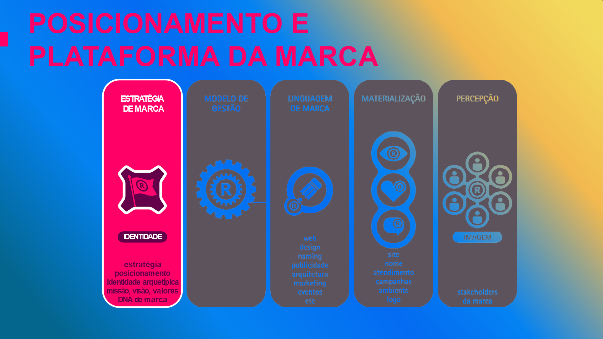
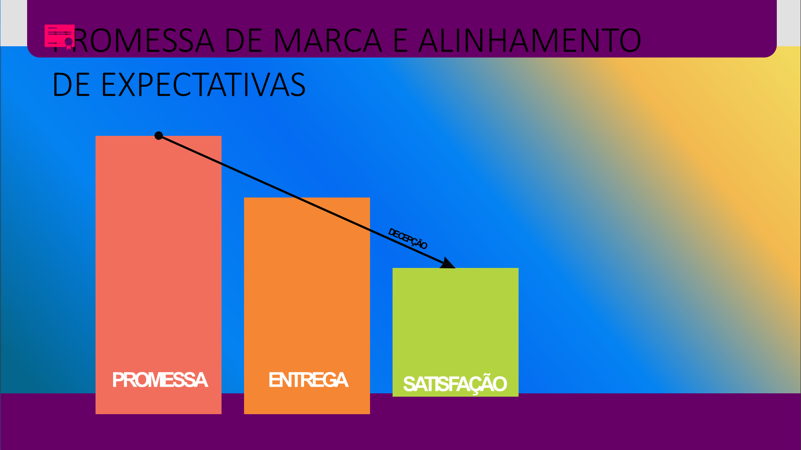
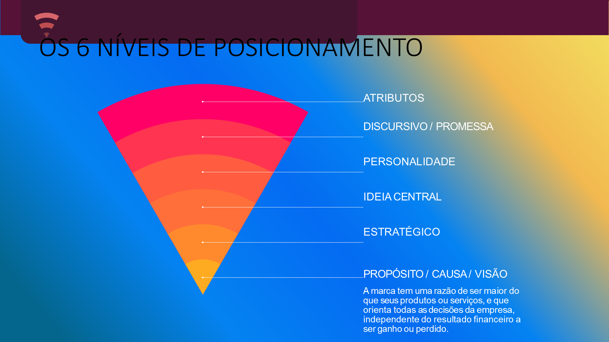
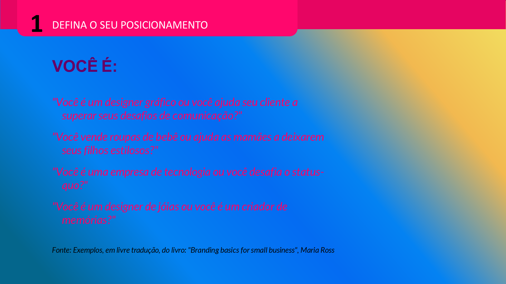
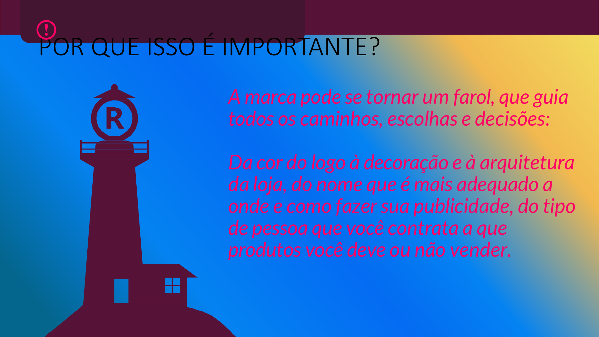

## Visão Geral {.smaller-text}

::: {.columns}
::: {.column width="50%"}
### Tópicos Principais

- [1]{.circle} O que é posicionamento
- [2]{.circle} Os 4 pilares do posicionamento
- [3]{.circle} Declaração de posicionamento
- [4]{.circle} Mapa de posicionamento perceptual
- [5]{.circle} Mensagens-chave derivadas
:::

::: {.column width="50%"}
::: {.info-box}
**Objetivo da Aula**

Sintetizar toda a análise anterior (diferenciação, benefícios, público) em uma posição de mercado clara, diferenciada e defensável.
:::
:::
:::

---

## O QUE É POSICIONAMENTO {.smaller-text}

Posicionamento é a **síntese estratégica** de:

- O que vendemos (produtos e portfólio)
- O que nos diferencia (ideias diferenciadoras e suporte)
- O que entregamos de valor (benefícios)
- Para quem vendemos (público ideal)

> **Posicionamento** é o lugar que a marca ocupa na **mente do público** — não o que a empresa declara, mas o que o público de fato **percebe e associa**.

---

## MODELO DE POSICIONAMENTO {.smaller-text}

{width="70%" fig-align="center"}

---

## OS 4 PILARES {.smaller-text}

| Pilar | Pergunta-chave | O que define |
|:------|:---------------|:-------------|
| **Demanda** | "Por que se interessar por mim?" | Diferenciais e benefícios |
| **Credibilidade** | "Por que confiar no que digo?" | Pontos de prova e evidências |
| **Afinidade** | "O que cria conexão?" | Personalidade, propósito, valores |
| **Promessa** | "O que esperar?" | Proposta de valor única (PUV) |

Um posicionamento forte pontua nos **quatro pilares** simultaneamente.

---

## PROMESSA E ENTREGA {.smaller-text}

{width="70%" fig-align="center"}

---

## DECLARAÇÃO DE POSICIONAMENTO {.smaller-text}

Fórmula universal:

> **Para** [público ideal], \
> **a** [marca] **é** [categoria] \
> **que** [promessa diferenciada], \
> **porque** [razão para acreditar].

**Exemplo no agro:**

> Para chefs e restaurantes B2B que valorizam ingredientes rastreáveis, \
> a **Fazenda Nascentes** é a produtora de café especial do Cerrado \
> que entrega lotes com perfil sensorial documentado, \
> porque cultiva exclusivamente em agrofloresta acima de 1.100m e rastreia cada lote da muda à xícara.

---

## OS 6 NÍVEIS DO POSICIONAMENTO {.smaller-text}

{width="70%" fig-align="center"}

---

## ENQUADRAMENTO DA MARCA {.smaller-text}

{width="70%" fig-align="center"}

---

## MAPA DE POSICIONAMENTO PERCEPTUAL {.smaller-text}

Posicione sua marca em relação aos concorrentes usando dois eixos relevantes:

```
                  Sustentável
                      ↑
                      |
    Sustentável  ●   |    ● Minha marca
    Acessível   ●    |         (Premium
                     |         Sustentável)
    ─────────────────+──────────────────→
    Commodity        |              Especial
                     |
       ● Trading     |    ● Concorrente B
         genérica    |      (Especial
                     ↓      Convencional)
                  Convencional
```

O mapa revela onde há **espaço**, onde há **competição** e onde **você está**.

---

## MENSAGENS-CHAVE {.smaller-text}

Com o posicionamento definido, derive as mensagens por contexto:

| Contexto | Mensagem |
|:---------|:---------|
| **Pitch** (1 frase) | "Café de floresta: da muda à xícara, rastreabilidade total" |
| **Comprador B2B** | "Lotes personalizados com laudo sensorial de cada colheita" |
| **Consumidor B2C** | "O café que nasce sob sombra de árvores centenárias" |
| **Investidor/Parceiro** | "Agroflorestal com margem 2x superior à monocultura" |
| **Redes sociais** | "Do solo à xícara — conheça cada etapa do seu café" |

Cada mensagem é uma **adaptação** do posicionamento ao contexto — não uma reinvenção.

---

## ERROS COMUNS DE POSICIONAMENTO {.smaller-text}

| Erro | O que acontece |
|:-----|:---------------|
| **Genérico** | "Nosso café é de qualidade" — todos dizem |
| **Aspiracional sem entrega** | Promete sem provar |
| **Instável** | Muda a cada safra ou campanha |
| **Copiado** | Replica o posicionamento do concorrente |
| **Irrelevante** | Posiciona-se em atributo que o público não valoriza |

---

## QUEM QUER SER TUDO PARA TODOS {.smaller-text}

{width="70%" fig-align="center"}

---

## ESQUIZOFRENIA DE MARCA {.smaller-text}

{width="70%" fig-align="center"}

---

## O POSICIONAMENTO COMO FILTRO {.smaller-text}

Uma vez definido, o posicionamento funciona como **filtro decisório**:

| Decisão | Pergunta |
|:--------|:---------|
| Devo lançar este produto? | Está alinhado com o posicionamento? |
| Devo participar desta feira? | O público da feira é o meu público? |
| Devo aceitar este cliente? | Ele valoriza o que a marca propõe? |
| Como responder nas redes? | Como a personalidade da marca responderia? |
| Devo baixar o preço? | Isso compromete o posicionamento? |

---

## A MARCA COMO FAROL {.smaller-text}

{width="70%" fig-align="center"}

---

## EXERCÍCIO EM SALA {.smaller-text}

::: {.info-box}
### Atividade: Canvas de Posicionamento

1. Escreva a **declaração de posicionamento** (fórmula Para/É/Que/Porque)
2. Desenhe o **mapa perceptual** (escolha 2 eixos relevantes para seu mercado e posicione 4-5 marcas)
3. Derive **5 mensagens-chave** (uma por contexto: pitch, B2B, B2C, parceiro, redes)
4. Aplique o **teste de validação**:
   - É diferente? É relevante? É verdadeiro? É simples? É sustentável?

Tempo: 25 minutos.
:::

---

## REFERÊNCIAS {.smaller-text}

- RIES, A.; TROUT, J. *Posicionamento: A Batalha por Sua Mente*. M.Books, 2001.
- KELLER, K. L. *Strategic Brand Management*. 4ª ed. Pearson, 2013.
- AAKER, D. A. *Aaker on Branding*. Morgan James, 2014.
- TROUT, J.; RIVKIN, S. *Diferenciar ou Morrer*. Futura, 2000.
