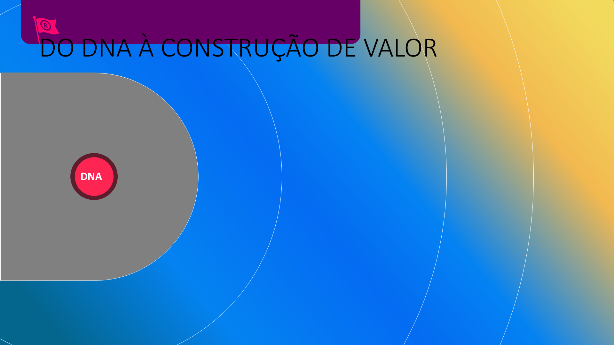
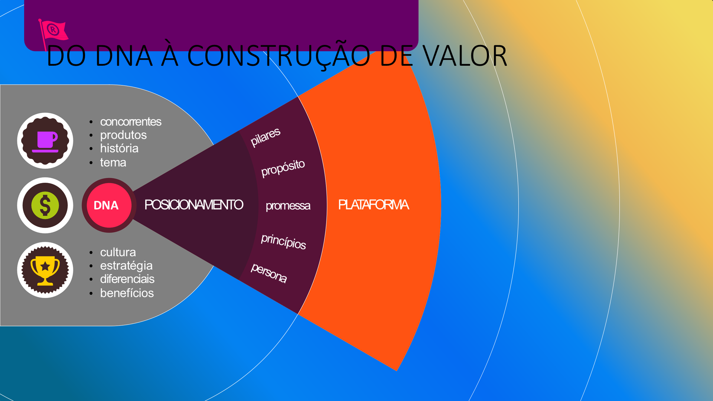
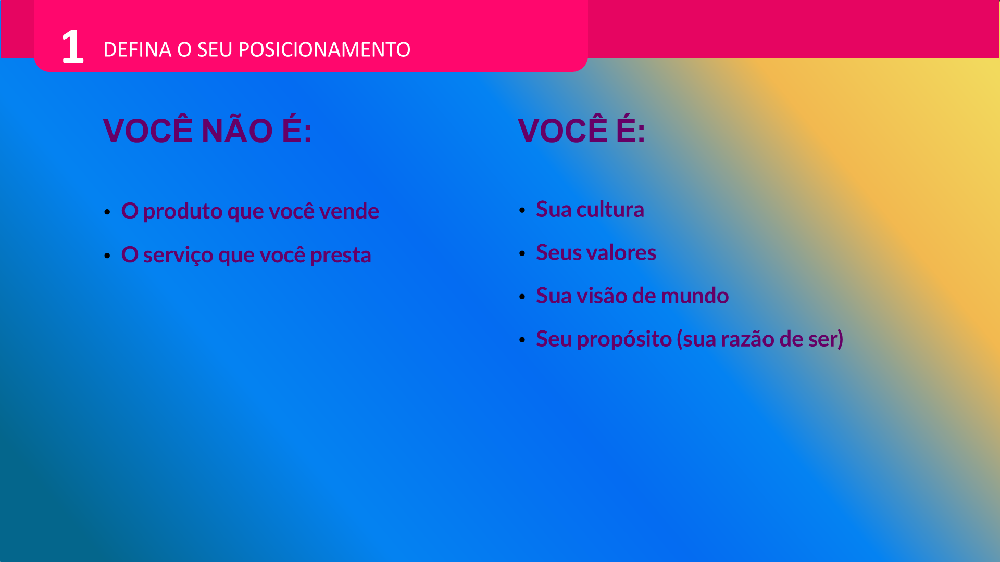
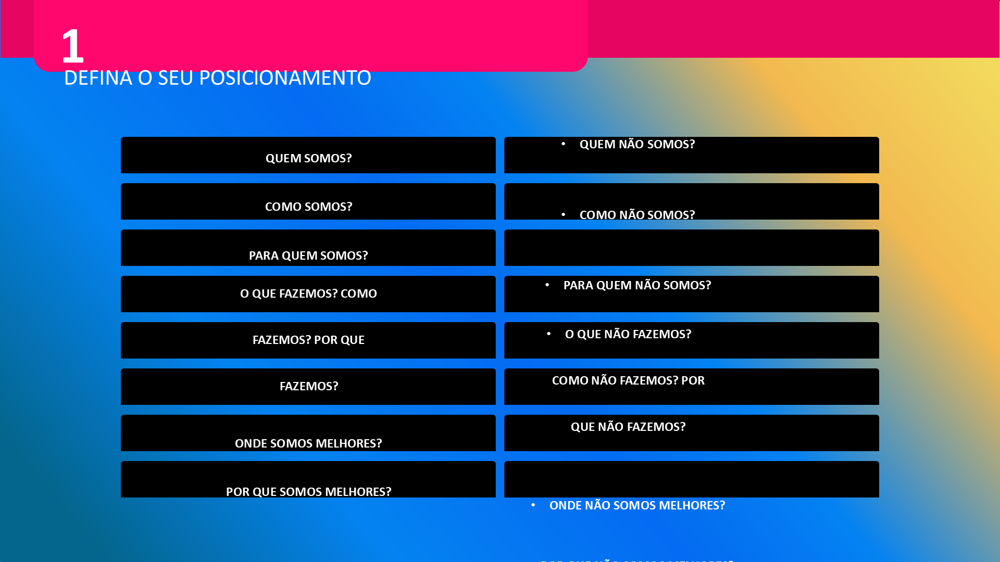

## Visão Geral {.smaller-text}

::: {.columns}
::: {.column width="50%"}
### Tópicos Principais

- [1]{.circle} O que é a plataforma de marca
- [2]{.circle} Propósito, visão e valores
- [3]{.circle} Personalidade e personificação
- [4]{.circle} Tom de voz e narrativa
- [5]{.circle} Multissensorialidade e atributos
:::

::: {.column width="50%"}
::: {.info-box}
**Objetivo da Aula**

Construir a plataforma completa de marca — o documento-guia que consolida identidade, personalidade e expressão para orientar todas as decisões da marca.
:::
:::
:::

---

## PLATAFORMA DE MARCA {.smaller-text}

A plataforma é o **DNA documentado** da marca. Organiza tudo em camadas:

```
┌─────────────────────────────────┐
│    EXPERIÊNCIA (Superfície)     │  Pontos de contato, visual, comunicação
├─────────────────────────────────┤
│    EXPRESSÃO                    │  Personalidade, tom de voz, narrativa
├─────────────────────────────────┤
│    POSICIONAMENTO               │  PUV, diferenciais, público
├─────────────────────────────────┤
│    NÚCLEO (Essência)            │  Propósito, visão, valores
└─────────────────────────────────┘
```

Do núcleo à superfície — cada camada deriva da anterior.

---

## DO DNA À CONSTRUÇÃO DE VALOR {.smaller-text}

{width="70%" fig-align="center"}

---

## PROPÓSITO — "POR QUE EXISTIMOS?" {.smaller-text}

O propósito é a razão de existir **além do lucro**.

**Fórmula:** Existimos para **[verbo]** + **[para quem]** + **[de que forma]**.

| Marca (fictícia) | Propósito |
|:------------------|:----------|
| Cooperativa Serra Verde | "Conectar produtores de montanha ao mercado que valoriza terroir" |
| Fazenda Raízes | "Provar que pecuária regenerativa gera alimento e restaura ecossistemas" |
| AgroTech Sementes | "Democratizar genética de alta performance para agricultores familiares" |

::: {.callout-tip}
**Teste:** Se trocar o nome da marca e o propósito ainda servir, ele é genérico demais.
:::

---

## CULTURA, ESTRATÉGIA E PLATAFORMA {.smaller-text}

{width="70%" fig-align="center"}

---

## VISÃO E VALORES {.smaller-text}

**Visão** — O futuro desejado (aspiracional mas plausível)

> "Que todo produtor de café especial do Cerrado seja reconhecido e remunerado pela singularidade do seu terroir."

**Valores** — Princípios inegociáveis (3-5):

| Valor fraco ❌ | Valor forte ✅ |
|:--------------|:--------------|
| "Qualidade" | "Rastreabilidade radical" |
| "Honestidade" | "Transparência proativa" |
| "Inovação" | "Experimentação de campo" |
| "Sustentabilidade" | "Regeneração mensurável" |

> **Teste de valor:** Se o valor nunca gera dilema ou sacrifício, é genérico.

---

## CULTURA, VALORES E PROPÓSITO {.smaller-text}

{width="70%" fig-align="center"}

---

## PERSONALIDADE — "SE A MARCA FOSSE UMA PESSOA?" {.smaller-text}

Exercício de personificação:

| Pergunta | Responda para sua marca |
|:---------|:----------------------|
| Que idade teria? | |
| Como se vestiria? | |
| Que tipo de música ouviria? | |
| Como receberia alguém em casa? | |
| Que assunto dominaria em uma conversa? | |
| O que a irritaria profundamente? | |
| Qual seria seu lema de vida? | |

As respostas revelam a personalidade e guiam o tom de toda a comunicação.

---

## TOM DE VOZ {.smaller-text}

O tom de voz traduz a personalidade em linguagem:

| Dimensão | ← Polo A | Polo B → |
|:---------|:---------|:---------|
| **Formalidade** | Formal, institucional | Informal, próxima |
| **Humor** | Sério, sóbrio | Leve, bem-humorado |
| **Entusiasmo** | Contido, discreto | Vibrante, empolgado |
| **Linguagem** | Técnica, precisa | Simples, acessível |
| **Posição** | Autoridade que ensina | Parceiro que caminha junto |

Para cada dimensão, marque onde sua marca se posiciona. Isso cria um **guia prático** para qualquer pessoa que escreva em nome da marca.

---

## NARRATIVA — "QUAL É A HISTÓRIA?" {.smaller-text}

Toda marca forte conta uma história. Estrutura:

1. **Origem** — De onde viemos
2. **Desafio** — Qual problema enxergamos
3. **Escolha** — O que decidimos fazer diferente
4. **Método** — O "jeito" da marca
5. **Impacto** — O que mudou por causa do nosso trabalho

> "A Serra Verde nasceu quando 12 famílias perceberam que seus cafés especiais eram vendidos como genéricos. Decidiram se unir, processar localmente e vender com identidade. Hoje, cada lote carrega o nome da família que o cultivou."

---

## QUEM NÃO SOMOS {.smaller-text}

{width="70%" fig-align="center"}

---

## MULTISSENSORIALIDADE {.smaller-text}

Marcas fortes ativam múltiplos sentidos. No agro, é vantagem natural:

| Sentido | Pergunta | Exemplo |
|:--------|:---------|:--------|
| **Visão** | Cores e paisagens da marca? | Verde escuro do cafezal sombreado |
| **Olfato** | Aromas associados? | Café recém-torrado |
| **Tato** | Texturas que comunicam a marca? | Rugosidade do saco de juta |
| **Paladar** | Sabor que define a experiência? | Acidez frutada |
| **Audição** | Sons que representam? | Canto dos pássaros na agrofloresta |

---

## ATRIBUTOS DA MARCA {.smaller-text}

Posicione sua marca em cada espectro:

| Atributo | ← | → |
|:---------|:-:|:-:|
| Feminina | ◻◻◻◻◻ | Masculina |
| Inovadora | ◻◻◻◻◻ | Conservadora |
| Sofisticada | ◻◻◻◻◻ | Popular |
| Dinâmica | ◻◻◻◻◻ | Tranquila |
| Jovem | ◻◻◻◻◻ | Madura |
| Descontraída | ◻◻◻◻◻ | Séria |
| Informal | ◻◻◻◻◻ | Formal |
| Diferente | ◻◻◻◻◻ | Comum |

O perfil resultante é a "impressão digital" da personalidade.

---

## CANVAS COMPLETO {.smaller-text}

::: {.info-box}
### Canvas da Plataforma de Marca Agro

| Componente | Conteúdo |
|:-----------|:---------|
| **Propósito** | *Por que existimos?* |
| **Visão** | *Que futuro queremos?* |
| **Valores** | *Em que acreditamos? (3-5)* |
| **Público ideal** | *Para quem existimos?* |
| **Posicionamento** | *Para / é / que / porque* |
| **Personalidade** | *3-5 traços humanos* |
| **Tom de voz** | *Como fala? Como NÃO fala?* |
| **Narrativa** | *Origem → Desafio → Escolha → Método → Impacto* |
:::

---

## EXERCÍCIO EM SALA {.smaller-text}

::: {.info-box}
### Atividade: Construção da Plataforma

Preencha o Canvas completo para a marca trabalhada ao longo da disciplina:

1. Defina **propósito, visão e 3-5 valores**
2. Faça o exercício de **personificação**
3. Defina o **tom de voz** em cada dimensão
4. Escreva a **narrativa** em 5 frases (Origem → Impacto)
5. Preencha o **mapa sensorial**
6. Marque os **atributos** no espectro

**Este exercício é parte do trabalho final da disciplina.**

Tempo: 30 minutos.
:::

---

## REFERÊNCIAS {.smaller-text}

- AAKER, D. A. *Aaker on Branding*. Morgan James, 2014.
- WHEELER, A. *Designing Brand Identity*. 5ª ed. Wiley, 2018.
- MARK, M.; PEARSON, C. S. *O Herói e o Fora da Lei*. Cultrix, 2001.
- HOLT, D. *How Brands Become Icons*. Harvard Business Review Press, 2004.