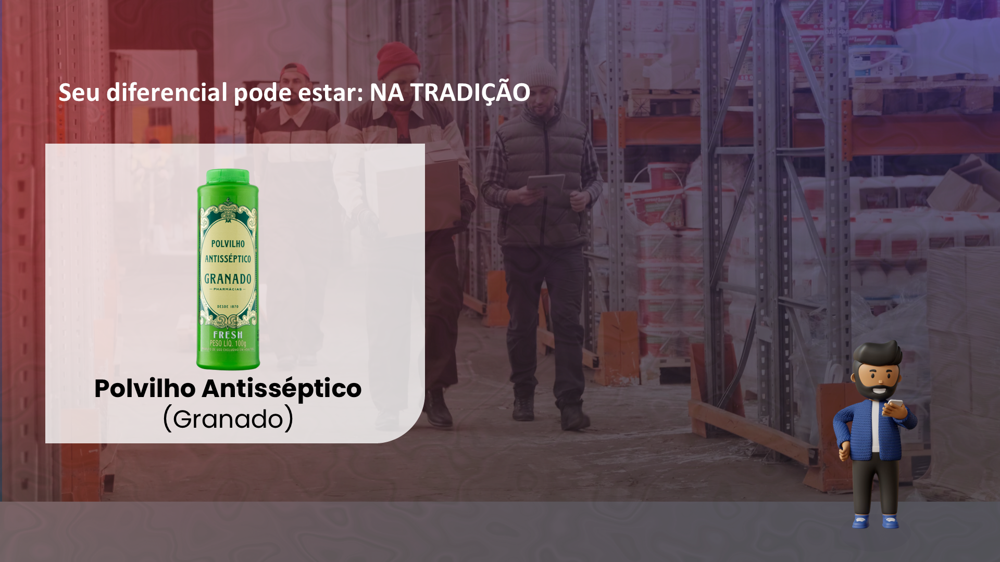
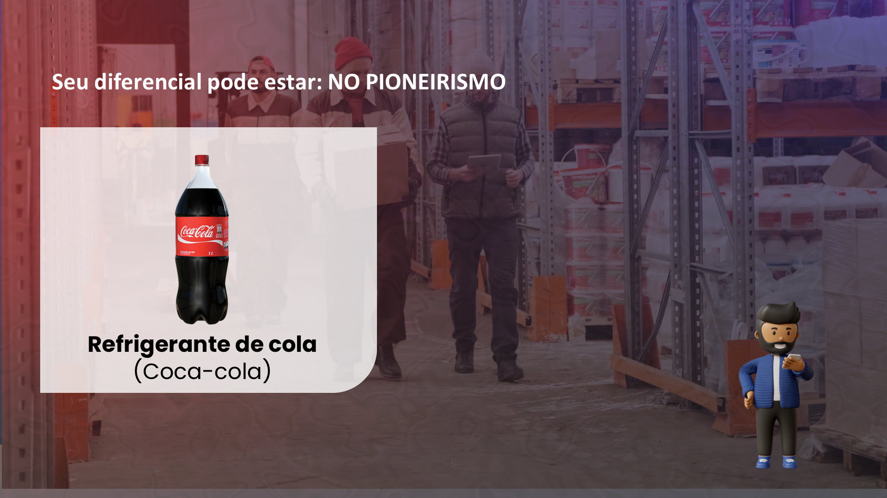
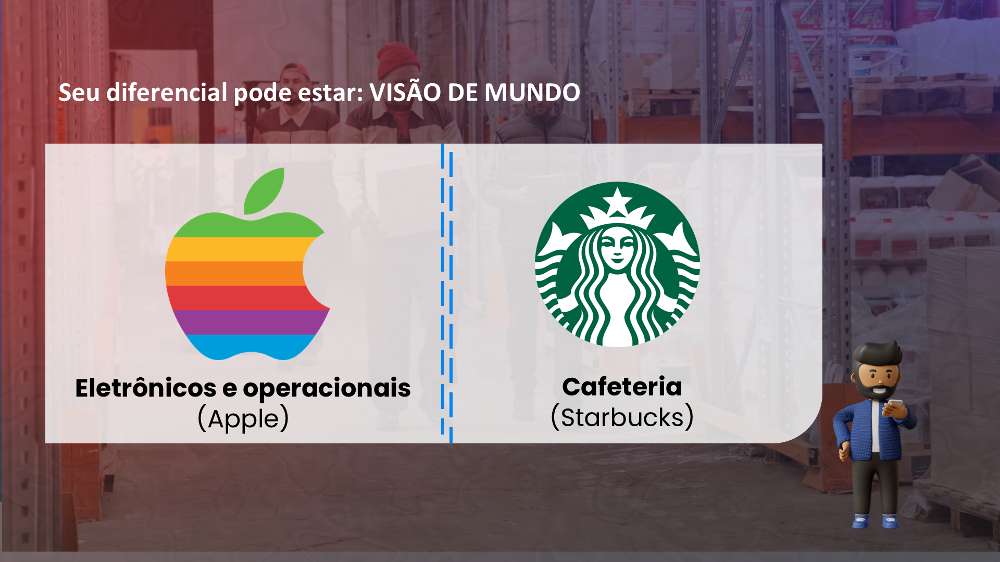
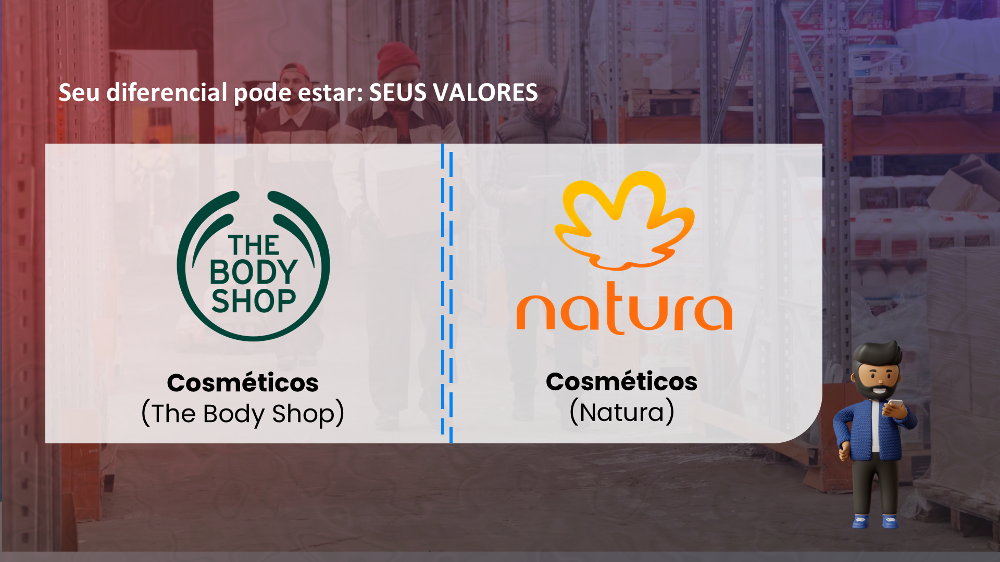
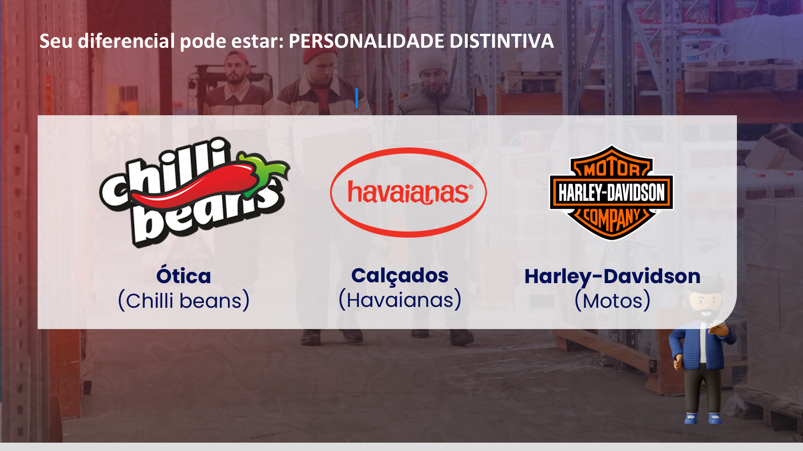

## Visão Geral {.smaller-text}

::: {.columns}
::: {.column width="50%"}
### Tópicos Principais

- [1]{.circle} Case 1 — Café de terroir
- [2]{.circle} Case 2 — Cooperativa de mel
- [3]{.circle} Case 3 — Pecuária regenerativa
- [4]{.circle} Padrões de sucesso
- [5]{.circle} Autoavaliação final
:::

::: {.column width="50%"}
::: {.info-box}
**Objetivo da Aula**

Analisar cases de branding no agro à luz dos conceitos estudados ao longo da disciplina e realizar a autoavaliação do estágio de maturidade de marca.
:::
:::
:::

---

## CASE 1 — CAFÉ DE TERROIR {.smaller-text}

**Contexto:** Cafeicultores do Cerrado com café de qualidade vendido como commodity.

**Antes:**

- Sem diferenciação — "café bonito, tipo 2/3"
- Sem público definido — "quem aparecesse"
- Sem narrativa — granel puro

**Estratégia aplicada:**

- **Diferenciação** por terroir: altitude, microclima, agrofloresta
- **Público ideal**: torrefadores de especiais, importadores nórdicos/japoneses
- **Posicionamento**: "Lotes com perfil sensorial documentado, da muda à xícara"
- **Suporte**: certificação SCA, rastreabilidade, laudo sensorial

---

## CASE 1 — RESULTADOS {.smaller-text}

| Indicador | Antes | Depois |
|:----------|:------|:-------|
| Preço/saca | R$ 1.200 (commodity) | R$ 2.000 (+67%) |
| Mercado | Trader local | Torrefadores nacionais + exportação |
| Reconhecimento | Nenhum | Prêmios em concursos como marca |
| Receita extra | Nenhuma | Turismo rural de experiência sensorial |

> **Lição:** A qualidade já existia. O branding **tornou a qualidade visível e valorizada**.

---

## EXEMPLO: TRADIÇÃO COMO DIFERENCIAL {.smaller-text}

{width="70%" fig-align="center"}

---

## CASE 2 — COOPERATIVA DE MEL {.smaller-text}

**Contexto:** 80 famílias apicultoras no semiárido. Mel excelente vendido em baldes de 25 kg para intermediários.

**Problema:**

- Produtor: R$ 14/kg
- Intermediário revendia: R$ 55/kg com marca própria
- Sem identidade, sem embalagem, sem presença digital

**Estratégia aplicada:**

- **Portfólio**: 5 perfis de mel monofloral (não mais "mel genérico")
- **Suporte**: QR code, certificação orgânica, história da família
- **Benefícios**: Funcional (puro), experiencial (história), social (80 famílias), autoexpressão (consumo consciente)

---

## CASE 2 — RESULTADOS {.smaller-text}

| Indicador | Antes | Depois |
|:----------|:------|:-------|
| Preço/kg | R$ 14 (granel) | R$ 52 (fracionado, com marca) |
| Mercado | Intermediário local | Nacional + exportação (Portugal, Alemanha) |
| Canais | Venda direta a granel | E-commerce, delicatessens, feiras |
| Extras | Nenhum | Turismo apícola |

> **Lição:** O produto commodity se transformou em portfólio de marcas. Não mudaram o mel — **mudaram a percepção do mel**.

---

## CASE 3 — PECUÁRIA REGENERATIVA {.smaller-text}

**Contexto:** Fazenda de gado no MS, transição para pecuária regenerativa (ILPF, bem-estar animal).

**Problema:** Custos maiores, mesma remuneração por arroba.

**Estratégia aplicada:**

- **Diferenciação por método**: pastejo rotacionado, ILPF, protocolos de bem-estar
- **Branding B2B**: frigoríficos com programa sustentável, food service ESG
- **Narrativa baseada em dados**: relatório de carbono, biodiversidade, qualidade do solo

**Resultado:** Contrato garantido com prêmio de 25% sobre arroba + crédito de carbono + convites para palestras.

> **Lição:** No B2B agro, a marca se sustenta em **dados, método e confiança no processo**.

---

## EXEMPLO: PIONEIRISMO {.smaller-text}

{width="70%" fig-align="center"}

---

## EXEMPLO: VISÃO DE MUNDO {.smaller-text}

{width="70%" fig-align="center"}

---

## EXEMPLO: VALORES {.smaller-text}

{width="70%" fig-align="center"}

---

## PADRÕES DE SUCESSO {.smaller-text}

Analisando os cases, 5 padrões emergem:

| # | Padrão | Descrição |
|:-:|:-------|:----------|
| 1 | **Qualidade é necessária, não suficiente** | Todos tinham produto superior — mas sem marca, era invisível |
| 2 | **Diferenciação autêntica** | Diferenciais reais (terroir, método, história), não inventados |
| 3 | **Narrativa multiplica valor** | A história coerente gerou conexão e justificou prêmio |
| 4 | **Posicionamento gera foco** | Saber para quem vender reduziu desperdício |
| 5 | **Plataforma garante consistência** | Documento de marca orientou decisões |

---

## EXEMPLO: PERSONALIDADE DE MARCA {.smaller-text}

{width="70%" fig-align="center"}

---

## AUTOAVALIAÇÃO FINAL {.smaller-text}

::: {.info-box}
### Checklist de Maturidade de Marca

| # | Pergunta | ✅ |
|:-:|:---------|:--:|
| 1 | Meu produto é superior à média? | |
| 2 | Tenho dados/certificações que provam? | |
| 3 | Nomeio 3 diferenciais reais? | |
| 4 | São difíceis de copiar? | |
| 5 | Tenho história de marca documentada? | |
| 6 | Sei exatamente para quem vendo? | |
| 7 | Resumo a marca em 1 frase de posicionamento? | |
| 8 | Tenho propósito, valores e personalidade documentados? | |
| 9 | Toda comunicação segue um tom de voz? | |
| 10 | Minha marca é coerente em todos os pontos de contato? | |

**0-3:** Estágio inicial | **4-6:** Intermediário | **7-8:** Avançado | **9-10:** Marca madura
:::

---

## ENCERRAMENTO DA DISCIPLINA {.smaller-text}

O agro brasileiro tem **tudo** o que precisa para construir marcas extraordinárias:

- Produtos de qualidade mundial
- Processos diferenciados
- Histórias riquíssimas
- Terroir único
- Pessoas apaixonadas

O que falta é a **consciência de que isso é branding** — e a **disciplina** de organizar esses ativos em estratégia.

> O agro já alimenta o mundo. Está na hora de ser **reconhecido** por isso.

---

## TRABALHO FINAL {.smaller-text}

::: {.info-box}
### Entrega Final: Plataforma de Marca Completa

**Documento contendo:**

1. Análise de diferenciação (3 diferenciais + suporte)
2. Mapeamento de benefícios (5 níveis)
3. Público ideal (persona completa)
4. Declaração de posicionamento
5. Plataforma de marca (canvas completo: propósito, visão, valores, personalidade, tom de voz, narrativa, mapa sensorial)
6. 5 mensagens-chave por contexto
7. Autoavaliação do estágio de maturidade

**Formato:** Documento + apresentação oral de 10 min.
**Data:** Conforme cronograma da disciplina.
:::

---

## REFERÊNCIAS GERAIS DA DISCIPLINA {.smaller-text}

- AAKER, D. A. *Aaker on Branding*. Morgan James, 2014.
- KELLER, K. L. *Strategic Brand Management*. 4ª ed. Pearson, 2013.
- RIES, A.; TROUT, J. *Posicionamento*. M.Books, 2001.
- TROUT, J.; RIVKIN, S. *Diferenciar ou Morrer*. Futura, 2000.
- NEUMEIER, M. *The Brand Gap*. New Riders, 2006.
- KAPFERER, J.-N. *The New Strategic Brand Management*. Kogan Page, 2008.
- KOTLER, P. et al. *Marketing 4.0*. Wiley, 2017.
- WHEELER, A. *Designing Brand Identity*. 5ª ed. Wiley, 2018.
- HOLT, D. *How Brands Become Icons*. Harvard, 2004.
- KIM, W. C.; MAUBORGNE, R. *Estratégia do Oceano Azul*. Campus, 2005.
