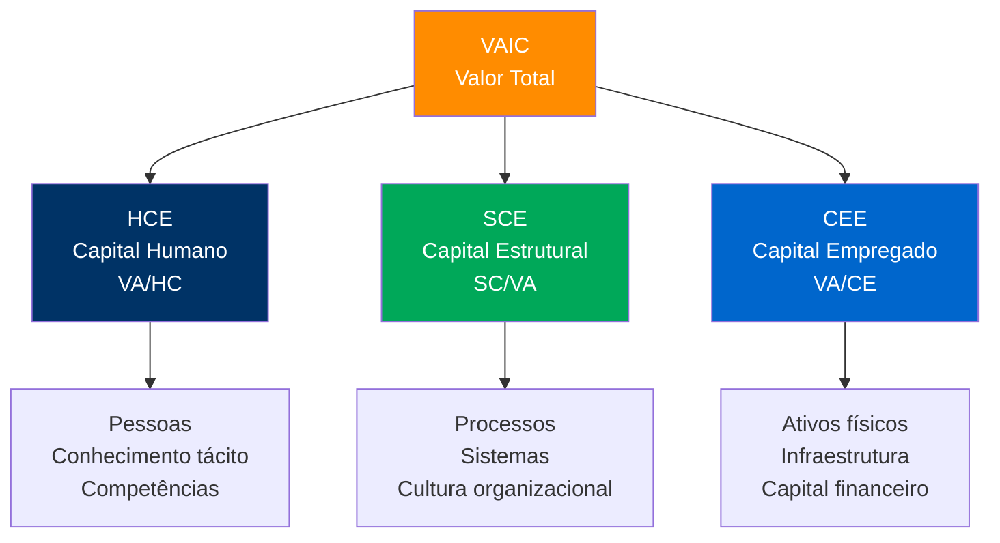
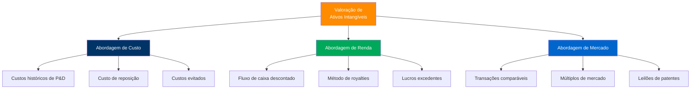
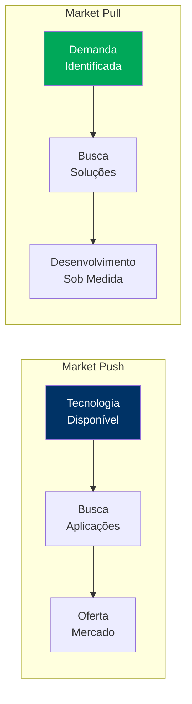

<!-- _class: lead -->

# Propriedade Intelectual

## Como Ativo Estratégico na Gestão Empresarial

### Universidade Federal de Sergipe
**Concurso Público para Docente**

---

## 📋 Agenda da Aula

### Fundamentos (20 min)
1. PI como ativo estratégico
2. Modelo VAIC
3. Resource-Based View

### Aplicações (20 min)
4. Mercados para Tecnologia
5. Valoração de Ativos
6. Comercialização e NITs

### Síntese (10 min)
7. Conclusões e perspectivas

---

## 💡 Questão Provocativa

**Por que >80% do valor de empresas tecnológicas está em ativos intangíveis?**

📊 **Dados**: Apple, Microsoft, Google têm 85-90% do valor de mercado em intangíveis (Lev, 2001)

<!-- 
NOTAS DO APRESENTADOR:
- Baruch Lev, "Intangibles: Management, Measurement, and Reporting" (2001)
- Transição da economia industrial para economia do conhecimento
- PI como principal mecanismo de proteção de intangíveis
- Timing: 2 minutos
-->

---

## 📊 PI Como Ativo Estratégico

### Da Proteção à Estratégia

| Aspecto | Tradicional | Estratégico |
|---------|-------------|-------------|
| **Foco** | Proteção legal | Criação de valor |
| **Abordagem** | Reativa | Proativa |
| **Objetivo** | Evitar cópia | Vantagem competitiva |
| **Gestão** | Jurídica | Multidisciplinar |

### Tipos de PI no Brasil

#### Lei 9.279/1996 (Propriedade Industrial)
- Patentes de invenção
- Marcas registradas
- Desenhos industriais

#### Lei 9.610/1998 (Direitos Autorais)
- Obras literárias e artísticas
- Programas de computador

#### Lei 9.456/1997 (Cultivares)

<!-- 
NOTAS:
- Arcabouço jurídico brasileiro alinhado com TRIPS
- INPI: 25.000+ patentes/ano (2023)
- Tempo médio concessão: 10,8 anos (gargalo brasileiro)
- Timing: 4 minutos
-->

---

## 🎯 Modelo VAIC de Pulic (2000)

### Value Added Intellectual Coefficient

**VAIC = HCE + SCE + CEE**

Indicador que mostra quão bem a organização transforma conhecimento em valor econômico

<!-- 
NOTAS:
- Pulic, A. (2000). VAIC™ – an accounting tool for IC management
- HCE: Eficiência do capital humano (quanto VA por real investido em pessoas)
- SCE: Contribuição estrutural (rotinas, processos, PI)
- CEE: Produtividade do capital tangível
- Timing: 5 minutos
-->

---

## 🔍 Resource-Based View (RBV)

### Critérios VRIO (Barney, 1991)

#### **V**alioso
Gera vantagem competitiva?

#### **R**aro
Poucos concorrentes possuem?

#### **I**nimitável
Difícil de copiar ou substituir?

#### **O**rganizacional
Empresa explora adequadamente?

### PI como Recurso Estratégico

✅ **Valioso**: Protege inovações geradoras de receita

✅ **Raro**: Direitos exclusivos limitados

✅ **Inimitável**: Proteção legal de 20 anos (patentes)

✅ **Organizacional**: Gestão via NITs/departamentos PI

#### Integração VAIC-RBV

- **HCE**: Capacidade inventiva e P&D
- **SCE**: Gestão de portfólios de PI
- **CEE**: Infraestrutura para exploração

<!-- 
NOTAS:
- Barney, J. (1991). Firm resources and sustained competitive advantage
- PI = mecanismo de apropriabilidade (Teece, 1986)
- Regime de apropriabilidade varia por setor (farmacêutico vs. software)
- Brasil: 82% patentes depositadas por não-residentes (INPI, 2023)
- Timing: 4 minutos
-->

---

## 🏪 Mercados para Tecnologia

### Arora et al. (2001)

"Mercados para tecnologia transformam conhecimento protegido em bens transacionáveis, gerando divisão especializada do trabalho inovativo"

### Desafios: Assimetrias Informacionais

#### **Seleção Adversa**

- Know-how tácito
- Dificuldade de valoração pré-transferência
- "Paradoxo da revelação"

**Solução**: Patentes como sinalização

#### **Risco Moral**

- Oportunismo pós-transferência
- Vazamento de segredos
- Uso indevido

**Solução**: Cláusulas contratuais

#### **Hold-up**

- Investimentos específicos
- Dependência bilateral
- Renegociação

**Solução**: Contratos relacionais

<!-- 
NOTAS:
- Arora, A., Fosfuri, A., & Gambardella, A. (2001). Markets for Technology
- Brasil: mercado de PI pouco desenvolvido (baixa liquidez)
- Ausência de bases públicas de transações comparáveis
- Oportunidade: Plataformas digitais de licenciamento
- Timing: 5 minutos
-->

---

## 💰 Métodos de Valoração de PI

<!-- 
NOTAS:
- Smith & Parr (2005). Valuation of Intellectual Property
- Abordagem mais usada no Brasil: Fluxo de caixa descontado (DCF)
- Desafios: taxa de desconto adequada, estimativa de receitas futuras
- NITs brasileiros: muitos usam custos evitados (mais conservador)
- Timing: 4 minutos
-->

---

## 🔄 Modelos de Comercialização de PI

### Rotas Estratégicas

#### 1. Licenciamento
- Exclusivo vs. não-exclusivo
- Territórios definidos
- Royalties ou lump sum

#### 2. Spin-offs
- Criação de nova empresa
- Transferência de tecnologia
- Participação acionária

#### 3. Joint Ventures
- Exploração conjunta
- Compartilhamento de riscos
- Sinergias tecnológicas

#### 4. Venda Direta
- Cessão total de direitos
- Pagamento único
- Transfer completo

### Market Push vs. Market Pull

### Engineering vs. Reengineering

- **Engineering**: Construção do portfólio
- **Reengineering**: Reconfiguração estratégica

<!-- 
NOTAS:
- Rajic & Pererva (2022). Models of commercialization
- Market push: inovações disruptivas (ex: CRISPR)
- Market pull: soluções customizadas (ex: consultorias)
- Brasil: predominância de licenciamento simples
- Timing: 5 minutos
-->

---

## 🏛️ NITs e Contexto Institucional Brasileiro

### Marco Legal CT&I

**Lei 10.973/2004** - Lei de Inovação
- Criação obrigatória de NITs
- Bolsa estímulo à inovação
- Compartilhamento de ganhos

**Lei 13.243/2016** - Novo Marco
- Flexibilização parcerias
- Pesquisador-empreendedor
- Fundações de apoio

**Decreto 9.283/2018**
- Regulamentação detalhada
- Encomendas tecnológicas
- Dispensa de licitação

### Agitte.se/UFS

#### Resolução 33/2022/CONSU
Política Institucional de Inovação

📊 **Dados Agitte.se (2024)**
- 27 patentes depositadas
- R$ 8,3 mi em projetos (2020-2024)
- 42 acordos ICT-empresa
- 3 spin-offs acadêmicos ativos

#### Serviços Oferecidos
- Gestão de portfólio de patentes
- Valoração de ativos intangíveis
- Negociação de licenciamentos
- Suporte a empreendedorismo

<!-- 
NOTAS:
- NITs: 264 cadastrados no FORMICT 2022
- Desafios: pessoal qualificado, recursos limitados, cultura de inovação
- UFS: referência regional em transferência de tecnologia
- Timing: 4 minutos
-->

---

## 📈 Desafios e Oportunidades no Brasil

### ⚠️ Desafios Estruturais

1. **Cultura incipiente de proteção**
	- Baixa consciência sobre PI
	- Resistência acadêmica

2. **Assimetrias na valoração**
	- Falta de profissionais especializados
	- Ausência de dados de mercado

3. **Divergência temporal**
	- Academia: publicação rápida
	- Empresa: proteção primeiro

4. **Fragmentação institucional**
	- Multiplicidade de atores
	- Coordenação deficiente

5. **Mercado de PI rarefeito**
	- Baixa liquidez
	- Poucas transações

### 💡 Oportunidades Estratégicas

1. **Digitalização de processos**
	- Plataformas de licenciamento
	- Blockchain para rastreabilidade

2. **Cooperação internacional**
	- Patentes PCT
	- Acordos bilaterais

3. **Setores estratégicos**
	- Bioeconomia amazônica
	- Agro 4.0
	- Energias renováveis

4. **Open Innovation**
	- Compartilhamento estratégico
	- Ecossistemas colaborativos

5. **Valorização regional**
	- Indicações geográficas
	- Conhecimentos tradicionais

<!-- 
NOTAS:
- Brasil: 62º no Global Innovation Index 2023
- Gasto em P&D: 1,16% PIB vs. 2,4% OCDE
- Sergipe: oportunidades em óleo/gás, aquicultura, citricultura
- Timing: 4 minutos
-->

---

## 🎓 Síntese Conceitual

### 🔑 Mensagens-Chave

1. **PI transcende proteção legal**, atuando como ativo estratégico central em economias do conhecimento
2. **VAIC e RBV** fornecem frameworks complementares para mensuração e apropriação de valor
3. **Mercados para tecnologia** enfrentam assimetrias informacionais que exigem mecanismos de sinalização
4. **Comercialização bem-sucedida** depende de escolhas estratégicas alinhadas à maturidade tecnológica
5. **NITs** são intermediários cruciais, mas enfrentam desafios institucionais no Brasil

<!-- 
NOTAS:
- Reforçar visão sistêmica: da criação à apropriação de valor
- PI como ferramenta de competitividade e desenvolvimento
- Timing: 3 minutos
-->

---

<!-- _class: lead -->

# 💬 Questões para Reflexão

1. **Como superar a cultura de "publicar antes de proteger" nas universidades brasileiras?**

2. **Quais os principais obstáculos à criação de um mercado líquido de PI no Brasil?**

3. **De que forma a transformação digital pode democratizar acesso a ferramentas de valoração de ativos intangíveis?**

4. **Como conciliar abertura do conhecimento científico com apropriação privada necessária à inovação?**

---

<!-- _class: lead -->

# 📚 Referências Principais

**ARORA, A.; FOSFURI, A.; GAMBARDELLA, A.** (2001). Markets for Technology: The Economics of Innovation and Corporate Strategy. MIT Press.

**BARNEY, J.** (1991). Firm Resources and Sustained Competitive Advantage. Journal of Management, 17(1), 99-120.

**LEV, B.** (2001). Intangibles: Management, Measurement, and Reporting. Brookings Institution Press.

**MOURA, A.; MARTINS, G.** (2023). Propriedade Intelectual: Proteção e Gestão Estratégica do Conhecimento. Editora FGV.

**PULIC, A.** (2000). VAIC™ – an accounting tool for IC management. International Journal of Technology Management, 20(5-8), 702-714.

**RAJIC, T.; PERERVA, P.** (2022). Models of Intellectual Property Commercialization. Technology Analysis & Strategic Management.

**UFS** (2022). Resolução nº 33/2022/CONSU - Política Institucional de Inovação da UFS.

---

<!-- _class: lead -->

# Obrigado pela Atenção! 🎓

## Perguntas?

**Prof. [Seu Nome]**  
📧 email@ufs.br  
🔗 lattes.cnpq.br/[seu-lattes]

**Universidade Federal de Sergipe**  
Concurso Público - Gestão da Inovação Tecnológica

