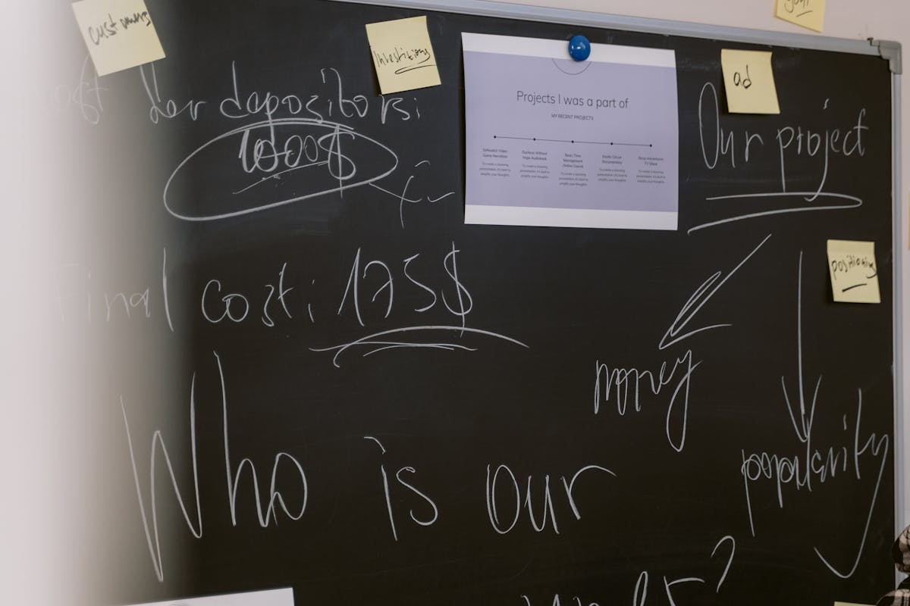
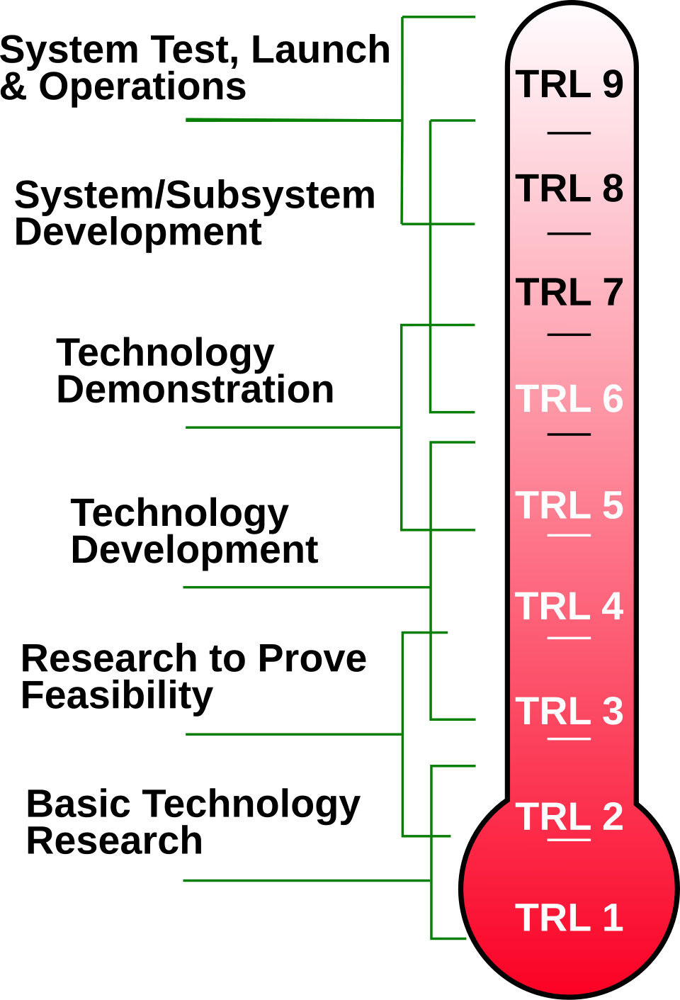
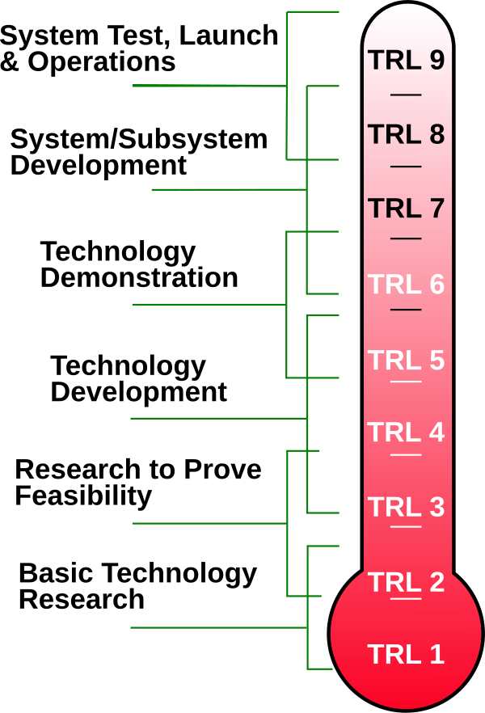
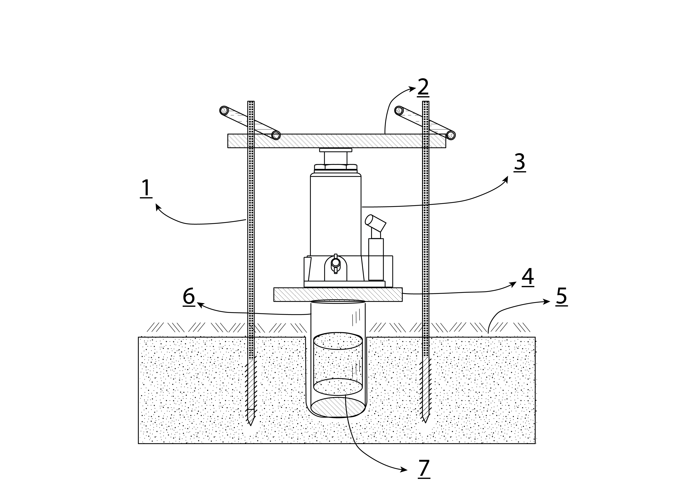
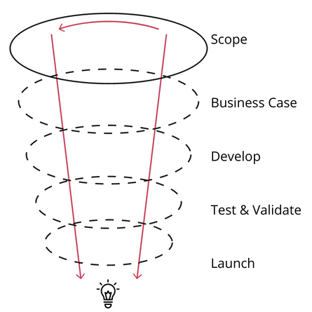
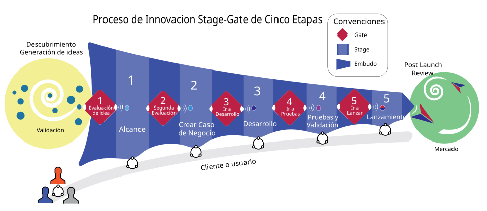
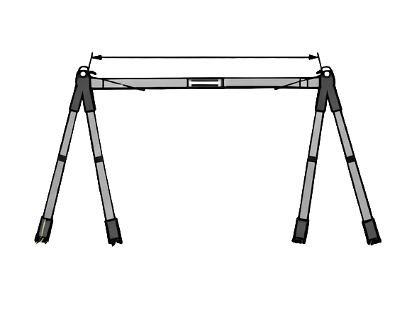

## Visão Geral {.smaller-text}

::: {.columns}
::: {.column width="50%"}
### Tópicos Principais

- [1]{.circle} Evolução dos Modelos de Gestão da Inovação
- [2]{.circle} ISO 56005 e Sistema de Gestão de PI
- [3]{.circle} Modelo Stage-Gate
- [4]{.circle} Indicadores de Desempenho
- [5]{.circle} Capacidades Organizacionais
:::

::: {.column width="50%"}
::: {.info-box}
**Objetivo Central**

Integrar a propriedade intelectual como componente estratégico transversal em todo o ciclo de inovação, desde a concepção até a comercialização.
:::
:::
:::


## Propriedade Intelectual na Economia do Conhecimento

::: {.box}
**Definição Estratégica**

A PI constitui a base jurídica e econômica da economia do conhecimento, funcionando como:

- Instrumento de **incentivo ao investimento**
- Mecanismo de **captura de valor**
- Elemento **estratégico desde a concepção** dos projetos
:::

---

### Mudança de Paradigma

:::: {.columns}
::: {.column width="50%"}
**Antes**

- Elemento final do processo
- Tratamento reativo  
- Decisão posterior à P&D
:::

::: {.column width="50%"}
**Agora**

- Componente transversal
- Abordagem proativa
- Orientação desde a concepção
:::
::::

# [Evolução Histórica]{.section-header}

## Taxonomia dos Modelos de Gestão da Inovação

::: {.diagram-scroll}
```{mermaid}
%%| fig-width: 12
%%| fig-height: 8
timeline
    title Modelos de Gestão da Inovação
  1942 : Schumpeter (1942)
     : Inovação como "novas combinações" e destruição criativa
    1940-1960 : Modelo Linear (Push)
              : Pesquisa básica → Aplicada → Desenvolvimento → Produção → Mercado
              : Unidirecional e sequencial
    1970-1980 : Modelo Interativo (Kline & Rosenberg, 1986)
              : Retroalimentações mercado-laboratório
              : Learning-by-doing
              : Papel do usuário
    1990-2000 : Modelo Sistêmico (Edquist, 2001)
              : Redes de inovação
              : Triple Helix
              : SNI
    2000-Presente : Inovação Aberta (Chesbrough, 2003)
                  : P&D interna + externa
                  : Modelos de negócio superiores
                  : PI como ativo estratégico
    2010-Presente : Transformação Digital
                  : IA, IoT, Blockchain
                  : Gestão preditiva e adaptativa
                  : Ecossistemas hiperconectados
```
:::

::: {.info-box}
**Conexão com a redação (Tema 5)**

- Inovação é **não linear** e baseada em aprendizagem/retroalimentação (Kline & Rosenberg, 1986)
- Em projetos, isso exige decisões contínuas sobre **sigilo, documentação e timing de proteção**
- PI deixa de ser “fim do processo” e vira **variável estratégica desde a concepção** (Schumpeter, 1942)
:::

---

## Do Empírico ao Normativo

::: {.info-box}
**Manual de Oslo (OCDE/Eurostat)**

- Base conceitual para mensuração da inovação
- Taxonomias e indicadores internacionais
- 852 ocorrências de "inovação"
- 619 ocorrências de "P&D"
- 478 ocorrências de "cooperação"
:::

---

## Operacionalização ISO 56000

::: {.highlight-box}
**ISO 56000: Operacionalização**

Transforma conceitos do Manual de Oslo em processos gerenciais:

- ✓ Rastreabilidade das decisões
- ✓ Processos auditáveis
- ✓ Benchmarking setorial
- ✓ Comparabilidade internacional
:::


# [ISO 56005]{.section-header}

::: {style="text-align: right; padding-top: 10px; padding-right: 50px;"}
{width="25%"}
:::

## Estrutura Completa da ISO 56005:2023 {.smaller-text}

{width="100%"}

---

## Nível 1: Estrutura de Gestão {.smaller-text}

:::: {.columns}
::: {.column width="50%"}
### Elementos Estruturais

::: {.box}
**Comprometimento Organizacional**
- Análise do contexto interno/externo
- Identificação de partes interessadas
- Avaliação de riscos e oportunidades
:::

::: {.fragment}
::: {.box}
**Sistema de Gestão**
- Processos documentados
- Alocação de recursos
- Governança clara
:::
:::
:::

::: {.column width="50%"}
::: {.fragment}
### Dimensões de Suporte

- [💡]{style="font-size: 1.5em"} **Cultura de PI** - disseminação de conhecimento
- [👥]{style="font-size: 1.5em"} **Capital Humano** - competências específicas
- [⚖️]{style="font-size: 1.5em"} **Aspectos Legais** - compliance regulatório
- [💰]{style="font-size: 1.5em"} **Dimensão Financeira** - orçamento e ROI
:::
:::
::::

---

## Nível 2: Estratégia de PI

### Ciclo Estratégico

```{mermaid}
%%| fig-width: 10
%%| fig-height: 5
graph LR
    A[Definição de Metas] --> B[Desenvolvimento]
    B --> C[Implementação]
    C --> D[Monitoramento]
    D --> A
    
    A1[Análise de registros<br/>próprios e terceiros] -.-> A
    A2[Identificação de<br/>oportunidades/riscos] -.-> A
    A3[Seleção de conceitos] -.-> A
    
    B1[Análises adicionais] -.-> B
    B2[Mitigação de riscos] -.-> B
    B3[Obrigações contratuais] -.-> B
    B4[Manutenção de proteções] -.-> B
    
    C1[Integração ao<br/>planejamento] -.-> C
    C2[Prioridades de<br/>investimento] -.-> C
    C3[Planos de exploração] -.-> C
    
    style A fill:#4CAF50,stroke:#333,stroke-width:2px,color:#fff
    style B fill:#2196F3,stroke:#333,stroke-width:2px,color:#fff
    style C fill:#FF9800,stroke:#333,stroke-width:2px,color:#fff
    style D fill:#9C27B0,stroke:#333,stroke-width:2px,color:#fff
```

---

## Nível 3: Integração aos Processos {.smaller-text}

:::: {.columns}
::: {.column width="50%"}
### Fases de Identificação e Criação

::: {.box}
**Identificação de Oportunidades**
- Captura de ideias por múltiplos canais
- Análise preliminar de PI existente
:::

::: {.fragment}
::: {.box}
**Criação de Conceitos**
- Comunicação entre P&D, marketing e PI
- Avaliação de patenteabilidade
:::
:::

::: {.fragment}
::: {.box}
**Validação de Conceitos**
- Análise de liberdade de operação
- Estudos de viabilidade técnica e jurídica
:::
:::
:::

::: {.column width="50%"}
::: {.fragment}
### Fases de Desenvolvimento e Implantação

- [🔬]{style="font-size: 1.5em"} **Desenvolvimento** - Escopo geográfico de proteção
- [📋]{style="font-size: 1.5em"} **Modalidades de PI** - Patentes, marcas, designs
- [📅]{style="font-size: 1.5em"} **Implantação** - Cronograma de depósitos
- [💼]{style="font-size: 1.5em"} **Estratégias de Exploração** - Licenciamento e comercialização
:::
:::
::::


# [Manual de Oslo]{.section-header}

::: {style="text-align: right; padding-top: 10px; padding-right: 50px;"}
{width="25%"}
:::

## 7 Categorias de Atividades de Inovação {.smaller-text}

::: {.box}
**Segundo o Manual de Oslo (OCDE/Eurostat, 3ª ed.)**
:::

:::: {.columns style="font-size: 0.85em;"}
::: {.column width="50%"}
[1]{.circle} **P&D Interna e Externa**
- Pesquisa básica e aplicada
- Contratação de serviços de P&D
- *Verificação PI*: Análise de anterioridade

[2]{.circle} **Aquisição de Máquinas/Equipamentos**
- Software avançado
- Infraestrutura tecnológica
- *Verificação PI*: Licenças de software

[3]{.circle} **Aquisição de Conhecimento Externo**
- Patentes, licenças
- Know-how, marcas
- *Verificação PI*: Freedom-to-operate

[4]{.circle} **Treinamento**
- Desenvolvimento de competências
- Capacitação em PI
- *Verificação PI*: Cultura organizacional
:::

::: {.column width="50%"}
[5]{.circle} **Design e Preparação**
- Design industrial
- Preparação para produção
- *Verificação PI*: Registro de design

[6]{.circle} **Introdução no Mercado**
- Estudos de mercado
- Campanhas de lançamento
- *Verificação PI*: Marcas e trade dress

[7]{.circle} **Outras Atividades**
- Estudos de viabilidade
- Testes e certificações
- *Verificação PI*: Documentação técnica
:::
::::

---

## Integração ISO 56005 + Manual de Oslo

::: {.highlight-box}
**Alinhamento Estratégico**

Cada atividade de inovação do Manual de Oslo é acompanhada de verificações de PI conforme ISO 56005, transformando o SGPI em instrumento de:

- 🛡️ **Mitigação de riscos jurídicos**
- 💰 **Maximização do ROI em inovação**
- 📊 **Mensuração padronizada**
- 🌍 **Comparabilidade internacional**
:::


# [Technology Readiness Level]{.section-header}

::: {style="text-align: right; padding-top: 10px; padding-right: 50px;"}
{width="25%"}
:::

---

## TRL e Estratégia de PI

::: {.diagram-scroll}
{width="100%" style="max-height: 600px;"}
:::

---

## Sincronização TRL-PI {.smaller-text}

:::: {.columns}
::: {.column width="33%"}
### TRL 1-3: Inicial
::: {.box}
**Foco: Sigilo**
- Princípios básicos observados
- Conceito formulado
- Prova de conceito experimental

**Proteção PI:**
- ⚠️ Sigilo rigoroso
- 📄 Publicações estratégicas
- 🔍 Estabelecer prior art
:::
:::

::: {.column width="33%"}
### TRL 4-6: Intermediário
::: {.box}
**Foco: Validação**
- Validação em laboratório
- Validação em ambiente relevante
- Demonstração em ambiente operacional

**Proteção PI:**
- 📝 Patentes provisórias
- 🔍 Freedom-to-operate
- 🌍 Definição territorial
:::
:::

::: {.column width="33%"}
### TRL 7-9: Avançado
::: {.box}
**Foco: Comercialização**
- Protótipo em ambiente operacional
- Sistema completo qualificado
- Sistema comprovado em operação

**Proteção PI:**
- ✅ Patentes definitivas
- 🎨 Registros de design
- ™️ Marcas comerciais
:::
:::
::::

::: {.fragment}
::: {.info-box}
**Resultado:** Sincronização assegura que recursos não sejam desperdiçados em proteção prematura, evitando divulgações que comprometam a novidade.
:::
:::

---

## Exemplo: Amostrador de Solo {.smaller-text}

::: {.columns}
::: {.column width="55%"}
Exemplo de invenção que completou o ciclo TRL (1-9) com proteção patentária:

- **TRL 1-3:** Concepção e prova de conceito em laboratório
- **TRL 4-6:** Validação em campo e proteção provisória
- **TRL 7-9:** Patente definitiva e transferência
:::

::: {.column width="45%"}
{width="100%"}
:::
:::

# [Stage-Gate]{.section-header}
::: {style="text-align: right; padding-top: 100px; padding-right: 50px;"}
{width="25%"}
:::

## Modelo Stage-Gate (Cooper, 1990-2008)

{width="85%"}

---

## Fases e Gates com PI Integrada {.smaller-text}

```{mermaid}
%%| fig-width: 12
%%| fig-height: 6
graph LR
    I[Ideia] --> G0{Gate 0<br/>Triagem}
    G0 -->|Go| S1[Stage 1<br/>Escopo]
    
    S1 --> G1{Gate 1<br/>Análise<br/>PI}
    G1 -->|Go| S2[Stage 2<br/>Business Case]
    G1 -->|Kill| K[❌]
    S2 --> G2{Gate 2<br/>Viabilidade}
    
    G2 -->|Go| S3[Stage 3<br/>Desenvolvimento]
    G2 -->|Hold| H[⏸️]
    G2 -->|Kill| K
    
    S3 --> G3{Gate 3<br/>Teste}
    G3 -->|Go| S4[Stage 4<br/>Validação]
    S4 --> G4{Gate 4<br/>Lançamento}
    G4 -->|Go| S5[Stage 5<br/>Comercialização]
    
    style I fill:#003366,color:#fff
    style G0 fill:#FF8C00,color:#fff
    style G1 fill:#FF8C00,color:#fff
    style G2 fill:#FF8C00,color:#fff
    style G3 fill:#FF8C00,color:#fff
    style G4 fill:#FF8C00,color:#fff
    style S1 fill:#4CAF50,color:#fff
    style S2 fill:#4CAF50,color:#fff
    style S3 fill:#00A859,color:#fff
    style S4 fill:#4CAF50,color:#fff
    style S5 fill:#0066CC,color:#fff
    style K fill:#CC0000,color:#fff
    style H fill:#CCCC00,color:#000
```

---

## Stage-Gate + TRL + Desenvolvimento de Patentes {.smaller-text}

```{mermaid}
%%| fig-width: 12
%%| fig-height: 7
graph TB
    subgraph "Stage 1: Escopo (TRL 1-2)"
    A[Busca Preliminar<br/>Anterioridade] --> B[Disclosure de<br/>Invenção]
    B --> C[Segredo ou<br/>Publicação?]
    end
    
    subgraph "Stage 2: Business Case (TRL 3-4)"
    D[Busca Completa<br/>Anterioridade] --> E[Análise FTO]
    E --> F[Estratégia Territorial]
    F --> G[Orçamento PI]
    end
    
    subgraph "Stage 3: Desenvolvimento (TRL 5-6)"
    H[Depósito Patente<br/>Provisório] --> I[Validação<br/>Técnica]
    I --> J[Patente Definitiva<br/>+ PCT?]
    end
    
    subgraph "Stage 4: Validação (TRL 7-8)"
    K[Proteção<br/>Complementar] --> L[Design Industrial<br/>Marca]
    L --> M[Valoração de<br/>Ativos]
    end
    
    subgraph "Stage 5: Comercialização (TRL 9)"
    N[Licenciamento] --> O[Spin-off]
    O --> P[Exploração<br/>Direta]
    end
    
    C --> D
    G --> H
    J --> K
    M --> N
    
    style A fill:#003366,color:#fff
    style H fill:#00A859,color:#fff
    style M fill:#FF8C00,color:#fff
    style P fill:#0066CC,color:#fff
```

---

## Exemplo: Permeâmetro Patenteado {.smaller-text}

::: {.columns}
::: {.column width="55%"}
O permeâmetro ilustra uma invenção que percorreu todo o fluxo Stage-Gate + TRL:

- **Stage 1 (Scoping):** Identificação da necessidade de medir permeabilidade *in situ*
- **Stage 3 (Desenvolvimento):** Protótipo funcional + depósito provisório
- **Stage 5 (Lançamento):** Patente concedida + licenciamento
:::

::: {.column width="45%"}
{width="100%"}
:::
:::

---

## Convergência Stage-Gate + ISO 56005

::: {.info-box}
**Harmonização Estratégica**

Quando o modelo Stage-Gate é harmonizado com a ISO 56005, cada gate incorpora:
:::

:::: {.columns}
::: {.column width="50%"}
### Entregáveis de PI

- 📋 Relatórios de anterioridade
- 🔍 Análises de freedom-to-operate
- 💡 Formulários de divulgação de invenções
- 🌐 Estratégias territoriais
- 💼 Planos de exploração comercial
:::

::: {.column width="50%"}
### Benefícios

- ✅ Rastreabilidade das decisões
- ⚖️ Proteção jurídica em cada etapa
- 📊 Governança aprimorada
- 🎯 SGPI operacional efetivo
:::
::::

---

## Artefatos da ISO 56005 {.smaller-text}

::: {.box}
**Anexos Informativos da ABNT NBR ISO 56005:2023**

A norma detalha instrumentos práticos para padronizar coleta de informações e tomada de decisão:
:::

:::: {.columns}
::: {.column width="50%"}
### Documentos Estruturados

1. **Invention Disclosure Form**
   - Formulário de divulgação de invenção
   - Captura sistemática de informações
   - Padronização de dados

2. **Employee PI Management Guide**
   - Guia para atividades de PI com funcionários
   - Direitos e deveres
   - Incentivos à divulgação
:::

::: {.column width="50%"}
### Ferramentas de Avaliação

3. **DPI Assessment Tools**
   - Ferramentas para avaliação de PI
   - Análise de valor
   - Priorização de ativos

::: {.fragment}
::: {.highlight-box}
**Objetivo:** Transformar conhecimento tácito em processos estruturados e auditáveis dentro do SGPI
:::
:::
:::
::::

# [Indicadores de Desempenho]{.section-header}
::: {style="text-align: right; padding-top: 10px; padding-right: 50px;"}
{width="25%"}
:::

## Framework de Indicadores (Manual de Oslo) {.smaller-text}

:::: {.columns}
::: {.column width="50%"}
### Indicadores de INPUT

::: {.box}
- 💰 Investimento total em atividades de inovação
- 🔍 Recursos em busca de anterioridade
- 📊 Recursos em análise de freedom-to-operate
- 💳 Custos de depósito e manutenção de ativos
:::

### Indicadores de PROCESSO

::: {.box}
- ⏱️ Tempo médio: invenção → decisão de proteção
- ✅ Taxa de aprovação nos gates
- 🎯 Alinhamento portfólio PI vs estratégia
:::
:::

::: {.column width="50%"}
### Indicadores de OUTPUT

::: {.box}
- 📜 Número de patentes **concedidas**
- 💻 Registros de software efetivados
- 🤝 Contratos de licenciamento firmados
- 💵 Receita de royalties
:::

### Indicadores de IMPACTO

::: {.box}
- 📈 % receita de produtos com PI
- 🏆 Market share de inovações patenteadas
- 💹 Redução de custos operacionais
- 🌟 Valor de mercado atribuível a PI
:::
:::
::::

---

## Arquitetura de Indicadores Integrada {.smaller-text}

```{mermaid}
%%| fig-width: 12
%%| fig-height: 6
graph TB
    A[Framework de Indicadores<br/>Manual de Oslo + ISO 56005]
    
    B[INPUT]
    C[PROCESSO]
    D[OUTPUT]
    E[IMPACTO]
    
    A --> B
    A --> C
    A --> D
    A --> E
    
    B --> B1[Investimento em<br/>atividades de inovação]
    B --> B2[Recursos em PI<br/>busca + análise]
    
    C --> C1[Tempo médio<br/>invenção → proteção]
    C --> C2[Taxa aprovação<br/>gates decisórios]
    C --> C3[Alinhamento<br/>portfólio-estratégia]
    
    D --> D1[Patentes concedidas]
    D --> D2[Contratos de<br/>licenciamento]
    D --> D3[Receita de royalties]
    
    E --> E1[% receita de<br/>produtos com PI]
    E --> E2[Market share<br/>inovações patenteadas]
    E --> E3[Valor de mercado<br/>atribuível a PI]
    
    T1[TRL 1-3] -.-> B
    T2[TRL 4-6] -.-> C
    T3[TRL 7-9] -.-> D
    T4[Comercial] -.-> E
    
    SG[Stage-Gate<br/>Gates 1-5] -.-> C
    
    style A fill:#00703C,stroke:#333,stroke-width:3px,color:#fff
    style B fill:#2196F3,stroke:#333,stroke-width:2px,color:#fff
    style C fill:#4CAF50,stroke:#333,stroke-width:2px,color:#fff
    style D fill:#FF9800,stroke:#333,stroke-width:2px,color:#fff
    style E fill:#9C27B0,stroke:#333,stroke-width:2px,color:#fff
```

---

## Mensuração e Decisão Estratégica

::: {.highlight-box}
**Alinhamento TRL + Stage-Gate + Indicadores**

A arquitetura de indicadores permite:

1. 📊 Avaliar eficácia do SGPI em diferentes estágios de maturidade tecnológica
2. 🎯 Orientar decisões de continuidade/descontinuidade de projetos
3. 🔄 Melhoria contínua baseada em evidências
4. 🌍 Benchmarking com padrões internacionais
:::

# [Capacidades Organizacionais]{.section-header}
::: {style="text-align: right; padding-top: 100px; padding-right: 50px;"}
{width="25%"}
:::

## Fundamentos das Capacidades

{width="70%"}

---

## Modelo de Capacidade Absortiva {.smaller-text}

```{mermaid}
%%| fig-width: 12
%%| fig-height: 5
flowchart LR
    %% Blocos principais
    A[Fontes de conhecimento<br/>Complementaridade<br/>Experiência] --> B
    B["<b>Capacidade Absortiva Potencial</b><br/>Aquisição • Assimilação"] --> C
    C["<b>Capacidade Absortiva Realizada</b><br/>Transformação • Exploração"] --> D
    D[Vantagem competitiva<br/>Flexibilidade estratégica<br/>Inovação • Performance]

    %% Gatilhos e mecanismos
    E((Gatilhos)) -.-> B
    F((Mecanismos de<br/>integração social)) -.-> C
    G((Regime de<br/>apropriação)) -.-> D

    style A fill:#0066CC,stroke:#003366,stroke-width:2px,color:#fff,font-weight:bold
    style B fill:#0099FF,stroke:#003366,stroke-width:2px,color:#fff,font-weight:bold
    style C fill:#00A859,stroke:#004D2E,stroke-width:2px,color:#fff,font-weight:bold
    style D fill:#003366,stroke:#001a33,stroke-width:2px,color:#fff,font-weight:bold
    style E fill:#FF8C00,stroke:#CC6600,stroke-width:2px,color:#fff,font-weight:bold
    style F fill:#FF8C00,stroke:#CC6600,stroke-width:2px,color:#fff,font-weight:bold
    style G fill:#FF8C00,stroke:#CC6600,stroke-width:2px,color:#fff,font-weight:bold
```

::: {.info-box}
**Cohen & Levinthal (1990):** Aptidão de reconhecer, assimilar e aplicar comercialmente conhecimento externo, dependente de trajetórias anteriores de investimento (path dependency)
:::

---

## Dimensões da Capacidade Absortiva

:::: {.columns}
::: {.column width="50%"}
### Capacidade Potencial

::: {.box}
**1. Aquisição**
- Identificação de conhecimento valioso
- Monitoramento tecnológico
- Scanning do ambiente

**2. Assimilação**
- Absorção de conhecimento externo
- Tradução para contexto interno
- Codificação e armazenamento
:::
:::

::: {.column width="50%"}
### Capacidade Realizada

::: {.box}
**3. Transformação**
- Combinação com conhecimento existente
- Reconfiguração de recursos
- Adaptação organizacional

**4. Exploração**
- Aplicação comercial
- Geração de inovação
- Captura de valor
:::
:::
::::

---

## Capacidades Dinâmicas (Teece, 2007)

{width="70%"}

---

## Modelo de Capacidades Dinâmicas (Teece, 2007) {.smaller-text}

```{mermaid}
%%| fig-width: 12
%%| fig-height: 5
flowchart LR
    %% Elementos componentes à esquerda
    A1[Comportamentos e habilidades<br/>de mudança e inovação] --> C
    A2[Processos e rotinas de<br/>busca ou inovação] --> C
    A3[Mecanismos de aprendizagem<br/>e governança do conhecimento] --> C

    %% Bloco central
    C([<b>Capacidades<br/>Dinâmicas</b>])

    %% Indicadores à direita
    C --> B1[Geração de ideias e<br/>introdução de rupturas]
    C --> B2[Mudanças<br/>organizacionais]
    C --> B3[Inovação e<br/>novos mercados]

    style A1 fill:#0099FF,stroke:#003366,stroke-width:2px,color:#fff,font-weight:bold
    style A2 fill:#0099FF,stroke:#003366,stroke-width:2px,color:#fff,font-weight:bold
    style A3 fill:#0099FF,stroke:#003366,stroke-width:2px,color:#fff,font-weight:bold
    style B1 fill:#00A859,stroke:#004D2E,stroke-width:2px,color:#fff,font-weight:bold
    style B2 fill:#00A859,stroke:#004D2E,stroke-width:2px,color:#fff,font-weight:bold
    style B3 fill:#00A859,stroke:#004D2E,stroke-width:2px,color:#fff,font-weight:bold
    style C fill:#003366,stroke:#001a33,stroke-width:3px,color:#fff,font-weight:bold,font-size:16px
```

---

## Três Pilares das Capacidades Dinâmicas {.smaller-text}

:::: {.columns}
::: {.column width="33%"}
### [1]{.circle} Sensing
::: {.box}
**Perceber Oportunidades**

- Scanning do ambiente
- Identificação de tendências
- Monitoramento de concorrentes
- Análise de sinais fracos
:::
:::

::: {.column width="33%"}
### [2]{.circle} Seizing
::: {.box}
**Mobilizar Recursos**

- Alocação de recursos
- Estruturação de projetos
- Decisões de investimento
- Formação de parcerias
:::
:::

::: {.column width="33%"}
### [3]{.circle} Transforming
::: {.box}
**Transformar Ativos**

- Reconfiguração contínua
- Adaptação à mudança
- Renovação da base de ativos
- Evolução organizacional
:::
:::
::::

::: {.fragment}
::: {.highlight-box}
**Contexto:** Habilidade essencial em ambientes incertos e turbulentos, permitindo transformação contínua da organização
:::
:::

---

## Cultura de Propriedade Intelectual {.smaller-text}

::: {.info-box}
**Seção 4.4 da NBR ISO 56005:2023**

Elemento essencial previsto na norma, sustentado pelas capacidades absortiva e dinâmica
:::

:::: {.columns}
::: {.column width="50%"}
### Componentes da Cultura de PI

1. **Disseminação de Conhecimento**
   - Treinamentos regulares
   - Workshops sobre PI
   - Materiais educativos

2. **Incentivo à Divulgação**
   - Reconhecimento de inventores
   - Recompensas por divulgações
   - Facilitação do processo
:::

::: {.column width="50%"}
3. **Promoção da Confidencialidade**
   - Políticas de sigilo
   - NDAs padronizados
   - Gestão de acesso à informação

4. **Cumprimento de Prazos Legais**
   - Calendário de PI
   - Alertas automáticos
   - Responsabilidades definidas
:::
::::

::: {.fragment}
::: {.box}
**Resultado:** Ambidestria organizacional - equilíbrio entre exploração de novas oportunidades e eficiência na proteção/valorização de ativos existentes
:::
:::

# [Ferramentas de PI]{.section-header}
::: {style="text-align: right; padding-top: 100px; padding-right: 50px;"}
{width="25%"}
:::

## Ferramentas Analíticas de PI {.smaller-text}

::: {.info-box}
**Instrumentos de Apoio à Decisão**

A ISO 56005 é apoiada por ferramentas que padronizam coleta de informações e subsidiam decisões técnicas e estratégicas
:::

{fig-align="center" width="50%"}

:::: {.columns}
::: {.column width="50%"}
### Ferramentas de Análise Técnica

::: {.box}
**1. Paisagem Patentária (Patent Landscape)**
- Mapeamento tecnológico completo
- Identificação de white spaces
- Análise de tendências de patenteamento
- Posicionamento competitivo
:::

::: {.fragment}
::: {.box}
**2. Freedom-to-Operate (FTO)**
- Análise de risco de infração
- Identificação de patentes bloqueadoras
- Estratégias de contorno (design around)
- Due diligence jurídica
:::
:::
:::

::: {.column width="50%"}
::: {.fragment}
### Ferramentas de Valoração

::: {.box}
**3. Valoração de Intangíveis**
- **Método de Custo:** custos de desenvolvimento
- **Método de Mercado:** transações comparáveis
- **Método de Renda:** fluxo de caixa futuro
- **Opções Reais:** flexibilidade estratégica
:::
:::

::: {.fragment}
::: {.highlight-box}
**Integração:** Ferramentas usadas em diferentes gates do Stage-Gate conforme maturidade tecnológica (TRL)
:::
:::
:::
::::

---

## Artefatos Padronizados ISO 56005 {.smaller-text}

::: {.box}
**ABNT NBR ISO 56005:2023 - Anexos Informativos**

Instrumentos práticos que transformam conhecimento tácito em processos estruturados e auditáveis
:::

```{mermaid}
%%| fig-width: 12
%%| fig-height: 6
graph TB
    A[Artefatos ISO 56005]
    
    B[Invention Disclosure Form]
    C[Employee PI Guide]
    D[DPI Assessment Tools]
    E[Contract Management]
    
    A --> B
    A --> C
    A --> D
    A --> E
    
    B --> B1[Captura sistemática<br/>de informações]
    B --> B2[Descrição técnica<br/>detalhada]
    B --> B3[Identificação de<br/>inventores]
    B --> B4[Avaliação preliminar<br/>de patenteabilidade]
    
    C --> C1[Direitos e deveres<br/>dos funcionários]
    C --> C2[Incentivos à<br/>divulgação]
    C --> C3[Políticas de<br/>confidencialidade]
    C --> C4[Cumprimento de<br/>prazos legais]
    
    D --> D1[Análise de valor<br/>de ativos]
    D --> D2[Priorização de<br/>proteções]
    D --> D3[Gestão de<br/>portfólio]
    D --> D4[Decisões de<br/>manutenção]
    
    E --> E1[Guias de PI em<br/>contratos]
    E --> E2[Cláusulas<br/>padronizadas]
    E --> E3[NDAs e<br/>confidencialidade]
    E --> E4[Acordos de<br/>co-desenvolvimento]
    
    style A fill:#00703C,stroke:#333,stroke-width:3px,color:#fff
    style B fill:#2196F3,stroke:#333,stroke-width:2px,color:#fff
    style C fill:#4CAF50,stroke:#333,stroke-width:2px,color:#fff
    style D fill:#FF9800,stroke:#333,stroke-width:2px,color:#fff
    style E fill:#9C27B0,stroke:#333,stroke-width:2px,color:#fff
```

---

## Formulário de Divulgação de Invenção {.smaller-text}

:::: {.columns}
::: {.column width="50%"}
### Seções Principais do IDF

::: {.box}
**1. Informações Básicas**
- Título da invenção
- Data de concepção
- Lista de inventores e contribuições
- Vínculo institucional

**2. Descrição Técnica**
- Problema técnico resolvido
- Estado da técnica (prior art)
- Solução proposta
- Vantagens e diferenciais
:::
:::

::: {.column width="50%"}
::: {.box}
**3. Aspectos Comerciais**
- Aplicações potenciais
- Mercados-alvo
- Competidores conhecidos
- Estimativa de demanda

**4. Informações de PI**
- Divulgações anteriores
- Publicações relacionadas
- Segredos comerciais envolvidos
- Urgência de proteção
:::

::: {.fragment}
::: {.info-box}
**Função:** Captura sistemática que alimenta decisões de proteção nos gates do Stage-Gate
:::
:::
:::
::::

# [Colaboração e PI]{.section-header}
::: {style="text-align: right; padding-top: 100px; padding-right: 50px;"}
{width="25%"}
:::

## Gestão de PI em Projetos Colaborativos {.smaller-text}

::: {.highlight-box}
**Relevância (Manual de Oslo)**

Cooperação identificada como fonte primária de conhecimento externo para inovação

**478 ocorrências** no Manual de Oslo
:::

:::: {.columns}
::: {.column width="50%"}
### Desafios em Co-desenvolvimento

- Múltiplos parceiros
- Contribuições heterogêneas
- Assimetrias informacionais
- Risco de conflitos futuros
- Complexidade contratual
:::

::: {.column width="50%"}
### Exigências do SGPI (ex ante)

1. **Regime de Titularidade**
   - PI conjunta
   - PI separada
   - PI proporcional à contribuição

2. **Direitos de Exploração**
   - Exclusivos vs não-exclusivos
   - Territorialidade
   - Sublicenciamento
:::
::::

---

## Definições Contratuais Ex Ante {.smaller-text}

::: {.highlight-box}
**Princípio Fundamental**

Todos os aspectos de PI devem ser estabelecidos **antes** (ex ante) do início do projeto colaborativo
:::

:::: {.columns}
::: {.column width="50%"}
### 1. Regime de Titularidade

::: {.box}
**Opções de Titularidade:**

- **PI Conjunta (Joint Ownership)**
  - Todos os parceiros co-titulares
  - Decisões por consenso

- **PI Separada**
  - Cada parceiro titular de suas contribuições
  - Licenças cruzadas quando necessário

- **PI Proporcional**
  - Titularidade proporcional à contribuição
  - Requer métrica de avaliação acordada
:::
:::

::: {.column width="50%"}
### 2. Direitos de Exploração

::: {.box}
**Definições Necessárias:**

- **Exclusividade**
  - Direitos exclusivos vs não-exclusivos
  - Por território geográfico
  - Por campo de aplicação

- **Sublicenciamento**
  - Permissão para sublicenciar
  - Condições e royalties

- **Background vs Foreground IP**
  - Conhecimento prévio (background)
  - Conhecimento gerado (foreground)
:::
:::
::::

---

## Instrumentos de Gestão Colaborativa

::: {.box}
**Recomendações da ISO 56005**

Uso de instrumentos padronizados para reduzir custos de transação e assimetrias informacionais
:::

:::: {.columns}
::: {.column width="50%"}
### Documentos Contratuais

- 📄 **Term Sheets**
  - Termos preliminares não-vinculantes
  - Intenções e objetivos das partes
  - Base para negociação detalhada

- 🤝 **Acordos de Co-desenvolvimento**
  - Responsabilidades técnicas detalhadas
  - Marcos (milestones) e entregáveis
  - Cronogramas e orçamentos

- ⚖️ **Joint Ownership Agreements**
  - Titularidade compartilhada definida
  - Regras de exploração comercial
  - Divisão de custos de manutenção
:::

::: {.column width="50%"}
### Cláusulas Essenciais

::: {.box}
**3. Confidencialidade e Não-Competição**
- NDAs específicos para o projeto
- Períodos de proteção pós-projeto
- Exceções permitidas

**4. Resolução de Disputas**
- Arbitragem como primeira instância
- Mediação prévia obrigatória
- Jurisdição e lei aplicável
- Cláusulas escalonadas (escalation)
:::

::: {.fragment}
::: {.info-box}
**Benefício:** Clareza contratual prévia mitiga conflitos futuros e acelera comercialização conjunta
:::
:::
:::
::::

---

## Redução de Custos de Transação {.smaller-text}

```{mermaid}
%%| fig-width: 12
%%| fig-height: 6
graph LR
    A[Instrumentos<br/>Padronizados<br/>ISO 56005] --> B[Redução de<br/>Assimetrias<br/>Informacionais]
    
    B --> C[Menor Custo<br/>de Transação]
    
    C --> D[Aceleração<br/>da Comercialização]
    
    E[Term Sheets] --> A
    F[Co-dev Agreements] --> A
    G[Joint Ownership] --> A
    H[NDAs Padronizados] --> A
    
    D --> I[Maior ROI<br/>em P&D<br/>Colaborativo]
    D --> J[Parcerias<br/>Mais Ágeis]
    D --> K[Menos<br/>Litígios]
    
    style A fill:#00703C,stroke:#333,stroke-width:3px,color:#fff
    style B fill:#2196F3,stroke:#333,stroke-width:2px,color:#fff
    style C fill:#4CAF50,stroke:#333,stroke-width:2px,color:#fff
    style D fill:#FF9800,stroke:#333,stroke-width:2px,color:#fff
    style I fill:#9C27B0,stroke:#333,stroke-width:2px,color:#fff
    style J fill:#9C27B0,stroke:#333,stroke-width:2px,color:#fff
    style K fill:#9C27B0,stroke:#333,stroke-width:2px,color:#fff
```

::: {.info-box}
**Teoria dos Custos de Transação (Williamson, 1985):** Contratos bem estruturados reduzem oportunismo e incerteza, facilitando cooperação
:::


# [Obstáculos à Inovação]{.section-header}
::: {style="text-align: right; padding-top: 100px; padding-right: 50px;"}
{width="25%"}
:::

## 4 Dimensões de Obstáculos (Manual de Oslo) {.smaller-text}

```{mermaid}
%%| fig-width: 12
%%| fig-height: 7
graph TB
    A[Obstáculos à Gestão de PI<br/>em Projetos de Inovação]
    
    B[Econômicos]
    C[Conhecimento]
    D[Mercado]
    E[Institucionais]
    
    A --> B
    A --> C
    A --> D
    A --> E
    
    B --> B1[Custos de<br/>patenteamento<br/>internacional]
    B --> B2[Manutenção de<br/>portfólios extensos]
    B --> B3[Valley of death:<br/>financiamento-ponte]
    
    C --> C1[Falta de pessoal<br/>qualificado em PI]
    C --> C2[Assimetrias na<br/>valoração de ativos]
    C --> C3[Desconhecimento<br/>de mecanismos]
    
    D --> D1[Incerteza sobre<br/>demanda futura]
    D --> D2[Dificuldade de<br/>identificar parceiros]
    D --> D3[Mercados dominados<br/>por patentes essenciais]
    
    E --> E1[Backlog do INPI:<br/>morosidade]
    E --> E2[Divergências<br/>regulatórias]
    E --> E3[Fragilidades no<br/>enforcement]
    
    style A fill:#00703C,stroke:#333,stroke-width:3px,color:#fff
    style B fill:#F44336,stroke:#333,stroke-width:2px,color:#fff
    style C fill:#FF9800,stroke:#333,stroke-width:2px,color:#fff
    style D fill:#2196F3,stroke:#333,stroke-width:2px,color:#fff
    style E fill:#9C27B0,stroke:#333,stroke-width:2px,color:#fff
```

---

## Mitigação de Obstáculos {.smaller-text}

::: {.info-box}
**Proposta da ISO 56005**

O SGPI deve incorporar análise sistemática de obstáculos com planos de mitigação específicos para cada categoria
:::

:::: {.columns}
::: {.column width="50%"}
### Estratégias Econômicas

- 💰 Priorização territorial inteligente
- 🤝 Consórcios para redução de custos
- 💵 Acesso a fundos de inovação
- 📊 Gestão de portfólio otimizada

### Estratégias de Conhecimento

- 🎓 Programas de capacitação contínua
- 🔍 Parcerias com especialistas
- 📚 Bases de conhecimento internas
- 🏛️ Colaboração com ICTs
:::

::: {.column width="50%"}
### Estratégias de Mercado

- 📈 Estudos de inteligência competitiva
- 🌐 Plataformas de matching
- 🔓 Análise de patent pools
- 🤝 Licenciamento cruzado

### Estratégias Institucionais

- ⚡ Exame prioritário (fast-track)
- 🌍 Protocolo PCT estratégico
- ⚖️ Arbitragem alternativa
- 🛡️ Seguros de PI
:::
::::

---

## Resiliência do SGPI

::: {.box}
**Objetivo da Análise de Obstáculos**

Assegurar **resiliência** dos projetos de inovação diante de adversidades previsíveis, transformando riscos em oportunidades de melhoria contínua
:::

::: {.fragment}
::: {.highlight-box}
**Resultado Esperado:**

- ✅ Antecipação de problemas
- 🎯 Planos de contingência
- 📊 Monitoramento sistemático
- 🔄 Aprendizado organizacional
:::
:::


# [Marco Regulatório]{.section-header}
::: {style="text-align: right; padding-top: 100px; padding-right: 50px;"}
{width="25%"}
:::

## Integração: Ferramentas + Marco Legal + Indicadores {.smaller-text}

::: {.info-box}
**Ecossistema Completo de Gestão de PI**

A ISO 56005 integra ferramentas analíticas, marco legal e indicadores de desempenho em sistema coeso
:::

```{mermaid}
%%| fig-width: 12
%%| fig-height: 7
graph TB
    A[Sistema de Gestão<br/>de PI - SGPI]
    
    B[Ferramentas<br/>Analíticas]
    C[Marco Legal<br/>Brasileiro]
    D[Indicadores de<br/>Desempenho]
    
    A --> B
    A --> C
    A --> D
    
    B --> B1[Paisagem Patentária]
    B --> B2[Freedom-to-Operate]
    B --> B3[Valoração]
    B --> B4[IDF]
    
    C --> C1[Lei 9.279/1996<br/>Propriedade Industrial]
    C --> C2[Lei 10.973/2004<br/>Inovação]
    C --> C3[Res. CNPq 30/2020<br/>Bolsas]
    C --> C4[Port. MCTI 1.122/2020<br/>ICTs]
    
    D --> D1[Input:<br/>Investimentos]
    D --> D2[Processo:<br/>Tempo/Qualidade]
    D --> D3[Output:<br/>Patentes/Contratos]
    D --> D4[Impacto:<br/>Receita/Market Share]
    
    E[Rastreabilidade<br/>Transparência<br/>Conformidade] --> A
    
    style A fill:#00703C,stroke:#333,stroke-width:4px,color:#fff
    style B fill:#2196F3,stroke:#333,stroke-width:2px,color:#fff
    style C fill:#FF9800,stroke:#333,stroke-width:2px,color:#fff
    style D fill:#9C27B0,stroke:#333,stroke-width:2px,color:#fff
    style E fill:#4CAF50,stroke:#333,stroke-width:2px,color:#fff
```

---

## Ferramentas Analíticas Integradas {.smaller-text}

:::: {.columns}
::: {.column width="50%"}
### Instrumentos de Apoio à Decisão

::: {.box}
**1. Paisagem Patentária (Patent Landscape)**
- Mapeamento tecnológico completo do setor
- Identificação de white spaces (oportunidades)
- Análise de tendências temporais
- Posicionamento competitivo relativo

**2. Análise de Liberdade de Operação (FTO)**
- Identificação de patentes bloqueadoras
- Avaliação de risco de infração
- Estratégias de design around
- Due diligence jurídica pré-investimento
:::
:::

::: {.column width="50%"}
::: {.box}
**3. Valoração de Intangíveis**
- **Custo:** custos históricos de P&D
- **Mercado:** transações comparáveis
- **Renda:** fluxo de caixa descontado
- **Opções Reais:** flexibilidade de expansão

**4. Formulários e Guias**
- Invention Disclosure Form (IDF)
- Employee PI Management Guide
- Contract Management Templates
- DPI Assessment Tools
:::

::: {.fragment}
::: {.info-box}
**Função:** Reduzir assimetrias informacionais e subsidiar decisões nos gates do Stage-Gate
:::
:::
:::
::::

---

## Marco Legal Brasileiro Aplicável {.smaller-text}

::: {.box}
**Arcabouço Regulatório para Gestão de PI em Projetos de Inovação**
:::

:::: {.columns}
::: {.column width="50%"}
### Legislação Fundamental

::: {.box}
**⚖️ Lei nº 9.279/1996 - LPI**
- Regula direitos e obrigações de PI
- Define patenteabilidade e exclusões
- Procedimentos de depósito e concessão
- Infrações e penalidades

**🔬 Lei nº 10.973/2004 - Lei de Inovação**
- Incentivos à inovação no ambiente produtivo
- Participação de ICTs em projetos
- Compartilhamento de laboratórios
- Criação de NITs (Núcleos de Inovação)
:::
:::

::: {.column width="50%"}
### Regulamentação Complementar

::: {.box}
**🎓 Resolução CNPq nº 30/2020**
- Disciplina concessão de bolsas de pesquisa
- Define titularidade de PI em bolsas
- Estabelece direitos e deveres de bolsistas
- Regula compartilhamento de benefícios

**🏛️ Portaria MCTI nº 1.122/2020**
- Diretrizes para gestão de PI em ICTs
- Política institucional de PI obrigatória
- Composição e atribuições dos NITs
- Prestação de contas de resultados
:::
:::
::::

---

## Rastreabilidade e Transparência do SGPI

::: {.highlight-box}
**ISO 56005 + Marco Legal: Sistema Auditável**

A combinação de ferramentas padronizadas com arcabouço legal robusto fortalece governança da inovação
:::

:::: {.columns}
::: {.column width="50%"}
### Rastreabilidade

::: {.box}
- 📋 **Documentação Completa**
  - Todas as decisões de PI registradas
  - Formulários padronizados (IDF, etc.)

- 🔗 **Trilhas de Auditoria**
  - Histórico de avaliações e pareceres
  - Versionamento de decisões

- ⏱️ **Cronogramas Verificáveis**
  - Cumprimento de prazos legais
  - Alertas automáticos de deadlines
:::
:::

::: {.column width="50%"}
### Transparência

::: {.box}
- 👁️ **Visibilidade de Processos**
  - Dashboards de acompanhamento
  - Relatórios periódicos

- 📈 **Indicadores Públicos**
  - Input, processo, output, impacto
  - Comparabilidade com benchmarks

- ✅ **Conformidade Regulatória**
  - Alinhamento com Lei de Inovação
  - Prestação de contas a agências de fomento
:::
:::
::::

::: {.fragment}
::: {.info-box}
**Resultado:** SGPI que transforma práticas empíricas em processos estruturados, mensuráveis e auditáveis
:::
:::

# [Conclusão]{.section-header}
::: {style="text-align: right; padding-top: 100px; padding-right: 50px;"}
{width="25%"}
:::

## Síntese: Integração PI-Inovação {.smaller-text}

::: {.box}
**Elemento Central para Competitividade**

A integração entre gestão da inovação e propriedade intelectual constitui elemento central para a competitividade e sustentabilidade tecnológica das organizações
:::

:::: {.columns}
::: {.column width="50%"}
### Evolução Histórica

- Modelos lineares → interativos → abertos
- Empirismo → padronização normativa
- ISO 56000 + Manual de Oslo

### Instrumentos Operacionais

- Stage-Gate harmonizado com ISO 56005
- TRL sincronizado com estratégia de PI
- Framework de indicadores integrado
:::

::: {.column width="50%"}
### Capacidades Essenciais

- Capacidade absortiva (Cohen & Levinthal)
- Capacidades dinâmicas (Teece)
- Cultura organizacional de PI

### Arcabouço Estruturado

- Ciência + Direito + Gestão
- PI: instrumento jurídico → componente estratégico
- Governança da inovação robusta
:::
::::


## Transformação Estratégica

::: {.info-box style="font-size: 1.1em;"}
**Quando aplicada de forma sistêmica, essa integração permite:**
:::

:::: {.columns}
::: {.column width="50%"}
### Conversão de Valor

- 💡 **Conhecimento** → **Valor econômico**
- 🌱 **Inovação** → **Impacto social**
- 🌍 **Tecnologia** → **Sustentabilidade ambiental**
:::

::: {.column width="50%"}
### Fortalecimento Institucional

- 📈 Maturidade institucional ampliada
- 💪 Capacidade de gerar riqueza
- 🏆 Capacidade de reter valor
- 🔄 Ciclo virtuoso de inovação
:::
::::

::: {.fragment}
::: {.highlight-box}
**Resultado Final:** Organizações com SGPI efetivo convertem sistematicamente conhecimento em vantagem competitiva sustentável baseada em inovação
:::
:::


# [Referências]{.section-header}

## Bibliografia {.smaller-text style="font-size: 0.7em;"}

:::: {.columns}
::: {.column width="50%"}
**Normas e Manuais**
- OCDE/Eurostat. *Manual de Oslo: Diretrizes para Coleta e Interpretação de Dados sobre Inovação*. 3ª edição. FINEP, 2005.
- ABNT NBR ISO 56005:2023. *Gestão da inovação - Ferramentas e métodos para gestão da propriedade intelectual*. 2023.

**Modelos de Gestão**
- Chesbrough, H. *Open Innovation: The New Imperative for Creating and Profiting from Technology*. Harvard Business School Press, 2003.
- Cooper, R.G. *Stage-gate systems: a new tool for managing new products*. Business Horizons, 1990.
- Cooper, R.G. *Perspective: The Stage-Gate idea-to-launch process - Update, what's new, and NexGen systems*. Journal of Product Innovation Management, 2008.
- Kline, S.J.; Rosenberg, N. *An overview of innovation*. In: Landau, R.; Rosenberg, N. (Eds.). The Positive Sum Strategy. National Academy Press, 1986.
- Rothwell, R. *Towards the fifth-generation innovation process*. International Marketing Review, 1994.

**Capacidades Organizacionais**
- Cohen, W.M.; Levinthal, D.A. *Absorptive capacity: a new perspective on learning and innovation*. Administrative Science Quarterly, 1990.
:::

::: {.column width="50%"}
- Teece, D.J. *Explicating dynamic capabilities: the nature and microfoundations of (sustainable) enterprise performance*. Strategic Management Journal, 2007.
- Teece, D.J. *Profiting from technological innovation: implications for integration, collaboration, licensing and public policy*. Research Policy, 1986.

**Teoria Organizacional**
- Grant, R.M. *Toward a knowledge-based theory of the firm*. Strategic Management Journal, 1996.
- Williamson, O.E. *The Economic Institutions of Capitalism*. Free Press, 1985.

**Ecossistemas de Inovação**
- Etzkowitz, H.; Leydesdorff, L. *The dynamics of innovation: from National Systems and "Mode 2" to a Triple Helix of university-industry-government relations*. Research Policy, 2000.
- Gawer, A.; Cusumano, M.A. *Industry platforms and ecosystem innovation*. Journal of Product Innovation Management, 2014.

**Tecnologia e PI**
- Mankins, J.C. *Technology Readiness Levels: A White Paper*. NASA, 1995.
- Reitzig, M. *Strategic management of intellectual property*. MIT Sloan Management Review, 2004.
:::
::::

---

## Legislação {.smaller-text}

::: {.box}
**Marco Legal Brasileiro**

- **Lei nº 9.279, de 14 de maio de 1996**  
  Regula direitos e obrigações relativos à propriedade industrial.

- **Lei nº 10.973, de 2 de dezembro de 2004**  
  Dispõe sobre incentivos à inovação e à pesquisa científica e tecnológica no ambiente produtivo (Lei de Inovação).

- **Resolução CNPq nº 30/2020**  
  Disciplina a concessão de bolsas e a propriedade intelectual decorrente.

- **Portaria MCTI nº 1.122/2020**  
  Estabelece diretrizes para a gestão da propriedade intelectual nas Instituições Científicas, Tecnológicas e de Inovação (ICTs).
:::

---

## {background-color="#00703C"}

::: {style="color: white; text-align: center; padding-top: 250px;"}
# Obrigado!

### Gestão de Projetos de Inovação com Foco em PI

**Tema 5 - UEFS**
:::