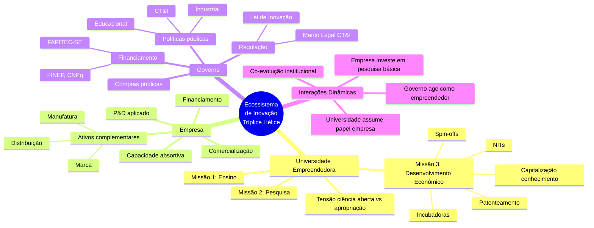
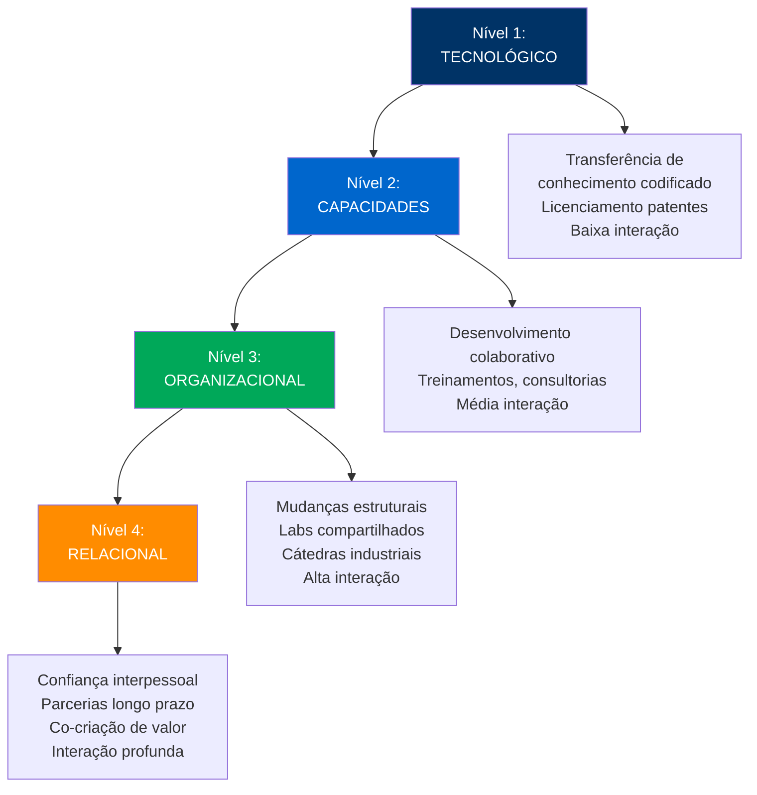
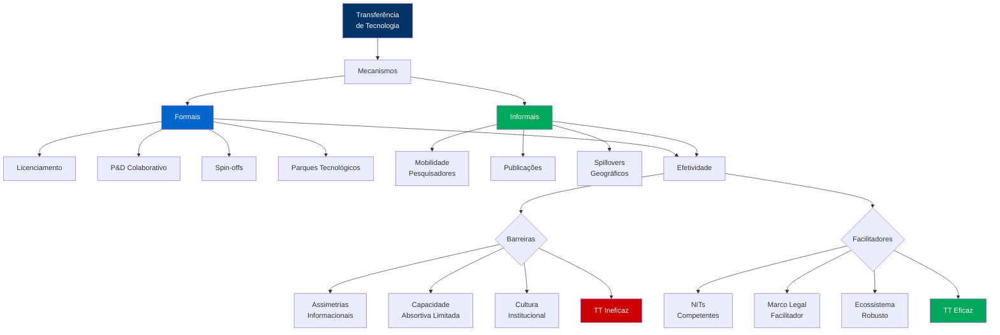

<!-- _class: lead -->

# Transferência de Tecnologia

## E Interação Universidade-Empresa

### Universidade Federal de Sergipe
**Concurso Público para Docente**

---

## 📋 Agenda da Aula

### Fundamentos (20 min)
1. Conceitos e modelos teóricos
2. Tríplice Hélice
3. Níveis de interação

### Mecanismos (20 min)
4. Formais: licenciamento, P&D, spin-offs
5. Informais: mobilidade, spillovers
6. Barreiras e facilitadores

### Contexto BR (10 min)
7. Marco Legal CT&I
8. Papel dos NITs

---

## 💡 Questão Provocativa

**Por que < 5% das patentes universitárias geram receitas significativas?**

📊 **Bradley et al. (2013)**: Licenciamento representa fração minoritária de TT efetiva. Contratos P&D colaborativo transferem mais conhecimento tácito e constroem capacidades duradouras.

<!-- 
NOTAS DO APRESENTADOR:
- Bradley et al. "Models and methods of university TT" (2013)
- EUA: apenas 50% patentes universitárias são licenciadas
- Receitas de licensing: 1-2% orçamento de pesquisa das universidades
- Valor real está em spillovers, mobilidade de talentos, P&D colaborativo
- Timing: 2 minutos
-->

---

## 🔄 Conceito de Transferência de Tecnologia

**Bozeman (2000)**: "Movimento de *know-how*, conhecimento técnico, ou tecnologia de uma organização para outra."

### Dimensões Críticas

#### Conhecimento Codificado
- Patentes
- Publicações
- Manuais técnicos
- Especificações

**Transferível** via documentos

#### Conhecimento Tácito
- Expertise
- Práticas
- Heurísticas
- "Saber fazer"

**Transferível** via interação pessoal

#### Capacidade Absortiva
- **Cohen & Levinthal (1990)**
- Reconhecer valor
- Assimilar conhecimento
- Aplicar comercialmente

**Pré-requisito** do receptor

⚠️ **Efetividade**: Medida não por transações formais, mas por **absorção e geração de valor** pelo receptor.

<!-- 
NOTAS:
- Bozeman, B. "Technology Transfer and Public Policy" (2000)
- Conhecimento tácito: difícil de codificar, transferível via mentoria, mobilidade
- Capacidade absortiva: empresa sem P&D não absorve tecnologia mesmo com licença
- Timing: 4 minutos
-->

---

## 🌐 Modelo da Tríplice Hélice (Etzkowitz, 2003)

<!-- 
NOTAS:
- Etzkowitz, H. "Research groups as 'quasi-firms'" (2003)
- Universidade empreendedora: capitaliza conhecimento sem abandonar missão acadêmica
- Tríplice Hélice: modelo não-linear, interações bidirecionais
- Extensões: Quádrupla (sociedade civil), Quíntupla (meio ambiente)
- Timing: 5 minutos
-->

---

## 📊 Quatro Níveis de Interação U-E (González & Moreno, 2024)

### Progressão e Apropriação de Valor

**Correlação positiva**: Níveis superiores → Maior profundidade de interação → Maior apropriação mútua de valor

<!-- 
NOTAS:
- González & Moreno "Four-level framework" (2024)
- Nível 1: transacional, pontual
- Nível 4: estratégico, duradouro
- Maioria das universidades opera em níveis 1-2
- Universidades top (MIT, Stanford) operam níveis 3-4
- Timing: 4 minutos
-->

---

## 👨‍🔬 Tipologias de Cientistas Acadêmicos (Perkmann et al., 2013)

### 1. Colaboradores Circunstanciais

**Perfil**: Engajamento esporádico com indústria
- Responde a oportunidades pontuais
- Prioriza pesquisa acadêmica
- Colaboração não sistemática

**Prevalência**: 30-40% dos pesquisadores

---

### 2. Independentes

**Perfil**: Foco exclusivo em pesquisa básica
- Resistem à aplicação industrial
- Valorizam autonomia acadêmica
- Publicação como objetivo primário

**Prevalência**: 20-30% (maior em ciências básicas)

### 3. Integrados

**Perfil**: Equilibram sistematicamente pesquisa fundamental e aplicada
- Colaborações de longo prazo
- Publicam E patenteiam
- Mentoria de pós-docs em projetos industriais

**Prevalência**: 25-35% (maior em engenharias)

---

### 4. Empreendedores Acadêmicos

**Perfil**: Criam proativamente spin-offs e patenteiam intensivamente
- Capitalizadores de conhecimento
- Múltiplas patentes e empresas
- Redes extensas indústria-academia

**Prevalência**: 5-10% (concentrados em biotech, TICs)

<!-- 
NOTAS:
- Perkmann et al. "Academic engagement and commercialisation" (2013)
- Distribuição varia por disciplina: engenharia tem mais Integrados/Empreendedores
- Incentivos institucionais moldam distribuição (tenure, promoção)
- Timing: 5 minutos
-->

---

## 🔧 Mecanismos Formais de Transferência

### 1. Licenciamento de Patentes

**Modalidades:**
- **Exclusivo**: Um licenciado, máximo retorno
- **Não-exclusivo**: Múltiplos, difusão ampla
- **Territorial**: Limitações geográficas

**Estrutura de Pagamento:**
- Upfront (adiantamento)
- Royalties (% vendas, tipicamente 3-10%)
- Milestones (pagamentos por metas)
- Mínimos garantidos

**Limitação**: < 50% patentes universitárias licenciadas (EUA)

---

### 2. Contratos P&D Colaborativo

**Vantagens:**
- Transferência contínua conhecimento tácito
- Ajustes iterativos durante projeto
- Constrói capacidades duradouras na empresa

**Formatos:**
- Pesquisa encomendada
- Desenvolvimento conjunto
- Consórcios multi-parceiros

**Resultado**: Valor superior a licenciamento puro

### 3. Spin-offs Acadêmicas

**Quando usar:**
- Tecnologias radicalmente novas
- Mercados embrionários
- Conhecimento tácito crítico
- Licenciamento inadequado

**Participação ICT:**
- Equity (5-20% típico)
- Royalties sobre tecnologias
- Uso de infraestrutura

**Taxa de Sucesso:** 30-40% (sobrevivem 5+ anos)

---

### 4. Parques Tecnológicos

**Infraestrutura Compartilhada:**
- Laboratórios
- Equipamentos
- Serviços de apoio

**Spillovers Geográficos:**
- Proximidade física facilita interações
- Acesso a talentos (pós-graduandos)
- Participação em seminários

**Exemplo BR:** Parque Tecnológico São José dos Campos (aerospace)

<!-- 
NOTAS:
- Bradley et al. (2013): P&D colaborativo > licenciamento em valor transferido
- Spin-offs: alta taxa falha, mas upside potencial maior
- Parques tecnológicos: sucesso depende de massa crítica de empresas + universidade ativa
- Timing: 6 minutos
-->

---

## 🌊 Mecanismos Informais e Spillovers

### Spillovers de Conhecimento

**Jaffe et al. (1993)**: Patentes industriais citam desproporcionalmente patentes universitárias da **mesma região**, evidenciando localização geográfica de spillovers.

### Mobilidade de Pesquisadores

**Fluxo de Conhecimento Tácito:**
- PhDs migram para indústria
- Pós-docs como ponte
- Professores em consultorias

**Impacto:** Transferência corporificada de expertise

---

### Publicações e Conferências

**Disseminação Aberta:**
- Resultados de pesquisa
- Metodologias
- Dados

**Apropriação:** Empresas com capacidade absortiva extraem valor

### Redes Profissionais

**Construção de Confiança:**
- Relacionamentos interpessoais
- Colaborações futuras
- Circulação de ideias

**Exemplo:** Alumni networks de MIT, Stanford

---

### Audretsch & Feldman (1996)

**Aglomeração Espacial:**
- Setores intensivos em conhecimento (biotech, eletrônica) se posicionam próximos a universidades
- Maximizam absorção via:
  - Contratação pós-graduandos
  - Acesso a equipamentos
  - Interações informais

<!-- 
NOTAS:
- Jaffe, Trajtenberg, Henderson "Geographic Localization of Knowledge Spillovers" (1993)
- Spillovers: 50% ocorrem em raio de 50 milhas da universidade
- Capacidade absortiva necessária: proximidade não basta
- Timing: 5 minutos
-->

---

## ⚠️ Barreiras à Transferência Efetiva

### Lado Universitário

#### Assimetrias Informacionais
- Pesquisadores **superestimam** valor comercial
- Desconhecem custos de desenvolvimento, produção, marketing
- TRL típico: 3-5 (longe de comercialização)

#### Capacidade de Gestão NITs
- **Heterogeneidade**: NITs grandes vs. pequenos
- Competências técnicas (valoração, contratos)
- Competências relacionais (articulação, confiança)

#### Cultura Institucional
- Tensão: Publicação vs. Patenteamento
- Incentivos desalinhados (tenure prioriza papers)
- Tempo de maturação de TT > ciclo de avaliação docente

#### Estratégia de PI
- Patentear vs. publicar?
- Licenciamento exclusivo vs. não-exclusivo?
- Spin-off vs. licenciamento?

### Lado Empresarial

#### Capacidade Absortiva Limitada
- **Cohen & Levinthal (1990)**: Sem P&D interno, empresa não absorve tecnologia externa
- Brasil: Apenas 1,6% empresas inovam (PINTEC 2020)
- P&D empresarial: 0,6% PIB (OCDE: 1,7%)

#### Recursos Financeiros
- Desenvolvimento adicional TRL 5 → TRL 9 custa 10-100x valor inicial
- Escassez de capital de risco no Brasil

#### Abertura à Inovação
- Cultura organizacional resistente a fontes externas
- Síndrome "Not Invented Here" (NIH)

#### Competências Complementares
- Manufatura, distribuição, marketing
- Necessárias para exploração comercial efetiva

**NITs como Organizações de Interface**: Traduzem linguagens técnicas e comerciais, mediam expectativas, constroem confiança entre lógicas institucionais distintas.

<!-- 
NOTAS:
- Assimetrias informacionais: principal barreira (ambos lados)
- NITs efetivos reduzem custos de transação em 40-60%
- Capacidade absortiva: sem P&D interno, licenciamento fracassa
- Timing: 6 minutos
-->

---

## 🇧🇷 Marco Legal de CT&I Brasileiro

### Lei 10.973/2004 (Lei de Inovação)

**Avanços:**
- Cooperação ICT-empresa regulamentada
- NITs obrigatórios
- Licenciamento de tecnologias
- Compartilhamento de infraestrutura

**Limitações:**
- Processos burocráticos
- Insegurança jurídica sobre titularidade
- Baixa flexibilidade

---

### Lei 13.243/2016 (Novo Marco CT&I)

**Simplificações:**
- ✅ Parcerias facilitadas
- ✅ Pesquisadores podem participar spin-offs
- ✅ Uso de infraestrutura laboratorial
- ✅ Remuneração por inovação
- ✅ Autonomia NITs

### Decreto 9.283/2018

**Operacionalização:**
- Procedimentos de valoração
- Instrumentos de parceria
- Ambientes de inovação
- Bônus tecnológico

---

### Desafios Persistentes

❌ **Burocracia** em contratação  
❌ **Backlog INPI** (10 anos concessão)  
❌ **Escassez capital de risco** para spin-offs  
❌ **Cultura** baixa proteção IP  
❌ **Capacidades heterogêneas** dos NITs

---

### Papel Central dos NITs

**Funções (Lei 10.973/2004):**
- Zelar pela PI da instituição
- Avaliar resultados de pesquisa
- Negociar acordos de TT
- Apoiar empreendedorismo acadêmico
- Promover parcerias

<!-- 
NOTAS:
- Lei 13.243/2016: resposta a críticas de engessamento da Lei 10.973
- Decreto 9.283/2018: operacionaliza flexibilizações
- NITs: 300+ cadastrados, mas apenas 50 ativos
- Desafio principal: construir capacidades de NITs pequenos
- Timing: 5 minutos
-->

---

## 📊 Caso Aplicado: UFS e Petrobras

### Contexto

**Parceria:** UFS + Petrobras (2018-2023)  
**Projeto:** Otimização de processos de extração em águas profundas  
**Investimento:** R$ 8,5 milhões (Petrobras 70%, FAPITEC 30%)

---

### Mecanismos Utilizados

#### P&D Colaborativo
- 3 laboratórios UFS dedicados
- 12 pesquisadores (6 UFS, 6 Petrobras)
- 20 pós-graduandos

#### Transferência de Conhecimento
- **Codificado**: 4 patentes depositadas (co-titularidade 50-50)
- **Tácito**: 8 engenheiros Petrobras treinados em UFS (6 meses)

#### Infraestrutura Compartilhada
- Simuladores de reservatórios
- Análise geoquímica

### Resultados (5 anos)

✅ **Tecnologia:** Algoritmo ML para predição falhas em equipamentos submarinos  
✅ **Redução custos:** 15% manutenção preventiva  
✅ **Economia anual:** R$ 12 milhões (Petrobras)  
✅ **Patentes:** 4 depositadas, 1 concedida  
✅ **Publicações:** 18 artigos (Q1/Q2)  
✅ **Formação:** 6 PhDs, 14 mestres

---

### Apropriação de Valor

**Petrobras:**
- Tecnologia proprietária (co-titularidade)
- Redução custos operacionais
- Acesso a expertise UFS

**UFS:**
- Receitas de licenciamento (previsão R$ 200k/ano)
- Equipamentos (R$ 2,5 mi)
- Fortalecimento P&D petróleo & gás
- Visibilidade nacional

---

### Fatores de Sucesso

🔑 Alinhamento estratégico (Petrobras + UFS)  
🔑 Capacidade absortiva mútua  
🔑 Governança clara (contrato 120 páginas)  
🔑 NITs ativos (Agitte.se)  
🔑 Continuidade (5 anos)

<!-- 
NOTAS:
- Caso real: parceria UFS-Petrobras em múltiplos projetos
- P&D colaborativo transfere mais valor que licenciamento isolado
- Co-titularidade: típica em parcerias públicas-privadas
- Investimento Petrobras retornou em 2 anos (economia de custos)
- Timing: 5 minutos
-->

---

## 🎓 Síntese Conceitual

---

## 🔑 Mensagens-Chave

### 1. TT é processo bilateral

Efetividade depende de capacidades tanto do **licenciador** (universidade) quanto do **licenciado** (empresa). Assimetrias informacionais são principal barreira.

### 2. Conhecimento tácito é crítico

P&D colaborativo > licenciamento isolado. Transferência de *know-how* corporificado (mobilidade, treinamento) supera documentos.

### 3. Capacidade absortiva é pré-requisito

Empresa sem P&D interno não absorve tecnologia mesmo com licença. Proximidade geográfica facilita, mas não substitui.

### 4. NITs como organizações de interface

Traduzem linguagens, mediam expectativas, constroem confiança entre lógicas institucionais distintas (academia vs. indústria).

### 5. Spillovers geograficamente localizados

Empresas se posicionam próximas a universidades para maximizar absorção via contratação, equipamentos, interações informais.

### 6. Marco Legal evoluiu, desafios persistem

Lei 13.243/2016 simplificou, mas burocracia, backlog INPI e escassez de VC limitam TT no Brasil.

<!-- 
NOTAS:
- TT eficaz requer alinhamento estratégico, capacidades mútuas, governança clara
- Brasil tem marco legal avançado, mas execução limitada por capacidades
- Timing: 2 minutos
-->

---

<!-- _class: lead -->

# 💬 Questões para Reflexão

1. **Como equilibrar missão acadêmica (publicação, ciência aberta) com capitalização de conhecimento (patentes, spin-offs)?**

2. **Quais estratégias NITs pequenos podem adotar para superar limitações de capacidade técnica e orçamentária?**

3. **De que forma políticas públicas podem estimular capacidade absortiva de PMEs brasileiras?**

4. **Como mensurar efetividade de TT além de métricas tradicionais (patentes, royalties)?**

---

<!-- _class: lead -->

# 📚 Referências Principais

**AUDRETSCH, D.; FELDMAN, M.** (1996). R&D Spillovers and the Geography of Innovation and Production. American Economic Review, 86(3), 630-640.

**BOZEMAN, B.** (2000). Technology Transfer and Public Policy: A Review of Research and Theory. Research Policy, 29(4-5), 627-655.

**BRADLEY, S. et al.** (2013). Models and Methods of University Technology Transfer. Foundations and Trends in Entrepreneurship, 9(6), 571-650.

**COHEN, W.; LEVINTHAL, D.** (1990). Absorptive Capacity: A New Perspective on Learning and Innovation. Administrative Science Quarterly, 35(1), 128-152.

**ETZKOWITZ, H.** (2003). Research Groups as 'Quasi-Firms': The Invention of the Entrepreneurial University. Research Policy, 32(1), 109-121.

**GONZÁLEZ, R.; MORENO, B.** (2024). Four-Level Framework of University-Industry Interaction. Journal of Technology Transfer (no prelo).

**JAFFE, A. et al.** (1993). Geographic Localization of Knowledge Spillovers. Quarterly Journal of Economics, 108(3), 577-598.

**PERKMANN, M. et al.** (2013). Academic Engagement and Commercialisation: A Review. Research Policy, 42(2), 423-442.

---

<!-- _class: lead -->

# Obrigado pela Atenção! 🎓

## Perguntas?

**Prof. [Seu Nome]**  
📧 email@ufs.br  
🔗 lattes.cnpq.br/[seu-lattes]

**Universidade Federal de Sergipe**  
Concurso Público - Gestão da Inovação Tecnológica

