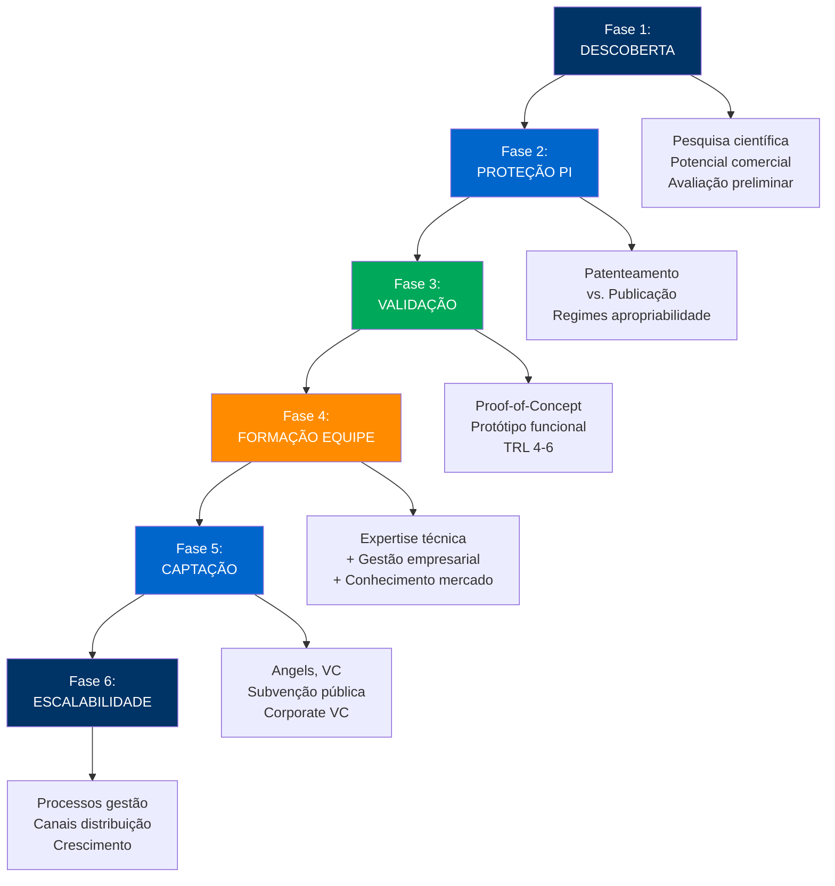
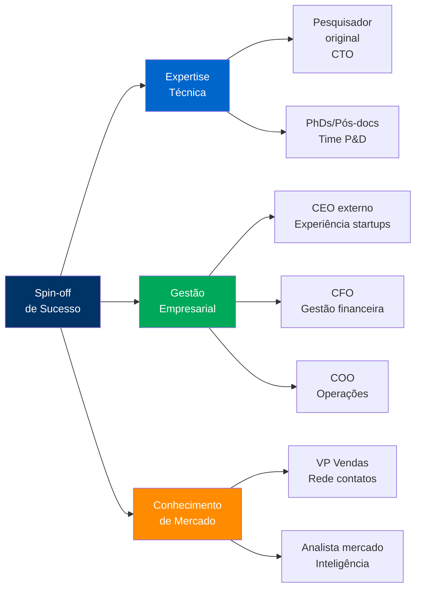
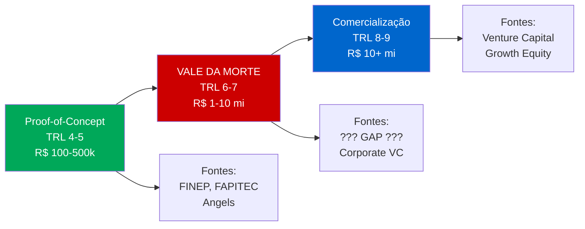
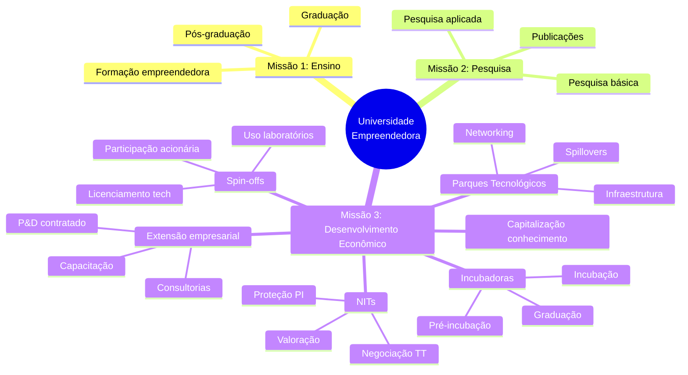
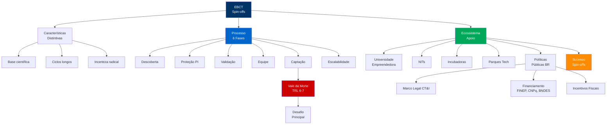

<!-- _class: lead -->

# Empreendedorismo de Base Científica

## E Spin-offs Acadêmicas

### Universidade Federal de Sergipe
**Concurso Público para Docente**

---

## 📋 Agenda da Aula

### Fundamentos (20 min)
1. EBCT: características distintivas
2. Processo de criação de spin-offs
3. Fases de desenvolvimento

### Ecossistema (20 min)
4. Universidade empreendedora
5. NITs, incubadoras, parques
6. Políticas públicas BR

### Perspectivas (10 min)
7. Desafios e oportunidades
8. Conclusões

---

## 💡 Questão Provocativa

**Por que apenas 30-40% das spin-offs acadêmicas sobrevivem 5+ anos?**

📊 **Shane (2004)**: Pesquisadores acadêmicos são excelentes cientistas, mas carecem de competências empresariais. Sucesso exige **equipes balanceadas**: expertise técnica + gestão + mercado.

<!-- 
NOTAS DO APRESENTADOR:
- Shane, S. "Academic Entrepreneurship" (2004)
- Taxa de falha: 60-70% em 5 anos (maior que startups tradicionais 50%)
- Razões: ciclos longos, incerteza técnica, equipes desbalanceadas
- Spin-offs bem-sucedidas: CEO externo + pesquisador como CTO
- Timing: 2 minutos
-->

---

## 🔬 Características Distintivas do EBCT

**Mustar et al. (2006)**: EBCT diferencia-se qualitativamente de empreendedorismo tradicional.

### Empreendedorismo Tradicional

**Base de Conhecimento:**
- Oportunidades de mercado existentes
- Modelos de negócio testados
- Know-how operacional

**Ciclo de Desenvolvimento:**
- Curto-médio prazo (6-24 meses)
- Produto/serviço maduro desde início

**Investimento:**
- Capital inicial moderado (R$ 50-500k)
- Risco mercadológico dominante

**Incerteza:**
- Demanda, concorrência, operações
- Reduzível via pesquisa de mercado

### EBCT (Empresas Base Científica)

**Base de Conhecimento:**
- **Descobertas científicas avançadas**
- **Tecnologias emergentes**
- **Pesquisa básica → aplicação**

**Ciclo de Desenvolvimento:**
- **Longo prazo (3-10 anos)**
- **TRL 1-3 → TRL 8-9**
- Proof-of-concept → escalabilidade

**Investimento:**
- **Capital intensivo (R$ 1-50 mi)**
- **P&D contínuo**
- Risco técnico + mercadológico

**Incerteza:**
- **Radical**: Tecnologia funcionará? Mercado existirá?
- **Não reduzível** facilmente

<!-- 
NOTAS:
- Mustar et al. "Conceptualising the heterogeneity of university spin-offs" (2006)
- EBCT: intensidade P&D 15-25% receita (vs. 2-5% tradicional)
- Exemplos BR: Movile, 99, Nubank (origem tech), vs. padarias, lojas (tradicional)
- Timing: 5 minutos
-->

---

## 🚀 Processo de Criação de Spin-offs (6 Fases)

<!-- 
NOTAS:
- Fases não são estritamente sequenciais (iterações)
- Fase 2 (PI): decisão crítica - patentear antes ou publicar?
- Fase 4 (Equipe): principal preditor de sucesso (CEO externo)
- Fase 5 (Captação): "Vale da Morte" - gap entre proof-of-concept e comercialização
- Timing: 5 minutos
-->

---

## 🎯 Fase 2: Proteção PI e Decisões Estratégicas

**Teece (1986)**: Decisão entre patentear, publicar ou segredo depende de **regimes de apropriabilidade setoriais**.

### Regime Forte → Patentear

**Setores:**
- Farmacêutico
- Biotecnologia
- Química fina

**Vantagens:**
- 20 anos exclusividade
- Barreira legal à imitação
- Sinalização para investidores
- Licenciamento viável

**Estratégia:** Patentear ANTES de publicar

### Regime Fraco → Segredo ou Velocidade

**Setores:**
- Software
- Eletrônica
- Serviços

**Vantagens:**
- Sem divulgação pública
- Sem custos de manutenção
- Contornos de patente difíceis

**Estratégia:** Segredo + lead-time + efeitos de rede

### Decisão Multicritério

**Fatores:**
1. **Facilidade engenharia reversa**
	- Fácil → Patentear
	- Difícil → Segredo

2. **Tamanho de mercado**
	- Grande → Patentear
	- Pequeno → Segredo (custos)

3. **Ciclo de vida**
	- Longo (10+ anos) → Patentear
	- Curto (< 5 anos) → Segredo

4. **Recursos financeiros**
	- Abundantes → PCT internacional
	- Limitados → BR apenas

<!-- 
NOTAS:
- Teece, D. "Profiting from technological innovation" (1986)
- Publicar antes de patentear: INVALIDA patente por perda de novidade
- Spin-offs tech: 80% têm pelo menos 1 patente (vs. 10% startups tradicionais)
- Timing: 5 minutos
-->

---

## 👥 Fase 4: Formação de Equipe Empreendedora

**Etzkowitz (2003)**: Equipes fundadoras de spin-offs bem-sucedidas balanceiam **expertise técnica profunda** + **competências empresariais** + **conhecimento de mercado**.

### Desbalanceamento Típico e Correções

**❌ Erro Comum:**
- Professor como CEO
- Equipe 100% técnica (PhDs)
- Ausência de expertise comercial

**Resultado:** Produto excelente, mas sem mercado

**✅ Boa Prática:**
- Professor como CTO (20-40% tempo)
- CEO externo com track record
- Board of Advisors (mentores)
- Recrutamento executivos profissionais

**Resultado:** Tecnologia + execução empresarial

<!-- 
NOTAS:
- Etzkowitz, H. "Research groups as quasi-firms" (2003)
- Dados: spin-offs com CEO externo têm 2x mais chance de sucesso
- Professor: melhor papel é CTO (20-40% dedicação), não CEO full-time
- Recrutamento: difícil para spin-offs (salários baixos início, equity incerto)
- Timing: 5 minutos
-->

---

## 💰 Fase 5: Captação de Recursos e "Vale da Morte"

### 💀 "Vale da Morte" (Valley of Death)

**Gap crítico**: Entre proof-of-concept (TRL 4-5) e comercialização (TRL 8-9)
- Tecnologia validada laboratorialmente
- **MAS**: Ainda não pronta para mercado
- **Requer**: R$ 1-10 milhões adicionais
- **Problema**: Risco alto para VCs, tarde para subvenção pública

### Instrumentos de Financiamento por Estágio

| Estágio | TRL | Valor | Fontes BR | Contrapartida |
|---------|-----|-------|-----------|---------------|
| **Seed** | 1-3 | R$ 50-200k | FINEP Centelha, FAPITEC, FFF | Subvenção 100% |
| **Pre-seed** | 4-5 | R$ 200k-1mi | Angels, FINEP Inovacred | Equity 10-20% |
| **Series A** | 6-7 | R$ 1-5mi | Seed VCs, Corporate VC | Equity 20-40% |
| **Series B+** | 8-9 | R$ 5-50mi | Venture Capital, Growth | Equity 10-30% |

<!-- 
NOTAS:
- Vale da Morte: principal causa de falha de spin-offs (60% morrem aqui)
- Brasil: gap TRL 6-7 (poucas fontes de R$ 1-5 mi para tech de risco)
- FFF: Friends, Family, Fools
- Corporate VC: Petrobras, Vale, Embraer (interesse estratégico)
- Timing: 5 minutos
-->

---

## 🏛️ Ecossistema de Apoio: Universidade Empreendedora

**Clark (1998) + Etzkowitz (2003)**: Universidade Empreendedora assume **terceira missão** de desenvolvimento econômico.

<!-- 
NOTAS:
- Clark, B. "Creating Entrepreneurial Universities" (1998)
- Tensão: Missão 3 não pode comprometer Missões 1 e 2
- Universidades top (MIT, Stanford, Cambridge): 10-20 spin-offs/ano
- Brasil: UFS ~2-3 spin-offs/ano, USP ~15/ano
- Timing: 4 minutos
-->

---

## 🏢 NITs, Incubadoras e Parques Tecnológicos

### NITs (Núcleos de Inovação Tecnológica)

**Funções Spin-offs:**
- Identificar tecnologias comercializáveis
- Proteger PI prévia
- Negociar licenciamento para spin-off
- Definir participação acionária ICT
- Acompanhar desenvolvimento

**Modelo de Participação:**
- **Equity**: 5-20% (típico 10%)
- **Royalties**: 3-10% vendas
- **Uso infraestrutura**: Subsidiado 2-5 anos

**Desafio BR:** Capacidades heterogêneas (NITs grandes vs. pequenos)

### Incubadoras

**Programas:**
- **Pré-incubação** (6 meses): Ideia → Modelo negócio
- **Incubação** (12-24 meses): MVP → Primeiros clientes
- **Graduação**: Scale-up → Crescimento

**Serviços:**
- Espaço físico subsidiado
- Mentoria especializada
- Rede de contatos (investidores, clientes)
- Capacitação (pitch, financeiro, jurídico)
- Acesso a equipamentos

**Taxa Sucesso:** 65% sobrevivem 5 anos (vs. 30% não-incubadas)

### Parques Tecnológicos

**Infraestrutura:**
- Laboratórios compartilhados
- Salas reunião
- Auditórios
- Serviços administrativos

**Spillovers Geográficos:**
- Proximidade universidade
- Acesso talentos (pós-graduandos)
- Seminários técnicos
- Interações informais

**Exemplo BR:**
- **Parque Tecnológico SJC** (aerospace): 120 empresas, 7.000 empregos
- **Porto Digital Recife** (TICs): 350 empresas, R$ 2,5 bi faturamento

<!-- 
NOTAS:
- NITs: 300+ cadastrados BR, mas apenas 50 ativos em spin-offs
- Incubadoras: 400+ no Brasil (ANPROTEC, 2024)
- Parques tecnológicos: 60+ em operação, 30+ em planejamento
- Proximity matters: spin-offs a < 50 km universidade têm 2x mais spillovers
- Timing: 6 minutos
-->

---

## 🇧🇷 Políticas Públicas Brasileiras para EBCT

### Marco Legal de CT&I

#### Lei 13.243/2016 + Decreto 9.283/2018

**Avanços para Spin-offs:**
- ✅ Pesquisadores podem participar de empresas (até 8h/semana ou 120 dias/ano)
- ✅ Compartilhamento infraestrutura laboratorial
- ✅ Bolsas de estímulo à inovação (não são salário)
- ✅ Licenciamento preferencial para spin-offs
- ✅ Participação acionária ICT regulamentada

**Participação do Pesquisador:**
- Sem prejuízo remuneração
- Declaração conflito interesses
- Compatibilização com atividades acadêmicas

---

### Financiamento Público

#### FINEP
- **Centelha**: Subvenção R$ 50k (seed)
- **Inovacred**: Crédito subsidiado R$ 200k-5mi
- **Subvenção**: Não-reembolsável até R$ 3mi

#### CNPq
- **Bolsas DTI**: Pesquisadores em empresas
- **RHAE**: Mestres/doutores em inovação

#### BNDES
- **Criatec**: Fundo de VC (R$ 300mi, 2023)
- **MPME Inovadoras**: Crédito até R$ 10mi

#### FAPITEC-SE
- **Subvenção econômica**: R$ 100-500k
- **Apoio spin-offs**: Até R$ 200k

---

### Incentivos Fiscais

#### Lei do Bem (11.196/2005)
- Dedução 60-100% gastos P&D do IR
- Redução IPI equipamentos
- Depreciação acelerada

#### LC 182/2021 (Marco Legal Startups)
- Investimento-anjo facilitado
- Sandbox regulatório
- Licitação diferenciada

<!-- 
NOTAS:
- Lei 13.243/2016: marco para participação pesquisadores em spin-offs
- Financiamento: fragmentado em múltiplos programas, difícil navegação para empreendedor
- Gap persistente: TRL 6-7 (R$ 1-5 mi)
- Lei do Bem: poucas startups usam (só lucro real)
- Timing: 5 minutos
-->

---

## 📊 Caso Aplicado: Spin-off UFS - BioMar.se

### Perfil

**Origem:** Pesquisa UFS (Biologia Marinha + Engenharia Química)  
**Fundação:** 2020  
**Tecnologia:** Bioprocesso para produção de colágeno marinho (pele peixes)  
**Mercado:** Cosméticos, nutracêuticos, biomedicina

---

### Trajetória (2018-2024)

#### 2018-2019: Descoberta (TRL 2-3)
- Pesquisa básica (tese doutorado)
- Identificação potencial comercial
- Busca anterioridade (sem patentes bloqueando)

#### 2020: Proteção PI (TRL 3-4)
- Depósito patente BR (co-titularidade UFS-inventores 50-50)
- Incubação CISE-UFS
- Equipe inicial: 2 pesquisadores + 1 eng. produção

#### 2021: Validação (TRL 4-5)
- Proof-of-concept laboratório
- Testes clínicos preliminares (irritação cutânea)
- Captação seed: FINEP Centelha R$ 50k + Angels R$ 150k

#### 2022: Formação Equipe (TRL 5-6)
- Recrutamento CEO (ex-gestor indústria farmacêutica)
- Pesquisador original → CTO (20% dedicação UFS)
- Board of Advisors: 3 mentores (dermatologia, regulatório, finanças)
- Captação Series A: R$ 1,2 mi (Seed VC + FAPITEC R$ 300k)

#### 2023: Escalabilidade (TRL 7-8)
- Planta piloto 500 L/mês
- Certificações (ANVISA, ISO)
- Primeiros clientes B2B (3 indústrias cosméticas)
- Faturamento: R$ 800k

#### 2024: Crescimento (TRL 8-9)
- Expansão 2.000 L/mês
- Faturamento: R$ 3,2 mi
- 18 funcionários
- Licenciamento tecnologia BA/PE: R$ 400k/ano

---

### Fatores de Sucesso

🔑 **PI robusta**: Patente + know-how processos  
🔑 **Equipe balanceada**: Tech (CTO) + Business (CEO)  
🔑 **Ecossistema**: CISE, Agitte.se, FAPITEC  
🔑 **Mercado existente**: Cosméticos (demanda estabelecida)  
🔑 **Apoio universidade**: Labs, equipamentos, bolsistas

<!-- 
NOTAS:
- Caso ilustra trajetória típica de spin-off bem-sucedida
- Papel CTO: pesquisador 20% tempo (compatível com carreira acadêmica)
- Financiamento escalonado: seed público → angels → VC
- Tempo total descoberta → comercialização: 6 anos (rápido para biotech)
- Timing: 5 minutos
-->

---

## 🎓 Síntese Conceitual

---

## 🔑 Mensagens-Chave

### 1. EBCT é qualitativamente distinto

Base científica + ciclos longos + incerteza radical exigem abordagens específicas vs. empreendedorismo tradicional.

### 2. Equipe balanceada é crítica

Professor como CTO, não CEO. Recrutar executivos com experiência empresarial. Balance: tech + business + mercado.

### 3. Vale da Morte é gargalo

Gap financiamento TRL 6-7 (R$ 1-5 mi). Brasil carece de fontes específicas para este estágio.

### 4. Ecossistema multidimensional

Universidade empreendedora + NITs + incubadoras + parques + políticas públicas. Sucesso depende de articulação.

### 5. Marco Legal evoluiu

Lei 13.243/2016 facilitou participação pesquisadores. Mas gaps persistem: financiamento, cultura, capacitação.

### 6. PI como ativo estratégico

Proteger ANTES de publicar. Patente sinaliza qualidade para investidores e viabiliza licenciamento.

<!-- 
NOTAS:
- Spin-offs: canal essencial de TT complementar a licenciamento
- Sucesso requer coordenação universidade-governo-mercado
- Brasil tem marco legal avançado, mas execução limitada (capacidades, recursos)
- Timing: 2 minutos
-->

---

<!-- _class: lead -->

# 💬 Questões para Reflexão

1. **Como equilibrar incentivos acadêmicos (publicações, tenure) com empreendedorismo (sigilo, spin-offs)?**

2. **Qual o modelo ideal de participação acionária da universidade em spin-offs: maximizar receita ou desenvolvimento regional?**

3. **De que forma universidades pequenas (como UFS) podem superar limitações de escala para gerar spin-offs competitivas?**

4. **Como preencher o "Vale da Morte" (TRL 6-7) com instrumentos financeiros adequados ao risco de tecnologias emergentes?**

---

<!-- _class: lead -->

# 📚 Referências Principais

**AUTIO, E.** (1997). New, Technology-Based Firms in Innovation Networks Symplectic and Generative Impacts. Research Policy, 26(3), 263-281.

**CLARK, B.** (1998). Creating Entrepreneurial Universities: Organizational Pathways of Transformation. Pergamon Press.

**DJOKOVIC, D.; SOUITARIS, V.** (2008). Spinouts from Academic Institutions: A Literature Review. Journal of Technology Transfer, 33(3), 225-247.

**ETZKOWITZ, H.** (2003). Research Groups as 'Quasi-Firms': The Invention of the Entrepreneurial University. Research Policy, 32(1), 109-121.

**LOCKETT, A.; WRIGHT, M.** (2005). Resources, Capabilities, Risk Capital and the Creation of University Spin-out Companies. Research Policy, 34(7), 1043-1057.

**MARTÍNEZ, A.; RIVERA, B.** (2023). Success Factors in University Spin-offs: A Systematic Literature Review. Journal of Technology Transfer, 48(4), 1245-1278.

**MUSTAR, P. et al.** (2006). Conceptualising the Heterogeneity of Research-Based Spin-offs. Research Policy, 35(2), 289-308.

**SHANE, S.** (2004). Academic Entrepreneurship: University Spinoffs and Wealth Creation. Edward Elgar.

---

<!-- _class: lead -->

# Obrigado pela Atenção! 🎓

## Perguntas?

**Prof. [Seu Nome]**  
📧 email@ufs.br  
🔗 lattes.cnpq.br/[seu-lattes]

**Universidade Federal de Sergipe**  
Concurso Público - Gestão da Inovação Tecnológica

