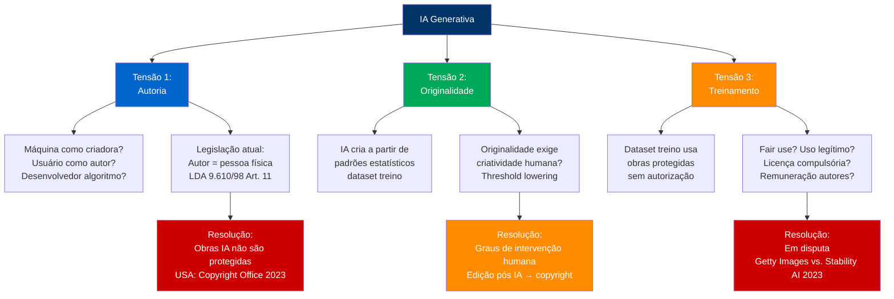
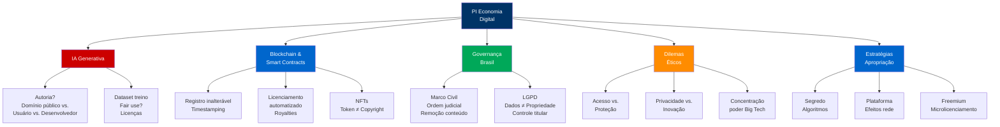

<!-- _class: lead -->

# Propriedade Intelectual

## Na Economia Digital

### Universidade Federal de Sergipe
**Concurso Público para Docente**

---

## 📋 Agenda da Aula

<div class="two-columns">

<div>

### Transformação Digital (20 min)
1. IA Generativa e PI
2. Blockchain e smart contracts
3. NFTs e ativos digitais

</div>

<div>

### Governança (20 min)
4. Marco Civil da Internet
5. LGPD e dados pessoais
6. Dilemas éticos

### Perspectivas (10 min)
7. Estratégias apropriação digital
8. Conclusões

</div>

</div>

---

## 💡 Questão Provocativa

<div class="center" style="font-size: 48px; margin-top: 100px;">

**Se uma IA cria uma obra de arte, quem é o autor?**

</div>

<div class="box-info" style="margin-top: 80px;">

🤖 **Al-Busaidi et al. (2024)**: IA Generativa desafia pressupostos fundamentais de PI: **originalidade** (criação humana), **autoria** (individualização) e **incentivo** (monopolia temporária motiva criadores). Resposta jurídica ainda em construção.

</div>

<!-- 
NOTAS DO APRESENTADOR:
- Al-Busaidi et al. "Generative AI and Intellectual Property" (2024)
- Casos emblemáticos: "Théâtre D'opéra Spatial" (Jason Allen, 2022, Midjourney) - venceu concurso arte digital, mas Copyright Office negou registro (criação não-humana)
- Monkey Selfie (Naruto vs. Slater, 2018): Selfie por macaco → sem copyright (criação não-humana)
- Analogia: Se animais não são autores, IA também não?
- Timing: 2 minutos
-->

---

## 🤖 IA Generativa: Desafios à PI Tradicional

<div class="box-destaque">

**Al-Busaidi et al. (2024)**: IA Generativa (GPT-4, DALL-E, Midjourney) expõe 3 tensões estruturais no sistema de PI.

</div>



<!-- 
NOTAS:
- Al-Busaidi et al. "Generative AI: Legal and ethical considerations" (2024)
- Copyright Office USA (2023): Obras 100% geradas por IA não têm copyright
- MAS: Obras com intervenção humana substancial (seleção, edição) podem ser protegidas
- Fair use: em teste judicial (Getty Images vs. Stability AI, The New York Times vs. OpenAI)
- Dataset training: 15 bilhões de imagens (LAION-5B) - muitas protegidas por copyright
- Timing: 5 minutos
-->

---

## ⚖️ Posicionamentos Jurídicos sobre Autoria de IA

<div class="three-columns">

<div>

### Posição 1: IA não é autora, obra é de domínio público

**Lógica:**
- Autoria requer intencionalidade humana
- Máquina = ferramenta (como câmera fotográfica)
- **Sem autor humano → sem proteção**

**Defensores:**
- Copyright Office (USA)
- Corte Justiça UE (orientação)
- Maioria doutrina jurídica

**Implicação:**
- Obras IA 100% automatizadas: **domínio público imediato**
- Não há monopólio temporário
- Uso livre por qualquer um

**Crítica:**
- Desincentiva investimento em IA
- Empresas desenvolvedoras não se apropriam de resultados

</div>

<div>

### Posição 2: Usuário é autor (se intervenção criativa)

**Lógica:**
- Usuário define prompt (input criativo)
- Usuário seleciona/edita resultados
- IA = ferramenta sofisticada

**Requisitos proteção:**
- Intervenção humana **substancial**
- Originalidade no processo (não só resultado)
- Documentação de contribuição humana

**Exemplo:**
- Prompt genérico ("cachorro bonito") → **NÃO**
- Prompt detalhado + 50 iterações + edição manual → **SIM**

**Crítica:**
- Difícil mensurar "substancialidade"
- Gera insegurança jurídica
- Litígios sobre threshold

</div>

<div>

### Posição 3: Desenvolvedor algoritmo é autor (sui generis)

**Lógica:**
- Criação de IA = criação intelectual
- Desenvolvedor define parâmetros, arquitetura, dataset
- **Proteção deslocada**: IA (software) vs. outputs

**Proposta:**
- Outputs IA: **direito conexo** (neighboring right)
- Similar a fonogramas, transmissões
- Prazo reduzido (10-20 anos vs. 70)

**Defensores:**
- Indústria tech (OpenAI, Google)
- Propostas legislativas (EU AI Act considera)

**Crítica:**
- Cria monopólio sem criatividade humana em outputs
- Favorece big techs (custos desenvolvimento)

</div>

</div>

<!-- 
NOTAS:
- Posição 1 (domínio público): dominante em jurisprudência USA, UE
- Posição 2 (usuário autor): Copyright Office adotou parcialmente (2023)
- Posição 3 (direito conexo): em discussão EU AI Act, sem consenso
- Brasil: LDA 9.610/98 não trata IA - interpretação análoga = Posição 1 (sem autor humano, sem proteção)
- Timing: 6 minutos
-->

---

## 📊 Casos Concretos: Jurisprudência Emergente

<div class="two-columns">

<div>

### Caso 1: "Zarya of the Dawn" (USA, 2023)

**Fatos:**
- Autora Kris Kashtanova criou graphic novel usando Midjourney
- Registrou copyright (inicial: concedido)
- Copyright Office revisou → **cancelamento parcial**

**Decisão:**
- **Texto**: Copyright protegido (criação humana)
- **Imagens IA**: **Não protegidas** (geradas automaticamente)
- **Arranjo/seleção**: Copyright protegido (contribuição humana)

**Lição:** Proteção "em camadas" - o que é humano vs. IA

---

### Caso 2: Getty Images vs. Stability AI (UK, 2023)

**Fatos:**
- Stability AI treinou modelo Stable Diffusion com 12 milhões de imagens Getty (protegidas)
- Uso sem autorização ou licença

**Alegação Getty:**
- Violação copyright (reprodução dataset treino)
- Violação trademark (marcas Getty apareciam em outputs)

**Status:** Em julgamento (UK High Court, 2024)

**Implicação:** Se Getty vencer, datasets treino exigirão licenças (encarece IA)

</div>

<div>

### Caso 3: The New York Times vs. OpenAI & Microsoft (USA, 2023)

**Fatos:**
- NYT alegou que GPT-4 foi treinado com milhões de artigos protegidos
- ChatGPT reproduz conteúdo NYT "quase verbatim"

**Alegação NYT:**
- Violação copyright (reprodução dataset)
- Concorrência desleal (ChatGPT substitui visitas ao site)
- Dano reputacional (alucinações atribuídas ao NYT)

**Status:** Em fase discovery (2024)

**Implicação:** Se NYT vencer, redefine "fair use" para IA - licenciamento obrigatório de conteúdo treino

---

### Caso 4: Artist vs. Midjourney (Class Action, USA, 2023)

**Fatos:**
- Artistas alegaram que Midjourney usou suas obras sem autorização
- Modelo pode replicar "estilo" de artistas específicos

**Questão:** **Estilo** é protegível por copyright?
- Resposta tradicional: **NÃO** (ideias não são protegidas, apenas expressões)
- MAS: IA replica expressões específicas (não apenas estilo abstrato)

**Status:** Em julgamento (California, 2024)

</div>

</div>

<!-- 
NOTAS:
- Zarya of the Dawn: primeiro caso com orientação detalhada Copyright Office (2023)
- Getty vs. Stability AI: teste central sobre "fair use" de datasets treino
- NYT vs. OpenAI: caso mais importante - pode obrigar licenciamento universal
- Artist class action: teste sobre "style transfer" (fronteira copyright vs. ideias)
- Brasil: sem casos julgados ainda - analogia por precedentes USA/UE
- Timing: 6 minutos
-->

---

## 🔗 Blockchain e Smart Contracts para Gestão de PI

<div class="box-destaque">

**Swan (2015) + Tapscott & Tapscott (2016)**: Blockchain oferece infraestrutura descentralizada para **registro**, **transferência** e **execução automatizada** de direitos de PI.

```mermaid
graph TB
    BC[Blockchain<br/>para PI] --> U1[Uso 1:<br/>Registro Inalterável]
    BC --> U2[Uso 2:<br/>Smart Contracts]
    BC --> U3[Uso 3:<br/>Rastreabilidade]
    
    U1 --> U1A[Timestamping<br/>Proof-of-Existence<br/>Anterioridade]
    U1 --> U1B[Custos menores<br/>vs. registros oficiais]
    U1 --> U1C[Exemplos:<br/>IPChain, Bernstein]
    
    U2 --> U2A[Licenciamento<br/>automatizado<br/>Sem intermediários]
    U2 --> U2B[Royalties automáticos<br/>Micropagamentos<br/>Transparência]
    U2 --> U2C[Exemplos:<br/>Ujo Music, Audius]
    
    U3 --> U3A[Supply chain<br/>produtos autênticos<br/>vs. falsificados]
    U3 --> U3B[Cada etapa registrada<br/>Blockchain imutável]
    U3 --> U3C[Exemplos:<br/>LVMH Aura, VeChain]
    
    BC --> D[Desafios]
    
    D --> D1[Escalabilidade<br/>10-100 tx/s vs. 1000+]
    D --> D2[Custos transação<br/>Ethereum gas fees]
    D --> D3[Validade jurídica<br/>Smart contracts = contratos?]
    D --> D4[Privacidade<br/>Blockchains públicos expõem dados]
    
    style BC fill:#003366,color:#fff
    style U1 fill:#0066CC,color:#fff
    style U2 fill:#00A859,color:#fff
    style U3 fill:#FF8C00,color:#fff
    style D fill:#CC0000,color:#fff
```

</div>



<!-- 
NOTAS:
- Swan, M. "Blockchain: Blueprint for a New Economy" (2015)
- Blockchain: imutabilidade + descentralização + transparência
- Proof-of-Existence: hash do arquivo + timestamp → prova anterioridade (admitido como evidência em tribunais USA, UE)
- Smart contracts: código executável automaticamente quando condições atingidas (ex: pagamento royalty quando música tocada)
- Ujo Music: plataforma blockchain para música (Imogen Heap lançou álbum 2015)
- LVMH Aura: 70+ marcas luxo (Louis Vuitton, Dior) rastreiam autenticidade via blockchain
- Timing: 5 minutos
-->

---

## 🎨 NFTs: Propriedade Digital e Confusões Jurídicas

<div class="two-columns">

<div>

### O que é um NFT (Non-Fungible Token)?

**Definição:**
- Token único em blockchain (ERC-721)
- Representa propriedade de ativo digital
- **NÃO** transfere copyright (equívoco comum)

**Estrutura Técnica:**

```
NFT (blockchain Ethereum)
├── Token ID: único
├── Metadata: URI arquivo (ex: IPFS hash)
├── Owner: wallet address
└── Smart Contract: regras transferência
```

**Exemplo:**
- NFT "Everydays" (Beeple): US$ 69 milhões (Christie's, 2021)
- Comprador adquiriu: **token NFT** + **arquivo JPEG**
- **NÃO adquiriu**: Copyright da imagem (Beeple retém)

---

### O que o NFT confere ao "proprietário"?

**Direito Adquirido:**
- ✅ Propriedade do **token blockchain** (único)
- ✅ Direito de **revender** o token
- ✅ **Bragging rights** (status, display em metaverso)

</div>

<div>

**Direito NÃO Adquirido (exceto se contrato explícito):**
- ❌ Copyright (reprodução, distribuição)
- ❌ Uso comercial (merchandising, derivados)
- ❌ Direitos morais (paternidade, integridade)

**Implicação:** Comprador de NFT **não pode**:
- Imprimir e vender pôsteres da imagem
- Criar merchan (camisetas, canecas)
- Licenciar para terceiros

**Exceto:** Se smart contract do NFT licenciar explicitamente (ver CC0, CC BY)

---

### Confusão Jurídica: Yuga Labs (Bored Ape Yacht Club)

**Caso:**
- Yuga Labs vendia NFTs de macacos (BAYC)
- **Conferiam** ao comprador: Copyright + uso comercial irrestrito
- Raro na indústria NFT

**Resultado:**
- Compradores criaram derivados: restaurantes, cervejas, animações
- Estratégia marketing (engajamento comunidade)

**MAS:** Maioria NFTs **NÃO** transfere copyright - compradores confusos

</div>

</div>

<!-- 
NOTAS:
- NFT: Non-Fungible Token - único, não intercambiável (vs. fungible = Bitcoin, Ether)
- ERC-721: padrão Ethereum para NFTs
- IPFS: InterPlanetary File System (armazenamento descentralizado)
- Mercado NFT: US$ 24 bi (2023), mas 95% sem valor secundário (especulação)
- Confusão copyright: 80% compradores NFT acreditam que adquirem copyright (pesquisa 2022)
- CC0: Creative Commons Zero (domínio público)
- Timing: 5 minutos
-->

---

## 🇧🇷 Marco Civil da Internet e PI Digital no Brasil

<div class="box-destaque">

**Lei 12.965/2014 (Marco Civil da Internet)**: Estabelece princípios, garantias, direitos e deveres para uso da Internet no Brasil.

</div>

<div class="two-columns">

<div>

### Princípios Relevantes para PI

#### Art. 3º - Fundamentos

I. **Liberdade de expressão**
- Tensão com direitos autorais (remoção conteúdo)

II. **Neutralidade de rede**
- Provedores não podem discriminar conteúdo
- **MAS**: podem remover conteúdo ilícito (pirataria)

III. **Responsabilidade dos agentes**
- Definida Art. 18-21 (regime complexo)

---

### Responsabilidade de Provedores (Art. 19)

**Regra Geral:**
- Provedor de aplicação **não é responsável** por conteúdo de terceiros
- **Exceto**: se não remover após **ordem judicial específica**

**Processo:**
1. Titular PI identifica violação (ex: vídeo pirata YouTube)
2. Notifica provedor (extrajudicial: **sem efeito legal**)
3. **Requer ordem judicial**
4. Juiz analisa → concede ordem específica
5. Provedor remove em **prazo judicial**

</div>

<div>

**Comparação Internacional:**

| País | Regime | Notice-and-Takedown |
|------|--------|---------------------|
| **Brasil** | Ordem judicial obrigatória | ❌ NÃO |
| **USA** | DMCA Safe Harbor | ✅ SIM (extrajudicial) |
| **UE** | E-Commerce Directive | ✅ SIM (extrajudicial) |

**Crítica ao Modelo BR:**
- Lento (meses para ordem judicial)
- Custoso (advogado, juízo)
- Inadequado para escala (milhões violações/dia)

**Exceção: Imagens Íntimas (Art. 21)**
- Remoção **sem ordem judicial** (notificação extrajudicial suficiente)
- Prazo: 24 horas
- Tutela de privacidade > PI

---

### Aplicação à PI

**Vídeos piratas (YouTube, Vimeo):**
- ❌ Notificação DMCA não funciona no BR
- ✅ Requer ação judicial

**Software pirata (download sites):**
- ❌ Notice-and-takedown não existe
- ✅ Ordem judicial obrigatória

**Livros escaneados (Google Books):**
- Polêmica: Google Books operou sem autorizações
- BR: Autores precisariam de múltiplas ações judiciais

</div>

</div>

<!-- 
NOTAS:
- Marco Civil: Lei 12.965/2014 - marco regulatório Internet Brasil
- Art. 19: regime de responsabilidade "judicial notice-and-takedown" (único no mundo)
- DMCA (USA): Digital Millennium Copyright Act - notice extrajudicial suficiente
- Crítica: Brasil prioriza liberdade expressão > direitos autorais (vs. USA/UE)
- Google Books: digitalizou 25 milhões livros sem autorização - USA: fair use; BR: ilícito
- Timing: 5 minutos
-->

---

## 🔒 LGPD e Dados Pessoais como "Novo Petróleo"

<div class="box-destaque">

**Lei 13.709/2018 (LGPD)**: Regula tratamento de dados pessoais, inclusive em meios digitais. Inspirada na GDPR europeia (2016).

</div>

<div class="two-columns">

<div>

### Dados Pessoais vs. PI Tradicional

**Pergunta:** Dados pessoais são propriedade intelectual?

**Resposta tradicional:**
- ❌ **NÃO** - dados "brutos" não têm originalidade
- Proteção via **direito à privacidade** (personalíssimo), não PI

**MAS:** Big Data e IA mudaram lógica econômica:
- Dados agregados = **ativo econômico valioso**
- Facebook, Google: valuation baseado em dados usuários
- **"Novo petróleo"** (The Economist, 2017)

---

### Tensão: Proteção vs. Exploração

**Modelo LGPD (Art. 7-11):**

| Princípio | Implicação PI |
|-----------|---------------|
| **Finalidade** | Dados coletados para objetivo específico (não reutilização irrestrita) |
| **Necessidade** | Minimização (não acumulação especulativa) |
| **Consentimento** | Titular controla uso (vs. propriedade empresa) |

</div>

<div>

**Modelo Economia de Dados:**
- Empresas querem **propriedade** de dados (ativos balanço)
- LGPD nega propriedade → dados permanecem do **titular**
- Empresa tem apenas **autorização temporária** de tratamento

**Consequência:** Clash de lógicas
- PI: exclusividade (proprietário exclui terceiros)
- LGPD: controle titular (empresa é "processadora", não "proprietária")

---

### Casos Concretos BR

#### Caso 1: Serasa Experian (ANPD, 2023)

**Fatos:**
- Serasa vendia "scores de crédito" derivados de dados pessoais
- Não solicitava consentimento explícito

**Decisão ANPD:**
- ❌ Violação LGPD Art. 7º (ausência consentimento)
- Multa: R$ 8 milhões

**Lição:** Dados derivados (scores, perfis) também requerem consentimento

#### Caso 2: Hospital Einstein vs. Google (2022)

**Fatos:**
- Google treinou IA médica com prontuários Einstein
- Consentimento pacientes: ambíguo

**Resultado:** Investigação ANPD (ainda em curso, 2024)

</div>

</div>

<!-- 
NOTAS:
- LGPD: vigência agosto 2020 - inspirada GDPR europeia
- "Novo petróleo": The Economist 2017 - dados > petróleo em valor econômico
- ANPD: Autoridade Nacional de Proteção de Dados (2019)
- Clash: empresas querem dados como propriedade (IP) vs. LGPD dados como extensão personalidade
- Serasa: primeiro caso emblemático ANPD com multa significativa
- Einstein-Google: em segredo investigativo, mas levanta questão: consentimento médico cobre uso IA?
- Timing: 6 minutos
-->

---

## ⚖️ Dilemas Éticos na PI Digital

<div class="three-columns">

<div>

### Dilema 1: Acesso vs. Proteção

**Tensão:**
- PI forte → incentiva criação
- **MAS** → restringe acesso (preços altos, paywall)

**Economia Digital:**
- Custo marginal reprodução = **zero** (software, ebooks, música)
- Preço ótimo social = custo marginal = **zero**
- **MAS**: Sem receita → sem criação

**Soluções Experimentais:**
- **Freemium**: Básico grátis + Premium pago
- **Patreon/Apoia.se**: Apoio direto criadores
- **Open Access**: Publicação científica (financiado por taxas processamento)

**Exemplo BR:** SciELO (Scientific Electronic Library Online)
- 1.200+ periódicos open access
- Financiamento público (FAPESP, CNPq)
- Acesso universal vs. Elsevier (paywall)

</div>

<div>

### Dilema 2: Privacidade vs. Inovação

**Tensão:**
- IA requer **dados massivos** treino
- LGPD restringe coleta/uso dados
- **Conflict**: Inovação IA vs. Privacidade

**Exemplo:**
- **AlphaFold** (DeepMind, 2021): IA prevê estrutura proteínas
- Treinou com Protein Data Bank (170k estruturas **públicas**)
- **SE** estruturas fossem privadas (LGPD/GDPR) → AlphaFold impossível?

**Soluções:**
- **Anonimização** (técnicas k-anonymity, differential privacy)
- **Dados sintéticos** (gerados artificialmente, preservam padrões)
- **Federated Learning** (treino descentralizado, sem centralizar dados)

**Desafio:** Anonimização perfeita = **impossível** (estudo MIT 2019: 99,98% pessoas re-identificáveis com 15 atributos)

</div>

<div>

### Dilema 3: Concentração de Poder

**Tensão:**
- IA generativa = capital-intensivo (US$ 100 milhões treinar GPT-4)
- **Apenas** Big Techs podem desenvolver modelos fronteira
- Concentração poder econômico + político

**Consequências:**
- **Lock-in** usuários (dependência OpenAI, Google)
- **Barreira entrada** startups (custos proibitivos)
- **Controle narrativa** (quem treina modelo define vieses)

**Exemplo:** GPT-4 (OpenAI)
- Custo estimado treino: **US$ 100 milhões**
- Apenas 5 empresas podem: OpenAI, Google, Meta, Anthropic, Microsoft
- Startups dependem de APIs (subserviência)

**Soluções Propostas:**
- **Open source** modelos (Meta Llama 2, Mistral)
- **Regulação antitruste** (impedir fusões tech)
- **Financiamento público** IA (democratizar acesso)

</div>

</div>

<!-- 
NOTAS:
- Dilema 1: Tension Arrow vs. Landes-Posner (incentivo vs. acesso)
- Freemium: 95% users free, 5% premium (sustenta modelo)
- SciELO: Brasil líder global open access (1.200 periódicos)
- Dilema 2: AlphaFold resolveu problema 50 anos biologia molecular
- Federated Learning: usado por Google (Gboard) - treina sem centralizar dados usuários
- Dilema 3: GPT-4 consumiu 50 gigawatt-hora energia (10.000 lares/mês)
- Timing: 6 minutos
-->

---

## 🛡️ Estratégias de Apropriação na Economia Digital

<div class="two-columns">

<div>

### Modelos Tradicionais (PI Formal)

#### 1. Patentes Software (controverso)
- **USA**: Aceita (se "inovação técnica")
- **UE**: Restrições (software "como tal" não patenteável)
- **Brasil**: INPI raramente concede (software = direito autoral)

**Eficácia Digital:** ⚠️ **Baixa**
- Engenharia reversa difícil
- Ciclos inovação rápidos (patente demora 3-5 anos)

#### 2. Direitos Autorais (Software, Conteúdo)
- Proteção automática (independe registro)
- Prazo: 70 anos pós-morte autor (música, livro) / 50 anos (software)

**Eficácia Digital:** ⚠️ **Média**
- Pirataria endêmica (custo enforcement alto)
- DRM (Digital Rights Management): contornável

#### 3. Segredo de Negócio (Algoritmos)
- Algoritmos não divulgados (ex: Google Search, TikTok feed)
- Prazo: ilimitado (enquanto mantido secreto)

**Eficácia Digital:** ✅ **Alta**
- Engenharia reversa dificultada por cloud computing
- **MAS**: Perda se disclosure (ex: código vazado GitHub)

</div>

<div>

### Modelos Emergentes (Estratégias Abertas)

#### 4. Open Source + Dual Licensing
- **Modelo:** Core open source (GPL) + Versão Enterprise (proprietária)
- **Exemplo:** MySQL, MongoDB, GitLab

**Lógica:**
- Comunidade desenvolve/testa gratuitamente
- Empresas pagam por suporte, features avançadas

**Eficácia:** ✅ **Alta** (sustentabilidade + inovação distribuída)

#### 5. Platform Strategies (Efeitos de Rede)
- **Lógica:** Valor cresce com número usuários (n² - Lei Metcalfe)
- Proteção não por PI legal, mas por **lock-in** tecnológico
- **Exemplo:** WhatsApp (2 bilhões usuários - switching cost alto)

**Eficácia:** ✅ **Muito Alta** (dominância mercado)

#### 6. Freemium + Microlicenciamento
- **Modelo:** Básico grátis (cativa usuários) + Premium features
- **Exemplo:** Spotify (freemium ads vs. Premium R$ 21,90/mês)

**Eficácia:** ✅ **Alta** (conversão 5-10% → receita robusta)

---

### Comparação Eficácia

| Estratégia | Custo Impl. | Eficácia Digital | Exemplos BR |
|------------|-------------|------------------|-------------|
| **Patente Software** | Alto | ⚠️ Baixa | Raro |
| **Direitos Autorais** | Baixo | ⚠️ Média | Música streaming |
| **Segredo Negócio** | Médio | ✅ Alta | PicPay (algoritmo risco) |
| **Open Source** | Baixo | ✅ Alta | Locaweb (contribui Linux) |
| **Platform** | Muito Alto | ✅ Muito Alta | Mercado Livre, iFood |
| **Freemium** | Médio | ✅ Alta | Nubank (conta grátis + Premium) |

</div>

</div>

<!-- 
NOTAS:
- Patentes software BR: INPI raramente concede (entende que software = direito autoral por LDA 9.610/98)
- DRM: Sistemas gestão direitos digitais (ex: iTunes DRM, Kindle DRM) - todos foram quebrados
- Google Search: algoritmo PageRank patenteado (1998), mas evoluções mantidas secretas
- Open Source: Red Hat (comprada IBM US$ 34 bi, 2019) - prova que open source = lucrativo
- Metcalfe's Law: valor rede = n² (conexões possíveis)
- Freemium: Spotify converteu 44% base gratuita em Premium (2023) - taxa excepcionalmente alta
- Timing: 6 minutos
-->

---

## 📊 Caso Aplicado: Nubank e PI na Fintech

<div class="two-columns">

<div>

### Perfil

**Fundação:** 2013 (David Vélez, Cristina Junqueira, Edward Wible)  
**Setor:** Fintech (banco digital)  
**Valuation:** US$ 45 bilhões (IPO 2021, NYSE)  
**Usuários:** 90 milhões (2024, BR+MX+CO)

---

### Base Tecnológica

**Stack Proprietário:**
- Core banking 100% nuvem (AWS)
- Machine Learning (credit scoring, fraud detection)
- Arquitetura microserviços (Clojure, Scala, Python)

**Diferencial:** Zero legado (vs. bancos tradicionais com COBOL 1970s)

---

### Estratégias de Apropriação

#### 1. Segredo de Negócio (Principal)

**Algoritmos Críticos:**
- **Credit scoring** (aprova 60% dos recusados por bancos tradicionais)
- **Fraude detection** (taxa fraude 0,01% vs. 0,3% mercado)
- **Churn prediction** (retenção 95% clientes)

**Não patenteados:** Engenharia reversa impossível (cloud + encryption)

</div>

<div>

#### 2. Plataforma e Efeitos de Rede

**Estratégia:**
- Cartão de crédito sem anuidade (freemium)
- **90 milhões usuários** → maior base BR
- Lock-in: Portabilidade bancária difícil (psicológica, não técnica)

**Network Effects:**
- Custo aquisição cliente: R$ 5 (vs. R$ 500 bancos tradicionais)
- Marketing boca-a-boca (70% novos clientes por indicação)

#### 3. Dados Proprietários (Assets Estratégicos)

**Dataset:**
- 90 milhões perfis financeiros
- 5 bilhões transações/ano
- Treina modelos ML continuamente

**Conformidade LGPD:**
- Consentimento explícito opt-in
- Anonimização para analytics
- Transparência algoritmos (explainability)

#### 4. Marca (Trademark + Trade Dress)

**Roxo Nu:** Trademark INPI 906923929 (2013)
- Cor exclusiva setor financeiro BR
- Alto valor (reconhecimento 95% população)

**Trade Dress:** Interface app (minimalista, amigável)

---

### Resultados

**Crescimento:** 0 → 90 milhões users (11 anos) - **mais rápido do mundo**  
**Valuation:** US$ 45 bi (10ª fintech global)  
**Lucro:** US$ 1,2 bi (2023) - 1º ano lucro líquido

</div>

</div>

<!-- 
NOTAS:
- Nubank: unicórnio BR mais valioso (US$ 45 bi IPO 2021)
- Credit scoring: algoritmo usa 1.000+ variáveis (vs. 50-100 bancos tradicionais, baseados em histórico Serasa)
- Dados: principal ativo estratégico - dataset cresce exponencialmente com usuários
- LGPD: Nubank compliance desde 2018 (2 anos antes vigência) - confiança usuários
- Roxo Nu (Pantone 2617 C): registrado como trademark - estratégia branding
- Caso ilustra shift: PI formal (patentes) → estratégias informais (segredo, plataforma, dados)
- Timing: 5 minutos
-->

---

## 🎓 Síntese Conceitual



---

## 🔑 Mensagens-Chave

<div class="three-columns">

<div>

### 1. IA desafia fundamentos de PI

Autoria (criação humana?), originalidade (estatística vs. criatividade), dataset treino (fair use?). Resposta jurídica em construção - próxima década definirá precedentes.

</div>

<div>

### 2. Blockchain = infraestrutura, não solução mágica

Registro, rastreabilidade, smart contracts úteis. **MAS**: escalabilidade, custos, validade jurídica ainda limitam adoção massiva. NFT ≠ Copyright (confusão comum).

</div>

<div>

### 3. Brasil: modelo singular (judicial notice-and-takedown)

Marco Civil prioriza liberdade expressão > PI. Consequência: Remoção lenta, custosa vs. USA/UE. Adequação ao contexto digital questionável.

</div>

</div>

<div class="three-columns" style="margin-top: 30px;">

<div>

### 4. LGPD: dados NÃO são propriedade

Clash modelo: Empresas querem "propriedade" dados (ativos) vs. LGPD = controle titular (personalíssimo). Tensão persistirá (economia de dados vs. privacidade).

</div>

<div>

### 5. Dilemas éticos estruturais

Acesso vs. proteção (custo marginal zero), privacidade vs. inovação (IA precisa dados), concentração poder (Big Tech domina IA). Sem soluções consensuais.

</div>

<div>

### 6. Estratégias informais superam PI formal

Economia digital: Segredo > patentes, plataforma > copyright, freemium > licenças tradicionais. Nubank exemplo: zero patentes, US$ 45 bi valuation (segredo + dados + rede).

</div>

</div>

<!-- 
NOTAS:
- PI digital: transição paradigmática em curso (10-20 anos para consolidação)
- Próximos marcos: Decisão Getty vs. Stability AI, NYT vs. OpenAI (2024-2025)
- Brasil: potencial protagonismo (SciELO open access, LGPD) vs. atraso (judicial notice-and-takedown)
- Futuro: PI formal (patentes, copyright) menos relevante vs. estratégias abertas + dados + plataformas
- Timing: 2 minutos
-->

---

<!-- _class: lead -->

# 💬 Questões para Reflexão

<div style="font-size: 36px; text-align: left; max-width: 900px; margin: auto;">

1. **Deveria o Brasil adotar notice-and-takedown extrajudicial (modelo USA/UE) para violações de PI digital, ou manter exigência de ordem judicial (liberdade expressão)?**

2. **Como equilibrar incentivo à inovação em IA (acesso a datasets massivos) com proteção de direitos autorais (criadores originais)?**

3. **Dados pessoais agregados deveriam ser tratados como propriedade intelectual (apropriação empresas) ou permanecer como direito personalíssimo (controle titular)?**

4. **Estratégias de apropriação abertas (open source, freemium) são mais eficazes na economia digital que PI formal (patentes, copyright)?**

</div>

---

<!-- _class: lead -->

# 📚 Referências Principais

<div style="font-size: 24px; text-align: left; max-width: 1000px; margin: auto; line-height: 1.8;">

**AL-BUSAIDI, A. et al.** (2024). Generative AI and Intellectual Property Rights: A Roadmap for Legal and Ethical Frameworks. IEEE Access, 12, 15234-15256.

**LIEVENS, E.; VERDOODT, V.** (2017). Looking for Needles in a Haystack: Key Issues Affecting the Exercise of Data Protection Rights. Computer Law & Security Review, 33(3), 342-355.

**ROSENBLATT, B. et al.** (2002). Digital Rights Management: Business and Technology. John Wiley & Sons.

**SWAN, M.** (2015). Blockchain: Blueprint for a New Economy. O'Reilly Media.

**TAPSCOTT, D.; TAPSCOTT, A.** (2016). Blockchain Revolution: How the Technology Behind Bitcoin is Changing Money, Business, and the World. Penguin.

**BRASIL.** Lei nº 12.965, de 23 de abril de 2014. Marco Civil da Internet.

**BRASIL.** Lei nº 13.709, de 14 de agosto de 2018. Lei Geral de Proteção de Dados Pessoais (LGPD).

**US COPYRIGHT OFFICE.** (2023). Copyright Registration Guidance: Works Containing Material Generated by Artificial Intelligence. Federal Register, 88(51).

</div>

---

<!-- _class: lead -->

# Obrigado pela Atenção! 🎓

## Perguntas?

<div style="margin-top: 80px; font-size: 28px;">

**Prof. [Seu Nome]**  
📧 email@ufs.br  
🔗 lattes.cnpq.br/[seu-lattes]

**Universidade Federal de Sergipe**  
Concurso Público - Gestão da Inovação Tecnológica

</div>
