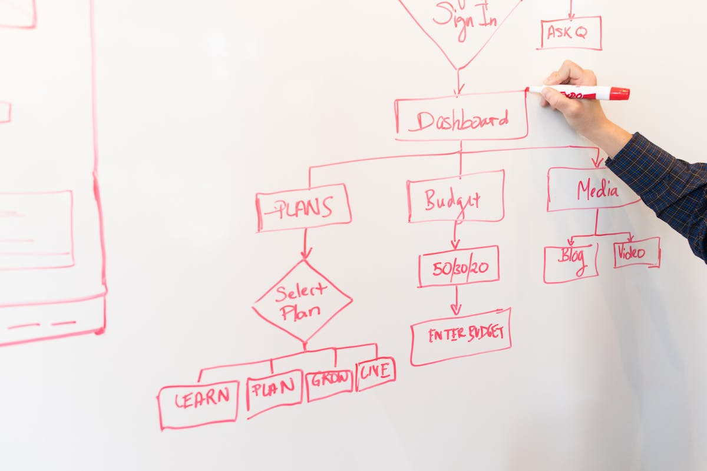

# [Introdução]{.section-header}

::: {style="text-align: right; padding-top: 10px; padding-right: 50px;"}
{width="25%"}
:::

---

## A Inovação como Imperativo Estratégico {.smaller-text}

::: {.columns}
::: {.column width="50%"}
### Definição de Schumpeter (1942)

**Destruição Criativa**: Introdução de:
- Novos bens
- Novos métodos de produção
- Abertura de novos mercados
- Novas fontes de matéria-prima
- Reorganização industrial

::: {.info-box}
"Motor da destruição criativa"
:::
:::

::: {.column width="50%"}
### Evolução Teórica

**Fundamentos**
- Schumpeter: Destruição criativa
- Freeman (1987): Sistemas nacionais
- Lundvall (1992): Sistemas de inovação

**Paradigmas Contemporâneos**
- Inovação Aberta (Chesbrough, 2003)
- Capacidades Dinâmicas (Teece, 2007)
- Ecossistemas (Adner, 2006)
:::
:::

---

## Campo Multidisciplinar da Gestão da Inovação {.smaller-text}

::: {.columns}
::: {.column width="60%"}
### Características Fundamentais

**Natureza Multidisciplinar**
- Teorias organizacionais
- Economia da inovação
- Gestão estratégica

**Cenário Contemporâneo**
- Intensa volatilidade
- Rápida transformação digital
- Conhecimento como vantagem competitiva

**Requisitos Gerenciais**
- Mecanismos robustos
- Processos sistemáticos
- Governança estruturada
:::

::: {.column width="40%"}
::: {.highlight-box}
**Sistemas Integrados
**

Diretrizes para formalizar:
- Governança
- Atividades inovativas
- Mensuração de resultados
- Otimização de ROI

**Objetivo**: Transformar esforços em processos sustentáveis
:::
:::
:::

# [ISO 56002: Contexto e Liderança]{.section-header}

::: {style="text-align: right; padding-top: 10px; padding-right: 50px;"}
{width="25%"}
:::

---

## Governança e Alinhamento Estratégico {.smaller-text}

::: {.columns}
::: {.column width="50%"}
### Cláusula 4: Contexto da Organização

**Análise do Ambiente**
- Partes interessadas
- Contexto interno e externo
- Escopo do SGI

### Cláusula 5: Liderança

**Princípio 2**: Líderes focados no futuro
- Inspirar e engajar equipes
- Equilibrar curto e longo prazo
- Investimento no futuro
:::

::: {.column width="50%"}
### Cláusula 6: Direção Estratégica

**Alinhamento Estratégico**
- Visão de inovação
- Objetivos estratégicos
- Política de inovação

::: {.info-box}
**Evolução dos Modelos**
- 1ª Geração: Linear (Rothwell, 1994)
- 3ª Geração: Sistêmico
- Atual: Inovação Aberta
:::
:::
:::

---

## Inovação Aberta (Chesbrough, 2003) {.smaller-text}

::: {.columns}
::: {.column width="55%"}
### Conceito Central

::: {.highlight-box}
"Construir modelo de negócio superior é mais importante que chegar primeiro ao mercado"
:::

**Paradigma da Inovação Aberta**
- Transcende P&D interna
- Valoriza conhecimento externo
- Explora PI estrategicamente
- Colaboração interorganizacional

**Impacto na Direção Estratégica**
- Redefine limites da organização
- Amplia fontes de conhecimento
- Diversifica rotas de mercado
:::

::: {.column width="45%"}
### Pré-requisitos

**Capacidade Absortiva** (Cohen & Levinthal, 1990)

::: {.info-box}
Habilidade de:
- Reconhecer valor da informação externa
- Assimilar conhecimento
- Aplicar comercialmente
:::

**Características**
- *Path-dependent* (cumulativa)
- Construída ao longo do tempo
- Essencial para spillovers
:::
:::

---

## Capacidade Absortiva: Função Dual da P&D {.smaller-text}

::: {.columns}
::: {.column width="50%"}
### Função Tradicional

**Geração de Inovações**
- Pesquisa básica e aplicada
- Desenvolvimento experimental
- Prototipagem
- Novos produtos/processos

::: {style="text-align: center; margin-top: 20px;"}
⬇️
:::
:::

::: {.column width="50%"}
### Função Estratégica

**Construção de Conhecimento**
- Estoque de conhecimento prévio
- Base para absorção externa
- Integração de spillovers
- Exploração de insights (Princípio 5 ISO)

::: {style="text-align: center; margin-top: 20px;"}
⬇️
:::
:::
:::

::: {.highlight-box style="margin-top: 20px;"}
**Implicação Estratégica**: Investimento em P&D não apenas como gerador direto de inovação, mas como capacitador da absorção e integração de conhecimento externo
:::

# [Processo de Inovação]{.section-header}

::: {style="text-align: right; padding-top: 10px; padding-right: 50px;"}
{width="25%"}
:::

---

## Estruturação do Processo (ISO 56002) {.smaller-text}

::: {.columns}
::: {.column width="50%"}
### Cláusula 8: Operação

**Processo de Inovação**
- Geração de ideias
- Avaliação e seleção
- Desenvolvimento
- Comercialização
- Proteção de PI

**Princípios Associados**
- Princípio 4: Cultura
- Princípio 8: Abordagem de Sistemas
:::

::: {.column width="50%"}
### Cláusula 7: Apoio

**Recursos Necessários**
- Pessoas e competências
- Infraestrutura
- Conhecimento organizacional
- Comunicação

::: {.info-box}
Base para implementação efetiva do processo de inovação
:::
:::
:::

---

## Arquétipos da Inovação Aberta {.smaller-text}

### Gassmann & Enkel (2004): Três Processos Fundamentais

::: {.columns}
::: {.column width="33%"}
::: {.info-box}
**Outside-In**

Integração de conhecimento externo
- Parcerias
- Aquisição de tecnologia
- Colaboração com universidades
- *Open sourcing*
:::
:::

::: {.column width="33%"}
::: {.highlight-box}
**Inside-Out**

Comercialização de PI
- *Spin-offs*
- Licenciamento
- Venda de patentes
- Transferência tecnológica
:::
:::

::: {.column width="33%"}
::: {.info-box}
**Coupled Process**

Co-criação interorganizacional
- Joint ventures
- Alianças estratégicas
- Consórcios de P&D
- Ecossistemas
:::
:::
:::

::: {style="text-align: center; margin-top: 30px;"}
**Alinhamento**: Gestão sistemática do fluxo de conhecimento e PI (Cláusula 8 ISO 56002)
:::

---

## Tríplice Hélice e NITs {.smaller-text}

::: {.columns}
::: {.column width="50%"}
### Modelo Tríplice Hélice (Etzkowitz & Leydesdorff, 2000)

**Hélice III: Interativa**

Inovação como resultado de interdependências:

::: {.info-box}
**Universidade** ↔️ **Empresa** ↔️ **Governo**

Interdependências sistêmicas e co-evolução
:::

**Características**
- Superposição de funções
- Hibridização institucional
- Redes trilaterais
:::

::: {.column width="50%"}
### Marco Legal Brasileiro

**Lei nº 10.973/2004** (alterada pela Lei nº 13.243/2016)

**Núcleos de Inovação Tecnológica (NITs)**

Funções como *Boundary Spanners*:
- Interface universidade-empresa
- Tradução de resultados científicos
- Gestão de ativos estratégicos
- Mediação de assimetrias

::: {.highlight-box}
**Processo Inside-Out** na prática
:::
:::
:::

---

## Sistematicidade nos Ambientes Acadêmicos {.smaller-text}

::: {.columns}
::: {.column width="60%"}
### Papel dos NITs (Aldrich & Herker, 1977)

**Boundary Spanners**
- Conectam ambientes distintos
- Mediam assimetrias cognitivas
- Traduzem linguagens
- Gerenciam expectativas temporais

**Desafios de Mediação**
- Assimetria cognitiva: lógica científica vs. comercial
- Assimetria temporal: horizontes de pesquisa vs. mercado
- Valoração de tecnologias em estágios iniciais
- Proteção intelectual vs. publicação
:::

::: {.column width="40%"}
::: {.info-box}
**Materialização da Política
**

Os NITs executam:
- Gestão de PI
- Transferência de tecnologia
- Negociação de contratos
- Criação de spin-offs
- Cultura de inovação
:::

::: {.highlight-box style="margin-top: 20px;"}
**Resultado**: Tradução de resultados científicos em ativos estratégicos
:::
:::
:::

# [Avaliação e Melhoria]{.section-header}

::: {style="text-align: right; padding-top: 10px; padding-right: 50px;"}
{width="25%"}
:::

---

## Mensuração e Gestão da Incerteza {.smaller-text}

::: {.columns}
::: {.column width="50%"}
### Cláusula 9: Avaliação de Desempenho

**Princípio 6**: Gerenciamento da Incerteza
- Monitoramento contínuo
- Análise crítica
- Avaliação de riscos
- Aprendizado sistemático

**Princípio 1**: Realização de Valor
- Criação de valor para stakeholders
- Equilíbrio de interesses
- Sustentabilidade
:::

::: {.column width="50%"}
### Cláusula 10: Melhoria

**Não-conformidades**
- Ações corretivas
- Análise de causas-raiz

**Melhoria Contínua**
- Aprendizado organizacional
- Adaptação estratégica
- Evolução do SGI

::: {.info-box}
Ciclo PDCA aplicado à inovação
:::
:::
:::

---

## Manual de Oslo: Métricas Sistêmicas {.smaller-text}

::: {.columns}
::: {.column width="55%"}
### OCDE/Eurostat (3ª Edição)

**Atividades de Inovação** (além de P&D):

- P&D interna e externa
- Aquisição de conhecimento externo
- Aquisição de máquinas e equipamentos
- Treinamento
- Introdução de inovações no mercado
- Design e outras preparações

::: {.highlight-box}
Visão sistêmica alinhada à ISO 56002
:::
:::

::: {.column width="45%"}
### Mensuração Abrangente

**Tipos de Indicadores**

::: {.info-box}
**Input**
- Gastos em P&D
- Investimento em PI
- Capital humano
:::

::: {.info-box}
**Output**
- Patentes
- Publicações
- Licenciamentos
:::

::: {.info-box}
**Processo**
- Tempo de desenvolvimento
- Taxa de sucesso
:::
:::
:::

---

## Ecossistemas de Inovação {.smaller-text}

### Framework de Adner & Kapoor (2010)

::: {.columns}
::: {.column width="50%"}
::: {.highlight-box}
**Componentes Upstream
**

**Características**
- Integrados
- Intensivos em coordenação
- Tecnologias centrais
- Alto acoplamento

**Dinâmica**
- Desafios reforçam incumbentes
- Barreiras à entrada elevadas
- Controle da cadeia de valor
:::
:::

::: {.column width="50%"}
::: {.info-box}
**Complementos Downstream
**

**Características**
- Modulares
- Desagregáveis
- Aplicativos e serviços
- Baixo acoplamento

**Dinâmica**
- Desafios abrem espaço para entrantes
- Barreiras à entrada reduzidas
- Inovação descentralizada
:::
:::
:::

::: {style="margin-top: 30px;"}
**Implicação Estratégica**: Monitorar e coordenar dependências tecnológicas no ecossistema, antecipando gargalos upstream e explorando oportunidades downstream
:::

---

## Complexidade da Realização de Valor {.smaller-text}

::: {.columns}
::: {.column width="50%"}
### Interdependências Tecnológicas

**Gestão Eficaz Requer**
- Inovação interna
- Monitoramento do ecossistema
- Coordenação de dependências
- Antecipação de gargalos
- Exploração de oportunidades

::: {.info-box}
Não basta inovar: é preciso orquestrar o ecossistema
:::
:::

::: {.column width="50%"}
### Estratégias por Posição

**Upstream (Componentes)**
- Investimento em capacidades
- Controle de interfaces
- Padrões tecnológicos

**Downstream (Complementos)**
- Abertura e modularidade
- Plataformas
- Ecossistema de parceiros

::: {.highlight-box}
Estrutura de interdependências determina estratégias
:::
:::
:::

---

## Caso UFS: Agitte.se {.smaller-text}

::: {.columns}
::: {.column width="50%"}
### Política Institucional de Inovação

**Dimensões Estratégicas**
- Gestão de Propriedade Intelectual
- Valoração de ativos intangíveis
- Negociação de parcerias
- Transferência de tecnologia
- Empreendedorismo acadêmico

::: {.info-box}
Operacionalização: **Agitte.se**
:::
:::

::: {.column width="50%"}
### Indicadores Multidimensionais

**Alinhados ao Manual de Oslo e ISO 56002**

::: {.highlight-box}
**Input**
- Gastos em PI
- Investimento em NITs
:::

::: {.info-box}
**Output**
- Depósitos de patentes
- Contratos de licenciamento
- Spin-offs criadas
:::

::: {.highlight-box}
**Processo**
- Tempo médio de licensing
- Taxa de transferência
:::
:::
:::

# [Conclusão]{.section-header}

::: {style="text-align: right; padding-top: 10px; padding-right: 50px;"}
{width="25%"}
:::

---

## SGI como Estrutura para Vantagem Competitiva {.smaller-text}

::: {.columns}
::: {.column width="50%"}
### Essência da Gestão da Inovação

**Abordagem Sistemática**
- Transformação de conhecimento em valor
- ISO 56002 como framework normativo
- Integração de princípios

**Componentes Integrados**
- Liderança
- Cultura
- Estratégia
- Processo
:::

::: {.column width="50%"}
### Alinhamento Teórico-Prático

**Conceitos Acadêmicos**
- Capacidade Absortiva
- Inovação Aberta
- Ecossistemas de Inovação

**Estrutura ISO 56002**
- Esforços repetíveis
- Resultados mensuráveis
- Sustentabilidade

::: {.highlight-box}
Sistematicidade = Vantagem Competitiva
:::
:::
:::

---

## Desafios Estruturais no Contexto Brasileiro {.smaller-text}

::: {.columns}
::: {.column width="60%"}
### Principais Obstáculos

**Assimetrias Informacionais**
- Valoração de tecnologias em estágios iniciais
- *Technology Readiness Levels* 2-4
- Dificuldade de precificação

**Cultura Institucional**
- Proteção intelectual incipiente
- Tensão publicação vs. patenteamento
- Desconhecimento de mecanismos de transferência

**Divergências Temporais**
- Pesquisa acadêmica: longo prazo
- Expectativas empresariais: curto prazo
- Assimetria de horizontes
:::

::: {.column width="40%"}
::: {.info-box}
**Consolidação do SGI
**

**Requer**
- Superação de barreiras culturais
- Capacitação institucional
- Alinhamento de incentivos
- Investimento em estrutura
:::

::: {.highlight-box}
**Contexto**: Transição para economia do conhecimento
:::
:::
:::

---

## Perspectivas Futuras {.smaller-text}

::: {.columns}
::: {.column width="50%"}
### Capacidades Ambidestras

**Equilíbrio entre**
- **Exploração**: Pesquisa científica, novos domínios
- **Explotação**: Aplicação de conhecimentos existentes

::: {.info-box}
Organizações precisam gerenciar simultaneamente ambas as dimensões
:::

### Métricas Balanceadas

**Harmonização**
- Excelência científica
- Impacto socioeconômico
- Sustentabilidade
:::

::: {.column width="50%"}
### Inovação para o Desenvolvimento

**Economia do Conhecimento**
- Inovação como vetor de desenvolvimento
- Responsabilidade social
- Sustentabilidade ambiental
- Inclusão tecnológica

::: {.highlight-box}
**Objetivo Final**: SGI como instrumento de desenvolvimento sustentável e competitividade na economia do conhecimento
:::
:::
:::

---

## Referências {.smaller-text .references}

::: {style="font-size: 0.65em; column-count: 2; column-gap: 40px;"}

**ABNT NBR ISO 56002:2020**. *Sistema de gestão da inovação - Diretrizes*. Associação Brasileira de Normas Técnicas, 2020.

**ADNER, R.; KAPOOR, R.** Value creation in innovation ecosystems: how the structure of technological interdependence affects firm performance in new technology generations. *Strategic Management Journal*, v. 31, n. 3, p. 306-333, 2010.

**ALDRICH, H.; HERKER, D.** Boundary spanning roles and organization structure. *Academy of Management Review*, v. 2, n. 2, p. 217-230, 1977.

**CHESBROUGH, H.** *Open Innovation: The New Imperative for Creating and Profiting from Technology*. Harvard Business School Press, 2003.

**COHEN, W. M.; LEVINTHAL, D. A.** Absorptive Capacity: A New Perspective on Learning and Innovation. *Administrative Science Quarterly*, v. 35, n. 1, p. 128-152, 1990.

**ETZKOWITZ, H.; LEYDESDORFF, L.** The dynamics of innovation: from National Systems and "Mode 2" to a Triple Helix of university-industry-government relations. *Research Policy*, v. 29, n. 2, p. 109-123, 2000.

**GASSMANN, O.; ENKEL, E.** Towards a Theory of Open Innovation: Three Core Process Archetypes. *R&D Management Conference*, 2004.

**OCDE/Eurostat**. *Manual de Oslo: Diretrizes para Coleta e Interpretação de Dados sobre Inovação*, 3ª edição. FINEP, 2005.

**ROTHWELL, R.** Towards the fifth-generation innovation process. *International Marketing Review*, v. 11, n. 1, p. 7-31, 1994.

**SCHUMPETER, J. A.** *Capitalism, Socialism and Democracy*. Harper & Brothers, 1942.

**TEECE, D. J.** Explicating dynamic capabilities: the nature and microfoundations of enterprise performance. *Strategic Management Journal*, v. 28, n. 13, p. 1319-1350, 2007.

**WILLIAMSON, O. E.** *The Economic Institutions of Capitalism*. Free Press, 1985.

:::

---

## {.centered-content}

::: {style="text-align: center; font-size: 2.5em; color: var(--ufs-azul); margin-top: 150px;"}
**Obrigado!**
:::

::: {style="text-align: center; font-size: 1.2em; margin-top: 50px; color: var(--ufs-cinza-escuro);"}
**Luiz Diego Vidal Santos**

Universidade Federal de Sergipe

[diego@academico.ufs.br](mailto:diego@academico.ufs.br)
:::
