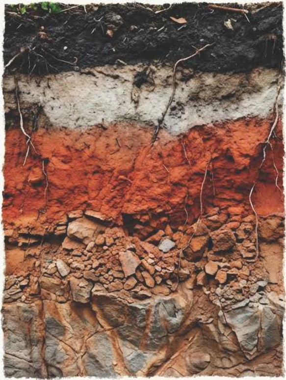
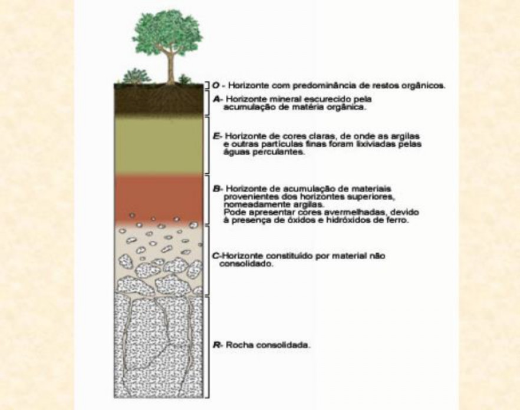
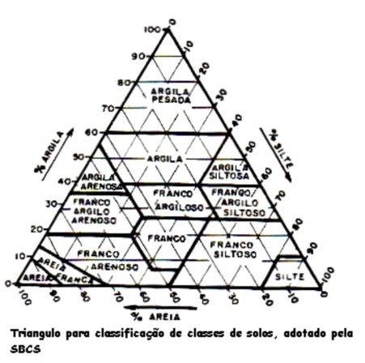
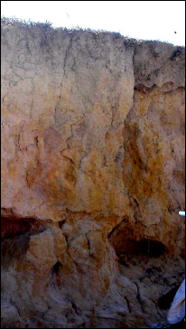
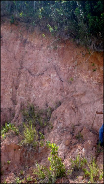

# Solos Tropicais: Formação e Propriedades {#sec-solos-tropicais}

## O Solo como Sistema Aberto

Antes de projetar qualquer intervenção de bioengenharia, é indispensável compreender o material sobre o qual se trabalha. O solo não é uma massa inerte de partículas minerais; trata-se de um sistema aberto termodinâmico que troca continuamente matéria e energia com a atmosfera, a biosfera, a hidrosfera e a litosfera. Imagine o solo como uma "fábrica viva" que recebe água da chuva, gases da atmosfera, resíduos orgânicos e libera sedimentos dissolvidos, gases (como CO₂) e nutrientes em solução.

Em regiões tropicais, a intensidade dessas trocas é amplificada pela temperatura elevada (média anual > 20 °C) e pela abundância de água (precipitação acumulada frequentemente superior a 1.200 mm/ano), resultando em solos profundamente intemperizados e com características únicas. Essa combinação confere aos solos tropicais um conjunto de propriedades que os distingue radicalmente dos solos de regiões temperadas, com implicações diretas para o projeto de estruturas de bioengenharia.

## A Equação de Jenny

A formação do solo é um fenômeno complexo cuja compreensão exige considerar múltiplos fatores atuando simultaneamente. A equação fatorial proposta por @jenny1941 sintetiza esse entendimento, conforme ilustrado na @fig-jenny.

{#fig-jenny fig-alt="Diagrama dos fatores de formação do solo de Jenny" width="80%"}

Matematicamente, qualquer propriedade do solo ($S$) pode ser expressa como função dos cinco fatores de formação:

$$
S = f(cl, o, r, p, t, \ldots)
$$

onde $S$ é a propriedade do solo (textura, cor, CTC, profundidade, etc.), $cl$ representa o clima (precipitação e temperatura, que controlam a intensidade do intemperismo), $o$ corresponde aos organismos (vegetação, fauna do solo, microrganismos que reciclam matéria orgânica), $r$ é o relevo (que governa o escoamento da água e a redistribuição de sedimentos ao longo da encosta), $p$ indica o material de origem (a rocha-mãe fornece os minerais primários a partir dos quais o solo é formado) e $t$ é o tempo (solos tropicais bem desenvolvidos possuem idades da ordem de milhões de anos). O termo $\ldots$ reconhece fatores adicionais, sobretudo a ação antrópica.

Na prática, a equação de Jenny ensina que dois solos formados sob o mesmo clima, relevo, material de origem, biota e tempo terão propriedades semelhantes. Por isso, quando se identifica, por exemplo, um Latossolo Vermelho em duas regiões distintas do Cerrado brasileiro, espera-se comportamento geotécnico e erodibilidade comparáveis, o que permite transferir experiências de bioengenharia entre localidades análogas.

::: {.callout-note}
## ClORPT
O acrônimo ClORPT é uma forma didática de memorizar os fatores de formação do solo: Clima, Organismos, Relevo, Parent material (material de origem) e Tempo. Nos trópicos, o clima (especialmente a precipitação) e o tempo são os fatores dominantes, o que explica o intemperismo avançado mesmo sobre diferentes tipos de rocha.
:::

## Reator Biogeoquímico

Para entender por que os solos tropicais são tão diferentes dos solos de regiões frias, é útil pensar no solo como um reator biogeoquímico, conforme esquematizado na @fig-reator.

{#fig-reator fig-alt="Esquema do solo como reator biogeoquímico" width="80%"}

Neste reator, quatro processos fundamentais operam simultaneamente. O processo de adição incorpora matéria orgânica pela deposição de serrapilheira, poeira atmosférica e solutos trazidos pela chuva. O processo de remoção retira material por lixiviação (percolação de água que dissolve e carrega íons), erosão superficial e extração por colheitas agrícolas. A transformação converte minerais primários em minerais secundários (argilas e óxidos) por reações de hidrólise, oxidação e redução, além de decompor matéria orgânica em húmus. Por fim, a translocação redistribui materiais internamente, movendo argilas de horizontes superiores para inferiores (fenômeno chamado eluviação/iluviação) e revolvendo o solo por atividade de organismos (bioturbação por minhocas, cupins e formigas).

Em regiões tropicais, as taxas de transformação são significativamente maiores devido à temperatura e umidade elevadas. Cada aumento de 10 °C na temperatura aproximadamente duplica a velocidade das reações químicas (Lei de Arrhenius). Isso resulta em três consequências fundamentais para a bioengenharia: a decomposição rápida da matéria orgânica (meia-vida inferior a 5 anos, contra 15–25 anos em zonas temperadas), a alta taxa de neoformação de argilas cauliníticas (minerais de baixa atividade) e a concentração residual de óxidos de ferro e alumínio pelo processo de laterização (que confere as cores vermelhas e amarelas características).

## Perfil do Solo Tropical

Um conceito essencial para quem projeta intervenções de bioengenharia é o de perfil do solo, que consiste na sequência vertical de camadas (chamadas horizontes) que se desenvolvem desde a superfície até a rocha-mãe inalterada. Cada horizonte possui propriedades distintas de cor, textura, estrutura e composição química, e essas diferenças determinam como a água se infiltra, como as raízes se desenvolvem e onde o solo é mais suscetível a rupturas.

A @fig-perfil apresenta um perfil típico de solo tropical, onde é possível observar a transição gradual desde a matéria orgânica superficial até o material parental inalterado em profundidade.

{#fig-perfil fig-alt="Perfil de solo tropical com horizontes" width="70%"}

A representação esquemática dos horizontes e suas transições é detalhada na @fig-horizontes, que permite visualizar as nomenclaturas padronizadas utilizadas em levantamentos de solo.

{#fig-horizontes fig-alt="Esquema dos horizontes do solo" width="70%"}

O perfil típico de um solo tropical bem drenado apresenta a sequência descrita na @tbl-perfil. Note que a espessura total do perfil pode ultrapassar 10 metros em Latossolos, enquanto em Neossolos Litólicos (solos rasos de encostas íngremes) pode ser inferior a 50 cm, condição que exige estratégias de bioengenharia completamente distintas.

| Horizonte | Profundidade típica | Características |
|-----------|-------------------|----------------|
| O | 0–5 cm | Serrapilheira em decomposição; protege contra o impacto direto das gotas de chuva |
| A | 5–30 cm | Matéria orgânica humificada, cor escura; zona de maior atividade biológica e radicular |
| B | 30–200+ cm | Argilas cauliníticas, óxidos de Fe/Al, cor amarela a vermelha; horizonte diagnóstico |
| C | 200–1000+ cm | Saprolito (rocha parcialmente intemperizada); preserva estrutura da rocha original |
| R | > 10 m | Rocha-mãe inalterada |

: Perfil esquemático de um solo tropical profundo (Latossolo). {#tbl-perfil .striped}

Para a bioengenharia, a distinção entre horizontes é crítica. O horizonte A, rico em matéria orgânica e raízes, é o que se busca preservar ou reconstituir. O horizonte B, frequentemente espesso e laterizado, pode apresentar coesão aparente (estável quando seco, mas colapsável quando saturado), o que torna fundamental o controle da drenagem superficial e subsuperficial. Quando a erosão atinge o horizonte C ou mesmo o R, a recuperação é muito mais complexa e onerosa.

## Propriedades-chave para Bioengenharia

### Textura e Estrutura

A textura do solo (proporção relativa de areia, silte e argila) é uma das propriedades mais importantes para o projeto de bioengenharia, pois influencia diretamente a erodibilidade, a capacidade de infiltração e a resistência ao cisalhamento. A classificação textural é realizada com auxílio do triângulo textural, apresentado na @fig-triangulo.

{#fig-triangulo fig-alt="Triângulo textural de classificação de solos" width="65%"}

Para interpretar o triângulo textural, localiza-se o ponto de interseção entre as três frações granulométricas (obtidas por ensaio de granulometria em laboratório), e a classe textural resultante orienta as decisões de projeto. Os solos arenosos (fração areia > 70%) apresentam alta taxa de infiltração (> 50 mm/h), porém baixa coesão entre partículas, tornando-os altamente susceptíveis ao desenvolvimento de ravinas por escoamento concentrado. Os solos argilosos (fração argila > 35%), em contrapartida, possuem baixa taxa de infiltração (< 10 mm/h) e alta coesão quando secos, mas oferecem risco de deslizamento quando saturados, pois a água nos poros gera poropressão positiva que reduz a tensão efetiva. Já os solos siltosos são considerados os mais erodíveis, pois combinam baixa coesão entre partículas com baixa permeabilidade, o que gera escoamento superficial intenso capaz de transportar grandes volumes de sedimento.

### Fator de Erodibilidade (K)

Para quantificar objetivamente a susceptibilidade intrínseca de um solo à erosão (independentemente da chuva, do relevo ou do uso do solo), utiliza-se o fator $K$ da RUSLE [@renard1997]:

$$
K = 2{,}1 \times 10^{-4} \cdot M^{1{,}14} \cdot (12 - a) + 3{,}25 \cdot (b - 2) + 2{,}5 \cdot (c - 3) \div 100
$$

onde $M$ representa o produto $(\% \text{silte} + \% \text{areia fina}) \times (100 - \% \text{argila})$, $a$ corresponde ao teor de matéria orgânica (%), $b$ indica a classe de estrutura do solo (1–4, sendo 1 = granular muito fina e 4 = blocos, laminar ou maciça) e $c$ refere-se à classe de permeabilidade (1–6, sendo 1 = rápida e 6 = muito lenta).

Em termos práticos, solos com alto teor de silte e areia fina (elevado $M$) e baixo teor de matéria orgânica (baixo $a$) resultam em valores de $K$ elevados (alta erodibilidade), o que demanda maior proteção superficial pelas técnicas de bioengenharia. Solos tropicais laterizados tendem a apresentar $K$ moderado (0,02–0,04 t h MJ⁻¹ mm⁻¹) graças à microagregação conferida pelos óxidos de ferro, apesar do altíssimo teor de argila.

### Resistência ao Cisalhamento

A estabilidade de encostas e taludes depende fundamentalmente da resistência ao cisalhamento ($\tau$) do solo, descrita pelo critério de Mohr-Coulomb:

$$
\tau = c' + (\sigma - u) \tan \phi'
$$

onde $c'$ é a coesão efetiva (força de ligação entre partículas), $\sigma$ é a tensão normal total (peso do solo acima do plano de ruptura), $u$ é a poropressão (pressão exercida pela água nos poros, que "empurra" as partículas e reduz o atrito entre elas) e $\phi'$ é o ângulo de atrito interno efetivo (resistência ao deslizamento entre partículas). Quando a poropressão ($u$) aumenta (por exemplo, durante chuvas intensas que saturam o solo), a tensão efetiva $(\sigma - u)$ diminui, a resistência ao cisalhamento cai e o talude pode romper. Esse é o mecanismo fundamental dos deslizamentos em encostas tropicais.

A bioengenharia intervém diretamente nessa equação. A presença de raízes aumenta a coesão do solo, adicionando um termo $c_r$ (coesão radicular) à coesão efetiva. O incremento de coesão radicular pode ser estimado pelo modelo de Wu-Waldron:

$$
c_r = t_R \cdot \frac{A_r}{A} \cdot (\sin \theta + \cos \theta \cdot \tan \phi')
$$

onde $t_R$ é a resistência à tração das raízes (quanto uma raiz individual resiste antes de romper, medida em kPa), $A_r/A$ é a razão de área radicular (proporção da seção transversal do solo ocupada por raízes) e $\theta$ é o ângulo de distorção das raízes em relação ao plano de ruptura. Dessa forma, quanto maior a densidade de raízes e quanto mais resistentes elas forem, maior será o incremento de coesão e, portanto, maior a estabilidade do talude.

::: {.callout-tip}
## Valores típicos
Em solos tropicais com vegetação herbácea estabelecida (como gramíneas Vetiver ou Brachiaria), o incremento $c_r$ varia tipicamente de 5 a 25 kPa, podendo alcançar 40 kPa em solos com sistema radicular arbóreo denso. Para contexto, uma coesão de 10 kPa já pode significar a diferença entre um talude estável e um deslizamento em encostas com inclinações entre 30° e 45°.
:::

## Principais Classes de Solos Tropicais

A classificação do solo é uma ferramenta fundamental para o engenheiro que projeta intervenções de bioengenharia, pois cada classe de solo apresenta comportamento geotécnico, erodibilidade e resposta hidrológica distintos. No Brasil, o Sistema Brasileiro de Classificação de Solos (SiBCS) identifica dezenas de classes, mas seis delas concentram a maioria dos desafios enfrentados em projetos de estabilização e controle de erosão. A @fig-latossolo e a @fig-argissolo ilustram as duas classes mais frequentes em projetos de bioengenharia no Brasil tropical.

::: {layout-ncol=2}
{#fig-latossolo fig-alt="Perfil de Latossolo Amarelo"}

{#fig-argissolo fig-alt="Perfil de Argissolo Vermelho-Amarelo"}
:::

O Latossolo (@fig-latossolo) é o solo mais representativo dos planaltos tropicais brasileiros, ocupando cerca de 39% do território nacional. Trata-se de um solo profundo (frequentemente > 5 m), homogêneo, bem drenado e com alta agregação conferida pelos óxidos de ferro e alumínio. Apesar de sua estabilidade estrutural, quando desprovido de cobertura vegetal, o Latossolo é altamente erodível pela exposição direta ao impacto das gotas de chuva, que desagregam os microagregados superficiais. Em projetos de bioengenharia, a prioridade é a proteção da superfície (cobertura vegetal, biomantas, palhada) e a reconstrução da camada orgânica.

O Argissolo (@fig-argissolo) apresenta um gradiente textural acentuado entre os horizontes A e B, com aumento expressivo no teor de argila em profundidade. Esse gradiente cria uma descontinuidade hidráulica que pode gerar lençol suspenso em períodos chuvosos, condição que favorece deslizamentos translacionais. A interface entre os horizontes A e B concentra a maior parte das rupturas, e o projeto de bioengenharia deve priorizar a drenagem subsuperficial e a ancoragem radicular profunda.

A @tbl-classes sintetiza as seis principais classes de solos tropicais e suas implicações para projetos de bioengenharia, servindo como referência rápida para a seleção de técnicas adequadas a cada situação de campo.

| Classe (SiBCS) | WRB equivalente | Ocorrência | Relevância para bioengenharia |
|-----------------|-----------------|------------|-------------------------------|
| Latossolo | Ferralsol | Planaltos bem drenados | Estáveis quando cobertos, mas altamente erodíveis quando expostos; proteção superficial prioritária |
| Argissolo | Acrisol/Lixisol | Encostas e tabuleiros | Gradiente textural favorece deslizamentos; drenagem subsuperficial essencial |
| Plintossolo | Plinthosol | Áreas de flutuação do lençol | Endurecimento irreversível ao secar (petroplintita); limita o enraizamento profundo |
| Neossolo Litólico | Leptosol | Encostas íngremes | Rasos (< 50 cm); alta susceptibilidade à erosão e deslizamento |
| Cambissolo | Cambisol | Relevos ondulados | Jovens e heterogêneos; propriedades variáveis exigem investigação local |
| Gleissolo | Gleysol | Várzeas e planícies | Hidromórficos, saturados e compressíveis; exigem espécies tolerantes a alagamento |

: Principais classes de solos tropicais e sua relevância para projetos de bioengenharia. {#tbl-classes .striped .hover}
